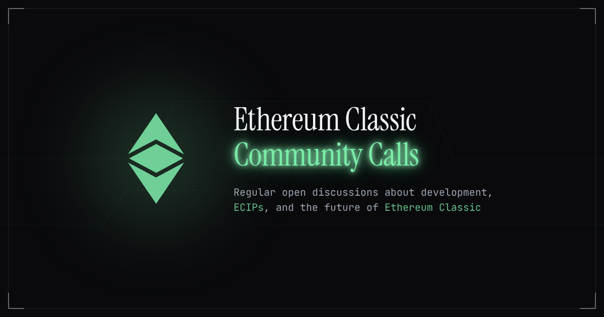

<div align="center">



# ETC Community Calls

Regular open discussions about Ethereum Classic development, ECIPs, and the future of ETC.

[cc.ethereumclassic.org](https://cc.ethereumclassic.org)

</div>

## Contributing

Contributions are welcome! To add or update call information:

1. Fork this repository
2. Add/edit markdown files in the `calls/` directory
3. Submit a pull request

Call files use YAML frontmatter for metadata (title, date, time, etc.) and markdown for the description.

## Development

```bash
# Install dependencies
npm install

# Start dev server
npm run dev

# Build for production
npm run build
```

## License

MIT License - see [LICENSE](LICENSE) for details.
