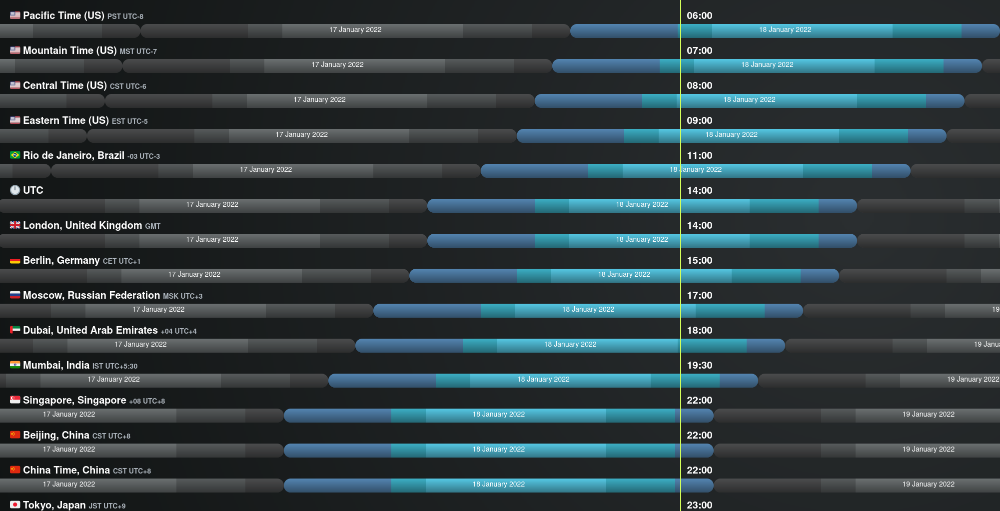

## Attention

This call is scheduled at 1400 UTC, which is 1 hour earlier than usual!

## Description

A casual voice chat to discuss ideas for ETC. All are welcome.

The ETC Discord can be joined at https://ethereumclassic.org/discord

Please join us in the #community-calls channel ask questions or bring up topics.

This week we are joined by Cody Burns aka DontPanicBurns, to discuss The Multisig Fund and other ETC Topics. If you have questions for Cody please post them in the [#community-call-notes > Questions for Cody discord channel](https://discord.com/channels/223674353001168906/928815005263102044). 

## Agenda

- Check In
- Housekeeping
- Q&A w/ Cody
- Open Discussion

## Status

- Completed
- Attendees: ~15
- Duration: 50 mins
- Recording: https://www.youtube.com/watch?v=GlRpBhsN7Ck

## Housekeeping

From now on we'll be creating a new thread for each call one week before it starts, so it's easier to contribute questions if you are in the discord. You'll be able to find thoe threads in the community-call-notes channel.

We are looking for volunteers to can help us with approving content on the ETC website. To maintain quality assurance, each change to the website requires the approval of 3 moderators, which can sometimes take several days to coordinate if they aren't online, and we want to reduce the time this takes in future so we need more mods. It's pretty easy work, mostly just spot checking new apps and other content submitted by other users via pull requests - if have a github account and would like to help out with that let us know on Discord.

## Questions

- Who is Cody Burns, what is his backstory, and how does he relate to Ethereum Classic?

### Community Fund

- Can you give our listeners a quick history of the multisig fund and what it's role is?
- What is the signature threahold for spending funds in the multisig?
- "I think the main concern is whether the contract still works. Take say 1 ETC out of the fund and then put it back in or something. We trust the 6 keyholders."
- Are you worried that any of the key holders might be inactive?
- Do you think there should be new/rotated keyholders?
- Should the multisig contract or procedure be changed in any way for technical or social reasons?
- Should the funds be left alone to gather more value before spending?
- What do *you* think the funds should be used for?
- Thoughts on experimenting with a DAO structure for some of the funds, how might it be structured?
- What are your thoughts on the Protocol Layer Treasury debate and Withdrawal Announcement?

**Opportunity for audience to ask question RE: Community Funds**

### Top Picks

- Is ETC a sinking ship?
- What do you want to see happen next on ETC?
- Could you share your perspective on the stuff that happened with ETC Labs? Would any of those folks ever restart the Lab?
- Mystique Fork, doesn't it break Code is Law?
- What do you see as ETC's biggest technological weakness? How can that area be improved upon? 
- Have you changed your mind about NFTs? What happens to NFTs in case of a chain split? What other use cases do you see for transfer of ownership and information? 
- I am still waiting for my smart contract door opener for my Airbnb. The slock.it boys tried... Is this still something appropiate for chains like ETC? The properties the ETC chain guarentee are appropiate for what type of apps & industries in your opinion as a blockchain architect? In general, seems we are at a crossroad where the crypto industry creates the tools either for wikileak/freedom or for WEF/CCP/surveillance state.
- What has changed in 2021 regarding supply chains comparing with previous years. Are blockchains changing businesses for the better? Are old industries ready for adoption?

**If time, opportunity for audience to ask any questions**

### All General Questions

- Versioning 
- An ETC Constitution
- What do you want to see happen in 2022 on ETC?
- The SHA3 switch & Secret ASICs
- Could you share your perspective on the stuff that happened with ETC Labs? Would any of those folks ever restart the Lab?
- What's your look into the future in regards to stability, expansion/reach and possible key role in the defi world, for Ethereum Classic?
- What's chipper robotics roadmap for etc
- Do you still have a small robot which is controlled by smart contract puttering around in your kitchen?
- What do you see as ETC's biggest technological weakness? How can that area be improved upon? 
- What, in your opinion, has the ETC community gotten right so far? And where has the community fallen short?
- I am still waiting for my smart contract door opener for my Airbnb. The slock.it boys tried... Is this still something appropiate for chains like ETC? The properties the ETC chain guarentee are appropiate for what type of apps & industries in your opinion as a blockchain architect? In general, seems we are at a crossroad where the crypto industry creates the tools either for wikileak/freedom or for WEF/CCP/surveillance state.
- Digital retail companies are starting using blockchains for food traceability purposes. Will this trend continue for other products?
- The Hyperledger Foundation is providing supply chains and ways of sustainability in the real world domains. How much has the industry grown and how are private network evolving comparing to open-public networks?
- What has changed in 2021 regarding supply chains comparing with previous years. Are blockchains changing businesses for the better? Are old industries ready for adoption?
- Can you explain how Hyperledger is used in supply chains for airplanes and military, because we know that the supplies that are being tracked are worth millions of dollars?
- Would you compare the blockchain adoption that is happening now with the internet adoption?
- How much efficiency can tokenization bring for supply chains?
- Would you agree that technology is now scalable and has achieved mainstream adoption in an accelerated manner? What examples from the industry do you like? 
- Have you changed your mind about NFTs? What happens to NFTs in case of a chain split? What other use cases do you see for transfer of ownership and information? 
- Can you explain verifiable credentials in smart contracts, maybe give us some examples from the industry?
- How far are we from automation blockchain with smart contracts for industrial robots?
- The Hyperledger Besu is a great client that can connect permission private networks with permissionless blockchains, which means that consumers can participate. Do you see ETC attracting business development from the private sector? 
- The negative interest rates are affecting fiat and also stable coins. Do you see a potential danger for the crypto environment, can innovation be stopped in this field?
- Will blockchain bring an extending role of the dollar on the internet. Can we a expect a Trans-Atlantic alignment and joined regulatory framework for stable coins in the near future, because it seems that innovation is stagnating in comparison to Est-en countries, like China?
- Do you see a rising demand for stable coins, could ETC be part in this ecosystem that is being build as a layer foundation for faster inter-operability between states?
- Are CBDC a necessity at this stage for crypto in general?
- To your knowledge, how is the military using smart contracts? Just curious. 

## Status

- Scheduled



---

## Full Transcript

```webvtt
WEBVTT

NOTE no-names

1
00:00:02.560 --> 00:00:08.150
classic community call number nine on the 18th of january 2022.

2
00:00:04.880 --> 00:00:26.150
edc community calls is a weekly voice chat that happens on the ethereum classic community discord server every tuesday usually at 1500 utc the content of these calls is decided by the etc community each week anyone can submit questions and topic suggestions about anything related to ethereum classic you can join the

3
00:00:24.000 --> 00:00:45.110
edc discord by visiting ethereumclassic.org discord this chat is held in the community calls channel these calls are recording at recorded and uploaded to youtube where you can subscribe like and share today we're joined by a special guest cody burns to discuss the etc multisig community fund as well as various

4
00:00:43.440 --> 00:01:04.390
other topics related with inner classic i've been collecting questions from the community this week and have a few lined up but there will be opportunity later on to talk directly to cody and ask questions if you're in the voice chat uh cody's joining us for 30 minutes this week but we'll continue on afterwards to continue discussion so uh cody thanks for joining us hello how

5
00:01:02.239 --> 00:01:23.590
are you doing hey thanks for having me happy to be here uh good to be back in etc land that's great so just for uh the the listeners um first question is who is cody burns what's his backstory and how does he relate to ethereum classic sure so uh normal

6
00:01:21.360 --> 00:01:42.710
story blockchain architect innovator mba entrepreneur uh as far as etc i got involved uh with blockchain back in 2015 uh when bitcoin was the first thing i was into so really love the ethos around it um the

7
00:01:40.479 --> 00:02:00.550
technology itself is was really fascinating to me at the time ethereum was just starting to get its legs at that time so uh the concept of being able to build smart contracts or have some code out there on the internet that you could interact with and and execute and you know what was executing uh it

8
00:01:58.399 --> 00:02:19.430
was just really cool so i got deep into a theory fell in love with it uh then the dow hack happened and it was just a weird time so uh i definitely believed in uh division of etc of that you shouldn't be able to change what happened on the blockchain and uh so helped with working

9
00:02:17.599 --> 00:02:38.630
the code out and working with the first etc teams getting everything built up and having our own client and so it was it was a fun time a lot of learning awesome here we are later doing doing amas still yeah pretty cool and what are some of the things you've uh

10
00:02:35.440 --> 00:02:56.150
done on etc or with etc i know you were at some previous conferences speaking there but in terms of uh building stuff what have you been working on uh so it's been a long time since i've built anything on etc really but so i guess my role has been mostly as an advisor

11
00:02:54.239 --> 00:03:15.270
to the different tech teams that have been uh the stewards of etc whether it's the labs or edc dev or the co-op so i sit on the board of the co-op and uh give guidance to bob i guess is the best way to describe it if whenever he's looking for someone in the blockchain

12
00:03:13.680 --> 00:03:33.910
space to talk to my day job is i'm a enterprise blockchain architects so i build systems for for large companies that are doing uh trade and track and trace or identity or looking at how they can use this to better their business models awesome so

13
00:03:32.879 --> 00:03:53.270
um let's jump into the uh community fund um and i guess from from your perspective i'm i'm also kind of fuzzy on exactly what it is and where it came from so could you give us a quick history of what exactly the multisig fund is what should we be calling it and uh what what's the role that

14
00:03:51.040 --> 00:04:11.830
it was created for ah that's a good question it's a weird history i guess uh so when whenever the initial dow split happened there was a bunch of supporters for ethereum classic and they all wanted to to see it not die so they uh everyone from mining pools to uh just

15
00:04:10.000 --> 00:04:30.070
different groups wanted to give money to the community of etc so it could build out software see projects come in uh have infrastructure and do all kinds of cool things but there wasn't any good way to spend it so there was an address on one of the first ethereum classic pages so that address became

16
00:04:28.320 --> 00:04:50.310
the donation address it was a single key address that one person held for the first three years probably and then uh etc had its first big price spike back in 2017 maybe so maybe it wasn't that long that one person held it uh but anyway the price spiked up the funds were worth i

17
00:04:47.040 --> 00:05:07.749
think 300 000 at the time and there was no good clear path of how do we decide what's what's the project that we want to fund or what's something that this money should go for and how do we even find this anonymous person that's holding this key with all the money in it so uh at the time there was five people that were really

18
00:05:05.440 --> 00:05:27.590
active that weren't associated directly with any of the development teams so not in the co-op not working for etc and so we all agreed that we would hold the keys and at the time we were waiting on a platform to be built out that was going to be kind of a play store for for dabs or projects they could stand up dials but

19
00:05:25.120 --> 00:05:47.430
that project never came so the keys just kind of got held since that time and i don't think there's anything in place right now that would that would be a good way of managing grants or uh letting the community vote and have their voice on on what that fund is or where those funds go right

20
00:05:44.960 --> 00:06:05.029
yeah that is uh one of the tricky parts of this whole thing and we'll get into some of the uh potential future use cases um with regards to the contract itself is is that a specific library that was used uh is it a custom multi-sig implementation and how many signatures

21
00:06:03.280 --> 00:06:23.909
are required to spend the funds in that uh it was a standard contract at the time uh dexteran had done an audit of it and that you should be able to find that somewhere on google i remember correctly it's three out of the five have to sign okay cool and

22
00:06:22.319 --> 00:06:42.629
uh i guess the one of the reasons that we're having this call is because previously it was brought up that uh it's been a while since it's been tested and one of the questions that we got from the community was uh as follows i think the main concern is whether the contract still works take one etc out of the fund and then put it back or something we trust the key holders

23
00:06:42.639 --> 00:07:04.309
and it's kind of a loaded statement do we even know who all the key holders are anymore or where they're at i mean i'm still active in the community and i can name probably two or three of the other key holders but uh i don't even know where all of them are to be honest there's there's a lot of questions around i guess if the funds want to be used or yeah

24
00:07:01.680 --> 00:07:22.710
is there uh is there any is there any reference to who the key holders were and how to potentially reach out to them or at least get them to sign something yeah there was i can look for it i know uh anthony had written an article whenever we had first uh decided

25
00:07:20.319 --> 00:07:41.430
to move to this multisig and discusses everybody that was involved okay i think it was on reddit but i'm not sure three out of five and i guess at least you can guarantee two of those are active getting one more is probably not going to be a big problem i would imagine so in terms of losing access

26
00:07:39.440 --> 00:07:59.749
it's not really a worry yeah that's good to know in in terms of like going forward with this and obviously as time progresses more people might become inactive uh should should there be some kind of system in place that rotates the keyhole doesn't

27
00:07:57.680 --> 00:08:19.749
make sure make sure they're available such that uh we never do lose access to that uh i think the wallet that support right now doesn't have the option to to rotate key holders but yeah i think that the good plan overall but i think more the governance around what the funds get used for is probably a

28
00:08:17.199 --> 00:08:37.350
good topic to talk about right now the people who are the key holders they're not here it's uh well most of them aren't here i guess this is a good way of saying and maybe that's a good way to have it if where they're unrelated no one knows who they are you'd have to go track them down so it's it's harder to steal the funds maybe

29
00:08:35.680 --> 00:08:56.550
but there needs to be something in place to get the funds used to make sure that's going towards the right place i think yeah i i also agree with that yeah and i think making sure that you can update it as needed updated as needed as in the contract code itself or yeah so the the daily

30
00:08:54.560 --> 00:09:15.590
spend limits uh who the actual owners are being able to rotate those even if it's based off of a vote of the other members or something like that got it i'm aware that certainly it's visible there are some contracts like the the gnosis multisig i believe has some pretty good options in terms of like

31
00:09:13.680 --> 00:09:35.829
daily limits and that kind of stuff so depending on the number of keys uh that are used to sign the more or less can be withdrawn at any given time to add some extra security yeah do you have as you were there during the early like formation of this thing was there any sort of indication of what the

32
00:09:33.279 --> 00:09:55.110
funds were supposed to be like used for going forward and was the idea to speculate on the price of etc as well not that i can remember i don't think there was a clear direction whenever we had set this up it was going to be we were holding the funds in this this wallet until a system was built where we could the community could vote on

33
00:09:52.800 --> 00:10:15.110
projects like i said the the original project fell through and no one ever picked up and and carried on about that time the labs came around and said we don't need the money we have our own money uh we'll build out our own systems so there wasn't a big a big push for hey we need this we need to fund projects rollout

34
00:10:12.079 --> 00:10:34.550
did you want to jump in there yes i remember you saying that at some point um dev a deaf team needed funds but uh there wasn't any mechanism for uh for helping them fund

35
00:10:31.200 --> 00:10:51.269
and support the team yeah uh so etc dev team famously ran out of money at one point during this and then got sold out to the labs and caused that whole unraveling and uh we had money sitting in the community fund but there wasn't a clear path of of what

36
00:10:49.920 --> 00:11:11.750
the money should be used for or how to get it out to to give it to the team to support them or even if that was a worthwhile uh reason to use the money to support was to support the court f team which looking back is pretty terrible one of our main development teams went out of business pretty much and we had fun sitting there that could have saved them very

37
00:11:09.519 --> 00:11:30.470
interesting it sounds similar to the the treasury uh debate in a way yeah yeah and the funds themselves once we took it out of the single person holding the key uh to all of them we took the address down off all the websites and it was it was really just kind of held as a savings for whenever the community

38
00:11:29.040 --> 00:11:50.069
did get to a place where they could spend it so that's why there's not active contributions but whenever it was active there was money going in and mining pools were putting money towards it so there's definitely interest in supporting the community okay so um let's say uh it seems like in order to unlock those funds

39
00:11:48.240 --> 00:12:10.389
it would make sense to have some kind of structure in place that allowed the community in some way to vote on what things make sense to spend money on and one obvious structure for that would be some kind of dow did you have any thoughts on how a dow might be structured for this kind of thing no but it does seem like a thing that dowser

40
00:12:07.600 --> 00:12:28.710
fit for and it would be pretty ironic if dallas would ended up saving ethereum classic after it's what created it in the first place but this is 2022 it's not 2016 where all the code was new and everything was the wild west it's there's plenty of dallas out there now that have a funding strategy

41
00:12:25.760 --> 00:12:46.629
and uh business models built around them so it's definitely something that i think could be pursued there's platforms out there to support it and everything seems like it kind of in place yeah i think in terms of libraries that could be used there's a lot more mature options than there used to be for sure the

42
00:12:45.040 --> 00:13:06.470
biggest problem i think though with any dow is deciding who gets to vote and the initial seeding of responsibility so how might that work do you think you mean with community fund wallet going into it or just in general yeah well i i mean you could start it down

43
00:13:03.279 --> 00:13:26.310
from fresh and have people uh like donate etc in order to get voting rights but then that doesn't really use the uh the existing funds so how do you foresee making making a structure that's fair for the community and also allowing people to have input around

44
00:13:24.320 --> 00:13:44.710
it i guess uh i'm sure it'd be possible to just donate all the money and not have a voting share to uh to another contract just set up a function where it can go in with with no voting rights but i think the i guess fundamentals around the dow would have to be worked out of how much goes towards crowd sale or how much comes

45
00:13:43.279 --> 00:14:04.470
from just uh the treasury going to and how much funds can be spent at one for and for what reasons so yeah i think that would be a good path but there's some thought that needs to be put around it yeah that's i'm a good guy to uh reach out to for that i'll probably detail some of that later next week perfect thanks

46
00:14:02.160 --> 00:14:22.230
there might also be called time after this 30 minutes to to bring that up as well to discuss a question that i have regarding the community fund would you agree that uh vote delegation could

47
00:14:18.720 --> 00:14:39.590
uh speed up the use of funds and maybe seeing uh results you mean as far as just getting money out to projects that need it yes yes yeah i mean i think that's been the biggest problem is there's no way to to really represent the community voice i mean is that do

48
00:14:38.320 --> 00:14:59.590
you spend a hundred thousand dollars off a twitter poll or is it a new project shows up and say hey i have this great idea and was like here take all the money just been holding it for years yeah this is how much to which project so i mean there's a lot of questions around it and that's probably why it's never been used as

49
00:14:57.279 --> 00:15:17.590
kind of a piggy bank yeah i would also i would also be cautious about uh um having everything go into any one solution like a dow and it would make more sense i think to like incrementally test things slowly and if things break it's not like game over one

50
00:15:17.600 --> 00:15:38.790
one idea that i had was that the community fund could be first spent in a way that would make a software odd audit possible you know so you build a mechanism that will verify what

51
00:15:34.880 --> 00:15:56.629
comes after it i mean but we have the environment's also a little different now the co-op exists i mean the funds could all just be given to the co-op and they do transparent financing it seems like they would have everything in place that would be needed for for funding projects and be able to give

52
00:15:54.720 --> 00:16:16.790
out money legally so i guess the question is what's the benefit of doing it on on the blockchain that's a good point did you have any thoughts about the idea of having some kind of fund that's dedicated purely for minimum client maintenance such that etc can

53
00:16:14.480 --> 00:16:35.110
guarantee that at least one client will be like developed for x number of years uh i don't know that's a tricky question how much does it cost to fund one client for for x number of years eventually we're going to run out of the time where the upstream geth is still supported

54
00:16:32.639 --> 00:16:54.790
or uh asu operates the way that it does now so at some point it's ethereum classic is going to have to either build their own client or just accept that nothing else is coming from upstream and continue maintaining it so for now the co-op is has

55
00:16:52.000 --> 00:17:12.069
all the developers again so they're all under under one building and it seems like funding there is is pretty set for a while there a point in funding multiple clients do we need three clients or four clients uh or is just

56
00:17:10.480 --> 00:17:31.750
go with the bitcoin model of having one and the other clients are nice and but if they don't match with the one true version of of bitcoin d then they're just out of sync so ethereum classic could do the same thing and say this is our version of multi-geth if it you either use it or you're just not on ethereum classic that's that's

57
00:17:29.760 --> 00:17:50.390
also a reasonable approach i think i don't think we have the the means to support three different clients yeah i agree with that for sure um the uh the bitcoin model seems like a successful one to emulate on on i guess the topic of future maintenance

58
00:17:47.679 --> 00:18:08.390
do you see i guess after the merge how long do you think ethereum classic should attempt to maintain full compatibility with ethereum and in what way do you think there should be some kind of disconnect i think in the next couple years ethereum classic is going to have a lot of challenges uh and

59
00:18:08.400 --> 00:18:29.270
it's been good to be associated with the mainnet ethereum for now i mean i guess but i think having being ethereum classic also carries a lot of baggage i mean there's a lot of blockchains that have come up from nothing to top 10 blockchains in the time that ethereum classics existed and there's always

60
00:18:26.400 --> 00:18:48.150
been kind of i guess you have to choose sides between ethereum and ethereum classic so rebranding might be a good thing at some point for for etc uh but as far as how long pulling in new features from ethereum development itself is going to work i mean as

61
00:18:45.760 --> 00:19:06.070
as long as they support the original client it's still possible but it's just not that exciting i mean there's there's got to be a reason for the blockchain to exist other than it's six years ago we made a decision not to do one hard fork yep that makes sense and i think uh part of

62
00:19:03.919 --> 00:19:24.390
that is maintaining the narrative of cody's law and all the good things that we're here for i i'm gonna ask one more pre-aligned question um and due to time i will then open up for everyone else if they want to jump in but just uh to kind of wrap a few together uh where what

63
00:19:23.200 --> 00:19:43.270
do you if you could write a road map for ethereum classic right now what would be things on the horizon for you uh money was no object and we had all the the talent and technology in the world uh the biggest problem i think that ethereum classic has is the size of the blockchain itself

64
00:19:40.960 --> 00:20:02.789
uh so doing something like recursive snarks like uh there's a project called mina that their entire blockchain stays 22 kilobytes and i think that's huge in the future being able to validate the past transactions without having to carry the weight of standing up a server

65
00:19:59.600 --> 00:20:22.390
that has 300 400 gigs worth of just data that you're never going to use that would be a big one moving from the dev pdp wire protocol to lib p2p so something more in line with ipfs and the wider distributed

66
00:20:19.600 --> 00:20:40.070
system stack would be something on the list and what else uh i don't know raising the price it costs to deploy contracts would probably be my third if i had to pick but the reduce bloat by just making it expensive to deploy contracts cool

67
00:20:37.679 --> 00:20:59.590
thanks for that um any thoughts on versioning uh you mean as far as the evm versioning so you could tell when code was deployed and what what rules it should operate under i think that that would be a would be a good thing to have in etc if you look at newer blockchains that are coming out polka

68
00:20:56.400 --> 00:21:18.710
dot has the the same concept of versioning or runtime engines with as contracts are deployed so it's definitely good for future proofing that's great thanks um and with the last few minutes um uh would anyone else like to pose any questions

69
00:21:13.600 --> 00:21:35.029
uh the floor's open not really related to adc but the blockchain industry first of all we see digital retail companies

70
00:21:32.640 --> 00:21:53.270
are starting using blockchain for food traceability purposes will this trend continue for other product products uh you mean track and trace products for their supply chains yes digital twins yes uh i'm

71
00:21:51.120 --> 00:22:12.870
not sure i guess i'm i'm i'm not sold on the value of uh using tokens for for track and trace uh it's you create other problems whenever you do this of you have a new a new source where you have to audit so there's no real good way to tie physical objects to digital objects

72
00:22:09.919 --> 00:22:30.070
and as you move things through the supply chain it's there's diminishing returns on once you hit certain scales so if you're doing a million uh widgets coming out of a factory and each one's serialized and they're moving into the system there's there's value in tracking them while they're

73
00:22:28.240 --> 00:22:48.470
while they're moving if you can trade them with other people but once they reach the warehouse you have to pick open cartons and verify that all the data is there so you can only really track things at the level that you can validate them at and so it's a tricky balance of what you can validate on chain

74
00:22:46.720 --> 00:23:07.590
and what you can track and what's better just left i guess to systems as they are now so whenever i order a package from amazon it doesn't do me any good to track it on a blockchain because it's going to the post office and i can see it all the way to my house it's a point-to-point sale so there's

75
00:23:04.880 --> 00:23:26.070
not many markets out there where you have walmart target and toys r us all buying from the same suppliers and they can buy from each other in transit also so it's very niche markets another question i mean i guess to be on a

76
00:23:24.720 --> 00:23:50.390
more positive note on that the things i do see that have value in the tracking trace are the the items where there are disputes so purchase orders uh being able to send messages about purchase orders and uh financial instruments and invoices being able to track those their system is pretty huge are

77
00:23:47.440 --> 00:24:08.310
private networks evolving comparing to open public networks in your opinion from what i've seen all blockchain consortiums seem to be running into the same problem with the private networks of they develop something they build it on uh

78
00:24:06.400 --> 00:24:26.549
ethereum enterprise or hyperledger fabric or corda they get their initial partners in that they've always been working with they agree to the rules and terms uh and then they always have the problem with hitting the next level of scale of getting joining getting more people to join their network or uh attaching themselves to another network

79
00:24:26.559 --> 00:24:47.430
so until they can overcome that problem of business being business i mean there's a reason that we have multiple corporations and they all have their own supply chain and they all have their own contracts is because they're they're private and that's that's how they want to stay they want to keep their deals they want to keep everything that they do private that is possible through the network but it's not to the point yet where

80
00:24:47.440 --> 00:25:07.750
they get enough increased value by doing these networks that it makes it that much better than the traditional systems that they've been using so we there are improvements being made uh but it's it's not something that's going to be overnight the next three years or so it's

81
00:25:05.760 --> 00:25:27.350
it's over time companies will start shifting to this model but it requires reaching a certain threshold of value for everyone involved in the network um just one more uh etc related question if you have time yeah shoot okay

82
00:25:24.240 --> 00:25:44.789
i wanted to uh get your impressions on the current state of the debate with regards to the treasury either protocol layer treasury and whether or not you can see a future version of that that you would be comfortable with implementing into ethereum classic what might that look like it

83
00:25:43.440 --> 00:26:05.029
seems that i guess i haven't checked in a while i thought the treasury had died and everyone had moved yeah so there was a withdrawal announcement but within the announcement um i believe etc co-ops still believe that a treasury needs to happen and they are planning a future proposal for that so i

84
00:26:03.360 --> 00:26:23.750
mean i would be supportive i think funding's a pretty key thing like it earlier in this call we talked about etc needs some client there's there's some work that needs to be done and everyone using the system should probably understand that there has to be a team on the other side of it it's open source software but that doesn't mean that it's free and that people's

85
00:26:21.039 --> 00:26:41.990
time isn't valuable so being able to fund that is definitely should be on everyone's radar whether that comes through something at the protocol level with the treasury or whether that's a dow that gets stood up or just everyone donating to the uh the co-op the non-profit and keeping it going

86
00:26:42.000 --> 00:27:04.390
but yeah i would definitely be supportive of a treasure in the future oh yeah i need to drop for another call but i definitely want to keep talking about this next week happy to be back okay great thanks cody really appreciate your time and uh yep take care see you see you again soon bye-bye i

87
00:27:02.640 --> 00:27:23.750
guess let's uh jump into the open discussion if anyone wants to contribute any suggestions comments what do you think of that please go ahead actually i wanted to ask to cody but he left already since he's quite old with the edc but estora what's not

88
00:27:21.600 --> 00:27:41.830
asking is some internet information but your own feeling that after this april will grayscale keep funding co-op there are some chances or it's uh zero percent or some percent chances that

89
00:27:38.399 --> 00:28:00.710
they will continue funding go up or it's just no more well as that question was directed at me i would say it's not a zero percent chance um i have no idea what um what grace god are thinking at the moment but uh i mean hopefully they continue uh it

90
00:27:57.760 --> 00:28:20.710
could be that uh if by april comes we get some kind of doubt together maybe that is another option in terms of funding but uh yeah i'm really not the person to ask maybe there's someone else on the call that knows more than me bob summer will stated very clear that the

91
00:28:17.600 --> 00:28:38.549
agreement with the grey scale ends in april and [Music] that's it there's no talk about continuing or making a new agreement till now historia

92
00:28:35.600 --> 00:28:56.830
you can reflect on so what's for example you have been writing quite good articles about edc so what you are thinking what kind of treasury model is workable since this this ihk's

93
00:28:53.760 --> 00:29:16.470
proposal was very aggressively rejected of course it deserves to be rejected but what what is kind of you can say the middle ground did you try to in your brain are you are you uh have you reached some conclusion not conclusion but some points which which could

94
00:29:13.760 --> 00:29:33.830
be agreed by several different groups some aggressive and moderate groups that can be worked on regarding i think a very good place to start would be some kind of dao structure whether or not there's a protocol level treasury

95
00:29:30.960 --> 00:29:51.430
which for the record i i'm against i think and i haven't fully thought about this but it somewhat depends on the proposal itself but anything that includes a dev tax i'm fairly sure that i would be opposed to um because

96
00:29:50.080 --> 00:30:11.029
i think there's there's probably other opportunities that need to be attempted first such as using the community fund for example but i think definitely having a dow in place as a first step would then open up to potential experimentation with a protocol level thing

97
00:30:11.039 --> 00:30:32.070
but in order to do that first you need it down so we should definitely be doing that first um my hope is that maybe we can get something before the end of the before april before etc co-ops funding is cut off um and maybe provide an alternative for that because

98
00:30:30.159 --> 00:30:50.950
i think with a dow a lot of super low hanging fruit can be funded that's otherwise not on the radar of um etc co-op or isn't something that they would typically be funding right um and having a proposal system that allows anyone to request funding would potentially

99
00:30:48.880 --> 00:31:09.669
open up a much more diverse and good value for money spending as well as the essential stuff like client maintenance sorry go ahead don what do you think of a dev fee on mining or

100
00:31:07.200 --> 00:31:28.710
or something like what grin did which is a fair use contribution would that be a voluntary donation or a protocol change such that x percentage of the is taken from the block reward well the fair use would be voluntary um and

101
00:31:26.799 --> 00:31:47.750
you know a death fee would be a change to the blockchain yeah in in the article um let's keep the theorem classic classic i did mention a few options that i think would be totally compatible one of which was a by default on donation based based in the clients uh and

102
00:31:46.399 --> 00:32:06.470
because it's completely voluntary it's like not a problem it's not going to cause a hard fork so i just think there's there's tons of things that should be tried before making drastic changes and that might even include just issuing like nfts or you know other other forms of raising funds one thing that was mentioned earlier this

103
00:32:05.519 --> 00:32:25.830
week um was that with the whole shah 3 potential change there is quite a big incentive for miners that are invested in sha-3 to contribute to ethereum classic right because it increases the value of their hardware so if you can lock in uh

104
00:32:22.880 --> 00:32:43.029
capital via hardware you also potentially lock in uh contributions to developing the protocol in in a way that i think is pretty similar to bitcoin to put my position like most straightforwardly i think we should do what bitcoin does and whatever whatever that is we should try and emulate okay

105
00:32:43.039 --> 00:33:04.310
uh yeah thanks for the answer the so on you know on shaw three there isn't a lot of hardware out there it's mostly fpgas and gpus right now when you take analysis of the other networks that are on shaw three yep that's true um there's just no real massive incentive to create those asics at the moment because

106
00:33:02.960 --> 00:33:25.830
those networks as far as i understand are not like super profitable to mine that's correct it really depends on profitability and you know etcs wherewithal to protects

107
00:33:15.840 --> 00:33:38.950
to build more system security ether moves uh the proof of stake it's just uh time

108
00:33:34.559 --> 00:33:56.789
consuming consuming for etc base best scenario is to wait to see what happens and maybe then have something ready for development like a dao and see from there what uh if

109
00:33:53.440 --> 00:34:13.510
shuttle is an options or not yeah the first thing that i'm gonna uh work on after the launch of the website by the end of this week end of this month is uh yeah i think that's that's the next thing that we need so it's not super complicated to deploy something

110
00:34:12.159 --> 00:34:32.230
that already exists so i think we should just do that and see see what happens basically the big question though is how how to seed the original like owners of the dow and how is the structure of that going to work ideally there'd be some kind of um anti like

111
00:34:30.159 --> 00:34:51.349
a civil resistant registration process where somewhat trusted members of the community can apply and be approved based on their contributions to the discord channel for example and if they've been on one of these calls then you get a vote right but then there'd also need to be a way to raise funds and

112
00:34:49.599 --> 00:35:11.270
also ideally done in a way that is not security and uh is potentially legally risky as a legal company a charity company would could

113
00:35:08.160 --> 00:35:28.550
could make the process way easier in my opinion a way that there's no dividend as i like there's no way to make money back off the dow then i don't think there's any risk

114
00:35:26.240 --> 00:35:47.829
in any place the only problem is if it is something that you invest with the hope of getting returns from then i'm pretty sure that would be iffy on the legal front so it's how how do you get funds whilst also not having an incentive to uh to really donate apart from the good of classic

115
00:35:49.440 --> 00:36:10.710
thing ask you guys to reflect for example post merge uh there is there will be a lot of uh hash for

116
00:36:09.200 --> 00:36:32.150
example in it hth so no matter how big maybe 10 i think recently somebody was quoting that we are 10x in terms of hash rate than we were when we were 51 percent attacked so but there is a huge hash rate which will which will be available so so are

117
00:36:28.480 --> 00:36:49.349
there is there some danger that etc would be attacked again or there are some contingency plans that we that could be that could be worked on just in just for example just to be proactive yeah i made a suggestion previously that it's

118
00:36:46.960 --> 00:37:09.750
probably a good idea to around the time that we know the merge is going to happen uh request or suggest two exchanges to increase the number of confirmations that they require as a means to protect them from replay attacks uh sorry from uh double spends improbable

119
00:37:07.440 --> 00:37:27.589
of success such that 51 tax are kind of too expensive and too low risk reward ratio to bother doing please

120
00:37:26.000 --> 00:37:46.150
go ahead don i i was going to say that that's that's uh from a high level that works when we delve down a number you'll see that the the majority gpus become unprofitable i think that you know we did some economic analysis that

121
00:37:44.400 --> 00:38:05.589
and showed that you know maybe 20 when you get down to 20 of the gpus from ethereum coming over uh no one makes any money mining so the incentive then is if you have stranded hardware you'll you'll try and recoup some of your cost and the way that you he recoups from your

122
00:38:03.839 --> 00:38:24.230
cost is to either dump your hardware because there is no other gpu network out there that's capable of providing profits to miners you know or you mount an attack or you do something more nefarious or you create your own network that uses the

123
00:38:20.000 --> 00:38:40.470
gpus the a6 are a little bit tougher from that standpoint that they're basically hard-coded to ethash and etc you could always uh another option is to mine etc honestly and chill the coin in the hope that the price goes up like

124
00:38:39.040 --> 00:39:02.630
you could speculate on atc basically but yeah i didn't see the risk yeah the the problem is that the miners have to pay for power so you know you only you only hoard for so long before you have to you know pay for your power contracts one

125
00:38:58.640 --> 00:39:19.190
uh one question that bugs me about eaters miners is uh the fact that they bought equipments starting in 2020 like just a very high of basics and

126
00:39:19.200 --> 00:39:40.790
they did this knowing that ethereum would would move to proof of stake so it seems just weird that they are now wondering what to do with with their equipment maybe they want to keep either one well

127
00:39:38.160 --> 00:39:58.950
there was always the potential that ethereum would continue delaying i mean judging by past trends they were supposed to launch proof of stake many years ago so it's not really unreasonable that miners assumed that it would be delayed further there's

128
00:39:57.599 --> 00:40:18.470
already a project that was attempting to continue ethereum mainnet on proof of work i can't remember the name off the top of my head but i believe there's a group of miners that were trying to do that anyway the problem though is that all of the value in the form of d5 would be following the proof of stake chain as opposed

129
00:40:16.160 --> 00:40:40.870
to the proof of work chain and i'm not sure if it would have much value if they mined it extremely interesting sort of experiment in blockchain uh be historical moment and whatever happens is going to be very educational residuals

130
00:40:40.880 --> 00:41:01.589
could you repeat that that again uh can you hear me now yep go yeah okay um what i said was that if you know if there were a chain split led

131
00:40:58.560 --> 00:41:19.270
by those miners then the residual part that is attributed to 2.0 would also be stranded because they'd have to create a 2.0 chain for the new for their new 1.0 uh chain uh to grips with exactly what

132
00:41:17.520 --> 00:41:38.950
is involved in the 2.0 switch but would they not just be able to abandon the 2.0 residual entirely and just continue whatever like old version pre merge was was running obviously delay the difficulty bomb if there is one uh

133
00:41:35.920 --> 00:41:56.390
that's correct but you basically you basically burn for the equivalent of it be equivalent to stranding or burning whatever is left whatever part of that chain is attributed to 2.0 i see so in a way the people that don't move their funds over before

134
00:41:54.400 --> 00:42:17.270
the merge at least have the option of running on the uh the 1.0 chain if it does continue proof of work whereas people that have sent their stuff over do

135
00:42:06.160 --> 00:42:27.030
not have the option made during the call about uh versioning and this

136
00:42:24.960 --> 00:42:45.190
idea of having multiple different versions of the evm running at the same time based on when a contract was deployed because this i think is something that is going to add a lot of value to ethereum classic and make it a lot easier to do mergers sorry to do upgrades in the future and

137
00:42:45.200 --> 00:43:06.309
it's something that basically has no downsides and only upsides if something like a gas repricing that happened in the mystique fork can doesn't change the way contracts operate but can uh price

138
00:43:04.960 --> 00:43:27.670
certain things out in terms of transactions uh if it goes above the glass limit for example and also may not make certain opcodes economic sense anymore and there is a precedent that changing those things for the sake of making the protocol stable is

139
00:43:24.480 --> 00:43:45.910
kind of like maintenance that is acceptable in terms of maintaining coders law but it is a sort of like not fully black and white depending on what exactly is changed in terms of gas price so having a a method of versioning different contracts based on the block number

140
00:43:43.440 --> 00:44:03.510
would mean that future gas price changes and other changes could be completely backwards compatible and would have no effect on any like kodi's law uh question and it would also make i believe future upgrades easier to do because you have to worry less about messing

141
00:44:02.079 --> 00:44:22.710
with old contracts that have already been deployed so for me this seems like a a very nice next thing to have for ethereum classic that we could do as soon as possible really because it will make all future upgrades easier and it's something that everyone can get behind unlike uh treasury or shah

142
00:44:20.720 --> 00:44:41.030
3 or something that's controversial potentially because really there's no downside and it'd be a nice win for the community that everyone can rally behind in mistake a hard fork uh

143
00:44:38.720 --> 00:44:59.349
versioning no this is still just an ecip the mystique hard fork is just two very minor changes so uh but yeah the one that i mentioned earlier in terms of the gas price change is is one of them okay basically there is a an

144
00:44:56.960 --> 00:45:17.270
op code called self-destruct which returns all of the gas that was mined that was used to mine that contract in what is basically a poor decision or a protocol standpoint because it removes the incentive well basically you can spam the chain almost for free because

145
00:45:15.440 --> 00:45:36.150
you get refund of gas if you use self-destruct and it's been exploited by certain contracts called gas tokens and this update will reduce the amount of gas you get in return for that self-destruct so it kind of changes the economics of the contract the contract still operates in the same way but

146
00:45:34.240 --> 00:45:55.670
because it was essentially exploiting the floor in the protocol it

147
00:45:39.119 --> 00:46:00.470
will kind of change a little bit there's

148
00:45:56.960 --> 00:46:17.430
no further comments or questions um we can wrap her does anyone want to add anything okay then um so just two quick points before we wrap up um from now on we'll be creating a new thread in each call one

149
00:46:15.920 --> 00:46:37.109
week before it starts so it's easy to contribute questions if you're in the discord and we can focus discussion on the call you'll be able to find those threads in the community calls notes channel uh so each each uh call will have its own thread there we are also looking for volunteers to help us with approving content on the etc website to maintain quality assurance each change to

150
00:46:35.520 --> 00:46:56.309
the website requires the approval of three moderators which can sometimes take several days to coordinate that if they aren't all online at the same time we want to be able to reduce this time um to less than a day if possible so we need some more mods to help out it's easy work mostly just checking new apps and other content submitted by other users

151
00:46:54.160 --> 00:47:14.950
via pull requests if you have a github account and would like to help out then just shoot me a dmm on discord and we can set you up and uh yeah that would be a helpful to the community so that concludes this week's call thank you to those who contributed questions and

152
00:47:13.040 --> 00:47:27.640
for listening and sharing if we didn't cover something you'd like to discuss you can always submit your own questions uh in the community calls channel and we can bring it up in a future talk hope to see you all again next week thanks bye
```
