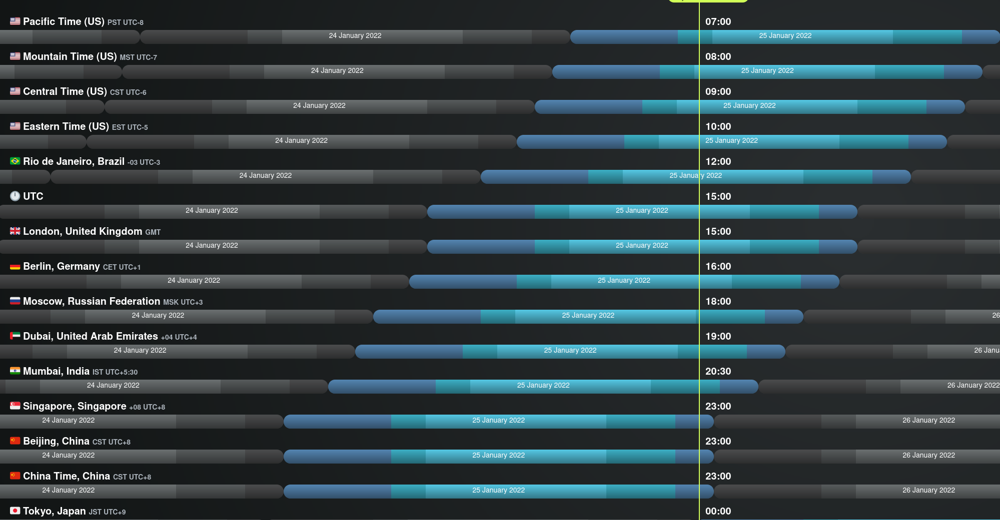

## Description

A casual voice chat to discuss ideas for ETC. All are welcome.

The ETC Discord can be joined at https://ethereumclassic.org/discord

Please join us in the #community-calls channel ask questions or bring up topics.

## Agenda

- Check In
- Review call 009 with Cody Burns
- Community Fund (what do we know / what is the path forward)
- DAO discussion, ronin re: legal DAOs, Coop?
- Afri
- Ross
- Financial Journey attendence to call #011
- Open Discussion

## Status

- Complete
- Recording: https://www.youtube.com/watch?v=6DRZEaKkpb4

## Scheduled


---

## Full Transcript

```webvtt
WEBVTT

NOTE no-names

1
00:00:03.120 --> 00:00:08.870
classic community called number 10 on the 25th of january 2022.

2
00:00:05.359 --> 00:00:26.950
etc community calls is a weekly voice chat that happens in the ethereum classic discord server every tuesday usually at 1500 hours utc the content of these calls is decided by the etc community each week anyone can submit questions and topic suggestions about anything related to etc in the community calls notes

3
00:00:24.480 --> 00:00:46.389
channel on discord you can join the discord channel by visiting ethereumclassic.org discount discord this chat is held in the community course channel these schools are recorded and uploaded to youtube where you can subscribe like and share this week we have quite a interesting agenda we've got a few different things to talk about so let's just

4
00:00:44.320 --> 00:01:04.950
flip over to that and quickly go over what we have installed this week so first let's uh just do a quick review of last week's call which was 009 where we were graciously joined by cody burns and just as a recap essentially

5
00:01:02.719 --> 00:01:23.590
it seems like the community fund is in safe hands he doesn't seem worried that they're not going to be able to get the funds if they need it it's really just the case of finding some mechanism for releasing those funds and we will i guess nicely then segue into the uh the next point

6
00:01:21.360 --> 00:01:42.710
about dowse um but before we do that did anyone want to comment on last week's uh discussion with cody can you just uh so i haven't watched that can you just recap on what he means by in safe hands is does that just mean that he's in communication with all of the other multi-sig holders

7
00:01:39.759 --> 00:02:01.830
and you know they're they're in agreement on how they're uh acting as custodians to that fund you know i'm sure i can go back and review that but if you if you just want to give a little short thing on what he actually said yeah pretty much um that uh it's a it's a

8
00:01:59.200 --> 00:02:20.869
three or five multi-sig and he knows at least three of the people and they are active so uh he's he basically just said he's not worried about losing access um so we just need to figure out how to spend the funds really and uh yeah i think a dow is what he was thinking as well oh

9
00:02:18.560 --> 00:02:39.589
okay great and so yeah and that was my question is did they want to spend the fun with their decision-making or are they trying to send the fund somewhere you know to a system that we've set up you know that has the proper checks and balance and transparency built in yep

10
00:02:36.560 --> 00:02:57.910
i think that is the idea um there's also the benefit of doing it this way means that there's no like there's less legal liability for those custodians as individuals if it's all done by some community mechanism okay that that's great and then uh do

11
00:02:56.160 --> 00:03:18.550
you want to give any sort of background on on where the dow discussion is as i believe it was you that set up the uh that dao repo and maybe has has been holding uh conversations with people i know that me and you have uh talked about this type of framework for a little bit but you know it's very brief

12
00:03:16.159 --> 00:03:37.190
you know we haven't had any deep discussions but we've we've spoke about it yeah so the repo you're referring to is github.com which uh i encourage people to check out um there are some discussions there mostly about like who's interested in doing this and just like spitballing ideas about what

13
00:03:35.840 --> 00:03:57.589
kind of frameworks to use like aragon or uh even using the dao original source code as a sort of gimmick but uh probably not the best idea right now but basically in very early stages there's nothing no deep discussion happening yet and hopefully we can kick things off now that we know that there

14
00:03:55.760 --> 00:04:18.710
is potential to fund it by the community fund also kodi has shared a link to github that is showing the the key holders so you can view their all the key holders you can see it in community call notes oh

15
00:04:15.120 --> 00:04:35.350
perfect i didn't see that alright where was that link can you can you just read off who who those were for the audio yeah just a second uh just in case someone's listening on this later on and doesn't have access to the link um my

16
00:04:33.520 --> 00:04:53.590
my question would be about that the etc dao thing uh like so my understanding with that will be uh kind of all on chain and then is this this will be a protocol dow is that is that correct so this will be only related to protocol uh

17
00:04:49.840 --> 00:05:11.430
protocol spending no no no my well i think this is a discussion needs to happen basically there's there's been no like confirmations or denials about what it should be doing yet but it seems to me that it should not just be limited to protocol stuff because there's a lot of low-hanging

18
00:05:08.639 --> 00:05:29.270
fruit that can be funded by uh this kind of thing that would be like really valuable yeah i think i think uh kind of so so what i see on this notice i see doubt discussion ronin regarding legal dows and then co-op has a question mark um my

19
00:05:26.400 --> 00:05:47.430
research into this has been related to a different project not and not associated with uh etc at all and so i was looking into legal dowse in wyoming someone did bring up a note um i i dropped that note i think this last week and someone did bring up a note of you know there is a risk there of um

20
00:05:47.440 --> 00:06:07.830
of you know if you set up like a protocol level dow um you're restricting yourself to that jurisdiction um which i can see how that could be a problem because it could be easy to um corrupt a small you know jurisdiction or you know use some

21
00:06:06.240 --> 00:06:27.830
black money to try to start altering laws in a small state like wyoming it's the least populated state in the in the country can you explain what you mean by protocol dao okay so i'm just saying a dow that's related to adjusting specific like network protocol issues like the ecip stuff

22
00:06:25.680 --> 00:06:46.950
that we talked about there um when i spoke with you uh i was talking about a dow in terms of um like why i was looking at wyoming and relating it to etc was a dow that was more looking at uh putting on uh and i'm sorry i should you're right protocol

23
00:06:43.840 --> 00:07:06.710
protocols on top of the network like uh like uniswap would be a protocol right an amm type of protocol those type of things those aren't necessarily network protocols so you're not adjusting the network you're building on top of it and so i was thinking about it in terms of that when we had our conversation

24
00:07:03.039 --> 00:07:24.629
um but i could see how what what someone had mentioned was that there was legal risk by having the network uh being adjusted you know or uh funding going in to the network protocol um and then uh and then just having a small jurisdiction

25
00:07:22.080 --> 00:07:43.430
like wyoming that uh that you know you could use black money to uh or dark money to um adjust the rules and regulations there so it's just something i hadn't thought of and i think it's something that we uh should keep on top of mind if we're gonna register a legal dow or do anything like that

26
00:07:40.479 --> 00:08:02.469
related to network changes um so i hope i hope that made a lot of sense i i like my thought on that would be that any dow that is launched would not have any sort of authority with regards to network decision making because that ultimately is down to uh like

27
00:08:00.240 --> 00:08:21.510
miners and the other stakeholders and people that want to run etc clients and if the dow does something that causes a chain split then well that's bad and it doesn't really matter if the dao says it or not yeah yeah so i i mean i agree with you i just want to keep that top of mind um one

28
00:08:19.440 --> 00:08:40.790
especially especially when we bring in like legal legal stuff to it stuff yeah anyways my my thoughts as well on the uh having a a legal entity um is that probably it is definitely useful in some cases but maybe

29
00:08:37.519 --> 00:08:57.750
not that necessary for everything like if it is possible to pay developers to do stuff without requiring any like legal agreements that would be ideal in a lot of cases but there are obviously other things that you cannot do that with so i think it really depends on the the scope

30
00:08:56.240 --> 00:09:16.310
of the dow as to whether it needs a legal entity or not yeah and i'm i'm not familiar with how uh like bitcoin does that um just as an example of just something that we've seen in terms of a board uh and i i should probably go back on this discussion of so when i look at um kind

31
00:09:14.080 --> 00:09:35.190
of successful ways that i've seen open source prod uh uh projects um get funding is i really look at monero uh they do kind of like the donation model that failed um on etc uh but they do have a nice message board so i highly recommend we go to and we look

32
00:09:33.200 --> 00:09:54.150
at their message board they have like a community message board and they have a way to submit proposals i think there's a lot that we can pull from there because it's not perfect but you know there is some good content in there to build off of um and then uh and then i look at git coin in terms of how they were able

33
00:09:52.480 --> 00:10:13.750
to set up the bounties and i think that they do like a submission process and then you choose the best one and that's more in line with like some of those like freelance uh uh platforms where you post a job and you know whatever ten people submit submit uh submit uh whatever

34
00:10:11.519 --> 00:10:31.670
their uh their con you know they try to submit to get the bounty for the job and then you choose the best one or you can choose like the top three or whatever so i think that stev stev you actually now that i think about it you ran a couple uh bitcoin proposals for um core

35
00:10:30.320 --> 00:10:51.350
didn't you for lab four yeah yeah a few proposals and uh hackathons yeah yeah can you can you explain how that payout work works what was that what was that setup like so i haven't i haven't actually used git coin sin since i last did those but

36
00:10:49.920 --> 00:11:10.150
uh you you basically um create a proposal or you you create a uh whether it's a hackathon or a certain project you could create that uh i'll just say repo um and then you have people that say

37
00:11:08.160 --> 00:11:29.430
that they're working on it and then they have a status to say like they've submitted they've submitted a uh they've submitted a project to it and usually it's linked with like their github or to like a puller request or something and then as a if you're proposing something you provide

38
00:11:26.560 --> 00:11:48.069
your payout address and they provide the receiving address so it's pretty straightforward because they know where they're going to get paid out from and you know where to deposit funds to and um i think there's an invoice in between that process so that let's say there's

39
00:11:45.839 --> 00:12:06.710
a bounty and i'm i won that bounty i can also get an invoice for uh tax purposes um or the party that's funding the bounty that if they're actually if they're generating the bitcoin invoice then obviously they could submit that to taxes

40
00:12:04.480 --> 00:12:27.030
because it's because i i believe depending on your you and your jurisdiction that could be a tax deductible event um for the um person proposing the bounty the person who won the bounty that's like basically taxable taxable income um so that's a good point and that kind of leads

41
00:12:24.079 --> 00:12:45.190
into that leads into one thing of sorry did i cut no you're good oh okay um uh that is why i think that we were you had mentioned that there might not be a need for a legal entity but in terms of taxes like the people receiving the bounty likely need to have

42
00:12:42.320 --> 00:13:03.110
you know some uh some sort of tax form whatever the jurisdiction to report their income coming in and it has to be coming from some entity right it can't just be oh we received money from an unknown source right a black hole um so that that's likely what we need to think

43
00:13:01.440 --> 00:13:22.629
about in terms of the legal stuff for that type of dow system and then obviously what i was just mentioning and getting into was how to actually start building the framework to distribute the funds um and be be that you know play pulling from some of the monero stuff or pulling from

44
00:13:20.000 --> 00:13:40.710
like get get coin how they're doing it their bounty system uh stev i do have another question on when you were setting up that bounty was there some sort of like deposit the funds ahead of time so everyone know you know like setting it into an escrow account essentially um

45
00:13:38.160 --> 00:13:58.550
when i was on the platform um actually yeah so when you provide your funding address the platform and get coin does check to see if those funds exist and they do that just to make sure that people are proposing bounties are actually able

46
00:13:55.440 --> 00:14:16.310
to pay out uh participants yeah so so i definitely think that that's that's something of we have to think of there will be like some sort of built-in escrow system um so that the funds do get locked up for the bounty so that developers can come through snip around for boundaries that they want

47
00:14:14.000 --> 00:14:34.710
and then uh and they know they're they know they're funded and they can see it on chain for proper transparency um would it i think it makes sense to just use git coin for this but for the things that are very similar to bitcoin that require real world entities then like could we not just do what steph did in the past and use git coin

48
00:14:34.720 --> 00:14:56.310
yeah i think i think that's a conversation that we really should have i mean it's there i think there might be a problem of um you know like steph do you happen to know did they take uh like a percentage off of that for providing the bulletin board service like um

49
00:14:53.040 --> 00:15:13.990
i don't recall that um i don't recall if they take a percentage off but i know that when we put when we partnered that back in the day they they integrated etc support so you have your your metamask and all that and people participating or people paying out the funds um

50
00:15:14.000 --> 00:15:35.670
there should be etc support already so it's very probable to use bitcoin yeah so i think i think that that's a great uh stop gap uh store stora um because we would essentially be posting bounties to where the developers already go which is really good practice um i have a couple

51
00:15:33.759 --> 00:15:54.389
friends that are bounty hunters like that and they essentially just have a list that they check every morning you know and they go through and they they come to see uh hey is there anything that's in my wheelhouse you know people developers these days uh they special they'll specialize in something and then they'll

52
00:15:52.560 --> 00:16:12.949
go and up and do that on multiple evms and look for bounties related to that so i think that's like who we want to attract is those type of developers that's that's how you kind of bring them into the fold they're experts you know in very specialized code they're deploying it on multiple networks um i think of this uh like

53
00:16:11.680 --> 00:16:31.990
uh one of my friends did uh i want to say nfts you know i brought that to like um what's yaza's chain i think it's bellow or something like that it's the yellow i think that he did the bounty for that and you know he got paid some bucks to do that but he had been doing it on a different project and so that's just those

54
00:16:29.759 --> 00:16:50.629
are the type of people we want uh because qualified developers don't want to get a job right they don't want to get locked into a w-2 they want the freedom to work on whatever the hell they want to work on and if they're good at something they go hey well that's easy money i already learned it i'm going to go i'll do that bounty collect the

55
00:16:48.160 --> 00:17:08.949
bounty put up really good code let it get reviewed and whatever and go on my way that's open source development and that's what we want so amy amen yeah you agree with that ross as a developer as a developer yes yeah yeah because you don't want to get tied into a team or anything like that you

56
00:17:07.600 --> 00:17:28.069
want to work on what piques your interest right yeah yeah that absolutely yeah yeah and that's how you get good creative code on there you know that and by creative code i mean you know concise you know really specialized someone's put deep thought into it um you know and and open for peer review that's

57
00:17:26.400 --> 00:17:46.549
the type of stuff we want i think that's far different than anything that's been proposed um you know we had a lot of we've had a lot of private uh you know private teams uh with private funding working on private projects uh all in the background and i think i think

58
00:17:44.320 --> 00:18:06.710
this path will be far better and we've seen it work on uh like monero in my opinion is a great example of that working um and then i i and then i think uh i think bitcoin is a really good system i don't know about the quadratic voting and all that um

59
00:18:03.120 --> 00:18:23.909
in terms of governance so i think uh we need to talk about the dow in that in that sense of how you do voting who's participating i know we had started into that and so maybe you want to talk on that a little bit because i think people get uh weary when you hear coin votes and all that because you

60
00:18:22.400 --> 00:18:43.270
don't want the centralized capture of that yeah so this i mean bitcoin uh solves the sort of distribution and finding developers side of the procurement entering process but deciding what actually is funded is another problem and this goes back

61
00:18:41.039 --> 00:19:03.350
to how do you seed the authority of the dow and like either you could have a way for people to deposit funds into the down or to get votes or you have some white list of addresses that is considered authorities on top of that you could also have some kind of delegation system where people that are not

62
00:19:00.640 --> 00:19:20.789
active can say this guy can take my vote on my behalf for this period of time and i think a combination of all those things should be considered and used to compose a good governance system and i think part of the seeding could in fact

63
00:19:18.080 --> 00:19:39.190
be invitations to people that have contributed to ethereum classic um in the past that we know have done something and can prove it by signing a message or something from their github account or whatever or have contributed to these calls in some way that's one way

64
00:19:37.120 --> 00:19:58.710
of doing it um and it seems there's no like perfect solution to seeding authority but uh that one at least ensures that it's real people that are not uh sock puppets and then of course anyone could sort of donate at any point in order to buy votes but

65
00:19:56.400 --> 00:20:16.950
they would not get more or less than uh a fair share so basically the big the hardest problem i think is not distributing but governance and uh it's going to be a long conversation to get to something that's reasonable the thing is it's also better to

66
00:20:15.200 --> 00:20:35.510
keep things as simple as possible and not over complicating it because as we saw with like coin votes and stuff they can be quite gameable and don't really work that well in practice um in an adversarial system because i'm what to

67
00:20:33.600 --> 00:20:55.029
to um yeah i'm ready you're so ready do you have any thoughts on a a way to seed authority in this dell oh yeah definitely i was i was planning on giving like a full on demo uh on everything yeah um yeah i'm just waiting i guess for my turn okay i

68
00:20:53.600 --> 00:21:14.390
guess now it's a good time i didn't i didn't really know ross what you were planning to show this week so uh why don't you take the floor can i do a screen share yep yep you can do a screenshot you're

69
00:21:11.120 --> 00:21:31.909
you can see you can see yeah one sec it's loading uh yeah i can see your ross i see you is it steady yeah it's steady okay okay so um dow's that's what we're talking about and so the big so the big thing is like the

70
00:21:30.720 --> 00:21:50.870
governance the fair the fair governance of it like how how can you make it fair um it might sound like it went off is it still there yeah you're good you're good i'm seeing it okay so uh yeah fairness is the big big deal um so the

71
00:21:48.159 --> 00:22:09.190
big problem is people bribing the system right or buying out votes so um well my i've taken kind of like a counterintuitive approach to this you can uh i like to compare it to that scene in in ready player one where he

72
00:22:06.480 --> 00:22:26.950
drives backwards in the race anyway um so you actually start with something uh that is a yeah that is considered a pretty much a blatant pyramid now i've modified the code around this and i've got that up too i don't i mean i can show code but yeah i don't think i should do that now i

73
00:22:24.799 --> 00:22:45.350
can explain it here um basically the way these governance tokens are generated are based on a uh loss multiplier and a hotter multiplier or see a holding time multiplier so the focus of this is to okay you have this you have two structures

74
00:22:43.440 --> 00:23:03.590
you have the pyramid and then you have the ring you don't actually want to focus on making money from the pyramid your only focus is actually making money from the ring the only way you get to the ring is with these resolve tokens and the ring is because what uh pyramids do they concentrate money to a center right and if the token had

75
00:23:01.280 --> 00:23:22.470
generated an inverse of that um that means that you have these tokens on the on the distributed edge of of this pyramid so the uh the idea is to actually game everybody else on their impulses to get as much share of this ring as possible so you actually only want

76
00:23:20.640 --> 00:23:41.430
to spend literally what you can afford to lose actually have that go down as far as possible and hold it as long as you can and relative to who's holding the contract and that's how you get more of this ring and you don't so i heard there's the uh the idea of um what uh having

77
00:23:39.280 --> 00:24:00.310
every individual represent a vote it's very hard to do that in a chaotic system like you have to have a rough system to kind of bring things into some level of focus because you're never going to have something go from complete noise to being able to discreetly define individuals and take account to each

78
00:23:58.480 --> 00:24:18.950
vote like this and this is the this is the way of getting to this uh of establishing identity am i rambling too much should any questions so far no keep just keep talking i think i think you're explaining it just get through your whole thought for sure we can always go back and review it you know it's on videos so okay

79
00:24:16.960 --> 00:24:38.230
yeah um i mean i can really just show you how jobs are added to the oracle or i'm so so i was calling it the oracle and a dao so you can use that as a as an oracle for a lot of things but ultimately i i would say it's a dow um so i mean i could get into a whole demo and show

80
00:24:35.840 --> 00:24:57.029
you is a small use case here um but yeah the whole if you do a demo let's just do it in the context of um what we're talking about which is posting a job and voting on it would it be would be or i guess it would be proposing a job and then voting yes on it or voting on it right yeah so and this is the job for the oracle

81
00:24:55.679 --> 00:25:16.870
yes uh yeah so a a new job the oracle would be responsible for um so uh does the philosophy i guess makes sense a little bit where you know we know the the structure of money or the flow of money in the world is already in a pyramid form whether it's

82
00:25:15.039 --> 00:25:35.750
a scam or it's not it's all hierarchical and ultimately in a pyramid form so the whole principle of this contract is to take that form explicitly and tokenize the inverse of it and and that's because it's basically acting against the way the economy behaves and what i mean by that is that uh is that

83
00:25:34.720 --> 00:25:57.430
your your your vote is worth more the longer you hold is that my underpoint it's your vote is yeah based on the relative holding time here gotcha okay and so it forces people to the longer the longer someone is involved in this oracle the more trustworthy it's

84
00:25:54.480 --> 00:26:16.470
kind of like uh it's kind of like meth that's the both right like the longer anyways regardless sorry i'm just going off but okay i understand okay um so it's in a sense it's uh reflects an element of credit and reputation that's that's we have in our credit system

85
00:26:14.240 --> 00:26:34.710
today our financial system today um so you have an um aspect of credit and debt so the debt is the loss multiplier that you get in this contract and the the whole function of this um the whole function of this contract yeah is to just preserve the distribution

86
00:26:31.279 --> 00:26:51.350
of the resolve token i have no idea what that notification would have been anyway um so let me yeah just get into this you you buy okay and then to get your resolve tokens you sell so that's that's on the other end so you buy in and there's a tax there's a friction

87
00:26:50.000 --> 00:27:10.149
fee associated with it right now it's zero i'll go to an account that already has resolved tokens and i'll just kind of go through like the whole process because um right now there are no watchers on the on the table um i have to this yeah

88
00:27:03.840 --> 00:27:25.669
i'll get to that um a candidate you back yourself of course and you would just stake the watcher i could just reword that to back watcher but yeah you can go ahead and confirm um so a

89
00:27:23.760 --> 00:27:43.990
watcher can sit and they have to they they sit to the side there's a round table of watchers that uh respond to tickets or there will be once you know ones get on there but um to the side you can you can uh just you can sit to the side and uh just get more and

90
00:27:42.080 --> 00:28:03.430
more backing once you assert yourself to the round table once we get this uh confirmation through um and you want to start yourself to the round table then you're active um and there are there's a there's a number of round seats to the round table so there's a hard minimum of seven just as a

91
00:28:00.640 --> 00:28:21.269
security element so a hard minimum of seven and then the oracle governs itself after that so um if there's like 15 it'll take the top 15 watchers that assert themselves so you can see this watch which is myself i have

92
00:28:18.640 --> 00:28:40.870
.05 of 0.05 and that's how much i've got backing myself and i can with my backing i can assert and i can have other people back me this just kind of like it just compacts the whole delegate thing i just did that in this contract i didn't have to but yeah okay okay so i do have one question uh which is coming to

93
00:28:37.600 --> 00:28:59.029
mind and i just think of eos and how uh how their delegated proof of uh steak worked it was like 21 seeds and then what ended up happening was uh they started working together um and uh the delegates started working together and

94
00:28:55.520 --> 00:29:15.909
then uh they essentially took over uh the entire process um by being corrupt i think it was a chinese outfit and they all they all just kind of took that over so in your example what would prevent me from like let's say how many to be limited by a certain amount by check

95
00:29:17.600 --> 00:29:39.510
it's not limited the the amount of seats is actually governed by the oracle itself there's a hard minimum limit of seven um even if they attempted to collude yes that's creating demand for the resolve tokens and in essence creating demand for resolve tokens and the market will respond to that demand inflating the inflating

96
00:29:37.440 --> 00:29:59.110
the supply of resolve tokens because the only way to generate them is by sliding the pyramid down yeah so something i was thinking of is what i would do right now if i was going to try to attack would be to you know make a hundred accounts right now stood on them for a couple years get that time built up and then all of a sudden

97
00:29:56.720 --> 00:30:18.549
i have a hundred accounts um that have a heavyweight vote and then so i'm just trying to think of ways to break the system but anyways i i i said in the same way with nakamoto consensus it requires an exponential amount of time

98
00:30:15.919 --> 00:30:36.310
and resources to compromise the system so yes and in the same way that nakamoto's nakamoto consensus has a weakness this has a mirrored weakness where yes if you if you do have an overwhelming amount of resources and time behind those resources yes you can compromise the okay

99
00:30:34.960 --> 00:30:56.630
system and i don't want to i don't know uh totally sidetrack off of this but i just while you were talking i just had a thought on another way that governance can work and um the story do you happen to remember the uh segway um stuff on bitcoin and litecoin back in or

100
00:30:54.640 --> 00:31:16.870
anyone else i guess there are some other people that were around during that time only only as a buzzword i didn't really understand the technicals at that time oh yeah yeah well so for litecoin for instance what was set up was like a little progress of um the node and what you do is you add a little code to the node i'm

101
00:31:14.399 --> 00:31:35.350
signaling on this node you didn't have to mine you were just running the node and it was a vote um so anyone could install right which brings up hey you could run a ton of computers with one you know running nodes with kind of skew it but anyways that was a way that segwit adoption uh went in on litecoin

102
00:31:33.039 --> 00:31:54.950
and then we ended up uh you know that ended up being the test net and then you know it ended up going to bitcoin afterwards but um that's another way where we could do some sort of signaling on proposals uh we were talking about keeping things simple so i just wanted to throw that in the recording while we had it while i had it okay

103
00:31:52.799 --> 00:32:20.630
yeah i believe that's user activated for yeah yeah yes the noise

104
00:32:12.000 --> 00:32:34.470
can you uh integrate with for example a pre-existing fund how do you figure out how people or who should be

105
00:32:31.760 --> 00:32:52.870
in any way control of the existing community fund okay so if yeah so if like yeah if like hypothetically right hypothetically definitely um there would be a contra well yeah definitely a new contract would be made and the um i would small amounts definitely detect i

106
00:32:51.039 --> 00:33:12.070
would say tests would not test but like you know small amounts initially because that's just what you do but uh in that contract i guess you would like release you can set up for a lot of rules but you could like let's say release um a thousand dollars every week and then um you would have a contract i mean yeah i mean

107
00:33:09.840 --> 00:33:30.310
that so that contract would send a request ticket to this system um i can actually show you what a request ticket looks like right here um with this job request so the the fundamental or or we call it primitive i guess you could say request ticket is the oracle being able to send the request

108
00:33:26.480 --> 00:33:48.149
to itself for a new job um or the co or the oracle contract sending a request to the uh right um yeah so um there's a time window on that approve so yes here here's where okay it would be whatever requests describe the amount of money and then um there

109
00:33:46.480 --> 00:34:07.669
could be people that have an address and they're saying hey look i want the money and it could be it could work like that or there could be a list of uh addresses that are that are in in a that have signed up on a list within the week and then all associated with the number and that that list would be you know in this

110
00:34:06.320 --> 00:34:27.909
user interface um i can make i can make this actually very flexible let me go ahead and approve this so that i'm all within the time ranges in here so yeah what's happening here by the way is yeah it's a request ticket you have a response make sure you click save um if you have an exception for whatever reason there's an exception to the event then

111
00:34:25.520 --> 00:34:48.950
yeah there's you have that that's kind of like a a built-in error handler yeah just think like an air handler yeah that's that's what that is i i guess what i'm trying to get at is is how does this contract uh like the initial people that control it who how how does that process happen okay

112
00:34:45.440 --> 00:35:06.230
so that is so this is um a very it relies on like organic principles so you have to jump start it really and the the whole point of the story actually is to warm up the oracle because everyone's just governing just the story and um yeah yeah just to warm

113
00:35:04.000 --> 00:35:25.270
up the oracle to a good size that way you have a fair amount of um involvement in this ring of watching when you in this ring of watchers when you want to take on things that are more serious so that's how i would get that's my strategy to elevating this protocol this dow to handling

114
00:35:23.920 --> 00:35:44.230
things that are more serious because for those that don't know what is what is this the story element okay so yeah the store um it is the first use case it is a uh um it's a first use case just kind of like to show off or demonstrate the capabilities of

115
00:35:43.200 --> 00:36:03.270
the dao there's another use case i have built but for wagers but this is this is what i want to use to kind of warm up the governance um the story is just like a uh you have the community you someone like can say okay what happens they go to the forest and then something something happens right

116
00:36:02.000 --> 00:36:23.510
they see the river they see the waterfall whatever and then they send that request ticket to the dow so this and the thing is they don't have to actually go to the dow but they're requested will be handled by the roundtable of watchers and um that's taking forever i was thinking very okay thank you yeah

117
00:36:21.040 --> 00:36:41.109
um jesus i think bob just pushed that through for me but anyway uh i mean it's a branching story i think it's a really cool idea i get a lot of good responses from it but um you can add different choices and it's just really

118
00:36:39.280 --> 00:37:00.069
it's like brute force exponential branching um so you know there is there is that but you know every single path is you know unique the the restrictions is completely limited to the social governance so the what's beautiful about it is you have this whole nft craze and all

119
00:36:57.760 --> 00:37:18.790
that you know we could use this dow to create a list of laws um but we can also but a more creative way of doing that is actually creating these characters and stories having them go through these sagas and you know whatever hardness archetypes and all this stuff it's just really a way to warm up the whole protocol um but it is actually

120
00:37:17.200 --> 00:37:37.589
pretty badass i'm not gonna lie like i get a lot of positive response from it um a lot of people want me to integrate it on different chains uh i want to but i'm also exhausted and i just want to actually just settle on ethereum classic and just kind of like like grow this grow what i've got solid and and

121
00:37:35.599 --> 00:37:57.990
just just get the whole stack you know nice and smooth um just educational resources um because this thing is actually it's hard to beat you're not gonna you're not gonna buy back a whole pyramid scheme against time because by by the time you actually start what you put your bonds in you know you've just gotten here and there's

122
00:37:55.200 --> 00:38:16.630
people waiting to dump on you um if you're trying to get these resolved tokens sure you can take them and then you've got to hold your you got to hold your um you know your bonds against the relative you know the average holding time before you're even relevant so it's a hard system to hit because it's operating

123
00:38:14.880 --> 00:38:36.069
on the inverse of the economy like you've got to buy back the inverse the economy um yeah so we've got this ticket going you know finalizing the commit phase you'll get a dot dot dot as it's waiting on the block yep just uh just conscious of time here uh was there anything uh that you wanted to share

124
00:38:33.040 --> 00:38:53.670
in terms of links for uh where people can find out more and is there like a github repository for this so i do have to update the github i'm not very good with github um i'm hoping that i can connect with people that are much more uh professional

125
00:38:51.599 --> 00:39:15.589
in that way than i am but yeah so i could go to what github right now and github is like slash economists think um an old form of the contract here like this is a little bit outdated um there's been some slight little

126
00:39:11.520 --> 00:39:33.190
things i've touched up but um yeah you can find it on that github link awesome thanks yeah so uh shall we uh wrap this demo up did is there anything you wanted to add finally um and then we can open back up no

127
00:39:30.480 --> 00:39:51.190
yeah no i think i'm good um yeah i'm good okay thanks very much for the uh the presentation on uh obelisk.vito did i get that right yeah vote but yeah that's just yeah that's just about right okay great appreciate it though thanks

128
00:39:48.640 --> 00:40:10.069
for the uh stage time thanks for contributing approach uh my my initial impression is that i i really like the um the sort of vesting period approach to try and prevent uh people

129
00:40:08.400 --> 00:40:30.630
from buying in and immediately taking over the whole protocol it's pretty innovative i like the uh i like the idea of um if we do something like that of really doing it with very small proposals uh that aren't contentious at all you know something

130
00:40:28.160 --> 00:40:49.589
very simple really try to test test stuff out like that so if that's my concern is that you know it is a bit complex right just as as that was explained and so that's that's probably where my concern is i'm sure uh the code you know the code will need review and all that but uh just to see how

131
00:40:47.599 --> 00:41:08.790
it could be gamified and if the stakes are low um you know we can try to break it you know even doing maybe some tests you know some test proposals on it uh for a while um but anyways yeah very interesting rob thanks for sharing all those thoughts yeah i think the the story will bring a lot of those challenges too because

132
00:41:07.359 --> 00:41:28.230
people are going to try to break that so yeah and i think as the nfts grow in value because it's the most unique nft project on any chain oh that's just me but yeah maybe maybe to keep this process as decentralized as possible it might be worth having multiple dows

133
00:41:26.319 --> 00:41:48.710
or approaches to solving this problem that the uh the the fund could be uh funneled to in small amounts incrementally into multiple different places just to see what works so there's a kind of natural selection approach yeah actually i think that's a pretty good uh thought for sure of approaching it

134
00:41:46.160 --> 00:42:06.950
from multiple angles um and then and yeah if we could just mitigate the risk by uh by attacking you know by low hanging fruit that is you know isn't very contentious uh and probably not too complex um and then uh and

135
00:42:03.760 --> 00:42:24.710
um and yeah low dollar amounts so i think i think that's a smart and wise approach mean we could experiment with not just um different on-chain systems like github sorry um like

136
00:42:22.960 --> 00:42:44.230
like aragon dale various different frameworks and ross's implementation but also different social systems as well like just having uh the co-op or some legal entity that does manage stuff so i think it's it probably is a mistake to just try and have

137
00:42:41.760 --> 00:43:03.430
one solution to this when really multiple would be better we move into shah 3 has said that he's brb 30 minutes so i think we should just wait a little bit on that discussion for him to get back so

138
00:43:01.200 --> 00:43:23.190
i think he wanted to to take part in that so um i guess now it'd be what's up sorry could you repeat that i see a bullet on afri if you want to move to that subject i'm not sure yeah yeah yeah so we i think me and brola had a discussion about future guests and one of the awesome

139
00:43:20.560 --> 00:43:41.109
guests to have on ideally before the next hard fork would be afri who i believe used to be uh a hard fought coordinator for etc and many other projects so as i don't believe he's doing that anymore for etc it would be great to pick his brains and you know share some of that knowledge and

140
00:43:38.960 --> 00:43:59.030
wisdom such that we can apply it in a more decentralized way going forward and get that process out there into the public so we can make sure we're not you know missing anything yeah and uh and that's a great topic as we have a hard fork coming up um is uh kind

141
00:43:56.960 --> 00:44:17.109
of some of the processes that were happening on previous hard forks were quite centralized um i think uh as we noticed with uh i think dean dropped into the chat maybe a month or a couple months ago and uh and was talking about how oh

142
00:44:14.720 --> 00:44:35.430
have you guys contacted all these people um you know send them direct messages and all that and i think we should really uh try to rethink that communication uh that line of communication to mining pools and exchanges um and

143
00:44:33.280 --> 00:44:55.910
i think i think like as i was thinking about it uh it makes sense to have kind of a um dashboard or something that's coming out of the github some sort of site that these uh large mining pools these exchanges you know they can just go and check like status

144
00:44:52.240 --> 00:44:55.910
of status.

145
00:44:52.240 --> 00:45:12.309
ethereum classic right something like that just something simple where um you don't have to be on a dev team uh and like sending direct messages to these miners to these mining pools that uh hard for a non-contentious hard fork is coming

146
00:45:10.560 --> 00:45:31.670
up you know it's just they can just check in right um so so i think that i think we nee really need to work on that um and i think and my my opinion is that i think the website is the best way to do it and having like a a status sub domain uh is you know so you can just check in what's

147
00:45:29.520 --> 00:45:51.030
what's going on right now you know these these operators can just do that and part of their monday tasks or whatever they know what's coming on the horizon uh and that removes a lot of the need for hard fork coordinators and uh and like this centralized hierarchy system that we're thinking of um just

148
00:45:47.839 --> 00:46:08.950
my opinion on that uh as we've seen the private teams kind of dissolve over the last couple years as as funding has kind of disappeared for opinion on that i definitely think having some kind of dashboard like that would be useful uh i don't know whether that would be enough

149
00:46:06.880 --> 00:46:27.750
to fully replace the idea of having some level of coordination and that's kind of why it'd be great to have afrion uh in the future to really figure out what the pain points are because if there is like an emergency hard fall that needs to happen or something goes wrong you can't really rely on every single

150
00:46:25.119 --> 00:46:45.829
exchange and mining pool and wallet developer to be constantly checking a source and you really need to be able to push out like emergency updates and ideally have some kind of list of contacts to to reach out to and that doesn't necessarily have to be done in a centralized way it could just be there's

151
00:46:44.079 --> 00:47:05.190
an open list of contacts that people can reach out to and anyone can fill that role but realistically uh that information i don't think is really like we don't know what's involved in coordinating that and what can go wrong so i think it'd be really good to get afrion to to

152
00:47:03.440 --> 00:47:24.150
to figure out what actually needs to exist yeah yeah i agree with you there uh there there needs to be some sort of list and i believe that the teams used to have lists of contacts i know the co-op had one and then i remembered dfg had one um and lab score whatever you want to call them uh but i don't think that they actually

153
00:47:22.480 --> 00:47:44.549
shared the list with each other which which was kind of interesting um and also uh as the receiving end just my background also work work for exchanges um uh on the receiving end you know you don't want necessarily the emergency contact line to be public because then you

154
00:47:42.319 --> 00:48:03.430
get all sorts of bizarro things right you'll have a bad actor start sending you messages saying hey you need to update you know to this link right and then it's a uh a malice the node or something like that um or it just creates you know creates uh uh uh what

155
00:48:01.359 --> 00:48:21.829
would it be hysteria you know for something that like oh we have a security issue update immediately but there's not really nothing there so we just have to be careful when we're if we're doing those centralized lines uh i definitely think that that's extremely helpful um but i do know that like exchanges and probably mining pools don't

156
00:48:19.200 --> 00:48:39.589
want their emergency contact lines being open like that so yeah it's a it's a difficult problem and uh how to do it in a decentralized way is uh really difficult i guess um co-op is the only like publicly

157
00:48:36.880 --> 00:48:57.990
known trustworthy centralized group that has that level of authority that can uh ping people but it could just be there's um a community of trusted people with that information that's more private but has some kind of rotation in a way in the in the same way that

158
00:48:56.559 --> 00:49:18.870
this um uh the discord is operated by moderators it's still pre-decentralized but still has some level of privileges yeah and i think i think uh having that that uh that source of truth like a status dot ethereum uh classic page

159
00:49:16.559 --> 00:49:37.990
that when you're pinging these people that's what you're citing right it's hey you know this is the project's page with there's a security thing although sorry now that i think about that if you have a big security bug that you need to rush through you might not want to advertise it that publicly until you have it fixed but um

160
00:49:35.599 --> 00:49:56.470
anyways yes yes it's a problem to solve for sure so yeah i think that would be a great a great discussion with afri i think that's smart to start doing and i think we need to really start thinking about uh surviving without these teams so as you're saying of like co-op right now as the trusted people they might not have funding

161
00:49:53.839 --> 00:50:15.670
in three months for all we know um so we just really have to start applying those principles of let's stop relying on people you know this stuff has to stand on its own um this is this network is not a year old anymore so we have to start making those transitions

162
00:50:12.800 --> 00:50:34.390
to truly be decentralized and it starts with uh that type of thinking from the foundation absolutely and if anyone uh is on twitter maybe after this is published onto youtube maybe someone could be kind enough to link afri to this timestamp where

163
00:50:32.720 --> 00:50:54.790
we discussed in this and uh because i don't have a twitter account it'd be great if he could uh contact one of us on discord if he's available important communication is between the client developer teams and their users since many

164
00:50:52.559 --> 00:51:14.630
of the features that we've seen in past uh that forks they didn't really affect anything else they were essentially internal to the client so it's so the most important part is updating the client and maybe checking checking some interfaces also but nothing that goes

165
00:51:12.319 --> 00:51:33.270
much beyond this so i think that that is the most important channel and i guess the developer teams can just organize themselves around this i mean they probably have to have contact to their major users anyway so they could just use these channels nevertheless of course there should be some

166
00:51:31.200 --> 00:51:52.870
general information page where people who may not be not have established any direct contact for whatever reason or were just curious and so on can i can also see what's happening so what what information would be on this page other than just the latest client number uh well what the hard work does what the what

167
00:51:51.200 --> 00:52:12.870
the client what the status of the client versions is if they're already um if there's a test version if there's a a production-related version if they're still developing and so on um possibly contact information for anyone who who has questions um speed

168
00:52:09.359 --> 00:52:32.230
specific to the to the clients or beings be it something more more general that's on the entire ether classic level that's the thing that that i would be looking for and of course the references to any uh ecips and such that that's

169
00:52:28.000 --> 00:52:48.549
the or eips as it may be and talk about the technical background yeah and i and i think that's that's a that's a good one maybe even like a countdown on the blocks you know if you wanted to make it nice you know like hey this is happening at this time if it's a scheduled change like uh what is it magneto

170
00:52:46.480 --> 00:53:06.710
what's the name of the new hard fork that's coming out magento magnetos um anyways and and i think what we're doing right now i think the current process is that a blog article is created in the website and uh and that populates in so a

171
00:53:03.599 --> 00:53:24.069
store if we could maybe like just as a stop gap there is just set up that sub domain with you know uh status or whatever whatever the subdomain wants to be named and then it just right now redirects to what hard fork is on the horizon because we already put you know on this block it's

172
00:53:22.480 --> 00:53:42.790
happening these are the changes here's the discussion you know we we do have have that stuff publicly available it's just you know who's crawling in the blog right it's like i mean it's you know yeah i think i think we need to really advertise it via a sub domain or something

173
00:53:40.640 --> 00:54:02.710
and then we just change have it redirect to uh the most relevant article right now that would be just a quick solution i mean we do also uh it's it's the first thing you see on the landing page and we can set it up so there's like a little pop-up at the top of the page that links to it um yeah

174
00:54:00.000 --> 00:54:20.950
i probably refrain from the pop-up i think i think everyone hits pop-ups yes yeah yeah and then and that's why i was thinking kind of a subdomain and then what i was thinking with the sub domain is that then if we build it out make it pretty nice um because i know we've talked about like a network monitor there's a lot of stuff that that's kind of

175
00:54:18.480 --> 00:54:39.030
you know in the works or at least on the table um we could make it much nicer than just a blog article and look a little more professional like a billion dollar network opposed to uh just that easy article but you know hey easy for me to say i'm not the one building that one

176
00:54:36.240 --> 00:54:57.510
finding it is isn't too difficult at the moment you go to ethereumclassic.org and right on the on on on top of the page well first first first end with content is mystic hard fork and edc block so that's uh that looks pretty good to me that

177
00:54:55.440 --> 00:55:16.549
i mean if i if i knew there's a hard fork but i i didn't know where to look for for data then i would this would be the first thing i try or if this doesn't work then ask on this chord but definitely the the the official centralized web page uh would be the first

178
00:55:13.599 --> 00:55:34.309
the first place to to consider and it's it's already there so let's that's we don't really need to set up any any other system that's people have to remember exists and they consult it every well maybe twice a year or so that's that usually doesn't work so well so

179
00:55:31.599 --> 00:55:52.470
i think just build building on what is already there that should be good another way to do this uh may be by upgrading uh the node explorer upgrading the dashboard so that it can send messages instant

180
00:55:49.760 --> 00:56:10.390
messages to node operators and miners they already have some data about them so integrating that wouldn't be that difficult i imagine that sounds like a good idea though the only thing that i remember uh is the electrum

181
00:56:08.480 --> 00:56:29.349
i believe got i believe that that one someone figured out how to get into that message system in the electric client and then push they hey you know we have an update and then everyone clicked the uh click the link inside the node that was hacked and then it sent them to malice

182
00:56:26.400 --> 00:56:47.829
the malice client so just something to think of i i think it's a great idea but i think on a security standpoint we really need to be conscious of that yeah well well the message can could be sent on a token email with some id and

183
00:56:45.440 --> 00:57:06.150
that will solve the problem i was hoping that steve would be back by now it is 30 minutes since he said he would be back but uh as there's nothing else to cover in the agenda

184
00:57:04.480 --> 00:57:25.430
and uh it's it's been an hour henry's certainly here you can you could get henry started talking if we want to talk about uh anything that henry's been working on in terms of 10 49 since the sock puppets have been spamming the channel uh daily it seems like they've been with friends

185
00:57:23.520 --> 00:57:44.870
so are you there henry yep we got you sorry i'm just getting used to this push to push the chat it's it always keeps blocking me off yeah that would would you just like to quickly uh introduce yourself to the to the

186
00:57:43.200 --> 00:58:04.630
audience who might not know uh your background sure um i'm you know i'm the cmo chief marketing officer for epic blockchain epic blockchain makes you know products for cryptocurrency mining and you

187
00:58:03.119 --> 00:58:25.030
know blockchain kind of blockchain security we've done a whole bunch of things you know including building fpga products for various networks um you know we actually released a production product for aeon which is an equihash product we're we're producing a cycloid miner for you

188
00:58:22.880 --> 00:58:43.510
know the cycloid network and you know we're continuously looking at things for enterprise blockchain because that's our end goal and you know along the way we pick certain cryptocurrencies that we like and work with we certainly like etc because you know etc represents a great alternative to ethereum and we believe it

189
00:58:41.359 --> 00:59:01.430
can carry smart contracts forward the team at epic really is uh you know ex-ati amd guys so we help build the top selling gpus including the radeon series and so you know that's by the way a background you know our our interest as i

190
00:58:58.799 --> 00:59:20.309
said in etc is helping promote the chain in terms of security and whatnot we've done some contributions to the community including building some gpu miners for shaw three so um you know that's architection's been tough because we haven't been able to grasp other issues so anything related to

191
00:59:18.079 --> 00:59:39.990
security mining you know software infrastructure in that respect we're we're happy to help with so that's a that's a quick background henry can you can you explain how did you guys get involved in that sha-3 project uh were you approached by someone or how did that even happen and is was that when how you guys got involved

192
00:59:37.440 --> 00:59:58.069
in etc i'm just not familiar how you guys got wrapped up in that proposal well how we got involved was you know we looked at so a couple of reasons right number one we looked at chains that were interesting so you know we looked at with the pending proof of work fork uh for on

193
00:59:56.720 --> 01:00:17.670
ethereum you know we thought that etc needed some help so we decided to jump in in that respect uh the other way we looked at projects was to see you know financially what people would be interested in so we just picked the top 15 coins and we got involved in it so our two favorite picks were grin

194
01:00:17.680 --> 01:00:39.430
and etc and you know they were both gpu they were both gpu friendly and asic trending if i can use those terms well very interesting and what are your thoughts on switching to

195
01:00:33.680 --> 01:00:54.470
uh show three on etc you might be doing the push-to-talk thing oh sorry can you hear me now yep yeah i can hear you now okay sorry about that um i wrote an article in medium

196
01:00:51.520 --> 01:01:14.230
about two years ago going through the mechanics of the fork you know things the hash rate's gone up but it hasn't finally changed uh you know we believe that it's the law of big numbers right so fundamentally if the change to proof-of-stake happens then

197
01:01:11.280 --> 01:01:33.829
all gpu networks become insecure you know i talked to to reuven from i guess what was his he's now known as firo he there they changed their name but you know they've got they're another gpu coin and you know they have the same issues i talked to the grin guys and

198
01:01:31.200 --> 01:01:51.510
uh you know from that respect trying to understand the system security issues around forks but the you know the overwhelming problem with with you know east hash is that there's tons of gpus available on the network and none of them are going

199
01:01:48.720 --> 01:02:08.950
to be profitable in a fork so you know if i look at the if i look at the whole funds available on etc versus all the funds available on the other gpu networks they're a fraction of what's available on jeep on you know what you can earn today so as a result

200
01:02:06.480 --> 01:02:28.309
what will happen is that a lot of the gpus and asics on the network will fall away and you know based on the size of the network there's a strong impetus to attack and you know i can go over some of the numbers i'm just prepping some of the numbers so that the community has a you know valid assumption valid

201
01:02:25.920 --> 01:02:47.349
scenarios they can look at and make the decisions on what's the best way to go for system security so uh i i assume your belief then would be it's in the interest for etc to switch to sha-3 before ethereum mainnet switches to proof-of-stake is

202
01:02:45.280 --> 01:03:06.150
that your position yes that's my definite opinion um you know so you don't have to benefit some of the pair numbers i'm working through right now but you know if you look at the if you look at the probability of an attack uh you know it'll take maybe 22 000 a10 pros which is the inno silicon asic

203
01:03:04.720 --> 01:03:26.150
miner and uh you know the 22 out to operate those 22 000 miners will take a thousand dollars an hour so so these are asic miners that's correct they're the ones that are the most prone to attack because they have no other homes in the future right you

204
01:03:23.839 --> 01:03:44.309
can argue that the gp can repurpose but i'll show you numbers that show you know the overpopulation of gpus is running a factor of about five to one right so there's five times more gpus than any of the other uh gpu network can absorb do you know roughly what percentage of the

205
01:03:42.480 --> 01:04:02.549
market is asics at the moment in terms of hash rate i i wish i i wish i had that number but you know we can take a rough guess based on the growth of the i'll present some of those scenario analysis when you know in a couple weeks i just got to work through the numbers so that you so that the community has a good you know grasp

206
01:04:00.559 --> 01:04:22.150
of the numbers but you know if you assume i can assume that maybe 10 you know i can assume maybe 10 20 of the network and you know that already shows the vulnerabilities in the network you can look at the monster's growth and hash rate and say how can you know how can the network grow

207
01:04:19.680 --> 01:04:40.950
from 300 000 uh sorry 300 tera hashes to 900 tera hashes in a year you can't do that through to gpus and you know the scenarios we can prove that scenario by looking at the supply of memories and the supply of leading edge

208
01:04:38.799 --> 01:05:00.549
asics out there we all know that there's global shortage on you know the process technologies and so there's a resulting shortage in memory for gpus to grow in hash rate you've got to aggregate the combination of availability in asics and availability of memory so you know

209
01:04:58.400 --> 01:05:19.109
it's my guess that a large part of the growth in the last year has been in asics if you look at the uh ethereum network hash rate and the one-year statistics um well one-year graphs

210
01:05:16.000 --> 01:05:37.109
then you see basically a linear increase just with a little bump when um crackdown in china having stopped a bit but before this and after this it's essentially a linear growth which indeed suggests

211
01:05:35.359 --> 01:05:56.150
it suggests that um this is mostly made up of of asics um probably um well by the basics by the large companies that don't even enter the open market so the self mining basically with the production

212
01:05:53.359 --> 01:06:14.230
and the this linear growth essentially indicates that i mean it's consistent with them just deploying a6 as they come out of the production process so you don't see any any things like like a plateau like you see an etc because

213
01:06:12.079 --> 01:06:33.190
these miners that are coming out of the factories now they're all capable of mining ethereum and it's more profitable so they all go to ethereum and not to edc at the moment and you don't see any any sharp rises or so which would indicate some simple gpu

214
01:06:30.640 --> 01:06:51.910
and gpus also on things that are quickly available and of course every however everything is also being slowed down by the chip devices and so on but essentially this means that there's a very large number of asics and for a6 the it doesn't really make that much sense to attack the

215
01:06:50.000 --> 01:07:10.150
last coin that's the weather can be profitable because in the long run they will survive because they are power efficient and they're much more power efficient than uh than older gpus especially the basically the best gpus they can more

216
01:07:07.920 --> 01:07:28.870
or less keep up with uh with moderately efficient a6 basics with the highest efficiency they do better than this so the asics in a in a good position it they will obviously also suffer from from this flood of hash rate that that will go into ethereum

217
01:07:27.359 --> 01:07:50.309
classic and all the other currents of course and um but they're in in a good position to survive this so it doesn't really make sense for them to to start attacking even classic because that will be the the next the best bets in in the long run pizza and also um anyone

218
01:07:47.359 --> 01:08:07.829
who has a lot of uh of mining weeks has made a substantial investment so these and this is completely different from the attacks that we saw in in 2020 where people just rented hash weight but they didn't really put any equipment on the other network

219
01:08:06.319 --> 01:08:28.390
they made no long-term investments just bought something used it and and they were done so that's a very different scenario i don't really think that we have to worry much about about asic farms attacking uh fem classic and all

220
01:08:26.159 --> 01:08:47.669
the gpu farms may as soon as you have a farm essentially you are a brick and mortar player and you also be careful about getting involved with something that it would be criminal activities if you use your 51 attacks for for double spending and so then you're definitely on the bad side of the law

221
01:08:44.640 --> 01:09:06.470
and i mean you have a big farm they know where they can find you so that's that's that's that's not really a scenario that makes a lot of sense maybe there's a but there will be some crazy to try something but um they wouldn't have the numbers and also they might pick

222
01:09:04.480 --> 01:09:25.510
easier targets i mean if ethereum classic now has a substantial hash rate so the power of entry for any attackers is higher and it has mess where nobody can be quite sure that they will be able to defeat it and there are many other coins that are smaller

223
01:09:25.520 --> 01:09:47.829
much easier to much much easier to attack with if with local resources you don't need a global conspiracy to combine hundreds of terror hashes to to attack the coin but you just need well maybe one tear ash or even less and that's that may be something that you can even even master with us with a single

224
01:09:45.199 --> 01:10:05.510
farm or a small group of firms but there's for the well i'm not i'm not trying to give advice to to the to the criminals out there but that would be much much more attractive targets because it's lower risk they have a lot less eyes focused on this and

225
01:10:05.520 --> 01:10:26.630
the uh or often also the production mechanisms aren't that evolved so that's far more likely so i don't think this is a really threatening scenario in the end if you click if you consider what um yeah can

226
01:10:24.800 --> 01:10:45.590
i just uh uh direct this to henry and could you could you unpack how you see this uh this attack playing out in your mind sure and good good points warner i mean that's that's where i kind of lose a lot of the logic here is i i just think couldn't these people attack already if you're painting the scenario they're not attacking

227
01:10:43.120 --> 01:11:06.229
any of these small coins they could just do it tomorrow they could be running it right now so i just don't understand this uh doomsday scenario that henry's kind of painting um so please yeah let's get into this can you please can you please like answer this and kind of go into detail how you see this attack unfolding and and why it would happen sure

228
01:11:02.880 --> 01:11:23.030
i'll be glad to so um the there's no other coin to go to right these asics are basically hard-coded to etc hash and eth hash so that that scenario of alternative earnings doesn't hold um

229
01:11:23.040 --> 01:11:43.910
i'm not talking about alternative earnings i'm talking about long-term earnings because i mean first of all there will be a lot of hash rates which will make mining for possibly everyone uh not profitable but this will clean out the beat the weaker players and eventually

230
01:11:41.040 --> 01:12:01.910
mining will become profitable individual because um if it's not then people just don't mind maybe they are they're selling off the equipment maybe they're mothballing the the farms there's plenty of options and the remaining players will continue until well either

231
01:11:59.920 --> 01:12:19.990
until they run out of money if it's not profitable or until it works again so this will this will stabilize on its own and after that as soon as as soon as i have basically a break like even equivalent equilibrium

232
01:12:18.080 --> 01:12:41.030
has been reached after that if um by the value of edc mining returns of vtc um increase which generally we cannot expect to happen because that's essentially what's happening in the crypto system equipped to market has been happening for the longest time guys

233
01:12:38.000 --> 01:12:58.229
um so it could then they will with these equip with the equipment they will be able to mine again profitably so it doesn't really make sense for them to destroy this etc on the first sign of trouble i mean there's so many other small coins that could also be attacked right now and nobody does it could we could we um just henry

234
01:12:56.960 --> 01:13:18.790
could you just like outline step by step the how you foresee the incentive mechanisms working in why these various different stakeholders different miners different asic or gpu miners would after the merge feel like attacking etc would be the best option what

235
01:13:16.560 --> 01:13:37.590
how does the economics of it work and just in detail might be the push socks can you hear me yep okay so you kind of caught me off guard because i'm you know i'm scrolling around looking at numbers trying to punch stuff in so let me let me

236
01:13:34.800 --> 01:13:55.189
give you a couple of incentives um so and i you know i wanna i want to present numbers so that this becomes not an emotional discussion but a very factual discussion i think you know werner brings some great points and ronan brings some great points but the numbers don't

237
01:13:52.400 --> 01:14:12.709
back up the assumptions so let me let me throw out a couple numbers for you so top five coin top five gpu coins represent at today's price about 150 million proof of work right um you know etc represents about 100 million proof of work this is based on f2

238
01:14:10.560 --> 01:14:30.790
pool numbers i just take the daily proof of work multiply by 365 and that's kind of the mining rewards you get you can just you know do some high level analysis and say here's the gpu population divide by x and you get some profitability numbers and the profitability numbers are basically

239
01:14:28.560 --> 01:14:49.750
what i use to calculate the network potential and probability of attack so i think you know you're you don't have the benefit numbers and i don't have all the numbers repaired because i'm not fully prepped to have discussion but glad to have it in the future and show you so the community can make these decisions i'll

240
01:14:47.280 --> 01:15:08.390
make a couple points that you know the numbers will support is that if we will if we believe that the network is probably 15 asic then you know gpus won't continue to survive on the network i think anything more than that um asics

241
01:15:06.719 --> 01:15:28.310
may attack we just can't tell exactly what's going to happen on on asics that are nearing end of life right it's the probab it's your affinity to protect the network versus your infinity gear and get some profits so that's the you know i can't speak to the motivation i have to work the numbers

242
01:15:26.159 --> 01:15:46.630
and show you where i'm working on that point though on that point you're saying gpus won't survive but we're seeing it happen on ethereum right now on eth so i'm just having a tough time following your logic when empirical evidence is completely contrary to what you're presenting here and

243
01:15:44.400 --> 01:16:05.350
so it's not emotional this is we have a real here there's a lot of monetary value on it that you know these guys could be attacking each right now with what you're describing all of these people will be coming to etc which is the parity network you know protocol parity um so so so i'm just trying to i just wanted

244
01:16:03.440 --> 01:16:24.790
to cut in there because you know as you go through these points it's just we have to have logic when we're talking about this and just spouting out a bunch of numbers doesn't really uh follow the logic of what we're seeing in the market right now um so so henry like you know it's not emotional we're not emotional here on the on the people that aren't understanding

245
01:16:23.280 --> 01:16:44.550
your logic we're trying to follow your logic and it breaks down when you say hey these asics are bad actors that are gonna come to etc and kill it um when we're not seeing them kill ethereum and you're saying gpus will be obsolete it will only be asic and then we're not seeing that on ethereum

246
01:16:41.679 --> 01:17:03.510
and then also the solution is hey these asics on each hash are dangerous and problematic to you guys uh will kill the network so please come and join our asic farm right like let us take over your whole network so that's where kind of the logic really breaks down in your not only

247
01:17:01.199 --> 01:17:21.669
the doomsday scenario that you're painting but also your solution is to go to an asic that is far less developed than ecash asics i would say um and you do have financial incentive for the network to go there so so let's just you know we have to we have to be talking

248
01:17:18.880 --> 01:17:41.030
straight on that stuff um the doomsday scenario just it just doesn't logically make sense to what we're seeing with the empirical evidence sorry sorry to cut you off please continue no problem um you know thanks for the question so i guess the you know the so i do have a vested interest you have a

249
01:17:38.880 --> 01:18:00.310
vested interest so that's the yeah everyone and i know us having invested interest is a negative thing everyone that's how these markets work everyone has a vested interest on this call right exactly i just i just the solution you do have a vested interest on the solution you're proposing it's just clear you know clear the

250
01:17:58.719 --> 01:18:19.350
air on that it doesn't mean that it's a negative thing just we need to be clear right so you know we're so with that in mind the reason that the east network survives with a6 is asics are not a overall proportion of the network right

251
01:18:15.199 --> 01:18:36.950
but if we just map an a10 pro to the ethereum network you mute it again henry yeah push to talk henry you just you just cut off uh when you said uh the a one over to the etc network can you hear me now yep

252
01:18:35.199 --> 01:18:55.270
yeah we come okay so um you know this if you just look at the overall network hash rate on on etc and we say that if a10 a10s were to come over it would take 46

253
01:18:51.360 --> 01:19:11.590
000 a10s to get to be equivalent to the network why would it be a bad thing if a hundred percent of eth-miners were asics on etc um you know it is the network on a6 in that respect is highly

254
01:19:10.239 --> 01:19:32.070
concentrated because it's a very established network right the difference on new networks is that you've got the ability to propagate the network with newer players or you know players that are making new capital there so it's a it's in business this is what we call you know fully depreciated assets versus new

255
01:19:29.360 --> 01:19:38.550
assets a10 pros have more than paid for themselves they've been available since we're all on business 319.

256
01:19:38.560 --> 01:19:59.270
and would it be more or less why would it be less centralized on shaw three because it's starting from scratch how do we know uh well you look at the parallel sha-3 networks and no one no one has any hash rate on that right so

257
01:19:56.800 --> 01:20:18.950
you know the closest one we've seen is i can't remember the name of coin there was a couple of shot three coins that are uh you know have fpgas on them i did some calculations on it i have to dig up i have to dig up to see what this analysis was and they were fairly distributed you know

258
01:20:16.239 --> 01:20:37.510
it's hard for fpgas to overwhelm the network there is there is a concept of secret a6 which uh i believe grin was designed um to uh try and mitigate by having this phased approach to switching correct could you speak on the potential of there being sha3a6

259
01:20:35.199 --> 01:20:55.270
already manufactured just waiting for etc to switch um [Music] you know i can't it takes it takes tens of millions of dollars develop in asics so you can argue that that yeah you could do it in a smaller process so it might be

260
01:20:53.199 --> 01:21:15.510
cheaper so someone has to put their neck out on the line to develop these asics and um it'd be tough i think it'd be tough for a small company to do it and be tough for a big company to do it with the asic with the supply constrains in semiconductors you know why would you take your precious

261
01:21:12.880 --> 01:21:33.910
resources and put them in a high-risk product that is not you know that's not been approved versus an existing market you can get much better returns taking your 16 nanometer asic and producing more litecoin products with it and you know mining

262
01:21:31.120 --> 01:21:51.990
doge and litecoin okay and just on that path of logic why would a billion dollar network go and rely on all of its security to this little um undeveloped market when it already has been running on etc and

263
01:21:49.040 --> 01:22:10.709
those mechanics on the mining side um and you're talking about you know a ton of hash rate coming over from a different network when it moves away so you're talking about far more security um it may take a little it may be a bumpy road because you're gonna see difficulty changes and all those mechanics

264
01:22:07.760 --> 01:22:30.070
uh and you know what we'll see we'll see speculation and price appreciation on etc um break even for miners will require that etc goes up in value we see those same mechanics on bitcoin every four years when the when everything drops out you know uh when the reward drop uh half um so

265
01:22:27.360 --> 01:22:47.990
i i just i mean just think about that in you're talking about someone investing in the asic well think about the network as a whole you have a ton of financial value on top of it why would that big investment move over to a security system that isn't developed at all um

266
01:22:48.000 --> 01:23:09.430
and i think that that point goes into why wouldn't straw 3 and this project just fire up on a new evm and develop that market if you think in 10 or 15 years this network should go into that why wouldn't you just start a new evm you will capture the mission you get to set all your rules you can probably fund that

267
01:23:07.440 --> 01:23:28.470
entire project on that evm if there's real value you'll do the fly clients you can do all that develop all that tech and if all of that stuff develops on a new chain while you're making money doing it on that new chain and adding value to that tech line you know then you have a developed proposal coming over to etc in 10 or 15 years

268
01:23:26.320 --> 01:23:47.590
or whatever it takes and you go look this is an established network you guys want to migrate over here far less contentious um and and you're offering something that's that could be as secure as what we currently have right now right now you guys are offering something that's far less secure and trying to sell it as there's a

269
01:23:45.520 --> 01:24:07.270
doomsday scenario you have to go to this left secure thing asap it just it just doesn't make sense so in terms of the financial value that you're putting at risk um so i think just go back to the drawing board on that and just think about it because that's one thing that i just cannot wrap my head around about this proposal

270
01:24:04.320 --> 01:24:26.790
well it that's an easy one to answer so you know why why don't you develop something from scratch same way that companies don't develop things from scratch right it's far too risky it takes time you look at you know something i was involved in and you look at amd amd bought

271
01:24:23.199 --> 01:24:44.070
ati to get into the gpu business right they want to diversify and say uh and develop new markets and then integrate some new technology well you know amd could have built the gpu but fact of the matter was that it would have taken them 10 years to develop a viable

272
01:24:41.440 --> 01:25:02.070
gpu and be competitive the market so they spent 5.5 billion dollars on eti so you know um so that answers the first question it's really a time to market an overall cost issue uh second question from your perspective but why does it make sense for the the network to go down that road let

273
01:25:00.239 --> 01:25:22.070
me let me answer okay sorry so from the standpoint of you know to transition why does the network care the network doesn't really care whether the new algorithm you know as long as the players are going to be loyal and work themselves out

274
01:25:19.920 --> 01:25:40.790
it'll work out so shaw 3 is good from that standpoint because it sets a new bar and that new bar can be addressed by both gpus fpgas and a6 and i wrote that in my medium article i said you know here's how much it supports and because so

275
01:25:39.040 --> 01:26:00.629
you know i i i'm not going to go through the numbers there i'll prepare a different presentation for a full discussion of some of these um you know some of our points if we want to have that have all done i don't know i don't think let me finish so from that standpoint it the current infrastructure on gpus can move

276
01:25:58.639 --> 01:26:19.030
easily to sha-3 and you know you get rid of all the asic bad actors that could attack okay because they no longer have any they they don't have a vested interest they're fully depreciated and you know when you work to break even numbers you i think you'll see what will happen is that

277
01:26:16.560 --> 01:26:37.430
there's far too many asics in the network because of the fact that you know there is a i can't remember the proof of work number but i think it's like one and a half billion dollars worth of mining rewards on ethereum today so there was a lot of money chasing ethereum because the number the

278
01:26:34.719 --> 01:26:55.590
proof of work on eath hash is a lot smaller or sorry not ethash on etc is a lot smaller there's less motivation for people to jump in with these big amounts of money for asics and the new asics that came in with loyal to the network so i think you're going to see a transition point where

279
01:26:52.719 --> 01:27:13.350
it's fpgas gpus and a6 ramping up and i don't think you're going to see asics pop up for another year another nine months to uh you know 15 months so from that standpoint you'll you'll get a smooth transition because it's not a hard

280
01:27:11.280 --> 01:27:35.030
fork where everybody you know you have to switch over to a6 right away you've got this transition with fpgas and gpus when when the sha-3 a6 do come to market um is there not going to be the same problem of there being like a distribution monopoly and

281
01:27:31.280 --> 01:27:51.350
is it not that eth a6 have less of that problem like someone on the outside sure go ahead ross um i i don't know maybe we can keep a tally on

282
01:27:48.480 --> 01:28:08.629
how often we discuss hash i think it's something that's plagued etc this this back the back and forth of the hash debate is that accurate because i don't see this anywhere else i

283
01:28:07.040 --> 01:28:28.870
think other chains have looked at it differently so you know other chains have looked at this and said we're going to fork before this happens so you know let's draw the examples of various chains that have fears of asics and then forked so they operate differently the chains that have moved

284
01:28:26.639 --> 01:28:46.870
away from you know asics like raven coin like monero um i i'll have to look at the list uh you know they forked because they saw substantial growth in hash rate and coupled with substantial growth and hash rate they changed the algorithm

285
01:28:45.360 --> 01:29:07.110
the difference in those communities is that they were tended to be around by the foundation so they managed to stay ahead of they managed to stay ahead mostly of the attacks i think the difference on etc is that we see etc get attacked a couple of times and ross i think that's why you're seeing the hypersensitivity on

286
01:29:03.760 --> 01:29:24.709
you know attacks you had a second question i can't remember what that was no i would i so i was just saying that really it's all we just keep having this discussion about hashing power and it's a blur to me because i'm i'm on the smart contract side really only

287
01:29:22.639 --> 01:29:43.830
and all the numbers as far as who owns how much hashing power and what type of hashing power it is it's a lot of noise to me and then i also think if one thing if can we trump this whole debate let me ask this can we trump this whole debate by incentivizing

288
01:29:43.840 --> 01:30:03.990
a lot of um hashing power to come in as it stands like if if we did have something powerfully innovative that would invite or incentivize miners to come does that trump could that trump this whole debate i mean yes it'll be something exceptional because we're looking at eve which is like 38 times

289
01:30:02.159 --> 01:30:22.310
the hashing power but i mean anything is profitable or any anything upwards is a good thing i think that's a great thought um the issue is that it's such a big number it's hard to incentivize the you know the miners to remain on the network

290
01:30:20.000 --> 01:30:43.110
right they got to pay for power and it's an opportunity cost of mining so they it i think the numbers will show that if the net you know if the gpu population grew by 7x then all the gpus would be unprofitable on etc

291
01:30:39.600 --> 01:31:00.070
that is so we're going from i can i need to convert to equivalent numbers so that you know if you say the network is primarily uh you know old radeon 470s there's about 700 000 gpus on the net on today's etc network if that grew to maybe

292
01:30:58.159 --> 01:31:20.310
5 million and you know they would all be unprofitable but you know if we look at this in terms of etc number or eth numbers there's i think 30 million of those on the network so you just it's a num it's a game of size and if the networks were

293
01:31:17.440 --> 01:31:37.910
more comparable then yeah you know what you're saying could work again you know to to put another way um for etc c to be comparable to eth you'd have to grow the network in terms of you

294
01:31:34.320 --> 01:31:58.070
know price by 4 by 38x or 40x or whatever the delta is to make mining equivalent you know as it is um you know they still have to grow 7x to support the you know a reasonable amount of of gpus so that's kind of sensitivities you're playing with could

295
01:31:54.000 --> 01:32:15.750
i um i i wanted to touch on that question i raised earlier about the monopoly of distribution of a6 and why the there will eventually be a monopoly of sha-3 a6 at some point which will centralize the network and why is it that

296
01:32:13.920 --> 01:32:36.229
the sha-3 monopoly is going to be different to the one that would be for eth a6 and surely it's a better situation in the ethh asic market because it's had time to develop so there's less of a monopoly sorry

297
01:32:32.080 --> 01:32:52.950
i'm gonna never underneath hash a6 is there's a there's a massive overpopulation of asics right so none of the asics are profitable um so

298
01:32:49.199 --> 01:33:09.830
that means you have to recover your your investment you either turn them off or you can attack or sell them for scrap metal in terms of a new network coming in there's economic theory where marginal revenue equals marginal cost people look at the network and say i'm going to bring

299
01:33:07.199 --> 01:33:27.510
in so many asics and you know we're not going to see this massive ramp right away because there is fpgas out there and there are gpus out there so you kind of normalize each other and maybe for another year year and a half asics start to gain the majority of the network

300
01:33:24.560 --> 01:33:46.709
but the asics will become i think more loyal because their new investment right so you don't if you sunk in pick a number right let's say let's say marginal revenue equals marginal cost so if you sunk 100 million dollars into the network which is you know what the proof of work is roughly today you're

301
01:33:44.560 --> 01:34:05.830
not going to attack yourself right but then why is a6 coming to etc a problem uh because well that's a new basic investment on an old investment you've got you've got too many asics so you know the the number asics out there is

302
01:34:02.639 --> 01:34:22.790
you've got uh just trying to i'm trying to eyeball the number um so you know it's going to vary depending on your asic population assumptions but i think you've got four five times as many asics as as profitable on the network so you know those asics have to make a decision on what's

303
01:34:21.040 --> 01:34:42.709
going to happen do you make a last stand like custard or do you turn yourself off so the question is basically if there is only one supplier of chattrays a6 how can the price be fair for for

304
01:34:38.320 --> 01:34:59.189
the equipment okay sorry um so that that's an easy one to answer it's called opportunity cost operation right your your main input your your two main costs of mining are the cost of the miners

305
01:34:57.840 --> 01:35:18.550
itself and the cost of electricity so you know you're going to look at this both ways and you're going to say why can't i get this best return on on my capex which is how much i'm spending on the miner and what's my best return on the cost operation so you can't overprice

306
01:35:16.239 --> 01:35:37.590
the asics because your cost operation you know your pulse your price of power is relatively constant you're going to look at this and say i can make so much buying uh bitcoin miners and my cost operation is this or i can look at sha 3a6 and my cost operation is so kind of normalize itself

307
01:35:34.159 --> 01:35:55.750
with competition you know amongst players i don't think that you'll just be one you know one asic vendor coming out there'll be several asic vendors coming out and then you know people look at it in terms of power good example this will be the um will

308
01:35:53.600 --> 01:36:14.390
be let's take a small comparable network cycling so i make a miner for cya coin ib link makes us miner for scicoin and um uh who's the other one gold shell makes a miner for cyclone small network i think it's about 20 million dollars proof of work but it supports three miners

309
01:36:11.600 --> 01:36:34.229
so you know etc is multiple times that size the you know by and large the scicoin network is all new miners uh you know we're selling product the other people are selling products you see the hash rate grow but you see the hashtag growing in a controlled fashion and you see the miners being very loyal to the network so

310
01:36:31.600 --> 01:36:52.709
you know so that's you know that's one where i think is a pretty good comparable etc has a lot more incentive because you know you're five times the size of the cycloid network so you know to answer your question is you've got three miners you got three asic rigs available

311
01:36:49.360 --> 01:37:10.070
over that network it forked in i think 2019 and it went from one asic vendor to four asic vendors we went from one asic vendor to two asic vendors in the course of one and a half years and went to three asic vendors in three

312
01:37:08.239 --> 01:37:28.870
years and then four vendors in four years plus or minus six months in those numbers yes but but what but but what you are saying is that you see a future where more manufacturers are gonna build asics for chatri

313
01:37:28.880 --> 01:37:49.270
but not today not tomorrow you know so basically who will want to invest money and buy the essex will have only one supplier this year or maybe next year and maybe wait to see if competitions

314
01:37:47.440 --> 01:38:08.709
appear so why why here is the security we have now with essex at our front front door you know they are there i can even see them right so why

315
01:38:05.440 --> 01:38:26.629
why risk or why assume that more manufacturers will provide equipment okay um you know why so let's answer your second question let's answer your first question first which is current a6 on the network the

316
01:38:25.040 --> 01:38:46.629
current asics on the network will all be unprofitable on etc that the numbers will just show you that and really the sensitivity is how many a6 do you believe are out there uh you know when they're unprofitable when they're unprofitable there's only two things that can happen right they turn off or they attack they can't continue

317
01:38:44.639 --> 01:39:06.070
to support the network because some of them have to turn off so we can play the scenario analysis say maybe that will happen you know second question about what's the incentive when you fork people see a motivation profitability and you know you support the network in the near

318
01:39:02.639 --> 01:39:24.070
term with gpus and fpgas and that transitions to asics and i think the new players come in asic will be loyal because the spend will be proportional to what the earnings capabilities network will be and i just use cycoin as an example right as the network grew more vendors

319
01:39:22.159 --> 01:39:42.229
came in miners were sorry to jump in but why would all the a6 become unprofitable on ethash surely the modest would remain profitable the more this one's really the problem yeah the problem is there's too many asics on the

320
01:39:40.159 --> 01:40:00.709
network so um again i'll have to work i have to give you the number so we're all talking the same we're all talking the same language but would it not just be the inefficient ones that drop off and the very efficient ones are profitable but the rest are not no it's uh the the numbers are overwhelmingly small

321
01:40:00.719 --> 01:40:22.550
in terms of hitting you know unprofitability so you know right now there's about 45 to 50 000 eight if you just if you just take 45 or 50 000 let's use 50 000 a-10s coming over from eth to etc that

322
01:40:20.560 --> 01:40:42.790
already gives you a hundred percent of the hash rate so that's 51 right there and uh you know if we map the rest of the numbers over it this it doesn't look good i don't have that number in front of me i have to do some mental calculations um but this it's an overpopulation basis right okay but it's gonna start that

323
01:40:40.400 --> 01:41:03.109
might be the case but the option of doing 51 attacks in some way does not come without risk first there's the electricity cost that you have to pay up front which is a downside there's also the risk of it not working out and there's also no guarantee that it will work because exchanges can just increase their confirmation

324
01:41:00.320 --> 01:41:21.109
times and there are methods to mitigate the effectiveness of 51 attacks and also they're considered illegal so in in many jurisdictions so there's a legal risk as well so how could asic asic miners justify using them for that as

325
01:41:18.960 --> 01:41:39.030
opposed to either just turning off or mining and speculating on etc honestly um i would like to ask to add one more points to this this is also that in order to make such a massive attack then you also need to coordinate among farms it's not just possible with a single

326
01:41:36.400 --> 01:41:58.629
farm you need a basically a network of collaborating attacking miners yes sorry war uh warner i agree with you on on that last point coordination needs to happen um

327
01:41:56.239 --> 01:42:17.350
but the a6 are so overwhelmingly strong that it doesn't take many a6 detector network uh you know isaac to address your question about the cost of an attack it's i think you're looking at to to run 50 000 a10

328
01:42:15.199 --> 01:42:37.030
pros you're looking at a thousand dollars an hour so if you ever have the a6 it's not a huge spin that's based on five cents uh per hour um you know uh in terms of how do you make money i don't believe that it's the double spend that that makes the money it's

329
01:42:34.080 --> 01:42:56.950
basically disruption of service and what wall street basically shorting right so you can do you can manipulate currencies in other ways uh through you know with attacks and you know i don't know the full mechanics of shorting a you know a um a

330
01:42:53.679 --> 01:43:15.270
cryptocurrency but it's in finance typical financial instruments you know you would short a product expecting prices to go down and make money based on the delta and then you could also manipulate the other way which is you know force the price down by at the low price let's call front running and then buying you know selling at

331
01:43:13.119 --> 01:43:34.950
a higher price so there are all kinds of new ways to to make it requires even more risk though i require yeah so there was already the the four successful network attacks that

332
01:43:32.239 --> 01:43:52.390
happened and i worked with a security intelligence contractors around some of those attacks and exchanges deal and was on those de-listing calls and ptc was thankfully not delisted um the incentive was there for 51 attacks and

333
01:43:52.400 --> 01:44:14.310
the cordon and the previous attackers were ultra messy um it wasn't uh as coordinated as people might think they were able to get the hardware somehow but as far as everything else is pretty messy and they were able to double spend uh millions

334
01:44:12.239 --> 01:44:33.430
of dollars worth on multiple exchanges and some exchanges would not tell you that because they're not going to they don't wanna reveal that to their customers so whatever the recorded damages is it's probably more from those previous 51 texts and and so and say like what was it inceptive

335
01:44:30.880 --> 01:44:53.030
there and was it hard i'm sure it might be a little difficult but it's already been done multiple times that that that would be my concern is you could say oh it's you know incentive's not there it seems really difficult to coordinate but i could tell you it's already been done

336
01:44:48.400 --> 01:45:08.629
successfully on etc a few times a bit of a curveball response to that would be do you think it's worth pushing shah 3 before the merge knowing that it's likely to cause a chain split so i wouldn't say likely to cause a change split um

337
01:45:06.800 --> 01:45:28.470
this is where you have to get a deep conversation of sha-3 and i'm sorry i came in later and i had to come back in the conversation so i apologize if i see anything redundant but um basic it's basic proof of work 101 when your minority chain you

338
01:45:25.760 --> 01:45:47.189
the security guarantees a proof work are not going to be in your favor and when ethereum was first launched there was design implementations of the proof of work that were not for a proof of work vision such as hashimoto you have the ice age all this stuff was for proof of stake vision which actually uh

339
01:45:45.119 --> 01:46:05.669
that vision failed that's why they're building an entirely separate new network called ef2 with completely different clients and everything else so the thing is and so etc inherit a lot of these design flaws and then we also have a point where we're a minority

340
01:46:03.199 --> 01:46:23.910
chain where we're a minority chain in this dagger hashimoto environment which you've already be 51 attack many times and in 2019 when outs for proposed proposal proposed um the sha-3 upgrade i was also skeptical about it and i was also

341
01:46:22.560 --> 01:46:43.990
one of probably one of the most resistant people to it i didn't shoot it down but i was resistant to it i was skeptical but um coinbase also came out with a great article with how they look at proof of work security and they kind of go over the same assumptions when you're mr

342
01:46:40.400 --> 01:47:01.030
minority chain you could be 51 attack and when you don't specialize in your hardware class you're very likely going to be 51 attack atc's already has multiple attacks that kind of like prove this and when you and so it's like okay well what's

343
01:46:59.280 --> 01:47:20.709
the vision to become a major majority chain and some people want to do absolutely nothing wait for the merge fork now some people say oh more hash rate is great it's like not really because if more if you're the only network that specializes in your hardware class more hash rate is amazing if

344
01:47:18.480 --> 01:47:39.109
you're etc for example more that more hash rate is why etc has been 51 attacked um over the four times um and that's why all these exchanges suffered millions in losses a lot of miners also suffered a whole weekend

345
01:47:37.119 --> 01:47:59.669
of loss of revenue and delisted etc um from their pools so back in 2019 it was kind of like well well how are we going to fix this this proof of work security problem how are we going to actually rely on nakamoto consensus because the hash rate

346
01:47:57.119 --> 01:48:17.189
now in the merge could absolutely beat the mess solution and you don't know how the difficulty and what's going to happen coming to the merge because even the ethereum devs are concerned about attacks when hash rate drops and then comes back on they're

347
01:48:17.199 --> 01:48:39.030
scared about 51 attacks on even their own chain because you have retribution attacks coming to the merge and in my opinion i as far as the etc vision and a security vision it would be nice to decouple etc from that mess and pursue a majority

348
01:48:35.760 --> 01:48:57.669
proof-of-work algorithm with a better basis of proof-of-work security such as sha-3 instead of this really messy dagger hashimoto's history um could you i'm sorry could you focus on why you think that a chain split is not likely

349
01:48:53.119 --> 01:49:17.430
if shah three is pushed anyone at least from the shah 3 uh people promoting shah 3 in the favor i don't see anyone saying we have to have a chain split it's more the other side of the argument or some trolls

350
01:49:20.400 --> 01:49:41.830
internet i i love shaw three i would love to see it for etc level of contentiousness with this fork whether whether you agree with it or not like we've had many voices here that are against it and there seems to be obviously

351
01:49:38.320 --> 01:49:59.109
an honest debate happening and if there was an attempt to push a hard fork on etc for shar 3 then my belief is that it's very likely to cause a chain split so why would it not don't

352
01:49:56.800 --> 01:50:17.030
want it um i mean after we had the sha-3 dev call someone launched an attack so um it's very proud of there could be retribution attacks for such a hard fork um but you but it's like but if people don't want it because they oh it's contentious it's like

353
01:50:17.040 --> 01:50:37.430
okay well you know it has it been contentious since 2019 because the same mining ecosystem has not favored well for our security um i don't like seeing and as someone who does dev relations in etc for multiple years i've had a close relationship with a

354
01:50:35.520 --> 01:50:55.589
lot of the stakeholders so it's like so that's why i would say these miners that's why that's why i think the shot three people would say et it's it's good in the long run and it's actually good for miners because and good for etc as a whole if we were already pursuing a majority chain a

355
01:50:55.599 --> 01:51:16.870
majority chain which we could have done in 2019 but that was censored and repressed all these exchanges would not have multi-millions in damages because of 51 attacks um just to be so focused so for me it's about the etc stakeholders i know miners want to sell

356
01:51:14.480 --> 01:51:35.669
the inflation and everything and there's a lot of great miners out there and they have a business but this is this isn't just the etc specific ecosystem this is the dagger hashimoto ecosystem these are multiple chains they have other things to to mine and and

357
01:51:32.960 --> 01:51:54.709
i'm not sure you know i i don't see the best protocol security with with sticking with uh the dagger hashimoto environment i think that that's all very good points and the merits of shah 3 are obvious in in a lot of ways but

358
01:51:52.560 --> 01:52:14.709
the the problem that a lot of people have right now is the implementation and how we get from a to b and how that's done without causing a chain split and it seems to me that a lot of the contention against rushing into sha 3 before the merge is that it's ignoring the the potential catastrophic

359
01:52:11.599 --> 01:52:32.390
chain split event and i think it like unless you're like genuinely saying you don't think there's a chance there's going to be a chain split then it seems somewhat irresponsible to be pushing for one because the result of having a chain split is going to be extremely damaging what

360
01:52:30.080 --> 01:52:50.149
depends let's say let's say sha-3 goes through ecip process obviously you're going to have certain ethet eth asics that are completely against and those gpu farms are invested in their low dag low low dag cart i guess low memory cards um

361
01:52:50.159 --> 01:53:10.229
so and if they absolutely don't want it it's you know i would say um you know maybe they could mine on a chain split but if it goes to the ecip process it's let's say it's accepted and the market determines that that's accepted and if there is a chain split um

362
01:53:10.239 --> 01:53:32.709
you know i i can't speak for what the market would adopt but i think it has the the right support um i would hope an etc cooperative would support such a thing um as they've supported shot three in the past still

363
01:53:30.000 --> 01:53:51.430
support pushing shot three um no i did not say that i don't endorse a chain split so um yeah don't ever say i support a chain split or or whatever but i think you support it even if there is a majority consensus i still think that there will probably be a chain split because there's going to

364
01:53:49.679 --> 01:54:11.589
be some dude mining the other chain anyways there's an exchange actually once or there's an exchange that actually once in a door set chain that's kind of their business but if there was reasonable consensus uh between the core devs some miners and um general community people because i don't

365
01:54:09.520 --> 01:54:31.510
think the miners are the should be the only voters in that decision um like yeah i think about investors too and i've particularly talked to many investor groups some with a lot of whales and i've actually been on meetings talking about shot three and they have interest in that too like wow that sounds like a really cool idea

366
01:54:29.040 --> 01:54:49.510
i thought etc was a lost cause getting 51 percent attacked i'm like well there's a sha-3 proposal that has a lot of hope and has a new vision here and people a lot of people love that you know so but just just to that's right that's why and if there's going to be a a

367
01:54:46.800 --> 01:55:07.750
chain split if someone's like oh well it's too contentious i think that's kind of a cop-out i would like to at least see the proposals are rejected or accepted um and if it's rejected could people because people want to use that that low-hanging fruit argument like oh it's a little contentious though and it gets rejected

368
01:55:06.080 --> 01:55:27.990
and all the technical merits are gone yeah i i accept a rejected proposal that's fine um but i think it the proposal has to be decided upon because it's been censored and repressed for so long um you know core does in the past were censored and threatened for pursuing such

369
01:55:26.000 --> 01:55:46.629
a proposal so that's why i'm emotionally i mostly feel strong about shot three because we knew it was good we want to prevent millions of damages we told we warned the people of influence in the ecosystem about this and no one did nothing multi-million dollars of

370
01:55:45.119 --> 01:56:07.189
attacks happen we're warning about the merge fork on a step you uh can't hear you sorry i think my my thumb slipped off i'm not i'm not talking though sorry uh okay just just to like summarize with regards to the chain split you said you think it's

371
01:56:04.239 --> 01:56:24.629
likely or at least there's every possibility for it to happen if there's something yeah there's a problem yeah there's a probability it can happen but you have to have to decide you have to also think within context because if there was a chain split it's not a hash rate war it's

372
01:56:21.840 --> 01:56:44.390
not um bitcoin cash and bitcoin having fighting on shot two we're not fighting for dagger hashimoto uh shirts i'm sure they can yeah i'm sure they could they they'll probably be a lot of gpus mining but also it's all about the future vision of etc and

373
01:56:41.199 --> 01:57:02.870
having a better foundational proof of work cycle so even if there was a chain split it could be an accident maybe somebody that age is just trying to do retribution or something but so um

374
01:57:00.000 --> 01:57:20.870
it's not a hash rate war i'm not i wouldn't look at the other chain like you're you're in competition whatever um as long as it goes to the east ecip process and it's accepted i think we'll be fine and also understanding the biases of miners and i think investors and the community

375
01:57:18.719 --> 01:57:41.430
should all be involved in in that conversation and at the end of the day it'll probably be dependent on co-op signature so we shall i i guess we'll see henry can i get your thoughts on the change split possibility henry i

376
01:57:38.400 --> 01:58:01.830
guess he's afk for a bit um let me use the opportunity to talk about a few of the of the rest of a few points that have been mentioned in the last few minutes um first of all that all miners will become unprofitable um that

377
01:57:57.280 --> 01:58:17.350
might happen if really a very large amount of cash weight comes in from ethereum firm from ethereum and also the price situation the mining revenue situation um stays the same as at the moment but the

378
01:58:15.360 --> 01:58:37.189
difference is not that big you don't need 20 or 40 times the demanding profitability uh you need something like four times the current mining profitability and let's not forget that just something like a month ago or so it was twice as high as it is at the moment so we only we only need to have

379
01:58:35.040 --> 01:58:55.109
an an increase of mining profitability by a factor of two compared to the longer term average so that wouldn't mean that everybody will be happy but it would and it would ensure that most of the of the hash of the miners would

380
01:58:52.960 --> 01:59:13.910
break even so it's not that far out of which uh next thing is um the issue of the of the um hardware ramp up process and i think this is the the point where what has been suggested that shaffy

381
01:59:11.040 --> 01:59:32.149
would start on a new coin um where this would have would actually have a big advantage because um the wrapper process actually means also that the the whole economic development is synchronized so the

382
01:59:27.679 --> 01:59:48.390
coin starts with a very low market capitalization it has low hash rates there are few investments but there's also very little to steal so the the small coins when they're starting they're relatively safe and they can ramp up nicely and as long as they

383
01:59:45.119 --> 02:00:07.589
keep up with with their own needs then then things work so that's a big advantage the problem with transitioning something like like if you're in classic is that you have this big ecosystem i mean the ethereum classic may look small if you see oh it's only number 30 or so in

384
02:00:04.719 --> 02:00:26.950
in the ranking but uh it said it's it's a huge system it orders from magnitudes bigger than than many of the other other coins people talk about so it's not a small coin and then there are significant amounts significant amounts of money that that can move around without raising too much suspicion

385
02:00:24.480 --> 02:00:45.030
and this makes it attractive for attacks so if you if you're resetting the the mining hardware infrastructure then you're exposing all all these assets to to attack risk so the risk is the relative risk is much higher at this in

386
02:00:43.199 --> 02:01:04.790
such a transition period than it would normally be also um just been mentioned there were millions of dollars of damage but let's not forget that at the moment in the in the et hash world uh the hundreds if not thousands of millions of dollars of equipment

387
02:01:01.840 --> 02:01:24.629
which would be um basically destroyed by such a switch equipment that is specifically for for if eth or etc so something

388
02:01:22.480 --> 02:01:42.870
like this happens uh also it doesn't seem really likely to have to see a repetition of the 51 attacks from 2020 because the hash rate is higher so this raises the bond even if there's a lot of lots of hashtags around it's it increases like it creates a massively higher cost test mess there

389
02:01:41.599 --> 02:02:03.430
is the hashrate is no longer easily rentable on places like nicehash so that was basically the the attack vector the attack was essentially using nice hash to attack easy now nice and nice doesn't it doesn't rent out um epc hash rate so all this is the

390
02:02:01.280 --> 02:02:21.830
easy approach is gone could still say went in the amazon cloud or whatever but then you have a completely different system there and the corner economics don't quite work like that anymore and they're probably also more controls of what you're doing and um yeah and also the exchanges i have implemented

391
02:02:19.440 --> 02:02:41.510
some additional protections or even have them still in place like like increased confirmation times and so on um another thing is the the fpgas the role of fpga is in an in an inertia 256

392
02:02:37.199 --> 02:02:57.510
uh shuffling scenario sorry um i mean that fpgas exist already the fpga farms they can be used for some non-crypto users or they can be used for mining some some new coins that don't have any better hardware yet and

393
02:02:55.040 --> 02:03:15.510
it's profitable for a while until say a6 kick in but then you could if we are if you are going to argue that anyone who who has no long-term perspective would then automatically attack um fem classic or the coin that they're mining

394
02:03:15.520 --> 02:03:35.830
then this would also mean that for the fpg fpgas they this would be the exit strategy because they could join quickly and doesn't take much time to to switch them over to a new algorithm and implementing the algorithm shouldn't be that hard and then

395
02:03:33.280 --> 02:03:54.390
they could push out the gpus um and when the a6 come then shortly before the a6 come and then this would be the moment for the fpga fpgas to do an attack if they were inclined to do so so again the same argument works here too so it's basically replace one once one

396
02:03:52.800 --> 02:04:14.310
sort of of attack scenario which i consider unlikely but if you want to access it for if we want to uh to assess it for the purpose of this discussion but then you replace it with another one that basically has the same characteristics so that doesn't quite um tilt

397
02:04:12.400 --> 02:04:32.790
things in either either way but also we can see that i don't think there have been any such fpga attacks when they were pushed out of coins so again people might be just a bit more honest than the first case i guess the one counter to that would be that

398
02:04:28.560 --> 02:04:48.870
uh if because fpgas are general um the the asic miners on earth that are forced to either turn off or attack 51 attack um they don't really have any options whereas fpgas can do whatever they want so it's it's different in that way yes

399
02:04:47.040 --> 02:05:10.229
that's true but they wouldn't have any any long-term interest in in in in firm classic to to function so they could just do a parting shot of course they still have the risk of of getting caught basically which they wouldn't have if they just go away

400
02:05:06.960 --> 02:05:27.030
without doing anything nasty but still if the overwhelming motivation is to to do and do to the robbery and maybe they if it's safe from for many retributions then this would be an option but i don't as i said i don't think this is

401
02:05:25.280 --> 02:05:47.750
a really likely scenario for many reasons also again you need to coordinate lots of resources and so on and stuff doesn't happen you don't don't have a global criminal conspiracy or anything of this especially you

402
02:05:44.719 --> 02:06:05.270
know um i i remember the network now that was shaw three so there's a there's an islamic coin i believe it's called mir they were primarily fpgas so um you know we saw that coin grow i didn't pay much attention to it because it was it was a smaller

403
02:06:02.079 --> 02:06:25.030
coin but you know they grew you saw the hash rate grow it was predominantly fpgas and then they've transitioned their algorithm to you know they they basically changed the coin so i stopped following it after they made some changes now we have you back henry um i was wondering if you could comment on the potential negative outcome

404
02:06:21.920 --> 02:06:42.069
of a chain split if sha3 was pushed and whether you think it's likely and if it is possible is it worth the risk yeah um so i think steve did a good job in terms outlining a chain split for you know in

405
02:06:40.320 --> 02:07:01.510
terms of contentious chain split versus a you know a chain split of stragglers i think there's always a risk of a chain split the way that you i would look at a chain split and say you know is you know whether the chain split is viable over time and you see this with mineiro we've seen this

406
02:06:59.760 --> 02:07:20.709
as raven i believe you saw it with ravencoin as well i'm not as familiar with the chain split that happened a ravencoin but in terms of monero there's always a chain split because you know people didn't like the change of the proof-of-work but what fundamentally happened is that none of those side none of those uh

407
02:07:18.159 --> 02:07:38.310
chains survived like there are such small hash rates we saw a chain split on a grin and you know that chain split didn't really survive it's not supported we saw a chain split in um saya is actually a good example so you got cy classic and you've got currents

408
02:07:35.440 --> 02:07:56.229
current saya and the old saya classic really doesn't have any volume or any support really it boils down to the people supporting the chain and you know how much development effort and you know support they're getting from the community and in most cases you're not

409
02:07:53.679 --> 02:08:16.629
seeing that the alternate that the side chain if you call it that it has any momentum you know you saw some differences whereas contentious chain split and those had massive splits so we saw that recently with um with uh bitcoin cash so we split into bitcoin abc

410
02:08:13.599 --> 02:08:35.430
which was bitmain supporting it and then you saw uh bitcoin sv which was craig wright and friends supporting it so you know that was contentious coin and you know both chains survived because there's heavy development heavy support within the community i don't see in etc's case a

411
02:08:33.599 --> 02:08:56.069
lot of people saying i'm going to support etc for these reasons or i got to keep it on the old you know i got to keep on the old proof of work what i see is the financial community somewhat disinterested in etc you know you look at a company like grayscale and

412
02:08:51.920 --> 02:09:12.470
you say grayscale grayscale and dcg should be supporting etc you know they made a big donation they have an etf that is not an etf a trust fund around a theorem classic but you know they're not supporting it in in fact recently

413
02:09:09.199 --> 02:09:31.189
they've announced a litecoin uh you know trust and they've stopped donating money to the etc community so that shows you by and large what's happened you know i talk to my friends and miners who are primarily gpu guys and you know they kind of mine etc on the side

414
02:09:28.880 --> 02:09:49.990
but you know the real weight is in eth and you know they always ask me what do you think of etc can i move my stuff over and you see it growing to etc or eth rates so you know that's kind of my anecdotal evidence on chain splits and community support

415
02:09:47.440 --> 02:10:09.030
so to sum it up no you know i don't see a strong community opposing the fork you've got some miners saying i don't like it and you just got a voice you just got to separate the vocal minority from the future of the chain and you know that's also

416
02:10:07.040 --> 02:10:27.589
subject to some to some opinion as to what could happen know and when it comes from uh i used to have a gpu farm and i use other people at gpu farms too a lot of them who are mining i might dtc at a loss just because i love the project but um or

417
02:10:25.840 --> 02:10:46.149
not i wouldn't say at a loss but at the at a lower profitability that i could mining something else but a lot of people who were who in my network that were mining etc their primary motivation was to my eth but they went to etc just to get a quicker payout so it wasn't necessarily um

418
02:10:42.880 --> 02:11:03.350
i guess a lot of those uh obvious to mid-size operations weren't exactly i mean you can see here there's not that many of those miners involved in the these discussions and stuff viewpoints there it would be interesting to

419
02:11:03.360 --> 02:11:24.390
figure out um what the uh the consensus is and what kind of threshold would be needed to ensure that a chain split does not happen and if maybe there's some approach to doing the fork like i believe grin did with a phased transition that might decrease the likelihood

420
02:11:22.239 --> 02:11:43.830
of a chain split occurring but i guess that's a technical topic and also uh i noticed we're reaching the two and a half hour mark um not quite there yet but uh i did want to kind of start wrapping up and if there's any other comments from the audience

421
02:11:40.880 --> 02:12:01.430
or participants uh please feel free to jump in uh but apart from that we will look to wrap up this call i'm happy to stay on if anybody uh else wants to stand happy to continue the discussion if we can

422
02:11:59.360 --> 02:12:19.510
have a more formalized agenda on the topics i can prepare some of the numbers and the presentations so we're all talking from the same platform and that's a really good idea henry and i appreciate your input here it's really good to get both sides of the argument in a a

423
02:12:16.000 --> 02:12:38.790
format that we can be civil and it's not just text so uh thank you very much for your time today i appreciate the opportunity um as i said you know i want to see etc grow i didn't i didn't manage to help the grinning cause so you know i'd like to help etc establish stuff as the alternative

424
02:12:35.920 --> 02:12:57.030
as the ethereum alternative you know especially when they go to the transition that concludes our this week's call so thanks

425
02:12:54.880 --> 02:13:12.760
for everyone who contributed and for listening and sharing this on youtube if we didn't cover anything you'd like to discuss you can always submit your questions and topic suggestions in the community course channel and we can bring it up in a future talk hope to see you all again next week thanks bye-bye thanks gentlemen bye
```
