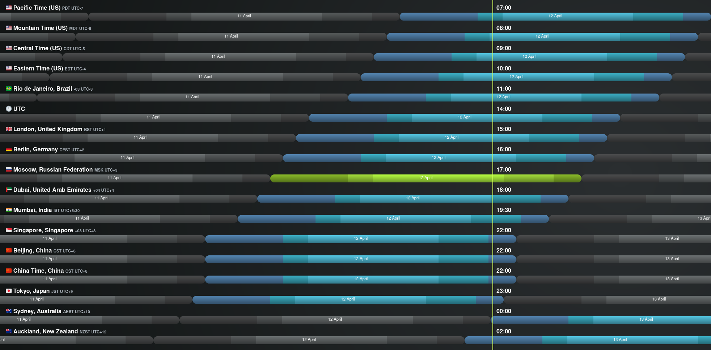

## Description

A casual voice chat to discuss ideas for ETC. All are welcome.

The ETC Discord can be joined at https://ethereumclassic.org/discord

Please join us in the #community-calls channel to ask questions or bring up topics.

## Agenda

- Grayscale funding of the ETC Cooperative came to a close
- ETC DAO https://gitcoin.co/grants/412/ethereum-classic-dao-defi-stack
- https://github.com/classicbook/classicbook
- werner "by the way, after the keep/remove call, i left a list of issues that need addressing: https://github.com/ethereumclassic/ECIPs/issues/394
as far as i can tell, no reaction so far. if anyone feels they need to work off some excess energy, that may be a good place to start."
- Bitcoin Conference 2022
- PoW, Stablecoins and recent inovation on L2
- The benefits of mining for energy grids
- Is BTC maximalism affecting inovation in the crypto space?
- Free Talk!

## Notes

> I had seen a couple of questions here about Grayscale and funding.
>
> I can confirm that Grayscale funding of the ETC Cooperative came to a close at the end of March, as expected, and as I signalled was likely many times over the past few months.   So as of April, we are do not have any ongoing funding, but are sitting on $5M+ USD and several hundred thousand dollars worth of ETC.
> 
> As an aside for any ETCG holders (and as noted by somebody earlier) the fees for that fund have now dropped from 3% to 2.5%, which brings them in line with most of the other Grayscale funds.   And ETCG, like the other funds, it remains on track for eventual conversion to an ETF.
>
> ... Total spend for ETC Cooperative in 2021 was just under $500K.
>
> Budgeted spend for ETC Cooperative in 2022 is $1.6M (we have added the Core-Geth developers since 2021 and have budget for a further three hires during the year, plus a grants program).
> 
> We are sitting on over $5M USD and several hundred K worth of ETC.
> 
> So the burn rate likely sees us with around 4 years of runway. 
> 
> - Bob Summerwill, ETC Coop Director, on ETC Discord

## Timezones

## ETC Community Calls Recordings

https://www.youtube.com/channel/UCp07VPnC1ejyAp5gMvvA4dw/videos
