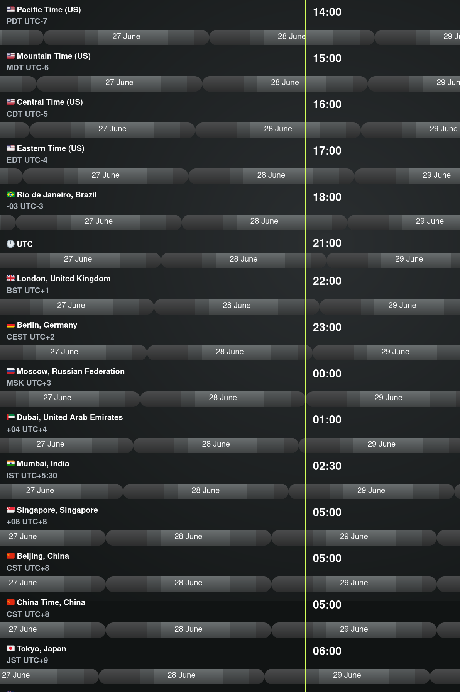

**Alert: This call is at 2100 UTC**

## Description

A casual voice chat to discuss ideas for ETC. All are welcome.

The ETC Discord can be joined at https://ethereumclassic.org/discord

Please join us in the #community-calls channel to ask questions or bring up topics.

Bob Summerwill, director of ETC coop will be joining us, please post your questions.

## Agenda

We are back after a few weeks and a lot has happened in the world of ETC.

Unless anyone else would like to host, we will go back to weekly calls near the end of September, but in the meantime try to do one per month or so. 

As always the call is recorded and uploaded to YT

### Chat with Bob Summerwill

- Reflecting on recent updates from Bob Summerwill, Executive Director for the ETC Cooperative!
  - Thank you for publishing recent report/roadmap and updating the community
  - Ecosystem Grants (We are budgeting for up to $250K worth of grant-making during 2022 if suitable projects are proposed.)
  - Treasury plans / Updates?
  - ECIP 1098 withdrawn / The Merge
  - what is in the pipeline for Core-Geth?
  - Conference in 2023?
- Twitter
  - Abandoned eth_classic twitter account. What are we going to do?
  - Story behid handing over the account to Coop?
  - Twitter managed by github ETC account idea https://github.com/ethereumclassic/twitter-together
- ETC Infrastructure
  - EtherCluster RPC Endpoint Update
  - Blockscout Explorer downtime and alerts. Solutions? Redundancies?
  - Thoughts on RPC endpoint redundancies. Setting up a static endpoint url that has load balancing capabilities? ethereumclassic.org/rpc?
- Open floor questions for Bob

### General Discussion / Ecosystem Updates

- ETC top 5 PoW Coin
- New Products:
  - ETC Wallet in Google Play store by HebeBlock
  - ETCSwap.org and Multichain.org Bridge, 8 meaningful bridged assets by EthClassicDAO
  - Top four stablecoins on ETC now
  - WBTC, ETH and BNB on ETC now.
  - EthereumClassic.com/roadmap review - lending protocol likely next.
  - TheGraph adding ETC in Q4. This should help aggregate and display DeFi data on screeners like CMC, CoinGecko, and other DeFi dashboards.
- Miner Migration, Webiste Content and The Merge:
  - When is the Merge expected? wenmerge.com
  - Do we have good guides for miners?
- Can we setup something the end users click and it auto configures ETC in the metamask? I saw his for BNB chain. Yes absolutely, Link?
- Website needs updating
  - CoinMarketCap Self-Reporting form. Need to make a blog post on the .org to verify if we want to set this up. Goal: Add new twitter account and update copy. https://docs.google.com/presentation/d/1p0-EjHE4ELpLZ8kwzP855L5x3uq941oUpCfIYSraa0g/edit#slide=id.g8830a96fa9_0_1349
- Free Talk!
- Check community calls chat / YT for questoins



---

## Full Transcript

```webvtt
WEBVTT

NOTE no-names

1
00:00:34.480 --> 00:00:37.510
classic community call number 24.

2
00:00:34.480 --> 00:00:41.510
today is june 28 2022.

3
00:00:41.520 --> 00:01:04.549
it's been a bit of a break since we last had a call so uh it feels like now is the time so thanks everyone for joining us and we have uh quite a lot of updates this week including a chat with bob sammelwell so thanks for joining us bob and we'll be uh splitting the call into two sections first we'll be chatting with bob and then we'll open up for general discussion

4
00:01:00.480 --> 00:01:29.429
and ecosystem updates it's probably live streaming now to youtube so please be on your best behavior for joining us is

5
00:01:25.360 --> 00:01:45.590
well with you and family as well arrived here in vancouver it's been very uh rainy and crappy but uh it has arrived hooray moment and uh it's extremely hot here so uh

6
00:01:45.600 --> 00:02:06.469
i'm actually looking forward to the summer ending had a chat for a while i guess uh so thanks for uh the recent update uh in terms of the uh the yearly review the report and the roadmap

7
00:02:06.479 --> 00:02:27.670
it was very interesting reading and we discussed it on a call last time but uh it's nice of you to join us so we can um dive into some of those points yeah no problem and then uh you know we're getting to the midway point on the year so there'll be a another uh update in the next couple of weeks

8
00:02:29.360 --> 00:02:50.710
and uh just for the uh for housekeeping if anyone wants to jump in um i do have some questions lined up about the report but uh feel free to uh to join the chat it's an open discussion kind of but uh we will try and keep it on the rails to some extent great

9
00:02:46.640 --> 00:03:08.070
so so yeah you know i don't have a a uh a speech to make or a presentation or anything so if you'd like to drive with questions that's that's fine i guess we can start by covering the main points that you mentioned in the blog

10
00:03:05.599 --> 00:03:27.110
article which are the grants ecosystem grants updates regarding the treasury and potentially looking at conferences so let's start off with the uh the grants program that you mentioned how is

11
00:03:25.040 --> 00:03:48.149
that going to be structured and have there been any applications so far um so so yeah you know haven't announced any details on that yet um the um there's some other stuff going on around potential uh other um

12
00:03:44.840 --> 00:04:05.270
sources of donation and income that are kind of tied into that so that's not progressing at the moment because i think it might take a different and broader form the year um uh

13
00:04:02.480 --> 00:04:23.830
within the the budget for the year uh 250k uh was allocated to that which would be the first source of grants that we've had for a couple of years uh in 2019 and early 2020 that you know there were a few uh funded activities around that time um [Music]

14
00:04:23.840 --> 00:04:44.230
but yeah tail end of 2020 was a pretty uh fallow time in the market for sure um but uh yeah the start of 2020 uh one and maybe i'll just talk about the broader financial situation

15
00:04:44.240 --> 00:05:05.430
so for anyone that doesn't know um the co-op was um was founded in 2017 um uh initially by grayscale and then spinning out into its own non-profit legal entity through

16
00:05:05.440 --> 00:05:26.790
all of that time the primary funding has come from from greyscale who run many many funds which are sort of proto etfs you know there's been a lot of um news in the last little while with regard to their bitcoin etf because they've

17
00:05:24.160 --> 00:05:46.230
had a really big push to try and finally get that uh you know approved that you could have a straight bitcoin etf the sec i'm going to be providing feedback on that in the next couple of weeks so i think it's very likely that will happen anyway um they have bitcoin

18
00:05:44.000 --> 00:06:04.110
uh ether etc uh and a bunch of other smaller ones um but yeah over the last few years they'd had a three percent fee um for holders of that fund and one percent of that was donated into the co-op um really

19
00:06:02.960 --> 00:06:24.790
through 2017-2018 2019 and 2020 that you know that didn't turn into a huge amount of money it was all pretty uh um you know sufficient for two or sometimes three people and some you know some infrastructure maintenance and and

20
00:06:22.479 --> 00:06:42.629
some small development projects uh with the big spike that there was in 2021 um that turned into a very large amount of donation in 2021 so we're sitting on around five million dollars now that

21
00:06:40.720 --> 00:07:01.430
funding ceased in um in april of this year and the primary reason for that ceasing was because there was a large amount of money you know greyscale felt that they had you know got us in a good enough position and

22
00:06:59.039 --> 00:07:21.510
and that further funding was was not required what that means though is that for the co-op um you know we have a pile of money and in the absence of new funding sources you know when we spend it it's bent and it's and it's done um

23
00:07:18.800 --> 00:07:40.790
obviously iohk have gone away labs have gone away um so yeah new funding sources are required and uh and yeah but um the the the spend that we have has gone up a fair bit this year because

24
00:07:38.160 --> 00:07:59.830
of taking on the core developers so um through the last three years or so we had funded work on hyperledger bazoo but that had always been in the form of short-term contracts with chainsafe or others really

25
00:07:56.400 --> 00:08:16.869
just around hard forks so you know those implementing the protocol changes uh on etc around hard forks at in last august um we

26
00:08:12.400 --> 00:08:32.630
hired um diego who is doing full-time work on hyperledger bazoo now so that that was that was great um at the very tail end of last year um where etc labs already dfg

27
00:08:30.479 --> 00:08:50.949
the parent company um defunded work on on core gath the previous year so january 2021 they had defunded the etc lab stuff around that core client so that was

28
00:08:50.959 --> 00:09:12.550
that included sort of like development tool things um like work that they'd had um on on tooling around the client um the block explorer they were running um and various other bits and bobs like that um you know there was there was like if you

29
00:09:10.399 --> 00:09:33.990
look back in 2019 you know they had work on on uh llvm evm they um the chain bridge um trying to think that you know other bits and pieces but they also had the the incubator um and grant's

30
00:09:30.160 --> 00:09:51.269
program and you know broader broader stuff there so that that all died at the start of 2021 um and then at the end of that year uh funding of gorquette corgeth um ceased as well so there were three developers

31
00:09:48.640 --> 00:10:11.350
at that time um luke isaac and chris uh were hired by the co-op and are now working together with with diego so we have those three core developers uh

32
00:10:07.920 --> 00:10:28.470
maintaining those two clients um and also block scout rpc endpoints and various other little bits and pieces uh that they've been working on so the spend you know has gone up a fair chunk from previous years um

33
00:10:28.480 --> 00:10:49.190
but you know it's sort of on a if it stays at that kind of level that that's sort of about three or four years um of funding that there is um and obviously the hope is that new sources of income will come from that or you know other other other ways that

34
00:10:47.839 --> 00:11:10.550
that can be extended and continued detailed update and uh interesting to know that uh the funding was cut off primarily because of the uh massive windfall that was that's taken that's uh a pretty good reason if any and

35
00:11:07.600 --> 00:11:27.990
uh it's and i think just be clear like that was you know very very exceptional as compared to the previous years you know like the looking back at sort of like 2018 and 2019 specifically right where it was that that crypto winter there um

36
00:11:28.000 --> 00:11:49.590
you know i think i think that well at least one of those years it was like running negative right that that we that that we spent more than the income and there was a you know very small amount left in the bank account um that um for example at that point when you'd

37
00:11:47.279 --> 00:12:07.509
see some it was running each year in 2017 2018 and 19 those years it ran the summit i think was it was close to half the funding for the year um essentially because the summit was never seen as premium enough

38
00:12:04.480 --> 00:12:25.269
or etc not seen as premium enough for people to want to pay to go to an ecc conference so each of those years it ended up being free of cost to participants there was some sponsorship but nowhere near enough to make up for the costs which i think were around 150 180 000

39
00:12:25.279 --> 00:12:45.990
each of those years and and the funding that we had at those points you know that that was basically like you know half the money and then you're paying two people and then you basically like you've run out um where in 2021 there you know that rather

40
00:12:44.079 --> 00:13:05.269
than three four five hundred k or maybe six you know those were sort of about the figures of that uh income that instead was you know four million so more than a 10x more than previous years so really was quite a win for indeed

41
00:13:05.279 --> 00:13:25.910
while we're on the topic of uh funding uh this kind of links in with the other points uh on your uh recent update about the treasury and potentially looking at a slim slim down version of a treasury or a new version of the treasury what do you think uh reflecting

42
00:13:23.760 --> 00:13:45.670
upon the last year and the debate of 109.8 which i believe has been uh withdrawn now what are your thinking what's your thinking on the uh the next steps in terms of a treasury is it necessary especially with this new windfall and how do you envisage a slimmed down version of

43
00:13:43.440 --> 00:14:09.350
that that would be acceptable to everyone in the community you think so yeah you know no actual work has happened on that this this calendar year and and i'm i'm my thought is that that that is really like something that is on pause for us it's not an active consideration

44
00:14:03.440 --> 00:14:23.590
at the time of writing because i think that essentially um given that windfall uh you know there is no crisis in terms of our funding um you

45
00:14:21.040 --> 00:14:41.269
know maybe if nothing changes and you know we're like getting down to to nothing and you know other uh other attempts at uh you know ecosystem sustainability are not succeeding then then yeah maybe it would be something

46
00:14:39.600 --> 00:15:02.310
to reconsider again but as of right now um i would not actively advocate for an in protocol treasury do you see a future where etc co-op converts into some kind of profit-making entity

47
00:14:59.360 --> 00:15:22.150
that can sustain itself or do you think it's going to be long-term based entirely on donations and other community contributions well an interesting kind of legal and taxation thing there as well is so the legal status at the moment of a co-op

48
00:15:18.880 --> 00:15:39.269
is that it is a public charity that's the actual status it's quite quite funny as a charity but but that that's the status so i mean what that means in practice is you are you

49
00:15:36.240 --> 00:15:57.829
know filing your taxes um with the irs um and that's basically like you know full disclosure on um donations um and those are you know with named sources that those are coming from right

50
00:15:55.600 --> 00:16:16.790
you know that's a sort of a you know a kyc'd real name kind of uh set up you know we you as a charity you know you can't accept you know cash in brown envelopes kind of equivalent that that um anonymous

51
00:16:14.320 --> 00:16:35.509
donations would be um you also are declaring you know all of your spending all of your costs all of your salaries um with donations to like groups in different countries you know that's that's declared as well so it's it's

52
00:16:32.880 --> 00:16:54.710
very kind of open setup anyway with that public charity status the intention is that any legal entity that's following that route must reach a

53
00:16:52.399 --> 00:17:13.990
certain threshold of diversity of donations after three or one i think it's five years actually um so you know they are really looking for numerous small donators right that that's really the the setup that you want is is

54
00:17:11.919 --> 00:17:32.150
that is that i i can't remember exactly the thresholds but you know a a good amount of your donations are meant to come from a broad set of individuals um and if it doesn't you can't maintain that status and i think the reason for that really is you

55
00:17:28.000 --> 00:17:48.789
know they don't want really a front for uh a commercial entity so for example you know it could be seen as though you know co-op is just a front for for

56
00:17:46.880 --> 00:18:08.070
greyscale right and then grayscale are doing that to avoid paying taxes or something like that right you know that you know that could be seen as being the case um what that means because we obviously haven't got that diversity of uh of sources is that um

57
00:18:05.440 --> 00:18:27.350
i think it's next calendar year or next tax year um we will have to transform into a private foundation so a private foundation what that means in the us is it's pretty similar to that charity

58
00:18:25.280 --> 00:18:46.070
status in that um donations you know you can get a tax credit for doing a donation i mean that's i think the same thing with the charity right is you know donations that anybody has made into into the co-op you know you can get a tax credit for it because it's a charity donation that

59
00:18:46.080 --> 00:19:07.669
i believe is still the case for a for a private foundation but there are some other things that we'd have to do slightly differently in terms of you you are as a private foundation there's a certain percentage of your um [Music] of

60
00:19:04.160 --> 00:19:24.470
your spending which has to go to um public charities so i mean in practice that's not going to mean a lot of a lot of difference but but the donations will have to be made to public charities that wasn't the case before it's not a very high percentage so

61
00:19:24.480 --> 00:19:44.789
as a private foundation you know you're not a pro you're not a for-profit entity um [Music] but it's a different flavor than than the co-op would have been um you know it will still be um this entity which is you

62
00:19:44.000 --> 00:20:08.470
know a you know the mandate really is is that you are doing you know public goods public service in some form um in a non-profit making kind of way but yeah i don't think it would make sense for the co-op to become a for-profit um

63
00:20:10.159 --> 00:20:32.789
it's a different kind of deal i mean you you know i i wouldn't if if that kind of thing would make sense i think it would be a new it would be some different new legal entity it wouldn't be a continuation really think you'd you'd uh you

64
00:20:29.840 --> 00:20:51.029
would dissolve the public charity co-op and then likely fire up a different entity that's a private charity which has a charitable requirement like uh funding kids to learn how to code for instance i don't think that you can do funding

65
00:20:49.039 --> 00:21:09.590
kids to code for ethereum classic but you could do something broad like that of getting kids computers and learning science right um so so what um so yeah the migration from a public charity to a private foundation that is a status change it isn't a wind-up

66
00:21:09.600 --> 00:21:29.909
uh of the existing one that you know that this is what will be happening next year i think but but yeah the additional requirement would require donations to a registered um public charity so yeah i mean if there are any existing public charities doing you know coding for

67
00:21:27.760 --> 00:21:48.470
kids or whatever that could do in an etc specific thing you could do that but you know if there isn't then it would be you know something broader like that yeah and so so just for clarity you said uh you can just transfer the status you don't have to wind down and dissolve right correct

68
00:21:46.080 --> 00:22:08.630
where where a transition from a private foundation to a for-profit that that would be a completely different beast and and probably yeah i mean even if you could do it i don't think it would make sense to do it because it would be such a change of of of admission that you

69
00:22:06.080 --> 00:22:26.630
know you can't go well yeah with you know all this money that we got donated in when we used to be a charity hahaha that's our private money as a for profit now you know you can't do that what about in terms of sustainability um not making profit per se but having

70
00:22:24.480 --> 00:22:44.710
some kind of mechanism that allows uh for example some kind of on-chain uh like fee taken from a contract that's used a lot as a means to fund activity via the uh the co-op even though you're not making money from it you're still self-sustaining but all of

71
00:22:43.039 --> 00:23:04.789
those funds go back into protocol development would that be still considered for-profit legally um it's yeah it's a question for the lawyers really um i mean that i

72
00:23:03.039 --> 00:23:24.470
always think it's a bit it's a bit odd with you know really centralized um projects you know where they've effectively you know they've had it a crowdfunder that you know they've had a crowdfund at the start and then you know and then perhaps they have um [Music] you

73
00:23:21.120 --> 00:23:41.909
know either either in protocol or out of protocol but on chain things you know so like zcash for example right so on d cash you've got z cash foundation and you've got the electric coin company and they're receiving slices out of that inflation um

74
00:23:41.919 --> 00:24:03.269
but the um the zcash foundation is a is a is a public charity as well you know they're there they've got a similar situation to us so i don't really know how that's okay what they're doing it might not be i mean it's you

75
00:24:01.760 --> 00:24:23.190
know it's tricky with that if you've if you've got money coming in from on chain is like how you account for that you know that the the the uh that the reporting that you have is really like you know which legal entity or private individuals donated money to you and

76
00:24:21.600 --> 00:24:42.630
they want to know that because you know that they they want to then follow that up with their own irs filings you know to to see well okay you you donated money here well to you know have you have you met your own tax liabilities um for

77
00:24:40.880 --> 00:25:01.909
doing that donation so if that's just like magic money coming out of the ether um not sure interesting i guess this is a problem that would need to be solved if there was uh like uh yeah unaccounted for cryptocurrency coming into some real-world

78
00:25:00.320 --> 00:25:20.470
entity uh maybe the allocation could be dealt with on chain via some kind of dow or multi-state yeah and you'd still need like a real world um entity to pay developers for example convert that crypto into fiat or maybe it would just be purely paying the

79
00:25:18.559 --> 00:25:40.630
developers directly from the dow to be a better uh solution to avoid that yeah i mean you know i guess it's like you know doing your own tax filings for crypto gains and things is is you know it's all a little bit that works and obviously varies by jurisdiction

80
00:25:38.480 --> 00:26:01.990
and so on but you know a magic money appearing like air drops or whatever you know um so here you go magic money appears out the sky and then what is that you know is that is that is that like income fits

81
00:26:00.159 --> 00:26:20.230
in with a with a public charity is also you know a little um undefined and we've been lucky really in a way to this point in that all of that donation into the co-op has come from real-world legal entities right

82
00:26:17.200 --> 00:26:39.110
so it's a lot of a simpler tax situation so justin just in that example i would think i mean the source is inflation so you're the network participants you're that's that's who's you're diluting their coin right so that's

83
00:26:36.960 --> 00:26:57.990
the source but yeah it would probably be income because it's expected and and it's predictable um it's hardly a donation it's hardcoded in there um i think that this is also a concern when you talk about a treasury and putting one into etc um yeah just just just

84
00:26:56.240 --> 00:27:18.389
have a background in accounting and worked in a tax company and stuff so i would just uh i would just expect that that would be income and kind of like what you're saying though um even if you did adapt a legal debt and all of that which is stuff i've been researching here in wyoming um is you still have to be a private foundation and it

85
00:27:15.840 --> 00:27:36.070
still will be taxable unless you can you know unless you're doing the charitable organization and qualifying for all of those things um so uh so i you know i don't know how the cardano foundation is doing it for instance or how zuku

86
00:27:32.320 --> 00:27:53.909
and the um electric coin company um but i'd imagine that they are paying an income tax on it um unless they're there for that uh qualifying for that um uh charitable thing uh classification and then and

87
00:27:51.760 --> 00:28:13.269
they're spending money and expensing it in that way well and i think the other thing will be different sorry i think the other thing that's probably different with a lot of these foundations is that they're nearly all going to be offshore you know they're swiss foundations they're off in the cayman islands or whatever right and then that's that's kind of like you your

88
00:28:11.360 --> 00:28:31.830
sort of your legal protection is you know well [&nbsp;__&nbsp;] you irs we're not gonna report to you anyway you know [&nbsp;__&nbsp;] you we'll go and do what we want and in those jurisdictions you know they are presumably lots of shielded from that it's like you know here's you get out of jail free card come and come and be based with us and you

89
00:28:29.840 --> 00:28:50.789
know and we won't like we'll look the other way yeah that doesn't really work in the us though because the us says even if you make money foreign you're still taxed with us um i worked for uh an exchange that attempted that uh switzerland staff and uh operas was not too happy about that so uh

90
00:28:50.799 --> 00:29:11.029
that's for sure so um so in the u.s at least i don't know other jurisdictions but in the us you don't get out of paying your tax liability just because you're organized in a different country um however if you make it so that you haven't made any income which would be inflating your expenses on

91
00:29:08.880 --> 00:29:31.909
any cash that came in in that fraction of a country in that foreign corporation done you have no income to report right so you haven't made any money and so then there's nothing to tax for the us you're making income and you recently had uh and then for

92
00:29:28.159 --> 00:29:48.549
instance like uh charles does um i certainly imagine that he is paying the u.s government and he's definitely in the state of colorado because in colorado um state tax about five percent and it if you're making if you live in congress it doesn't matter what company like where it's located in anything

93
00:29:46.559 --> 00:30:06.630
if you're missing you're getting tax colorado so it's it's definitely a discussion take

94
00:30:04.080 --> 00:30:25.269
in money and not have a tax liability with it to fund uh protocol development so it's going to be a really uh problem to solve legally um and i i i'm glad like i think you're going down that foundation i think that that's probably an appropriate rap um it's just it's

95
00:30:23.440 --> 00:30:44.950
going to be it's going to be tough because it's just all new laws and it's state laws as well so state laws differ you know so well and i mean this is the other complexity right is is you know it doesn't you know even if wyoming's you know some magic pixie land in terms of what you can do that doesn't stop the feds like they don't

96
00:30:43.200 --> 00:31:12.149
give a [&nbsp;__&nbsp;] exactly you know it doesn't stop the feds it doesn't stop the state that you actually

97
00:31:15.919 --> 00:31:36.549
so yeah so but by the way for me at least ronan you're breaking up a fair bit there just to let you yeah um ronan if you could check your mic or try and find a different mic uh it's a little bit uh interference yeah maybe maybe exit a bit and rejoin oh

98
00:31:34.880 --> 00:31:55.190
i'm sorry about that guys is this better yeah yeah this is much better okay i was out on my front porch my apologies but yeah i mean as far as i've seen the only kind of like safe in quotes sort of tax thing for any project seems to be um

99
00:31:52.159 --> 00:32:13.269
you know incorporate not in the us don't employ or use any us persons in your operations and block usa for for sales like that seems to be like the only kind of like safe thing and anything else will be you

100
00:32:11.679 --> 00:32:31.909
know compromised in some way or difficult in in some way just for to note that uh maybe avoiding the treasury has solved that problem in many uh in multiple different ways and potentially posed quite

101
00:32:29.679 --> 00:32:49.830
a significant risk if indeed the feds did want to uh cause havoc on ethereum classic so uh nice that we sidestep that yeah i mean and and all i can think is that you know for a lot of these projects that do have a foundation you know they're either in a legally sketchy

102
00:32:47.919 --> 00:33:08.310
place or they're probably paying income tax but not talking about it yeah and and uh you know z cash that's out of colorado it's out of boulder uh cardinals had a longmont which is just north of boulder colorado you know like these people if

103
00:33:06.159 --> 00:33:27.830
you're in colorado you have to pay the state tax so that and then i have no idea how they're getting away from u.s tax they're they're located out of here they employ people in the u.s um i just i i just would think that there's a lot of tax uh liability that um is going on in the background even if they even if publicly

104
00:33:25.039 --> 00:33:46.230
they might portray that they're uh you know just a foundation and a charitable thing uh i'm sure that there's a very straight conversation with the irs uh and they're and i'm sure that their tax attorneys or accountants are uh are being diligent on that because that really changed in about 2017 2018 during

105
00:33:44.159 --> 00:34:05.430
that cycle every account every crypto account and everything was like okay uh this funny business isn't isn't going to work you got to pay any back taxes and uh and uh and make good to the irs bit and now talk

106
00:34:03.360 --> 00:34:24.869
a little bit about etc infrastructure and um the first point here is uh there was a question about what is in the pipeline for core geth in terms of clients and features in the the mid to yeah i actually wrote this one and one of us i probably should have clarified i just wrote

107
00:34:22.879 --> 00:34:43.669
it real quick but uh i'm curious um with corgath what we know is the merge is going to happen and then core gath is going to become essentially upstream so how's your plan for that like what are you thinking in terms of that i think it ties into funding um as well um so

108
00:34:41.599 --> 00:35:03.589
that and then also with bezu i had another question that i forgot to add and that was you were talking a little bit ago maybe a year ago or so about adding mining capability into bezu um is that functional now uh how's that going clarify

109
00:34:59.040 --> 00:35:20.630
in terms of upstream uh uh gap will kind of be obsolete right no upstream gap no

110
00:35:13.119 --> 00:35:33.349
it won't be at all the same yeah so i mean it's i guess it's all a little bit of a mess for historical reasons so um you

111
00:35:31.680 --> 00:35:53.589
know for a long time the talk is about ethereum two right is like right you know we're basically we're gonna make a new one and it's gonna whatever well various things that you know will have sharding that we're going to have different execution environments so it you know it would be like ewasm instead of

112
00:35:49.119 --> 00:36:10.710
evm or evm and eu asms or choices and and obviously the switch to proof of stake all of that has kind of like largely collapsed um you know sharding is still kind of like planned but further out uh

113
00:36:08.240 --> 00:36:29.589
the the sort of roll-up centric approach has kind of obsoleted that somewhat um but but yeah like the the reason the merge is called the merge is because um parts which were originally planned to be separate and now kind of getting munged

114
00:36:28.160 --> 00:36:48.470
together so um with ethereum two as it started you know the first thing that was built was the beacon chain so the beacon chain's been running i guess 18 months now right so that's a a parallel chain using proof of stake but like nothing is like

115
00:36:48.480 --> 00:37:10.390
happening on that you know there's there hasn't been um smart contract capability on it um transactions aren't happening um it's just been like well here's here's sort of like the anchor point for everything else that was planned on ethereum

116
00:37:06.320 --> 00:37:27.990
two so that that plan saw you having the beacon chain that's kind of like the the center of it that you would have had the different shards um and then the synchronization between the shards happening through the beacon chain right that that's like the the center point um and

117
00:37:25.520 --> 00:37:45.829
then on the shard chains those would have had the execution environment which could have varied between the shots so for example the the continuation of the the existing chain could have been on one shot you know whatever shard zero there you go that's the the continuing um

118
00:37:45.839 --> 00:38:06.790
f1 chain but then you know maybe you have other chains which are running ewasm instead of a vbm or have you know some other changes in their properties and then that you would have some mechanism for cross-chain communication and stuff so different apps could be running on different shards but you could still like

119
00:38:06.800 --> 00:38:27.430
do a slower communication or whatever right that was sort of like the original f2 plan so like hard and basically none of that is really happening anymore um shards are still further away um that execution environments work and many

120
00:38:25.119 --> 00:38:47.030
years worth of work towards ewasm is all like down the toilet evm is is kind of like the answer and then what happened with the merge was the decision was made to basically logically merge that

121
00:38:44.640 --> 00:39:05.430
beacon chain and the existing proof of work chain so what you have in a post-merge world which used to be called ethereum two or used to be called um serenity and now is just ethereum what you actually have is you have two clients

122
00:39:03.920 --> 00:39:25.910
that you're running so you have a beacon chain client which is just you know ticking along on that proof of stake and you know the the stakers are you know minting new blocks and then the other piece that you have is you will have what they're now calling an execution environment client and

123
00:39:23.280 --> 00:39:45.030
those are the existing clients so so that's like geth aragon bazoo and uh never mind um open ethereum has died that's now unsupported and soon to be gone um

124
00:39:42.720 --> 00:40:04.550
the people that were working on that uh within gnosis are now uh focused on aragon eragon has become like a really strong number two client to geth you know guests always been the dominant client on on ethereum um you know parity then open ethereum

125
00:40:02.400 --> 00:40:25.910
was you know a very clear number two so that that isn't the case anymore it's now geth and then eragon previously known as turboget so eragon is a pretty major re-architecting of the client itself um you know running on the same protocol obviously but vastly

126
00:40:21.680 --> 00:40:43.270
different data structures those existing clients will continue to exist and be maintained now called execution environment clients so the way that that switch to pos will work

127
00:40:41.599 --> 00:41:03.910
is um some additional like rpcs or api added for those two to talk to each other so what you would have is your execution environment you know your guess at a certain block um or it's not actually a block it's actually

128
00:41:00.880 --> 00:41:22.230
identified as total difficulty so at a certain difficult you know collective total difficulty rating you'll have the transition to proof of stake and what will happen there is rather than the um in pro in process uh proof

129
00:41:20.800 --> 00:41:41.510
of work instead you're gonna have that execution environment talking through an api to a beacon chain client and you know saying hey what's the next canonical block or you know whatever kind of things that they need to do so you'll have something which would logically be equivalent

130
00:41:41.520 --> 00:42:02.230
to if that proof of stake support have been embedded in the geth client or other execution environment and you know and that you were choosing that consensus so logically it's like that right that say say if they'd never done the beacon chain separately and

131
00:42:00.480 --> 00:42:22.069
that had just been another component of the existing clients as a mode um those two clients that you're running together those two processes are logically equivalent to what would have been the case for that but yeah because of kind of the history of the beacon chain starting and then all of these different kind of changes

132
00:42:20.319 --> 00:42:41.349
of plan about this how this thing's going to work logically what you've ended up with after seven years worth of work i guess since the chain went live is effectively like okay well we're just going to have a bit of extra code that does proof of stake instead of proof of work and we're going to switch over like

133
00:42:39.599 --> 00:43:02.309
that's logically all that's happening with the merge practically it's it's split into these two clients and it's this kind of bit of a mess of a thing um but that's what's happening but what that means is that um those existing clients are going to continue

134
00:42:59.520 --> 00:43:20.950
to be maintained so we we're not going to be an upstream we're not going to have to like maintain core gas ourselves because it's irrelevant you know everything basically stays the same apart from you know that little bit of extra which is allowing it to talk to a beacon chain client which

135
00:43:19.359 --> 00:43:41.270
obviously we wouldn't be using that part but unless those clients explicitly strip out support for proof of work which i cannot see them doing i don't think it's at all worthwhile for them to do that then you know we just continue to

136
00:43:38.800 --> 00:43:59.510
downstream from them though it's only actually corgeth that is downstreaming from from gath for bazoo all of our code is in the upstream we're just working directly in in the master there there's no um you know customization that we're having to

137
00:43:57.359 --> 00:44:18.280
maintain there for bazoo though that is the case for korgf uh essentially because the guest team do not want etc changes upstream to them they've got no interest in that whatsoever so we have to maintain at least that you know the deltas for etc support um but there are other things within corgath

138
00:44:18.290 --> 00:44:39.990
[Music] which are uh you know not just related to etc support um so you know there is the potential over time we are building up other bits of functionality uh which i'm not going back and we're maintaining um

139
00:44:37.520 --> 00:44:58.950
but there isn't a worry in the same way as appeared might be the case a couple of years ago of saying oh my god you know when ethereum two happens you know it's all on us that isn't the case oh that's that's great news uh i i actually wasn't aware of that so thank you

140
00:44:56.560 --> 00:45:16.630
for going into that in detail um regarding betsy that's that's great that you're working on the master branch um regarding mining functionality i remember that uh you guys were working on that and you were trying to optimize that how is that going in terms of providing another client for minors so they

141
00:45:14.880 --> 00:45:36.950
have an option yeah so um yeah you know a fair chunk of work was done on that in 2021 um you know bezou can be used for mining it you know i believe it's got everything it needs are

142
00:45:34.960 --> 00:45:56.150
actually using that i guess it's one of these kind of like game theory things of like you've got the network effect like so why would anyone you know take take that and jump i mean i guess it would have to be something in bezu which is uniquely better and different in

143
00:45:53.200 --> 00:46:13.430
a financial way right uh so operational costs or something like that being more optimized so so yeah yeah bezel will work i don't i'm not aware of anyone actively you know using that and

144
00:46:11.359 --> 00:46:32.470
trying you know and it hasn't been a priority to say well look let's try and you know let's try and make bezu better than corgaf for mining i mean i guess you could but what was the name of that turbo gas client what what's it called now aragon aragon would

145
00:46:30.480 --> 00:46:53.270
is aragon more efficient than corgeth would that be a competitive mining client not for mining i don't believe that eragon has mining support even i don't think or maybe you know maybe it does but again it's not sort of a a main focus or a recommended thing the the main difference

146
00:46:50.160 --> 00:47:10.470
that you have with aragon is um it is vastly better at syncing and performance um the the the the way that the

147
00:47:08.560 --> 00:47:29.510
database works is completely different let let me see if i can there was a really good article on it i'll see if we can find it but so so yeah with aragon um that that was another thing which was in the plan for this year is is really to evaluate aragon

148
00:47:27.599 --> 00:47:48.470
and see um you know how much work would it be to add support for e2c to aragon uh you know to try and quantify you would see from a from a client point of

149
00:47:46.079 --> 00:48:09.030
view i mean for a long time turbo gath was kind of uh you know kind of an experiment really right you know it was sort of alpha beta kind of level you know not recommended to end users but really trying to prove you

150
00:48:06.079 --> 00:48:26.309
know can you can you basically do a complete revamp and come up with a model which is quantifiably better and and then the aim there um was really not necessarily even to productize turbo

151
00:48:24.160 --> 00:48:46.790
gaff as was but really it's a proof of concept and then if that works then the expectation is that that those that kind of uh alternate approach could then be implemented in in other existing clients or in new clients so the interesting thing

152
00:48:43.920 --> 00:49:05.270
there is is so aragon then is is the rename of that turbo guest code base so basically of a um you know a downstream of geth but with huge huge range of changes but then what they've also done is um

153
00:49:05.280 --> 00:49:27.510
uh created um a c-plus plush a c plus plus uh client using those same patterns which is called silkworm and there is also a new rust client whose

154
00:49:22.960 --> 00:49:43.430
name i forget as well clients are all using the same architecture and then the the plan is that they would be kind of plug and playable for the different parts um

155
00:49:41.520 --> 00:50:02.390
part of the rationale for that as well is related to licensing that geth is is is gpl licensed um and if you build these new components that they could be um process isolated so that they uh could be under permissive licenses um

156
00:50:02.400 --> 00:50:34.870
but but yeah really they've they've kind of stepped up from that initial sort of turboget prototype um and you know hence the renaming is is aragon is is really like production quality and and you can see that by if you look at ethernodes.net

157
00:50:20.119 --> 00:50:43.910
is it org with nine percent okay

158
00:50:45.280 --> 00:51:07.910
enough time to fill in all the questions um are you do you have a hard limit bob on time no no i'm fine okay uh regarding aragon it we saw with uh open ethereum we saw kind of a hostile team to the ethereum classic network there do we have any concerns of that uh with the

159
00:51:04.880 --> 00:51:26.150
team that's maintaining aragon uh or are they fairly neutral to the network um yeah that that isn't a problem um i'm just sorry i'm just gonna drop something into that into the notes channel where are we which

160
00:51:24.559 --> 00:51:46.870
is a further link on that so people can have a bit of a look into into aragon um great okay so we don't have a risk of any hostility from the core development there well so i've just dropped a link into into the community called notes the thing which is different with aragon is

161
00:51:44.400 --> 00:52:05.030
it's intentionally modular and same thing forever there are the code bases so so i actually got a note drop from one of the prime developers on aragon saying well hey you know you guys could make a module to our dcc support so

162
00:52:03.520 --> 00:52:23.990
that yeah you because it's designed in a modular way which all of the earlier clients were not it should i believe and this would be part of the evaluation obviously be possible to write you know here's an etc module that you can add in so

163
00:52:20.960 --> 00:52:42.470
it shouldn't be intrusive into that uh you know into that base code base i mean you know whether or not that's practically true when you actually do it you know it's always a different question you know any kind of uh modularity is is only as good as like when you've actually

164
00:52:40.559 --> 00:53:02.150
got the thing working right you don't know if it's a rich enough api to to to not leak but but yeah that it should certainly be a lot less um of a burden on to the the core team i think you know that that that probably is the you know the foundational

165
00:53:00.000 --> 00:53:22.309
reason for geth not wanting to take things upstream beyond the fact that peter hates ctc um it is really that like anything that you take upstream you kind of implicitly support it right so what's the incentive for any of those groups to like you know keep maintaining that stuff it's

166
00:53:19.680 --> 00:53:40.549
different on bezu because it isn't an upstream downstream relationship it's like literally you know we're doing the work for those code paths and it's all on us and and i guess there's a risk of if you're doing that you see specific work in bezel you know potentially some of your changes could break ethereum support

167
00:53:38.079 --> 00:53:58.230
like that's a risk um but you know if you have somebody working in there that's quite different from saying hey can can we push this upstream to you and like and if it screws up well you know it's on you the

168
00:53:54.000 --> 00:54:14.309
incentives aren't great for that detail on that sort of um backwards compatibility uh compatibility with

169
00:54:11.520 --> 00:54:32.069
uh ethereum mainnet um do you think there's gonna be a point in the future where ethereum classic for technical or other reasons completely decouples and reaches some state of stability and obviously if there's things that are specific to proof of stake and sharding then there's

170
00:54:30.559 --> 00:54:53.109
no need for ethereum classic to maintain that but then that would break contract compatibility so is there some kind of decision-making process as to how that happens and when that might happen and is that something uh on the roadmap um mean

171
00:54:51.839 --> 00:55:14.069
that the really sort of odd thing that's happened is thinking back to when i was working on the c plus client in in 2016 um i joined that team around the same time as greg colvin so you guys know greg

172
00:55:11.119 --> 00:55:32.230
colvin or not he's he's uh he's got a massive big beard looks like a looks like gandalf um and he had got you know decades of experience on working in virtual machine sort of environments he he worked on the

173
00:55:29.680 --> 00:55:50.309
java vm within um uh within oracle's linux anyway so he joined that team around the same time as me in 2016 and um first thing he did was like sort of a round of optimizations that made that

174
00:55:48.720 --> 00:56:10.630
sort of dinner 10x on the performance to that client and then he started work on that with no protocol changes right that's just optimization of the client then he started on work to make some simple changes to the evm to add support for uh subroutines and static jumps so

175
00:56:07.520 --> 00:56:27.750
those are kind of like vm or language features from like the 1970s right it's such basic stuff of saying hey let's have some op codes for like jumping to a subroutine and returning from a sub routine or you know jumping a certain

176
00:56:24.799 --> 00:56:45.510
amount of of bytes backwards and forwards anyway that stuff never made it in to ethereum um his contract actually like expired and wasn't renewed like you know he was working for a pittance bringing

177
00:56:43.520 --> 00:57:03.750
decades and decades of real-world vm experience um and and really like that what you had with the evm as as it was made it was very sight of very kind of like naive and incredibly inefficient you know having 256

178
00:57:03.760 --> 00:57:24.069
bit numbers for everything you know that so everything kind of you know you you can't use like you know none of the chips and hardware are doing that so you know it's like you you're simulating those sizes anyway so he he got changes proposed for um versioning

179
00:57:22.480 --> 00:57:42.710
of the evm for adding um adding these static jumps and um and and subroutines so none of that actually happened in the end you know he he stopped being paid but he kept doing that stuff for like a couple of years anyway and

180
00:57:40.480 --> 00:58:02.150
then the eip for that like got rejected and then even after that he kept going for another year uh trying to just do simple subroutines and then that hasn't happened so really what you've had also the answer on that um you know why that was happening was oh like

181
00:57:59.599 --> 00:58:21.190
the evm won't matter anyway right we're going to have e-wasm like you know it's going to be ethereum 2 and like everything we've done you know like that doesn't matter it'll be going away and then like that totally hasn't happened at all and what you've actually had is that the evm has become the de facto standard for like everything you know you look at all the

182
00:58:18.640 --> 00:58:39.910
other ebm sorry all the other l1 chains like nearly everything has got evm compatibility or just uses the evm you know like the evm and solidity like that's the de facto standard even though it's [&nbsp;__&nbsp;] you know so it's so it's kind of a bit of a situation like you had with javascript

183
00:58:38.079 --> 00:58:59.750
right of like you know hey here's javascript it got knocked together in a few weeks and it's totally crap oh my god like the whole of the internet and all web is work you know is sitting on top of this crappy language and it's never going to change you know i think that's largely like the situation that you have with evm is is like the

184
00:58:57.040 --> 00:59:18.390
evm has kind of like de facto ossified really already and i mean maybe you know maybe over time some of these things can be added in you know like like there's an active um there's an active eip which maybe is going to go into ethereum soon

185
00:59:16.160 --> 00:59:36.710
which is finally adding this kind of like versioning container stuff um so you know like the the evm versioning kind of stuff can fit into that you know so that you can have the potential of saying well look um

186
00:59:34.240 --> 00:59:55.349
you know is it version one or version two of the evm or what have you so you could make non-backwards compatible changes you know that you could have a okay well we've got a new evm version you know if if smart contracts are deployed with version two they can make use of these new and improved

187
00:59:53.520 --> 01:00:15.030
features but i mean the existing one like it's never gonna go away and it's i don't think it's ever really gonna significantly change because too many people are using it and you know you just stuck with it you know it's not good but it's kind of good enough and and there you are so

188
01:00:12.799 --> 01:00:34.630
i wouldn't be overly worried about having some situation where um you know ethereum do something that's you know significantly different or better or whatever and and but that better only fits within their classifications of better and it would be

189
01:00:32.240 --> 01:00:53.109
a very negative thing that you know that maybe breaks existing contracts or whatever i i don't see a lot of that potential for that in the future i think the only real like breaking potential that there is and that we have had and still do have is is

190
01:00:50.799 --> 01:01:13.030
finding that you know there are real attack effectors and you have to have some gas repricing thing you know to avoid the potential for the chain to be brought to a halt and you have to make you know these sort of emergency changes that will break some stuff

191
01:01:10.799 --> 01:01:31.510
but you know you have to otherwise someone can attack the chain and you're all dead that's interesting so you believe that uh versioning for example is likely to be another thing that ethereum classic can basically just inherit from the rest of

192
01:01:29.359 --> 01:01:51.990
the ecosystem without making too much of an effort itself yes that

193
01:01:37.680 --> 01:01:58.630
and drop it in uh ethereum

194
01:01:56.880 --> 01:02:18.710
classific ecosystem before we move to the next topic in terms of uh anyone want to ask about uh the the clients i believe we have a couple of the developers in there in the chat as well so now's the chance if you have any uh

195
01:02:15.440 --> 01:02:36.710
yeah i have a question um so i've recently about transactions and how stuff works so [Music]

196
01:02:36.720 --> 01:02:57.430
uh for example if we look at the block scout we can see that the epic the application hasn't really been updated for for a few years i think it's running the same so i

197
01:02:54.160 --> 01:03:16.230
was curious to to know if there is a plan to um to pull to pull more data from the blockchain and maybe have it sorted out and labeled to some extent where you may possibly i

198
01:03:13.599 --> 01:03:35.829
don't know see a dashboard or have something like that where you see on on five minutes candles how many transactions have been made how many were something happened to them like

199
01:03:32.640 --> 01:03:59.510
what what type of metrics can can we can we pull and uh reveal to the developers and i don't know people who are interested

200
01:03:45.599 --> 01:04:06.390
in in building scout explorer um yes

201
01:04:03.440 --> 01:04:25.670
yes had made some little note about that let me see what he said go ahead isaac sure i'll uh take a little screenshot and that'll hopefully be a good visual aid but um

202
01:04:22.400 --> 01:04:43.349
i too am very interested in metrics and observability for this kind of stuff and um as it is geth actually ships with um so so yeah the so with block scout the

203
01:04:46.000 --> 01:05:06.870
them from the linux stuff from previous calls so just a heads up is my audio yeah i can't i can't hear isaac so i'm going to be quiet until somebody says not to let you know when isaac stops talking but isaac we can hear

204
01:05:04.480 --> 01:05:24.630
you go ahead okay uh well can't hear me but sorry bob uh death ships with uh a pretty extensive uh feature set for metrics aggregation and collection it

205
01:05:22.480 --> 01:05:44.789
ships with support for different different data structures so the one that i like to use is for either prometheus or influx influx is my weapon of choice and you can use the default stack for those

206
01:05:41.440 --> 01:06:02.309
metrics um that's like grafana whatever and influx if you just google grafana influx you'll find um i'm sure some docker image that'll ship all three together and grafana provides the dashboard that's that screenshot that i'm showing you there and

207
01:06:02.319 --> 01:06:23.829
that's backed by the influx database which is a time series database and geth has a flag metrics dash dash metrics and there's some other subflags beneath that too for customization and what that configures guest to do is to post those metrics to

208
01:06:21.760 --> 01:06:43.190
the influx database that you would configure somewhere and so um that's a great way to get your eyes on this kind of um both client information there's sort of two primary domains of information that death will export for you and the first

209
01:06:41.280 --> 01:07:03.029
is the client information so that gives you information about how long it's taking to process blocks and what kinds of messages are coming in and out and when and how many of them is cpu usage on the machine that you're running in memory but

210
01:06:58.319 --> 01:07:20.150
you also then can look at some chain data and that's the other primary domain the chain data will have stuff like what's the current block head and how many transit transactions are in these blocks and you

211
01:07:18.240 --> 01:07:38.950
can then take that a step further because those two compared the block chain information itself is relative is less there's less of it than the client information part of that is because the metrics collection uh motive originated with debugging obviously

212
01:07:36.640 --> 01:07:58.549
an observability and sort of the devops side of things and so there's other sort of adjacent programs that if you look for exporter labeled programs like gethexporter and there's a few of them out there those

213
01:07:56.559 --> 01:08:17.510
work adjacently to geth and they'll connect up via rpc and then do some some extra exporting of that chain data and you can pump that that chain data into the same influx database that you already have running so that's a way to bulk up on those uh blockchain

214
01:08:17.520 --> 01:08:38.470
metrics too and one of the challenges with these dashboards um or at least with grafana itself um and influx 2 grafana is set up for um alerting to it configures really well with

215
01:08:37.279 --> 01:08:57.590
that but it's generally not used as a public tool it's used as like an internal team tool like rr servers up type thing and so it doesn't have very good permissions and it's sort of this ongoing nagging challenge is getting uh grafana dashboard that's public and

216
01:08:56.000 --> 01:09:17.030
read-only and and you can do it um and we've tried it but uh wasn't something that we felt like was a getting a lot of use and b was worth the work

217
01:09:14.000 --> 01:09:34.470
of keeping up um because it really is pretty simple to spin up for anybody on their own too but anyways i hope that answers your question and it's it's not a block not exactly a block explorer per se because those two tend to be interactive applications

218
01:09:32.319 --> 01:09:54.630
where you sort of have that dashboard idea but then you dive in and say well what's in that block or who sent that transaction and these metrics are just that they're just metrics and they're not intended to be sort of interactive step-by-step

219
01:09:51.199 --> 01:10:11.430
feature based applications but there are a few open source explorers that if that's more your speed expedition was one that the boys who worked on um at etc labs on some of the tooling that bob talked about earlier that

220
01:10:08.719 --> 01:10:30.550
they've built out using the open rpc paradigms that they were building simultaneously too and so that's most of that's in react and and node.js so it's pretty accessible and they've done great work with the the actual coding of it so that it is really

221
01:10:28.640 --> 01:10:51.590
extensible and readable and you can see what what's what and make your own customizations um as need be yes that answers my questions um in in

222
01:10:48.400 --> 01:11:09.030
on an environment that that i saw they were using um they were using wazoo agents for collecting data from multiple sources and then they were using uh elasticsearch for for

223
01:11:07.520 --> 01:11:28.470
filtering and [Music] also all kinds of plugins for labeling like let's say you have a transaction now and the

224
01:11:25.440 --> 01:11:46.390
data that you'll bring about that transaction even if it's okay or fail or you'd have it really fast like top five minutes since uh since it has been executed so basically

225
01:11:43.840 --> 01:12:06.870
what what i'm trying to to find out about if this sort of metrics like let's say how many nfts were contracted or um how many participations we we had per day in in a contract or stuff

226
01:12:03.520 --> 01:12:24.149
like that like general stuff i think i think it can be it can be useful and maybe made available for for pulling through through a

227
01:12:21.280 --> 01:12:41.510
nappy or something like that i think that that can be a tool that uh i don't know exchanges maybe institutions even ordinary users can uh can work with yeah

228
01:12:37.679 --> 01:12:59.590
and that's that uh so that use case is uh a practical one um sort of doing those contract analyses and um and further doing that in real time one of the programs you might be curious about looking into is called ethereum etl and

229
01:12:57.120 --> 01:13:17.590
so that's the builds this set of programs around the extract transform load paradigm and so that's sort of that next level into the chain data so we're not just saying how many contracts are there let's count them we're

230
01:13:16.000 --> 01:13:37.590
saying okay what do these contracts actually look like um do they match yeah exactly and um and so that's like that's again that's a deeper dive into it and so you need a little bit more specialized software to to do that but you can do it 4byte has

231
01:13:34.400 --> 01:13:54.950
some code around that too and [Music] interesting space for um for development too i'll i'll give

232
01:13:52.400 --> 01:14:15.189
it a try when i'll get more familiar with that also because if it works for i don't know um there are bits of data which it should really work fine for us so um that that would be an interesting project

233
01:14:11.920 --> 01:14:38.709
to really have a more clear real-time overview about what's happening with with the protocol [Music] at small intervals of time can't

234
01:14:41.920 --> 01:15:02.550
status have also mentioned uh even tonight that cop had had had this role had this role to maintain the protocol and keep it alive and keep

235
01:15:00.960 --> 01:15:22.070
the parity and also the stuff about the clients very great but my question is now that you are moving for for a foundation status will uh cops

236
01:15:17.040 --> 01:15:37.590
roll uh be the same or uh it will try to to have new roles uh are you are you aiming for um for new projects that aren't

237
01:15:37.600 --> 01:15:58.470
only related to the protocol are you are you looking for for uh for an extension of the the attributes you had before private foundation i mean that's that's purely a um

238
01:15:58.480 --> 01:16:18.630
you know irs tax treatment thing of the legal entity that's the only the only difference that would be there um in you know in general what we've had the focus on is those really foundational things right like the clients and the block explorer and the

239
01:16:17.199 --> 01:16:39.669
uh the public rpc and you know various other little bits and pieces um [Music] um but yeah you know stuff at a higher level uh makes sense as well and as we have capacity and ability i think you know we can pick up uh other kind of projects or

240
01:16:36.800 --> 01:16:59.910
you know through um through grants and other things support um you know support others looking to that kind of stuff uh

241
01:16:56.880 --> 01:17:18.470
we might bring this up later but uh you might also want to look into the graph which is a protocol for aggregating uh blockchain information uh that i believe etc will be uh gain support for soon so just to mention uh i wanted to switch to the next topic now which uh has

242
01:17:16.080 --> 01:17:37.830
been an ongoing thing and this i i saw bob that you mentioned in the chat there's a bit of a story behind the current uh situation with iohk and the twitter account the f underscore classic account which is currently looking like it's pretty dormant shall we say but

243
01:17:34.719 --> 01:17:56.830
is a potentially awesome source of marketing and resource given the amount of followers it has so what are your thoughts on that and could you explain the situation as far as you can see it uh my understanding of like the history of the classic

244
01:17:53.920 --> 01:18:14.070
twitter handle um um is is that it was created by some community guy whose name i forget carlos maybe um really quite early on um at

245
01:18:11.440 --> 01:18:33.830
the very start um io hk came along you know not very many months later where charles had said well hey um you know i i think that uh as as a as an ethereum co-founder he said he felt uh

246
01:18:31.199 --> 01:18:51.510
an obligation to um support people who had invested um in in the crowd sale um on on the story of you know un unstoppable immutable um adapts um

247
01:18:49.440 --> 01:19:10.310
and that you know you really have these two different visions sitting within ethereum of world computer and of programmable bitcoin um and those could not be um [Music] you know they can't live within the same instance so so you have the split anyway so

248
01:19:10.320 --> 01:19:31.990
um the first thing he was doing there was he he paid for a community manager i don't know if he hired that guy or hired someone else or whatever um he was also funding the let's talk etc podcast and then started on mantis um so at some point that twitter

249
01:19:29.840 --> 01:19:51.669
handle was given over to iohk because they were basically paying for that community management stuff um kevin i think was independent at first and then he ended up getting hired um by ohk to

250
01:19:49.360 --> 01:20:10.390
be paid for a community manager kind of role which i think he ended up taking over from the people that had been around earlier um he had tweak deck access to that handle um and that's been the case for i don't know at least three years four years or whatever that

251
01:20:07.760 --> 01:20:29.110
he had access to that firstly when he was within iohk then when he um you know they stopped funding that role and he was just independent he had that access still then when he was at co-op he had that access still and then that's ended as of february

252
01:20:26.239 --> 01:20:46.870
and he still has that access um sort of the story when kevin was coming out of iohk was that he was that that uh charles had said to him initially oh yeah you know what like you can you can take that handle with you for some reason he changed his mind on that

253
01:20:44.080 --> 01:21:04.629
uh and that didn't happen it didn't make a practical difference at that point anyway because the access that kevin had continued the same and then he was working at co-op and um but co-op never had control of that account right um you know kevin was maintaining

254
01:21:02.080 --> 01:21:23.430
the co-op zone twitter handle and and various other bits and pieces of communication around that um but he was also doing the the f classic handle like you know independently with him having that personal access right you know that was never anything to do with the co-op um

255
01:21:23.440 --> 01:21:44.070
as of sort of like through the tail end of 2021 for whatever personal reasons you know kevin has become um you know a lot less active and become very kind of dormant um and that was happening at the co-op as well which is why he you know ended up

256
01:21:40.960 --> 01:22:03.510
uh not working for the co-op anymore because nothing much was being achieved um but then that has left us in a problematic state with regard to that main twitter handle which is basically just sitting there kind of useless that is owned by iohk though that's nothing new but

257
01:22:00.880 --> 01:22:21.510
in terms of practical output that's become problematic through the combination of that ownership and kevin's own private situation um i have approached charles on a number of occasions about

258
01:22:18.880 --> 01:22:39.110
either donation of or purchase of that handle by the co-op but in a typical charlesy way this is a a typical kind of charles pattern that that you may or may not have seen you probably won't know but i've i've had this first hand is chong's

259
01:22:36.159 --> 01:22:57.750
often like just ignores things like for ages you know you just can't get an answer from him he just doesn't reply if it's not in his benefit he's got this sort of strange dual thing right of uh of like if if you want something and it's not to his

260
01:22:56.080 --> 01:23:16.550
benefit you know he will just completely ignore you or not do that i guess it's like a bit of a power play thing however on the flip side any little and on make some like snipey thing at charles he will personally reply to it within seconds you

261
01:23:14.159 --> 01:23:34.870
know that if there's a if there's something to his benefit he will act immediately um if he doesn't care so i think that's really the situation for this is is it it's not i don't think it's like in a nefarious attempt to subvert anything or that there's any risk of like you know anti-etc propaganda

262
01:23:33.199 --> 01:23:53.270
being put on there or anything it's just he doesn't give a [&nbsp;__&nbsp;] you know like after the treasury and everything and they've they've gone it's like well [&nbsp;__&nbsp;] you etc right he doesn't give a [&nbsp;__&nbsp;] it's gone so perhaps so perhaps a solution um is

263
01:23:50.960 --> 01:24:11.590
maybe contacting twitter support we saw that with that at bitcoin handle during the bitcoin uh bitcoin cash stuff and uh and once legitimacy was established like hey someone that uh this is an open source project someone needs to manage this in uh in a proper way

264
01:24:08.480 --> 01:24:30.149
for the public uh for a public good um then twitter was able ended up taking the bitcoin handle and handing it off to anonymous people that acted in good faith so i'm just thinking that might be a solution especially if he's gonna go dormant like that um it we all

265
01:24:27.920 --> 01:24:48.790
know it's an established account it's an open source project um so so i'm just trying to think of a solution because i mean you know that this is also sort of rhetoric that you often hear from people as well you know like the

266
01:24:47.440 --> 01:25:08.310
twitter handle you know that's a public thing it's a community thing right you know it's it's not it it shouldn't be privately owned you know it like belongs to us and it's like you know that kind of sounds good but it isn't actually like the real world where any twitter handle is you know it's basically it's owned by an individual and um you

267
01:25:06.719 --> 01:25:27.110
know there's um in the absence of it of it being obviously used in a malicious bad way yep it's just and you're right with the bitcoin thing they were selling bitcoin cash as bitcoin

268
01:25:24.239 --> 01:25:47.830
and which k is not doing that they're just not using the handle um so i don't know that that's like you know like what what you could even say somebody's got this and they're not using it and i'd like it well [&nbsp;__&nbsp;] who gives a [&nbsp;__&nbsp;] you know there's

269
01:25:45.520 --> 01:26:05.910
uh there's a potential risk of if everything is owned by etc corp then it becomes a little too centralized and in a way it's nice that ihk still maintains ownership but uh it would indeed be good if they could at least implement this uh um like some some kind of api key that allows

270
01:26:03.120 --> 01:26:25.590
us as a community to contribute to that twitter thread um so yeah i mean i think that's exceedingly unlikely to happen like i think like the resolution you know the only sort of resolutions are you know whatever like charles wakes up one day and decides to answer emails and and you know either

271
01:26:22.880 --> 01:26:45.350
says okay here you go or says yes that'll be a million dollars please or hopefully something a little bit less because that would make no sense but it wouldn't surprise me if he had he said some ridiculous have we tried to just go through their former formal uh support channels by chance uh i just happen to i do know some

272
01:26:42.239 --> 01:27:03.110
personnel at iohk like employees you know in the company and such uh just from working in the industry and i just i do know that people inside that organization are absolutely fond of etc especially like people that worked on mantis for instance they've designated a portion of their time and their career to trying to work

273
01:27:00.960 --> 01:27:22.470
on the network um so i'm just trying to think of other ways instead of a direct message to trials let's maybe go through their traditional support channels and see if we can kind of get it elevated through that system and get it on the radar maybe of some people in the organization and then it gets on his table that way um i

274
01:27:20.080 --> 01:27:41.189
don't know yeah kind of maybe but i mean the problem here is like the way that some of these things work is charles decides right nobody's empowered to do anything but him um and you know in a in a way if it's going indirectly it kind of might piss him off even

275
01:27:39.360 --> 01:28:00.709
more you know it's like you know somebody in ice in ihk is going hey you know somebody approached me about etc and you know whether we can do it or not and and he can be like well yeah i know so they can go [&nbsp;__&nbsp;] off so it's it's it's tricky right because it's not rational it's

276
01:27:58.560 --> 01:28:21.030
all very ego driven and that's how charles is yeah i mean his twitter account that he owns or that they own uh would be worth more if it was posting things um and it would add more value so so maybe the solution though if if we got we should probably start thinking of solutions um are

277
01:28:18.239 --> 01:28:39.110
we going to fire up an alternative uh account that's kind of um operated out of the github that's been something that we've been kind of looking at and it's plausible um if we do something like that we likely need to start listing it on all social assets in addition

278
01:28:35.679 --> 01:28:58.070
to the iohk managed one right so not removing trainers from anything but adding an additional twitter account that actually is coming out of the repo called ethereum classic and

279
01:28:54.560 --> 01:29:15.350
i don't know who like that is or what's going on like that hasn't had any updates it's hardly any updates on it but it's it's like a great name i don't know who that is tweets from 2017 or something so yeah there's

280
01:29:13.120 --> 01:29:33.910
not a lot going on there if anyone is listening to this caller knows who the owner is then that'd be great to hear out that would be an amazing solution and maybe if we maybe if we contact twitter verified

281
01:29:31.840 --> 01:29:53.990
account on twitter for the project um maybe that's around is even this dormant ethereum classic account it's not being used it's you know um so just to see if uh if that's a route to go but and an alternative to that is setting up any sort of name that uh may be

282
01:29:51.840 --> 01:30:14.709
parked that anyone has control over or finding a good name for it um i i think that's also a route we should do uh of setting up you know enough uh one coming out of the repo so there is already set up in the ethereum classic org a repo called twitter

283
01:30:11.280 --> 01:30:33.669
together which um hopefully once i get the uh credentials can be set up to run a github action to publish to whatever twitter account we want as long as we can control it and generate api keys for it so i think definitely the first step is to run either just a dummy account or one of the handles that we

284
01:30:30.800 --> 01:30:50.870
control that's reasonably uh named and then from there we could then use that as an example to petition to twitter for example to commandeer the ethereum classic twitter account and then verify that i think that would be a really good outcome yes

285
01:30:49.440 --> 01:31:12.390
and since we are here at uh and discussing social i think we should also take a look at uh at discord now i know the twitter handler is is a big a big thing but if we look at the discord this server has

286
01:31:09.120 --> 01:31:30.070
grown in the past two years it's grown from i think 2.5 k 2 and 500 people to 3 000 people so what i'm trying to to

287
01:31:26.080 --> 01:31:46.709
find out from bob if in in this program with grants if there be something uh for for this courtesy if we can improve this uh this environment it has run basically

288
01:31:45.120 --> 01:32:07.510
on voluntary volunteers and can be implemented like embedded in the website or see

289
01:32:04.400 --> 01:32:26.709
some sorts of integration with with other platforms and maybe some automatization so the question is you uh if if this court has a place in this social thing

290
01:32:29.520 --> 01:32:49.990
um that's kind of objective here is that the the server on discord i believe can be boosted so i'm not sure if that's something that can be easily done uh and what if there's any actual benefits to that because i i'm not really privy to the benefits of boosting um in terms of embedding the discord into a website i'm not sure if that's going to be

291
01:32:47.920 --> 01:33:09.750
possible to do easily because of the login requirement and discord kind of wants to keep it as a sort of gated community type thing so i'm not sure how that could be done um but yeah bob over to you so yeah i don't know i'm quite ignorant about discord

292
01:33:06.560 --> 01:33:26.709
all those features i think um but uh but yeah you know that obviously is where a lot of our actual um you know dialogue goes on i guess the the difference there between the main one between the twitter and the discord is that you know twitter

293
01:33:25.280 --> 01:33:45.360
is more sort of announcing and um you know [Music] promoting etc to the broader community whereas discord is more sort of discussion within the community that we do have along

294
01:33:43.280 --> 01:34:05.110
the lines of [Music] what historia was saying though about um about distributed ownership um so anthony actually wrote an article about that in 2018 which was talking about the fact that um

295
01:34:05.120 --> 01:34:28.149
you know the the website versus the discourse sorry versus the discord versus the um twitter account versus the community fund versus the the the co-op and you know that you had this this big spread of uh

296
01:34:24.800 --> 01:34:46.950
of of kind of owners and resources very intentionally um is like miko owns it right and it's essentially like again one of these you

297
01:34:44.639 --> 01:35:07.669
know feels like it's a community shared thing but it really isn't um you know miko does what he likes on on discord and and myself and others at various times have noted that it can be very low uh

298
01:35:04.639 --> 01:35:25.570
signal to noise at times you know and i guess so part of that is sort of you know social defense and toxicity and so on but more friendly to newcomers and so on yeah maybe there's things that you can do

299
01:35:23.440 --> 01:35:43.590
technically [Music] but equally community owned they're really owned by the people that are running them and the moderators um

300
01:35:44.480 --> 01:36:06.310
yeah could discord be improved uh i certainly think it could but i don't know exactly what that looks like and i don't know if you necessarily have consensus or can reach that easily on on what those changes would be you know what i've seen historically is really that things kind of

301
01:36:04.400 --> 01:36:27.990
don't change um you know it is how it is we've had right and that's probably out of scope of co-ops uh contribution to the network right you're you're focused on the network the infrastructure some of the public goods uh a discord server likely isn't qualifying

302
01:36:23.760 --> 01:36:45.910
in that regard really is it um i mean it's it's it's sort of a broader issue i guess in terms of general sort of messaging and marketing and you know sort of product

303
01:36:42.719 --> 01:37:05.270
fit kind of stuff right is um you know there is no single authority there's no single truth on you know why etc is is good what the key features are why people should be interested and it's you

304
01:37:02.480 --> 01:37:23.030
know you if you have a situation where you've you you have got a foundation and they've basically got all the money from the crowd sale and then they can you know do campaigns and you know and ads and sponsorship and all of this in a coordinated

305
01:37:20.400 --> 01:37:42.070
kind of way like that that's never really been the the deal with etc um and certainly for the co-op you know well actually there were some ad campaigns i think the year before i joined um the co-op and they were just like grossly

306
01:37:39.920 --> 01:38:01.430
expensive and i don't think they did any good whatsoever sponsored i think i think one time we we sponsored um i think it was left berlin we did a joint sponsorship between us and and labs but

307
01:37:59.199 --> 01:38:21.109
you know that's just not really been the pattern for etc i mean you know maybe it could be you know we've we've got more money now you know maybe we do like do some big ad campaign thing but yeah it it it doesn't feel very easy-ish the

308
01:38:18.880 --> 01:38:41.270
best marketing in crypto ever is price go up uh you know if etc goes up in value that is literally the best thing that can happen so i think focusing personally i think focusing efforts on the public goods like you're doing the clients um you know the block explorer keeping keeping

309
01:38:38.560 --> 01:38:59.350
that up the reliability on that i think those are great lifts uh especially the rpc endpoint i think that that's a solid lift those things result in usability and people able to use the network which results in price going up in the long run and you

310
01:38:57.199 --> 01:39:17.910
can't beat marketing uh you can't pay for marketing or or uh exposure like the coin going up no and i mean i think the other thing as well is you know you you sort of yeah you've got to play your own game you know if you if you

311
01:39:15.440 --> 01:39:35.510
try to sort of go that kind of you know ad money kind of marketing kind of approach well you know look across projects like even the smallest kind of projects uh you know i say not l1 chains but you know whatever l2 stuff or particular you know daps

312
01:39:33.600 --> 01:39:54.790
or whatever on ethereum they've often got hundreds of millions of dollars worth of like you know ecosystem grants you know promotion all that stuff right like you know we can't compete with any of that you know so are you just sort of pissing your money away on something which is going to be you know 100th of the of

313
01:39:52.880 --> 01:40:13.030
the kind of size of something that these other projects can do you know i don't think you can really try and do things that way i think you know you just kind of waste your money yeah you definitely i think you waste the resources especially when uh ethereum classic has thing you know properties that no other chain can replicate

314
01:40:13.040 --> 01:40:34.709
and like you're saying if we just stay in our lane we make sure that the network you know the usability of the network is uh easier on the end users and the people trying to integrate uh at this point this network's at a phase where it's about onboarding users and projects and making the experience a little bit easier

315
01:40:31.520 --> 01:40:52.229
um it's you know all of that will fall into place we get we got the hatch rate coming our way um we're in a good position uh and i agree with you 100 i don't think that we need to be uh blowing your budget uh doing google ads you know it's

316
01:40:49.040 --> 01:41:11.669
it's not a good spend no i don't think so to that topic is the uh the idea of conferences and whether there should be another etc conference maybe next year uh are there any

317
01:41:08.960 --> 01:41:30.390
thoughts on that bob or plans well so i mean we're in a very different situation with than we were in those previous years right you know sort of talking about well 50 of the funding being used for that uh so you know i mean it's certainly feasible that we could do a summit like we've done previously and maybe that's 150 200k i mean it's a big big kind of spend

318
01:41:28.560 --> 01:41:48.870
but you know maybe that's kind of okay i think though that probably what makes more sense is doing like an etc add-on event or parallel event as part of you know like existing things you know like

319
01:41:45.840 --> 01:42:07.350
around devcon or around uh edcon or scc or consensus or you know other other kind of uh conferences i think that's likely to make more sense in that um i

320
01:42:05.840 --> 01:42:26.950
think that's you're going to where the target audience is opposed to having them just come to classic you're like i look at it as what you're really promoting is you're promoting evm technology right so really like any network that's running on an evm our whole concept is that evms are extremely interoperable

321
01:42:24.159 --> 01:42:46.390
um we we all have different properties as a network but classic has its very decentralized proof of work all of that but other networks have value for other things it's not necessarily our lane and our value prop to the network um but i think that's a i think that's a great approach to conferences

322
01:42:42.639 --> 01:43:03.270
is just saying guys we years ago we talked about a multi-chain uh reality we're living it now so we're all on the evm uh branch of the ecosystem let's aggregate and kind of all work together uh because we're built on the same underlying technology

323
01:43:03.280 --> 01:43:24.070
yeah i mean you know you look at existing you know conferences and you know there is tons of that right you know and it's not just well hey you know the ethereum l2s are turning up at the ethereum conference you know you you you will have you know a whole bunch of other sort of evm based uh chains there even

324
01:43:21.679 --> 01:43:43.830
if they're sort of competing l once because as you say it's you know it's all sort of related kind of world i mean you know i think you know only the um you know really kind of big alternate l1 kind of for having their own specific conference you know like you'll see uh

325
01:43:40.800 --> 01:44:01.189
you know the ava conference or or polkadot um you know or i don't know if solano even do their own one i guess they do um and there's a cardano one but you know i think that only really makes sense if you've got some you know something which is very

326
01:43:58.800 --> 01:44:20.390
very different and kind of you know sort of pretty incompatible kind of technology um but yeah in in the main you know evm ethereum flavor world is obviously like that's

327
01:44:17.679 --> 01:44:39.030
that's what the market is his is showing has got the network effect you know that that for all of its sims the evm and ethereum flavors you know that's that's what's won in the market right and i think i think when we talk about

328
01:44:37.040 --> 01:44:57.590
long-term adoption we talk about you know we it's not like hey let's re recreate every project that's ever been built on an evm we want we want to be having conferences where people look over and they go oh maybe we should be deploying our project on ethereum classic as well right

329
01:44:55.440 --> 01:45:15.669
you know they're looking at multiple evms to to attract users and it's not very challenging to deploy on multiple evms a little challenging to bridge but you know we're getting that functionality where we build those ramps and i think that that's where you uh

330
01:45:13.119 --> 01:45:34.149
get value out of holding a conference is that then someone starts deploying on that network on your network and then we see the we the network effect starts building uh interoperability starts building classic becomes just a default in the conversation of oh of course we'll support classic as we launch you know that's i think that's the goal and that's

331
01:45:32.960 --> 01:45:54.390
where we're going and i think hatch rate will secure that messaging um and i think yeah having that type of presence at a conference uh especially from an organization like yours would be really high high value i know i know you're uh familiar with the conference circus circuit so it's nice to have a representative uh like you out there doing

332
01:45:52.719 --> 01:46:13.669
that yeah and i think you know you don't you don't need to have sort of arbitrarily different tech like i think that's something that that got really screwed up with classic death right was was that you know the way that classic death came to

333
01:46:11.679 --> 01:46:33.750
be was like you know in the heat of that you know in the heat of the hard fork that you really had you know your classic get team basically going you know [&nbsp;__&nbsp;] you get team you know we know we're not going to work with you we hate you [&nbsp;__&nbsp;] you and uh and then classic geth just

334
01:46:31.600 --> 01:46:51.750
kind of like drifting off more and more so that it wasn't in a situation where it could keep taking changes from upstream and it just you know diverged off into a place that ended up like being bad right where the thing had just rotted because they couldn't take the changes from geth because you know because

335
01:46:49.920 --> 01:47:11.270
of that beginning and you know that's really where first multi-geth and core geth came in was going okay well that was a mistake can we like go back to where geth is now and add that etc support in and have a you know a smaller delta to support um

336
01:47:08.880 --> 01:47:29.830
and and similarly you know the idea of having you know etc specific sort of tooling or sdks around the client you know that never made any sense to me uh because it's like well actually what you really want is you know you just want all of the good stuff that's happening on ethereum just to be you know usable on

337
01:47:28.080 --> 01:47:48.229
etc as well right you don't want to make your own metamask really if you can avoid it to carry you don't really want to make your own wallet you don't really want to do you know a lot of these things because basically you're not going to do it better than the existing team and you've given yourself a real maintenance burden like

338
01:47:46.320 --> 01:48:07.189
it's it's it's way better if you can to just sort of you know have as etc as a sort of a mode or supported different option within these existing tooling i mean that's why you know that that's the the setup that we have with bazoo is in my mind you know really ideal is is saying well look you

339
01:48:04.560 --> 01:48:26.709
know we're not off some weird branch of our own or you know uh off to the side you know we're just we're just in there you know working working in the upstream i mean that that sort of ideal to my mind and same sort of thing with any you know supporting tooling or whatever you know you don't or

340
01:48:24.239 --> 01:48:44.629
conferences that matter you know you don't really want to have your own thing unless there's a really good reason for it you really want just your message to be like mixed in and you're you know and the support to be all mixed in and you know that it's just like well hey you

341
01:48:41.840 --> 01:49:05.430
know choosing to use ecc is like a you know is like a trivial thing to do on end users or on developers or or anything right you know so you don't have the and generally uh bob and generally speaking that's why we've seen etc be able to integrate with every crypto exchange is that if they ever

342
01:49:01.600 --> 01:49:22.709
supported eth it was trivial to add etc into their wallet infrastructure and while infrastructures are um you know extremely complex and it's all about security because so much funds go through so um so i so i agree with you if you look in that light i mean we should be applying that uh that

343
01:49:20.159 --> 01:49:41.270
kind of across the board of to try to onboard users uh you go to where the users are at and you make it extremely easy uh and i think that's like with your rpc endpoint uh with metamask you know if we have a button that you click a button and it updates switch the etc network and we're good to go uh that's what the users

344
01:49:39.520 --> 01:50:00.070
need and then all of a sudden they're using classic and they're like whoa look at the fees on here like what's going on you know um yeah and they're not having to install a new browser plug-in and everything that you're talking about i think that that's kind of that that is a great uh approach to how we should start moving forward

345
01:49:56.560 --> 01:50:17.830
as we onboard projects people um and do do any sort of upgrades yeah conference side um there's yes in terms of tagging onto different communities the the main ethereum community

346
01:50:16.000 --> 01:50:38.870
is an obvious win because there's lots of developers that know evm but there's also the philosophy side which we can also tag on to in terms of the bitcoin community so worth considering many different types of conferences there yeah uh i mean i guess the the difference you have on that bitcoin side

347
01:50:35.599 --> 01:50:56.149
is you know how how maximalist uh are they you know is it is it gonna be all uh you know [&nbsp;__&nbsp;] you guys there's there's no value in smart contracts anyway keep away from our conferences with you yes [&nbsp;__&nbsp;] coin i think a lot of uh i

348
01:50:55.280 --> 01:51:16.629
mean historically i think a lot of bitcoiners did sort of support etc as an underdog so there might be a bit of like enemy of your enemy type thing lot of bitcoiners though they're just not even thinking about btc because they're not actually without anything

349
01:51:14.480 --> 01:51:34.870
other than bitcoin like they're not thinking about technology even you know they're not really looking for any changes or improvements you know it's it's it's doing what it's meant to do and there you go that's the world right but that's something i think that could change like if we are i'm

350
01:51:32.880 --> 01:51:55.990
positioning ourselves as on their side like we agree with their arguments um we're just saying look here's a here's an extension to that kind of possible um you know like great catholic commonality there is about proof

351
01:51:52.560 --> 01:52:14.070
of work right you know that that especially when you know post merge when you've got real sort of clarity and split there um as you guys were pointing out earlier you know we're in a situation where atc if you're looking at proof of work chains is is you

352
01:52:12.159 --> 01:52:33.910
know is trucking right up near the top now um so i think post merge when that you know that ambiguity of of saying well yeah but ethereum's still proof of work uh you know when that's gone that proof of work side is is is a real uh potential

353
01:52:30.960 --> 01:52:52.550
um you know rallying point across those um different groups i think yeah and i think i think uh you know proof of work guarantees uh users you guarantee mining users as the you you have this massive base um and so so we'll

354
01:52:50.000 --> 01:53:10.310
definitely have users because that you know because as we climb that proof of work uh ladder uh i think i think the articles recently had said it was 15 billion dollars of equipment was spent on ethereum uh mining equipment so i mean that's the stuff that's going to turn on over here those all have real users

355
01:53:08.719 --> 01:53:29.589
behind there um it's just about making making uh making making using the network uh easier right now there's the couple months dealing with ethereum classic there is a little bit of friction uh doing stuff like making it really

356
01:53:27.840 --> 01:53:48.790
clear how to use remix and ethereum classic for developers um getting meta mask if we can get that native support i have no idea uh you know what what's going on with the div path on the on ledger to metamask uh with ethereum classic there's something going on there just

357
01:53:45.520 --> 01:54:06.709
those little things they're not huge lifts but it's it's just this friction of using it and if we could just clean that up and polish it up i think we'll be in a really good spot native support for etc that's something that

358
01:54:04.320 --> 01:54:25.350
you know there were many many um discussions on or or talks on that but you know that that's not going to happen they they've you know they added sort of plugability stuff so that you can you know that you can build your own add-ons but switching the network

359
01:54:23.280 --> 01:54:44.390
i think somehow weirdly didn't work for that um have a link that you click and it auto configs to metamask so we should likely look at something like that uh at least on

360
01:54:42.639 --> 01:55:03.750
the website getting that in there so that anyone just has to click and then automatically it's actually really easy i could definitely do that oh cool cool okay so yeah we should we should try to get a pr in for that um and then uh my understanding was that metamask was adjusting their code to add uh so you could set your

361
01:55:01.199 --> 01:55:21.270
div path and corrupt kind of the bug that we have with i believe it's ledger and uh and um and metamask it probably doesn't affect that many people because how many people actually use hard wallets i think it's like power users use them um but anyways i don't want to get too deep on that

362
01:55:19.199 --> 01:55:41.510
i just was thinking that it's worth noting i believe that that that will change and get fixed at some point completely just unrelated but popped into my mind another thing um that the guys uh have been working on here

363
01:55:37.040 --> 01:55:57.270
is uh gnosis safe uh for etc so uh getting up a gnosis safe uh front end deployment um there's quite a lot of back end services um but but yeah we are actively working on that and hope to have that going quite

364
01:55:55.679 --> 01:56:18.470
soon so that so that you can create those safe instances on etc just as easily as on ethereum can you uh just briefly for the call can you just explain what a gnosis safe is for for those listen let me see how they describe so i mean to my understanding gnosis safe

365
01:56:15.679 --> 01:56:35.990
is a is a continuation of um of the gnosis multisig um it used to have a different name i forgot what the old name was um oh yeah yeah so old multi-sig

366
01:56:33.360 --> 01:56:53.430
legacy multi-sigma by gnosis so it's yeah so no safe is a successor to gnosis multisig so you know for anyone that doesn't know um on bitcoin you have built in in protocol support for multisigs um that has not been the case for ethereum like by

367
01:56:52.080 --> 01:57:14.229
design um you know that you have the smart contract functionality so that anyone can build up anything they like um the uh issue has been that some of the multi-sigs that have been written have failed in horrifically terrible ways um with parity's being the prime

368
01:57:12.080 --> 01:57:33.430
example of that anyway the the gnosis multisig instance has been the most reliable one as far as i know of a uh you know smart contract implementation with multi-sig on on ethereum so um if you let

369
01:57:31.040 --> 01:57:52.310
me see if you just search for gnosis safe um there's all the information on there um you

370
01:57:49.040 --> 01:58:10.470
can go off and make a multi-sig uh through their ui yeah that's great very cool there's uh no uh sorry the the safe has a fairly standard api and i believe there's uh various different front

371
01:58:08.639 --> 01:58:28.709
ends and other integrations that would then potentially work with that right well we've been running for almost two hours now so i wanted to uh

372
01:58:26.719 --> 01:58:47.189
potentially wrap things up fairly soon um i think uh as we have a whole bunch of content for the uh ecosystem updates maybe we could do another call next week at the same time if people are available uh to go through that because uh this this call has been very content heavy

373
01:58:45.040 --> 01:59:06.629
and uh i think it's about time to wrap up so if there's any final questions uh that the floor wants to uh post about or just topics that you wanted to have burning desire to bring up then uh now's the time here was

374
01:59:03.599 --> 01:59:23.990
the rpc endpoint we had started talking about uh a load balancer for that um i was just playing around with aws they have low balancers any thoughts on on that in the future maybe having like a static url but then we have a load balancer that's pointing to you know just

375
01:59:20.719 --> 01:59:40.950
preparing that uh endpoint uh for the future when uh there are multiple uh rpc endpoints available two thoughts i have on that firstly you know if you

376
01:59:39.599 --> 02:00:01.030
know if you're running that front and load bounce like who's running that you know because if that ends up being the co-op well that's kind of you know not really adding or doing anything the other question i would the other point i would have is you know until you've actually got somebody running other um endpoints

377
01:59:59.119 --> 02:00:19.990
you know with some reliability guarantees and you know quality hardware behind it i don't know it'll make any you know that it would practically improve anything um i think what is certainly workable and may be beneficial would be to

378
02:00:18.159 --> 02:00:38.390
establish a new canonical rpc endpoint you know which would be whatever you know ethereum classic.org rpc or what have you um that would then point to what we're running initially i think you know you could do that easy enough um

379
02:00:35.920 --> 02:00:56.950
and it would give you know a degree of um well firstly just stability for that rpc right you know that the ethereum sorry ether you know ethercluster.com where we've got the stuff at the moment you know like that's a stupid name because it's not even running ether cluster anymore but you kind of stuck with that right because that was what being

380
02:00:55.119 --> 02:01:16.390
was being used so i think getting a better canonical name and then over time you know trying to get everyone to be like using that one i think that would be a good thing i mean i guess you know you could play around with load balancers but like and until you've actually got a quality other thing to point

381
02:01:15.040 --> 02:01:35.109
at i don't i think it's just you know it's just a premature thing like it you know it might be fun or be a bit feel good but i don't think it will actually benefit end users at all the redirection maybe is useful bro i think that it's cart before the horse

382
02:01:32.400 --> 02:01:52.950
as well and i i think that uh just addressing like a static url um off the dot org i think that that's probably the best approach right now my biggest concern with all of this has been uh end users and their configuration in mask and then what happens

383
02:01:50.480 --> 02:02:12.070
like if you're funny and run dry and then uh and then they're like oh no you know my meta mask isn't working anymore yeah yeah i mean it would be it would be better to have it under that url i i would agree i mean the the pain is it's going to take like forever to do that migration right

384
02:02:09.920 --> 02:02:31.589
you know it's like it's not like if the cluster can get like turned off because that might break everything so it's like going to be this sort of slow process of saying well hey here's a new canonical one and can you all start like moving towards this um but but yeah i mean even if you've got only got

385
02:02:29.199 --> 02:02:49.270
a partial move well at least you know in in some disaster scenario then yeah you you you know you're not pointing somewhere bad though i mean the other thing i'd say is like you know even if you did have a situation where say the co-op gets completely you know is is going away like that's not

386
02:02:47.599 --> 02:03:10.070
going to happen in any kind of hurry and even if it did it would be like well hey look we can just turn over the the dns listing to somebody else and they can sit behind it or whatever right i don't i don't foresee any situation where you know it's you're gonna have this disaster

387
02:03:04.320 --> 02:03:24.790
cut off and we all get you know before there's time to do anything i think that's unlikely but but yeah having a better name would be useful i think and it's a small smaller scope thing to do yeah and then and then we can have uh whatever

388
02:03:23.360 --> 02:03:46.550
that button that we were just talking about on the dot org to configure your meta mask it runs to that new url right um and then and hopefully that's how we start seeing the adoption but um okay thanks thanks for the answer something

389
02:03:44.719 --> 02:04:05.750
to the bob uh i think yeah the um the name should be changed and uh we can also have in case of disaster uh like a docker image that we can run and maybe hooked it up under under

390
02:04:03.920 --> 02:04:27.109
the dns or have a podman container just to run it up and uh i don't know i think we can get up five really fast and uh uh see for a test prior

391
02:04:25.679 --> 02:04:45.990
to the change to rivet so i mean initially obviously uh you know if the cluster was running a cluster of kubernetes stuff it was that kind of setup and that and a certain point that that got switched to just a single strong node like

392
02:04:43.280 --> 02:05:03.830
that was the the setup prior to going to rivet now that obviously did have reliability issues which is why we went to rivet but it's worth knowing you know in that disaster scenario if you're just like okay well we'll you know we'll we'll just spin up a node and point to that you

393
02:05:01.520 --> 02:05:34.790
know that that that's largely enough to keep things going along for right now you know you wouldn't want to be stuck with that but if you needed to do that like you could do that and it would mainly be kind of okay for a bit yeah

394
02:05:18.239 --> 02:05:44.550
okay i see i

395
02:05:37.040 --> 02:06:30.629
can't say more than yes say

396
02:05:47.360 --> 02:06:30.629
much

397
02:05:47.360 --> 02:06:30.629
more

398
02:05:47.360 --> 02:06:30.629
than

399
02:05:47.360 --> 02:06:30.629
that

400
02:06:32.639 --> 02:06:53.109
there on the mining side is that you know ecc has been this tiny minority within athash you know that won't be the case anymore um post merge so all of a sudden etc is is a lot more important to that mining community yeah grassroots

401
02:06:51.119 --> 02:07:12.629
marketing right there i mean those those people will be trying to get everyone using ethereum classic bob has your position changed on whether you think the merge is actually going to happen it seems pretty likely now now yeah no it's totally going to happen you know a lot of people are like skeptical all you know whatever it's keep

402
02:07:11.119 --> 02:07:31.669
getting pushed back and blah blah blah but i think you know anyone who has been involved with uh you know large software engineering projects knows that that happens all the time you know all major uh you know all major uh software engineering projects like they're nearly all

403
02:07:31.679 --> 02:07:52.629
you know late a lot harder than you thought um and but but what you see if you if you're really sort of watching what's happening um on the merge and on that ethereum protocol development is it's close you know it's really really close um there have been multiple rounds of of test

404
02:07:51.040 --> 02:08:14.870
nets of you know huge big long chat checklists of everything that needs to be done and verification of of all of these different combinations um of of the execution and beacon chain client and now um i think it was roxton has gone through emerge and

405
02:08:10.719 --> 02:08:32.149
like then next up it's uh um goalie happening very soon so yeah the merge is totally gonna happen you know like judging the timing like yeah who knows uh i mean i i would think it's gonna be this year but but yeah like chances

406
02:08:29.760 --> 02:08:51.109
of it not happening like it's gonna happen okay i just have a quick question for anyone can answer um either bob or anyone um so with obviously there's a lot of incentive for the miners uh coming from eth after the merge because they won't be mining ether anymore

407
02:08:47.760 --> 02:09:09.669
um and so obviously there's incentive for them to come and mine ethereum classic but my question is what do we have to incentivize people that are not miners to come to ethereum classic um people who are just using the de5 protocols just as they are what

408
02:09:07.199 --> 02:09:28.550
can we do to increase our chances of getting some of those because from a user's perspective somebody who's using ethereum um regardless of whether it's proof or stake or proof of proof of work um what happens is uh you can't actually tell a difference in metamask or anything like that between

409
02:09:25.920 --> 02:09:46.790
the different protocols so the fees might be cheaper but there's absolutely no way to know so there's no reason why anyone would come to ethereum classic without having some additional benefit other than just it's still proof of work because i don't know how

410
02:09:41.840 --> 02:10:03.750
many people that's going to bring argument really uh uh it's it adds value and security uh to people setting up projects on top of this network uh pretty much back if you look back to kind of the cycle uh

411
02:10:01.119 --> 02:10:22.069
what 2018 2019 uh we really started seeing kind of the foundation maybe 2017 and then some a couple earlier ones but we started seeing the foundation to what we'll see built on this network and back then the hash rate was fairly low on ethereum and then what you end up seeing is

412
02:10:20.159 --> 02:10:40.470
that you see as this hash rate starts increasing and there's equipment to do that via the merge is kind of the theory um those projects will turn on and now once you have those projects natively turning on to this network uh then the end user that

413
02:10:37.520 --> 02:10:58.390
is using d5 or whatever you know whatever product on top of the network there is an option for that on ethereum classic um right now you don't see that because ethereum classic hasn't had the hash rate to secure a material amount of value on top of

414
02:10:55.920 --> 02:11:16.790
the network um but that's good that's all getting ready to change so we're kind of entering a very big paradigm shift for the network and it's been positioned for this for a long time as many have said uh the merge was expected years ago so i think a lot of classic a lot of the people on classic thought they

415
02:11:14.639 --> 02:11:35.589
would do the merge a lot sooner uh that hasn't happened but now that it's becoming a reality a lot of the position and all of that is is now going to happen um or is now going to come into play uh and then all of the mechanics the economic interest and all of that is kind of set up

416
02:11:33.280 --> 02:11:53.990
for people to just organically kind of do what we saw on ethereum just on classic and uh it might proof of work might not matter to the end user uh but it certainly matters to someone that's issuing tether on a network you know or

417
02:11:51.520 --> 02:12:12.870
issuing issuing a stable coin or or um setting up a big uh you know uh a big d5 project uh they want to make sure that there's a lot of hash rate securing uh the transactions going through uh and that uh it's 51 resilient and we hadn't been 51 resilient until mess

418
02:12:10.719 --> 02:12:32.390
and etc uh so uh so anyway so we're positioned in a right in the right spot for that but i i would just think uh the end user yeah might not uh see it right now but projects will and especially if someone like bob is going around to conferences talking to projects that are starting up that

419
02:12:30.320 --> 02:12:51.350
are seeing success those people will start turning on on classic um so i would just expect that and then you'll see native erc20 tokens uh kind of just that whole cycle that you saw on eth over the last five years got it um so just one thing uh to in response to that saying

420
02:12:48.880 --> 02:13:09.990
that is like saying solana because it's proof of stake should never should never have grown never have a defy ecosystem but even though it is proof of stake people still decide to use that uh and i i don't like proof of stake i have nothing for it i don't think it's gonna last very

421
02:13:06.719 --> 02:13:27.189
long um but they have built a much larger ecosystem than this so to say that because people um on eath now don't uh prove i it's there's no way to know if they would prefer proof of work or proof of stake because if you think about it you know of obviously us we do hope

422
02:13:25.840 --> 02:13:46.069
that the merge is going to bring a lot of um miners and people to ethereum classic but from you know from the standpoint of someone out from an outsider you know for them to say that this is guaranteed to happen is a little bit of like uh fugazi you know it doesn't i

423
02:13:43.599 --> 02:14:05.510
understand but i do think that there needs to be something more here ready for those especially if we want the users the miners obviously is going to be pretty clear that they're going to show up here but the users that's what matters and and for them to come here we need we need stuff built and at the current moment

424
02:14:03.520 --> 02:14:23.990
in my opinion i don't think we're ready uh and when i say built i mean decentralized finance you know an ecosystem the the network itself uh and the you know the miners and and the security is absolutely flawless it's great right now it's going to be much better after the merge so

425
02:14:22.159 --> 02:14:43.430
it's just a question of what can we do to ensure that that growth will happen because it's not guaranteed and to think that it's guaranteed is in my opinion just a little bit you know not not the best best thing to think i think i can just jump in here and say i think uh this

426
02:14:41.119 --> 02:15:02.149
might be a good point to uh segue into the the next week's discussion because a lot of stuff going on so um in the interest of time i think uh for this week we can wrap up soon uh unless there's any other burning issues uh but next week we can definitely dive into discussion

427
02:15:00.320 --> 02:15:23.350
about where the ecosystem is going and to answer your questions uh with weidergarten uh about the new things that are happening on ethereum classic right now in terms of defy and uh some very interesting stuff going on so please join us next next week for that question after the call we can head into the

428
02:15:20.000 --> 02:15:42.790
dms if that's okay with you i can i could be on the call next week we can talk about okay if you wanted that that's fine too okay uh good talking to you guys any other final things that anyone wants to jump in and say have

429
02:15:41.360 --> 02:16:01.239
a great weekend thanks for joining thanks for the time bob yeah keep up the good work and uh thank you everyone for participating in this week's call and we will see you again at the same time next week to continue part two of this discussion so uh thanks again for joining us and see you next time bye
```
