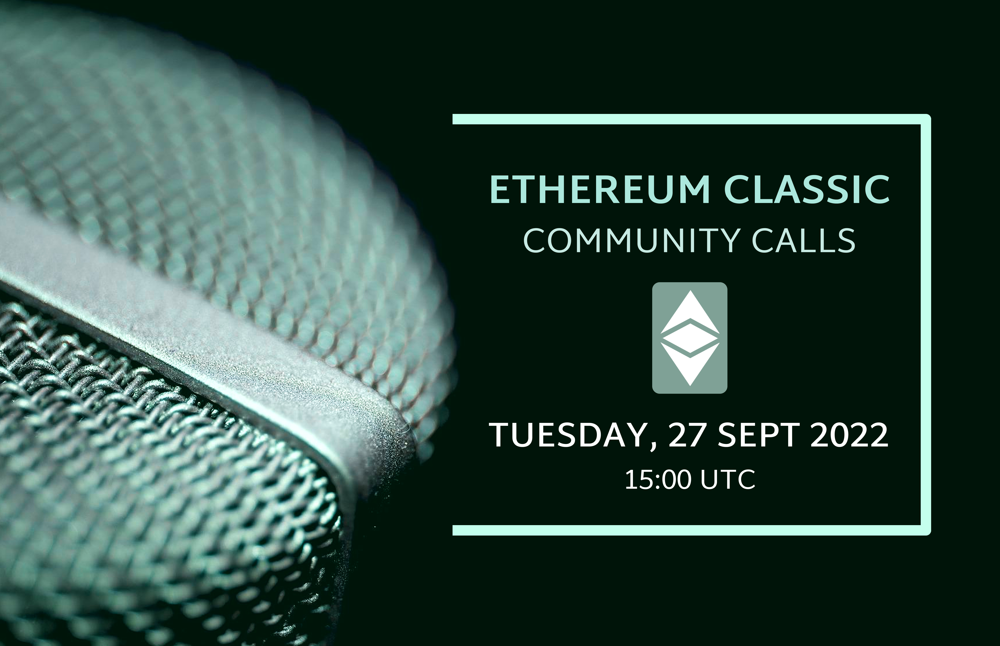
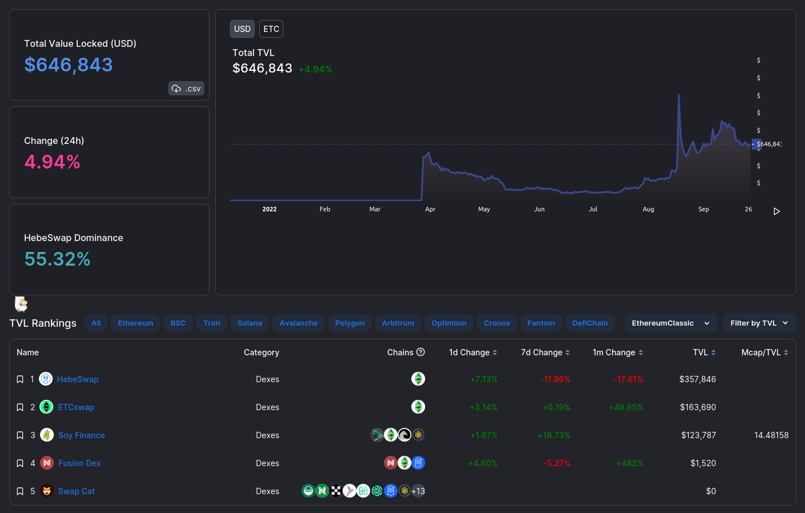
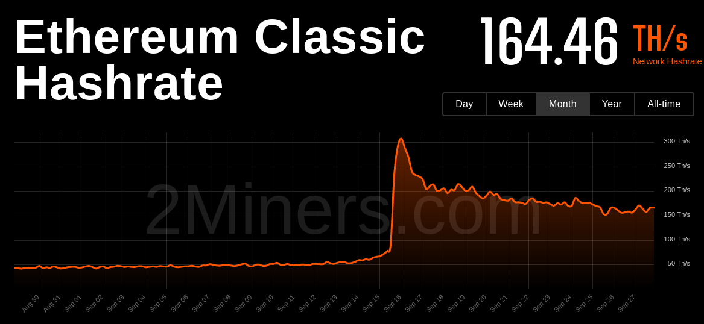
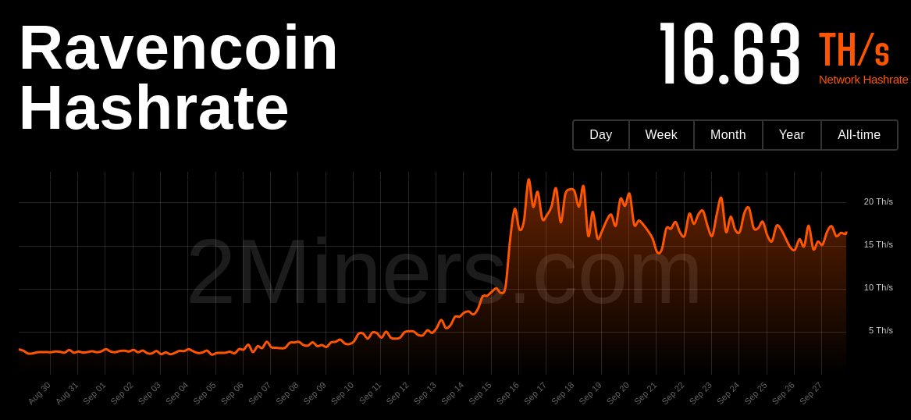
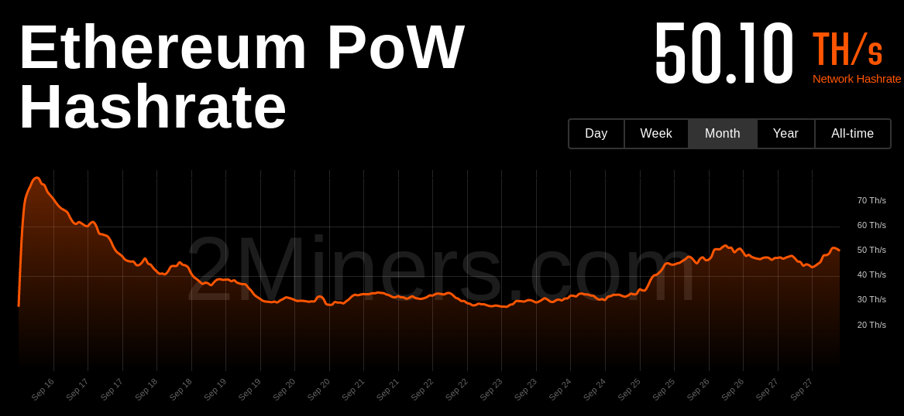
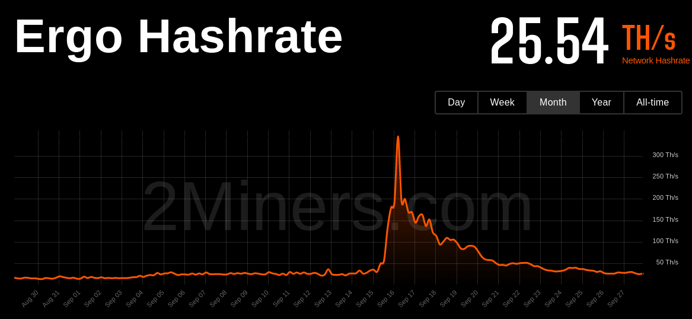
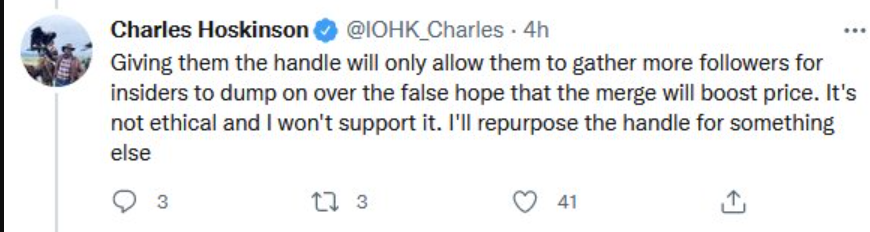

**Alert: This call is back to the usual time at 1500**



## Description

A casual voice chat to discuss ideas for ETC. All are welcome.

The ETC Discord can be joined at https://ethereumclassic.org/discord

Please join us in the #community-calls channel to ask questions or bring up topics.

## Agenda New Version

Welcome back, its been a while.

We will now return for weekly calls every Tuesday at 1500 UTC.

A casual voice chat to discuss ideas for ETC. All are welcome.

The ETC Discord can be joined at https://ethereumclassic.org/discord

Please join us in the #community-calls channel to ask questions or bring up topics.

This call is an open discussion so please feel free to jump in any time, but be reminded this is live streaming on YouTube.

You can also post chat messages in Discord or YouTube, and we'll try to get to them.

Agenda: News, Apps/Ecosystem, The Merge, Twitter, Website, Open Chat

### News catch up since last call in July.

- Hard Fork anniversary Jul 20th
- Genesis Jul anniversary 30th
- Overtaking Litecoin (before the merge)
- Antpool 10m USD
- The Merge Happened! (We will get into it later)

```
#EthereumClassic currently has 3 sources of funding for its future research & development:

1. ETC Cooperative: $4 million

2. Ant Pool: $10 million

3. ETC Community Fund: 16,000 ETC which will be worth $16 million when $ETC hits $1,000 this year.
```

### Pressing Announcements or Topics from Chat?

Other News please enter chat now before we get into the main agenda.

### New Feature: Apps of the Week (ETC is a dead chain)

Standard disclaimer: Not audited, no official anything.

- ETC Desktop (Hebe)
- Chameleon
- Safe https://twitter.com/ETCCooperative/status/1574505550762901504
- SoyFinance
- Fusion Nova Network & USD Stabelcoin
- ClassicDAO, ClassicHeroes, MonkeyDoo
- etc-network.info
- Others please enter chat now

https://defillama.com/chain/EthereumClassic?currency=USD



### The Merge Aftermath

- ETHPoW
- The Flood (where did the hashrate go?)
- Becoming 3nd Largest PoW blockchain after BTC DOGE
- The largest PoW Smart Contract Platform
- Phoenix Chain Theory 
  - Counter to the Insecure Zombie Chain Theory
  - Now, with no 51% attacks, dev confiedence will grow
  - This will create a snowball effect of adoption
  - More apps, more apps, more users, more txs, higher value, more mining rewards, more secure, repeat
  - Reduce Exchange Conf
  - Specifically DeFi Swaps no longer double spendable, DeFi pioneer species, Dominoes
  - New Homesteading Opportuntiy









### Twitter 

- ETC_Network, ETH_Classic Drama
  - https://twitter.com/ChuckSRQ/status/1572353721228742656
  - 
- twitter-together
  - still experimental, definitely not official!
  - looking for volunteers
  - help us determine the rules for what to tweet
  - multiple twitter account channels

### Website Updates

- New Round of Updates comingm, New Project Kanban
- Restructure of Apps / Services into one
- If you have ideas or suggestions, let us know

### Additional Topics (If time)

- ETC Coop History https://twitter.com/ETCCooperative/status/1574499148648579072
- PoW vs PoS Decetnraliation https://twitter.com/davidvorick/status/1573710822118932485

### Free Talk

See you next week, same time same place.

---


## Agenda OLD VERSION: Update for recent events

- Happy birthday to ETC/ETH
  - Hard Fork Jul 20th
  - Genesis Jul 30th
- Overtaken Litecoin 
- https://www.coindesk.com/business/2022/07/26/antpool-supports-ethereum-classic-ecosystem-with-10m-investment/
- ETH PoW Fork? 
  - Why it matterrs for ETC: Ethash
  - Chainlink won´t support ETHPOW.
  - https://etccooperative.org/posts/2022-08-08-open-letter-to-chandler-guo/
  - https://twitter.com/Poloniex/status/1556577798357225472
  - https://ethereumpow.org/
  - https://twitter.com/BobSummerwill/status/1556813053898854400#m
- TornadoCash
  - https://twitter.com/RyanSAdams/status/1556743328774995971#m
  - https://twitter.com/mmorpgveteran/status/1556743928807833600#m 
- (ronin) Network tools Idea
  - topic: future public goods, permalinks. Available TLD Domains for these network necessities as we grow into the future. Can we IPFS some of these too? Definitely possible is static pages. cc: @Istora 
  - ethereumclassic.net network tools coming from this TLD makes sense to me. I'd be happy to dedicate this entire TLD to these type of public good assets for ETC.
  - public RPC endpoint
  - hashrate monitor
  - mempool tracker - similar to https://mempool.space/
  - ETC gas estimator 
  - fork or reorg monitor
  - active node monitor
  - network analytics - a public subgraph?
  - other helpful grafana dashboards? --> etc-network.info 
- Free talk

---

## Full Transcript

```webvtt
WEBVTT

NOTE no-names

1
00:00:03.659 --> 00:00:07.130
Community call number 26.

2
00:00:03.659 --> 00:00:10.129
today is the 27th of September 2022.

3
00:00:10.139 --> 00:00:31.009
it's been a while it's been a few months since we last had a call so uh nice to see everyone back it's been a while we're now going to return to the weekly calls every Tuesday at 1500 hours UTC this is a casual voice chat to discuss ideas about Etc and everyone is welcome you can find us in the ethereumclassic.org

4
00:00:27.800 --> 00:00:48.950
Discord server and you can join us in the community calls channel to ask questions or bring up topics this call is an open discussion so please feel free to jump in at any time but be reminded we are streaming live on YouTube so please be on your best behavior

5
00:00:50.940 --> 00:01:11.450
in Discord or on YouTube and we'll try to get to them so now that we're starting a new batch of chats I figured we should uh have a new kind of setup here so we're going to have a more structured approach to Future chats including each week starting with some latest news headlines

6
00:01:09.180 --> 00:01:31.670
and an update of the apps ecosystem and then we can from there dive deep into some more uh EDC specific topics news catch up and because we haven't had one in a while we're just going to go through some of the major things that happened

7
00:01:28.740 --> 00:01:53.330
since our last call in July so there was of course two anniversaries that happened the hard Fork the Dow hard Fork anniversary which happened on July 20th as well as the Genesis block on July 30th so two major birthdays for ethereum classic in

8
00:01:51.299 --> 00:02:13.010
coin in market cap um which put it at I believe fourth place uh overall and then of course uh recently uh the merge happened on ethereum which moved ethereum classic into third place overall uh in terms of market cap of proof-of-work chains so we'll get into that in more detail later

9
00:02:13.020 --> 00:02:37.610
another major update was that amppool announced a 10 million dollar uh fund that was in cooperation with Etc Co-op which I believe future announcements will be coming about how those funds will be distributed but uh basically right now ethereum classic has 4

10
00:02:32.280 --> 00:02:52.930
million around in asset in in USD for ETC Co-op plus some Etc the amp pool of 10 million dollars and of course the ETC Community Fund of 16 000 ATC which uh in the future will be worth hopefully a lot more

11
00:02:49.080 --> 00:03:13.270
in USD terms the new feature the app of the week uh was there any pressing announcements or news updates that anyone wanted to add in

12
00:03:03.599 --> 00:03:25.309
the chat update um which I think we're going to call Etc is a dead chain going forward just as

13
00:03:22.800 --> 00:03:45.350
a kind of tongue-in-cheek to the uh prevailing so-called wisdom that ethereum classic has no activity no developers and apparently we don't exist because no one's working on it announcements uh

14
00:03:40.980 --> 00:04:04.190
one from I still not sure how to pronounce that but uh has announced a new desktop client for ETC called Etc desktop and I believe it includes a node so it's a full node desktop client with a nice front-end user interface it was announced today so I've yet to play

15
00:04:00.239 --> 00:04:22.969
with it but it looks very promising of safe which I believe is a gnosis multi-sig deployment on Etc so if Bob wanted to jump in to explain a little

16
00:04:17.100 --> 00:04:37.909
bit about that um apps added to the website including and I'm just going to list these out and full disclaimer none

17
00:04:35.880 --> 00:04:59.390
of these have been audited and there's no official anything in ETC so we're just uh amplifying these projects because they were listed on the website basically so we have uh soy soil refinance Fusion Nova Network and USD stablecoin we have classic Dow Classic Heroes monkey do and

18
00:04:55.560 --> 00:05:20.150
some other nft projects I believe we also have from someone in the chat that helped developed a new network dashboard called Etc Network dot info foreign um

19
00:05:18.000 --> 00:05:39.290
yeah it's just a simple website you can go give it a visit um if you would like to share it it's just a simple site which helps to navigate through my services which I provide to yeah community so it's all open source everything is on GitHub if you want to deploy

20
00:05:37.320 --> 00:05:57.890
it yourself or if you want to help always welcome developers which are able to help or just to support me in some Docker issues or uh like rather also helped me to check some pizza notes and and Hyper Ledger

21
00:06:01.320 --> 00:06:23.150
yeah just a actually simple simple site to navigate through the services which I provide again I've yet to dive into that but uh I will be sure to check it out this week and uh if you're around from now on then please feel

22
00:06:20.820 --> 00:06:41.330
free to jump in on future calls I will definitely what is the website address Network dot info oh wow maybe you can post it on on General

23
00:06:38.819 --> 00:07:00.290
on the general Channel yes I will yeah for those listening um all of these links and everything I mentioned in the agenda will be available on GitHub via the community calls repo and also a link should be posted under the YouTube

24
00:06:57.419 --> 00:07:21.950
channel so any anything mentioned here will also be available there chameleon um that was uh announced this week from

25
00:07:17.280 --> 00:07:39.110
Rodin I believe and I don't want to talk about that too much without uh his presence so maybe he can join us in a future call to talk about that I've

26
00:07:34.680 --> 00:07:55.670
pasted a a graph of d5lama.com which is basically showing the growth of the total value locked in the ethereum classic D5 ecosystem now up until March this year there was no D5 ecosystem

27
00:07:52.500 --> 00:08:15.409
on Etc but after the launch of uh Swap and Etc swap we can see a noticeable increase followed by a little bit of lag and then in the last two months in particular uh a good amount of growth um to the point where uh we

28
00:08:12.479 --> 00:08:33.769
we are seeing I believe a the beginning of a large upward momentum of

29
00:08:30.660 --> 00:08:52.790
this uh this call and the first topic of course is the merge and the aftermath of the merge there are many predictions happening beforehand about what would happen in terms of a flood of hash rate and now we know basically what's what the outcome of that is I

30
00:08:50.160 --> 00:09:13.009
should first mention that um as many predicted a fork of ethereum uh that is not ethereum classic has been launched called f proof of work so ethereum proof of work uh has been launched and uh has

31
00:09:09.240 --> 00:09:31.970
quite an interesting uh history and whether or not it's going to succeed I'm not sure but in terms of hash rate it's currently far behind ethereum classic so I don't think there's too much to worry about in terms of either 51 attacks from this larger

32
00:09:28.680 --> 00:09:56.750
hash pool that doesn't exist or any uh competition in terms of niche I.E whether or not this ethereum proof of work chain is actually trying to be a decentralized small contract platform because based on action

33
00:09:47.459 --> 00:10:08.630
so far it seems like it's not the price of either proof of work it's it seems like just looking at the graphs

34
00:10:08.640 --> 00:10:29.990
um it looks like a pump and dump I'm watching right now I'm watching the ball in next chart for ether proof of work and it had a big jump when it was listed and that was all is now trading around

35
00:10:27.839 --> 00:10:50.090
ten dollars so it's really it's really I don't know hard to to understand the what what the future will bring for for it

36
00:10:46.680 --> 00:11:10.790
but it seems to me that everything was done in a rush they they've announced the the fork like one month before the merge event and since then I haven't really heard anything

37
00:11:06.480 --> 00:11:26.630
that was worth I don't know reading coupled things together last minute and importantly they did not have a a

38
00:11:25.079 --> 00:11:47.090
version of the client that was ready to uh the replay attack resistant until after the merge so they lost a lot of uh pre-planning and smoothness of transition by launching a client last minute and also because they incremented the chain ID

39
00:11:44.640 --> 00:12:04.750
they've they've lost basically all of the network effects that would have come from case uh initially well there was no chain ID after the ETC F hard Fork until one was implemented later on but

40
00:12:02.640 --> 00:12:24.530
at that time there was not much Network effect to get anyway but in this case the main benefit of ethereum mainnet is all of that defy ecosystem all the wallets and all of the uh Network effect that comes with that and it seems like ethereum pow has basically

41
00:12:22.140 --> 00:12:43.850
sacrificed that um they had no option really but uh yeah I don't see it as being any major threat to ethereum Classic um in in multiple different domains like

42
00:12:40.800 --> 00:13:02.750
I was pretty busy for the past months but uh I think after the merch there were two forks now I'm not sure if they are the same project or just some other other mining pool who wants

43
00:12:59.399 --> 00:13:21.949
an ethereum or um if they were together I don't know it it seems just just strange at this phase a while for the dust to settle I think after

44
00:13:19.139 --> 00:13:43.490
these events but uh um from what we've seen uh I I don't I don't think we need to worry about uh what would happen uh during the merge and this is a very big part of the Shah III debate and

45
00:13:38.760 --> 00:13:58.790
the argument was that hey um after the merge ethereum classic is going to be saturated with a hash rate and that means the only viable thing to do is to 51 attack it and as far as I can tell there has not been uh that outcome so far and

46
00:13:57.000 --> 00:14:21.650
it doesn't seem like that's going to be the case going forward because currently ethereum classic is the apex predator of char sorry of ethash um Family chains so that includes um if you look at the agenda I've got four major chains including ethereum classic

47
00:14:15.480 --> 00:14:36.050
Raven coin ethereum pow and um chains that have soaked up or at least most of them are soaked up the previous hash rate from ethereum

48
00:14:33.720 --> 00:14:56.629
after they sacrificed their proof of work status like there were many disaster scenarios like really really bad ones and um there

49
00:14:52.920 --> 00:15:13.069
was that agenda with shatri that the didn't happen so I think everything is fine like the best thing is that Etc finally got the security it needed for for

50
00:15:13.079 --> 00:15:34.150
um people to start building and showing interest and making a viable Unstoppable product into the the implications of of uh ethereum Classics new rightful place as apex

51
00:15:32.579 --> 00:15:53.449
predator uh I believe there's some interesting uh uh implication or breakdown of what types of Hardware are mining different chains does anyone with some mining knowledge um could could maybe you help explain the different

52
00:15:51.480 --> 00:16:14.269
breakdown in terms of A6 and GPU miners that went that migrate to the different chains um some

53
00:16:11.279 --> 00:16:32.030
of the the smaller chains uh got the majority well not the majority but essentially ethereum classic got most of the A6 and is currently kind of like Bitcoin in that sense because uh the majority of those uh gpus

54
00:16:28.860 --> 00:16:51.410
would be unprofitable to mine so in a sense um Etc has become a lot more like Bitcoin in another dimension which is that it's uh secured not just by GPU miners that can switch to any chain they want but by or not just any other chain but also they could use it for graphics processing

55
00:16:48.420 --> 00:17:10.490
or VR headsets for example so they have uh other use cases and can disappear at will but now ethereum classic has a much stronger mining base that cannot easily migrate to a different chain um and ethereum classic being the main one

56
00:17:03.600 --> 00:17:29.450
there correct interpretation as I'm not hooked into the mining Community but hopefully uh we'll be able to get some some insights into that on a future call is

57
00:17:26.220 --> 00:17:46.669
most likely the case that um uh Etc now has received most of most of the A6 uh some some Asics would should also be on the on Eve W and there's another of these um last minute if

58
00:17:43.080 --> 00:18:04.789
Fox so this is Eve f f is something for fair also which is even smaller than efw so it might also be some over there and all the my all the hash all the computing power that went to chains like uh

59
00:17:59.340 --> 00:18:21.890
Raven or um Ergo or flux um these are necessarily gpus because CSX couldn't make this transition so all the increases we see that we see that they come from gpus and now the current situation is a bit difficult basically the

60
00:18:18.960 --> 00:18:41.930
merge happened that's a in a sense the worst possible time because a um the crypto markets are are generally down mainly driven by well first of all it was already kind of a difficult situation with the crypto wind answer um and

61
00:18:38.780 --> 00:19:00.049
then all the bad news from mainly from the US industry came in and um with industry inferences and um page 12 price is massively down basically you can you can follow if you follow

62
00:18:57.360 --> 00:19:20.090
the standards and Poor 500 Index and if you put next to it the PTC um value then the curves essentially match and of course all the crypto cryptocurrency copy what speed this is doing to a very large extent so you have a very strong correlation between any values

63
00:19:16.200 --> 00:19:37.909
in the in the crypto scene and uh and the performance state of the US economy at the moment which means that there's basically no proper dynamic in the in the crypto market so you see this effect and but but it's not following these this uh this correlation of course the the packed

64
00:19:35.700 --> 00:19:58.430
coins the stable coins they obviously try to to remain stable as supposed to but all the other West essentially follows follows those twins so what happens is what happens is then that uh that the all the crypto coins are performing very poorly which means when you're mining you must even if you if

65
00:19:55.320 --> 00:20:17.150
you produce the same amount of um of coins uh you still get get a lot a lot less uh fired um equivalent value out of this and then due to the to the hash waiting quiz after the merge you produce fewer coins because the difficult

66
00:20:14.820 --> 00:20:35.409
has gone up so your hashes are worth less in terms of coins and to make things even worse with the conflict in UK um the the energy price in many areas of the world have gone up a lot and again this makes things difficult for miners because

67
00:20:32.700 --> 00:20:53.570
now the energy costs are significantly higher and most miners are sensitive to that there are some have some lucky ones who have extremely cheap or even free energy so they don't mind but all the also for all the rest it's this is this can be a serious problem so this

68
00:20:50.700 --> 00:21:13.970
means that the pressure on minus um uh is much higher than we actually expected what uh the post merge situation would be like and I think this also explains why um

69
00:21:08.940 --> 00:21:31.970
uh by by a lot of miners are not um do not show up in any of the hash rates that we currently observed at the moment it's something like um 75 to 80 percent or so seem to have disappeared um and this

70
00:21:28.919 --> 00:21:49.190
is this is more than for example what I would have expected I would have expected maybe half of them would go away and the rest would say which would be would have meant that we would probably see well most of the A6 are of course however there tend to be more power

71
00:21:46.440 --> 00:22:06.610
efficient than gpus um even if only biologically small margin compared to the Top Notch gpus but then it goes It goes down to fairly inefficient uh Hardware it is or was still being used for mining and those weak ones that are not very power efficient

72
00:22:06.620 --> 00:22:26.630
uh those would those would have been driven out in any scenario basically but uh we would have expected that more CPUs and uh in the top segment would would stay on or stay on mining but it seems that

73
00:22:23.820 --> 00:22:45.590
that this pressure was affected these and may even have affected some some of the of the A6 but there also um different scenarios of what those that are not mining now are doing some some might may may simply have left given up because the only the calculations

74
00:22:43.200 --> 00:23:05.570
and sentence and so that's it this would not come back to to profitable levels for them in the foreseeable future then there are those that are not profitable and they decided to um turn off their machines and wait so

75
00:23:01.500 --> 00:23:23.750
if things get better Um this can happen in the form of the difficulty going down hash rate going down had definitely going down or it could happen in the form of um of the market we're covering and manually

76
00:23:21.179 --> 00:23:43.010
what's going up or I could also happen in the flow of energy prices dropping and then they might join again so there's an unknown amount of hash weights that could could come back and of course also of course also minus who might

77
00:23:40.320 --> 00:24:00.590
only mine a certain times of the day for example if they have a segmented electricity tariffs then they might not mind doing peak hours but uh to the machines are on to off hours so you would see a reduction hash rate and

78
00:23:57.860 --> 00:24:18.529
when things get better then they might increase the the participation or even even speech back to full-time Mining and then you would also also have an increase of of the hash rate so that there's still a few unknowns things that we can't see but

79
00:24:15.240 --> 00:24:35.590
um the general scenario at the moment is that um the hash rate is now moving relatively slowly which is good which is that people have more or less found their places um

80
00:24:35.600 --> 00:24:58.010
and uh not a more long-term Tendencies of of terribly hashbrid is is dropping over time but not that crazy speeds so we don't get those big spikes and uh that we saw a widered when lots of miners jumped on on some coin that looked

81
00:24:55.320 --> 00:25:19.970
good and then a few hours later they realized that uh another one and this game repeated for a while so these things are already over so we will now see a more gradual um conversions

82
00:25:14.940 --> 00:25:36.830
to a stable state yeah for the uh for the audience just to describe the situation in terms of hash rate on Etc uh a few months before the merge I believe it was averaging around 20

83
00:25:33.240 --> 00:25:42.350
uh terahashes and approaching the merge it gradually increased to about 50.

84
00:25:38.580 --> 00:26:02.870
and then immediately after the merge it spiked all the way up to 300 terahashes which is about a third of what eth was normally uh receiving and since then it's it's kind of gradually drifted down into about the 175

85
00:25:57.980 --> 00:26:18.830
uh terahash range at which point it seems like a bunch of other chains have also reached equilibrium so uh ethereum classic is still uh three times greater than its next rival which is ethereum pow ravencoin

86
00:26:16.380 --> 00:26:37.789
is at 16 terahashes and Ergo is about 20 which is the same that it was before the merge do

87
00:26:32.840 --> 00:26:59.049
you do you have any any stats after the merge that some some of the chain some of the blockchains had problems after the merge like who did any attack happen or something like that problem

88
00:26:56.279 --> 00:27:17.330
on uh if W and but that was essentially uh the uh pads uh what was it some some swap or systemic some swap contractor so so it wasn't really a problem of the chain itself uh I haven't heard of any any major

89
00:27:15.120 --> 00:27:36.789
attacks or so so yeah those are if any happened I mean there's all the small coins I mean um so we have a picture of the situation we had ethereum if it's 900 something Terror hashes

90
00:27:33.419 --> 00:27:41.690
then we have we had e3m classic which had something like 20.

91
00:27:36.799 --> 00:27:57.830
uh a few months before the the merge and then we had all those um tiny coins um which um if we now look at the the total emission

92
00:27:54.900 --> 00:28:16.250
over over time um that's basically the total mining rewards over time then there were something like a fact of 1 000 smaller than Etc and correspondingly there are also much less hash weight and um so

93
00:28:13.020 --> 00:28:34.430
what happened uh after after merge is now that I mean they're always at risk of being attacked because they're so small uh if I have a chain or something like 20 gigahertz per second or so then it's it's too real to attack it many many miners who can do that and

94
00:28:31.640 --> 00:28:53.149
uh the only thing that that was protecting them is that either people didn't didn't think of to think of them being worth it or they did the math and they realized no that's just not enough liquidity to to make it a worthy the effort and around

95
00:28:51.120 --> 00:29:11.570
and so some of them have never heard about these these problems just getting worse and so we will see for example um expense is planning to uh to migrate um to a shop-based algorithm and um

96
00:29:11.580 --> 00:29:31.669
I haven't heard of of others planning anything of that sort but so yeah that's people people are aware of those things and but it seems that at the moment uh one or new major problems to uh after the March and of course for if we can see the good news is now that I mean it was

97
00:29:30.299 --> 00:29:50.930
probably already before it was Impractical to impact the world to actually do such an attack simply because even if you if there's a lot more hash weights in the world uh it's not it's not so easy to to get control of a large portion of this so

98
00:29:46.679 --> 00:30:09.590
even before the March when uh beneath even Etc went up from 20 to 50 or so then it would have to say that's at that point it was just wasn't possible to to do it because he would never fall in the pressure it even if it existed and nowadays

99
00:30:06.679 --> 00:30:28.010
it's it's essentially impossible I mean this you would have to find all the machines that are stopped or dismantled or whatever all around the world and and position them against the network and that's just impossible and um

100
00:30:25.500 --> 00:30:45.529
yeah so for for the smaller ones they're still risks I'm not sure if I've probably um if WS also safe if F not sure they only have something like five tower hashes that would put them in the range where well a long time ago Etc

101
00:30:42.779 --> 00:31:02.930
was attacked so that could be a possibility and of course at the tiny with the tiny ones uh like uh expands you big Callisto um they have all always been in a difficult position so of

102
00:31:01.140 --> 00:31:23.510
course there also have some of them Implement some there are some of their own counter measures for example expenses are very short um to try to make sure that um that

103
00:31:18.620 --> 00:31:39.909
the the 50 51 attacks that um made by mining uh an attack chain offline and then jumping this on the on the network that these uh can't really make major changes and the idea would be that

104
00:31:37.020 --> 00:31:59.149
any exchanges or so would have long confirmation intervals than this uh with this reordering window so that you can never reorder over distance it is larger than the confirmation interval um

105
00:31:56.100 --> 00:32:18.830
but uh so yes this is basically the scenario yeah thank you thank you very much um this uh this is like very great news because uh we haven't seen uh um big chains having

106
00:32:14.279 --> 00:32:35.510
problem after the merge or um let's just say um the the Doomsday scenario aren't there so that that makes me really happy and I

107
00:32:32.279 --> 00:32:54.289
just want to ask all of you or who wants to answer uh how how did you guys felt uh honestly the High Street going going up to 300 it

108
00:32:51.720 --> 00:33:14.690
go up that's high because that was that that was a bit more than I expected and it was also funny to see some of the other coins were even even spec well I mean um again uh one one interesting example was expanse where it went into the into the Terra

109
00:33:11.700 --> 00:33:32.149
hashes range which made absolutely no sense and of course it's basically half a day later so it was down in the in the gigahertz range again and similar things happened with several others except surprisingly Raven

110
00:33:29.100 --> 00:33:49.789
coins stayed fairly quiet so I'm not quite sure what's what made them ramp up so smoothly but uh yeah most most of the most of the coins there those those those those Peaks and then things settled when people well

111
00:33:47.399 --> 00:34:07.909
I realized okay now they're far too there's far too much weight on this coin this is there will never be enough mining rewards for all of us and then then they move to other coins and maybe some moved again and yeah now I've noticed I think this week that the great reshuffling is is over and

112
00:34:06.240 --> 00:34:26.690
yeah now if nothing's look pretty reasonable let's say days after the merge for ethereum classic is probably the most important period in its history since the Dow hard Fork

113
00:34:22.139 --> 00:34:43.790
as it has solidified the chain as the largest proof of work smart contract platform out there and that's a real Accolade for the chain and I think uh is going to have knock-on effects in the coming months and years that will be really proving uh

114
00:34:39.240 --> 00:34:59.750
beliefs about ethereum classic so I was extremely excited and proud that uh we've we managed to bring it to that point and we fended off all the attacks that prevented

115
00:34:53.399 --> 00:35:14.750
us from getting there the way but they didn't materialize and I'm referring here to iohk so

116
00:35:14.760 --> 00:35:37.130
we can bring up the Twitter thing if you'd like before we go into that and kind of related to that is a kind of I wanted to talk about a counter argument to the the main criticism of Etc which has been pushed by both the ethereum mainnet community and

117
00:35:32.520 --> 00:35:54.109
the likes of uh I guess some some others uh in the ethereum post ethereum classic space I guess uh-huh or or those that rage quit the space um and that is that ethereum classic is a insecure zombie chain um basically

118
00:35:51.599 --> 00:36:11.990
it's it can be easily 51 attacked and there's nothing being built on it so you might as well just ignore it and uh yeah pay it no attention basically all right now sorry sorry are this Litecoin

119
00:36:06.540 --> 00:36:27.829
and uh Bitcoin cash holders coming from uh people and or communities that might feel threatened by the rise of ethereum classic and it's basically just a a meme that's

120
00:36:25.440 --> 00:36:45.589
put out there to dissuade new adoption for ethereum classic and to say hey ignore them come to us while but uh it's been re-amplified recently by various different events that

121
00:36:43.560 --> 00:37:05.270
we'll get into next but basically the my response to this insecure zombie chain theory is that now ethereum classic is neither insecure nor a zombie chain it has both um security and applications being built on it and basically

122
00:37:02.099 --> 00:37:23.089
now that the possibility of 51 attacks are extremely low over time this is going to mean that Dev confidence will grow this will create a snowball effect of adoption basically more apps more users more transactions higher value to the network and the and the underlying currency which

123
00:37:20.520 --> 00:37:41.150
means more mining rewards which in turn means more hash rate more security and then that feeds back into itself into more developer confidence and more applications so basically I believe that we're entering this new chapter which is basically a snowball effect of ethereum classic being

124
00:37:39.180 --> 00:38:00.530
the dominant proof of work chain and increasing confidence and tying that back in and basically a positive feedback loop of adoption security price increase Etc specifically D5 swaps um and the D5 ecosystem kind of relies on not having uh 51 attacks

125
00:38:00.540 --> 00:38:23.270
additionally exchanges can reduce their confirmation times and people will realize that oh this is actually the real deal now so far from being a sinking ship or a a dead horse or any of the other uh kind of low effort attacks against Etc uh

126
00:38:20.460 --> 00:38:44.270
I believe we're about to disprove all of those um and for everyone that's been in it for the long run and saw that potential then I think we're about to witness that uh come to fruition you

127
00:38:41.460 --> 00:39:01.910
said it's it's right um I give it I gave a thought about why they are suddenly attacking again Etc socially and one reason that I find was that they know

128
00:38:59.520 --> 00:39:21.770
that Etc doesn't have a public figure like other changes have right and it's the standardized to to to respond in a way that will propagate and I

129
00:39:18.359 --> 00:39:43.730
think this is uh this is they they know it is second defend itself publicly very well and they they just throw a punch just to see what happens horse

130
00:39:40.560 --> 00:40:02.150
sinking ship undead zombie chain uh meme is that all that it does is temporarily suppress the interest and price of Etc and filters the ETC Community into those who are able to spot or at least not follow

131
00:40:00.119 --> 00:40:20.150
the first thing that people are told so really they're helping us in the long run because it means that we we get a a good community of people that are willing to look past the noise and actually investigate stuff and when they realize oh that was a lie and

132
00:40:17.460 --> 00:40:40.670
eventually that lie will be um proven to be a lie then they're going to have egg on their face and um we're going to have a community of strong people that don't fall for basically it will matter more and

133
00:40:36.140 --> 00:40:59.390
people who will really start to understand crypto like let's say in two years or four years um the 2020 uh wave will will actually be a lot be a lot smarter about investing

134
00:40:55.980 --> 00:41:17.150
and cryptocurrencies and they will carefully look at the projects and they'll see things

135
00:41:08.280 --> 00:41:30.349
that got us here more to talk about on this topic of of uh basically ethereum sacrificing its position and giving

136
00:41:27.480 --> 00:41:50.030
us a really big present um and I think especially with recent events and I didn't mention this before but the whole tornado cache thing potentially points to a future where changes that are not fully decentralized they're capturable will become captured and

137
00:41:47.220 --> 00:42:11.150
if we want a system that's able to be used by every person um and not just one group of people then the system needs to be neutral and uncapturable and eventually I hope people will recognize that that goal just

138
00:42:08.339 --> 00:42:30.890
wanted to uh flag an interesting point that uh was raised in the last uh mini discussion about uh the maybe we can talk about this in a future call but uh it'd be interesting to think about the different

139
00:42:26.400 --> 00:42:52.970
scenarios in terms of global actually be beneficial for ETC by forcing uh mining hash rate to disperse more geographically or will it be a bad thing and uh I think that's just a very interesting topic to this point to explore

140
00:42:46.380 --> 00:43:09.410
in the future um drama and attacks against Etc uh we have to mention the recent Twitter I'll

141
00:43:06.000 --> 00:43:28.730
say debacle that's unfolding between uh basically so I'll try and explain this as briefly as possible but essentially the the verified Twitter account that was previously uh and is still controlled by iohk

142
00:43:24.420 --> 00:43:45.170
has kind of gone Rogue and based on some recent concerning tweets from the uh director of iohk Charles hoskinson it seems like the Twitter might be in Jeopardy in Jeopardy uh so that verified ethereum classic Twitter

143
00:43:42.359 --> 00:44:02.809
account eth underscore Network sorry eth underscore classic is the verified account um May soon be quote repurposed for some other reason uh and I I don't know if I can I

144
00:44:01.319 --> 00:44:27.550
don't know if it's wise to get into too much of the drama but basically that's the the bird's eye view if anyone wants to add something to it uh feel free and then we can discuss the the potential

145
00:44:12.060 --> 00:44:34.910
solutions to that detail

146
00:44:30.900 --> 00:44:52.250
and that is a recent tweet by Chuck SRQ which basically explains that the original uh Twitter account was a donation to Charles under the idea that he would be a good custodian

147
00:44:49.020 --> 00:45:11.089
of the account and you know serve the ethereum classic Network by holding on to it and if that change it seems only right that that uh that responsibility is handed to someone else that actually wants to promote ethereum classic and as

148
00:45:08.460 --> 00:45:30.050
far as I've seen on Twitter uh the current custodian doesn't believe that ethereum classic has a future so it seems kind of strange that they're in control of that account and if it does change radically I don't know what the options are in terms of uh Twitter

149
00:45:26.160 --> 00:45:54.010
as a company helping us either remove the verified status or change ownership of that account but it seems like a bad idea to have someone that's actively hostile to the network in control of the only verified Twitter handle think

150
00:45:48.900 --> 00:46:12.290
this just shows how um it just shows how Twitter

151
00:46:08.819 --> 00:46:28.849
Handler it's it's clear he he did not had really good intentions regarding ATC because he might saw it as a competitor for cardano and it's clear he

152
00:46:24.180 --> 00:46:45.829
he just wants to I don't know damage Etc and uh just holding that account hostage and controlling it it only proves what the crypto douchebag is

153
00:46:47.339 --> 00:47:09.250
individual personalities but um it's clear that he's not currently that interested in ethereum classic and actually beyond that kind of hates it I think and is trying to uh prevent people from joining it I mean in a

154
00:47:07.079 --> 00:47:29.450
recent tweet he said basically uh he thinks that ethereum classic and by extension those who are contributing to it are unethical and that's quite a strong word to use uh I think most people in the blockchain space apart from our outright scammers are trying

155
00:47:26.400 --> 00:47:49.490
to do their best for uh a great good and in the case of Etc I think he knows that a lot of people are here for something other than just uh as he says dumping on new followers so I think that's a that's a

156
00:47:45.599 --> 00:48:07.250
kind of uh low blow also promoting a project called Ergo which we mentioned previously which is a proof of work smart contract platform that does compete with ethereum classic and it seems like there's

157
00:48:04.800 --> 00:48:28.370
no like official endorsement from iohk of this project but there's a lot of uh X iohk developers and connections there so it seems like maybe behind the scenes there is some actual uh like

158
00:48:23.880 --> 00:48:44.030
Financial incentive for uh for some people to try and make Etc no longer a thing as

159
00:48:33.060 --> 00:48:54.950
a rival chain um Parkinson's criticism is that he the

160
00:48:49.920 --> 00:49:11.569
argument that EDC it doesn't have Innovation so he's still insisting on this Innovation theme and also the other thing that he said is that it didn't have funding or that it didn't

161
00:49:09.839 --> 00:49:32.690
implement the treasury and that what that's that's why BTC was going to remain weak so he's he's using old flawed arguments I think foreign we've been having this debate for a while especially during the last few years the treasury debate was an open conversation

162
00:49:29.480 --> 00:49:50.270
and if he wanted to engage that debate he had every opportunity but apparently decided not to so it seems strange that if you really believed what he was saying he wouldn't be willing to um back up his arguments and engage the community to try and convince people he's right so it's a shame that didn't happen and

163
00:49:48.660 --> 00:50:10.670
it's a shame that it's had to come to this yeah the the two times recently that that he that he attacked Etc um is what what he says has a little he has like some expansion

164
00:50:07.079 --> 00:50:30.050
over the media you know every time he does that I see on my YouTube when I go to YouTube that there's like five or six other YouTubers that repeat what he says and and then there's several blogs and websites that news websites that that repeat

165
00:50:25.859 --> 00:50:48.950
what he says so has some effect um like WP said sometimes the price goes flat when he says that um so so yeah he's he's [Music] um he's

166
00:50:44.940 --> 00:51:06.109
he's also attacking others uh he was attacking Luna he was fighting with people from ethereum so he seems to be at the defensive he said something like I don't understand why people are paying attention to these other chains and not cardano something like that he seems to be

167
00:51:04.680 --> 00:51:25.790
nervous about competition now I think uh the best thing for us as a

168
00:51:23.940 --> 00:51:45.230
community to do this is just my opinion everyone's free to do what they please but personally I'll probably be closing the book on this and trying to just ignore uh as much as possible until we get a decent solution um and

169
00:51:43.440 --> 00:52:05.270
we are trying to couple one together right now uh called Twitter together and this is an alternative community managed Twitter account that uh has the potential to replace the current centralized well uh

170
00:51:59.760 --> 00:52:20.750
hostile controlled Twitter account the ethereum classic GitHub called Twitter Dash together which is a fork of a project where basically based

171
00:52:17.460 --> 00:52:40.609
on pull request and moderation via GitHub we can try to decentralize the Tweet producing process and uh it's currently very experimental we're just trying to play around with different workflows and coming up with some sort of rules to help us Define which tweets get tweeted but

172
00:52:36.839 --> 00:52:57.170
basically the ETC underscore Network Twitter account is going to be controlled and is currently controlled by this GitHub repository now we are of course as a new project and running into some teething problems largely

173
00:52:54.140 --> 00:53:16.010
based on deciding what kind of tweets get tweeted and there's many different opinions um from different community members about what kind of content should be tweeted contribute to this project if you're listening

174
00:53:13.920 --> 00:53:36.309
now please feel free to reach out because we are looking for ideally 24 7 coverage in terms of maintainers that are able to approve tweets to this channel to this Twitter account and um that would mean having multiple different time zones covered um

175
00:53:33.000 --> 00:53:55.309
and maybe a handful five or six constantly available people to be able to approve tweets if if needs be contributions in terms of creating a set of

176
00:53:50.579 --> 00:54:11.450
rules and uh I think that based on the strong opinions of various different uh contributors it seems like the best approach might be to have multiple Twitter accounts so that instead of having just one where everyone kind of argues about what gets tweeted

177
00:54:08.160 --> 00:54:29.150
we have say three different accounts one being just pure completely neutral announcements um one being announcements plus potential applications and ecosystem updates uh and

178
00:54:25.740 --> 00:54:47.329
third being kind of posting memes maybe a bit of banter and that kind of thing but uh that's just a currently undocumented uh potential approach that I'd love to hear your thoughts on and the idea is that the main account is not

179
00:54:44.579 --> 00:55:11.089
solid by any kind of uh promotional activities but other accounts can be because they are clearly labeled as such so if anyone had anything to contribute on this topic please do jump in um

180
00:55:06.420 --> 00:55:29.450
I'm also a Trader so if you will ever consider having a Twitter account regarding trading charts and I don't know trading is one of the the main thing for

181
00:55:24.720 --> 00:55:57.230
uh for coins so if you would ever consider

182
00:55:29.460 --> 00:55:57.230
I

183
00:55:29.460 --> 00:55:57.230
can

184
00:55:29.460 --> 00:55:57.230
participate

185
00:55:59.460 --> 00:56:19.609
two topics that um um have traction and engagement on social media but they are two topics that usually accounts that are more institutional uh

186
00:56:14.940 --> 00:56:35.510
prefer to avoid now one is market and trading and price price action and the other one is politics no the the theme of blockchains now that we disintermediate Banks that um

187
00:56:32.880 --> 00:56:54.290
central banks are bad and the cryptocurrencies are good um that regulation is bad Capital controls are bad Etc so they are they are controversial because they can they can um make

188
00:56:52.500 --> 00:57:16.910
an account less attract not less attractive but biased and usually we we want Community accounts or institutional accounts to be more more neutral but but I think uh

189
00:57:12.800 --> 00:57:33.829
some about price not not necessarily making technical analysis or Price predictions but at least being happy when the price is up and announcing it now one day we wake up happens every now and then that we wake up and it is suddenly 15 percent up I

190
00:57:31.260 --> 00:57:53.690
think that is worth tweeting about in this community account saying okay it's gonna be at 1000 like I do uh but um I think it's it's good to to talk a little bit about price and and also because price is a genuine genuinely

191
00:57:50.940 --> 00:58:13.390
important data point in a blockchain now as like you said the store as price goes up uh mining is more profitable so hash rate goes up so it affects security so more developers want to come now so I would do that and then in politics I would

192
00:58:09.780 --> 00:58:30.109
do maybe not be totally confrontational with governments but at least say Fiat money is inflationary EDC is um digital gold hard money stuff like that regulation or if

193
00:58:28.079 --> 00:58:49.309
there's a controversy like within ethereum about privacy and attack on privacy in an app there take a position a political position now so and I think that these two topics politics and and price are really really increased engagement

194
00:58:53.400 --> 00:59:13.670
news popping from different uh different websites that basically make predictions or trading analysis so there there is a lot of content that can be that can be shared with the with

195
00:59:12.180 --> 00:59:34.010
the on social media with people here

196
00:59:37.799 --> 00:59:58.670
down this uh new system which is gonna probably take a couple of months including some uh code updates that are coming Upstream basically it'd be nice to get a dedicated uh Channel put together for tweet creation

197
00:59:56.040 --> 01:00:18.589
to make it easy for creators that are good at tweeting to submit content rather than having to do their import request or some some workflow to make

198
01:00:04.380 --> 01:00:24.829
that a lot easier would be just

199
01:00:23.220 --> 01:00:45.170
great I'll also try to see if we can we can parse it on on this card and have a separate Channel just for for uh for the Twitter yeah that'd be great and it might just be a case of getting people to learn the format of the tweets and

200
01:00:42.480 --> 01:01:05.270
then pasting in like a code block with the exact tweet they want and then we can automatically create a pull request from that potentially if it receives some kind of upvote in the Discord you can do it but there's

201
01:00:57.720 --> 01:01:18.470
many approaches until unless there's any other additional comments on this Twitter together slash Twitter drama then

202
01:01:13.799 --> 01:01:36.789
we can move on to the next topic if we can reach out to dabs Developers and uh once we have something in place like to

203
01:01:33.799 --> 01:01:53.950
participate for everybody's benefit eventually to participate Heber

204
01:01:51.480 --> 01:02:13.730
The Habit team they can also submit to it right for uh if they see um it is in a way or if they want to to share some big news like they did today so um trying

205
01:02:11.099 --> 01:02:33.049
just trying to to keep this Handler as open as possible and with our brother participation one of the potential workflows we could do

206
01:02:29.880 --> 01:02:51.349
is that as soon as a new app gets added to the main website then that could also be created a tweet out of which would incentivize uh contributions to the website and also link people to the website including the full disclaimer that would otherwise be missing

207
01:02:49.319 --> 01:03:10.670
if it was just a retweet or might be seen as an endorsement so I think that might be a nice way to promote new projects without being seen as being particularly biased we

208
01:03:07.140 --> 01:03:29.450
can also do that for news that's true in fact we probably should the website uh for an application actually has its own URL whereas the new news

209
01:03:25.020 --> 01:03:45.109
items are just external links so there isn't like a link that you could link to the website to the news so I'm not sure how that would work for news

210
01:03:36.420 --> 01:03:58.190
unless it was a blog post for the next topic which is uh updates on the website and now

211
01:03:54.180 --> 01:04:15.109
that uh some of our developers have more free time uh in the coming months there's going to be a new round of updates coming to the website uh there's already a new project kanban which is which has lined up all the tasks that are hopefully going to can be completed in

212
01:04:11.460 --> 01:04:31.910
the coming months uh the main one being uh restructure of the apps and services section because they're a bit kind of arbitrarily separated at the moment and it's difficult to uh make it clear when new services are added for things like exchanges and wallets

213
01:04:28.920 --> 01:04:53.510
so the idea is that all of those things are going to be merged into one kind of collection so it will be more like an app store for everything including apps and wallets and exchanges and like uh dashboards for network monitoring and that

214
01:04:46.799 --> 01:05:07.609
kind of thing improvements to the website uh where all is and you know where to to reach out internationalization

215
01:05:05.280 --> 01:05:28.430
is on the table and as it was before hopefully we'll be able to get this done this time before uh we have to take another break Chinese

216
01:05:24.420 --> 01:05:45.349
so that's a great idea and a must have uh and maybe after it we can look over World Adoption and see which countries are the most interested in cryptocurrencies

217
01:05:45.359 --> 01:06:06.650
and maybe this side if any language in particular needs to um is to be

218
01:05:57.680 --> 01:06:21.589
used to to translate the content already in place a system uh it's really just screwing in the last bolt and then everything

219
01:06:17.460 --> 01:06:38.750
should be good to go well we've reached uh over an hour so there are there were some additional topics uh if time but maybe we can cover those

220
01:06:36.420 --> 01:07:06.049
in a future talk uh future chat if there are any uh burning issues pre-talk the floor is open as usual and uh if not we will wrap things

221
01:06:49.260 --> 01:07:11.990
up crypto

222
01:07:08.700 --> 01:07:30.770
Alex USA has mentioned that uh he's taking his farm offline for the month of October he mostly has RX 580s and R5 700 gpus uh I'm guessing as a GPU Miner it's difficult to be profitable on Etc at the moment

223
01:07:32.640 --> 01:07:54.710
to contribute in terms of Mining and sorry in terms of mining content for the Etc Community Twitter Channel as well as content covering projects nfts and dapps call

224
01:07:51.319 --> 01:08:13.190
for any last comments and if not we'll wrap it up uh Community call it's been a contentful one so we

225
01:08:10.799 --> 01:08:19.130
hope to see you next week same time same place or ethereum classic Community call number 27.

226
01:08:15.539 --> 01:08:23.600
so see you next week thanks for joining take care and goodbye
```
