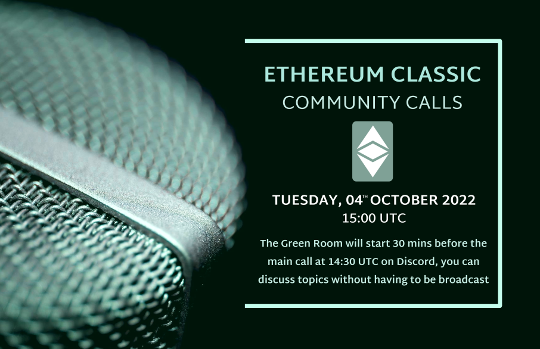
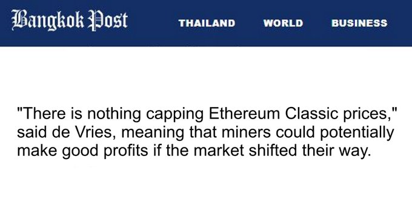
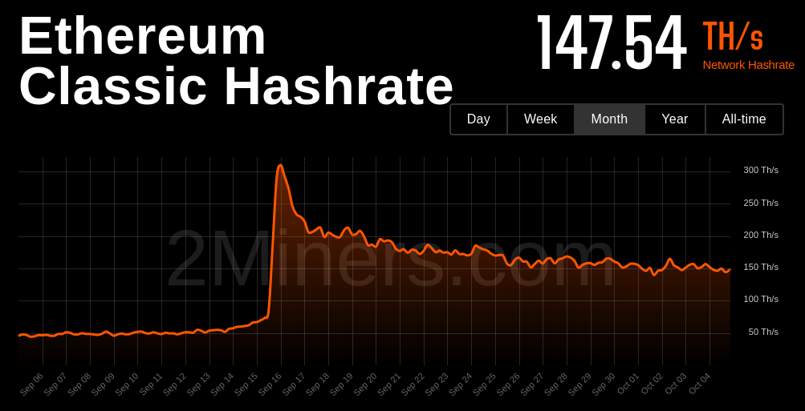
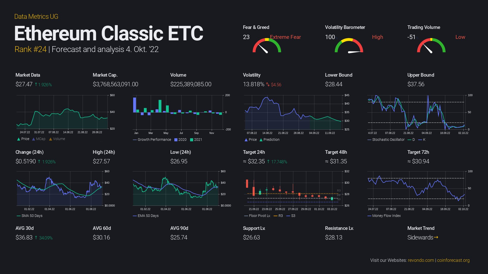
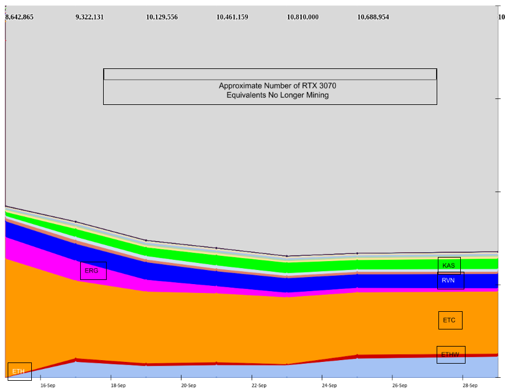

A casual voice chat to discuss ideas for ETC. All are welcome.

The ETC Discord can be joined at https://ethereumclassic.org/discord

Please join us at any time in the #community-calls channel to ask questions or bring up topics.

This call is an open discussion so please feel free to jump in any time, but be reminded this is live streaming on YouTube.

You can also post chat messages in Discord or YouTube, and we'll try to get to them.

## Hosuekeeping

New feature: The Green Room

Join us 30 mins before the call (1430 UTC) to hang out and discuss things before we go live on YouTube.

Agenda: see below

Gratitude: Brotherlal, d_a, (etc.)

## Headlines: This Week in ETC

- https://www.forbesindia.com/article/news/why-cryptos-big-merge-is-causing-big-headaches/80297/1
- https://www.marketwatch.com/press-release/algorand-capital-broker-reveals-4-things-blockchain-analysts-are-saying-about-the-ethereum-merge-2022-09-30
- https://www.coindesk.com/tech/2022/09/15/pivotal-ethereum-merge-brings-sell-the-fact-price-move-in-crypto-markets/
- https://www.bangkokpost.com/business/2406681/why-cryptos-big-merge-is-causing-big-headaches 
- Open floor

> "There is nothing capping Ethereum Classic prices," said de Vries, meaning that miners could potentially make good profits if the market shifted their way.

> But crypto-miner J said the new Ethereum was "designed to be more centralised" and suggested it no longer had a real purpose.



## Ecosystem Update

Hashrate and network vitals





- SHP, Hosting platform for savings and web wallets
- Billionaire Boys Classic, BILLIONARE BOYS CLASSIC are 999 FANCY DUDES LIVING ON THE ETHEREUM CLASSIC BLOCKCHAIN. They are cool they are diverse. 
- https://blog.emerald.cash/emerald-blockchain-course-16-what-are-hardware-and-software-wallets/
- ETC-Network.info deep dive into site (Screenshare)
- Open floor

## Missed from Last Week

- ETC Coop History https://twitter.com/ETCCooperative/status/1574499148648579072 https://etccooperative.org/The-History-of-ETC-Cooperative.pdf
- PoW vs PoS Decentralization https://twitter.com/davidvorick/status/1573710822118932485

## Geopolitics and Mining

Discuss the effects of recent global events on Proof of Work blockchains.

Distribution of hash rate, mostly not mining https://docs.google.com/spreadsheets/d/1fIqzUNrKU1k_UbiJbDKTkClsfNLcm50YXsvP60GIfwI/htmlview




## Code is Law vs World Computer

Shout out to bob's discord. https://discord.gg/5wDyd6u6pU

> Code is Law versus World Computer.  
> Both are useful, but they are different.  
> Ethereum started out trying to build both within a single project, but they were mutually irreconcilable.  
> Both were promised from the very start.  
> Some people jumped aboard the Ethereum train based on one vision, and some for the other.  
> Do you want programmable Bitcoin (ETC) or do you want world computer / decentralized application platform (ETH)?  
> That also explains the very different reactions to the DAO hack.  
> If you think Ethereum is hard money then of course you don't want to intervene.  
> If you think Ethereum is a computing platform, and that ETH is "fuel", not money, then you see a "bug" and want to fix it if you can, even if it's an ugly hack.  
> Any software developers out there will know that lots of software has lots of warts and horrible hacks, where "layering" is not clean at all, and you can end up with hacks and workarounds in the "wrong places" if that results in the rectification of problems which should never have happened in the first place, but did, and you need/want to patch them up.  
> I think that is very much the mindset which led to the DAO hard fork.  
> There is a hacker.   He is stealing our money.   We have the opportunity to stop that theft, so lets do that. 
> Fixing a bug.  
> Which makes sense if you see Ethereum as mainly a computing platform, like the web, like iOS or Android.  
> Not if you see Ethereum as money.  

False narrative? Instead;

> Code is Law is what enables World Computer, because that's the only way the system can remain neutral to every human being

## RAI

https://reflexer.finance/
https://github.com/reflexer-labs/whitepapers/blob/master/English/rai-english.pdf

(from ronin discord)

Yeah, this looks interesting to me as well. I think topics like RAI (a detailed discussion) on community calls would be good and educational. This convo can go from educational to building a roadmap where there are products being deployed that have community interest. As mentioned- I'm still researching and such. But I think now that we are post-merge, this would be a good direction to start shifting conversation from a professional perspective.

Topics:
+ ECIPs related to L1
+ necessary L1 products
+ L2 planning 

## Etcetera

- Updates to twitter-together
- Maybe we should get back to the drawing board here now that our positioning is great. https://opensource.guide/building-community/
- IDEA: ETC Activity Firehose

## Free Talk
- ETC-Network.info deep dive into site (Screenshare)

## Sign Off

See you next week, same time same place.

---

## Full Transcript

```webvtt
WEBVTT

NOTE no-names

1
00:00:19.320 --> 00:00:22.070
Community call number 27.

2
00:00:19.320 --> 00:00:25.849
today is the 4th of October 2022.

3
00:00:25.859 --> 00:00:46.610
the ethereum classic Community call is a casual voice chat to discuss ideas for ethereum classic everyone's welcome and you can join us in the ETC Discord server at etherealclassic.org Discord you can join us at any time in the community calls channel to ask questions or bring up topics for future calls this call is an open discussion so please

4
00:00:44.879 --> 00:01:06.830
feel free to jump in at any time but be reminded that this is live streaming on YouTube so please be on your best behavior you can post chat messages in Discord or YouTube and we'll try to get to them if there's time which

5
00:01:04.040 --> 00:01:26.929
if you join us 30 minutes before the scheduled call at 1400 hours 1430 UTC you can have some offline discussion and we just had a really good discussion about different aspects of decentralization and the Twitter together

6
00:01:23.520 --> 00:01:45.649
account so if you'd like to join us and you don't want to be on YouTube then you can chat 30 minutes before this call again after headlines this week in Etc ecosystem

7
00:01:41.880 --> 00:02:04.609
updates last week I'm going to talk about the potential impact of geopolitics on the mining ecosystem for the film classic and other proof of web blockchains we'll have a discussion about a concept that

8
00:02:01.380 --> 00:02:21.530
was originally proposed by Charles hoskinson about the difference in philosophy between ethereum and ethereum classic basically Cody's law versus World computer Theory and why that might not be philosophy the best way to think about

9
00:02:19.620 --> 00:02:40.790
things and also talk about a project called rye which in my opinion seems to be a really good uh potential project to launch on ethereum classic due to its decentralized nature and if there's extra kind we have some additional topics of

10
00:02:39.480 --> 00:03:02.270
course there'll be a free talk so anyone can bring up any topic that they like express some gratitude to both uh brolal for helping out with the AV and D underscore a on the Discord server for providing the graphics

11
00:02:59.160 --> 00:03:19.250
for this uh this week's show so thank you to you guys ETC are basically around discussion post merge about uh people maybe

12
00:03:16.920 --> 00:03:38.869
getting a little bit uh shall we say concerned about the potential centralization nature of ethereum and there's been a couple of Articles both in Forbes India and Bangkok post that are basically critical of

13
00:03:33.540 --> 00:04:00.410
the the merge and to quote there is nothing capping ethereum classic prices said the vria's meaning that miners could potentially make good profits if the market shifted their way and it's nice to see ethereum classic breaking into some mainstream Publications

14
00:03:51.299 --> 00:04:15.229
even if it is just Forbes is there any headlines that uh people in the chat would

15
00:04:05.459 --> 00:04:25.850
like to bring up rate is steadily uh continuing around the same that it was last week it's kind of

16
00:04:25.860 --> 00:04:47.629
maintaining its flat projection as is the price hovering around the same price as last week and we're currently at 147 terahashes of uh of network cash rate so ethereum classic is smooth sailing as it were

17
00:04:44.040 --> 00:05:07.070
from last week the uh on the Ethereal classic website added since the last call one being SHP a hosting platform for savings and web wallets and an nft project called Billionaire Boys classic which

18
00:05:03.000 --> 00:05:24.050
is uh 999 fancy dudes living on the ethereum classic blockchain they are cool and they are diverse apparently by the way these uh these two products I should have done this to disclaimer before but uh they are not verified um then audited please use them at their own

19
00:05:22.500 --> 00:05:44.450
risk and always do your own research I'm only mentioning them because they were added to the website and I have not used them personally so uh please take care Donald McIntyre's emerald.cash blog uh where he adds another uh

20
00:05:41.880 --> 00:06:14.930
episode to his course on blockchain education this time about the difference between hardware and software wallets so we encourage you to check out his blog at blog.emerald.cash potential new projects that people wish to

21
00:06:01.800 --> 00:06:23.270
contribute to the chat missed from last week that I wanted to make

22
00:06:19.380 --> 00:06:41.930
sure we cover uh one is a etc Co-op history that was announced by uh EDC Co-op uh two weeks ago and this is an interesting overview for an interview Etc history Buffs uh basically going over the origin of Etc cop and some of the

23
00:06:38.639 --> 00:07:01.189
takeaways are that uh EDC Co-op was birthed by um the famous uh Barry silbert from managed by Anthony and Bob

24
00:06:57.600 --> 00:07:20.330
joined later on I believe in 2019 so I may have got some of those dates incorrect but uh it's it's well documented now so a nice piece of history for those who are interested paper

25
00:07:16.580 --> 00:07:39.050
slash piece about proof of work and proof of stake and the different categories of decentralization and this piece goes into detail about kind of five different tiers of decentralization and proof of work being the

26
00:07:35.639 --> 00:07:58.010
highest because it's uh trustlessly verifiable and it goes down a list and proof of work sorry proof of stake is somewhere in the middle where it's not trustlessly verifiable but you have some level of decentralization there and then right at the bottom is just uh outsourced trust for

27
00:07:54.240 --> 00:08:16.730
applications like Facebook for example so if you're interested in a more uh academic breakdown of some arguments for why ethereum classic and proof of work in particular are highly decentralized then we can recommend

28
00:08:13.560 --> 00:08:35.570
checking out this uh this paper and you can find all these links in the agenda of the call under the YouTube video I wanted to talk about and we touched on this

29
00:08:32.640 --> 00:08:56.350
last week is the potential impact of current geopolitical events and the mining uh distribution and impact that that might have on ethereum classic or other proof of work Networks a

30
00:08:51.060 --> 00:09:11.810
chart in the agenda of the estimated uh hash rate distribution over time and it looks like Etc is still by far the dominant but that is um compared to a total overall of

31
00:09:09.180 --> 00:09:29.389
uh around 75 um of the ethereum network pre-merge hash rate is now just missing and it's no longer mining so essentially 75

32
00:09:25.560 --> 00:09:47.870
of miners turned off their equipment or at least 75 of the hash disappeared worry in terms of 51 attacks but it uh it might have some interesting implications in terms of where that Hardware

33
00:09:44.220 --> 00:10:06.530
is globally and where it's still profitable to mine and whether countries uh especially potentially Europe and other high cost of electricity countries are going to be able to afford to mine proof of work currencies

34
00:10:08.459 --> 00:10:33.230
proof of work is that uh Geographic decentralization means it's very difficult for a single jurisdiction to control the network so it's kind of essential to have as diverse geography as possible miners

35
00:10:29.839 --> 00:10:50.150
well some miners maybe not a lot but regardless of whether it's profitable or not uh there's an incentive to mine Etc just for the sake of getting some uh provenanceless uh tokens but these could be seen more as like hobby miners as opposed to Big scale Miners And I do Wonder

36
00:10:50.160 --> 00:11:10.310
what happens to those uh those mining Farms that previously existed in Europe uh that are now priced out of the market and what happens to their equipment um

37
00:11:06.779 --> 00:11:28.490
are those large miners that still have installations in Europe and they are looking for well here they either they decides to just get rid of the equipment because maybe it's already Obsolete and it wasn't really that promising on

38
00:11:25.279 --> 00:11:45.350
any possible future development so they might just get rid of it or um they might feel that they would be looking for a lot of locations where Energy prices are more friendly um there's a lot of uh there seems to be a lot of movement towards Texas for example um

39
00:11:45.360 --> 00:12:06.650
the other other places like um well there was one big movement of minus out of China when uh where mining was uh um banned there to to Kazakhstan then you have um worship uh then you have places

40
00:12:03.720 --> 00:12:25.430
like Paraguay and yeah probably a lot more locations uh the energy prices are still fairly low and um so for a large minus it makes sense to to scout these locations and transfer their their equipment the equipment they consider

41
00:12:23.160 --> 00:12:43.550
still viable for the for for a longer time um to these locations to benefit from the low power prices there for the for the hobby minor of course it doesn't make sense I mean you don't you don't want to have to to have a two-part why to

42
00:12:39.660 --> 00:13:02.690
fix your uh you'll be awake so um that that doesn't really make sense anymore so yes you have those people who seem to Simply think that um they want to mind for other reasons to entrust profit for

43
00:13:00.540 --> 00:13:20.990
example in order to get it to get Etc so it would also have the beneficial effect of um of increasing demand and hopefully contribute towards um raising the ETC price when you have to consider that any Miner who mines for profit and then

44
00:13:17.940 --> 00:13:38.449
tells those coins um for for paying the electric electricity bill and these miners basically uh pushing uh Etc down so there's also also something something to be said about minus about Etc

45
00:13:36.000 --> 00:14:00.290
fans who are not mining but who are buying the coin uh but in any case um the general Trend I think will be that the the global hash rate um that goes into uh it's equipment that can mine Etc no matter where it is at the moment if it's my

46
00:13:55.380 --> 00:14:16.190
Etc or if W or waven or whatever um the the the global hashway for this is likely to to continue dropping um also I think that there's still still a large number of miners who haven't had the latest electricity

47
00:14:14.360 --> 00:14:34.970
bill so they might not still not realize uh that it's really unprofitable for them and so we'll see see more hash heads drop um now the question is whether where's the equipment so it can be um

48
00:14:34.980 --> 00:14:55.550
okay it can be gone that they actually close top and this is the selling gpus on the second hand market and so on uh it could be um in a place where the mining is still good so no problem uh it could could be in

49
00:14:52.380 --> 00:15:13.730
the process of being relocated into a place where the weather where the energy prices are better and it could also be that it's just stopped Powers down and they're waiting for better times so there might be still a significant pool

50
00:15:10.199 --> 00:15:31.850
of mining Hardware that could come online again when prices improve if this pool is large enough then this means that um when we see a price increase then this will not necessarily mean that mining will be will become

51
00:15:28.579 --> 00:15:50.030
more profitable because then it will just make those miners who are currently silent but still around it will make the victim switch the machines back on and this will bring that bring that bring back going back down the profitability so it

52
00:15:46.800 --> 00:16:06.889
may take a while before um this the silent miners were currently on basic on standby and until they um uh either back to mining or have given up so I would expect this this post to take several

53
00:16:05.459 --> 00:16:25.930
months at the at the least depends a bit on how my on how the costs are for just keeping machines sitting around and but so I guess if you have a well a little Warehouse somewhere with your farm and then

54
00:16:21.839 --> 00:16:44.329
your so I would say this is the channel Outlook Outlook for this type of farm but I'm assuming that in most

55
00:16:41.459 --> 00:17:03.650
cases there is there is literally no reason even if you have everything in place to consume the energy if it's costing more than you'll be getting an Etc so you might as well just mothball it until the price goes up um and or just by ATC if you want to speculate on that yes

56
00:17:01.199 --> 00:17:21.530
for most miners it wouldn't make sense to mine at a loss I mean there might be some situations where it still makes sense you could also dream up some some interesting money laundering schemes where you don't care about making a profit on the mining and it's still

57
00:17:19.199 --> 00:17:39.650
worth your effort but I think those are probably very very marginal and for most miners it's it's really a question of whether but they can still make enough money the moment they're mine and they don't do any any complicated schemes or plan to

58
00:17:36.539 --> 00:17:56.810
mine coins that will be more available in the future because if they did this then it could also just buy them and they would get more coins that way for the same amount of money and of course there could be restrictions um on on buying coins so maybe they could

59
00:17:54.780 --> 00:18:18.830
the only way they can can obtain coins is by mining so if you have some restrictions of this sorting place then it could make sense to mine at a loss but again this is probably a niche case um but we also have to consider that not all not all equipment is has the same efficiency so if you have a very power efficient

60
00:18:14.520 --> 00:18:34.970
Miner then you might even be well yeah maybe in some places in Europe you might still be able to mine and um well if you ever have a more average Minor A minus more average um

61
00:18:32.580 --> 00:18:53.390
profitability Power efficiency then your profitability will definitely be uh be low enough that it's not not feasible to to mind without losing money but yeah it's so basically basically the the

62
00:18:49.919 --> 00:19:11.029
the the the oldest gpus they are definitely out because they were already kind of operating at their limits so that doesn't really make sense it doesn't make sense to expect but before we'll be able to to come back for anything and but then the most power efficient

63
00:19:09.240 --> 00:19:29.750
gpus maybe they have a chance and most of the A6 should be a little bit more power efficient than the uh than the best gpus plus there are a few that are significantly more power efficient like only

64
00:19:25.919 --> 00:19:46.070
consuming about half the the power perhash and so essentially the market will organize itself according to power costs and and power efficiency so

65
00:19:43.620 --> 00:20:04.870
we could you can expect I mean the the clear winners are those who are power efficient and at a cheap location or or those who are not very power efficient but at an extremely cheap location so if you basically don't pay for power or on a a

66
00:20:00.900 --> 00:20:24.289
symbolic amount then you don't care but of course also they're not that many locations with this and they may not be desirable for for many people so again this TV we're gonna get different patches uh on on the planet which

67
00:20:20.700 --> 00:20:41.570
are attractive for miners but each will be attracted for different miners predict what how things feel exactly be because it's not just a single metric that you can consider like um the power efficiency

68
00:20:38.520 --> 00:21:00.590
but you have to to consider all those all those other factors that that is a different energy price and different locations and accessibility of the places and general desirability of the place so for example it's a place where you have a high risk that your equipment will be stolen or so then you may not want

69
00:20:58.380 --> 00:21:18.950
to go there even if it's if the prices are a dream so there are lots of considerations in this in terms of uh transportability and migrating mining Farms um

70
00:21:17.100 --> 00:21:37.370
there's kind of like an assumption that once you have a farm it can't really move um and is this really the case or could could it be possible that in the future for example people start building mining rigs or mining Farms inside like a shipping

71
00:21:35.760 --> 00:21:57.529
container so it can just be driven to wherever they want yes yes that all that already exists the companies that make containers uh for for mining so you have the ventilation system power distribution and so on then you put in the in ux and you have a container you can I don't know to what extent they're being

72
00:21:55.740 --> 00:22:16.190
used for for moving things around maybe it's just a cheap way of having housing that is um that has all the the installation already in place but uh this exists and I don't think miners have a particularly hard time traveling I mean they're just like PCS basically and

73
00:22:13.640 --> 00:22:35.750
of course you have the or the infrastructure installation you need to have a power source um you may not uh I mean I mean you can hear for the hobby Miner it's easy to go anywhere and they plug them plug the mine into Mains and they are mining so but for the professional professional

74
00:22:33.600 --> 00:22:56.330
Miner uh it's different if they want to have um energy for a large farm first of all they need to find a place where they can get access to the energy if you're somewhere in the in the in the desert then well it may be a very nice place if if um when nobody bothers you but uh no power

75
00:22:53.100 --> 00:23:14.690
cables this is somewhere in India in the sense so if you first have to find a place where you have access to the to the Grid or where you have a power plant nearby that can provide things for you or you build your own power plant so there's also this consideration sometimes you have very nice

76
00:23:12.000 --> 00:23:32.270
part nice power sources but they are not accessible that you just plug in and pay your power bill but the the operator of this of these power plants may expect certain long-term commitments so you make a contract of over several years and you say okay I will always consume

77
00:23:29.460 --> 00:23:51.110
at least I will pay for isn't that amount of energy and whether I use it or not I pay and uh or maybe even have to have to build your own power plant like in the desert example you could make a solar plant or

78
00:23:47.820 --> 00:24:09.470
maybe a uh maybe some some boots to even power generation but then you have to make an investment into the power generation so again this only makes sense for for very large operators another dimension of the of this whole Space

79
00:24:09.480 --> 00:24:30.049
um of of mining where you where you can distinguish by the investment that you make about um is the network more secure if there's relatively

80
00:24:27.000 --> 00:24:48.890
less less hash rate let's say it's only hobby Miners and because of like uh it's for whatever reason it's difficult to rely on large Farms um because in a world where energy usage is very

81
00:24:46.080 --> 00:25:06.169
uh unpredictable let's say in the future potentially then it's difficult to uh have long-term planning to set up a large mine is that better or worse for the network in terms of security because it forces things to Scuttle around and go into different crevices as opposed to centralizing

82
00:25:03.659 --> 00:25:24.230
in a large mining farm so I guess the point I'm trying to um potentially get to here is that actually this sort of next phase of geopolitics that is potentially a little less um certain could end up being good for proof

83
00:25:22.140 --> 00:25:44.950
of work blockchains in terms of security because it forces things to be shaken up a bit do you think that's a reasonable Theory I'm not sure I'm not sure um but first of all um a large operator who makes significant investment into their Farm It has very little interest in uh in in the

84
00:25:41.880 --> 00:26:03.409
in this coin not to work so they are basically invested also in the future of this coin and we can expect them to to have a stabilizing effect so they won't want for example I abuse their resources to attack the coin um

85
00:26:01.080 --> 00:26:21.529
I mean I don't I don't think we've ever seen a large a large farm go walk on the coin it just doesn't make sense for them uh while if you have everything scattered into very tiny but essentially easily replaceable um

86
00:26:18.419 --> 00:26:40.750
little mining whoops then you may have much more volatility as we heard when Etc had very little hash rate and then the attacks via nice hash game that would exactly exactly be this kind of scenario where you don't have much a

87
00:26:36.600 --> 00:26:58.690
stable hash rate and then you become vulnerable to this kind of blue um large-scale

88
00:26:55.460 --> 00:27:16.490
mining will have a disadvantage compared to the more quests would approach because I mean this whole industry has now evolved and people know what to do they know how to build farms they

89
00:27:13.679 --> 00:27:34.610
know how to organize their their access to power they know they know what kind of contracts they need the power the power providers know what the miners need so all all those things have been established even companies that are specializing in just brokering um um

90
00:27:31.980 --> 00:27:54.049
Power conditions or they don't do anything else and you don't just go to your to the to the to the energy provider and ask ask them for the standard tariff but you broke a specific deal for your for your firm and so this is so all those things have been specialized

91
00:27:51.480 --> 00:28:15.710
but all this economy of scale only kicks in if you um if you have a large enough operation so the the average hobby Miner doesn't have to have those things they they just take to take whatever whatever they get um when they when they plug in the miner at

92
00:28:11.460 --> 00:28:32.750
home and if it's not good then the basically don't have an alternative so the the large miners will always have an advantage in the in that sense I mean it's for many things it's it's the same that you have a certain economy of economy of scale and if you do something in

93
00:28:30.419 --> 00:28:51.230
a on a larger scale you will have benefits over those who own it or only do this on the side basically ahead brother just a quick question uh do you see a possibility

94
00:28:49.200 --> 00:29:10.130
where um the miners with the maybe open or open to business like uh mining uh private blockchains or something like that is there is there a market for um

95
00:29:10.140 --> 00:29:31.430
for uh let's say hidden blockchains or private blockchains for for the private sector where they need to secure secure I don't know things be

96
00:29:30.120 --> 00:29:51.470
some it would have to be something kind of halfway private halfway open maybe that maybe there could be a case I mean the whole point of mining is that it's uh it's independently very very viable and um that you don't just have a decision maker who says this past this goes and this

97
00:29:50.039 --> 00:30:11.630
doesn't go um so if you do if you do it completely privately then you may then you probably don't don't need mining of that sort you could just have an authority that says okay this is good and this isn't as but if you had a system where maybe you don't have a public um a

98
00:30:08.299 --> 00:30:30.710
public blockchain but you have a large enough group of um of different um stakeholders on on your chain who don't entirely trust each other who have a certain risk of being infiltrated

99
00:30:27.960 --> 00:30:49.730
infiltrated and to want to protect against this then um then you could have something like this I guess and well for the for the miners I mean if somebody has let's say has currently is sitting on a large GPU Farm that's now not profitable anymore and somebody offers them to mind the private

100
00:30:47.760 --> 00:31:08.510
coin or guess they would be interested if they if there's money to be made so I would expect that almost all of the of the of the of Etc minus or Etc cable minus they are interested primarily primarily in profit so

101
00:31:05.520 --> 00:31:29.210
if there's a good offer for them then why not use cases where this actually makes sense um

102
00:31:27.179 --> 00:31:47.750
I'm trying to figure out whether we'll be good or bad for proof of work chains is some kind of uh at least in the western world uh ban on mining or at least an attempt to ban Mining and yes the the large mining Farms have economies

103
00:31:44.880 --> 00:32:05.330
of scale but it also means they're easy to Target and in a scenario where cryptocurrencies become extremely valuable and extremely profitable to mine but at the same time it's illegal to mine it then the only way to mine would be in small scale operations

104
00:32:02.940 --> 00:32:24.710
I suppose and in that situation would it be better or worse for the security of the network given that it'd be very difficult to uh I don't know would 51 attacks become more or less likely in that scenario well it might mean that all those countries

105
00:32:22.260 --> 00:32:42.350
who are not part of that of that ban will uh have a very interesting business opportunity no absolutely that uh for

106
00:32:39.480 --> 00:33:01.789
let's say it's some kind of global ban and they like via various sanctions um you can effectively uh make it very difficult to mine uh legally in almost every country apart from a couple perhaps yeah

107
00:32:57.960 --> 00:33:19.070
well that's many countries Uh there's Big Business with things that are totally forbidden and so I'm not shy of having large operations and so so I'm not sure I mean think of drug production uh it's not that's it's not just a a few Secrets

108
00:33:19.080 --> 00:33:43.850
um cocaine Farms somewhere in the basement uh that up that us that are put using for the world but this is these are Big operations and I guess there would always be places to where the Reds forbidden but well if if if you

109
00:33:38.659 --> 00:34:08.530
don't tell and they don't ask what those countries and would put me more likely um

110
00:34:05.159 --> 00:34:29.030
I believe that when the difficulty drops then the large scale mining uh we will see the day back out but then you will see a lot of people seeing an opportunity to to tune back in with their small equipment making it more

111
00:34:25.080 --> 00:34:46.970
decentralized that like one of the one of the like properties of proof of work is that the more it tries to be banned the more profitable it becomes right so therefore uh any attempt

112
00:34:44.879 --> 00:35:08.210
to try and squish it out is actually going to make it uh more decentralized at the drug trade I mean there you have countries that are famous for for being major drug producers

113
00:35:02.940 --> 00:35:24.050
and so I'm not sure if I mean you have some things that are these decentralized like the the software drugs but um the harder ones they they are not really distributed all over the planet so

114
00:35:21.420 --> 00:35:41.750
it seems that us at a certain point you need specialization um to still be able to operate and again this this thing creates a centralization but I think the the devil is probably in the details if they if there's a band then it may it makes may go in one or the other direction

115
00:35:41.760 --> 00:36:05.589
and again it could be against against the coin the the coin in general and so on so there's there's the several levels at which which doesn't attack could happen too I believe if you uh take the drug traffic as a example and you need a certain climate which is uh centralized or

116
00:36:00.839 --> 00:36:22.990
very uh local uh bonded uh in which electricity is and GPU is and CPU is uh you can get its access to it everywhere so that is not the same analogy

117
00:36:25.920 --> 00:36:48.650
then also you have energy prices which vary widely around the group The Globe so you wouldn't want to make you um your resistance firm in Germany for example is simply because the energy is so expensive so you would you would pick locations by the

118
00:36:45.599 --> 00:37:06.950
energy price like you do today but in addition you would also also also pick locations by weak enforcement of those of those bands of having significant loopholes or having high levels of corruption so well you just pay the police that they don't find

119
00:37:04.500 --> 00:37:25.849
you between places that that uh good at producing drugs they could also become good for for for illegal mining but then the question is uh is again what would be the the kind of restriction

120
00:37:23.220 --> 00:37:49.370
still out there that that the span implies right sorry yeah it seems like a very difficult to craft legislation that would ban mining per se because it's a very simple operation so how do you apply something that

121
00:37:42.240 --> 00:38:04.069
is not over-encompassing the act of Mining and then you can chase chase the miners I mean you can do some traffic profiling to see if anybody connects to a pool what

122
00:38:01.980 --> 00:38:22.390
happens with the pools today also become illegal or are they still allowed um so then then you could try to find out if anybody connects to a pool and if you notice this guy is connecting off and over to all the time to the pool then you send the police to pay them a visit

123
00:38:19.859 --> 00:38:41.510
and maybe you find a few miners and you could go by power consumption if you have a large operation that doesn't seem to do anything that's that justifies consuming that much power then you could pay them a visit so there are lots of lots of things how you could find them and

124
00:38:39.500 --> 00:38:59.870
um but yeah it all depends on what exactly this uh that those sections would be restrictions would be like and whether they would be globally uh what would there would be a global agreement to enforce them which are I think it's very unlikely I

125
00:38:57.180 --> 00:39:19.190
mean you don't really have any Global um globally accepted um deals or um I always always to actions this almost almost everything is is more at the national level or at a sort of at a certain the level of certain groups of Nations

126
00:39:19.200 --> 00:39:41.569
um so you will always find always find some places where you can still do it the questions also then Becomes Of course what will it be used then if if everything is forbidden and well maybe they could there could also be a ban on cryptocurrencies I mean if they say oh no they are too too unreliable it's only used

127
00:39:39.000 --> 00:40:01.910
for scams on money laundering and so on and illegal operations let's let's prohibit them into entirely and if you can get big enough important enough countries to to accept such a ban then you could also make things very difficult so

128
00:39:58.460 --> 00:40:19.910
but basically we have to see what um if any if any restrictions of this kind um are being um drafted um anywhere we'll have to see what's what exactly they try to prohibit what they try to accomplish and

129
00:40:19.920 --> 00:40:40.210
um then there's also the question if something like this is in place what ways do people find so to work around it I mean it's all significant creativity everywhere and as soon as our selection pops up then lots of people have interesting ways for for dodging that restriction

130
00:40:42.540 --> 00:41:02.930
very true and I think uh mining itself is far more difficult to Target than just Financial transactions so it seems like that's the first place that um any any kind of legislation will be implemented

131
00:41:05.160 --> 00:41:25.250
video recently about the EU there was a leaked drafts document about uh creating some legal definitions for different types of cryptocurrencies in Europe and it seems like base based tokens

132
00:41:22.320 --> 00:41:43.670
or base coins such as ethereum classic and the proof of work chains will be fairly left alone and not be seen as Securities or whatever the European equivalent is and they categorize different types of coins like stable coins

133
00:41:41.460 --> 00:42:02.930
and algorithmic stable coins differently versus World computer unless

134
00:42:00.900 --> 00:42:21.530
anyone has anything to add on the mining front uh before I start the section I just wanted to give a shout out to Bob's Discord

135
00:42:18.780 --> 00:42:40.190
server which is where this conversation took place and uh you can find the link at the bottom of the ethereum Corp uh sorry ethereum classic cooperative Etc Co-op website uh right at the bottom you can find a link to the Discord there so uh if you're listening to this worth joining

136
00:42:36.960 --> 00:42:59.990
that for a a conversation that's less um shall we say it's more moderated and more kind of uh civil conversation than what you'd find in the uh relatively wild and unrestrained conversations of the

137
00:42:55.980 --> 00:43:16.430
main ethereum classic Discord server but yeah in terms of world computer this is one of the uh marketing slogans that ethereum used in the early days uh called itself the world computer and the idea I believe was

138
00:43:16.440 --> 00:43:36.589
um world to use a very slow computer basically like a pocket calculator but one that's Global as opposed to um centralized in different jurisdictions I'm

139
00:43:32.760 --> 00:43:54.530
going to read a wrote out to describe this concept of Cody's law versus World computer and I think this was proposed originally by Charles hoskinson to explain the split between ethereum classic and ethereum

140
00:43:50.160 --> 00:44:11.630
mainnet so are useful but they are different ethereum started out trying to build both within a single project but they were mutually irreconcilable both were promised from the very start some people jumped aboard the ethereum-based Train on One Vision and some

141
00:44:10.140 --> 00:44:31.130
on the other do you want programmable Bitcoin Etc or do you want a world computer decentralized application platform f this this also explains the very different reactions to the Dow hack if you think ethereum is hard money then of course you don't want to intervene if you think ethereum is a Computing platform

142
00:44:28.079 --> 00:44:50.510
and that f is fuel not money then you see a bug and you want to fix it even if it's an ugly hack any software developers out there will know that lots of software has lots of warts and horrible hacks where layering is not clean at all and if you can end up with hacks and workarounds in the wrong

143
00:44:47.339 --> 00:45:07.790
places if that results you can end up with hacks and workarounds in the wrong places if that results in the rectification of problems which should never have happened in the first place but did and you need one and you need to patch them up I think that is very much the mindset which led to the Dow hard Fork there is a

144
00:45:06.000 --> 00:45:26.450
hacker he is stealing money we had the opportunity to stop the theft so let's do that fix a book which makes it which makes sense if you see ethereum mainly as a Computing platform like the web like iOS or Android not if you see ethereum as money ethereum

145
00:45:24.900 --> 00:45:48.230
community there were two camps one believed that ethereum is money one believe that it's an application platform and the latter believed that it's okay to basically fix things if they go wrong well the question becomes uh is ethereum or the ethereum virtual machine a platform

146
00:45:44.819 --> 00:46:06.410
for financial applications or is it for any kind of application because right now it's mostly Financial applications you can see some tests for other uh types of applications but you know because of the interoperability of the protocols in the evm for other Financial

147
00:46:03.480 --> 00:46:23.690
applications it's really easy to you know work one with another but you know on Etc we don't really we don't really think that um you know even regardless of what it's used for but if we're talking you know to people from ethereum then they might argue

148
00:46:21.359 --> 00:46:42.650
that it's more of like a world computer as you said before the Dow hack and people didn't really know what ethereum was going to be used for they didn't

149
00:46:40.800 --> 00:47:01.010
I mean there's always going to be some Financial element to it I guess but the applications built on top like non the concept of defy didn't exist at that time so it was not primarily Financial people were thinking about doing Dows and there were some Financial applications

150
00:46:58.560 --> 00:47:20.270
but it wasn't necessarily just about Finance the this Paradigm this uh code is law versus World computer idea the transport forward sounds

151
00:47:17.040 --> 00:47:38.210
good on the face of it and does kind of explain stuff but I I think uh on closer it's better and it doesn't really make that much sense because at the end of the day ethereum mainnet is still attempting to be uh or at least on the face of it censorship resistant and it's still

152
00:47:36.480 --> 00:47:56.990
like pays lip service to code his law otherwise why does it not undo other hacks why does it only do one hack undo one hack and since then has never done another undo so in terms of what they're actually doing it seems like they're trying to be more like ethereal classic it's just that they

153
00:47:55.800 --> 00:48:19.370
had this one thing in the past they'd rather forget right and additionally um or just law is what enables a world computer because it's the only way that a system can remain neutral to everyone like

154
00:48:14.240 --> 00:48:35.510
if if you have uh law I.E some kind of admin Skyhook that can update stuff then that necessitates a level of centralization that means that it's it's no longer a neutral platform

155
00:48:32.400 --> 00:48:53.990
and that means that someone controls the network in some way that's kind of opaque and especially now that things have shifted to proof of stake it seems like uh the the center of power has definitely become more evident shall we say well

156
00:48:51.060 --> 00:49:12.170
it seems to me that the moment that they decided to do a hard Fort for um because of the Dow exploit they kind of threw out all the principles of what you know I don't know what the like the what it was felt like to be in the community at the time or what the values were um I don't know if it was similar to what

157
00:49:09.960 --> 00:49:30.710
we have today but it seems that they threw out any any ideology of you know CODIS law and that things should be once they're set in stone then they need to stay that way they threw that out and with that it seems that the idea was let's just keep this for making money let's make sure if if money is stolen well

158
00:49:28.740 --> 00:49:49.010
let's return the money uh proof of stake seems to be more of a financial gain incentive than it is um a not a financial gain attempted like they didn't really gain much from proof of stake uh just like from the implementation of proof of stake but what they did gain is that people who are

159
00:49:46.920 --> 00:50:08.150
buying ethereum for you know long-term holding well now there's going to be less and less ethereum going into the uh ecosystem but you know just because of their burn mechanism and it it almost parallels um you know coins um that we have like on finance and and other chains like that where they have Burns every time

160
00:50:06.300 --> 00:50:26.569
somebody buys and sells well this is you know it's not that far so it's almost as if they're trying to cater to the people who just want to get into a project and hold it and you know have the supply go down so that the price will go up so they kind of just lost track of their own values uh and you know that's what ethereum classic is and there's

161
00:50:24.480 --> 00:50:45.770
not many people here on ethereum classic but it only we'll see in the future what ends up happening and I I fully agree with that I think that the the actions um

162
00:50:41.760 --> 00:51:02.150
that or the the the meant that those that followed the Dow Fork basically were filtered into that way of thinking and that way of thinking is essentially profit above principles and now

163
00:50:58.920 --> 00:51:22.390
ethereum had to deliver on this uh promise of proof of stake which basically meant that in theory anyone holding ether would get rich or at least um have a massive incentive to hold on and not sell because then you can stake I

164
00:51:18.180 --> 00:51:38.450
wasn't there when the the Dao hack happened but from the report reports I can read back at the in the day I didn't have the impression that it was the

165
00:51:35.640 --> 00:51:58.790
philosophy of um that um how can I say um that it was profit I think it's it was rather um the fear of of a network going to die which make them uh go with this option because

166
00:51:54.619 --> 00:52:15.589
I believe that code is uh go this law uh happened after or that concept I got got associated with ethereum classic after the event happened so I saw

167
00:52:11.220 --> 00:52:35.329
people who were commenting uh that okay and they see that now ethereum classic is still moving forward that it wasn't that crucial at that point so I think that a lot of people just went with

168
00:52:29.160 --> 00:52:51.230
it out of fear um before even ethereum existed uh as a concept and it was adopted as part of the uh the

169
00:52:46.619 --> 00:53:08.089
underlying philosophy of uh ethereum um encapsulated in the idea of build Unstoppable applications which was the the slogan on the ethereum website um for a long time including after the Dow hard Fork so code is Law and build Unstoppable applications

170
00:53:06.359 --> 00:53:28.430
are basically the same thing because CODIS law means that well the application will be unstoppable no person outside the blockchain can change the behavior of the application so the code

171
00:53:20.400 --> 00:53:42.109
is what um is the law on chain fear element uh there's definitely a lot of that but um at the end of the day it was an unfounded

172
00:53:39.780 --> 00:54:00.349
fear and I think a lot of the fear was uh whisked up or Amplified by those that stood to lose from the Dow and they happened to be in prominent positions and had the ability they had the megaphones basic game were able to uh dictate

173
00:53:58.260 --> 00:54:29.690
what um the community should be believing mini

174
00:54:28.140 --> 00:54:48.290
section I think the the important thing here is that rather than focusing on ethereum classic being uncensorable or the Dow fork or anything uh kind of this sort

175
00:54:46.980 --> 00:55:07.309
of Technical and not that interesting for people I think it might be worth shifting Focus to being um to going back to that original World computer and embracing it and far from being a separate code is law versus World computer concept actually ethereum classic

176
00:55:05.280 --> 00:55:26.450
is one of the few blockchains that can be a world computer because of Cody's law so I think um this this Paradigm that Charles housekin put forward is actually kind of damaging for ethereum classic because it it kind of suggests that oh it's not a world computer but actually it's

177
00:55:24.000 --> 00:55:45.530
the only way it can be via code is law essentially uh no

178
00:55:41.819 --> 00:56:09.589
longer unipolar moment then uh I think a world computer is solely needed and will be extremely useful for everyone

179
00:55:50.460 --> 00:56:17.089
involved was

180
00:56:12.059 --> 00:56:32.450
brought up by uh Ronin and uh he hasn't been around recently so maybe again uh we can hold this off for another week um for some additional discussion on this but just as a brief introduction Rye is a uh

181
00:56:32.460 --> 00:56:54.349
it's an algorithmic stable coin that's backed only by Etc or ether and is Superior in some ways to die because of its Simplicity and lack of governance requirements it's basically a kind of dumb uh contract that balances itself to some kind

182
00:56:51.839 --> 00:57:13.549
of Peg and I haven't deep dived in it yet but seems like it's the the closest algo stable coin to uh ethereum classic philosophy um that currently exists and it's fairly well developed and mature and it has been deployed to ethereum so it seems like another one of those potential low-hanging

183
00:57:11.760 --> 00:57:35.290
fruit projects that could be deployed to us named Classic in the near future great

184
00:57:31.680 --> 00:57:53.270
for for it to see I think this is one one of the last pieces that are required for for the critical infrastructure for ATC because we already

185
00:57:48.660 --> 00:58:09.430
have like four subs or five so um it's it's very it's I'm I'm really thankful to hearing hearing about

186
00:58:01.980 --> 00:58:26.450
this I'll check it out getting a native stable coin to the chain will mean that um Arbitrage

187
00:58:21.599 --> 00:58:42.589
Bots to uh scalp profits from the that are deployed to Etc by having a USD and Etc pair and the price of Etc always changing that means that they'll be able to

188
00:58:39.420 --> 00:58:59.630
add traffic to the network and interest and that will in turn boost the value of the network be

189
00:58:53.400 --> 00:59:15.289
used by some some future dabs that uh maybe it would would Bridge with the Rye and I don't know provide contracts or services or products a

190
00:59:15.299 --> 00:59:35.990
um for for Dows that want to interact with the real world uh in US Dollars then it would be good to have a small amount or some percentage of their funds saved in uh Rye for example so that they have a they can have long-term storage of

191
00:59:33.480 --> 00:59:57.589
Etc but also be able to relatively risk-free have some spending money in in uh fiat currency linked uh assets exchange

192
00:59:55.319 --> 01:00:17.569
that the uh another uh milestone in The Snowball Effect that's about to consume the network

193
01:00:19.980 --> 01:00:40.010
deployed on ethereum mainnet and if I understand correctly because the contracts are relatively simple it should be pretty straightforward to deploy to ethereum Classic in the same way that uh Etc Swap and uh are kind of simple contracts and there's no like

194
01:00:38.220 --> 01:01:00.589
complicated setup there's no doubt there's no governance so you don't need any like massive involvement there basically one guy in his basement could deploy it um

195
01:00:58.680 --> 01:01:18.829
guy I believe is multi-back and it has this uh Governors token so the benefit of rice that's simple it's like a water okay water damage the wrong word but uh it's like super simple version of of dye and that makes it better because it's simple

196
01:01:16.619 --> 01:01:42.829
and there's no like potential Game Theory problems with the governance token and that kind of stuff this

197
01:01:40.200 --> 01:02:05.990
is the company behind the deployment of rye on ethereum mainnet I think copy

198
01:02:02.640 --> 01:02:49.430
on the EDC but uh by bringing it up on this call hopefully someone will listen Maybe some of the developer teams like might be able to take a look at this um

199
01:02:47.160 --> 01:03:10.789
it's just that with dye it requires uh that the problem is like Distributing the governance token in that system and how do you get a fair distribution there minimal

200
01:03:07.799 --> 01:03:33.549
at best and potentially completely governance lacking like essentially it's just an algorithm that pegs to some kind of Oracle so the the only thing that's required is is some kind

201
01:03:21.180 --> 01:03:42.890
of price feed link is interested ethereum classic is uh permissionless

202
01:03:40.339 --> 01:04:01.190
enabled to be deployed upon as well so how about it um I just wanted to do a a couple of quick

203
01:03:59.339 --> 01:04:23.450
final announcements before we open up the uh the floor to any topic that anyone feels like it so uh had an idea about an Etc activity fire hose basically uh some kind of app or consumes

204
01:04:21.359 --> 01:04:44.030
every different piece of activity that happens on ethereum classic ecosystem so GitHub commits comments messages in ethereum classic Discord server maybe even tweets or telegram messages or anything like that and

205
01:04:41.000 --> 01:05:02.450
just turns it into an API that can be listened to and then used as a means to demonstrate that ethereum classic is uh actually extremely active because I'm sure that whilst the uh essentially the idea is to try and combat

206
01:05:00.240 --> 01:05:31.069
the the false Narrative of it being a dead chain because I think we all know that at any given time there's probably tens or hundreds of uh activity items happening in The ethereum Wider ecosystem so it'd be nice to be able to create a dashboard to show that all

207
01:05:18.119 --> 01:05:39.049
of that stuff's happening together uh this week and the the Upstream

208
01:05:36.420 --> 01:05:59.390
repository that's been uh that we were using for that um previously it was a little bit flaky and that's part of the reason that there hasn't been much activity on the Twitter together account but uh there have been some fixes lately and

209
01:05:55.200 --> 01:06:16.270
some of the uh front-facing user experience or at least for for the GitHub contributors it's going to become a lot more easy in the coming week and there'll be uh some more straightforward tutorials so hopefully we can get the ball rolling on that

210
01:06:14.040 --> 01:06:34.250
and get some standardization of rules and we can start tweeting things out with a bit more regularity in the coming week so uh thanks for your patience on that but uh we

211
01:06:25.740 --> 01:06:58.609
are working on it anything to bring to the table open up the floor and uh please feel free to say anything you feel

212
01:06:44.160 --> 01:07:04.970
like right now before we wrap up I'd

213
01:07:01.980 --> 01:07:22.549
like to remind everyone that uh from this week forward you can join us 30 minutes before the call starts for a offline non-broadcast uh chat in the same channel 30 minutes before the call starts um and we we had a good chat before this one

214
01:07:20.760 --> 01:07:42.650
so please join us next week next week and we can discuss whatever you like in the privacy of a non-broadcast called chat room see you again next week thanks to everyone for joining and contributing to this

215
01:07:40.380 --> 01:07:53.690
call here's another good one so uh hope you have a good week and see you at the same time same place next Tuesday so take care thanks and bye-bye
```
