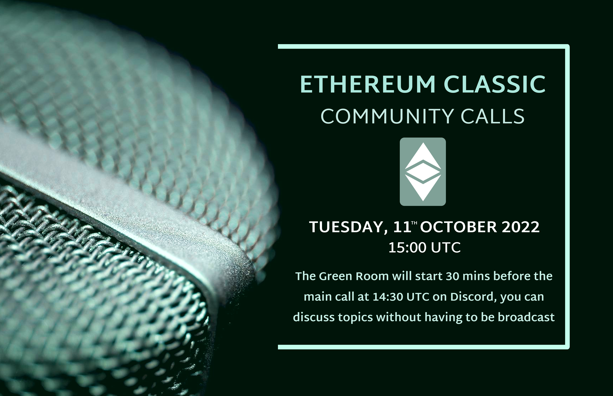

**Join the call 30 mins before we go live to chat offline**

A casual voice chat to discuss ideas for ETC. All are welcome.

The ETC Discord can be joined at https://ethereumclassic.org/discord

Please join us at any time in the #community-calls channel to ask questions or bring up topics.

This call is an open discussion so please feel free to jump in any time, but be reminded this is live streaming on YouTube.

You can also post chat messages in Discord or YouTube, and we'll try to get to them.

You can find the agenda to this call in the description, which contains links to everything we talk about.

## Hosuekeeping

Agenda: see below

Gratitude: Brotherlal, d_a, (etc.)

## Headlines: This Week in ETC

- Dominated by Ergo Twitter Hijack

## Ecosystem Update

- XEN Clone https://twitter.com/BlockHebe/status/1579452810357530624
- New DEX on ETC https://twitter.com/xbtsdex/status/1579497238371667975
- New RPC operator ETC Planets RPC
- ETC-Network.info deep dive into site (Mario Screenshare)

## Mega Happening: ETC_Classic takeover

- What happened https://ethereumclassic.org/blog/2022-10-07-twitter-tebacle
- ETC Coop now controls `eth_network`
- https://ergo.wtf

## Etcetera

- More on rai
- Updates to twitter-together
- Maybe we should get back to the drawing board here now that our positioning is great. https://opensource.guide/building-community/

## Community Building

- How can we help people contribute to ETC?
- Teach people to be independent?
- Open source philsophy education
- ETC-wide project management tools
- Miro
- "The List"

## Free Talk
- Proposal of an introductory course on Solidity smart contracts to pitch community interest.
- https://forms.gle/Ww9ZijQzmGFo99pG6

## Sign Off

See you next week, same time same place.

---

## Full Transcript

```webvtt
WEBVTT

NOTE no-names

1
00:00:18.359 --> 00:00:26.810
Community call this call is number 28 for the 11th October 2022.

2
00:00:26.820 --> 00:00:48.170
this week as usual we have been chatting offline for 30 minutes before the call so if you'd like to join us for a non-broadcast chat you can join us every week at 14 3-0 UTC as

3
00:00:45.840 --> 00:01:07.969
usual we have a casual voice chat to discuss ideas about Etc everyone is welcome and you can find us in the ethereum classic Discord server at ethereumclassic.org Discord you can join at any time in the community course Channel and ask questions and bring up topics you'll also find us on YouTube live streaming

4
00:01:05.280 --> 00:01:26.810
on our YouTube channel and you can post messages there which we'll try and get to if we have time as we are streaming live uh for participants in the voice chat please be on your best behavior for

5
00:01:24.720 --> 00:01:46.429
the whole of the cryptocurrency ecosystem with a number of large events happening um we had the Celsius Docs release doxing a bunch of people um with their uh real names tied to transactions which is never good we

6
00:01:44.040 --> 00:02:05.389
also had a large BNB hack and of course we had the main uh event in ETC land which was the ethereum classic handle takeover but we before we get into those news topics and the open discussion we will first do a bit of housekeeping first of all thank you to Bro Lau for helping

7
00:02:03.060 --> 00:02:23.630
out with the audio as always and to D underscore a for the graphics I'll jump straight into the ecosystem update and uh this week we have three new projects and we will be having a live

8
00:02:21.959 --> 00:02:43.070
stream from one of the community members to talk about edcnetwork.info you have a clone of Zen which uh um the team has announced on their Twitter account which is worth checking out there's

9
00:02:40.319 --> 00:03:03.830
a new decks on Etc called xbps decks and a new um RPC provider has added their services to the ETC Network so thanks to Etc planets RTC RPC by

10
00:02:59.099 --> 00:03:20.869
handing over the uh the audio and the video to Mario from etcnetwork.info so uh Mario um I believe we introduced your project on a previous call but this time you you're able to step us through a demo of that yes

11
00:03:18.000 --> 00:03:38.750
I would like to go through a more deeper dive into the site I'm providing um I will start to share right now hope you all can see it if you could give us a thumbs up in the chat profile if everything's okay to start yeah

12
00:03:35.519 --> 00:03:55.970
I can see it um as it says a small site to help to navigate through Services I provide via the etcnetwork.info on the ETC chain um

13
00:03:52.980 --> 00:04:14.750
basically it has some explorers we can look into record everything um as well as fluxcode IO and Expedia so if you're familiar with these explorers you will you will notice them by the look of it so

14
00:04:12.360 --> 00:04:32.450
currently it's still in the indexing the transactions so please be patient my server is running at 100 CPU load so um it's indexing currently blocks and yeah it's taking some time to be up to the

15
00:04:28.560 --> 00:04:49.610
current time it date and block yeah and there's the ethereum light Explorer which is also nice but the looks of it if you want to check out for example the the latest blocks with a lot of transactions you can you can see it visually here so you can just click on the

16
00:04:47.699 --> 00:05:08.390
Block and then you get all the details um by the way all these apps and all the things are not developed directly by me so I'm just providing you the services and you could check it out uh maybe someone can post the main link into the chat um yes and let's

17
00:05:06.660 --> 00:05:27.890
come to the list um Expedia where you can also choose some test Nets so for ethereum classic just here on the top you can come here and choose the networks which you want to use as you can see I have some infrastructure on the German or Germany and

18
00:05:25.199 --> 00:05:45.230
in Austria I'm located in Austria Austria Vienna um yeah as you can also see then there are some bezel notes and also gift notes and as you can see also some test test that works yes um

19
00:05:41.580 --> 00:06:02.870
I guess that's all from the Explorers um as you maybe know the applications from other sources or for example block Scott where I know it from suplexgod.com um yeah you're quite familiar if you have checked it out once already then

20
00:06:00.180 --> 00:06:20.270
we come to a dashboard which is in my opinion quite interesting um so it's like maybe you can remember this Etc stats dot net I think it was in the past sadly it's not updated anymore and I

21
00:06:18.660 --> 00:06:39.290
wanted to show this project or to continue on this project actually to have some real real-time or close real time um stats about the ETC Network the important thing in on the top you should want to do some research you can choose

22
00:06:36.419 --> 00:06:59.870
here the time frame um so for example if you want to do the latest 30 days you can choose the latest 30 days maybe not choose the Nuremberg in Germany because this is needed to be moved to another server so I bought a new server for that hopefully um everything works fine out but you can see

23
00:06:55.680 --> 00:07:15.969
it's it has the recent history for um all the things you can even select if you know it by clicking on the left Mouse button and then you can select such time frame which goes more into detail for example if you want to find a specific block or a specific events for example

24
00:07:14.160 --> 00:07:35.510
you have some or we had some very high amount of transactions added into the pool the recent week I checked it out and I found some blocks or I found some some blocks where some of those were added yes um

25
00:07:32.819 --> 00:07:55.189
so quite um quite good if you want to do some research what happens on the Chain actually um yes then let's go back is just showing all the nodes which are holding

26
00:07:51.000 --> 00:08:11.629
the whole downloaded or some parts of it of the blockchain so you can give it a search if you want to search your own node or if you want to just check out who is hosting it and maybe checking out some

27
00:08:08.460 --> 00:08:30.290
P addresses or some whatever things or use it just for having some e-nodes to connect to to Heaven fast sync or faster download um yes you have also some dashboarding on the right side good

28
00:08:30.300 --> 00:08:50.690
um I guess the markets pay is just the most boring it's just some some oh no you cannot even see that uh it's some uh yes some external marketing information um not not too much to share but uh Toto to show here um

29
00:08:48.660 --> 00:09:10.670
yes then we have the hard Forks are actually called the heart and soft Forks so mainly just upgrades um big thing to uh my friend which I forgot the name now uh it's uh who is it wb1

30
00:09:07.100 --> 00:09:27.710
g0 you helped me with that thank you for that so he helped me to get all the IC IPS so the ethereum classic Improvement proposals the right links through the through all the upgrades or all the updates which has been added to ethereum since the homestead actually went to Ice Age

31
00:09:27.720 --> 00:09:48.170
yes so you can click on for example under the thing and you it gets directly redirected to ethereum Classic Improvement proposals where you can check out what has up been been upgraded or which what has been rejected or um they

32
00:09:46.200 --> 00:10:07.790
moved yes and let's go back I think they're two no just one more thing the rpcs I provide also rpcs for as you can see ethereum demanded and also the test Nets you can just connect to it [Music] um

33
00:10:11.160 --> 00:10:33.949
it's automatically using the https Port as the normal RPC port let's see maybe are familiar with correx um if you have some problems here

34
00:10:30.200 --> 00:10:50.930
also and yeah as you can see more coming soon um very happy if someone helps or if someone mentioned something where I might fix something some spelling mistakes or some um

35
00:10:48.720 --> 00:11:10.970
some app what you want to see which is already on a GitHub page somewhere and you want to see it in action or have some ideas for the project just let me know um just contact me here on telegram just click on it you can contact me anytime I will be hopefully

36
00:11:08.120 --> 00:11:28.670
in your time zone that I respond quick and yes that's all if you have any questions um asking a chat are we now look in the chat and try to answer some question and maybe post a link again if needed yes

37
00:11:23.339 --> 00:11:43.850
thank you presentation an awesome project that you have there that

38
00:11:41.279 --> 00:12:03.230
in terms of the it seems like you're hosting a bunch of stuff there with uh different server installations and uh how much Hardware is does it take to run all those nodes and different services infrastructure in Germany and Austria um

39
00:12:01.019 --> 00:12:23.750
it's actually just two servers so one Germany one in Austria and the system resources I can quickly have a look um So currently I just recently moved to a new type of server which has now um

40
00:12:18.899 --> 00:12:41.329
it course CPU with quite good specs with three gigahertz and also fed 2 gigabyte of ram which is currently utilized fully by the block Scout index block Scout indexing um that

41
00:12:37.920 --> 00:12:59.389
you have quick searches into into the blockchain and the whole disk space which is utilized by by the keys the best nodes uh get nodes and bezel mode are

42
00:12:54.500 --> 00:13:19.370
currently about 400 gigabyte so quite of some storage but it's also with the test Nets and everything so 400 gigabytes per server I'm providing and

43
00:13:17.339 --> 00:13:37.910
a number of different instances for the different um for some reason not no problem can you can

44
00:13:34.980 --> 00:13:58.069
you guys hear me yes I can hear you foreign there was a like a fork monitor would you could you so in in the case of like a uh uh yes an upcoming hard Fork that

45
00:13:54.899 --> 00:14:19.910
could be used to determine uh whether or not all the nodes are upgraded right let me share that once again I think you meant this one right think

46
00:14:17.519 --> 00:14:38.269
yes you can see it's like how many nodes are currently um um supporting I think it's called the fork or the upcoming upgrade for example yes you can see we have now uh this current uh Fork uh so Mist tweak I'm very bad at spelling those

47
00:14:36.720 --> 00:14:57.889
names last one was a bit easier um but yes you can check them out here you can even see how many a percentage of the known um or connected nodes are supporting such upgrades also to mention is that um maybe

48
00:14:54.660 --> 00:15:16.189
it's Phoenix or or some other Homestead or Market Magneto is is supported also also um but these nodes are also supporting later than the newest fork or the newest update but currently it's syncing so you can see it by the I

49
00:15:13.680 --> 00:15:36.230
think somewhere you can see it on the on the head yes you will see it on the latest latest difficulty so all the all the notes will have a difficulty level and if they're all the same for example you can check out those two notes so this one has some higher difficulty than

50
00:15:33.540 --> 00:15:54.889
that one so I guess if I'm correct it's not fully synced yet was it like that are fully synced they're on the latest head of the chain and therefore

51
00:15:51.420 --> 00:16:12.110
they are but as you can see this is built by ethereum classic Labs so if you have any questions check out their GitHub I'm just deploying the the services or I'm providing just the services

52
00:16:09.720 --> 00:16:34.370
so if you have any troubles if anything just give me a hint or write me and I will try to forward this to the GitHub I think you can even yes for example here you can see that where it's provided from main

53
00:16:32.459 --> 00:16:54.590
landing page is there a GitHub repository for that uh there is actually not no that's a good point I will add that I'll add that to my notes maybe to add maybe at the coming soon page that's a good idea speaking of coming soon did you have any ideas

54
00:16:50.459 --> 00:17:12.350
for what could be added that's a good question um I'm looking forward for every application or every service which I can provide to the EDC community so if someone needs something or if someone needs

55
00:17:08.339 --> 00:17:30.470
a don't know some actually I'm I'm I'm constantly looking through GitHub and searching for apps to deploy because um I have hopefully after the indexing of the block of the blocks for a blocks card hopefully again more CPU

56
00:17:27.020 --> 00:17:48.770
time and more CPU to handle such other application but I'm not 100 full now so just let me know let's see what to draw and what comes what comes in the future um

57
00:17:46.200 --> 00:18:07.490
what you're providing here is solving a long-standing issue that we were we kind of were planning to implement on the website but because it's such a sort of there's many moving parts and requires a lot of effort to keep maintaining so we would definitely um want to make this more prominent for visitors

58
00:18:04.860 --> 00:18:29.570
on the website and uh I can link you to an issue from I believe two years ago that basically was like hey we need Network monitors um and I think there might be some ideas on there uh for you so uh I'll paste that in the chat said

59
00:18:26.460 --> 00:18:49.549
I was fascinated by this Etc stats.net I think it was called and it's like this this running down notes um maybe I can check it out from another from another source moment guys

60
00:18:47.039 --> 00:19:14.210
which are or some persons which are longer into ethereum or ethereum classic will know this uh interface yes yes check

61
00:19:08.520 --> 00:19:28.909
it out where is it oh wait I think I found it yes I think you are quite familiar with this site where you have all the nodes for

62
00:19:27.299 --> 00:19:48.710
example for a pool by the way I'm not making any promotion for two minus it's just because they have this old interface of this ethereum classic Network stats and such things for example I wanted to do to deploy but could not do in the past and

63
00:19:44.640 --> 00:20:11.710
um if someone knows how to deploy it or how to make it work on Docker because I'm providing the services all on Docker then just give me a can we call or write me on Telegram yes

64
00:20:16.860 --> 00:20:37.250
um RPC nodes to a website called uh yes yeah that's right yeah yeah I did awesome yes but only only the the main because all the others were not found or it could not found on

65
00:20:34.799 --> 00:20:57.950
button I can show that so you meant this side right yeah that's one yes for example for people watching this is the um this is an awesome website that allows people to connect their uh metamask

66
00:20:53.660 --> 00:21:14.930
wallet quite easily wallet button and we're we're now linking to this website from the main ethereum classic website so it's a it's a really great resource yes yes and as you can see uh my latest my

67
00:21:12.179 --> 00:21:33.890
latest issue request or pull request was not approved yet because it's still down because as you have may seen on the RPC list that um I also have the differentiation now between Germany and Austria so it's a bit more for redundancy not for Simplicity

68
00:21:30.440 --> 00:21:50.450
so it's just because that you can have the possibility that for example my node crashes or something happens that you can switch to another node which is might work or which might work and there's no manual changing or automatic changing in between that you can

69
00:21:46.860 --> 00:22:09.409
really choose which node you want to um consume the info from let's say in right well while we're on this topic and I'm just uh remembering some of the previous conversations we had on one of these calls um and we were talking about some kind

70
00:22:06.840 --> 00:22:26.930
of load balancer that would automatically take a bunch of different RPC servers and allow people to just instead of manually choosing kind of automatically decide which one it goes to so that might be an interesting uh project to extend

71
00:22:24.419 --> 00:22:44.750
metamask in some way using the change service just to have like a pool of servers which you're providing such Services yeah yes that's that's a good that's a good good point yes

72
00:22:46.500 --> 00:23:06.830
something that we've been uh uh needing for a long time and uh thanks a lot for uh for putting in the effort to provide it it's an awesome service so yeah thanks you're welcome you're welcome and if there's any question by anyone in the chat or if anyone wants to speak speak up and unmute

73
00:23:04.440 --> 00:23:26.390
yourself and have some direct question then your chances now this website can yes yes now I can hear sorry yes I don't know we have the vision that this

74
00:23:23.820 --> 00:23:44.570
can be like ether's can but I think that etherscan.io in ethereum it's very good I used to when I was in ethereum I used to use it it has a lot of yes um interesting is that is it so if you if your vision is more or less to be like that then I suggest to check heater scan

75
00:23:42.179 --> 00:24:04.010
for how they organize the site and the data that they show stats and all that sadly sadly I'm not the developer so I'm not a programmer any kind I'm just a normal simple Network and security guy so I'm just doing some networking and some security topics so if there's any programmer or any developer which likes to

76
00:24:01.799 --> 00:24:23.570
help or just doesn't want to provide their own um Hardware let's say for infrastructure I'm willing to do that and if you just help me deploy such things then we can also provide for example like Donald mentioned like um either

77
00:24:18.059 --> 00:24:39.529
scan I think it was yes etherscan is closed source project um so it's probably not available to deploy so easily and would have to be built from scratch is

78
00:24:36.200 --> 00:24:56.270
correct but yeah definitely the um especially some of the contract interaction features on there uh I believe are lacking from block Scout so I I guess the best thing to to do really would be to contribute to an already somewhat

79
00:24:53.940 --> 00:25:14.630
mature project like block Scout and add those additional features good but um there's a bit of an issue when you try to interact with the contract for some reason it thinks there's some issue with the with which network it's on so it doesn't work at all on ATC um

80
00:25:12.720 --> 00:25:36.110
I I don't know me I'll talk to Bob about it and I I don't know who's managing that um but we'll see because it would be really nice if we could if at least for developers to go in and be able to interact with the smart contract on there otherwise we have to go and use a separate platform like ID or a vs code or

81
00:25:30.900 --> 00:25:52.789
something like that just while I have this in mind um Mario one of the uh nice uh like web-based playgrounds um that was available on ethereum that the

82
00:25:50.700 --> 00:26:15.409
name is escaping me right now but it basically allowed people to author contracts and deploy them right in their browser see if I can remember the name of that one second I have something in the in the infrastructure or in the contract

83
00:26:12.120 --> 00:26:37.610
verifier I'm actually not that known to that what it's doing at least it's running for Block Scout doing something it's so maybe the name of the project is remix okay Classic

84
00:26:35.580 --> 00:26:58.490
it would make uh like you don't need an IDE really you can just run and I believe it's open source so this would be a nice thing to play around with is it that one yep remix okay yes that

85
00:26:56.039 --> 00:27:16.970
you can't really deploy it for ETC like you can just connect your wallet on Etc in remix um but like we could use we could use like if uh you know this would be a really good resource just to have uh for ETC um you know public so that people can deploy uh smart contracts sometimes simple

86
00:27:14.820 --> 00:27:37.190
ones or you know just to get people to fiddle around with it it always it always Peaks curiosity in some people so it's like is it so it's like an okay it's in web app which is I guess you could think connected with an

87
00:27:33.900 --> 00:27:55.730
RPC note right or how do you yeah you can you can use like a metamask wallet or uh yeah there's a bunch of different ways that you can you can do you can actually connect your own node if you know what you're doing uh makes it a little quicker okay yeah I'm gonna check it out I maybe it's if it if it's possible it would be great to

88
00:27:53.520 --> 00:28:15.230
have like a an ethereum branded version of uh this IDE in green obviously and if I remember correctly I'm not sure but it might be possible to be able to use it without any plugins like without metamask and just using uh like a light wallet within the browser so that would be like a zero installation

89
00:28:12.720 --> 00:28:34.970
IDE yeah you can have like a a virtual machine you can have like your own little ethereum instance uh to mess around with um uh as for like uh rebranding it I don't know if the project is open source but you can definitely check yeah right there um I'm not sure if if you can if it would

90
00:28:32.400 --> 00:28:55.789
be possible to you know redeploy this um yeah I got no idea the past but now it's maybe closed doors it's it's been it's been moved yes I just saw it oh in

91
00:28:51.620 --> 00:29:12.230
quite recent looks good and possibly dockerized yes perfect maybe even deploy it in Discord no just joking but I will definitely give it a look and try to deploy it maybe the next chord we have

92
00:29:10.620 --> 00:29:34.610
another deeper dive into that but then you will need to help me I don't know this app awesome I'm glad these uh these calls are creating value on the Fly okay

93
00:29:37.500 --> 00:29:58.610
inputs I will definitely try my best to deploy it and yeah maybe it will be on there agenda next week any

94
00:29:55.559 --> 00:30:17.990
other comments please feel free to chime in at any time uh

95
00:30:16.620 --> 00:30:37.010
the next um topic which uh of course we could not uh miss this week because of the uh drama that I'm sure you have all been witnessing uh if you're paying attention to Twitter that is and even if not even if you're not you have probably unintentionally

96
00:30:34.580 --> 00:30:57.529
run into the drama in the Discord Channel um the verified Twitter account of ethereum classic with 672 000 followers ish was renamed

97
00:30:54.179 --> 00:31:14.930
to Ergo underscore project by uh not on like the owner uh Charles hoskinson and the Ergo project has accepted custody of this new account thereby inheriting all of ethereum Classic's

98
00:31:10.740 --> 00:31:31.730
old tweets and those followers so there's been obviously mixed reactions from various different communities my comments I was wondering if anyone wanted to you

99
00:31:28.740 --> 00:31:49.280
know have some some of their own um what do you guys think about this recent event event

100
00:31:46.980 --> 00:32:08.930
one side is [Music] um iohk and Charles hoskinson who had control of the account and the other side is the behavior of the Ergo community and I think the Ergo Foundation was also involved or something so

101
00:32:08.940 --> 00:32:29.690
um from ioh case and um shows just the petty low level Behavior I think it's totally um childish it

102
00:32:26.460 --> 00:32:46.789
seems that he's angry because his treasury was rejected or something like that so now he wants to um get back at Etc by transferring the the account to a competing project I think I I

103
00:32:43.799 --> 00:33:04.789
do think that from so on on the child's hospital side is just stupid and childish and I don't think we can expect something different from him but on the Ergo side I think they have the responsibility to show that Ergo is is a trustworthy project that

104
00:33:01.919 --> 00:33:22.190
is sincere in terms of a positioning of the of their brand and it's really weird for me that um they accepted this opportunistically and that they feel that it's perfectly okay I

105
00:33:18.179 --> 00:33:38.269
think one of one of the persons from their Foundation was chatting on Twitter with Bob summer will it and said something like his name is Glasgow or something like that and um he said something like well

106
00:33:34.799 --> 00:33:56.450
we weighed we weighed the options and the pros and cons and we considered that the pros were much more than the cons so we decided to accept the account something like that I think that that is that is totally immoral and principled and

107
00:33:54.659 --> 00:34:15.409
unethical it is totally obvious it's not I don't think it's even um worth explaining why it's unethical you know to to move the social media account with 700 000 users that were that

108
00:34:11.159 --> 00:34:31.629
account was built over a five or six years and um with a lot of work and and ethical Behavior and principles and another another brand that

109
00:34:29.159 --> 00:34:50.149
claims to be as ethical and in the same uh with the same values of code is Law and immutability and blockchain principles and all that and and and be so happy to accept it so I think it's a real

110
00:34:45.960 --> 00:35:07.130
fail uh for the Ergo Foundation but overall I think that the message for us not the message but um we should yeah understand is that ethereum classic ethereum

111
00:35:03.480 --> 00:35:24.170
ethereum classic is one of the two best blockchains in the world not because of external things not because grayscale or Barry or Elon Musk in the future will support it not because we have

112
00:35:20.640 --> 00:35:43.010
a big social media account not because we have money or we don't have money we have little money or we have a lot of money for future development and infrastructure ethereum classic is the best one of the two best blockchains in the world together with Bitcoin because of its intrinsic value it's internal

113
00:35:40.500 --> 00:36:02.109
it's it starts from the principles like histora wrote and from there the design of the protocol and from there the the structure of the network that's why ethereum classic is valuable because it really and truly guarantees uh

114
00:35:59.160 --> 00:36:19.970
immutability trust minimization censorship assistance formationlessness and that is only achievable in a smart contracts blockchain like ethereum classic with proof of work with Nakamoto consensus and we are the largest blockchain in the world

115
00:36:16.859 --> 00:36:37.150
with this design so I think that that is what everybody needs to understand because I saw a lot in in um in the general channel of people like crying and going crazy and hysterical because of this case and

116
00:36:33.800 --> 00:36:56.510
and also appealing to to billionaires and grayscale and and the exchanges to help and this and that as if we were drowning it this is not drowning Etc his intern is internally solid and um it is one of the best blockchains in the world because of its intrinsic value

117
00:36:53.640 --> 00:37:16.130
not because of all these external things foreign lot of it is a bit of a distraction and is taking away uh uh

118
00:37:13.079 --> 00:37:33.650
the focus of the community onto some drama and that's kind of expected given the the size of the attack I guess but um I think you're right and it doesn't really affect the pro well it does not affect the protocol whatsoever and ethereum

119
00:37:31.500 --> 00:37:52.790
classic is like the honey badger in that sense it does doesn't care about whether or not it has uh any number of Twitter accounts stolen because it will continue and the community's still here and we're still gonna continue and whether Charles thinks it's a dead chain or not is irrelevant and every

120
00:37:50.880 --> 00:38:11.630
attempt that he makes to try and hurt ethereum classic is really just going to make it stronger because we're anti-fragile and in a way this is this could be seen as a good thing for a certain classic given that um we no longer have this uh attachment to Charles

121
00:38:09.240 --> 00:38:30.650
and we're no longer um it's kind of like breaking the umbilical cord the last um thing that he had to use his leverage against the chain is no longer able to be used so right in that sense what you said there is very important that this might even be good I

122
00:38:27.359 --> 00:38:49.250
think that that is true for projects like ethereum classic and Bitcoin Bitcoin if you see the history of Bitcoin is a history of A system that has been under attack since since its Inception and it's still under attack Bitcoin is under attack by by

123
00:38:45.240 --> 00:39:06.170
the U.S Congress by the European Central Bank by the IMF constantly by the by BlackRock the mutual fund company all the ESG and climate hysteria groups and before that because of other reasons central

124
00:39:04.260 --> 00:39:25.370
banks hated because of the monetary qualities that it has politicians hate it because they cannot control it Bitcoin has always been an information that Bitcoin after uh 13 years is still going solid immutable

125
00:39:21.599 --> 00:39:43.310
and with such such a strong Integrity with such strong security that information that a system is um still going even even if it's under attack constantly is very good information for the

126
00:39:40.020 --> 00:40:01.069
market and uh the more time passes and this continues the stronger the system gets because of that the more people want to be in the system and buy Bitcoin and participate as a node operator or as a minus and exactly the same with Etc I cannot think I think that

127
00:39:58.619 --> 00:40:19.790
EDC has gone through in its in its shorter lives and bitcook as it's six years more things than Bitcoin because it's been 51 attack I I even think at this point that the 51 51 attacks are good news good information in the future the

128
00:40:16.020 --> 00:40:37.310
more time Etc survives and remains immutable and proves its core principles of immutability censorship resistance permissionlessness and trans minimization and the monetary policy is solid and and sound the

129
00:40:34.500 --> 00:40:55.790
more time passes and the more attack it has its better information for the world of such a resilient system like you said that's a really good point Don um and you know if you attack like Fiat currencies like the US dollar eventually people will just lose trust and that will

130
00:40:53.940 --> 00:41:16.130
completely disassemble the system but you can attack ethereum classic all you want and no matter what you're still going to have the protocol it's still going to be building blocks every 13 seconds and adding transactions to the transaction pool so there's nothing nobody no no number of attacks uh even 51 percent attacks eventually they will stop

131
00:41:12.660 --> 00:41:35.569
and they it will continue to go on I totally agree uh what I got and I noticed you uh had a post sorry for missing that but uh I wanted to give you the flaw um we can come back to this uh hijack but I just want to make sure you uh had you wanted to announce something right oh

132
00:41:32.579 --> 00:41:53.569
yeah so um I'm going to uh so I was actually talking with uh W1 g0 um he he asked me if I was interested in doing a bit of an introductory course to Etc and uh the ethereum virtual machine and solidity at the same time just like all around you know uh introduction to ethereum

133
00:41:51.660 --> 00:42:11.930
Classic and you know what the principles are and how how does it work you know just kind of like a under the hood type of thing so I'm going to post uh probably in general and on Twitter on a bunch of different uh handles and see if I can get some retweets going um uh just just a a simple Google forms link

134
00:42:10.440 --> 00:42:33.170
where people can put their Discord username and then if we get like 10 to 15 or more submissions uh to That Then I then I will consider um uh setting up a little program for that and then in a couple weeks I'll get beget uh get started on some of those courses and obviously they'll be recorded uh and then I'll put them up to YouTube and they'll probably be like a weekly

135
00:42:30.420 --> 00:42:52.730
thing uh for maybe a four or five weeks so if you're interested in that just stay stay tuned on Twitter and I'll put it in the uh in the general chat on Etc so this would be kind of like a smart contract focused thing or history of Etc Well

136
00:42:50.180 --> 00:43:10.910
we'd probably split it up uh between the courses like we'd probably Begin by a history of ethereum in the first place uh you know a little bit of of a Bitcoin blockchain and then what ethereum and ethereum classic uh have to do with that then the second one would probably be about you know the fork and then talking about you know vulnerabilities

137
00:43:08.640 --> 00:43:31.970
uh within smart contracts that are not linked to uh the protocol and then forward on to that it would be more get a little bit more technical with uh evm and smart contracts yeah definitely be signing up the

138
00:43:30.480 --> 00:43:52.609
website if that's something that you're interested in uh promoting yeah I'll contact you afterwards awesome thank you uh

139
00:43:50.880 --> 00:44:12.730
Twitter thing um I've recently published a uh a a piece about the recent events just I was after seeing what happened on Friday I was a little shall we say uh fired up to to write something about it and get my thoughts out there so uh you can

140
00:44:10.680 --> 00:44:32.690
visit ergo.wtf for some of my thoughts on what happened and potential Solutions and they basically reflect what uh what Donald has been saying and goes into some of the uh some of the details of what what actually happened in terms of collateral damage

141
00:44:30.540 --> 00:44:52.910
not just for ethereum classic which were kind of minor really just losing that account um but but also for the rest of the ethereum uh well not just ethereum but the the Ergo project and The Wider cryptocurrency space in terms of just just screwing around with Twitter basically

142
00:44:50.099 --> 00:45:12.470
is is not cool and and yeah there's there's a few ethical concerns that I pointed out such as um well the main one being the fact that Charles invested in the Ergo project um before uh pumping up the numbers of that Twitter account to make it seem like it's far more popular than it actually

143
00:45:09.480 --> 00:45:29.930
was so for investors looking at the space that might be a little bit concerning ethically sentiment in the Discord channel that uh probably

144
00:45:28.260 --> 00:45:49.430
the best thing to do is kind of move on from this and whatever happens will happen now and we have a clean slate so we can start fresh and make sure that everything that uh well one of one of the things that's uh benefiting Etc now is that the F

145
00:45:47.280 --> 00:46:09.829
underscore sorry yeah as underscore classic uh Twitter handle is now in the control of Bob summer will of Etc Co-op so yeah there are no malign actors controlling any of our her verified social media feeds anymore so I think that's a big win for the project overall in terms of uh

146
00:46:06.900 --> 00:46:27.950
promotion even though it's not I agree that's that's a really it's a it's a big step and you know we don't have our links to Charles hoskinson or iohk it's completely severed now we don't have to deal with them ever again I think I think that's a win you know cardano or go um you know any other projects link with Charles you know they're going to have to fend for themselves

147
00:46:26.579 --> 00:46:47.329
but at least we don't have that burden anymore and Bob summerwell is still uh going to go on a call with the the guys from the Ergo foundation and he's going to try to you know pull some strings and see what he can get done but for the rest of you know the community it's best if they if everyone just puts their heads down uh you know if

148
00:46:45.359 --> 00:47:06.050
if you want to attend the course that we might be doing uh you might want to go to that that you know learn a little bit of how you can help start developing because right now we have a serious shortage of developers because for some reason I'm known as the developer on Etc and that's not right there should be more of us um so you know I want to expand my skills

149
00:47:03.720 --> 00:47:25.190
and have other people come on board and start to build you know useful applications not just you know nfts and tokens witnessing um despite Charles's claims that it's a dead chain the the ecosystem is budding and

150
00:47:23.339 --> 00:47:45.230
every week There's new things coming along there's more people there's a lot of people in this call I've noticed and uh yeah the ball is rolling once again so let's get our heads down and as they say Biddle it's great that the ball is rolling uh because we're in a I guess you could say a bear market now definitely confirmed uh

151
00:47:42.960 --> 00:48:07.609
so if things start going well during the bear Market you can just imagine how things are gonna are gonna look if things start to rise again anyway uh have a nice day everyone I'm gonna I gotta go uh but thanks for having me on thanks for the gun the

152
00:48:05.040 --> 00:48:27.050
next uh topic unless unless there's any other comments on on this uh Twitter Fiasco um Floors

153
00:48:12.480 --> 00:48:32.690
open item

154
00:48:30.599 --> 00:48:52.550
in the agenda was about uh community building and uh in the green room chat before this call which everyone can join uh 30 minutes before the the call is broadcast we're talking about um how we can help newcomers to the community figure

155
00:48:48.440 --> 00:49:09.710
out what to do and it can be quite daunting I guess going to a new uh Community where you don't really know anyone and you don't really know who's doing what like how how do new people uh contribute and how do they get the confidence to be able to just do stuff

156
00:49:06.000 --> 00:49:27.710
because really Etc has no it's not like you need permission to do stuff and it's not like a typical top-down hierarchy like most other projects so I think it'd be useful to try and figure out how we can make it easy for people to um you know find tasks and contribute in their

157
00:49:25.560 --> 00:49:50.150
own way without feeling like there's like a club of people that's doing stuff because it's really not like that it's it's really anyone can come along and just do what you're good at think

158
00:49:47.280 --> 00:50:08.329
one of the major things that we can learn from the open source Community free and open source Force as it's better known that the first step is to have a welcome welcoming community and the second one to have extremely good documentation

159
00:50:08.339 --> 00:50:30.230
even writing out a certain documentation or translating them is a pretty easy task that can be performed I guess have

160
00:50:26.760 --> 00:50:48.170
in mind of what I am thinking is to add uh procedures on the website or on the GitHub

161
00:50:43.079 --> 00:51:04.849
on how things should uh be um or try starting to read on up on the issues on the GitHub and the ones that are enabled with first good issue or something that's what I had in mind portal

162
00:51:03.300 --> 00:51:25.130
for people various different skills which is like how to contribute if you're this or that or um whatever your skill set is somehow crowdsourcing um from from everyone in Discord potential

163
00:51:22.559 --> 00:51:42.910
things that could improve ethereum classic not just on the website but across the whole project across everything to do with ethereum classic from making memes to videos to hosting meetups and that kind of stuff and I don't think we have that kind of resource

164
00:51:41.099 --> 00:52:01.130
at the moment so uh just putting your list together would be a great start on that don't need permission to help out uh a lot of us um would

165
00:51:57.780 --> 00:52:21.609
love to be able to contributing to these kind of initiatives but already have a lot of uh tasks in their to-do list so um if anyone's willing to step up and help and do something like that that would be a big help for the project because it would then have knock-on effects to encourage other people to contribute

166
00:52:17.220 --> 00:52:40.849
as well for this would be to ask the question what does etc mean to you and post it in a certain skill

167
00:52:36.980 --> 00:52:58.870
so that somebody afterwards can take all these skills and group them in certain um yeah entities like one should be marketing the other one should be education or whatever that comes out from

168
00:52:56.040 --> 00:53:17.829
these suggestions could organically grow into something that

169
00:53:03.440 --> 00:53:28.010
people can grasp and contribute to to this um this call that I make notes of

170
00:53:22.559 --> 00:53:44.030
that and uh add some issues was a topic that we talked about in a previous call was uh the idea of having a Mima contest to encourage uh people to create uh content free TC that can be easily

171
00:53:42.480 --> 00:54:04.670
shareable and now that we have control over the Earth underscore network uh Twitter account this gives us potential opportunity to have like a daily or weekly um retweet of uh content creators that we can help promote and encourage to also generate content

172
00:54:02.460 --> 00:54:22.910
for uh the ethereum classic project anyone's listening I would like to contribute tweets um we are currently recruiting maintainers as

173
00:54:20.460 --> 00:54:40.970
well as just people that want to create pull requests on the uh the new well the reset the same name but new no follower well a thousand follower account of f underscore Network so please uh head on over to github.com ethereum

174
00:54:38.160 --> 00:55:01.130
Classic if you're interested in uh helping create tweets I read somewhere in the issues which I thought

175
00:54:56.940 --> 00:55:19.190
was a great idea of Pull-Ups so I think it's a picture of proof of attendance picture I guess that's a abbreviation so if we could make that happen for the

176
00:55:15.500 --> 00:55:35.690
meme contests or or just attending these these Community calls I believe that would be awesome but I'm not sure what is required and who can help setting this

177
00:55:30.900 --> 00:55:51.109
up potentially be used in future on chain um organizations um because it could be used as a form of civil attack

178
00:55:48.359 --> 00:56:18.650
prevention by ensuring that everyone that's contributed is actually aligned with the project and has in some way proven their identity by either speaking on the calls or just joining the

179
00:56:02.160 --> 00:56:23.809
calls or yeah making memes have

180
00:56:21.720 --> 00:56:47.270
uh reached the end of the current agenda we could talk more about the uh the mega happening or we could uh leave the floor open so what do you guys think we

181
00:56:32.640 --> 00:56:58.069
should do comments uh

182
00:56:55.079 --> 00:57:30.910
this week bro Lal is unable to uh join us on the audio call because of the uh some AV he only has one Sound Source I believe which has been used for the uh the uh live stream so unfortunately it's unable yeah okay next time price

183
00:57:16.200 --> 00:57:38.809
of Etc let me just bring it up everything

184
00:57:34.859 --> 00:57:54.950
is is is going as planned for Etc in terms of positioning in terms of ethereum moving stake in terms of being the largest contracts blockchain that is proof of work well designed and everything that I that I said before the

185
00:57:52.440 --> 00:58:16.010
only thing is that um Litecoin are are not programmable so it's only natural that APC should should be above those blockchains in terms of market cap that I think is going to happen just a matter of time the

186
00:58:12.420 --> 00:58:33.109
the the real material thing that is not in favor uh not only of Etc but all of crypto and not only crypto but all Assets in general is is the the the the tightening

187
00:58:29.540 --> 00:58:49.910
no the um Global monetary policy of central banks in North America Europe in Asia that they're all in a coordinated way tightening the money supply uh and when when the

188
00:58:47.339 --> 00:59:07.549
big currencies in the world the dollar the Euro the British pound and the Yen uh when the rate when rates are rising then all the rest of the assets of the world either stop growing or or the deflate so that's that's

189
00:59:05.640 --> 00:59:27.349
the only thing that that I think is stopping crypto in general that's why we are in a winter um and that's why EDC it's it's in own own bear Market also now we are experiencing the unloading of the traders that they just

190
00:59:24.839 --> 00:59:46.309
bought before um emerge and they sold after the merch now that that's a typical trade so that's absolutely normal so but uh the the overall message is that Etc has the best fundamentals of any blockchain um

191
00:59:44.760 --> 01:00:07.190
in the world the only other blockchain that had these fundamentals is Bitcoin and I think it's just a matter of time and you just have to hold on particularly

192
01:00:03.900 --> 01:00:24.410
involved in trading but uh yeah the fundamentals really are what matter in the long run so uh all you gotta do is not sell for a while but uh the that's important what you said about trading uh I recommend people not to trade if you

193
01:00:22.619 --> 01:00:42.829
trade you're gonna lose money that's that's for sure I think that Etc is for a long long term holding you just buy and hold if you can do dollar cost averaging every time you get your paycheck or whenever you have spare money just buy some more you see and

194
01:00:39.540 --> 01:00:56.870
just hold it there for the long term I think that's the strategy so my comment is not really for for Traders but um um but even long-term investors get nervous now when something goes down from 45 to 24 23 .

195
01:00:56.880 --> 01:01:17.690
um it makes you sometimes think uh oh maybe something changed maybe the fundamentals are not that good so it was just a comment about affirming the the path right what we're seeing is macro trends that are outside the crypto space really and

196
01:01:15.780 --> 01:01:42.170
all the cryptos are doing the same thing so it's nothing to worry about uh in terms of ethereum classic within the context of crypto as far as I can tell uh

197
01:01:39.420 --> 01:02:04.970
as usual we will open the floor uh for a few seconds if anyone wants to jump in and then if not we will wrap things up joining

198
01:02:01.559 --> 01:02:22.609
and uh it's been a uh good attendance this week and hope to see you all again in future calls thanks to everyone that's contributed and uh glad to see that ethereum is not a dead chain it's uh live and kicking and we're going to continue to make it uh we're

199
01:02:20.579 --> 01:02:43.130
gonna we're gonna make the future that we will see the same vision of so thanks for joining us cool and we will see you at the same time same place next week thanks for joining take care bye-bye I

200
01:02:37.740 --> 01:02:43.130
thank you
```
