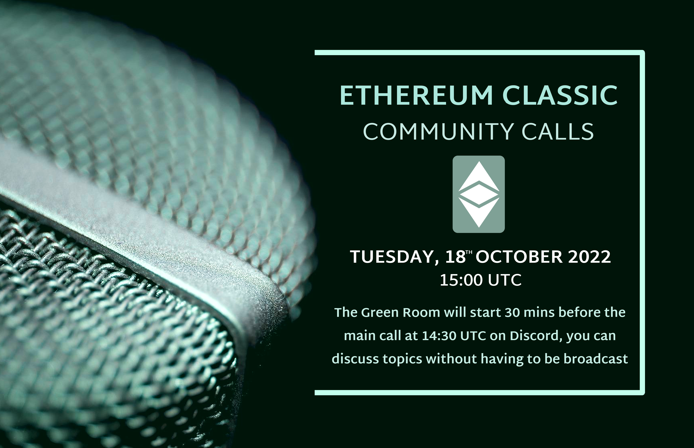
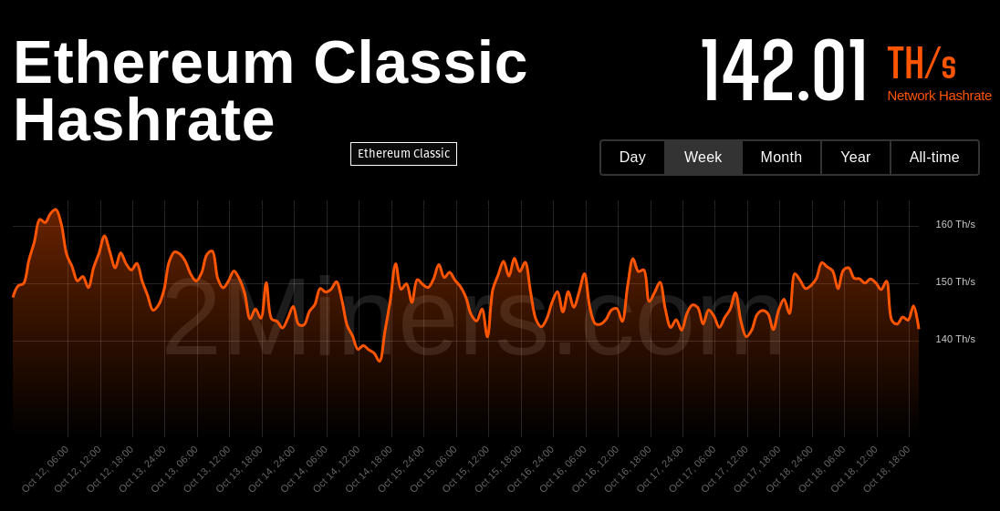
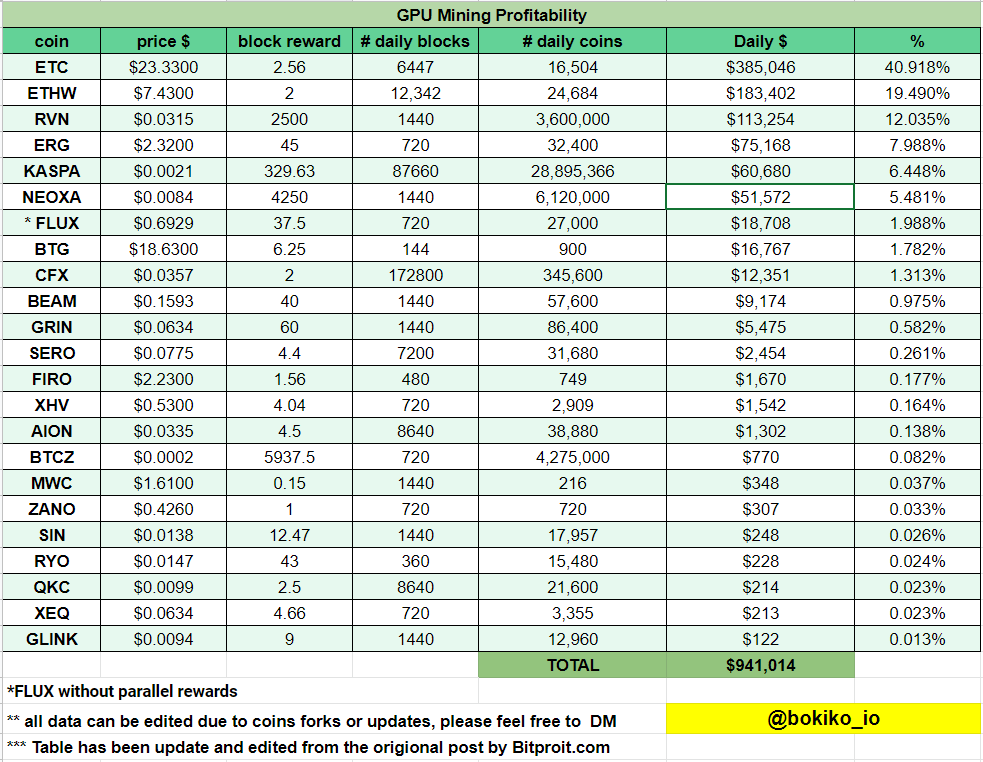

**Join the Green Room call 1 hour before we go live to chat offline**

A casual voice chat to discuss ideas for ETC. All are welcome.

The ETC Discord can be joined at https://ethereumclassic.org/discord

Please join the voice chat the #community-calls channel to ask questions or bring up topics.

This call is an open discussion so please feel free to jump in any time, but be reminded this is live streaming on YouTube, so if you are on the mic, please turn off sound notifications, and keep it family friendly. You can also post messages in Discord or YouTube, and we'll try to get to them via the chats.

You can find the agenda to this call in the description, which contains links to everything we talk about.

## Agenda: see below

## Gratitude

Brotherlal, d_a, w1g0, Discord Boosted (Call Quality Up)

Anyone want to say hello?

## Ecosystem Update

- Discord 
  - #off-topic is back!
  - Discord Boosted - what benefits?
  - Discord server logo and perks with LVL3
  - Invitation links; CoinMarketCap & Coingecko expired discord links updated
  - SUPER MEGA LOGO DRAMA

⚠️ DISCLAIMER

- Fusion by Nova Network, is our full-fledged DeFi protocol https://twitter.com/NovaFinOfficial/status/1582069861819482112
- Hebe's ETC Desktop Client supports NFTs https://twitter.com/EtcDesktop/status/1571940744008699904
- ETC Ladnverse, Become a land owner on the ETC Metaverse https://twitter.com/ETCLandverse/status/1577938822259785728
- Soteria launching a DAO protocol https://twitter.com/SoteriaSC/status/1580340004890763265
- ZeusPay ETC https://twitter.com/zeuspayetc/status/1580889735530434560
- Donald: ETC Monetary Policy Explained https://www.youtube.com/watch?v=66A0xQrL9WE
- Anyone else?

## Health Check



Ethereum Classic is sitting pretty and dominating 40% of the GPU market.



## Bob's Back!

- Devcon
  - Interesting topics?
  - No love for PoW or ETC?
  - Culture shift? NFTs people, still rooted?
- Ergo Hijack (Call planned?)
- East/West Divide https://bobsummerwill.com/2019/10/03/addressing-east-west-disconnect-in-etc/
- Grants

### Update on Grants

I think it would make sense to resume them after we have collaboratively come up some rough roadmap for next steps for ETC.

In various conversations I had at DEVCON this week and earlier, I have a pretty good idea of some things which could make the grade there.

For the Coop we always do budgeting and planning on year boundaries and I think we could maybe do that for ETC protocol too.

So work towards a shared roadmap for 2023 calendar year, coordinated with things which the Coop could do, together with things the community could do.

Also, fingers crossed, with grants active by then, so perhaps that overall roadmap could include identifying low-hanging fruit which would be good candidates for grant recipients?

## Twitter Together Update

- Updated TT Version
- Basical overview of where we are  
  - Two repos; `eth_classic` and `etc_network`   
  - `eth_classic` rules drafted, pending merge
  - Already tweeting regularly from `etc_network`
- #ETCtweets system
  - @SETH-MCCORMACK idea
  - `ETC_Network` rules to be determiend (e.g. retweeting, and giving credit, discuss)
  - No promotion of project other than listed on website
  - Spam, possibly limit to 1 per account per day
- New Volunteers
  - Need volunteers outside EU/US timezone
- Thanks to the recent twitter drama for stirring us into action

## EVM MEV 51%

https://twitter.com/koeppelmann/status/1580893089077809153#


- https://www.mevwatch.info/
- OFAC
- https://github.com/flashbots/mev-boost
- PoW vs PoS
- MEV is a thing on PoW
- Difference in economics of mining and game theory make it not an issue?
- Discuss

## Community Call Engagement

- Role Call? 
- What are working on?
- POAPs
- Help Wanted Section
- Updating https://github.com/ethereumclassic/volunteer

### Mastering ETC Book

https://twitter.com/EthClassicDAO/status/1580616622691143682

If you're looking for a simple way to contribute to #EthereumClassic. We are modifying the open source work of Mastering Ethereum (EVM tech, not ETH) to read accurately for the $ETC network. Join in and contribute to one of the few open and decentralized blockchains in #crypto 💚

### Remix Support

Mario https://etc-network.info/ added https://remix.etc-network.info, is looking for support in config and/or suggestions.

## Etcetera

- Nomenclature: Profitability, Profits, Block Rewards, etc.
- Web Updates, Automations, Auto-adding content, https://nvu.io/en/bots/discord-translator
- Bit Gold

## Bull or Bear, brother? 

Brolal's Market Analysis

## Free Talk

## Sign Off

See you next week, same time same place.

---

### From Coop Discord

The DFG times ran from Dec 2018 to Dec 2021.

DFG is Digital Finance Group, which is James Wo's company who created ETC Labs and were involved in the ETC ecosystem over that timespan, though the last year they were very inactive, only funding the Core Geth team, with no other people and no media presence (dead twitter, dead website).

They made numerous missteps, especially in their communication channels and especially in their Chinese language communication and "community" efforts.

- They stole the ethereumproject org in Github (one of them added as a admin and then he removed all the others and took over)
- They promised funding to ETCDEV and then pulled it at the last minute, leading to the death of ETCDEV
- And then rehired all the devs as ETC Labs Core, indeed everyone there except Igor and Donald  (both of whom would not comply to their wishes)
- They forked the ECIP process into ETC Labs Improvement Process, stating that they didn't care what "ethereumclassic" (ie the existing community) wanted and would set direction as they saw best and people could follow or not.
- They announced a hard fork to the Chinese community which had not gone through the ECIP process and was not consensus.
- They crapped all over Roy Zhou's existing ETC community and "made a new one", calling that "Official".
- They donated 250K to ETC Coop (before my time) and James Wo became a board member.
- Their "community guy" Christian Xu, who was paid by DFG, was declared to be the part of the ETC Coop (but he did not report to me and I was not giving him any direction).
- They used that ETC Cooperative connection as validation for their work.
- They had DFG-funded social media outlets, and especially Chinese-language outlets where they presented themselves as the voice and guardian of the protocol.   Controlling developers and media outlets and pushing self-serving messages.
- Example - pointing to their wallet as the "official ETC wallet", etc
.
Because of this history, many in the ETC community in the West are very wary of similar "mixed messages" happening in channels which they don't understand the language for, and especially in China, given the size of the country, number of people involved, size of ETC community there.   And, indeed, in Asia as a whole. 
.
I think the very best way of ensuring everyone is on the same page is Chinese translations for:

- ETC community website
- Mailing list for ETC Cooperative
- Twitter account? (maybe we can set up a parallel twitter together which tweets translations of all the eth_classic tweets?

We obviously cannot combine or translate Discord or other "chat forums", because the content is constant and coming from multiple people.   Translation tools might make this somewhat accessible, but really people need to speak English and Chinese to really be part of both communities.
.
With regards to the WeChat and Telegram channels managed by @南离777, I think we just need to ensure there is a clean separation between those lists and Hebe.    I know that is the case.   @南离777 has made that very clear with repeated explanations about his own and @zhang's history.   That @南离777 does not work for Hebe and so on.


---

## Full Transcript

```webvtt
WEBVTT

NOTE no-names

1
00:00:15.780 --> 00:00:18.470
Community call number 29.

2
00:00:15.780 --> 00:00:22.730
today is Tuesday the 18th of October 2022.

3
00:00:22.740 --> 00:00:42.830
we've been hanging out in the green room one hour before this call and from now on uh for one hour before the call at 1400 hours UTC you'll be able to join us every Tuesday in the Discord ethereum classic Discord server this chat happens every week on Tuesdays or

4
00:00:45.300 --> 00:01:06.830
you can join us at filmclassic.org Discord in the community calls Channel you'll be able to ask questions and bring up topics via voice chat this is an open discussion so please feel free to jump in at any time but be reminded this is live streaming on YouTube so if you're on the mic please turn off your sound notifications and keep

5
00:01:04.739 --> 00:01:25.070
your family friendly you can also post messages in Discord or YouTube and will try to get to them via the chats you'll be able to find the agenda to the call in the description which contains links to everything we talk about so this week we have quite a nice agenda we

6
00:01:21.860 --> 00:01:42.590
have ecosystem updates as usual uh health check for the network hopefully uh Bob sale will be joining us um he's back from Devcon in Colombia state of the Ethereal classic Twitter verse

7
00:01:39.540 --> 00:02:02.749
including updates to the Twitter together initiative we're going to discuss some interesting happenings uh on ethereum mainnet that does affect ethereum classic and it's to do with uh the Mev boost system which is currently reaching

8
00:01:59.460 --> 00:02:21.010
51 of blocks on ethereum mainnet being ofac compliant which includes censoring certain transactions I'm going to chat about Community call engagement and some potential things we could do there to help encourage people to

9
00:02:15.900 --> 00:02:36.170
get active in the community additional topics potentially if we have time including uh nomenclature about profitability and block rewards some updates about what we can do with automation uh

10
00:02:33.120 --> 00:02:53.690
and if if Donald has time maybe he can talk a bit about bit gold and then finally we will finish things off with the uh return of bro lau's market analysis at the end of the show to have a look at what's going on in the world

11
00:02:48.599 --> 00:03:09.650
of trading say thanks to uh the people behind the scenes uh helping with the the show so uh first and foremost brother Lau thanks for helping with the AV getting the live stream

12
00:03:06.660 --> 00:03:28.369
sorted to D underscore a for the uh the graphics and this week uh I've been helped a lot by Wego uh especially with regards to getting the Twitter stuff sorted so thanks to Wego and everyone else that's been participating in the community this week it's been quite a busy one before

13
00:03:25.560 --> 00:03:49.930
we jump into the main uh content of the show uh I wanted to open the floor if anyone knew in the chat wants

14
00:03:33.840 --> 00:03:55.850
to say hello feel free to do so update

15
00:03:59.220 --> 00:04:20.689
the off topic channel is back so if you're interested in some uh highly intellectual geopolitical discussion and uh mature commentary about the state of the world and you can drop in the hashtag off-topic Channel which I'm sure you'll find interesting this week the Discord uh Channel sorry the

16
00:04:18.600 --> 00:04:41.090
Discord server was boosted so there's been a few additional benefits I believe uh we have had a new server logo that is now animated and has returned to uh the previous logo there's a bit of drama there but that's sorted out and I believe the invitation links uh have been updated so we now have discord.gg

17
00:04:38.419 --> 00:05:01.189
invite slash ethereum classic so you can invite your friends via that vanity URL and I believe the call Quality has the potential to be upgraded now to uh like super high quality calls but it's not enabled for this call so maybe next week you'll

18
00:04:58.320 --> 00:05:18.650
be hearing our voices in uh more clarity week uh in the ecosystem world and just a quick disclaimer none of the following projects have been vetted they are all of course um

19
00:05:15.960 --> 00:05:36.409
potentially dodgy uh I've not used them but because they've been announced I'd like to potentially amplify some things happening in the ethereum classic space so please do your own research before uh investing anything in the blockchain space and always follow the first rule uh don't invest more than you can

20
00:05:33.419 --> 00:05:53.930
afford to lose so we have uh Fusion by Nova Network which is a fully fledged D5 protocol we have hebe's Etc desktop client now supports nfts uh Etc land verse which is a metaverse thing implementation on Etc

21
00:05:53.940 --> 00:06:14.930
zataria is launching a down protocol Zeus pay Etc and Donald had a new video out this week called Etc monetary policy policy explained so worth checking out promote any projects that they're looking

22
00:06:12.900 --> 00:06:34.189
at right now feel free Now's the Time hash rate is sitting pretty and dominating 40 of the GPU Market it hasn't really budged at all

23
00:06:32.759 --> 00:06:53.990
since last week and it's currently 142 Tera hashes that is 40 of the GPU mining profitability of all uh GPU mined blockchains coming close second is uh well not close second but uh coming in second is FW the the proof of work proof of

24
00:06:51.120 --> 00:07:12.110
work Fork of ethereum uh currently at 19 probably should be close to zero and we have Raven and then the project that will not be named sort of uh topic on this agenda is that uh Bob is back straight out of Colombia we

25
00:07:10.319 --> 00:07:38.089
have top pop from the co-op Bob Summerville thanks for joining us again listening

26
00:07:34.979 --> 00:07:56.629
mode at the moment but uh we will go on to the next Topic in the agenda and hopefully he'll be able to join us uh on voice chat to talk about his

27
00:07:44.099 --> 00:08:04.189
adventures in the in South America about the uh the the benefits of boosting

28
00:08:02.340 --> 00:08:22.969
on the Discord server did I miss anything there are we go small um I think you have more um

29
00:08:19.199 --> 00:08:40.730
data that you can transfer in the channels um you have the better sound quality and then the um you have a background for the for the invitation link and also a background

30
00:08:37.560 --> 00:09:00.470
in the left upper corner uh where the progression bar for the level so now we can monitor it uh well it was uh already available before um to track it but it was not activated so we decided to do that so everyone can monitor

31
00:08:57.300 --> 00:09:18.530
because when you go under a level three you have three days to uh renew um so to add boosts so that we do not lose the the vanity the URL link and all the other benefits that go

32
00:09:15.899 --> 00:09:41.870
with it um I think if we can combine our efforts we can maintain the the top level and uh uh there is some like tangible benefit uh to the community by uh keeping it up there and it's not it's not really uh too

33
00:09:34.620 --> 00:09:55.130
much of a bad deal the first topic on the agenda that is the the new Twitter together slash

34
00:09:50.640 --> 00:10:11.810
hashtag Etc tweets initiative that has kind of evolved in the last uh week end basically so to bring people up to speed we now have two repositories in the ethereum classic or GitHub one called Earth underscore classic

35
00:10:10.080 --> 00:10:31.970
and one called Etc under score Network they both represent Twitter accounts that are controlled by these repos and basically through the GitHub approval process tweets can be made via these to these accounts figuring out how things are going to work

36
00:10:29.580 --> 00:10:50.269
but we've already got some rules drafted for the main account which is going to be primarily for uh essentially okay just sort of serious updates and things that uh people need to know about Tim classic for example new clients um

37
00:10:48.420 --> 00:11:10.790
security updates uh interesting uh important events and if if you'd like to check out the rules then please do so at uh tweets Dash eth underscore Classic on the the GitHub and you can also give comments on the rules and potentially

38
00:11:07.500 --> 00:11:28.850
uh update them we also have the ETC underscore Network Twitter account which is going to be a lot less strict and posting all kinds of things like memes and potentially uh [Music] more edgy stuff basically I had in mind the

39
00:11:26.820 --> 00:11:46.970
idea of having Etc underscore Network being like the edgier alter ego of the main account and to keep a separation of shall we say keeping the main account dignified while the EDC Network account being a little bit

40
00:11:40.740 --> 00:12:00.769
more engagement focused rules are but one of the uh things that we're using to try and help do that is also another element to this called the hashtag Etc tweets system

41
00:12:00.779 --> 00:12:23.150
and basically any tweet that's made on Twitter that includes hashtag Etc tweets or one word will be copied into the Discord uh Etc tweets Channel and we will have a look at those and copy some good ones and ignore some bad ones and

42
00:12:20.459 --> 00:12:42.769
and make tweets based on community contributions so thanks to Seth McCormick for the idea of having some integration with Twitter itself because otherwise it's pretty difficult for people to easily engage with this system so

43
00:12:34.380 --> 00:12:57.410
uh yeah thanks for that idea predictable problems uh one being uh people abusing well not abusing but just because there's no rules yet people don't

44
00:12:54.360 --> 00:13:16.550
really know uh what kind of tweets are uh the kind of tweets that will be willing to accept I think we're going to try and avoid like uh shall we say Shameless promotion of projects um Network

45
00:13:12.779 --> 00:13:34.370
itself as opposed to uh any odd like new nft project for example and if we do link to projects they'll probably be via the website so the disclaimer's visible exactly the wall is going to look like but uh if

46
00:13:30.300 --> 00:13:52.610
anyone uh would like to comment on what kind of tweets you should be tweeting on both of these accounts then uh please jump in network

47
00:13:48.180 --> 00:14:09.170
would also publish charts trading charts I I would I would say that even the the main account if for example the price of Etc went up 10x in a day then

48
00:14:06.180 --> 00:14:30.430
that significant information that people would want to see so it really depends on the chart be difficult to have a hard set rule of what is considered interesting but uh we'll

49
00:14:25.079 --> 00:14:48.470
have to play it by you a classic from Earth um Network and the content I think I have a echo

50
00:14:44.040 --> 00:15:07.069
or something and um yes I on on ethnetwork if it's going to be more edgy uh put trading ideas and all that and price bumping information stuff like that because that that is very engaging also

51
00:15:02.779 --> 00:15:23.870
politics like uh it was like like against the Federal Reserve against regulation by the SEC against oh [&nbsp;__&nbsp;] and all that censoring that is happening in theorem all those things I would I would put on PTC

52
00:15:18.300 --> 00:15:38.689
Network engagement and um it would be uh I guess the the overall goal to try and get as uh eventually up to the same amount of followers in the

53
00:15:37.260 --> 00:15:58.069
future that we had before on both accounts ideally things right now um the F underscore network uh GitHub account requires one approval and at the moment mostly me and Wego

54
00:15:55.019 --> 00:16:19.910
have been uh sort of busy to testing this uh but we have a bunch of new volunteers that have signed up to help also approve tweets are the main uh eth underscore classic account uh that requires two approvals so tweets will be a little bit more strictly

55
00:16:13.440 --> 00:16:36.230
monitored there it becomes a problem um well first of all we will try and like specify some more clear guidance of of what tweets are likely to be approved uh in

56
00:16:33.360 --> 00:16:54.769
the GitHub repo for both uh Twitter accounts and then if they if the hashtag gets spammed too much then we will probably set some kind of limit so that only one uh tweet per day for example comes through into the Discord so that will kind of rations people

57
00:16:51.899 --> 00:17:12.530
of how many times they can submit tweets suggestion uh per account background

58
00:17:09.660 --> 00:17:29.750
is um um using some automation kind of like if then then ITT thing um which allows for almost Limitless levels of filtering and customization and hooking into different services so we can really get a lot of customization in

59
00:17:27.900 --> 00:17:48.830
terms of what comes in and how we fill this stuff can see everything happening on GitHub so if you'd like to join in and help decide what gets tweeted then uh please reach

60
00:17:45.600 --> 00:18:07.370
out and uh Post in the hashtag Twitter together Channel volunteers that are outside of the EU us time zone I think we have most of the world covered but it can be difficult to find

61
00:18:03.660 --> 00:18:25.250
enough uh approvers to get stuff done when most of the world is asleep or most of the western world is asleep instigators of the recent Twitter drama for stirring

62
00:18:22.380 --> 00:18:45.409
us into action on this and uh this is kind of the the nice thing about uh Etc as an ecosystem when when we get beat down we we punch back in some way in a non-violent way without

63
00:18:43.320 --> 00:19:03.789
your view button are you able to uh have a chat right now yes

64
00:18:58.220 --> 00:19:23.870
yeah you hear me yeah at all for these voice calls um but my phone seems to be so hello hello thanks for joining us and welcome back from Columbia yeah

65
00:19:19.860 --> 00:19:41.870
my first time there beautiful city I was uh is it the kogoga a pronunciation yeah um Bogota

66
00:19:37.320 --> 00:19:59.510
Bogota that's it okay how how is Bogota as a as a venue for a conference I was kind of surprised at the choice but uh it seems like yeah yeah I know I mean it worked out great you know there were various people ahead of time saying you know it was a lot of crime you know you've got watching out to yourself don't

67
00:19:56.580 --> 00:20:16.789
don't travel on your own you know don't have don't have flashy clothes or anything to draw attention to yourself um but uh yeah I mean I only heard one story of somebody trying to get my phone snatched and it failed dropped on the floor um

68
00:20:16.799 --> 00:20:38.630
but yeah you know beautiful city um settled with high mountains around it one of them with a sort of a monastery place you can go up to the top on a funicular Railway and have a look down lots of um around

69
00:20:38.640 --> 00:21:03.770
um you know very very colorful um and and yeah the venue was great you know very very modern Conference Center over over five or six floors um there were about 7 000 people I heard who were there so biggest one yet um uh

70
00:20:58.440 --> 00:21:19.789
you know lots of content of all kinds um the specifically also sort of Latin American local content as well you know themes of of how how crypto can help um

71
00:21:17.100 --> 00:21:39.470
up that whole area um but yeah yeah it was fun A lot of fun and I got to meet Isaac I got to meet Isaac and Chris and Diego all at the same time we've never been never all been in the same place um and I'd never met um Chris in person either and

72
00:21:36.900 --> 00:21:58.370
no bus incidents luckily no no we didn't all die so that was good did you notice the uh on the whole for the the conference did the I think given your past experience at other

73
00:21:56.640 --> 00:22:17.570
conferences have you noticed a shift in the the culture of the the ethereum mainnet world I guess um with all that's happened it's the first one since covert and A lot's happened since the last one so uh is is there a significant change in tone well uh not so much I mean I guess um

74
00:22:20.100 --> 00:22:43.070
so long I'm sure that you know there were a very large number of people who it was the first time that they've had ever been to one um you know many people you know new to use the blockchain and crypto we're entirely over that spam um you um

75
00:22:45.299 --> 00:23:07.130
them were you know fans and users rather than doers or people necessarily you know working full-time um or heavily involved um the other thing that you always have at Defcon over other conferences is it's a

76
00:23:04.620 --> 00:23:29.690
very well it's a developer conference right so it a lot of the talks were technical talks in some form you do have um cue the sort of more overviewy um and

77
00:23:27.600 --> 00:23:49.490
not deeply technical but there were many many sessions you know which are um really kind of uh you know digging in deep to particular technical details like for example there were a whole load of of zero knowledge uh sessions um

78
00:23:46.380 --> 00:24:07.010
and talking about um CK DVM or um or ck roll-ups or you know some some deeper um zero knowledge um

79
00:24:04.200 --> 00:24:25.310
technical stuff um so yeah I mean what I'd say is anyone who is interested all of the videos are up on uh on YouTube now I think every single room had got recording in it so

80
00:24:22.440 --> 00:24:42.590
I think all of the sessions should be there and that is likely um I don't know two three hundred of them maybe you know tons and tons of content usually fairly short um the

81
00:24:40.200 --> 00:25:00.830
longest talks I think were about 25 minutes um do a summer short of seven where they had uh you know a whole bunch of them in a row bang bang bang um do a longer workshops as well on some topics that could be you know an hour two

82
00:24:58.740 --> 00:25:20.570
hours um even two and a half um not sure if all of those were recorded maybe not um some of those were off on in in kind of side rooms um different themes [Music] um not

83
00:25:18.659 --> 00:25:39.110
a lot of love for proof of work there that's for sure um yeah lots of uh through smoothly um and then discussions about um about next steps um

84
00:25:39.120 --> 00:26:00.230
so to my knowledge that the priority for the next uh ethereum hard Fork is the introduction of the withdrawal contract everyone who states on F2 at the moment their money's just stuck in there there's no means of getting it back out so withdrawal contract is going to be added

85
00:25:56.640 --> 00:26:17.930
though right here that would be um rate limited so not everyone can rush out at the same kind of time um um are the most interesting um

86
00:26:14.640 --> 00:26:38.690
in terms of proposed changes um and which I really want to see if we can help at the co-op to help these things happen quicker you know get get engaging involved or um all of the changes around the evm um so specifically there is a proposal called

87
00:26:33.900 --> 00:26:57.830
eof which is evm object format um so it's kind of like a um a wrapping almost like a file format around evm um binaries so that you can have a well

88
00:26:53.100 --> 00:27:13.370
a versioned wrapper really where um where this wrapper is is identifying um an evm versioning and then also within that eof format that you can have clean

89
00:27:09.299 --> 00:27:29.750
separation of code and data and then that is also the mechanism that that lets you um start making changes and improvements to the evm without breaking that backwards compatibility so

90
00:27:25.460 --> 00:27:45.710
notably looking to do functions or subroutines as a first class um first class thing for at the moment the uh in the evm you've got really kind of awkward pushing things onto the stack jumping

91
00:27:43.440 --> 00:28:06.169
and then coming back so it's kind of simulated um a feature that you know has been present in all CPUs and virtual machines for 50 years it's just missing a very basic part the other one is is static jumps rather than Dynamic jumps um

92
00:28:03.059 --> 00:28:25.070
so static meaning that you know you're just going to have a jump relative to where you are by with with an offset um all of the jumps at the moment in the evm like with subroutines are Dynamic pushing things onto the stack um

93
00:28:22.620 --> 00:28:44.210
doing not code and coming back so those two changes together um what those result in is um byte code which you can do really good static analysis on before running um you know making sure that you can't jump

94
00:28:40.559 --> 00:29:04.549
off to Crazy places or um also that that can really help the optimizer so one of the examples that Greg Colvin had uh the same code ended up being something like a third of the size um

95
00:29:00.240 --> 00:29:24.110
and much much clearer um when you're looking at to understand what it's doing so yeah those those evm changes I think are really really great changes um which um which really uh mean that you're evm

96
00:29:20.039 --> 00:29:41.570
stuff can be a lot smaller um it can be faster it uses less gas um and it's more [Music] um easier for for analysis and sort of Security checks so I mean those are all really great things that make a lot on

97
00:29:39.600 --> 00:30:00.590
the ECC side ethereum um we've also been looking at the uh at the Aragon client um Aragon was previously called turbogath um and basically does some very major um

98
00:29:58.260 --> 00:30:22.010
changes in its internal data structures so there's no protocol change it's just you know a Next Generation client which is taking advantage of everything that we've learned over over eight years to do something which is again better

99
00:30:16.440 --> 00:30:38.510
uh smaller faster and so on um there's another category of change um plan for ethereum which also makes a lot of sense for us I think which is vertical trees so vertical trees um

100
00:30:36.059 --> 00:30:59.870
would be a replacement for the existing Patricia Merkel trees that we have um the problem that there is with Patricia Patricia Merkle trees is that as state Growers um you end up getting very very sort of Random Access all over them um

101
00:30:55.740 --> 00:31:17.510
and that is slow you know like random access into data structures means you know you can't have any kind of useful caching um if they are structures which end up being within databases

102
00:31:15.480 --> 00:31:36.649
on disk and you're accessing them again you know you're jumping all over the place lots and lots of touches um so vertical trees I can't really adequately explain them here but I can't really adequately explain them anyway I need to read a lot more but essentially what you would have with a switch to Vertical

103
00:31:35.340 --> 00:31:56.810
trees is something which would be a little bit like Aragon you know analogous it's not the same thing but it's a thing that's analogous to Aragon in in saying well hey if we use a completely different way of of representing these it's going to have significantly better um

104
00:31:53.940 --> 00:32:14.510
performance characteristics and space usage and and so on um so again you know it's it's the experience of of eight years worth of of work where uh ethereum started out you know really as a a

105
00:32:11.940 --> 00:32:32.750
sort of a bit of a a bit of a science project on live um and we've learned a lot on the way the complication that you have with vertical trees though is how that transition is going to happen because you couldn't have both of them in a client at the same time you

106
00:32:30.000 --> 00:32:52.490
effectively need to have some transition point where the current state is sort of like snapshotted and this new data structure with the same stuff um would be rebuilt and then the client is

107
00:32:49.200 --> 00:33:10.490
is using the new stuff um but building because of the state of the existing um the existing state is so huge the process of generating that new data structure is something that could take you know six hours or something stupid so

108
00:33:10.500 --> 00:33:31.730
you know do you like sort of pause the network to do this uh do you have you know particular clients are like doing this locally and and each themselves getting stuck like you know the network is is still kind of moving but

109
00:33:29.159 --> 00:33:51.049
but when you hit this horror block you know you have a a huge switch over do you do that do you have this stuff kind of like done offline and you're like downloading it everyone's downloading it so that you're basically you know you get to that point and

110
00:33:48.960 --> 00:34:09.950
you you've almost like reset the client um that's a little bit unclear um but the benefits are huge if we can do it um so yeah those were those were some interesting protocol thoughts um you know lots of stuff about about privacy

111
00:34:07.019 --> 00:34:29.210
thoughts on privacy lots and lots of of l2s um getting real serious traffic now um and because those l2s are not necessarily tied to be entirely compatible with mainnet people are experimenting

112
00:34:26.940 --> 00:34:47.389
a bit uh with different you know different evm variants there are even I think some some l2s that don't even use the evm at all they're doing something completely different um Dark Net seems to be coming on well that's

113
00:34:43.740 --> 00:35:05.329
another ZK based one um I even saw there was one thing about an L3 so L3 is starting to arrive there [Music] um but yeah anyway that's enough of a talk for me for now update

114
00:35:03.000 --> 00:35:24.410
uh it sounds like a lot well almost a almost all of the content that uh is is not about the chain itself anything that's evm compatible is is doable on Etc as well so it's awesome that uh a lot of innovation is actually happening on ethereum

115
00:35:21.720 --> 00:35:43.430
classic even if indirectly yeah yeah um and I think the thing that's that's really great with that the breadth of different l2s there are on ethereum is that there's lots of well-funded teams there trying

116
00:35:39.119 --> 00:36:00.829
this stuff out you know and um and and learning you know so some of this some of these new pieces you know it takes a long time to get them right so you've got you know you've got lots of teams that are really exploring all of this

117
00:35:57.960 --> 00:36:19.609
space and seeing what works and what doesn't work and you know the stuff that doesn't work is going to drop away but as you say you know all of the all of the patterns that work out really well you know they're out there they're all going to be directly applicable to Etc um and you know we're certainly not in the

118
00:36:17.040 --> 00:36:38.770
position yet where we really need any l2s you know we've got plenty of space left um on on Etc um but then yeah when we when we do come to need l2s you know they're they're already very mature so so that's great um you

119
00:36:36.300 --> 00:36:47.210
know we did at the co-op funder connects instance so that was an L2 State Channel I think that was back in 2019 or early 2020.

120
00:36:47.220 --> 00:37:08.569
um but you know it didn't really get any use um but showed that you know we can we can certainly host uh any of this any of this stuff um the other thing that was really valuable there I think was um it's just the personal connections you know that's something I always love at

121
00:37:05.880 --> 00:37:27.829
the the conferences is having an opportunity to meet people who you know you've only interacted with over Twitter or over email um and a really key thing that happened was I was able to get into that uh to connect the core devs with the actual guest team so

122
00:37:24.060 --> 00:37:46.430
uh historically there was you know some real tension there um because of what had happened with classic Gaff you know that at the time of the fork um Igor had intentionally forked classic gath away from fork and not uh you

123
00:37:43.560 --> 00:38:06.230
know had not kept contact was not you know taking taking changes from the guest team as they happened um indeed it was very much you know like [&nbsp;__&nbsp;] you get a team [&nbsp;__&nbsp;] you ethereum Foundation we don't need you you know we're gonna go and do our own thing um

124
00:38:02.640 --> 00:38:25.609
which I think was very short-sighted because the guests team were very very competent um and you know they have done huge amounts of ongoing work for optimization and improvements um Through The Years you know that that decision or that direction was changed by

125
00:38:21.540 --> 00:38:43.430
way with multigath um and then by Labs with with corega um so you know that that is staying very close to Geth now but we haven't really really had the human connections to be able to make that you know a real productive

126
00:38:41.160 --> 00:39:02.109
collaboration um but yeah you know we made those in in Bogota and um and Kristen Isaac uh you know spending time with people on the gas team and working out for example Chris has done a whole load of work adding parity

127
00:38:59.099 --> 00:39:22.130
style tracing um to call Geth which was never in the get Upstream um but then now has met the guy working on tracing within the guest team and you know the two of those collection collaborate and make sure that you know the changes and improvements that we've done can hopefully get back into Upstream

128
00:39:19.020 --> 00:39:39.589
gather at areas like you know these dbm improvements or or vertical trees or anything you know we're in a position where we can really try to help accelerate some of these things happening you know if the guest team themselves are busy well that's okay you know

129
00:39:37.980 --> 00:40:00.349
we can um we can we can do some of that work and also because we do the get uh the basic developments as well we're in the position where you know we can do cross-client testing you know we can do two implementations we can do a test net we could we can work on the spec you know

130
00:39:57.839 --> 00:40:19.609
so any of these improvements you know we're not we're not necessarily having to be in a sort of a secondary position um you know we can really step up and uh and help Drive some of these things I don't know that we would want to go ahead

131
00:40:15.780 --> 00:40:36.230
of ethereum necessarily on some of these features um the reason being if we went first and then ethereum are kind of looking at what we've what we've done but then decide yeah you know that's not quite right we could you know we could improve that

132
00:40:34.440 --> 00:40:56.810
a little bit um and then come out with an incompatible version of the same feature then you we're obviously in a bad place if that happens so we're probably not going to lead but we can you know we can we can we can lead in terms

133
00:40:54.420 --> 00:41:15.829
of the development it's just we don't necessarily want to deploy first um because I guess that leaves you in a position a bit like what happened with Keck 256 right where ethereum started using it before it was quite um Blaster shot three and then you end up

134
00:41:13.619 --> 00:41:35.930
with using you know a slightly incompatible or different version of a standard which you know which which sucks um but yeah great to go get those connections also we were able to link up with the uh Dimitri volkov who um

135
00:41:33.000 --> 00:41:54.530
works on the cross-client tests so github.com ethereum tests um so those tests are are used for cross-client testing for ethereum and we've been using them on Etc as well for for several years um so Isaac was very pleased to meet him so I was like thanks we've been using your

136
00:41:52.079 --> 00:42:14.329
tests for years and years and uh get to get to meet you um but but yeah the guys um specifically wanted to do a better kind of set of those for the UTC specific things but it wasn't exactly clear how to configure that or how to use them um but yeah Christ

137
00:42:12.020 --> 00:42:33.770
Diego and Isaac got to sit down with Dimitri for a good good hour or so I think and really batter through all of that so that was great um uh another team I I got to meet there uh was dap node I don't know if you guys know what that node is so dap know yeah please

138
00:42:31.380 --> 00:42:52.250
yeah so it's it's running your own node right so it's a uh it's an Intel Nook kind of like Mini PC uh so you know kind of like a Raspberry Pi but but but more more of performance um so with that node you basically get like

139
00:42:50.339 --> 00:43:12.890
a you know a standalone run your node at home in a you know node in the Box basically um and on that they so you know they they will install they've got an image there with uh with all of the clients that in there I think um

140
00:43:10.319 --> 00:43:26.569
and it is intended to be you know plug in and go pretty much you know you just whatever configuring Wi-Fi and setting up your wallet and what have you anyway uh dap node had had Etc supports in 2019.

141
00:43:23.160 --> 00:43:44.270
it was funny I remember at the time it was around the time of the ETC Summit uh and they just did it you know it had not had any kind of conversation or anything they just tweeted out one day hey you need to see support on on dap node um in the meantime that sort of withered away

142
00:43:42.359 --> 00:44:02.390
for whatever reason I think essentially because at that time it was just myself and Yaz at the co-op um and climate development had was done elsewhere so we weren't really in a position to be able to like release and bundle and do whatever they needed for their

143
00:44:00.119 --> 00:44:23.569
Integrations all of that has changed in the meantime though they now have [Music] um kind of almost like Auto releases that they have some automation that is looking at the release uh the release folders of the clients that they support and when a new release comes out this automated

144
00:44:20.099 --> 00:44:40.190
process will uh essentially make a Docker image that gets uploaded to ipfs and it will generate also a um I believe this is not a smart contract which

145
00:44:36.900 --> 00:44:59.750
points to the the latest image to use so I believe it it will generate you a pull request that would update to the new one and what you're doing as a development team is essentially testing against that new image and then when it's good to go you

146
00:44:56.700 --> 00:45:16.970
like flipping the switch um so it may be a pull request it may be a raw transaction I'm not exactly sure anyway stop speaking to them and we're going to have we're gonna have first class C2C support in that soon um

147
00:45:14.880 --> 00:45:35.390
so that would mean they would they would be basically taking that on we would just be doing the testing so as the represent with core gas releases um when those have happened um there would just be a further phase of testing that we need to do which is testing

148
00:45:35.400 --> 00:45:55.490
you know on that on that note Hardware um um against that generated Docker image so that's what we'll be doing soon um so yeah you'll be able to do

149
00:45:51.780 --> 00:46:11.930
that uh Plug and Play note at home for ECC and we might even try and do some special editions with them you know their business really is that they're you know they're selling that Hardware which you know which is just available you can just go and buy and then tell Nook

150
00:46:11.940 --> 00:46:33.410
um where it doesn't have to be a Nook even it's just an x86 you can you can run their images on your own machine as well you know there's no magic Source in any of this uh it's just convenience of of buying the bundle off them and then yeah they do sometimes do these special editions

151
00:46:29.700 --> 00:46:51.349
where they will um you know yes I need to see you on with you know with the logo on it and green Imaging and um and probably like pre-configured so that running that particular client or platform

152
00:46:48.420 --> 00:47:10.309
is is like the default um so yeah that was that was a great conversation looking forward to that I'd love to get my hands on one of those yeah it's uh it's awesome to hear all this um uh I guess Community Building going on between the two projects because

153
00:47:08.040 --> 00:47:29.990
yeah on a tech level I mean we are the same project really and it's just kind of heartwarming too to see that despite philosophical differences uh people can still you know join forces yeah and I mean I think the other thing that's been really positive

154
00:47:25.800 --> 00:47:48.470
for us in that aspect is um because the way that proof of State transition ended up happening in the end um where the beacon chain was launched run for 18 months and then you have this sort of switch over where what's now called

155
00:47:45.240 --> 00:48:07.370
execution clients but previously ethereum one clients um you know just that at that certain point that they end up you know talking to a beacon chain for their consensus um so it didn't look like that was going to be the

156
00:48:04.619 --> 00:48:24.950
flow early on you know when when the beacon change chain was launched that was that was like phase zero of of the transition so it's like right phase zero is you've got this proof of proof of stake chain running you know it's not doing anything other than coming to consensus

157
00:48:22.560 --> 00:48:42.710
itself but you know let's check test that consensus and that that you know the comms are working and everything and as if people are doing wrong attestations that they can get slashed and so on so that was like described as phase zero phase one was adding

158
00:48:40.380 --> 00:49:00.670
sharding into that but the shards would only be data you know there would be no execution on them they're just carrying data and then phase two was the addition of execution onto those shards um with the talk at the time being well maybe

159
00:48:58.020 --> 00:49:20.270
you you know you have execution environments plural uh so you know those chains those particular shards sorry they might be evm or they might be ewasm you know there was years worth of work on on trying to do an ethereum variant of

160
00:49:16.020 --> 00:49:37.069
of wasm that you see in all compile in all browsers now um so that was sort of the original plan with no real Clarity on what the migration path would be for existing apps other than like maybe Shard zero has

161
00:49:35.099 --> 00:49:56.690
got an evm on it and is basically just like a copy or continuation of the existing chain so that was sort of the original thought sort of thought on that and then on the ECC side it's like well you know what the hell does that mean for us you know is does Geth end you know what that transition

162
00:49:54.359 --> 00:50:15.650
point it's like yep get is finished um you know you've got these new clients for ethereum too and that's where things are happening you know and if that had been the case then yeah like it's on us to fully maintain all of these clients you know with with the ethereum ecosystem not contributing

163
00:50:13.020 --> 00:50:35.450
any to any of the effort to it so if that had happened that would have been you know that would have been really really hard you know um doing development on clients that are mainly there already is you know it's orders are magnitude easier than having the

164
00:50:32.400 --> 00:50:53.770
whole responsibility of of both maintaining what you have but also you know defining future roadmap um but yeah with the split in the way that worship the worst did happen which was essentially that the the beacon chain launched and then at this transition point

165
00:50:50.280 --> 00:51:10.809
you just have the existing clients rather than having the proof of work embedded within that monolithic executable instead they are you know they've got API where they're where they're reaching out to the beacon train to have that so I mean what that means

166
00:51:07.859 --> 00:51:31.010
on the guest side for example is just a fairly tiny bit of code basically saying you know if we're if we're past that that transition point then do this I'll do pow um so that means that that yeah you have very

167
00:51:27.119 --> 00:51:48.829
little difference uh between uh and if there were only clients and an ECC client um on and on Bazoo that's truly the case in that the work that we're doing is directly in the Upstream you know there isn't an Etc Fork

168
00:51:45.480 --> 00:52:05.750
of bezu Basu just supports ethereum and ethereum classic and various other you know the for example proof of authority scenarios for test Nets or other consensus for for Enterprise scenarios so

169
00:52:02.760 --> 00:52:24.230
so yeah that's all good because it means even though you've got you know this this proof and state proof of work difference and then other things coming in later the code is still the same you know you can have a client that supports all of these scenarios so you know we're not off in the wilderland you know in the

170
00:52:22.260 --> 00:52:44.210
wilderness doing something really quite different um we're very technically aligned with uh the exceptions of uh of of you know obviously either Dow fork and not having difficulty bomb and still doing Mining and uh I'm

171
00:52:41.400 --> 00:53:03.890
a fixed monetary policy but you know the vast majority of the code is is is very common um so yeah we can we can very easily collaborate technically even given the differences in the chains yeah that's a super important

172
00:53:01.160 --> 00:53:21.170
and I guess uh something that uh I overlooked uh in terms of how the the four the forecast sorry the merge actually unfolded and it's gonna mean a it really brings like some long-term uh potential to ethereum Classic because there's way less work involved in long-term

173
00:53:19.200 --> 00:53:39.410
maintenance in that case and as you mentioned earlier uh we can let ethereum main net set the standard and just uh sort of follow behind uh with as little effort as possible for as long as possible yeah yeah um and and

174
00:53:37.140 --> 00:53:57.170
yeah and I think you know that we're in a a good position where um you know the developers doing that work relationship you know that doesn't have to

175
00:53:54.599 --> 00:54:15.770
be at all adversarial um we can you know we can collaborate um very cleanly there and as I was saying you know not not necessarily just following um you know that we can that we can help drive those things which are not you

176
00:54:13.380 --> 00:54:34.490
know and not within that ethereum it's back yet um you know we can we can help move things forward faster than they would perhaps uh without that assistance gone down to South America and brought back

177
00:54:32.520 --> 00:54:53.990
a treasure Trove of really good news for ethereum classic and uh yeah this is uh tons of awesome initiatives that might be coming down the pipeline soon I noticed that you you also made the a comment on Discord about um looking at the next steps for ETC uh related

178
00:54:51.059 --> 00:55:12.970
to the the grants um program with ant uh is it ant Miner uh that they invested yeah and Paul sorry um and and you have some pretty good ideas of what might make the grade in terms of uh

179
00:55:08.460 --> 00:55:29.270
next steps on the roadmap now but uh um yeah I mean not specifically but um yeah I mean my thought there really is that you know people have repeatedly asked well hey you know what's the roadmap for ECC

180
00:55:27.180 --> 00:55:47.809
you know what's happening what what's you know what's new what's exciting um and often you know we haven't really had a good answer you know it's like well yeah you know maybe we're looking at this maybe we're looking at that but you know there hasn't really been you

181
00:55:44.099 --> 00:56:06.230
know a consensus view on yes we are looking to do X Y and Z you know so lots of more centralized chains have obviously got a very clear road map uh you know because they are determining exactly the direction and doing the work and and you know and it's just sort of a single

182
00:56:04.079 --> 00:56:24.650
body doing all of that obviously we don't have that on on ECC but but yeah I mean I think you know coming out of of that conference and then other things that we've had happen over the last few months and so on really made me think well for the co-op all of our planning and budget

183
00:56:22.500 --> 00:56:44.990
and everything is done on on year boundaries so you know we've got you know retrospective of the previous year future facing road map budgeting planning all that and it just made me think well you know maybe we can do that for the whole of Etc

184
00:56:41.760 --> 00:57:05.329
together this year as well you know collaboratively that we can you know that we can look across these prospective ideas you know and some of them are protocol work for the client devs um but others are you know stuff like like

185
00:57:01.260 --> 00:57:21.349
with the Twitter and the website um um the Discord um or or application Blair you know what what sort of things would be would we like to see um you know on on that dap layer um

186
00:57:21.359 --> 00:57:42.530
so I I just thought well you know maybe what we can do is is get to sort of like a rough collaborative agreed sort of planned roadmap for the next year so that heading into 2023 you know we we can have some clear kind of like you

187
00:57:39.900 --> 00:58:01.250
know this is what we would hope to see over call you know key one Q two two two three and four I mean obviously you know it's not like hey this is definitely gonna happen but I think what I'd like to think that we can probably get to you know

188
00:57:58.079 --> 00:58:18.710
a list of priorities that that that we all kind of agree would be would be good things to to shoot and aim for and and yeah where that comes into the the grants program is like you know I really am hopeful that we can get the grants program started this calendar year

189
00:58:18.720 --> 00:58:40.849
so then potentially we can have that tied in right to that roadmap of saying well hey you know this is the sort of things that we would like to see happen and hey here's the grants program so if anybody any groups would like to take on any of these tasks you know these are things

190
00:58:37.980 --> 00:59:00.589
which would be you know very well received within a grants program um so yeah I'd like to think we can do that and that that would be a real kind of productive and feel good thing for everyone in the community of seeing well hey

191
00:58:57.839 --> 00:59:19.329
you know there is some you know we we've got a plan we've got a direction um as opposed to previous years and it's like well hey you know there's there's some eips to you know maybe we can do this maybe we can do that but you know many

192
00:59:15.299 --> 00:59:37.130
of those turned into divisive non-productive conversations um but I think we can have quite a different flavor for 2023 if we uh if we'd really try and I think at least a part of that is looking at these you

193
00:59:34.680 --> 00:59:55.549
know things like evm improvements and and vertical trees and Aragon none of that is very controversial you know they're all pretty much Direct performance upgrades um and I think having come through the

194
00:59:53.099 --> 01:00:16.490
merge and being in a position where we've now got this large majority hash within our um you know within the hardware class and probably quite Asic dominated you know I think we can say well we're probably not going to do anything on

195
01:00:12.480 --> 01:00:33.589
that mining algo side so it's really more down to um sustainability things you know if we if if we're cool on where we are on the mining and the proof of work

196
01:00:33.599 --> 01:00:54.049
um and if we're not looking to do L1 scaling which I don't think we are um you know we do all twos then it's really just down to that performance um you know being able to cope with with the state that the size it is you know which has been referred to as as bloat um

197
01:00:54.059 --> 01:01:16.010
so I don't know that there's much we can do about the growth necessarily but we can we can be in a better position for the for the software to be able to to deal with the the state that we do have um yeah I think there's probably some countermeasures that can still happen against

198
01:01:12.780 --> 01:01:35.630
gas token or things which are blatantly bloating but if generally we're in a position of saying well look you know each of these kind of as a protocol you know it's kind of nearly done we're really just just looking at those sustainability things you know I think that's

199
01:01:31.920 --> 01:01:53.990
a great place to be in terms of cohesion and direction for for the community you know saying well we've got these a few you know hard and big but but not very changing the essence of it very much or changing things for the users and

200
01:01:51.119 --> 01:02:11.870
then we're focusing up the stack you know if we've got this grants program and then we're we're more focusing on um you know on infrastructure on Gap building blocks you know for example well hey you know repeatedly people have said

201
01:02:10.559 --> 01:02:30.829
you know we could do with a native stable coin we could do with lending protocols uh you know liquidity pools uh Market making uh you know marketplaces for the nfts

202
01:02:27.500 --> 01:02:47.809
vexes you know all of the richness that you see within ethereum or other you know very well-funded L1 ecosystems you know if we can be moving past that that protocol level and

203
01:02:44.160 --> 01:03:06.890
really looking at those uh you know constructing things which are useful for users you know that we can that we can bring people in because we've got actually useful projects happening um you know I think that'd be awesome project

204
01:03:05.040 --> 01:03:26.809
as a whole is has kind of been crawling through the murder of drama and various attacks 51 attacks social attacks and stuff and now we've come out at the end of that uh trench and now like there's nothing really um that's gonna go bad it seems and yeah it'd

205
01:03:24.900 --> 01:03:47.510
be really nice to see uh an initiative as you mentioned potentially outside the ecip process where uh I mean I was thinking maybe just have like a big list of everything that could be done on Etc and anyone can contribute to it and just narrow it down to the things that yeah this seems like a no-brainer and

206
01:03:43.740 --> 01:04:04.010
uh yeah having something that collaboratively everyone can work on together would be a real United for the community and like a morale booster after all this craziness that's gone on and take advantage of the really good position that we're in right now so yeah I hope to see that that uh coming

207
01:04:02.520 --> 01:04:23.329
soon yeah and I mean I think I think you know an effective grants program can be a real easy way to break the chicken in an egg situation you know of saying well um you know to get more users you've got to have more useful dapps but

208
01:04:21.420 --> 01:04:44.030
people don't want to build the daps if you haven't got enough users because it isn't worth their effort so you know I think I think the the grants can help build up some of those basic uh you know basic requirements that that make it both easy to build things because you know you've

209
01:04:40.319 --> 01:05:03.049
got this this ready-made uh basis um but also just that that having you know having some more on that side itself does draw in users even if you know those aren't like you know profit making things you know they're just public goods really um but

210
01:05:00.299 --> 01:05:27.289
that you know that I think can can start pulling in enough users that you that you're getting closer to the place where um you know that developers can say well hey yeah you know we should because you know because there's users who'll use the stuff and you know we can get

211
01:05:20.099 --> 01:05:44.030
fees and make some make some money out as planned it'll be like a domino effect a Snowball Effect once uh you get some stable coins you get some dexes and everything's just going to come flowing in so yeah

212
01:05:39.900 --> 01:06:02.329
uh are you okay for time Bob uh not not great I'm gonna be around another 10 minutes maybe okay in that in that case I wanted to uh just let anyone else uh in in the chat uh if you had any questions you can jump in now so um

213
01:05:56.280 --> 01:06:17.569
I'm not dominating the whole thing ask a question to Bob uh about how the uh since that the transition is made like the merge to pause um

214
01:06:14.880 --> 01:06:38.750
how there are some people who were working on the proof of work uh algorithm if they are interesting uh interested in contributing to the ETC ecosystem uh what's the general statement there which

215
01:06:34.859 --> 01:06:56.569
people sorry on the proof of work algorithm on ethereum uh well nobody's been working on that it was done like eight years ago and hasn't really changed

216
01:07:07.619 --> 01:07:29.510
uh go go to that last uh bit of drama and I know you mentioned you tweeted about this about potentially having a call with the the Ergo people did that happen and did you have any Reflections on that whole drama as we haven't

217
01:07:24.660 --> 01:07:46.250
heard uh you talk about it conversations with uh armyanio who is one of the um one of the Ergo Foundation directors um so yeah I had quite a long conversation

218
01:07:44.640 --> 01:08:05.750
with him over a couple of days on on Discord um where that sat was he was hoping actually himself to have a call with Charles this weekend just gone I'm not sure if that happened yet I haven't spoken to him since uh

219
01:08:01.500 --> 01:08:24.050
we were aiming to set up a call with myself in a broader set of Virgo Foundation people this week um maybe uh maybe next week now where we're kind of uh well no it's only Tuesday maybe not um

220
01:08:20.759 --> 01:08:41.510
I mean I think I think the difficulty there is is that you know they've been put in this situation by Charles as well right you know they didn't they didn't ask for this uh I don't think they were really fully aware of the situation with it when

221
01:08:38.759 --> 01:08:59.930
it was given to them you know um so uh he himself for example tweeted well you know what a great friend Charles is is is to have and you know he built this up himself and then has given it to us and you know what a gift kind of thing um you know often are obviously like in retrospect

222
01:08:59.940 --> 01:09:20.209
uh maybe maybe not feeling so clever about that tweet um but yeah you know they've they've had some you know some conflict within their own Community about this you know with people saying well hey you know I thought

223
01:09:18.120 --> 01:09:39.590
we were really special and different and ethical and why are we why are we taking this um from ergo side I think I think it's it's exceedingly unlikely that they would give it to us essentially because it was Charles who gave it to them you know I think if they were

224
01:09:37.560 --> 01:09:59.209
doing anything and and saying well you know this was not a good gift it would be to give it back to him you know I think that's their their most rational move um obviously doesn't put us in any better place but I I'm you know it it would get them out of the of their mess and I think it would

225
01:09:56.820 --> 01:10:19.130
be a Russian woman rational thing to do um the the other thing in all of this is um is is terms of service um you know I think there's been a clear breach of terms of service in what was happened here I've been trying to reach out to Twitter the problem is the only means

226
01:10:16.739 --> 01:10:37.850
that you have of any of this stuff with Twitter is their forms you know the forms that you can open up um same sort of thing as you know if you were just making a report of a you know of a cloned account or what have you so there's just these forms that you fill in and you may or may not ever hear back from

227
01:10:36.360 --> 01:10:57.890
them even let alone get the resolution needed uh that you'd like so I I haven't been able to get anything back for them so I think what I'm going to need to do there is actually like write a physical letter and post it to to Twitter um so that's what I'll be doing um probably

228
01:10:55.440 --> 01:11:15.830
with the assistance of lawyers so it would be you know a lawyer's letter to Twitter uh basically highlighting the history and what's happened um in terms of maybe outcomes for that let's

229
01:11:13.040 --> 01:11:33.530
see I guess the three possibilities first one would be um that you know it is given back to us I think that's very unlikely from Twitter though really because um

230
01:11:31.560 --> 01:11:52.689
usually if you have that kind of like reassignment it would be because there is a very clear you know legal entity with a trademark uh you know that blatantly is the entity that that should control that account that

231
01:11:49.500 --> 01:12:13.189
we don't have that on Etc you know uh nothing is official on ECC right you know so no particular party has any more or less claim to any ECC based account than anyone else um a second possibility though on that possibly

232
01:12:09.239 --> 01:12:29.570
just maybe would be that the ethereum foundation have the trademark on ethereum you know so it's maybe not too much of a push to say well hey you know this account should sit with the ethereum foundation because they they

233
01:12:27.780 --> 01:12:49.070
do have the trademark uh and then maybe they could give it back to us I think you know that's there's a very vague possibility that that would be a kind of a possible path but I think the thing that's most likely is terms of service violation yes we agree so the account is shut down and

234
01:12:47.280 --> 01:13:07.910
that would certainly be better than the current reality of it you know basically being in Rogue hands uh but you know I mean the the outcome really in in all of these bar that very vague possibility that it would come back to us uh either through the ethereum foundation

235
01:13:04.739 --> 01:13:26.750
or or somehow some magic happening within Ergo and Charles that that's somehow you know turns into a resolution but I think the most likely thing is just that you know it's it's going to get shut down and lost but at least it's you know it's not in the enemy hands uh and you know and we have to

236
01:13:24.480 --> 01:13:46.070
rebuild I mean with all of these scenarios you know we have to rebuild you know that's the most important thing and I think that with Twitter together in the same way as we already have the cips and for the website you know that GitHub flow I think is you know is is is a really good um

237
01:13:43.320 --> 01:14:04.250
place where anyone can contribute you know yes you've got sort of The Gatekeepers in terms of the reviews but but you know nobody is on a in a higher or better position than anyone else you know it is a uh a democracy um and

238
01:14:00.780 --> 01:14:21.890
from the co-op side you know I'm I'm very happy with that as well that we're we're sort of in a position where we can contribute in using those same flows and if we can you know produce good and good quality content then you know well a fair bit of it

239
01:14:19.380 --> 01:14:41.510
will go through but you know we're not in any privileged position so I think that's really good um just also to talk on something else there was was that I had budget this year for um Communications Community marketing kind of uh persons who

240
01:14:39.360 --> 01:14:59.990
have placed cabin um I uh commissioned a report on sorts of that you know the situation that we have at the moment and within uh Etc as a whole uh to to basically ask a you know

241
01:14:55.679 --> 01:15:16.729
a a a comms focused Group which is mmh group um uh who are people who've been involved in crypto for a long time I know Emma Todd who's the CEO there very well anyway they they they've recently done this report and the follow-up that I'm just

242
01:15:14.940 --> 01:15:36.410
in the middle of executing on now are that we uh have got now or very soon we'll have next few days a a part-time um Communications and marketing manager uh and also a social media person um

243
01:15:34.199 --> 01:15:56.209
also Donald should be doing some writing for us so um very soon we will have you know a comps and marketing and Community team at the co-op who you know we can obviously do things through our own channels we'll be doing a a revamp of our

244
01:15:52.500 --> 01:16:15.229
own website uh and rethamphet what we're doing with hours for sort of accounts and mailing lists and so on um but also uh we'll be in a position to you know to have boots on the ground to you know actively participate and assist

245
01:16:11.880 --> 01:16:33.430
on that website side on the Twitter side you know YouTube videos tutorials any of that sort of stuff uh um I don't know the other thing I want to do there is translations you know I think we need Chinese everything basically

246
01:16:28.980 --> 01:16:49.250
so I want to see if we can essentially have a have a translator sort of old retainer who who can help with translations of the website um maybe help with you know these Chinese language

247
01:16:47.040 --> 01:17:09.229
channels like like the telegram and the WeChat uh but also you know Chinese mailing list um you know any of that sort of stuff so all of that should be coming fairly soon which I think is all pretty exciting as well yeah

248
01:17:05.520 --> 01:17:26.810
very very cool and uh more good news I'm really glad that you've uh you've been able to update us with with this uh wonderful information just uh just a point on the um the potential scenarios of the Twitter account um it would be a shame if the account got deleted purely for the fact that all of

249
01:17:24.540 --> 01:17:44.870
the the Twitter history and the the law of Etc is lost in the process so hopefully there's some archives available that we can still point to if needed to yeah yeah I mean I'm not sure you know I thought that somebody was mentioning the possibility

250
01:17:42.420 --> 01:18:02.930
of of something which would kind of like replay all of those onto onto another account uh you know I'm not sure what there is but I would hope that there's something that can be done for that certainly um but you know yeah

251
01:18:01.140 --> 01:18:22.910
I mean essentially the whole thing is very damaging with your time Bob and uh I'm away you said 10 minutes more than 10 minutes ago so uh unless there's anything you wanted to uh finish on um we

252
01:18:19.380 --> 01:18:41.450
will let you go and big things no worries uh so yeah or or be listening in for a little bit but uh probably can't reply so cheers everyone all

253
01:18:32.100 --> 01:18:53.870
right thanks Bob take care um I still have time to continue if anyone wanted to add anything to that discussion or Reflections on all

254
01:18:51.840 --> 01:19:12.590
of that awesome news um feel free to jump in uh YouTube and there's a question from Tom saying hello Etc last week's call someone mentioned the need for moderators

255
01:19:10.260 --> 01:19:31.970
reviewing Community tweets discussion Etc on Twitter is ETC still looking for assistance uh well the ETC itself there is nothing official but uh the community Discord server and the one of the GitHub accounts ethereum classic GitHub account yes

256
01:19:29.460 --> 01:19:49.550
indeed is looking for assistance in in helping with moderation of tweets and stuff especially if you're in the Asia or non-us EU time zones so let me be clear if you're in the non-us OR non-eu time zones and are a or you're

257
01:19:47.640 --> 01:20:11.090
a night owl and you can help with round-the-clock tweeting moderation then we could definitely use your help and you can reach out to us in the Twitter Twitter Dash together ethereum classic Discord server Channel if you'd like to uh to help volunteer there

258
01:20:12.659 --> 01:20:35.209
questions from the chats that we might consider changing the uh uh the software used for these calls so we'll look into that and maybe use a different uh platform

259
01:20:32.159 --> 01:20:52.850
but uh well we will see how things go on that front we will end the the chat with the opportunity for anyone in the voice chat to say anything they want the floor's open

260
01:20:49.800 --> 01:21:10.430
uh I'll leave a few seconds jump in now the call it's been a very uh well

261
01:21:07.320 --> 01:21:28.189
full of extremely uplifting information and uh thanks especially to Bob but of course all the other contributors have helped make this call happen and we will see you at the same time next week Etc Discord and if you'd like to join us offline one hour earlier you

262
01:21:24.780 --> 01:21:38.270
can join us at 1400 hours UTC and we go live at 1500 hours UTC so see you next Tuesday till then take care Stay classy bye
```
