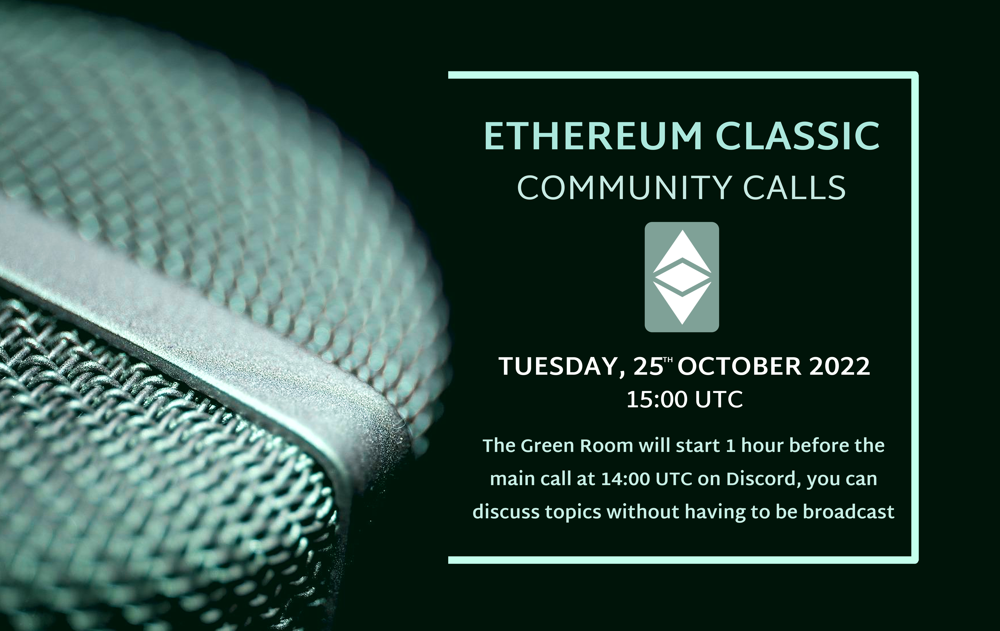
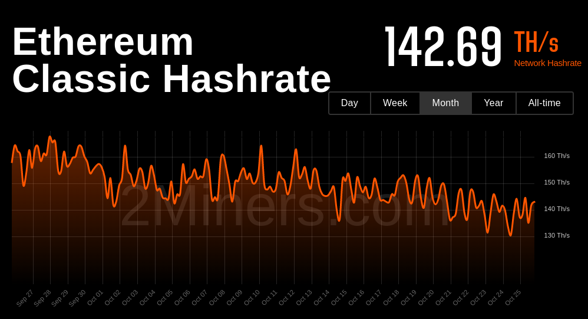
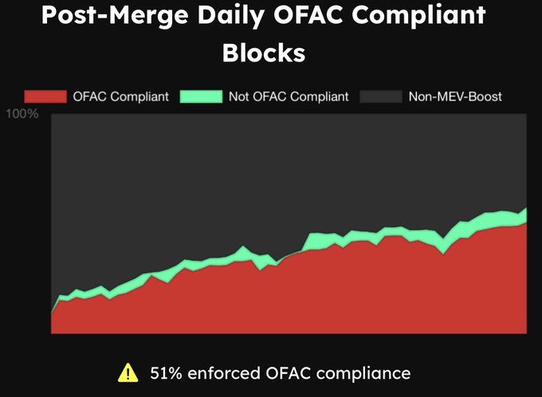

**Join the Green Room call 1 hour before we go live to chat offline**

A casual voice chat to discuss ideas for ETC. All are welcome.

The ETC Discord can be joined at https://ethereumclassic.org/discord

Please join the voice chat the #community-calls channel to ask questions or bring up topics.

This call is an open discussion so please feel free to jump in any time, but be reminded this is live streaming on YouTube, so if you are on the mic, please turn off sound notifications, and keep it family friendly. You can also post messages in Discord or YouTube, and we'll try to get to them via the chats.

You can find the agenda to this call in the description, which contains links to everything we talk about.

## Agenda: see below

## Gratitude

Brotherlal, d_a

Anyone want to say hello?

## Ecosystem Update

- FAQs section

⚠️ DISCLAIMER

- etcbillboard https://twitter.com/BlockHebe/status/1583065414187515905#m
- Shiba Classic
- https://blog.emerald.cash/emerald-blockchain-course-19-what-are-programmable-native-cryptocurrencies/
- Anyone else, chameleon, etc-network.info?

## Health Check



## Headlines

- Twitter suspended, temporarily
- https://crypto.news/cardano-founder-speaks-on-ethereum-classic-etc-twitter-account-ban/
- https://capitalcryptoacademy.com/ethereum-classic-surges-6-amid-cardano-founders-mockery-assessing/

## EVM MEV 51%

https://twitter.com/koeppelmann/status/1580893089077809153#



- https://www.mevwatch.info/
- OFAC
- https://github.com/flashbots/mev-boost
- PoW vs PoS
- MEV is a thing on PoW
- Difference in economics of mining and game theory make it not an issue?
- Will ETH fork?
- Discuss

## Community Call Engagement

- THE LIST; https://github.com/ethereumclassic/volunteer
- Role Call? 
- What are working on?
- POAPs
- Help Wanted Section

https://github.com/ethereumclassic/community-calls/issues/21

What we observe in Community Calls is that there's not really an incentive to participate.
People join the Calls but there's no retention.

Why could this be?

Recordings: People will listen to the recording afterwards. This is good to inform but harms engagement.
Program: There's too little room for speech, moderators talk too much. It lacks interactivity.
Privacy: The calls aren't encrypted and people dox themselves when they use their voice.
Language: This goes along with the recording of the event but I believe many aren't comfortable to speak in public, often in a foreign language.
For these points the evolution of the [Green Room] is a great initiative, let's improve on that with this thread.

What are your obstacles to participate and how do you see the solution or do you have a solution to someone else's obstacle?

### Mastering ETC Book

https://twitter.com/EthClassicDAO/status/1580616622691143682

If you're looking for a simple way to contribute to #EthereumClassic. We are modifying the open source work of Mastering Ethereum (EVM tech, not ETH) to read accurately for the $ETC network. Join in and contribute to one of the few open and decentralized blockchains in #crypto 💚

### Remix Support

Mario https://etc-network.info/ added https://remix.etc-network.info, is looking for support in config and/or suggestions.

## Etcetera

- Nomenclature: Profitability, Profits, Block Rewards, etc.
- Web Updates, Automations, Auto-adding content, https://nvu.io/en/bots/discord-translator
- Auto add Youtube, weekly top tweets
- Bit Gold

## Bull or Bear, brother? 

Brolal's Market Analysis

## Free Talk

## Sign Off

See you next week, same time same place.

---

## Full Transcript

```webvtt
WEBVTT

NOTE no-names

1
00:00:13.380 --> 00:00:15.829
Community call number 30.

2
00:00:13.380 --> 00:00:18.529
today is the 25th of October 2022.

3
00:00:18.539 --> 00:00:39.229
we've just been chatting in The Green Room on Discord uh for about an hour before this call uh having lots of off the Record good ideas um and joined by some familiar faces from the past so uh it's good to see everyone uh engaging so as normal we have a casual voice chat to discuss ideas for ETC and everyone is welcome

4
00:00:39.239 --> 00:01:00.290
you can join us in the ETC Discord at ethereum classic.org Discord and you'll find us in the community calls Channel where you can ask questions or bring up topics this is an open discussion so please feel free to jump in at any time but be reminded we are live streaming on YouTube so if you're on the mic please turn off sound notifications and keep it family friendly you

5
00:00:58.320 --> 00:01:23.870
can also post messages in Discord or on YouTube and we'll try to get to those chat messages if we have time you can find the agenda to this call in the description which will contain links to everything we talk about hear

6
00:01:18.180 --> 00:01:38.810
me can I get a mic check here all right thanks brother so this week we have an agenda that covers uh some ecosystem updates health check of the network uh the main headline of this week to do with the Twitter

7
00:01:36.960 --> 00:01:59.210
Fiasco ongoing and we're going to talk about the Mev uh 51 problem on ethereum which does affect ethereum classic to some extent engage community and uh maybe bring in some of the topics we're talking about in

8
00:01:54.960 --> 00:02:20.270
The Green Room say thank you to brother lau and the underscore a for helping with the audio and Graphics respectively and just before we get into the call if there's anyone new in the chat uh and wants to say hello please jump in now and

9
00:02:12.959 --> 00:02:33.170
say hi uh we have a fairly large update to the website um there's a new FAQ section uh which is where

10
00:02:31.500 --> 00:02:54.050
most people will be directed to now which makes finding content on the website a lot easier for various different users uh miners investors developers Etc so uh if you wanted to check that out you can find it on ethereumclassic.org and if you have any suggestions for questions that you think should be in there then just let us know in

11
00:02:50.519 --> 00:03:10.910
Discord the ethernet classic ecosystem first of all these apps have not been audited and I have not tested them myself so please do your own research before trying out any of these apps but there is a an announcement

12
00:03:08.760 --> 00:03:30.589
from [&nbsp;__&nbsp;] about a project called EDC billboard which looks like uh that old uh one million pixels um sort of application where you can purchase small plots of land to paste in images and advertise stuff looks pretty interesting and nice to see uh innovation

13
00:03:27.599 --> 00:03:51.410
in that regard new cool ideas happening on ethereum classic uh the website has listed Sheba classic which is I believe a meme coin and there is a new uh article out from emerald.cash about uh programmable native cryptocurrencies so be sure to check

14
00:03:47.580 --> 00:04:08.509
that out at blog.emerald.cash the uh Etc Network dot info service would you like to uh talk about that Mario [Music] maybe

15
00:04:03.599 --> 00:04:27.050
also share if it's okay okay go go ahead perfect right what's

16
00:04:25.380 --> 00:04:47.870
an update um so under uh dashboard uh firstly the corrected spelling of that thank you for mentioning uh Bob uh if you go inside this uh you get the yeah already maybe familiar dashboard and

17
00:04:44.060 --> 00:05:04.790
if we change that just to seven days on the top you can do that maybe you have haven't noticed it yet on the top you can just choose any time range um you can also do updating of the sites which is automatically set to five seconds to provide the latest information of the block and every other step

18
00:05:04.800 --> 00:05:26.330
and you can also select your custom time frame by just clicking or um on the on the left Mouse button and dragging it so you can select the custom let's say space or room or range where you want to um check out some some stats and what I recently

19
00:05:23.880 --> 00:05:48.290
added is for example in the past seven days um you see this blue let's say dotted or yeah dotted lines if you go on the on the bottom you see um I upgraded the Nuremberg piso node to the latest uh 22

20
00:05:42.800 --> 00:06:04.749
7.7 version so it's actually just that you know what's happening on the Node because that you don't think that something happened on the APC chain or some drastic changes are made so if you for example let's say let's plant this view maybe to the last 30 days for example

21
00:06:02.699 --> 00:06:23.510
if you see this if you see for example this one and you don't think there's there's nothing happening that's that's all right maybe you need to change on the top The Source I have two different notes one is running in Germany and one is running in Austria Vienna um

22
00:06:21.300 --> 00:06:43.969
yeah if you switch to that node you will notice there's there's something off with the blocks there is no increasing block count and if you go inside here you see my node was down at this point of this time so you can really see what happened and there is nothing wrong with the PTC chain there was just some local issues at my side sorry

23
00:06:40.800 --> 00:07:01.249
for that that will not be fixed I do not have stats for that collected somewhere um and it's just actually about information that you can gather without contacting me what happened there or what what's wrong um

24
00:06:59.460 --> 00:07:22.309
you can also see for example if you go a bit further back um you can see for example two lines the first one yes so there is a new server I bought a new server for this Matrix dashboard and also I added

25
00:07:17.720 --> 00:07:39.830
the merge block of ethereum and for example if you want to go more in detail into this you can even see it's like after the merge the block how many blocks were added to the blockchain on the ATC chain was significantly significant oh my God sorry

26
00:07:36.180 --> 00:07:58.490
significantly increase increasing over the over the time you can also see the reduction in the or the the more blocks or average blocks per minute oh why do we have instead uh this set twice to know let's remove it anyways

27
00:07:55.620 --> 00:08:17.770
yeah and also added some new visual uh I'm sorry visual representations or for example the block time you can see even here that some blocks were taking longer than the expected 15 seconds we can expand that by dragging it and you can see

28
00:08:14.580 --> 00:08:36.050
it took like 33 seconds to complete maybe it has to do something with this um yeah lots of peers I guess it was because of that or reappearing so it started to reconnect um I don't think there's any much more to add don't want to steal any more time um

29
00:08:34.080 --> 00:08:58.250
if you have any um experiences working with Docker or just want to help me deploy some stats or some applications to provide on this site feel free um let's go just shortly back which is the main side so if you go to BTC

30
00:08:53.760 --> 00:09:14.990
minus Network dot info that will be the front side I didn't save as a matter that will be the front side from there you can navigate all through all these different things also I implemented the remix IDE so

31
00:09:10.760 --> 00:09:32.030
you can check that also out let's keep it quite quick because I have no experience working into that there are some developer which has some more knowledge into that but definitely check it out see if it works for you see if it like if

32
00:09:28.380 --> 00:09:49.910
you like it and yes if you have some requests or some notes to add just let me know and yes I think that's all for today if you have any questions let me know I'll look in into the chat and looking forward for some

33
00:09:45.480 --> 00:10:07.910
inputs from yourself thank you there with the remix and uh good to see some explanations of those uh uh historical events in particular it was cool to see the the increase

34
00:10:04.560 --> 00:10:26.210
in blocks uh after the merge yeah it's very very interesting and I'm looking forward to add more such notes or historic events um just started this sadly I did not write them down somewhere or edited somewhere so I can just look it up on the dashboard and try to figure out what happened

35
00:10:23.760 --> 00:10:44.090
there I will now start to really put in the the things if something happens or something changes or something looks odd that I will add a note that something happened or something is changing or whatever and you will get a hint on what happened

36
00:10:39.120 --> 00:10:59.750
or what's what's what's wrong live about potentially hooking uh some of these metrics into the Discord server and getting some live updates in in one of the channels there so uh it'll be cool

37
00:10:56.940 --> 00:11:17.269
to see that in a in a near future hopefully yes we are we were talking about an RSS RSS feed um I'm looking forward to do that um let's see and yeah I'm open for every discussion every week I try to be sooner

38
00:11:15.660 --> 00:11:37.490
here um I think you didn't mention that that we can also Join one hour or half an hour upon this meeting so that people can discuss freely without recording and broadcasting it live that's a nice addition to what we have here

39
00:11:33.779 --> 00:11:58.550
on the ATC Community setup and I really like this and yeah just write me or chat with me via voice before that if you didn't if you don't want to be recorded and broadcasted or just writing npm just contact me on on telegram if you want it also

40
00:11:52.800 --> 00:12:14.210
on this side just want to say thank you for the contribution uh to the network this is something that I had been uh I mean I I opened PR's probably back in 2019 about how

41
00:12:12.540 --> 00:12:33.290
important it is to have visualization in the data and uh so it's just beautiful to see so thank you so much for doing this um I absolutely love this website you're welcome thank you thank you for the great messages and I I also

42
00:12:30.660 --> 00:12:58.850
added the uh the link to Etc Network dot info into the Q A's so hopefully you might get uh some traffic from there thank you thank you any

43
00:12:52.980 --> 00:13:15.230
further questions there update uh Ronin did you want to uh talk briefly about a new project that you were looking at uh sure so um so so

44
00:13:12.000 --> 00:13:34.670
for ETC swap uh what we're doing is if you're participating uh in that protocol uh just on-chain data um will record whatever you're doing and uh all we're doing is we're doing an airdrop for a project called chameleon you can go and look into it at chameleon.pro

45
00:13:31.880 --> 00:13:54.710
uh the token will be called eco eco um and uh all all I want to really talk about with that is there's the URL you can go start looking at it um and then uh and we just want to make sure that people are rewarded for starting to use the

46
00:13:51.720 --> 00:14:12.769
D5 protocol stack on ethereum classic so the whole and the whole goal there is just if you're an early person that's starting to add a little liquidity starting to interact with D5 protocols on ethereum classic uh just know that um your activity is recorded on the blockchain

47
00:14:10.740 --> 00:14:32.150
and that you're going to get an airdrop token for that project and so really that's all all I need to say about it you know it's uh the Project's been in the work for a while it's essentially creating uh infrastructure defy infrastructure on top of ethereum classic um

48
00:14:29.880 --> 00:14:50.269
but we're we're pretty far away from that as we're just getting through the merge we're just starting to gain users hatch rate all this stuff there's a order of operations that kind of has to go on um so but so all I want to message is that there will be an airdrop for those addresses

49
00:14:46.620 --> 00:15:10.550
so I encourage you to add a minimum just start interacting with protocols get yourself familiar with whatever wallet addresses you have um and uh and expect that token will be airdropped to you so in the future so that's really again the URL is chameleon.pro

50
00:15:12.420 --> 00:15:34.550
link into the agenda for anyone that's interested in looking at that wrapping up uh was there anyone that wanted to add any other projects that they are interested in on Etc before we move

51
00:15:29.880 --> 00:15:51.889
on working on a decentralized stable coin on Etc or is that just starting in the in the works or what anything going on with that uh I know it's been a topic we've talked about um

52
00:15:48.300 --> 00:16:09.230
passively but is anything is anything on the radar regarding that a few calls ago but no I don't think anyone's actively working on it but okay I

53
00:16:05.579 --> 00:16:27.350
think okay so Riot was the uh was the one that we were landing on okay great yeah I mean I think right given the the latest news regarding maker and die uh I believe that now it's largely either owned by coinbase or coinbase uh USD

54
00:16:24.240 --> 00:16:47.449
or whatever their stable coin is is now the majority uh collateral for die so it's no longer really decentralized so a more simple and less capturable system like Rye I think would fit into ethereum Classics ethos a lot better yeah

55
00:16:44.040 --> 00:17:06.049
my my uh bird's eye view on that is that room uh is the same roon roon Christian Center or something like that the the creator of uh the dot the maker Dao project was saying hey we're centrally captured due to the underlying collateral that we're holding that supports

56
00:17:03.360 --> 00:17:23.750
die and so his thought is that he's talking about going to just eat as their underlying collateral and so um I think anyone knows what the volatility that that's going to be pretty risky um so uh it's

57
00:17:20.280 --> 00:17:41.870
my understanding that with Rye they had they had created some sort of solution with that and so um so anyway so that's like the the high level of what was going on with that so that's exciting um I think that's something that we as a network need to think about uh I was involved

58
00:17:39.360 --> 00:18:00.169
in bridging over these stable coins but as we're seeing with censorship becoming an issue which is a topic we're gonna lead into here in a little bit um I think that we really need to uh have the discussion and prioritize a native state of stablecoin that is censorship

59
00:17:58.140 --> 00:18:19.130
resistant um stable points are foundational to the G5 stack and uh and preserving uh liquidity on chain and so um without make forcing people to uh run to different ramps to uh to run to a stablecoin so um so anyway so I think that that's a conversation

60
00:18:17.520 --> 00:18:39.710
that we need to have top of mind um as uh we develop a defy stack and dapps and all of that and and a robust token ecosystem that has stable coins on it um because Bridge stable coins have risks and then now we're seeing that the underlying asset that is being bridged is

61
00:18:37.320 --> 00:18:58.789
centrally captured and we're seeing censorship start to creep in in a um in a very bad way and I think we all knew the risks were there we just didn't realize that it was going to happen uh this fast and in this way stable

62
00:18:56.520 --> 00:19:17.810
coins one of the prerequisites for that uh at least for a lot of them would be to have some kind of price feed and I think getting some kind of Oracle system such as uh chain link would be a real winner for a free TC even because it's more fundamental than having a stable

63
00:19:16.380 --> 00:19:37.730
coin even because it's a requirement and it would also open the door to lots of other potential interesting applications so if anyone's listening to this call it would be great uh to try and reach out to Oracle services that would be willing to post their data feeds onto Etc because that would allow a lot more uh apps to be developed

64
00:19:35.160 --> 00:19:56.150
on top of that yeah and regarding uh price oracles I think one of the best things about ethereum classic is that it has so many markets across the world it's uh integrated in virtually every single uh exchange so we're not suffering like other projects might where um

65
00:19:54.059 --> 00:20:14.510
they only have one or two markets and it's easy to manipulate in that regard um so uh I think we're really good there in turn it's really just plugging in the pipes on the data feeds so hopefully you know chain link are some of these bigger uh price Oracle uh projects uh support ethereum

66
00:20:12.000 --> 00:20:34.490
classic also um with Etc Swap and any sort of uniswap uh clone there are on chain price oracles if you have stable coin markets but our stable coin markets are very very young and very easy to manipulate so please do not uh rely on those but just

67
00:20:31.380 --> 00:20:51.529
uh trying to emphasize that um there will be decentralized markets that also have uh that contribute into that um that price Oracle feed which is great because that means that people that are trying to avoid uh the censorship of centralized

68
00:20:49.140 --> 00:21:11.210
price feeds also are participating in that price feed uh system the price Oracle system via the decentralized markets the more price feeds the better because then you can combine them in such a way that is very difficult to manipulate like

69
00:21:08.580 --> 00:21:28.669
it's unlikely that both chain link and some third party that has no uh you know incentive to manipulate its own data would collaborate four uh USD stablecoin markets and so it you

70
00:21:26.880 --> 00:21:48.470
know it essentially averages those out and if there's like an outlier that gets uh manipulated you know it's like it leans on the other ones so uh that's just kind of what you'd uh you're gonna swap V2 has built into it um and so I I'm not familiar with chain link and how they view that in terms of uh

71
00:21:43.980 --> 00:22:05.630
per you know removing outliers as possible broken RSS feeds or or whatever it is um or Market manipulation uh but I'm sure you know chain link has been working on it for a while a long time so hopefully them or uh if anyone knows any other

72
00:22:03.120 --> 00:22:25.250
projects that are in that space uh I'm not too familiar with the uh price Oracle uh ecosystem Nick's dominance of the Oracle world as far as branding um there's a really good opportunity for a

73
00:22:21.900 --> 00:22:44.690
an upstart or Underdog Oracle service to deploy on Etc and get some level of uh distinction and unique selling point by being the first on Etc been

74
00:22:42.360 --> 00:23:04.370
dominated by once again the Twitter ongoing Fiasco and uh just for research for this um for this call I was just checking Twitter for ethereum classic and basically everything is about the Twitter account of underscore classic getting suspended temporarily uh subsequently

75
00:23:02.340 --> 00:23:23.270
being mocked by Charles hoskinson and then becoming unbanned again so I don't know whether we want to dwell on this or talk about it too much but if anyone has any uh thoughts on the ongoing Fiasco and the recent development in it then uh please feel free

76
00:23:18.900 --> 00:23:39.409
but uh yeah it's a predictable um that it was going to get restored and it was just a complete nothing Burger basically but it seems like the the whole uh crypto Twitter went a bit crazy over it attack

77
00:23:37.799 --> 00:23:59.210
that's happening right now right what they're trying to do is at the merge uh it's how do we get the spotlight off of Etc and onto our shitcoin project and so that's what you're seeing happening and so it's you know it's kind of playing out to their advantage right now of oh great now they're populated in all

78
00:23:56.880 --> 00:24:18.649
ethereum feeds on Twitter because the algorithm doesn't adjust that quickly um and now they're getting news Cycles out of us you know it's it's their leeches on ethereum classic and uh it's unfortunate um but you know it appears that they're a very desperate chain you know they've uh

79
00:24:15.780 --> 00:24:36.350
they're really comfortable uh right in on Charles's coattails and doing unethical things like they've done um and then and now they're trying to you know steal any sort of news cycle and get any sort of eyes on their projects um you know and so really it just reeks of desperation so you know that'll fizzle

80
00:24:35.280 --> 00:24:56.270
out um you know it's very short-term gains they really lost long-term credibility on their project I don't know much about them or anything like that but uh it's unfortunate um and ethereum classic as Donald has always has said is not a Twitter account it's not a social asset it's a network it's

81
00:24:53.159 --> 00:25:19.549
extremely resilient you know this is a small little thing for ethereum classic and it's you know it's the Hail Mary play for that [&nbsp;__&nbsp;] coin Network that um hijacked the Twitter account in my opinion is

82
00:25:14.220 --> 00:25:38.570
can can we get a a summary of what charts has done for it to see like he really did something or is just an idea that he supported because from what I've seen there

83
00:25:33.360 --> 00:25:54.230
isn't anything working understanding that the cardano wallet um starts with a d i can't I don't even know the name of it um but the work that he did on mantis was

84
00:25:51.140 --> 00:26:13.850
foundational to the cardano wallet so that's really where he gets his um his quote of we've spent you know x amount of dollars on a client that client was never adopted an Etc it had no users I don't even know if it ever was live and functional but that's where that

85
00:26:10.140 --> 00:26:30.950
technology went so his argument is um you know fairly shallow and um you know it's it's just an attention grab it's just look you know pump my [&nbsp;__&nbsp;] going right and and that's just what he's doing so that's just the way it is um and and we just keep it moving I

86
00:26:29.880 --> 00:26:53.690
think seriously now uh he he made uh he made some some calls with uh Sebastian a few years ago which okay were great and maybe he invested some money in that but

87
00:26:49.279 --> 00:27:10.850
other than that I haven't seen text text speaking anything that the I don't know works like a wallet like a website like the Twitter Handler for example it wasn't

88
00:27:08.159 --> 00:27:28.450
really maintained for uh the potential that Etc has it was Monday maintained by a volunteer uh I think it was Kevin so I don't think why why the [&nbsp;__&nbsp;] he's fussing about right

89
00:27:28.460 --> 00:27:49.490
he's acting like he lost money on EDC and now he's taking Revenge if it doesn't stop this sort of attacks and just moves on and take cares of his [&nbsp;__&nbsp;] coin because

90
00:27:46.320 --> 00:28:07.070
that's the logo uh I don't know I think we should take some sort of action against him and I don't know sue him this has to stop like we are not attacking cardano we are not

91
00:28:04.260 --> 00:28:24.710
attacking whatever he's doing he's just coming in and uh made some proposals that weren't accepted just deal with it move on that's life uh

92
00:28:18.980 --> 00:28:39.409
now he's taking uh Etc Handler and not only that he doesn't give it back to the community even though it was given to him for free to maintain it and to make it easy better

93
00:28:39.419 --> 00:29:02.990
not only he doesn't he didn't do that but now he's transferring that account to another platform so that's like I don't know I I don't want to say like bad words or anything but this this uh Stupid fight needs to stop

94
00:28:58.679 --> 00:29:20.210
and uh it is a need to go its way and charts can go in his way you know we've we've seen this uh I always like to just look at Bitcoin because it's so similar to Etc and how it gets attacked and um

95
00:29:17.940 --> 00:29:38.029
and and it holds value and that's why people attack it right and so if you look at Bitcoin I mean you've saw this with the New York agreement segwit 2x mini Forks off of it uh you've seen um uh Roger Burr uh you've seen Craig Wright you know you've seen all these attacks

96
00:29:35.820 --> 00:29:58.669
on that Network and the network keeps it moving right and I think um you know I think that that's something that we'll need to learn um it's what will build that text uh toxicity in the community um you know someone Donald's writing is just really strong

97
00:29:55.020 --> 00:30:15.409
in re in relation to uh correlating events on ethereum classic to bitcoin and you have to do that because there just aren't many blockchain projects that are like that and so you know their vo it's vulnerable because anyone can participate and it's permissionless

98
00:30:13.740 --> 00:30:35.750
so [&nbsp;__&nbsp;] are going to come and try to attack it and throughout its entire life it's going to continue to be attacked in these type of ways it's short term for them right of it's annoying now but you know in a year or two in a bowl cycle you know it'll it's just

99
00:30:33.419 --> 00:30:54.350
gonna be just another little note in the Network's history so I just think uh we should just keep focusing on moving forward we're past the merge we clearly gain such a positive position in that merge ethereum classic clearly won in where the hash rate would land um

100
00:30:51.960 --> 00:31:12.889
we have Innovation happening and all the EVMS that can always get boarded over to classic so in that regard uh that's great we're seeing infrastructure start to be built up in an organic way not a VC uh cash injected centralized way so um

101
00:31:11.159 --> 00:31:31.730
that's all good what we will also see is we're going to see VC funds come in and we're going to see stuff get erected on ethereum Classics so prepare for that um but anyways you know what Charles is doing right now is he's just trying to get eyeballs on that [&nbsp;__&nbsp;] coin and uh and he's trying to do it any way he can he's attacking Ripple he's attacking all sorts

102
00:31:30.120 --> 00:31:51.830
of people and he just wants people talking about him right so I think at the end of the day maybe we just uh we just start moving the conversation to more productive things just my opinion of uh I think we're giving it too much uh too much credit case

103
00:31:49.919 --> 00:32:10.190
the best thing to do is just uh move on and now that Charles has no ties to Etc anymore then we have the ability to do that without worrying so the attacks will come and it's up to individuals how they decide to deal with those

104
00:32:06.120 --> 00:32:27.430
attacks but uh I think overall the the thing that to Echo what you're saying running he wants is just amplification and the more we talk about it the more we provide that so the best strategy is to just ignore it I think from

105
00:32:20.940 --> 00:32:42.409
now on at least question of what he contributed concretely so since 2017 and for three years he he contributed

106
00:32:38.640 --> 00:33:00.289
the Mantis wallet um and he claims that they spent two and a half million dollars in that project which was awarded forward here in classic but as Ronin explained it was always under the calculation that they were going

107
00:32:57.659 --> 00:33:20.509
to reuse whatever they built for cardano and and other other projects he he always used Etc as a test net for his ideas generated in iohk for example charted proof of work the treasury and stuff like that um so

108
00:33:17.240 --> 00:33:37.730
it's a relative kind of investment it's a real investment in in the project but at the same time with the calculation that he was going to reuse these things or test things on on Etc then uh other two complete Investments that he did he paid more or less

109
00:33:35.880 --> 00:33:55.970
for three years um a podcaster uh that it was a podcast specifically about EDC and um his videos are on YouTube and he was he interviewed many people over here in classic and analyzed it here in plastic so

110
00:33:53.820 --> 00:34:14.210
that's a real investment an expenditure and also he hired um a community manager Kevin Lord also for three years then Kevin Lord went to work for ETC Cooperative but for those three years he was an employee of iohk and his job

111
00:34:11.220 --> 00:34:32.270
was specifically to be Community manager of BTC today uh uh like you asked brother well today there's I think there's zero residual uh work

112
00:34:26.639 --> 00:34:48.530
or code or anything of of iohk or Charles hoskinson in UTC everything was is gone or rejected and not you I mean mantis was never used and um and uh also um I

113
00:34:46.619 --> 00:35:09.230
forgot about these things that it was never used okay but today then there's nothing residual of of Charles hoskinson except that Investments those Investments that he did and why not it was his his risk in my opinion oh yeah the acips he also proposed like four

114
00:35:06.000 --> 00:35:27.890
or five ecips one was the treasury and others and they were all rejected uh including nipple Pals so that's another thing that he contributed but everything was rejected and all of those were rejected because they violated the ecip 1000 uh so

115
00:35:25.619 --> 00:35:48.349
it's not like they were rejected just because oh it's Charles you know these were proposals that he should not have invested time in submitting they weren't compatible with the network as an example was checkpointing the checkpointing uh proposal was you know there was nothing serious in that at all let

116
00:35:44.960 --> 00:36:06.410
me let me just what add one thing regarding mantis because uh it happens that I was speaking to one of the developers because he was from my country and

117
00:36:01.140 --> 00:36:25.190
uh he was paid like 20 bucks an hour to developmentes and uh if he invested two million dollars to build mantis that's just a lie or a money wash sorry

118
00:36:19.800 --> 00:36:42.950
but uh try to Source cheap development and other uh countries uh so I have heard that I can't confirm your story but I've heard it from people that have worked at iohk

119
00:36:37.500 --> 00:36:59.290
so internally but anyways uh what you know at the end of the day what does it matter the guy's gonna say oh I contributed 5 million 10 million whatever it grows over the years if you remember it used to be one million now it's 2 million what's it you know it's not

120
00:36:54.599 --> 00:37:14.930
like the guy uh is truthful ecips were rejected because objective because of an objective uh things not not because it was Charles and in my opinion they were actual actual

121
00:37:12.119 --> 00:37:33.170
social attacks for ATC I mean you can launch a social attack in ETC like proposing moving to proof of stake that is a social attack really uh under the guise of an ecip which looks like a benevolent kind

122
00:37:28.560 --> 00:37:50.870
of thing uh so I agree with Ronan so I I just want to add up to this discussion and maybe close it is just the Bob if you are hearing this like please surround yourself by by people who

123
00:37:47.339 --> 00:38:08.510
who know what they are doing and try to to understand their intention before you make friends did get roped into that treasury proposal and such and also got roped into

124
00:38:06.420 --> 00:38:28.490
the shot three once so um that's a good point uh to know for Bob of uh it's great to be friendly uh you just you can't go around trusting everyone uh in this ecosystem um so what did I say uh trust or don't trust verify right so before

125
00:38:25.859 --> 00:38:46.250
you start uh adding all the social credit of Etc Co-op to random actors uh please uh be more cautious yeah Charles's

126
00:38:43.920 --> 00:39:05.630
General approach and that is that it's very academic focused like everything's about having formal proofs of stuff and I think that just doesn't really work that well in this space um and I was talking to a guy yesterday about uh he brought this up to me about how uh

127
00:39:02.160 --> 00:39:28.310
Academia in general has kind of lost a lot of trust in in the way that it works and it's not really all it's cracked up to be and especially in an emerging space like this it's really not the model that's needed so I think uh having that influence uh be avoided is is a good thing

128
00:39:31.500 --> 00:39:51.650
believe me you just have to read the paper um that's always the crazy remark uh if you read the paper and nobody gets it chats

129
00:39:48.839 --> 00:40:11.329
which I'll just read out so um one from Omni Edge saying that ignoring Charles will impact him the most stop giving him the attention he considers it as free marketing probably attention seeking machine likes this when people ask question on this a simple answer is enough and on YouTube from Coca-Cola we have uh the

130
00:40:08.640 --> 00:40:30.650
Ada community band all Etc lovers over the years the Eddie Community thinks Etc competes with Ada uh cardano Charles his community multiple times Charles told his community multiple times that it doesn't blames everyone anyway

131
00:40:27.780 --> 00:40:47.930
uh unless there's any further comments on this uh Dr hoskinson then we can move on um the Twitter account itself since that's that was kind of the topic um now that Bob's uh regained control I had

132
00:40:46.260 --> 00:41:08.390
left a note um last night I think uh just saying let's try uh to not repeat the same mistakes with that account let's think of ways where right now it's in a loan actor's hand again it's Bob so uh you know Bob has good social credit right now so we're all fine with that there's no

133
00:41:05.339 --> 00:41:27.530
uh you know threat in that regard but it's about um building that resilience and uh thinking of ways that we can solve the problem of these centralized accounts and uh and how to keep them in possession of the project as a whole with someone named as a good Steward right

134
00:41:24.540 --> 00:41:46.370
and so I think we can do public messaging perhaps there's legal contracts that we can do in that regard um Bob is paid you know I think the disclosure is like two hundred thousand dollars to be the director at uh Etc Co-op um he says he has a runway for four years in four years what happens if Bob goes

135
00:41:43.980 --> 00:42:05.630
and works on something else you know he's entirely free to go and do that um what happens with that account that's the type of stuff that we need to think about and how to keep that account uh within the ETC uh projects uh influence I guess um so that we don't repeat what just

136
00:42:03.420 --> 00:42:24.230
happened and so let's take this use it as a learning experience and try to build that resilience you know that's one thing that's very people don't realize that the innovation of ethereum classic is how to decentralize everything every and this is a prime example how do you decentralize that centralized services like Twitter um

137
00:42:22.079 --> 00:42:43.490
it's clearly extremely important for crypto projects to have an active Twitter account um it's the main marketing platform the main communication platform on social media for crypto and um so so let's just think about that creatively uh I certainly don't have uh the answers I have small uh thought into it um someone out

138
00:42:41.220 --> 00:43:03.589
there will have a creative solution for this and um hopefully we can apply that to uh the eth classic uh handle and then I control the ETC Network handle that's also plugged into uh Twitter together and I'm extremely happy to uh to sign anything publicly say anything to

139
00:43:00.300 --> 00:43:23.329
make sure that that uh handle is also uh in the Network's uh uh possession for you know long after I'm gone I've spent uh some time uh trying to figure this out but I tend to agree with Bob

140
00:43:19.319 --> 00:43:40.430
that uh the limitation actually is in the um centralized service which needs to be converted into a multi-seek uh I I think it's very very difficult to uh to bypass this

141
00:43:37.760 --> 00:44:00.109
issue right and so so it's it's not an individual it's tied to a email address and account credentials right so there has to be a way where you can uh set up a joint email account something like that um at a minimum you can have a password manager

142
00:43:57.300 --> 00:44:19.790
that's shared uh in that sense so there there are solutions supposed to just shrugging our shoulders and saying oh well it's centralized there's no solution there um there's plenty of ways that we can try to create a better situation than literally just Bob holding the password um

143
00:44:17.040 --> 00:44:39.950
so that's just my thoughts is there's things that I can think of right now they may not be great for you know 20 years but there's things we could do right now um and it's really just about increasing access to an email account that holds it um creating redundancies there creating public

144
00:44:36.720 --> 00:44:58.190
messages and uh I have control of this account because I'm a good Steward I promise to do this this this you know always in the best interest of the network I promise to keep it active um and if I fail in that I promise to hand

145
00:44:54.839 --> 00:45:16.910
it over like these type of Clauses you know um it's just stuff that did not happen with Charles it was probably communicated in private but to get the to get control of the account um but we need public message is that you can lean on in case and

146
00:45:14.819 --> 00:45:36.410
just Bob's the person holding it so please Bob don't think it's a personal attack but let's say Bob turned into a bad actor and did exactly what Charles did right um so anyways that's just my opinion I think that we while we only have a thousand followers on it now now is the time to make these moves with

147
00:45:34.380 --> 00:45:54.470
the having multiple people have access to the account that's good for having redundancy um but it doesn't prevent anyone from hijacking the account uh and it actually increases the risk because then you have more people that can do that so as long as they're trusted it's fine I think in terms of multi-cigs that's pretty

148
00:45:52.319 --> 00:46:14.150
much impossible to do on-chain but there is probably like a a Web 2.0 or traditional Finance equivalent of a multi-sig which is a corporation that would then be have like a board of directors that can then vote on what action is taken so that it's no longer one single person but it's kind of like a

149
00:46:11.819 --> 00:46:31.849
a legal multi-sig so to speak so that's one potential option but it requires a lot of setting up and probably some overhead costs there um but just a couple of ideas to throw out there but yeah I also think that just having a basic uh message to say look yeah I'm not going to screw around with this um Etc

150
00:46:31.859 --> 00:46:55.670
is is a very big step that we didn't have before and may have potentially prevented this problem just by saying something um up front if Charles had if Charles made a commitment that this was for the EDC Community then he would have got a lot of pushback and I don't think the Ergo team would have been able to accept that in that case you

151
00:46:50.880 --> 00:47:11.630
can use you can use hsms for for storing case and making making them available so that's an option for for sharing but

152
00:47:07.640 --> 00:47:29.089
also it's an options for storing keys on a device that can be cannot be tempered with you're

153
00:47:26.220 --> 00:47:51.290
talking about there SSA SSM HSM HSM it's a it's a hardware for for storing keys so you can do encryption

154
00:47:43.800 --> 00:48:04.430
and decryption with them complicated to use but uh I think this is let's

155
00:47:59.760 --> 00:48:20.390
say uh the next step for uh for uh securing wallet if you have like I don't know let's say 50 wallets and you need the instant uh communication between the wallet you'd

156
00:48:16.260 --> 00:48:36.290
need a device a hardware to store those keys and just use a master key and play

157
00:48:23.640 --> 00:48:44.390
along um again to reiterate the the problems that

158
00:48:42.780 --> 00:49:03.349
we encounter always present opportunities for us to learn from those problems and become more resilient as a project so this Twitter example might actually be a blessing in disguise because if there's a bigger more juicy Target or service that is more important then we can have protocols in place to ensure that the same

159
00:49:01.920 --> 00:49:22.550
thing does not happen again in the future so uh yeah let's uh yeah let's use this to add advantage yeah let's let's uh think of it in the context of this Twitter account right now because that's like the pressing issue um but this will apply to other social

160
00:49:20.280 --> 00:49:40.550
assets as well uh for instance like uh Unstoppable domains has reserved the ethereum classic uh domains for that and I've been in communication with them you know they're they're happy to hand them over you we need to make sure that they're handed over uh in the proper um in the proper way and so uh I don't think

161
00:49:39.119 --> 00:50:02.630
that we should try to seek those right now until we've figured out this problem and then I think we start uh uh allocating those social assets uh in that regard still um so that solving the Twitter uh problem right now is going to benefit the project in multiple ways moving forward

162
00:49:56.819 --> 00:50:16.970
regarding these social assets founder Foundation legal structure um not an ethereum classic Foundation per se but just a social assets custodian uh would it would at least be an

163
00:50:15.180 --> 00:50:36.349
upgrade if if we could have some kind of multi-sick type system now yeah and uh in some Corp uh company formations uh they set up you know uh an IP uh entity that holds all of its social Assets in that regard for a corporation um

164
00:50:34.200 --> 00:50:55.549
and so yeah so that I mean that's a logical route uh as well so but it would come with overhead and uh and yearly uh registration fees so if we did that um it would make sense to hold multiple social assets into uh that Corp that corporate entity um and then what you're dealing with is as

165
00:50:53.640 --> 00:51:15.530
you mentioned is board of directors who's in it you know then you still at the end of the day well we're always going to have the human problem right in these systems humans are the problem uh code code is very specific humans uh are Dynamic so trying

166
00:51:13.500 --> 00:51:37.849
to solve by using blockchain technology but for the systems that are not yet on chain then unfortunately it's all we have to use so uh hopefully in the future uh Twitter either doesn't exist or is uh in a more decentralized format so we don't have to worry about this kind of problem uh

167
00:51:34.980 --> 00:51:56.089
a legal obligation uh I think that's nice that it's in ETC co-ops hands right now because they have a legal obligation to be a good Steward to this network um so in that sense I think that that's nice uh I think Bob needs to clarify that it's in the hands of Etc Co-op and not

168
00:51:52.200 --> 00:52:14.690
himself personally uh which is why how Charles got it right was oh give it over to iohk and then it really was Charles was like no it's mine um so so anyways so uh so that's just another element of uh trying to build that responsibility into an existing real

169
00:52:11.940 --> 00:52:36.109
world legal system uh so that there's some sort of recourse or something like that topic so

170
00:52:33.960 --> 00:52:54.349
uh a recent um tweet was made by one of the ironically uh hard and hard uh Fork supporters um about the problem the ethereum mainnet is facing because of its switch to proof of

171
00:52:51.240 --> 00:53:11.270
stake uh which is that a lot of validators are using a system called Mev boost so the idea is that minor extractable value I.E relaying certain types of transactions from the mempool and front running them will allow miners to

172
00:53:07.260 --> 00:53:28.910
get a profit and this allows them by constructing blocks in a specific way to basically increase their mining reward and a piece of software called Mev boost has become very popular on ethereum and is used by minus to do just that and this piece of software also has a feature

173
00:53:26.640 --> 00:53:47.569
or a flag um that allows miners to opt in or opt out of ofac compliance so ofac is office of foreign asset control which is a us-based uh law I believe that has enforced certain sanctions

174
00:53:44.160 --> 00:54:05.270
on the ethereum Chain uh it's all to do with this tornado cache um then and basically now more than 51 of the blocks on uh ethereum mainnet are being censored it still means that some transactions that

175
00:54:02.339 --> 00:54:24.710
are non-offat compliant can get through but the current trend is that this percentage is increasing steadily and as time goes on and miners realize or validators realize they can make more money by using this Mev Booth system then it seems likely that the the

176
00:54:21.300 --> 00:54:42.230
operation of non-ofac transactions will become essentially uh unviable on ethereum mainnet so all of these predictions that we've been making about proof of stake being less secure and sensorable

177
00:54:34.619 --> 00:54:55.670
appear to be coming true exists on any evm chain miners cannot can front front run transactions uh from the mempool but

178
00:54:53.640 --> 00:55:16.250
the difference between proof of work and proof of stake in this regard is that proof of stake has a chain of custody and it's very easy to tell who's actually validating blocks via chain analysis and such so validators that have any significant amount of ether are very unlikely to opt out

179
00:55:13.260 --> 00:55:34.190
of ofac compliance because they risk potential legal action against them in the case of proof of work miners are pretty much Anonymous and can switch pools and use vpns and it's very difficult to track where the source of the hash rate is coming from and it can be completely Anonymous so in this sense uh ethereum classic is far more sensor censorship

180
00:55:31.980 --> 00:55:53.809
resistant than ethereum mainnet at this stage mainnet forking such that the ogs and the the cypherpunks of ethereum if they exist

181
00:55:50.640 --> 00:56:12.829
would have their non-ofac compliant chain and the rest of the chain will just be ofac compliant uh in some kind of social slashing scenario which will result in a chain split on ethereum mainnet so you'll have to uh proof of stake ethereums

182
00:56:09.599 --> 00:56:31.010
one of which will probably retain chain id1 and the other will not and lose most of the ecosystem including all the D5 probably so if that happens it will be a very messy situation and I just don't see it happening really for the reasons outlined above I.E all of the

183
00:56:28.980 --> 00:56:49.450
D5 is where most of the value of ethereum is right now and that's why it's so valued at this point all of the all the network effect basically so let's discuss why this is a bad thing for ethereum and why it's potentially even in the short run I I was surprised how

184
00:56:47.520 --> 00:57:08.630
quickly this has come to fruition less than a month after the merge they're running into censorship issues so um as we predicted uh yeah I think ethereum classic could stand to benefit hugely from this and proof of work will prove to be the uh the only uh viable consensus

185
00:57:06.599 --> 00:57:26.690
mechanism for blockchains that are censorship resistant you can't say that they weren't warned uh ethereum Foundation ethereum users uh that entire network it was like for years it's been like once you move to proof of stake you're going to be censored

186
00:57:23.460 --> 00:57:43.609
it's too easy to censor and sure enough I mean there is no surprise that it happened immediately after the move to proof of stick um and if they did have a fork of the of two

187
00:57:39.359 --> 00:58:00.890
POS chants uh the censorship one would probably retain all of uh the chain ID and all of that stuff because as you mentioned once it's a known body a known group of people uh they're more likely to stay on the censorship censorship

188
00:57:57.680 --> 00:58:21.349
side uh to prevent themselves from going to jail um and ethereum Foundation uh is known people and they will be on the censorship side um and I think they'll be there comfortably because they all have a ton of money um and they're enjoying their freedom and

189
00:58:17.640 --> 00:58:41.210
uh what we see is that usually once someone gets a ton of money they have a lot to lose uh you know so they value their freedom a whole lot more and they're willing to uh succumb to whatever the government would like to do to them point

190
00:58:38.940 --> 00:58:59.150
and it could be that a lot of the uh those that have um got what they wanted from the Dow and Protected Their finances over the soul of the project have basically achieved what their aim was anyway so it would offer

191
00:58:55.740 --> 00:59:17.870
a nice opportunity to just uh I know dust their hands I don't know what the phrase is um basically wrap things up in a way that they can just say oh sorry it's illegal now so we're done well and and it's in the interest of some of the founders of the network right

192
00:59:15.000 --> 00:59:36.410
is now they're working on polka dot cardano you know these other projects and then you go um they go oh ethereum failed oh well you know that was primitive now use my new network this one isn't you know this is the new advancement and then they get more

193
00:59:33.960 --> 01:00:00.950
money that way so it's almost in their financial incentive for um for each to be captured by the centralized Banks and them to have a big old bag of money on that and then uh and then when that stops being used it's hey come on over to the snap Network um

194
00:59:52.980 --> 01:00:14.210
I built it and I pre-mined it thoughts about the uh my observation about the difference between uh Mev boost type problems being an issue on proof

195
01:00:11.339 --> 01:00:32.750
of work is that an accurate uh assessment there's anything very specific to nav in there

196
01:00:29.520 --> 01:00:51.349
I mean the uh the censorship in general is something the cat that could also be applied to to proof of work chains um before without Meb um the miners themselves they don't really see the blocks that they're mining whether using a pool because the pool

197
01:00:48.960 --> 01:01:09.349
uh generates the block so it knows what transactions it uses um and where they come from Mev and the MAV Source might Implement some censorship over at the pool itself as a as a blacklist or so um that's again just an implementation that

198
01:01:06.299 --> 01:01:28.069
detail and then the miners are just given the hash to to work on so they don't know what is in this block they can only find out afterwards when the block gets submitted so they can see ah it's a bit of this was a block that that we were working on then so they could tell that what what the pool did but there's

199
01:01:25.740 --> 01:01:46.430
no easy way to figure out what's well what blocks they have been approving or not and they have nobody for telling this in advance but what they can do is of course choose pools that have a censorship policy that is compatible with

200
01:01:42.720 --> 01:02:02.930
with their preferences um also um if I mean I I would expect in general given the political climate and that's for this kind of censorship to become more

201
01:02:00.540 --> 01:02:20.930
and more common and more and more with more pressure and restrictions being being put being implemented and I would also expect this eventually to to each pow chains I mean you could can still go after the the pools uh so if if the pool is um

202
01:02:20.940 --> 01:02:41.030
the pools could be obliged to comply with the with the with such censorship restrictions uh then uh well they could either choose to ignore this if they're out of the of the jurisdiction of the of the country require a great censorship but this might

203
01:02:39.119 --> 01:03:01.130
create other issues for them I mean they could then go could then suffer further restrictions like for example on a trade embargo list or anything like this I mean we're basically seeing a replacement of um

204
01:02:56.880 --> 01:03:16.910
of the concept of L4 of enforcing good behavior for laws um with a concept of um desirable behavior is enforced by mechanisms that are outside of the legal process

205
01:03:13.980 --> 01:03:34.789
so you just do sanctions without any bigger without going going further for the for the legal process so that's basically a degradation of the um um of the rule of law if you want to see it like this and and I expect this to be more and more applied

206
01:03:34.799 --> 01:03:56.150
as so uh so so again a pool could could face pressure to implement such as censorship and then this would apply uh implicit to all the minus that are open mining on that Port the miners could go elsewhere if they are disagree with this or they could choose pool that senses in order

207
01:03:53.220 --> 01:04:14.150
to to have themselves covered I mean it could we could we view this as a kind of like censorship as a service um if uh if a miner is afraid of suffering negative consequences if they don't comply with the same censorship but

208
01:04:09.420 --> 01:04:31.010
they are not sure how to how to comply with with all those things and then they could put pools that do that for them so that would be a benefit for them in that sense and um and

209
01:04:27.480 --> 01:04:49.789
yes so basically this this is the um the general direction let's see things going we have to see um how does how this evolves but I don't think there are any um any fundamentals they've confronted at that level I mean also if if a coin implemented

210
01:04:45.839 --> 01:05:07.970
some um some mechanisms that make that make it difficult to to implement censorship then this is operations with this coin could be could be prohibited and so on I mean as an endless list of uh of things that

211
01:05:05.099 --> 01:05:26.690
uh uh that cover that governments with who are influential and have certain totalitarian Tendencies can do or can attempt to do solace that's that's just that uh the current reality yeah

212
01:05:24.260 --> 01:05:46.430
I see your point there with the the mining pools being put under pressure but I would assume that uh compared to proof of stake whereby essentially all of the chat like quote unquote mining Hardware in the form of f is accounted for and uh is directly on chain

213
01:05:43.500 --> 01:06:04.970
link to uh IDs through kyc processes and exchanges are actually doing a lot of stuff in the the case of proof of work there's more of a kind of balance of power and checks and balances and a mining pool that is censoring transactions um

214
01:06:02.220 --> 01:06:22.430
Can quite easily just go offline and pop up somewhere else and miners can very easily switch to a new one or as improve the stake it's it's kind of uh you're locked into this uh uh liquidity pool or sorry the the staking pool uh so there's there's like a step away in that regard

215
01:06:22.440 --> 01:06:42.770
and with the the hardware it's a lot easier to obfuscate whether the source of the the the security is coming from so I think it would be there's also like a lack of precedent for putting that pressure on either

216
01:06:39.420 --> 01:07:00.829
pulls or miners so it'd be interesting to see what happens uh at least but I my intuition there is that proof of work is going to be a lot more difficult to implement this kind of uh

217
01:06:52.020 --> 01:07:15.470
compliance on the consensus layer that we've uh with the staking architecture with a lot of central players um but some of them they

218
01:07:11.900 --> 01:07:34.609
could be decentral but it just happens that that there was a fair amount of sense of new centralization that came with this and uh this makes it of course very very easy to implement this kind of uh of kind of censorship because you'll never wear a small number of of people you have to put under pressure so

219
01:07:31.220 --> 01:07:54.589
they basically handed the census this opportunity on the set on the silver plate with uh with pow it is in detail but as I said uh we cannot expect that if this becomes a major um

220
01:07:48.960 --> 01:08:09.890
bypass for the censorship and uh and demand for such Center censorship increases then we cannot expect this bypass to be left untroubled um forever eventually the way um

221
01:08:09.900 --> 01:08:30.650
if the the interested part is um get aggressive enough there will also also look for ways to the course to upload there miners themselves can't operate on a uh a privacy Network like tour right so if push

222
01:08:28.679 --> 01:08:49.010
came to shove everything could go in the dark basically if if it had to go there and then the only enforcement would be like turning up to a mining farm with guns and trying to seize the hardware in which case then the miners will

223
01:08:43.440 --> 01:09:06.410
just move to a different country could you could create I mean I don't I'm not sure if it's a good idea to to to to help to help those people who are who are interested in in implementing

224
01:09:03.020 --> 01:09:23.269
uh 1984 scenario by giving them ideas but um but let's assume they they're already sufficiently creative that's they thought of all those things already um so I mean if we first of all equal you could make all the operations that uh

225
01:09:20.100 --> 01:09:42.650
that are not properly tracked illegal I mean it could require a situation of pools you could require where I was Australia which is the right situation of miners um you could also do this and uh pretext of um of environmental concerns or to protect your power grid or whatever you you

226
01:09:40.080 --> 01:10:01.310
make up and so then you have a list you have a list of of miners that we have lists of pools uh you can search for them and to enforce those those regulations and so with this UK and then once you've identified

227
01:09:59.940 --> 01:10:21.709
them and once you've found them then you can track what they're doing so as I said if if a state is well if a group of states I mean like they could have supernational agreements to implement certain things like the supernatural agreements on patents or copyright and all those kinds of things so

228
01:10:19.679 --> 01:10:40.450
this could be just one more and one more of those things and so so as long as the is is enough uh interest on the political side to do such things and there's no no

229
01:10:37.500 --> 01:10:59.810
pushback from the population whose well usually involved in the in in the in the in the choice of politicians who further those agendas uh then you could see very nasty things that um that

230
01:10:56.659 --> 01:11:18.310
could essentially prove a prevent most of those uh Escape mechanisms so and as I said I'm fairly pessimistic regarding the the medium long-term future and since it seems that uh those kinds of um

231
01:11:15.480 --> 01:11:35.510
of uh restrictions like trade sanctions and and all those things uh but getting really really popular now and I think we will see much more of this um with the the existing conflicts in the

232
01:11:31.800 --> 01:11:54.530
in the global political uh uh area so to do those things you have to do have to have a lot more uh solid totalitarian environment to

233
01:11:49.760 --> 01:12:10.430
control pow as much as you can already now thanks to the friendly cooperation from the people who have implemented the the staking system um

234
01:12:04.140 --> 01:12:26.630
as you guys can do on on ethereum now Witches yeah total 1984 then I would assume that it's actually kind of a good thing to have the possibility of using GPU mining because that provides another kind of uh

235
01:12:23.580 --> 01:12:44.990
sort of like a shoulder fish effect whereby unless they're gonna Force everyone who buys a GPU or wants to build a gaming rig to like register their purchase then I mean that will probably get more pushback than just trying to ban A6 for mining Bitcoin for example so it

236
01:12:41.880 --> 01:13:02.090
isn't isn't it that I think in California now there or they've had some some restriction on on the power consumption of PCS that you couldn't buy uh certain gaming PC server too power hungry or so I'm not quite sure if this is just just a

237
01:12:59.940 --> 01:13:22.610
myth but I heard a little while ago and sounded kind of yeah maybe it's something they want to do um well the reason was I think that that troubles with the power grid and they wanted they wanted to cut back on that but I mean um there's always the possibility of introducing

238
01:13:19.679 --> 01:13:40.070
this kind of things uh via from uh from a different direction like you can say oh the environmental concerns or we need to save power so we need to control these activities so you don't talk about the censorship that you want to implement but you you bring up other

239
01:13:38.460 --> 01:13:58.750
arguments that that are more convincing that are more agreeable and then once you have the control mechanisms in place then you can also use use that for the censorship I think with with a state that has uh god-like Power then by definition they can

240
01:13:56.940 --> 01:14:18.590
basically do whatever they want but I I don't really think that we it's reasonable I mean it's possible but I don't think it's likely that that level of control is going to be reached in the midterm and I think by that point potentially blockchain technologies

241
01:14:16.320 --> 01:14:38.709
will have solved that problem for us in some way I mean many of those things you that have already implemented um

242
01:14:33.600 --> 01:14:56.149
I mean you see things powers are given to the police for example photos to fight Terror or uh child abuse or all kinds of things do we say everybody can agree and always is a

243
01:14:53.520 --> 01:15:14.030
really really horrible thing we we should block this but then they have the the the police gets gets new powers for example for data collection for wiretapping or all kinds of things and uh and then these are used for increasingly

244
01:15:14.040 --> 01:15:36.050
um more more more more less outrageous friends like that so I mean if you're if you already have a say um a tight uh camera control Network in your in your cities and supposedly

245
01:15:33.480 --> 01:15:56.390
with the goal of of catching terrorists um and then so when when there's somebody would say there's an attacks that they could dedicate uh look at the recordings and so so that's a good reason what nobody no nobody wants a terrorist to explore the bump in your bomb in your city and go

246
01:15:53.280 --> 01:16:15.709
and get away but um you can also use it for example for parking violations if you have the data already what least with gpus you have plausible deniability

247
01:16:11.940 --> 01:16:42.669
like this is a VR rig um and then you mine some Etc on the side whereas if you buy uh Bitcoin Asic minor then you can only really really use it for one thing so in that sense and that sense alone I think uh Etc is more resilient in that uh authoritarian scenario

248
01:16:45.540 --> 01:17:06.169
topic uh something worth following and since I made I copy and pasted that graphic from the original tweet it was at 51 and I believe it's currently hovering around 55 so yeah the trend is continuing and yeah the demands for a split are increasing

249
01:17:03.239 --> 01:17:25.669
uh at least whether these are concern trolls or actual uh True Believers that follow ethereum and want to maintain censorship resistance I'm I'm not sure but uh definitely want to track and I think this topic is not going to go away and become more uh of a concern in the

250
01:17:22.920 --> 01:17:48.890
ethereum community and whenever this topic is brought up then we should make sure that ethereum classic is there to say hey guys we told you and our chains are open for use uh and you can just copy and paste the code so uh if you want censorship resistance then come to a classic about

251
01:17:45.360 --> 01:18:05.870
that so we hit the RSS feeds on that type of topic opposed to the other junk that's um kind of populating for Etc so if you want to start uh drafting something like that I'm happy to help but

252
01:18:01.020 --> 01:18:23.990
contribute if needed to ensure I have a word limit this time don't

253
01:18:15.960 --> 01:18:36.229
have two hours to read we are out of the hour but I just wanted to get this in because we've been kind of missing it for the last couple calls and uh I updated the FAQs to include one question

254
01:18:34.500 --> 01:18:56.630
about how people can contribute to Etc I added also a question about do you need permission the answer is no just start contributing but the next question is how do I contribute and um I made a link to the ethereum classic slash volunteer repository saying there's a big list of things to do if you want to contribute like

255
01:18:53.760 --> 01:19:14.630
make videos make memes do XYZ development wires or community-wise or whatever talents you have for them to use but that list doesn't exist yet so I was hoping that maybe we could get some ideas together and contribute to a just a central list

256
01:19:11.460 --> 01:19:32.209
of items that anyone can just pick up and run with um so that people aren't like wondering how they can help the project so if anyone would like to volunteer I mean there's lots of things on everyone's to-do lists but this would be I think a nice

257
01:19:30.239 --> 01:19:51.590
kind of um circling of the uh volunteer Tech Tree if you like I don't know if that metaphor works but having something there for people to to know okay I can do this let's just put something together and it's probably not a lot of work we just need to come up with

258
01:19:49.080 --> 01:20:13.010
a few ideas so uh if you would like to help with that then please do or just uh jump in now and let us know all right I have the my robot uh that I updated a bit

259
01:20:03.300 --> 01:20:25.310
or you went on mute there Ronan apologize no no you uh I I was finished with that and you started talking but then your mic

260
01:20:21.840 --> 01:20:46.550
went on mute so please go ahead oh I'm sorry it was W1 not talking um I cannot hear me there's some like issue with the chat again oh okay W1 is talking stuff uh sorry about that Let me refresh and hopefully

261
01:20:39.300 --> 01:21:00.830
I can hear him then sorry yep I got you seems like an issue with Discord okay cool um the thing I was saying uh for a contribution

262
01:20:57.719 --> 01:21:18.350
how Etc uh I wanted to refer on the Myro board that I made uh two weeks ago I have updated it with some more boards to give more examples so where that people can tune in and uh um

263
01:21:16.260 --> 01:21:39.169
if you don't have an idea to contribute that they can expose their skill set so if everyone somebody else has an idea and that requires that skill set so they can team up just in brainstorming freestyling idea um maybe you should get the link of the Myro

264
01:21:35.760 --> 01:22:00.890
board up somewhere to get it some more um yeah some more action okay yeah that's a great idea yeah I think once we get a few rules set up and maybe a

265
01:21:55.679 --> 01:22:18.709
summary of how people can contribute we can also open a Discord Channel and uh and see how it because I've also seen a lot of people trying

266
01:22:12.239 --> 01:22:35.270
to to find a job or work or get involved so we are currently currently uh we are not we don't have our Channel so I I'll talk to to homie and see if we can

267
01:22:31.679 --> 01:22:52.490
get that in place isn't there uh the repo the volunteers repo if there's links in there and such I think we should uh utilize that repository a lot more um hopefully the problem right now is that

268
01:22:50.460 --> 01:23:11.149
I don't think any of us have uh admin rights over that repo so it's kind of slow to update but uh maybe we can get uh uh some some access to that another idea that uh would be cool to implement but again is uh requires a bit of

269
01:23:07.980 --> 01:23:29.990
work is to have some kind of uh reward system for people that contribute um both in terms of just a like a badge like a p a Pro app uh nft type thing and also maybe tied in with that um just a tiny bit of actual real value um

270
01:23:27.780 --> 01:23:49.130
so like a pool that people can donate to that would then get distributed to people that contribute as a means to incentivize that and I think even if it's just a small amount it could go a long way and uh yeah that that's uh something that would not be super complicated to build but would be a really nice touch for uh

271
01:23:47.580 --> 01:24:10.850
people to to incentivize them to to contribute uh I wanted to start the conversation on the pop-up but uh it doesn't get a lot of momentum going on so um if people have

272
01:24:07.140 --> 01:24:27.350
ideas for that uh I would and be glad to hear them contract to do that um but again it's just finding the time but

273
01:24:24.900 --> 01:24:45.950
yeah uh if anyone wants to help with that uh I'll add it to my list at least lot so uh it would be great to see some people from the outside listening to these

274
01:24:43.080 --> 01:25:09.110
calls to uh to start and hitchhiking contract developers in the ethereum ecosystem might be willing to take on this nice little side project be

275
01:25:05.820 --> 01:25:28.370
built in the open source are great ways for people who are students to put this on their resume so I think that would

276
01:25:16.140 --> 01:25:36.290
be a great value to add adding another section to the uh chat

277
01:25:33.780 --> 01:25:55.130
so sorry to the community call which is like a help wanted section whereby if if we do have this uh voluntis repo we would actually like make announcements of hey we're working on this project you want to help that kind of stuff and one of those projects is uh mastering Etc book which I believe eth

278
01:25:52.260 --> 01:26:18.950
classic Dow is uh has been promoting recently basically to try and create a forked version of the master ethereum book that's uh accurately representing the ETC story so uh if you're interested in documenting the history of Etc then this

279
01:26:09.239 --> 01:26:30.649
might be one for you for today there are some extra topics but I think because we've gone over time uh

280
01:26:26.639 --> 01:26:49.790
now's a good time to end the call so if anyone has any final thoughts or things they wanted to add please do now and if not we'll wrap up started Etc

281
01:26:46.199 --> 01:27:07.330
is up four percent it's always good to see that's uh and and bro you were saying that um our the engagement on these calls is hitting uh really high View hours right so it seems like people are digesting

282
01:27:03.719 --> 01:27:26.990
these calls uh yes we have uh the stats are just growing they are cool uh what I would like to see is um set up some sort of identity for this calls

283
01:27:22.260 --> 01:27:44.149
like a bit of marketing to see if we can get more people to participate but uh other than that I think they're just fine and I think there are just a great asset for uh for keeping the community together

284
01:27:46.199 --> 01:28:06.830
stats uh populating into um the uh Discord chat like we were talking about with etcnetwork.info that'd be yeah yeah we can do that sure this

285
01:28:04.139 --> 01:28:24.229
it is uh it is great to have uh open conversation like this many views we get or how many subscribers are like the real value is being able to brainstorm and being out in the open and inspiring and creating new ideas and a lot of initiatives have spawned

286
01:28:22.739 --> 01:28:45.709
from these calls and it is generating real value in this system so I'm uh humbled to be uh doing this with you guys so thank you to everyone for contributing I also think it's uh it's great to have the medium of voice where you can hear tone and inflection um

287
01:28:42.600 --> 01:29:06.229
and I think it helps build uh build relationships uh stronger than text form can do so I think it's it's a very valuable thing what you guys are doing so thanks for these calls for

288
01:29:04.620 --> 01:29:25.310
this week um we will be back next week at the same time in the same place uh 1400 hours UTC for the offline chat and 1500 hours UTC for the live stream so thank you for joining us this time and see

289
01:29:20.219 --> 01:29:25.310
you again next week take care bye
```
