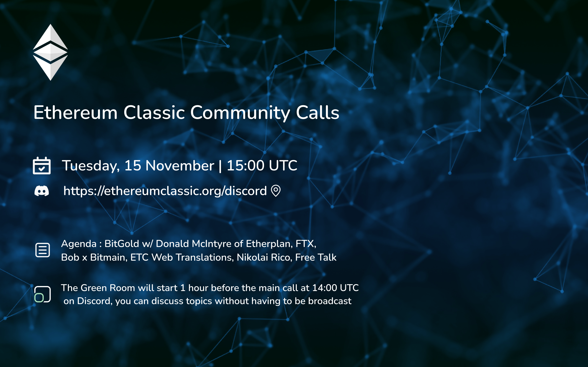
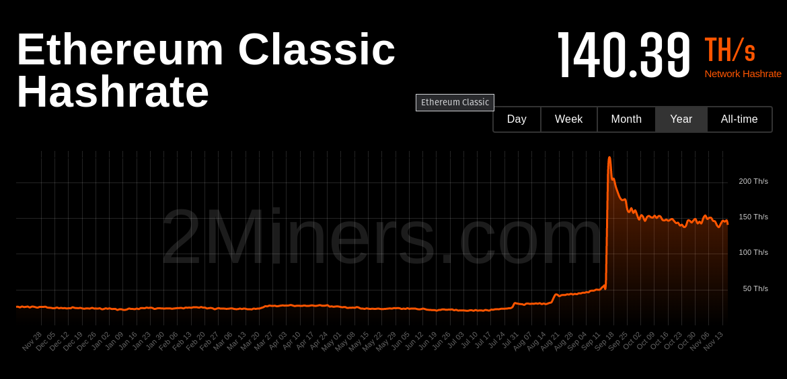
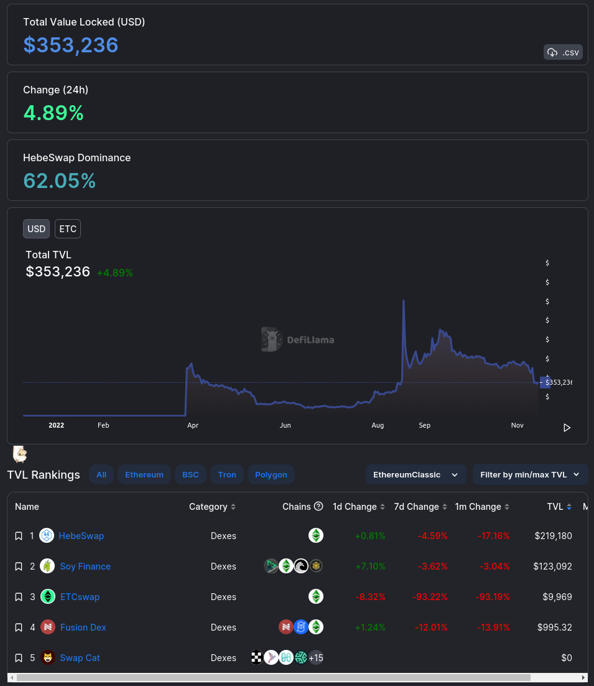

**Join the Green Room call 1 hour before we go live to chat offline**

A casual voice chat to discuss ideas for ETC. All are welcome.

The ETC Discord can be joined at https://ethereumclassic.org/discord

Please join the voice chat the #community-calls channel to ask questions or bring up topics.

This call is an open discussion so please feel free to jump in any time, but be reminded this is live streaming on YouTube, so if you are on the mic, please turn off sound notifications, and keep it family friendly. You can also post messages in Discord or YouTube, and we'll try to get to them via the chats.

You can find the agenda to this call in the description, which contains links to everything we talk about.

## Housekeeping

- We return after two weeks.
- Please check Timezones reminder

## Agenda

- Ecosystem, Hash Check
- This Week in ETC
- Bitgold w/ Donand
- Bob Bitmain Conference
- ETC i18n
- FTX
- Rico
- Etcetera
- Free Talk

## Gratitude

Brotherlal, d_a

## Ecosystem Update

⚠️ DISCLAIMER

- Safe MultiSig https://ethereumclassic.org/blog/2022-11-11-the-ethereum-classic-safe-multisignature-wallet-explained
- Hebe's ETCerScan https://etcerscan.com/

From last week

- HEBE Report https://twitter.com.com/BlockHebe/status/1586886206821789699
- Classic DAO Launch Website https://classicdao.one/
- Swapline Supports ETC https://twitter.com/swapline_io/status/1586264321595678721
- Corey ETC Radio https://twitter.com/Corks3000/status/1585483227652816898

## Hash Check



Brief mention of markets, FTX



## Last Two Weeks in ETC Headlines

-  New ETC Cooperative Communications Team https://twitter.com/ETCCooperative/status/1592503705714163717: Donald, Andrew, Angelah, and Emma will be working together with the sole goal of promoting Ethereum Classic as one of the best blockchains in the world, communicating its features and benefits, and fostering its future growth.

## BitGold w/ Donald McIntyre of Etherplan

https://etherplan.com/2021/08/31/integrating-bit-gold-inside-ethereum-classic/16111/

## Bob x Bitmain

https://twitter.com/eth_classic/status/1591177933451927572

https://www.youtube.com/watch?v=bLSXYDpKOgk (starts 33:00)

- 🔐 Gnosis Safe MultiSig and frontend deployed to #EthereumClassic
- 💵 $5m of @AntPoolofficial's $10m Funding converted to $ETC
- 🇨🇳 @ETCCooperative communications now also in Chinese

The Phoenix Rises.

## ETC Web Translations

- Video Tutorial https://www.youtube.com/watch?v=N8SvCy0ayMc
- https://etc-i18n.netlify.app/
- https://crowdin.com/project/etc-web-test-3

## FTX

- Summary / Discussion
- Limited ETC Fallout: Multichain, ETCSwap

## Nikolai, Rico https://bank.dev/why

- The FTX thing emphasises the need for decentralization.
- DAI vs RAI vs Rico

## Etcetera

- Twitter Spaces
- Web Updates, Automations, Auto-adding content, https://nvu.io/en/bots/discord-translator, Auto add Youtube, weekly top tweets
- Nomenclature: Profitability, Profits, Block Rewards, etc.
- Tweet Bank

## Free Talk

## Sign Off

#ETCtweets reminder

See you next week, same time same place.

---

## Full Transcript

```webvtt
WEBVTT

NOTE no-names

1
00:02:26.420 --> 00:02:54.780
stay with you together [Music]

2
00:03:09.080 --> 00:03:29.330
our team of Founders all worked for bitmap before in February 2021 we became strategic partners with bitmain allowing ant pools huge amount users direct access to our platform in April we received a Strategic investment from bidmate our partnership with bitmen was provided

3
00:03:27.360 --> 00:03:47.750
us with apple Miner supplies not just that we also offer book discounts and minor prices and low electricity fees for our users we were able to divide the overall hash rate for a single Miner into unit hash rate we have vastly lowered the entry barrier for all miners on top of that we also offer

4
00:03:46.080 --> 00:04:10.729
Cloud hosting services to professional miners no more worrying over the nitty-gritty of mine operations just enjoy the fruits of your mining outfit oh finally we even offer customized mining product solutions for professional institutions most of the flagship miners are available on our platform including s19 Pro

5
00:04:05.220 --> 00:04:28.070
for BTC E9 for eth L7 for LTC both bitmained and us are dedicated to launching Cutting Edge Products all over the world in the foreseeable future our minds are built with high standards and managed by teams of professionals our minor exhaust ports are equipped with enclosed heat sinks to separate cold and hot

6
00:04:25.139 --> 00:04:45.469
air for better circulation the industrial exhaust fans on the top of heat sinks will blow out there while also bringing new buildings our factories which evaporate and absorb the heat to lower the temperature reservoirs are built in the mines to recover

7
00:04:43.259 --> 00:05:03.710
purify and recycle the used water this way we are able to save on Water Resource since miners are power intensive we've installed Transformers to ensure a stable power supply also we have chosen high voltage lines to meet the Intensive loads on the network side of things we use exclusive

8
00:05:01.620 --> 00:05:17.990
lines with low latency and high upload configurations additionally we have at least two lines as a Fail-Safe to ensure online connection our operation and maintenance teams work in three shifts to monitor the factory Around the Clock 24 7.

9
00:05:14.759 --> 00:05:38.000
temperatures humidity power grids and miners are regularly inspected so even the tiniest of problems will be acted upon swiftly and fixed immediately foreign [Music]

10
00:06:06.900 --> 00:06:36.910
foreign [Music] everything

11
00:06:36.920 --> 00:07:08.870
[Music]

12
00:07:40.199 --> 00:09:34.970
foreign food

13
00:09:38.339 --> 00:10:00.910
with uncertainty step into the future of Endless Possibilities seize the moment and unlock new opportunities wdms 2022 Global pow power and Mining impetus the largest world digital mining Summit taking place between the 8th and 10th

14
00:09:58.260 --> 00:10:20.090
of November in Cancun Mexico Gathering industry Pioneers focusing on pow power and Mining impetus diving into efficient and clean mining discussing Hydro cooling technology aggregating the momentum of mining brainstorming the digital future in Latin

15
00:10:16.980 --> 00:10:40.210
America the rise above and together build a consensus compare and the bear and prosper in the bowl go to www.biddenain.com to join wdms Build Together in Winter 2022 for a more prosperous

16
00:10:35.399 --> 00:10:57.949
spring 2023 welcome back I hope you had a great time at concurring and this is our second day of

17
00:10:54.000 --> 00:11:15.650
wdms we'll continue to fund today for today our morning theme is pow Power vision and Mission and for the afternoon we will focus on limited potential blockchain land in Latin America as we begin in the morning with the first lineup of speakers please remember to follow the event rules and instructions

18
00:11:13.680 --> 00:11:35.210
from our staff as everyone's safety is our top priority just in case you're hungry we have prepared snacks for you outside the hallway but do come back quickly because the meeting is still going on all the svps are welcome to join our lunch buffet at the three restaurants in hotel 12 p.m the club royal fentino and the cafe

19
00:11:33.060 --> 00:11:54.230
the hostess will show you the way for lunch if you're not joining our Buffet there are some fabulous restaurants five to ten minutes walking distance from the hotel but before you leave please remember to put your translation headset on the seat cannot afford to lose them okay let's get started and

20
00:11:51.500 --> 00:12:14.329
everyone that's outside I don't know if you can hear me come back in first let's open our event with Paulo Arduino CTO of tether to share his speech on tether a tour of Four Financial freed and Emerging Markets unfortunately he cannot be here today but

21
00:12:09.660 --> 00:12:29.870
we have him on Zoom so hi Paula say hi to the audience hello hello everyone I hope that you can hear me well okay you can get started now thank you first

22
00:12:28.019 --> 00:12:49.610
of all thank you very much for having invited me um I'm here today with you I'm glad to be um talking to you about one of the reasons of uh in my opinion of the crypto industry to exist um today uh is kind of a weird day it's a

23
00:12:47.040 --> 00:13:07.910
sad day because we are seeing turmoil on the markets we are seeing uh companies in the crypto space that are suffering or potentially even going bankrupt and um we have to remind ourselves

24
00:13:05.040 --> 00:13:28.970
that the reason why this industry was born was to respond to the 2007-2008 financial crisis that crisis could many people many holders

25
00:13:24.260 --> 00:13:46.970
many bank account holders in a really difficult position it wiped out the wealth of generations and in response to that Bitcoin was born right in the third 31st December 2008 uh

26
00:13:43.500 --> 00:14:03.949
the Bitcoin web paper was born um the third January 2009 the first transaction was um was uh processed right the first block was processed and so now we are um we are in a situation with the markets with

27
00:14:01.380 --> 00:14:22.310
the industry where we have to remind ourselves that that response to the 2007-2008 financial crisis was a strong response and we have to to continue to work on that to bring that response with us

28
00:14:19.620 --> 00:14:40.550
and to continue with the same same ethosis so that's the reason why today I want to talk to you about how we are trying to bring that status right the same if there's the same Bitcoin ethos we are trying to bring it with tether and Bitcoin in Latin America because to me

29
00:14:38.160 --> 00:14:58.370
when I think to bitcoin anything to tether I think about tools for Financial Freedom we live in a world where more than civilian people don't have access to bank accounts not because they are bad people not because they are you know they did anything wrong they

30
00:14:56.100 --> 00:15:16.850
are just too poor to have a bank account because the cost of maintaining Bank bank accounts is really high the the cost is due to the extremely outdated kyc AML uh processes they

31
00:15:13.160 --> 00:15:34.610
are mainly still manual the completely outdated uh infrastructure technological infrastructure that is kept together by Rubber and bands in is at 34 40 years old technological infrastructure that still is really kept together

32
00:15:32.639 --> 00:15:54.970
till today with rubber and vans and so all these costs all the cost of them are trying to maintain this outdated system is reflected on the users and this means that if you don't have enough Capital enough money enough wealth you cannot have a bank account you cannot have

33
00:15:51.120 --> 00:16:13.090
access to basic Financial Services that is why tether business model is actually not trying to go after the banks right tether doesn't want to become you know the biggest banks that doesn't want to steal the job of the banks but actually wants to go on in all those

34
00:16:10.680 --> 00:16:31.069
regions where the banks gave up where the banks left alone millions and millions of people right so we we know that there is a common denominator in poor areas of the world there is the smartphone or there are phones

35
00:16:27.839 --> 00:16:50.509
so phones are the common denominus areas and so having a wallet a simple wallet on a phone that allows you to pay to pay for groceries for food for basic services is extremely crucial so creating

36
00:16:46.680 --> 00:17:07.510
an economy for people to transact in emerging markets in developing countries is a way to give to these countries an opportunity to grow their GDP to move money faster because if you move money faster if you can settle

37
00:17:05.040 --> 00:17:25.970
money faster if you can transfer microtransactions and big transactions in you know without waiting several several days the economy will move faster so you can actually create more opportunities for emerging markets to fill the Gap at least

38
00:17:23.160 --> 00:17:44.450
a little bit with the more wealthy countries because if we don't focus on this right we are not actually thinking forward because of Bitcoin to me the beauty of Bitcoin is that um you know the every morning that you wake

39
00:17:42.120 --> 00:18:04.549
up you know that if you have Bitcoin your Bitcoins in your in your private wallet that is no one can take that away from you and so this very same experience should be brought to people living in emerging markets in developing countries we need um

40
00:18:01.679 --> 00:18:21.890
you know we need to create tools that help um Emerging Markets to fight against the enormous inflation that is happening uh with their local currency I have a good friend in Turkey he has a child

41
00:18:18.360 --> 00:18:38.450
he's 14 years old and he would like to send this child studying abroad in Europe and the problem is that is the majority of we savings last year were in um in Turkish leaders and the actual uh problem for him was that

42
00:18:38.460 --> 00:19:00.049
we given that the Turkish leader lost 80 percent or more of value compared to dollar in the last 12 to 60 months this person is poor after having worked one entire year this person is square uh at the end of the year rather than more than the beginning of the year right so that

43
00:18:57.240 --> 00:19:18.549
is that is absurd that is unfair and the only way for for for for this friend of mine and and many and many millions of others to combat this inequality is actually using a Bitcoin and stable coins like that so that's why you

44
00:19:16.020 --> 00:19:36.110
know you you don't see us you know announcing big Partnerships with banks we don't we don't you don't see each other um you know creating um you know having buying the name rights on um on stadiums but we are always

45
00:19:33.360 --> 00:19:54.950
there uh in Latin America um where you know in in Venezuela Argentine number zero uh um of course um I'm going to be there personally El Salvador in south southern Salvador within the next 10 days for adopting Bitcoin so

46
00:19:51.299 --> 00:20:11.990
that's where in my opinion um we can have the the biggest impact so you know for us uh for theater but I know that many uh of our friends in the industry think the same is not all about the money right so it's not all about squeezing

47
00:20:09.480 --> 00:20:30.049
the last drop of everything that you do but it's actually creating there is one understanding that there is um an opportunity that happens once in 100 years where you can actually if done properly if you are if

48
00:20:27.840 --> 00:20:48.950
we are all committed to that we can actually change things right we can we can reshape the financial uh the financial industry we can reshape the access to financial services so I think that um also what I like about Latin

49
00:20:45.120 --> 00:21:08.450
America is that there is so much potential there is so much potential in terms of energy access to energy access to Natural Resources so I Envision a future where with the right amount of capital with the right amount of human

50
00:21:03.480 --> 00:21:24.710
resources and mental power we can help each country to become self-sustainable and have helped them to mine Bitcoin with the excess of energy that they have because the reality is that we know for a

51
00:21:22.919 --> 00:21:45.350
fact that there is a lot of access of energy in in Latin America so I think that is the there is a good way to leverage that with Bitcoin in order to create value and increase and improve the economy of the um

52
00:21:42.179 --> 00:22:03.770
of the area so yeah with tether basically we we don't consider ourselves just a stable coin but we consider ourselves a group of builders and local Builders to create you know Financial infrastructure you might have seen that lately if for anyone that is following

53
00:22:00.900 --> 00:22:22.430
me I have been um publishing a lot on Twitter you can follow me at Paulo Arduino on Twitter I've been publishing a lot about cheat example that will be Bitcoin is already Bitcoin

54
00:22:19.919 --> 00:22:41.750
slash lightning enable and will have tethering I believe that um you know with this type of innovation with creating sustainable peer-to-peer applications that can move money but also they can move data we can create again we can reshape also the communication

55
00:22:38.700 --> 00:23:00.110
infrastructure in Latin America and all the Emerging Markets including Africa and and some countries in east Europe because if um from one side we attack we see that there is a big gap as I've described in in

56
00:22:57.059 --> 00:23:19.610
financial services access and on the assistant side we see that there is a big issue with decentralization and the control over people's data so we are creating all these products that are you know free to use um these peer-to-peer applications are free to use there is no token there is nothing right there is no blockchain it's

57
00:23:16.860 --> 00:23:38.690
just devices computer that are talking to each other today I'm using Zoom for this uh this um this participation but I you know there is no reason why you know we should potentially we should use zoom servers in the future right so we our devices especially

58
00:23:35.840 --> 00:23:56.330
in areas that are far from data centers are well capable of interacting between each other without the need of passing through Central servers and in Latin America I imagine how this will improve the speed of communication and the liability of communications

59
00:23:54.600 --> 00:24:17.950
because passing through data centers doesn't help anyone a part of the big tech companies in Latin America the concentration of data centers is not that great compared to Europe and U.S for example in Asia so if we can also improve the communication infrastructure providing

60
00:24:13.260 --> 00:24:35.149
peer-to-peer Technologies the way to go so imagine a future where um or with all these tools from one side you have easier access to financial services uh

61
00:24:33.120 --> 00:24:53.630
more democratic access to financial services so instant transactions right control over your own wealth with Bitcoin then you have uh mining at the country level where you can improve um the wealth of the country itself you

62
00:24:50.520 --> 00:25:12.890
reusing or investing the excessive energy in actual uh mining in production of Bitcoin so that they can be sold to create additional infrastructure like hospitals like schools streets and so on and education of course and then third one is um

63
00:25:08.640 --> 00:25:30.350
more robust more um you know um yeah more of us more secure and efficient communication systems I think is this is how what I think this is what um you know the the countries of the future will

64
00:25:26.940 --> 00:25:49.490
look like right less depending of from centralized infrastructures that can be banking that can be you know data centers that can be Cloud providers and more relying on the actual um you know content actual um

65
00:25:46.380 --> 00:26:10.909
work in all the senses from Financial work uh proof of work of course and and you know uh interaction as work right between people um all that could could dramatically improve the quality of the lives in in Latin America and the rest of the Emerging

66
00:26:05.580 --> 00:26:25.730
Markets um another important uh um you know another important aspect that I would like to talk about is the um

67
00:26:25.740 --> 00:26:46.010
you know is the usage of at least when I when I think to tether right um I know that I am sure that you know many of you come from you know uh the Bitcoin World um you are coming from the mining world right so when when we propose data and this is something you know that I I want to

68
00:26:44.520 --> 00:27:05.029
explain because um it is it just makes sense right so tether uh is not a replacement for Bitcoin and that is one of the examples and one of the messages that we are giving to all the countries with operating right just the fact

69
00:27:02.700 --> 00:27:25.850
that we have data doesn't mean that we have uh you know that tether is a better we consider tether a better product than Bitcoin so Tyler um is definitely no Bitcoin tether is a centralized simple coin as in any centralized simple coin that is solid relies on um

70
00:27:22.500 --> 00:27:42.950
strong Banking and relies on working with um with the law enforcement so also you know all these um all this um factors are quite important when when you explain also the usage of of tether in

71
00:27:39.900 --> 00:28:02.510
in in in in Emerging Markets right because it's important to distinguish the the value of tether that is just a dollar on a blockchain right that it was created in 2014 to become to be um simply a dollar on a blockchain to move

72
00:27:57.900 --> 00:28:18.110
faster uh dollars at the same pace as the Bitcoin um as the at the same pace of Bitcoin basically and then instead Bitcoin is that immutable uh strong unique um

73
00:28:14.340 --> 00:28:34.610
monetary infrastructure that will um that will never find another opponent as strong as secure as important so um I think that I'm not sure if we are supposed to because I know that I had only

74
00:28:33.000 --> 00:28:56.930
20 minutes so I just making sure that uh you know I'm not all going over time so

75
00:28:56.940 --> 00:29:16.970
let me also um and talk a little bit of what we are doing in terms of Education so as some of you know we have been um also instituting a collaboration between a country El Salvador

76
00:29:14.159 --> 00:29:36.710
and a city called lugam in Switzerland one of the uh interesting aspects of what we are doing is that in order for the Bitcoin industry to succeed we need [Music] um we need proper um

77
00:29:32.460 --> 00:29:53.029
education we need to explain why what we are doing is so important we but it it cannot be uh confusing it cannot be uh a message that is full of different uh you know hundreds or

78
00:29:52.080 --> 00:30:14.510
thousands of different cryptocurrencies and cannot be a message that is you know all full of NF teams to me right so I'm not denying the utility of certain blockchains or or other aspects but I think is is mandatory is extremely

79
00:30:09.299 --> 00:30:31.310
important when we talk with um um with for example El Salvador that we remind them that of the importance of giving to their citizens something that is extremely solid something that cannot be

80
00:30:27.480 --> 00:30:49.010
changed something that won't be uh want no one can can ever change right so I think that there is a unique proposition in Bitcoin and so that's why as you are you may may see tether is actually um a part of course a support team pattern

81
00:30:45.960 --> 00:31:06.950
its own stable coin type of usdt is also focusing on the messaging of you know making sure that we actually give the right tools to the right people and we can only do that if we create the right education so we in a Salvador invested

82
00:31:03.140 --> 00:31:24.230
in um in sponsoring uh initiatives Like Me premiere or Bitcoin we are setting up hopefully in in early next year early 2023 we are setting up new courses uh for um

83
00:31:20.159 --> 00:31:43.070
for students in in El Salvador and we hope that we can bring this courses also outside of El Salvador right in in Switzerland for example as I said we formed a partnership between El Salvador and um or we have to form a partnership between El

84
00:31:37.980 --> 00:31:58.190
Salvador and and Lugano so that the experiences that have been you know created in one place so in El Salvador for example can be reused in Lugano and vice versa so you know we had uh in Lugano

85
00:31:54.659 --> 00:32:17.389
an experience with 100 students so the experience was called summer school we had Adam back we had many teach themselves to the students imagine if we could do you know once per year sessions

86
00:32:13.220 --> 00:32:34.730
of Education from the most the most important spokesperson in in the world right um so things that I'm honestly more um

87
00:32:32.279 --> 00:32:54.230
Pride or proud of um when we um when we are able to import education when we are able to create education from this side of the country then we are going to have to to see we are going to see this country succeed so um

88
00:32:51.659 --> 00:33:14.870
I really thank you very much um for Lisa me today I know that again uh this is a few interesting days the industry is uh in um you know it is a difficult situation but I hope that we can meet all together um

89
00:33:10.500 --> 00:33:33.590
in Latin America eventually in all the conferences in you know all the public events all the educational events that we are going to do to support the message about how if important is what we are doing so thank you very much thank you thank you Paolo thank you so much for your speech [Applause] next

90
00:33:30.299 --> 00:34:02.570
we will have our head of marketing X mailing oh thank you Paulo yeah thank you next we will have our head of marketing Expo link to give her speech on pow now to the Future Let's welcome X mailing on the stage uh

91
00:33:59.460 --> 00:34:20.869
hello everyone Thanks for attending this Summit and also thanks for the greatest speech by my friend Paulo from tester you know in this beer market organizations like tester always plays important okay

92
00:34:22.379 --> 00:34:44.210
organizations like tester always play important roles so and I'm really looking forward to do more cooperation with hazard in the future today I will still talk I was still talking about pow the proof of work a similar speech theme I presented in the last wdms so I'm the girl who always

93
00:34:42.060 --> 00:35:04.490
talks about the proof of work in business my boss even named me the pow queen and I particularly love this nickname the first time I know about profile work is related to bitcoin and Bitcoin wallpaper but actually proof of work first invented by two professors in 1993

94
00:35:00.960 --> 00:35:24.349
to prevent junk Mouse so in the beginning the concept of profile work means people will work hard for words for things and will pay something for words for things the restraints on behaviors depend not only on morality and you know take them for granted but also

95
00:35:20.880 --> 00:35:41.450
on a set of effective systems and governance what is a good and effective system very easy it should punish evil and promote Cantonese and make people can govern themselves in the big con blockchain those who want to

96
00:35:39.060 --> 00:35:59.329
do more calculations to verify the transactions will have more possibility to earn more block rewards then they would love to do more transactions more calculations and verify more transactions to secure the whole network through the calculations to secure the network I mean the money is sometimes very

97
00:35:57.540 --> 00:36:19.250
expensive because you need to buy some Hot Wheels but it pays back you work harder for words for things you get more worse for things back don't really like this topic you know there are some criticisms that mining always

98
00:36:16.619 --> 00:36:37.190
wastes energy and it's harmful to the environment I totally don't understand because Bitcoin mining only consumes less than 0.2 percent of the world's energy less than the video games I think why are you guys still playing video games like Dota or Minecraft why don't you stop playing games

99
00:36:37.200 --> 00:36:59.390
but gradually these critic seems to really trouble the home mining industry and this could put you all lose your job I mean seriously think about the mining Bank in New York some people do lose jobs for that and my friend Kyle from feng shui he will talk more about this in the afternoon so

100
00:36:56.160 --> 00:37:19.430
take it seriously Bitcoin money is just like your drive and you know electricity car it consumes only electricity or some water but it doesn't have any emissions I mean no CO2 people see a Tesla and say wow that's a cool and clean car only consumes electricity and

101
00:37:15.780 --> 00:37:38.030
no CO2 but when they see miners they say whoa what a better machine only consumes electricity and no CO2 that didn't make sense my friends fight back against the wrong ideas with me and defend ourselves however sometimes these criticizes are not

102
00:37:35.220 --> 00:37:56.569
all bad our industry is more and more turning to clean energy it's really a good thing clean energy is usually located in remoted and sometimes very poor areas it's hard to be directly utilized and will be wasted a lot during the electricity transmission like hydropower

103
00:37:53.700 --> 00:38:15.829
and gelser but mining can directly utilize the energy effective efficiently and create Revenue to contribute to the local community and more interesting things mining can even reduce the CO2 our customer crucial I'm not sure you're here

104
00:38:13.440 --> 00:38:35.930
but I know we come to this Summit uh they're working on mining technologies that can use the electricity generated by flare gas reduce the CO2 emissions and bring revenue and investment to this industry and reduce more CO2 from crucial website I

105
00:38:33.000 --> 00:38:53.329
see the number about emission reduced is above 67 that's a huge number to pow Builder we always produce the best blockchain servers to provide a stable

106
00:38:50.820 --> 00:39:16.370
server and Hardware support to the PW ecosystem being Mac is devoted to pow education research donation ESG community activities and Community donations with a lot of Partners and Friends always

107
00:39:13.740 --> 00:39:36.530
have friends not every announce accident news here Big Mac you know is a devoted PW Builder working on the PW ecosystem including some classic Lycan and some others and we are exploring corporations opportunities with tether I believe the cooperation with tether will

108
00:39:33.720 --> 00:39:55.010
be more purpose in the future and also being nice looking for more friends and partners to work with us to build the pow ecosystem because we couldn't do these things by ourselves no one can do that you know if you have any interest on that please contact me I even attached

109
00:39:50.880 --> 00:40:10.970
my email here tests is about the whole pow ecosystem not only mining when we talk about the ecosystem PW ecosystem we need to pay more attention to the pow blockchain itself

110
00:40:07.680 --> 00:40:28.310
because first there is PW blockchain then there is mining blockchain does improve human civilizations some blockchains choose pow some choose others but I support the pill W because it's more decentralized secure

111
00:40:24.000 --> 00:40:44.450
and censorship resistance PW is a real blockchain all other old systems like Banks I think to some extent are proof of stake POS yeah thus we decided to do something interesting to support more

112
00:40:40.680 --> 00:41:04.430
pow blockchains then it comes to ATC Grand stock simple it's a non-profit organization composed of ethereum classic Builders and PW Believers it's about giving fragrance

113
00:41:00.359 --> 00:41:22.069
to Etc developers fragrance you know the total treasury is now 10 million dollars halfway usdt half is ETC we just bought some ethereum classic from the market and put them in a super awesome voltage which voltage do we use my

114
00:41:18.480 --> 00:41:39.710
friend Bob from Etc Cooperative will let you know later and as for being Men We Are The initiator and sponsor of Etc green Style Instagram merge some pow supporters from ethereum

115
00:41:36.960 --> 00:41:58.970
Community are very sad this in choosing proof of stake is sometimes you know makes people like treat her just like a dragon slayer eventually become an evil dragon and some Miners and mining companies are very static too because instantly they lose jobs and can feed their

116
00:41:56.579 --> 00:42:17.569
families are just kidding then we start thinking we need to do something then we find Instagram classic the same touring complete smart blockchain as ethereum and all developers from Eastern Community can go to Instagram classic very easily you

117
00:42:14.160 --> 00:42:37.250
know touring complete so we want to give grants to the Eastern classic developers and help the infrastructure and finally build ethereum classic into a top level smart blockchain based on the PW consensus with high security decentralization and censorship resistance

118
00:42:40.200 --> 00:43:00.410
community by community and for Community the thought decision Community is composed of five standing seats you know from the initial donors and Community contributors and two rotating seats will quarterly rotated by TBL now we have been

119
00:42:58.020 --> 00:43:20.270
men and pool and also Etc Cooperative but no one will decide everything 86 grants now invites all developers and pwp delivers to run for the decision committee actually we really want to do something but we need friends we need everyone of you it's very important you need to take it serious

120
00:43:16.920 --> 00:43:38.930
as I said first pow blockchain then mining without puw blockchain all of you will will lose your job seriously also we welcome our developers to apply for Grants from the ETC grants now directly here are the Twitter website and

121
00:43:35.460 --> 00:43:58.510
our contact email also we will welcome you to donate to us you just need to donate a little money we will do the hard jobs shows how we will support ethereum classic we will try our best to support the

122
00:43:55.380 --> 00:44:16.790
Instagram classic every one of you now all customers buy Miners and containers from bidman's official website and paying online with ethereum classic will instantly enjoy a five percent discount during the event you know

123
00:44:14.400 --> 00:44:36.370
the event starts now and when will it end who knows maybe 10 years later maybe next week I don't know either so buy miners with extreme classic now as soon as possible five percent discount is a huge money and the last division of the Eastern classic

124
00:44:33.599 --> 00:44:54.710
decentralization security censorship resistance we will build Islam classic into a Earth's computer in webstery thank you everyone [Music]

125
00:44:56.940 --> 00:45:17.230
speaking of Etc next we will have Bob Somerville he is the executive director of Etc cooperative and he will give us an overview about Etc and Etc Cooperative welcome Joseph oh sorry Bob

126
00:45:14.400 --> 00:45:35.329
I'm sorry [Music] hello everybody how are you doing I I don't know that I need to talk really I think it's done right uh so hi I'm I'm Bob Samwell uh I'm the executive director of the EC uh Cooperative

127
00:45:32.099 --> 00:45:55.370
I'm originally from the UK I live in Canada now uh and I I met my wife on crypto Twitter so uh if anybody's looking for love I recommend Twitter uh

128
00:45:51.839 --> 00:46:16.370
Etc is the uh is the top proof of work smart contract platform today and how did that happen um anyone

129
00:46:13.680 --> 00:46:33.950
has some override capability here right so uh have you got a different one maybe yeah yeah um so yeah how did that come about well um for a long time ethereum has been planning a transition to proof of stake um

130
00:46:31.680 --> 00:46:53.270
it was actually part of the uh the white paper at the very beginning um talk at the time of that perhaps happening as early as 2015 um but it ended up taking eight years um sometimes it takes a long time to to make changes so the transition which was called

131
00:46:50.040 --> 00:47:11.150
the merge uh happened this September uh and it was the merge because it was the bringing together of two separate chains um the beacon chain which is a the new proof of stake consensus chain uh came to life in 2020 and was running in parallel with the existing proof of work chain

132
00:47:11.160 --> 00:47:31.670
um just coming to internal consensus but not having any transactions the transactions continuing on the main chain anyway as of September uh the merge occurred where those two chains were merged together and uh proof of work mining on ethereum was

133
00:47:29.099 --> 00:47:50.750
disabled now that of course was very impactful given the size of uh of ethereum's uh proof of work you know a giant amount of uh of hash rate there uh secondary to bitcoin classic

134
00:47:48.540 --> 00:48:10.069
at the time of the merge it was a gigantic spike in hash rate um you know it was around a 10x at the time dropped down to maybe a 6X or a little more but that's that's all time hash on Etc as you can see we're in a very very different

135
00:48:06.900 --> 00:48:27.410
place uh than we were only a couple of months ago times over the last few days um but yeah this is where Etc sits in terms of market cap and in terms of daily

136
00:48:25.619 --> 00:48:47.150
block Rewards uh so you know Bitcoin as we all know dwarfs everything doge is doing fantastically well memes obviously still uh enough to sustain market cap and uh you know and Mining rewards there and then

137
00:48:43.500 --> 00:49:05.450
we have Litecoin and uh an Etc um you know fairly similar in size and then things drop down you know very rapidly and the thing worthy of note here is that on this slide of the top eight uh proof of work chains Etc

138
00:49:02.400 --> 00:49:22.970
is the only smart contract platform and of course EDC is very compatible um with ethereum you know we we take the majority of changes uh from ethereum unless they're in conflict with the fixed monetary policy that Rose for

139
00:49:21.240 --> 00:49:42.530
ETC um or anything else which is really uh intervening on on the on the ledge on The Ledger itself important you know we're like all all started with Bitcoin and

140
00:49:39.300 --> 00:50:02.390
uh a lot of the um a loss of the rationale for the whole of blockchain really came from the path that Bitcoin sat you know that really you are uh generating a um

141
00:49:58.800 --> 00:50:18.829
hash rate secured immutable Ledger for transactions um that allow us all to interact in a voluntary manner without any single um third party having the ability to uh to interfere with that and

142
00:50:16.140 --> 00:50:38.089
and those fundamentals um sometimes seem to get a little bit forgotten um on some of the newer chains but not on Etc um people have often explained Etc as Bitcoin philosophy married with ethereum technology

143
00:50:42.140 --> 00:51:03.049
you know a very safe very simple you know it's it's decentralized unmutable Unstoppable um an Unstoppable is a really key piece um and and that really is talking about uh censorship resistance um

144
00:51:00.780 --> 00:51:23.990
that nobody should have the ability to stop or censor transactions if people you know wish to make those transactions and modern transactions obviously with a smart contract platform you really have a basis for decentralized applications you know you can think of Etc as a platform you

145
00:51:19.920 --> 00:51:41.150
know like the web like mobile you know like Android iOS Windows um you really have a platform here for building applications and those applications should run as designed for decades

146
00:51:33.960 --> 00:51:55.190
that's the goal something that's happened recently which is really the top of the news is the

147
00:51:52.800 --> 00:52:13.089
tornado cash situation so for anyone who's unaware um a couple of months ago um the U.S applied sanctions against tornado cash so tornado cash is a mixer so it's a mixer run

148
00:52:10.500 --> 00:52:30.829
on the ethereum mainnet and used by many people for mixing Bonnie privacy everyone has the right to privacy and uh you know and many people before doing some particular transaction to use their coins wish

149
00:52:28.740 --> 00:52:49.190
to anonymize those so they can't be traced back to them um not for any kind of tax evasion purposes or anything it's just the fundamental right to to privacy as to your financial transactions anyway what happened with the tornado cash

150
00:52:46.740 --> 00:53:07.549
sanctioning was that for the first time a small contract was sanctioned this has obviously never happened before normally sanctions are applied against individuals or legal entities so for example U.S persons cannot do business with

151
00:53:04.460 --> 00:53:24.710
Iranian companies or individuals you know that's blanket banned or the other thing you'd see is you know sanctions against you know the head of a certain bank or government officials and so on but what happened here for the first time was sanctions applied against code um

152
00:53:24.720 --> 00:53:46.790
so what's happened as a result of this is that a whole load of normal users have got caught up um in a move intended to um to Target um you know basically money laundering um

153
00:53:42.960 --> 00:54:05.510
or you know it was North Korea you know North Korea were were using this so everyone else got caught up in it but what happens there is because those sanctions are so broadly applied anybody who's used that mixer in the past is now targeted also

154
00:54:01.640 --> 00:54:23.270
some Joker decided um that because you have the ethereum name service you know where you see hobsonworld.f or what have you because all of those names were public some Joker decided to dust everybody basically every well-known person got dusted

155
00:54:23.280 --> 00:54:46.069
and so were sanctioned you had smart con you had a defy projects uh inserting that black listing into their front ends so that was the first stage stage two which has happened post merge is that the block producers who

156
00:54:43.200 --> 00:55:05.630
are the stakers many of those are using custodial services for that staking so for example deposit your you know your your ether in coinbase coinbase run the staking service you receive a yield on that but the problem is many of those legal entities are are us-based legal entities so

157
00:55:03.180 --> 00:55:26.089
they have to comply with sanctions so this is what's happened as of ethereum are being censored now they're being actively censored so

158
00:55:21.780 --> 00:55:43.069
what that means is you may have coins which once went through a mixer and because they went through that mixer they now tainted and those transactions will not be included in blocks that's actively happening you know that 72 percent of that those those

159
00:55:41.040 --> 00:56:02.270
blocks being produced as of a few days ago are filtering out transactions based on this over broadly applied sanctions enforcement and that and that number is just growing and it's just a fingertip away from 100 censorship

160
00:56:02.280 --> 00:56:23.270
in that the block production at the moment is only applying that filtering on the Block itself that they are generating but very easily those block producers could choose to say we will not build on top of blocks which are not compliant um and they will often non-filtered

161
00:56:20.960 --> 00:56:47.990
blocks and then you have a situation where effectively the whole system is captured and has become a tool of the US government you know this is the absolute polar opposite move

162
00:56:43.440 --> 00:57:04.609
it forward whoa yes anyway Etc is certainly not seeking to follow that pattern and I think really this is where proof of work is so so important is

163
00:57:00.300 --> 00:57:20.510
it is the the best means that we have of decentralization of block production you can you can move very easily between mining pools in a way which you cannot move between staking pools so

164
00:57:16.380 --> 00:57:36.470
proof of work is hugely important for that means is is you know it is key really that the systems we build here are globally usable by everyone for all of humanity and uh you

165
00:57:34.140 --> 00:57:59.569
know the second you start censoring or allowing control from particular entities you you've lost the whole essence of it so that's why proof of work is so important for Etc and for us all fantastic

166
00:57:56.359 --> 00:58:16.910
presentation earlier um I'm proud to announce that we now have um the safe formerly notice safe multi-sig available on Etc mainnet now for anyone who's not aware of this um unlike

167
00:58:14.700 --> 00:58:35.390
Bitcoin where there's built-in multi-cig on chain for ethereum there are many multi-sig solutions they've been built using smart contracts the downside of that is you can have bugs in the smart contracts and there have been a number of instances of a failure but

168
00:58:33.480 --> 00:58:54.349
notice is safe is Battle tested many many years of use and it is absolutely the de facto standard so we now have an instance about live on um on Etc well an instance at least of the web front end because you don't have single instances

169
00:58:51.960 --> 00:59:13.430
of multi-sigs you know you have as many multi-cigs as people create so what you have here is is basically a web front end which allows you to create and interact with safe multi-sigs and the first users of that multi-sake are

170
00:59:10.619 --> 00:59:31.789
the ethereum grants um funds so yes as of several days ago our friends at bitmain and Aunt Paul um exchanged half of the funds that were pledged um at the previous wdms for ETC ecosystem

171
00:59:28.740 --> 00:59:49.849
so half of those were converted um into Etc which is held in a multi-sig wallet um on the mainnet which is just fantastic um because it's a real show of Faith um

172
00:59:47.940 --> 01:00:12.770
in this solution you know it's not toy amounts we have significant funds um held using that technology which very soon will be deployed for our new grants program so yes I would very much like to thank and

173
01:00:07.559 --> 01:00:30.589
pull so this is Leon CEO vanpool for all of their help and uh and support VTC it's fantastic to see you know we're now in a position with ethereum having moved to the other side of really

174
01:00:26.339 --> 01:00:49.010
uh having a a great place for the security within Etc now as the largest family chain and ready to go and

175
01:00:47.040 --> 01:01:07.849
uh have a pleasant day thank you [Applause] Austin he is the manager and director at licoin

176
01:01:05.760 --> 01:01:26.569
foundation and he will be talking about the development of Litecoin let's welcome Alan foreign opportunity thank you to bitmain for the opportunity to be here I very much appreciate

177
01:01:24.660 --> 01:01:45.049
uh being able to talk about Litecoin today uh for a couple of reasons you know there's we're at a proof of work and Mining related conference and there's a lot of conversations about Mining and Investments and energy use and you know facilities and those things but the other side of it is the coins that are being mined and really you know having a good

178
01:01:43.440 --> 01:02:05.150
understanding of what's happening on that side because these Investments that we're making in mining and stuff aren't just for tomorrow they're for the longer term and you know many years from now we're talking about you know Investments of thousands hundreds of thousands of millions of dollars so it's really important to know that whatever you're mining is it's not only going to be around but ideally it's going to be it's going to continue to grow in adoption

179
01:02:03.119 --> 01:02:23.210
and do very well for you financially and and you know your and make a great return on your investment as well so um with that in mind I just wanted to share some kind of some basic metrics a little bit about Litecoin and where things are at today I'm hopeful that that you'll find almost all the metrics we're looking at Price aside for a moment

180
01:02:21.599 --> 01:02:42.710
which I think is the case with a lot of things very encouraging so just briefly though so I I'm the managing director at Litecoin Foundation most people understand the difference but um just for clarity so Lifeline Foundation is a non-profit organization um I've found that sometimes people come into the space and they think that Litecoin

181
01:02:40.140 --> 01:02:55.670
Foundation owns Litecoin the same way that like a company would own their stock but as we know Litecoin is is a decentralized cryptocurrency where Litecoin Foundation is actually a centralized organization and we we are driven we've been around since 2017.

182
01:02:52.619 --> 01:03:13.069
we are primarily driven by donations and our role is to help see adoption with Litecoin through a variety of ways development education tools Partnerships and things of that nature so but I think it's important to kind of understand the differences when we're talking about the two so with that in mind just first briefly

183
01:03:11.400 --> 01:03:33.170
I just want to talk about let's very briefly the properties of what good money are and how Litecoin fits those properties because really that's what we're trying to achieve is Litecoin to be the best money possible I mean and and that's that's the start so um these are kind of some of the key key level events are our properties of what what good money would be fast and easy to spend

184
01:03:30.420 --> 01:03:51.589
low fees to spend low cost to store irreversible and censorship transactions a limited or Supply money being scarce and then being fungible in terms of fast and easy I think that's fairly straightforward and this with Litecoin there's a variety of there's there's no shortage of ways you could spend

185
01:03:49.079 --> 01:04:09.230
Litecoin from from uh you know wallet apps to we have a Visa debit cards now to gift cards to speed into other different applications I even you know have my debit card on my watch and it literally stores Litecoin and so I'm ready to spend it so that's pretty easy and it's also very inexpensive to spend Litecoin

186
01:04:07.319 --> 01:04:27.890
so this is kind of a chart showing the fees but obviously they fluctuate but on average it's literally about a penny to spend Litecoin so it's incredibly cheap and you could send obviously send it across the world very easily it's also very cheap to store unlike a lot of other assets like we think about gold and other things it's much more expensive there's a variety of ways

187
01:04:25.859 --> 01:04:47.270
we can store crypto which I also think is very important as part of the the mining um you know proposal when you're looking at your Mining and how you're storing your mic coins uh your funds are very important but obviously there's cold wallets there's there's hot wallets you know sea Keys you could even store it you literally literally start your seat keys in your in your head and just travel the world that way I mean it's

188
01:04:45.839 --> 01:05:06.829
we've come a long way it's it's pretty incredible um the next thing would be irreversible and censorship transactions so so this is really important when it comes to money um basically you know when you spend something you don't want that transaction reverse because you've already paid for something and that person has already received the money so it's very important that that doesn't happen

189
01:05:05.460 --> 01:05:26.390
when it comes to money and it's also important that nobody is able to tell you what you can or can't do with your own money um so Litecoin I'm going to get a little bit more detail about the hash rate and how it how merged mining is benefited with Litecoin in terms of hashing but um it right now the hash rate is over 500 terahashes which keep in mind we can't compare this hash rate to bitcoin because

190
01:05:25.380 --> 01:05:46.250
we're talking about different algorithms but it's very high it would cost like hundreds of millions of dollars to like attack and overrun the network so that really helps prevent you know transactions being from being reversed and changed um Litecoin also has a limited Supply 84 million of which about 85 Plus percent um

191
01:05:43.980 --> 01:06:04.849
are circulating and another 15 remaining the next having will be due next year and then the last thing I want to talk about which is very important to sound money is fungibility um so the idea of functionability is like one unit uh one unit of uh like a money is equal to another unit of money um

192
01:06:02.819 --> 01:06:23.450
for example excuse me here's the I have five Bells here they're all 100 pesos right every single one of these should be exactly equal to the other no matter which one I spend I should be able to get the same amount of goods just like if you have these exact same bills you should be able to um your money should be no different than my money um

193
01:06:21.119 --> 01:06:43.309
that's extremely important and when it comes to money and that's right now currently a problem with Bitcoin um and and some cryptocurrencies because and that's because there's a public blockchain right there's a transaction in history so what that means is that um if a store wanted to or exchange wanted to they could technically decide that

194
01:06:41.099 --> 01:07:01.430
some coin came you know from you know even if it was well before wherever you when you received that coin it was maybe they decided it was used for some you know bad transaction or whatever and basically blocked that transaction or blocked you know accepting that crypto and that's not good for money when it comes to money and and that may have happened well before you even received that

195
01:06:59.339 --> 01:07:20.150
Bitcoin so what we've done just recently is released a optional privacy layer on top of Litecoin it's a very basic opt-in privacy layer but it does it provides people a basic level of privacy concerning your finances and it does this by concealing three things it conceals the uh users the sender address the

196
01:07:17.819 --> 01:07:39.589
receiver address and the amount of money being spent and this kind of tackles two different things at the same time one is that helps with fungibility and the second is it really helps protect guard and Safeguard users businesses and your finances if you think and this is a very basic level if you think about it you know this is no different than what we already have in like

197
01:07:37.619 --> 01:07:58.910
traditional payments right so when you go to pay with a credit card and you go to a store nobody knows how much is in your bank account when you when you go to pay with cash people don't know how much is in your wallet this is a this is a lower price you already already have in traditional finance and there's no reason we shouldn't have it here um it's always a bit of a balance of how much privacy when we were looking at you know

198
01:07:57.240 --> 01:08:18.349
pushing this out and having minors approve it because the more privacy there's a trade-off with usability and ease of use so we kind of found that this is sort of that nice walks that fine line where it's it's not fully private but it's private enough and I'm going to steal a couple slides that um so Charlie Lee did a presentation at our Summit a few weeks ago

199
01:08:16.440 --> 01:08:36.709
and I I'm stealing a few slides from him as well but I think he gives a good analogy of what what Emma would be so if Litecoin was um a house this would be Litecoin and Bitcoin without that privacy right you're living in a glass house fully transparent everybody can see on the flip side if you have too much privacy um it would be something like Monero right

200
01:08:35.160 --> 01:08:57.110
which obviously nobody you know it doesn't seem very desirable it's also harder to use because of that where um Litecoin with this again it's optional web uh layer is sort of like a house with Windows right you have you have the windows open but when you want to close them you can have a little bit of privacy you can close the drapes you can open them back up when you need to um doesn't mean you're doing anything bad

201
01:08:54.719 --> 01:09:14.749
most of us want privacy sometimes in our lives I don't think most of us want to walk around telling everybody we meet you know our balances and other things so it sort of walks that fine line but does give some protections um and stuff so that was just released uh somewhat recently again it's an optional layer it's very easy to use by sending

202
01:09:13.020 --> 01:09:34.789
to this privacy layer and then sending right back to the main chain but we believe it it kind of was the missing piece of like sound money and and that's what we just recently I released so I think with that said Litecoin really checks off all the boxes of properties of good money and with that said I just wanted to go over a few of the metrics that we've seen in terms of adoption which

203
01:09:32.580 --> 01:09:55.250
I think are are very encouraging in general so first off as would be we talk about we'll talk about network security Capital market cap and liquidity uh Merchant support and Link currency usage um this is a chart that shows kind of four-year gaps um from 14 to 2018 and then we'll we'll see where we're at today so J four years from

204
01:09:52.140 --> 01:10:13.070
1418 we saw about a 200x in terms of hash rate and network security uh this is the this is the latest chart um and so I think we briefly talked about Litecoin at the moment is over I think it's about 530 540 uh Terry hash so one of the things that happened around 2014 is the merge with Dogecoin and

205
01:10:10.860 --> 01:10:31.189
because of that the house rate you know went up significantly and now since then they've kind of been working together to in hash in terms and kind of lockstep and have similar house rates because most people that are mining one are doing merge mining one of the great benefits of this as a minor is that you're pretty much doing the same amount of

206
01:10:29.820 --> 01:10:52.610
work but you're getting more than twice the benefit right so it's it's um to use analogy it's like a security like one security guard maybe protecting two houses and that's why you'll notice if you look at some of the mining machines out there right now like the L7 or some of the Litecoin miners I think you'll find that if you're running the numbers dollar for dollar some of those are actually even more profitable than some of

207
01:10:49.500 --> 01:11:09.530
the other Bitcoin miners stuff and I think this will likely you know could could likely continue and it's certainly something to consider when somebody's building out a facility and they're looking to diversify and enhance their profitability I think these are things that are definitely worth looking at so that's what I think looking at these metrics and kind of the direction things are going are really important on that level

208
01:11:09.540 --> 01:11:32.090
um this is just another chart kind of showing more of a recent chart yes there's some spikes but the trend is we we've reached new all-time highs in terms of hash rate because of the merged Mining and for just to kind of go over what merge mining is again it's it's the Litecoin and Dogecoin now sharing the security of the network they're sharing the security budget together they dominate

209
01:11:29.159 --> 01:11:49.850
The Script mining algorithm and um you know again the house rate is much higher so um in terms of rewards right now and again this is kind of a moving Target too as as Bob just mentioned earlier I had to change this and you know from last week and of course now it's back up a little bit but the amount of money that

210
01:11:47.280 --> 01:12:07.490
rewards is really a good okay I've got to speed this up a little bit so it's really a good measure of the security on the network um right now you have a Litecoin about 400 000 a day and then another million a day in Dogecoin so but the big benefit is you're getting rewards from both and there's also Taylor Mission from Dogecoin meaning the rewards go on forever so this will be an interesting kind

211
01:12:05.880 --> 01:12:26.209
of kind of test in terms of security to see because there's some debates about if fees alone will be good or not but but we'll see what happens there um I need to really speed this up I guess I'm willing to slow but um in terms of market cap and exchange liquidity um pretty much the same over the last several years in terms of merchant support

212
01:12:24.060 --> 01:12:44.330
though I I don't this is only a small fraction of our Merchants but it continues to grow one particular one I'd like to point out is bit pay though since Litecoin but there's like the largest payment a crypto processor I believe in the world since Litecoin was added to bitpay It's Quickly grown to the number two spot below Bitcoin it now represents 20 over 25 percent of the total

213
01:12:42.060 --> 01:13:02.630
transactions which is really huge because this is actual payments uh it's more than uh Dogecoin and even ether combined so we're really excited to see this and then lastly as far as currency usage um this shows the transaction chart of usage of Bitcoin compared to Litecoin where a while back Litecoin was just a small percentage of Bitcoin but now Litecoin

214
01:13:00.900 --> 01:13:22.490
transactions per day represent almost half of the amount of transactions Bitcoin do so we're seeing a tremendous growth in terms of of adoption and usage there the same with uh how much is being sent in USD it's now about a billion dollars so we've seen you know significant growth and then active addresses as well which is a good proxy for how many people are using the network because people are generating

215
01:13:20.760 --> 01:13:41.990
new addresses um again continued growth up until the right and then lastly block size so block size like when is one megabyte blocks there's still a lot of room the blocks are slightly Fuller but we still have um on average about 80 by block so lots of room there um two um I do I do want to talk about accessibility

216
01:13:40.199 --> 01:14:01.729
in brown rare's awareness really quickly Litecoin is very easy to get into in terms of it's on every major exchange PayPal adopted it as one of only four cryptocurrencies last year um it's on Robinhood gift cards um you can buy it through websites one of the interesting things is ATMs this is a chart I just pulled today of all the

217
01:13:59.580 --> 01:14:21.110
ATM supported worldwide Litecoin sits at number two below Bitcoin and significantly above several others it currently has over 31 000 ATMs right now around the world that support Litecoin so that's really huge and great to see um in terms of brand awareness meaning how many people like know about it through mainstream media in other ways so I don't know if anybody's like whenever

218
01:14:18.900 --> 01:14:39.229
you watching MSNBC CNBC Fox Bloomberg you'll notice that they're almost always showing Litecoin as one of the few tickers and one of the reasons is litecoin's time tested it's been around for like over 11 years and that's right now something to really be said in the space because we've seen a lot of companies come and go we've also were uh official crypto of the Miami Dolphins with

219
01:14:36.360 --> 01:14:57.709
work with UFC and recently there's a mini series where on Last Light on peacock NBC where somebody received their Litecoin through a light wallet which is a wallet we've developed so there's a lot of things in terms of brand awareness we continue to believe that'll grow and then lastly one way that'll grow is through the foundation and

220
01:14:55.080 --> 01:15:16.070
the foundation as I mentioned is basically to support the growth and Adoption of Litecoin and we did this a variety of ways through development Partnerships education I won't have time to get into all the details but just to point out a couple of quick things obviously we have social media channels and they continue to grow so we push things there we do an annual event um

221
01:15:14.520 --> 01:15:35.030
in-person event which is great for educating and bringing people together in person we're happy to have Aunt pose our title sponsor or in bit main involved is our title sponsor last at this last Summit a few weeks ago um the Litecoin Visa debit card which I believe I just mentioned this is the card here where you literally can store your Litecoin in Litecoin value until you're ready to spend which is great so now

222
01:15:33.780 --> 01:15:54.229
you can use anywhere Merchants except Visa just another way we can push adoption through one of our Partnerships and then LTC Labs so we recently formed a partnership with ant pull so amples generously agree to donate half of their funds to like uh to A LTC Labs organization and together we'll vote with

223
01:15:52.020 --> 01:16:14.990
ample on how to use those funds and the idea is we'll be voting to use those funds towards projects that help grow the Litecoin ecosystem so we're we're excited about the opportunities ahead um there and then lastly this is huge for us so we've been registered as a Singapore entity just earlier this year we set up by U.S entity and we're happy to announce we just received recognition by

224
01:16:12.000 --> 01:16:32.270
the IRS as a 501c3 So for anybody that doesn't know what that means that means the U.S donate donations people donating from the US can now write off their donations uh on their federal taxes and this is huge because the far majority of our our revenue is driven by donations so um this will be I think something really positive for us um

225
01:16:32.280 --> 01:16:54.110
last but not least it and I'll wrap it up this way if somebody were to ask me um just one question regarding proof of work and why proof of work this would be my very simple answer in the last 11 plus years Litecoin has had absolutely zero downtime it's the longest interrupted up time in crypto when it comes to money um

226
01:16:51.960 --> 01:17:15.610
zero downtime means everything so I appreciate your time thank you very much have

227
01:16:57.360 --> 01:17:20.810
a great time exciting

228
01:17:18.120 --> 01:17:43.430
Lucky Draw of our second prize winners we will have the names rolling on the screens when the presenter X Maylene says dropped the name that shows on the screen wins but uh the winner has to be present but this time we do have a backup plan so get prepared um

229
01:17:37.140 --> 01:18:13.310
okay so let's them

230
01:18:07.140 --> 01:18:43.250
stop today

231
01:18:41.040 --> 01:19:19.130
yeah stop stop Colton Horseman foreign

232
01:19:19.140 --> 01:19:59.149
okay keep rolling please keep rolling stop are there rolling

233
01:19:57.300 --> 01:20:25.310
it's fine keep rolling all the time in the world oh yeah [Music] we are the most is the luckiest and the most you know better guy oh

234
01:20:17.239 --> 01:20:42.890
you try you try it only

235
01:20:40.400 --> 01:21:02.990
have two seconds oh this is two two winners so it's him okay okay you can give an introduction of her for her okay I think it's the most famous Asian ift artist in the whole world and I hate God is the most high priced empty treat value

236
01:21:00.300 --> 01:21:22.729
yeah I think in the whole Asian okay so looking forward to her speech this afternoon yeah so let's give Sam our winner who's present uh you can give an introduction you'll have yourself yeah this one yeah uh so hi my name is uh Sam Copeland I am a

237
01:21:19.500 --> 01:21:40.070
VP of sales uh for navier uh we are a Bitcoin mining company we provide um Consulting Services we also have a minor management software that if anybody's interested we would love to provide a demo for anyone who you know wants to have a little bit more granular look

238
01:21:37.980 --> 01:22:17.149
at what each individual Miner is doing so thank you um

239
01:22:19.560 --> 01:22:41.090
that was as intense as yesterday um okay so next we have a very much anticipated speaker Yen's wishes um he is an OG Dogecoin Foundation veteran Foundation legal and governance he will be talking about The Accidental cryptocurrency

240
01:22:38.760 --> 01:23:05.270
Dogecoin and where it might go next unfortunately he cannot be here with us today because of covet but he is on soon yes okay uh hello can you hear me you

241
01:23:03.239 --> 01:23:24.649
can hear me right yep okay great um can you say hi to the audience hello everyone okay you can start your presentation now thank you okay good morning it's a pleasure to speak to you here at the world digital mining Summit if regrettably early remotely um

242
01:23:22.679 --> 01:23:42.770
my name is Jens wishers I've been part of the deutschecon community in Project since pretty much its earliest days in 2013 participating in helping and organizing many of its earliest fundraisers for both fun and for charity so for sending the Jamaican bobsleds team

243
01:23:40.800 --> 01:23:45.169
to the Sochi Winter Olympics in 2014.

244
01:23:45.179 --> 01:24:05.930
and putting a smiling Shiva Inu on a race car but also to finance dog shelters training for service animals and building groundwater wells in Kenya and back in 2014 I think very few in the community and even among the people who were

245
01:24:03.239 --> 01:24:25.850
the developers of Dogecoin imagined that Dogecoin would still be going strong in 2022 let alone that it would be as strong as it is right now um Dogecoin has been repeatedly called the second most recognized name in cryptocurrency in the world and now after

246
01:24:22.980 --> 01:24:45.229
the merge of ethereum is the second largest proof of work cryptocurrency after Bitcoin it has currently the sixth highest market cap among all cryptocurrencies if you exclude stable coins that are packed to some fiat currency the reason why no one could really have imagined

247
01:24:42.600 --> 01:25:04.070
Dogecoin and during as much as it has is kind of obvious but perhaps deceptively so because Dogecoin started as a joke and money whether Bitcoin or real money generally is

248
01:25:01.400 --> 01:25:22.189
serious business well or is it so that's almost all good answers that answer is a little bit complicated and while I usually start with the more fun no part of this reply given the recent events

249
01:25:18.900 --> 01:25:40.910
I kind of restructured this a little bit Revisited that decision and would like to start with the yes part yes money is serious business and handling the money of others whether as custodians or merely facilitating its transfer

250
01:25:36.780 --> 01:25:57.110
its trade it's exchange comes with a heavy responsibility a responsibility that a big part of the cryptocurrency industry has often treated cavalially or failed ads and where

251
01:25:53.760 --> 01:26:18.050
all our aspirations to the contrary we've not necessarily been better at than traditional regulated financial institutions and the financial services industry we may aspire to put the keys to Financial Freedom and Independence into the

252
01:26:13.679 --> 01:26:35.390
hands of everyone but at the same time that does not necessarily have solve us of all responsibility especially especially when we try to re-implement what traditional financial institutions have been done we have done for years or decades or centuries when

253
01:26:32.460 --> 01:26:55.270
we build centralized exchanges or when we build Innovative payment platforms we still have to think about the security of users and their funds and much like the open source software movement and Community I think cryptocurrency does need to reckon with the

254
01:26:52.260 --> 01:27:14.890
responsibility it's great success does bring with it um like the open source Community we may not have a legal responsibility for this but I think we do have a moral responsibility to at least consider this and

255
01:27:12.120 --> 01:27:33.709
if we enable people to use a new kind of money than to help them use this in an accessible way that gives them the power to use it safely I recognize that this sounds incredibly ironic coming from someone who's with the

256
01:27:31.380 --> 01:27:52.610
Dogecoin Foundation a foundation which was recently re-established of a meme coin a joke a cryptocurrency that has regrettably seen its fair share of being pumped and dumped but this is also where the note part of to my question comes in no

257
01:27:49.820 --> 01:28:13.669
money on the internet is not just serious business sometimes money happens by accident or funny coincidence the reason Dogecoin originally took hold on Reddit and Twitter was that while it was money it was very quickly something you

258
01:28:09.420 --> 01:28:30.830
could buy and sell and which had a monetary value attached to it um it was very much removed from the seriousness and the libertarian philosophical favor with which the Bitcoin Community held itself at the time and the other cryptocurrency communities also

259
01:28:27.739 --> 01:28:46.669
held themselves it was a funny looking dog on a coin it was were fractions of ascent if that and so people started having fun they started throwing spare change at each other over the internet of course even tipping cryptocurrency wasn't novel back in December 2013.

260
01:28:46.679 --> 01:29:07.010
people have been doing that with Bitcoin for a year plus but the friendliness of Dogecoin at the welcoming community that quickly formed around this dog on a coin attracted a very kind a very different kind of person than Bitcoin at the other cryptocurrencies and

261
01:29:03.840 --> 01:29:26.229
so a very vibrant and diverse Community was spawned many tiny businesses that basically sold tiny services to each other where people accepted tips for tiny friendly gestures for selling small artworks for selling just little favors to each other and just

262
01:29:22.500 --> 01:29:44.030
having fun rewarding comments and just building a community and connection with each other long before businesses celebrities musicians and ultimately Tech entrepreneurs took a real interest um it enabled everyday people to start experimenting

263
01:29:41.880 --> 01:30:02.149
with cryptocurrency quickly safely and very very cheaply it was personable creating connections between those people and creating a shared experiment experience that wasn't seen as an investment but mostly as a fun

264
01:29:59.820 --> 01:30:21.290
exchange of fractions of a sentence that were uncon sequential but nevertheless rewarding it brought people together with both the financial and Technical backgrounds to develop cryptocurrency but also others who just liked the doge meme who just liked

265
01:30:17.699 --> 01:30:39.709
having fun who drew pictures who were sports fans Etc build and improve on what made Dogecoin a success in the first phase but this coin has outlived them all and part of that

266
01:30:37.260 --> 01:30:58.070
is luck but a part of that is also that the ethos behind Dogecoin and how it came about and how it has been maintained has been very different from most other cryptocurrencies especially most of the younger crypto projects that were founded in the last three to four years

267
01:30:55.380 --> 01:31:16.490
none of the founders or developers of Dogecoin really got rich off of Dogecoin none of us really held huge amounts of Dogecoin because we never expected it to go to Ascend even or half Ascend even um

268
01:31:13.620 --> 01:31:36.410
and that very much created a different kind of incentive for the people who stayed with it who stayed with it during the times where interest in Dogecoin waned from 2016 to 2020 before it was picked up again by the likes of Elon Musk and other famous people

269
01:31:33.120 --> 01:31:55.250
who suddenly found this funny dog with a coined with a dock on it and adopted it as their own showed it to the world again and showed it the usefulness that it could have and so when we then revived the Dogecoin foundation

270
01:31:51.239 --> 01:32:11.990
in 2021 we recognized that the Resurgence of attention and success of Dogecoin warranted the creation of something that was a little different than most of the cryptocurrency foundations that otherwise had sprung up in the interim not just because we simply

271
01:32:09.420 --> 01:33:08.209
wouldn't have had the money to build the kind of cryptocurrency foundation that you can build if you have an Ico or um

272
01:33:05.820 --> 01:33:32.689
okay I think we have encountered some technical issues um well so let's just welcome the next um guest next we have Joseph armenio Ergo Foundation director and he will be talking about Ergo as an open source economy he would not be here with us today

273
01:33:25.800 --> 01:33:46.550
and let's just enjoy a video of the world digital mining Summit I want to thank the event uh hosts for putting this together for everybody takes a lot of work to make these things run

274
01:33:44.699 --> 01:34:06.410
smoothly so let's talk about ergo Ergo is designed after the initial assumptions of Bitcoin we do use the extended utxo model which is a continuation of utxo that many of you may be familiar with or unspent transaction outputs one

275
01:34:04.440 --> 01:34:26.270
thing that Bitcoin did incredibly well was to create this Global Unstoppable P2P money what Ergo seeks to do is to continue that um but add programmability on top of utxo ultimately building an open source economy my

276
01:34:24.060 --> 01:34:45.530
name is Joseph arminio I'm one of the directors at the Ergo Foundation our goal is to maintain the core protocol work with the community in terms of features and functionality we also do work with external Partners such as exchanges in terms of growing the

277
01:34:43.500 --> 01:35:04.010
Ergo ecosystem Ergo was a no pre-mind project the Ergo Foundation itself was funded via Smart contract that was programmed into the initial emission uh what that looked like was for a period of time uh when miners would hit a

278
01:35:03.060 --> 01:35:26.270
block a part of that reward would go to the Ergo Foundation wallet which is on chain and transparent and we received a total of a little over four and a half percent of the total emissions the goal in that was to model after the amount that it's assumed that Satoshi

279
01:35:21.840 --> 01:35:42.709
mined of Bitcoin with the guard script every utxo has a guard script that must compile to true in order to execute or to move from a unspent

280
01:35:40.440 --> 01:36:01.370
transaction to a spent transaction now we have what's called registers in our blocks that allow you to verify specific conditions that can be built into a type of smart contract it's different than what you see in evm um

281
01:35:59.699 --> 01:36:19.910
from a high level if you wanted to understand how that works you could look at it as a finite State machine or let's call it a Assembly Plant you have a car that will go through an assembly line and hit different processes where you know you may have one

282
01:36:17.100 --> 01:36:37.550
function at it and then it moves down the line another function at it and we get into this process that we call multi-stage verification to where you move through a series of boxes every time you hit a new step in the contract logic uh you need to work with the guard script

283
01:36:35.639 --> 01:36:56.629
and compile it to true in order for it to proceed to the next step what this allows us to do is to use more of a functional model in terms of assembling logic and it creates very uh refined logic in terms of how each step of the contract progresses

284
01:36:53.520 --> 01:37:14.590
it's our belief that this programmable model um leads to more secure smart contracts because you have essentially each stage specifically designed for a certain step now this is a new smart contract model if

285
01:37:11.820 --> 01:37:34.790
you look at the academic paper multi-stage verification and extended utxo you'll see the name Alex chirprenor that is our core developer so we have been working since our main lit launch in 2019 to build and refine the functionality that's possible in extended

286
01:37:31.800 --> 01:37:53.090
utxo it's been a process um our core team is very much committed to having everything transparent open source and as the foundation uh we kind of function as a research and development firm in terms of extended utxo

287
01:37:49.860 --> 01:38:11.750
we will put out Frameworks that are open source and we've attracted developers that will come and use those potentially commercialize them build their own applications their own programs and our goal is to Simply build a cookbook all open source in terms of how to build on our goal we've been quite

288
01:38:09.120 --> 01:38:30.709
successful in this Venture uh we have led the uh creation of the first decentralized applications an extended utxo we have a stablecoin framework called Sig USD that has been live on our chain for about a year and a half it's state pegged to a dollar we

289
01:38:28.440 --> 01:38:51.770
were the first to release a decentralized exchange an extended utxo we have a pretty novel Oracle framework that allows for participants on our chain to create a type of Oracle that's a little bit unique compared to many that exist in our space most are point to point meaning

290
01:38:47.940 --> 01:39:09.290
they will grab data from you know some external source and Port it to a blockchain what we do is we use multiple parties to aggregate data to try to eliminate Bad actors we were also the first extended utxo blockchain to release native assets which

291
01:39:06.780 --> 01:39:30.110
do function very similar to ERG it's not something that is controlled by some external smart contract we were the first to create a auction house framework that allowed users to bid on specific native assets and we also created staking contracts that allowed projects to build on our chain

292
01:39:26.639 --> 01:39:47.270
and create their own emission now long term the goal of our goal is to act as a settlement layer meaning we already have a few layer two solutions that have been built and implemented on our blockchain one

293
01:39:44.219 --> 01:40:05.390
of which is plasma which is currently live in two or three applications we also do support a side chain framework and we are working on building uh ways to compress the base chain to allow for ultralight clients what that looks like is

294
01:40:02.400 --> 01:40:23.930
checkpointing uh in proof of work every once in a while you throw out a block that has an extra zero that's a random phenomenon we kind of use that as a checkpoint mechanism which allows us to compress the chain and sync the utxo set much more

295
01:40:21.300 --> 01:40:41.450
rapidly than a conventional node now as an ecosystem we're seeing a lot of development we do have a website those of you that are on your phone or have a laptop around you may want to pull up sigmaverse dot IO that is a community curated and run website that acts

296
01:40:39.540 --> 01:41:00.229
as a portal to all of the different applications tools now that's a representation of what the Ergo network is about open source development and Community Development most of what you

297
01:40:58.139 --> 01:41:21.590
will see on this page was not built by us it was built by developers around the world um certainly many of them used the initial research development cookbooks that we've put together in terms of building on their goal but our goal is to just build tools we pass those tools on to the community and the community itself

298
01:41:18.060 --> 01:41:40.850
ultimately will build value how many people will look at a blockchain and you know from a base layer the average person really can't tell the difference one to the other maybe one's a little faster maybe one's a little slower but when you get into functionality that's really where Ergo shines uh

299
01:41:38.040 --> 01:41:58.550
so far we have really seen an explosion of development over the last year we throw multiple hackathon events where the community comes together we pick a topic and we discuss and build potential solutions that uh address that topic um

300
01:41:57.420 --> 01:42:19.729
our last uh hackathon was specific to mining we had a variety of minor based tools that came out or are actively in development that simply improved the minor experience I improve functionality and we've you know are working on a research project in terms of a new layer 2 solution

301
01:42:16.020 --> 01:42:38.270
that potentially Builds on what mining pools are capable of now we have a lot of unique features that we've built from the ground up uh specifically with D5 in mind uh one of which is called Babel fees it's a strange name it comes from Hitchhiker's

302
01:42:35.600 --> 01:42:56.750
Guide to the Galaxy uh the movie you could potentially take a fish put it in your ear and then it was like a universal translator well one consequence of extended utxo is we can create a box system that allows for frictionless fees that's something that many

303
01:42:53.460 --> 01:43:13.490
of you may have run into in the past on ethereum where we had this notion of gas and so if you overextended yourself on a trade uh you needed to go back purchase uh the eth asset to pay the gas fee in order to execute transactions what

304
01:43:11.580 --> 01:43:32.870
Babel fees do is they live in the background and they allow you to use swaps to frictionlessly pay for execution so you could over extend yourself on a trade and that's okay you can simply use a babble box in the background where a user you know will not

305
01:43:30.000 --> 01:43:50.750
even recognize it so they'll sell a small portion of their asset it'll be converted to ERG that herb will then go and pay miners for the transaction fee but we also have created a novel framework called Data inputs which are non-consumable utxos what they do is they

306
01:43:48.960 --> 01:44:10.790
act as a mechanism to collect data on chain now that's very useful for oracles or potentially other data that may be needed or wanted to receive inputs from the external environment we've been working on a distributed Oracle

307
01:44:08.040 --> 01:44:30.109
framework that allows us to spin up um multiple oracles with distributed trust assumptions right now we do exist in an industry where there is a lot of point-to-point data transfers and oracles that really break down to someone selling you um

308
01:44:27.840 --> 01:44:48.229
this is good data right and it kind of it's just not ideal for trust assumptions what distribution does is it allows you to potentially have a malicious hacker that if they do post data that's incorrect number one they're subject to a

309
01:44:43.500 --> 01:45:04.070
penalty but it also will average out if it's beyond a certain range from the average so it gives us a certain protection because the Oracle hacks have been quite common in D5 now one of the most unique things that uh

310
01:45:00.179 --> 01:45:21.770
Oracle or Ergo does support is Sigma protocols we currently support Schnur which is active in Bitcoin so all of the research and development that goes into how Bitcoin can potentially um update itself and be programmable what we can learn from that's a huge data

311
01:45:19.260 --> 01:45:41.030
resource for us now Bitcoin itself does have a tendency to move quite slow some would say it's a little bit glacial in terms of updating maybe that's a benefit that's hard to hash out but uh it certainly gives us an advantage in terms of the research that's done around that protocol we

312
01:45:37.440 --> 01:46:00.050
also support the Duffy hongman triple which allows us to create little ring signatures on chain that is a proof of common knowledge that is built into the core protocol so that that actually can be extended to Applications where you can have applications that have privacy features uh

313
01:45:56.699 --> 01:46:17.330
because we are extended utxo or utxo base if a transaction fails it doesn't come at a cost because transactions are either spent or unspent right it's like uh pregnant or not pregnant so when something fails it simply doesn't execute that

314
01:46:15.480 --> 01:46:37.370
has the advantage where when you have a failed transaction on other chains oftentimes the cost of that can be prohibitive we have a lot of research and development that has been happening in terms of proof of work itself currently we are the only blockchain that is running a smart pool which was born from a

315
01:46:33.900 --> 01:46:55.850
research paper on ethereum where what if we could put the share structure of a mining pool on chain it creates a level of transparency that currently does not exist in our industry it also creates a lot of flexibility in terms of new

316
01:46:52.860 --> 01:47:16.010
features new functionalities we currently have the ability to mine native assets we could mine wrapped assets that mining power simply requires a smart contract swap on the back end and every asset on top of Ergo even nfts become potentially minable which opens the entire new area to explore

317
01:47:12.659 --> 01:47:34.609
in terms of economic incentives and we also have this concept of storage rent now what that does is it makes Ergo a asset that cannot be destroyed cannot be lost right if you lose your keys to an ergo over time it will be recycled back to

318
01:47:31.380 --> 01:47:52.189
minors and for us um you know there's kind of an outstanding question of let's say the long-term viability of the economic incentive of proof of work right what happens to let's say Bitcoin after the emission either disappears or is

319
01:47:49.500 --> 01:48:11.750
low enough uh that it no longer makes sense to mine so what we do is we recycle dust or outputs that have been small enough that they can't pay to essentially transfer um those are recycled back to minors and if I were to lose my keys over time miners

320
01:48:09.239 --> 01:48:32.570
would be able to um recover my ergo what that allows is a system with long-term viability it recycles itself it's a closed system that's very different than what currently exists today and we feel that over the Arc of time that creates a type of sustainability that currently doesn't exist now

321
01:48:29.040 --> 01:48:51.350
Ergo itself was built for financial contracts before the word defy became sexy um our goal in terms of being a programmable proof-of-work blockchain is to create a open censorship resistant Network that's highly decentralized and proof of work does a beautiful thing in D5

322
01:48:48.119 --> 01:49:08.149
that I think is often overlooked and that is the return from a mind asset is zero and so what that means as a developer if I can build a framework that offers a one percent rate of return people will use it I'm not competing with

323
01:49:05.880 --> 01:49:28.330
some internal um market rate like I would in a proof of stake chain to where let's say the rate of return is six percent right how am I going to build an organic framework that outperforms six percent on a regular basis that is a huge hurdle that I think many people don't really look at you know because

324
01:49:25.500 --> 01:49:46.129
ultimately a application or a defy primitive is a business in a sense and to perform against this protocol induced rate that's um you know in some cases eight percent eleven percent it's just not economically viable and so what happens is

325
01:49:42.659 --> 01:50:03.950
I have to build mechanisms that oftentimes are artificial in order to compete with that internal protocol rate so having that zero percent rate of return and proof of work actually is one of the biggest benefits and using proof of work is the foundation for defy and I do believe that long term it allows us to build things that um

326
01:50:02.580 --> 01:50:23.810
can go through a bootstrapping process to where they can build actual value instead of have to instantly perform in ways that just aren't sustainable now we're a very strong uh community in terms of advocating the power of Open Source framework right so as a developer if I can come into an ecosystem and I can

327
01:50:21.300 --> 01:50:41.629
see how things work the barrier of Entry to build and participate becomes lower as a community we've actually created a type of educational program called decentralized College it's a free course that's available on YouTube and uh Discord and it allows developers to come in

328
01:50:39.119 --> 01:51:00.169
and even Layman somebody that's never touched uh kind of the development front to come in learn how the network works learn about extended utxl and we actually have had some people that came in with zero knowledge completely green and they've actually ended up building things that people use so open source builds a mind share and ultimately

329
01:50:58.560 --> 01:51:23.270
that mind share is going to be what fuels success it fuels Innovation and over time open source Frameworks and software become hardened right sometimes they do fail sometimes there are issues but being transparent allows things to be seen in solutions to be found does

330
01:51:20.940 --> 01:51:42.169
create a notion of local state which is something that is very useful in building layer 2 Solutions we do have a gasless model there are computational costs but they are known so before I send a transaction I know the cost of that transaction and there's not a lot of guesswork in terms of how much I'll need

331
01:51:40.860 --> 01:52:02.290
to spend in order to get something to execute now utxo in general does open up this unique framework where it's very easy to have many inputs um moving to a single a utxo or have one utxo that actually sends to multiple addresses so far our record on the network

332
01:51:59.639 --> 01:52:20.810
I believe was 15 000 different address addresses in a single output which is pretty amazing to see so we're still a young blockchain we're still working on market growth but in terms of the core Technologies and our path of development I think we're on the right track

333
01:52:18.900 --> 01:52:39.410
we have got a pretty nice future ahead you know I know a lot of miners out there are looking at uh the state of the market post ethereum and it's a little Grim right there's a ton of workers out there that are competing against each other and they're driving down wages and profitability is not

334
01:52:37.199 --> 01:52:59.330
great but I do think over the Arc of time things will consolidate and ultimately uh people will see the value of proof of work our goal is to build a robust defy ecosystem and we do support contracts Beyond D5 but I do believe that

335
01:52:55.440 --> 01:53:16.490
blockchain itself is most useful in terms of financial applications that's my personal belief um so our goal is to Simply build value and I appreciate you taking the time to learn a little bit about Ergo if you want to dive into the ecosystem you can go

336
01:53:13.619 --> 01:53:35.229
to ergoplatform.org we have a variety of blogs and uh user materials out there that you can come in familiarize yourself educate yourself a little bit and see if it's for you so thank you for taking the time to hear me

337
01:53:27.360 --> 01:53:47.510
out and enjoy the summit director at nervos Foundation she will be talking about common knowledge base past

338
01:53:44.159 --> 01:54:07.870
and future welcome Jane foreign [Music]

339
01:54:10.980 --> 01:54:32.810
with great peers working on proof of work my name is Jane and I'm with Novus Foundation our mission is to support and grow the ecosystem around the common knowledge-based blockchain which is a proof of work smart contract level before I go any further I want to take this opportunity to say thank you to ckb Miners

340
01:54:30.840 --> 01:54:51.169
and met some of you earlier today thank you for your contribution in Security in our blockchain I also want to point out that Novus Foundation

341
01:54:47.940 --> 01:55:09.470
does not fund any Asic production or participate in the mining business we never have and we never will there's a conflict of interest and we stay neutral what I'm sharing today is not any type of advice but my thank

342
01:55:06.780 --> 01:55:30.649
you but my observations of how ecosystems grow so bootstrapping a pow chain um has been exciting yet very challenged Journey what is common knowledge base blockchain

343
01:55:27.600 --> 01:55:49.070
is a trust machine when we say we trust Bitcoin trust Bitcoin blockchain it is used to trust it is used to create a trust during the consensus process well all Network

344
01:55:46.980 --> 01:56:09.410
participants reach a common agreement about the current state of a blockchain in this context common knowledge refers to State verified by a global consensus represent

345
01:56:05.880 --> 01:56:27.770
how many how many Bitcoins you have and money is the common knowledge stored in the blockchain if we take this one step further and use an extended utxo to store and validate more kinds of common knowledge like digital assets small contracts identities zero knowledge

346
01:56:25.560 --> 01:56:47.270
proof that's what ckb is trying to do contributed to a handful of Open Source projects since 2014 which include ethereum

347
01:56:44.159 --> 01:57:09.290
Enterprise blockchain wallets called Adam token mining pool and exchange in 2018 the core team decided they are ready for bigger challenge that's when we started building ckb and this time they want to build something differently the

348
01:57:07.560 --> 01:57:28.850
scalability of a smart contract platform has always been a problem the reason we wanted to use a blockchain in standard database because it's decentralized permissionless and secure not because it's fast but with more crypto economy activities growing or blockchain we want it to be faster

349
01:57:26.219 --> 01:57:48.290
so it can compete with existing systems and can enable more use cases however it is not possible to achieve a high level of security decentralization and scalability on one single blockchain so nervous use a layered approach we have

350
01:57:45.540 --> 01:58:08.089
a ckb as the foundation of the north network ckb was designed to do less focus on security and decentralization with the intent to work well with a number of powerful layer twos and there too they can focus on scalability and provide transactions to millions of users

351
01:58:05.159 --> 01:58:27.229
as fast as they can so ckp generates trust and extends the trust to all up layers to do this it must deal with reliable preservation of any data and assets stored on it which is a big task so it is it has to be minimal

352
01:58:24.060 --> 01:58:52.609
flexible and most importantly keeping the permission is nature and be secure that's basically why we use proof of work the consensus participation in pow is truly open and permissionless it's fair and

353
01:58:42.480 --> 01:59:04.490
reliable are dabbing a bit here POS both have the risk of leading to monopolization but long-term monetization

354
01:59:01.440 --> 01:59:22.010
is more difficult in pow just because it's so competitive and I bet you have better idea than me so the first change landscape of Regulation mining equip equipment energy access and cooperation makes it makes it very

355
01:59:19.320 --> 01:59:40.970
difficult for for one actor to have a monopoly for a long time but with POS stickers have less friction and more power to stay in control not receive any particular advantage over

356
01:59:37.679 --> 01:59:58.430
new participants Miners and Mining pools must continue to invest and adapt to win block rewards but the POS Rewards are are issue to Holders of stake coins those who get in first can acquire a percentage of insurance at a relatively low

357
01:59:55.920 --> 02:00:18.109
cost and continue to accumulate local words at near zero cost lastly it's very reliable Bitcoin has been running for 14 years and pow is well better tested consensus

358
02:00:15.599 --> 02:00:30.649
Max which is involved a version of bitcoin's consensus NC Max can maximize transactions per second and decrease confirmation time second TPS can reach to 100 to 200.

359
02:00:26.699 --> 02:00:49.310
but the key Point here is when bandwidth and latency improve in the future the network capacity can grow as well to

360
02:00:47.040 --> 02:01:08.990
replace the existing system where social trust can be fragile blockchain is a trust machine that should be used to create a better system than what we are trying to replace not the same not worse ckb is one of the very few small contract platforms that use proof of work this comes from this belief a public

361
02:01:06.719 --> 02:01:26.990
permissionless infrastructure has to be as decentralized secure and neutral as possible so

362
02:01:24.000 --> 02:01:44.390
common knowledge base has a quite uncommon station situation with Asics the main net was launched November November 2019 and our first Asic came out

363
02:01:42.480 --> 02:02:07.729
four months later so far and as I'm aware there are five different async manufacturers that have shipped 10 different Asic CQB A6 so how does this happen in

364
02:02:05.940 --> 02:02:28.189
the long term it's good for the security of the network so we are not anti-asic and we are not going to change the hash algorithm secondly we use a new hash function called Eagle Zone it takes Millions to make a new Asic the more complicated the hashing process the higher the cost which

365
02:02:24.719 --> 02:02:46.010
is not good for small players ego sound is an extremely simple hash making the ckbasic design a low hanging fruit and it lowers the barrier and cost for Hardware development in

366
02:02:43.800 --> 02:03:04.669
reaching out to minors in early days so we have five rounds of mining competition during our test net of five months and there were over 10 mining pools supporting ckb when we launched mainnet So based on the hash rate we suspect it's already GPU mixed with fpga mining

367
02:03:02.400 --> 02:03:23.330
when we launch mainnet and then AC came out four months later decentralizing the Asic production which I believe is the very important step towards proof of work towards

368
02:03:20.880 --> 02:03:41.270
keep improve work with all its benefits relevant for more permissionless consensus participation foreign ckb as we said is is initial for the common knowledge based blockchain it's also

369
02:03:39.480 --> 02:04:02.930
the initial for Native tokens they can bite once ckb allows the owner to store one byte of data on the blockchain and it's also used to pay transaction fees so this part is no could be a talk of its own I will just briefly introduce what our issues look like has

370
02:03:57.980 --> 02:04:19.310
a base issues like Bitcoin it harveying like uh every four years and we also have secondary issues so when a minor mines the block they would receive the base issuance and a portion of secondary issues

371
02:04:16.679 --> 02:04:37.129
the portion is based on state occupation if half of the half of the ckb in circulation are being used to store State a miner would receive half of the secondary insurance reward with mineral space Insurance eventually ends miners will still receive state rent

372
02:04:34.560 --> 02:04:57.950
income that is independent of transactions this design is to make sure miners have incentive in securing the blockchain long term you can find more information about our token distributions on our white paper and also Explorer we

373
02:04:55.440 --> 02:05:18.229
have assured some of the design thoughts behind the ckb what's unique feature that ckb could provide as a smart contract platform to Developers I want to make an analogy here so the internet today is powered by a suit of interoperable protocols when used they visit

374
02:05:15.360 --> 02:05:37.910
internet they browse content they interact with applications which which are like posted on different server and owned by different owners but the users won't feel anything however that is not the case with the blockchain world today to interact with adapt users have to go through the progress

375
02:05:35.280 --> 02:05:58.370
of setting up a spec a specific wallet and applications built on different chains cannot interact with each other easily ckb made a difference here applications that run running on ckb is widely accessible to users from other blockchains for example on laptop screen topic

376
02:05:54.960 --> 02:06:16.790
is a decentralized identity on ckb but users can purchase and manage Adobe account from ethereum wallet polygon wallet even a Dodge Coin or Bitcoin wallet in the future that is because ckb is very flexible the default cryptographic Primitives like the hash function

377
02:06:14.400 --> 02:06:34.790
and signature verification algorithm adjusts the smart contrast running in zigbee virtual machine developers can select The cryptographic Primitives in smart contracts by themselves and even use the existing internet infrastructures directly for example

378
02:06:31.860 --> 02:06:53.750
Apple passkey allows allows users to log in use biometric info instead of passwords and Joint ID is a non-custodial wallet that will support apple passkey it will allow users to create a ckb wallet using Touch ID or face ID and they only need to

379
02:06:51.300 --> 02:07:11.450
authorize with Biometrics when creating transactions or interacting with smart contracts which is very convenient and safe so so to say we have this building account obstructions in ckb and because of its flexibility I believe ckb

380
02:07:09.060 --> 02:07:32.149
has a unique position in a multi-tune world today as a hub for connecting users from different blockchains and onboarding web 2 users to Webster foreign have

381
02:07:28.920 --> 02:07:50.270
our first major protocol up upgrade AKA Hartford after three years and will have another mainnet upgrade next year before our first Harvey stop it the um the ID that on our little one has already

382
02:07:46.860 --> 02:08:07.250
has over 60 000 users unique addresses and in terms of layer 2 we launched an evm equivalent layer 2 called God welcome which is the first all people up running on utxo chain so that we can onboard solidity Developers we

383
02:08:05.400 --> 02:08:26.810
are about to release a high performance literature framework with Native Cosmos IBC support we are also actively exploring the new user scenarios on both their one and layer twos and the governor's tool for Distributing the ecosystem fund boost

384
02:08:24.060 --> 02:08:48.169
driving a pow network is never easy and we are really really grateful for having engaging community that shares the same belief with us together we will continue to build to learn to brainstorm and to grow you

385
02:08:45.420 --> 02:09:11.149
for taking time today um follow our updates on our Twitter account thank you foreign [Applause]

386
02:09:12.719 --> 02:09:34.070
so our big moment is coming up Justin our marketing manager at Big main is going to launch at minor K7 the Next Generation ckb experience welcome Justin guys

387
02:09:31.619 --> 02:09:53.510
are you guys excited for this so I know we've had a lot of speeches in the morning but now's the fun part for the new minor minor K7 the Next Generation CQB experience so

388
02:09:51.360 --> 02:10:53.570
let's start off with this product video that we prepared enjoy specifications

389
02:11:03.599 --> 02:11:27.290
see it in the video hash rate is 63.5 terahash power consumption is 3800 3080 watts and power efficiency of 48.5 joules per tire so we recently released a promo online and Twitter to guess the the specifications if you guess it right then

390
02:11:22.800 --> 02:11:46.189
you'd be one of the lucky winners we're entering a new era of power efficiency the current market mining equipment used to be from 150x and now we're moving down

391
02:11:42.719 --> 02:12:04.250
to 40x joules per hash era so for pot for for hash rate as well it's been improved by over three times so making mining more profitable it's a blockchain platform for universal applications

392
02:12:02.040 --> 02:12:23.089
so as Jane mentioned a while ago the test then launched it in 2019 of November and the price was 0.009 and at all-time high it reached 0.43 dollars with a capitalization over one billion dollars so in the future we could see there's a lot of improvement and a lot of

393
02:12:19.800 --> 02:12:45.470
potential in ckb mining and just as a quick introduction as well so CQB is a layer one in the public blockchain letter with security permissionless uh and the immutability of nature of Bitcoin any of being smart contracts so it's basically a combination of Bitcoin and

394
02:12:37.560 --> 02:12:58.910
ethereum put together um if you see on the left side of the screen as well so we also it also promotes a store of value and other features as being built on layer

395
02:12:56.340 --> 02:13:18.470
one promoting layer 2 development so from there you know it's backed by powd technology and then it builds up on Layer Two by adopting different applications for improvement so it also as Jane mentioned Wago it also focuses the Bitcoin Bitcoin argument

396
02:13:15.599 --> 02:13:36.350
uh ckb consensus protocol which improves on bitcoin Nakamoto consensus so it helps by increasing the throughput of pow consensus eliminating the blockchain propaganda propagation bottleneck and mitigating selfish binding attacks so if you see from the left side of this of

397
02:13:33.239 --> 02:13:53.330
the screen as well you can see that layer one is proof of work and Layer Two as many new applications to the technology is

398
02:13:49.500 --> 02:14:09.589
it a good investment yes it's high profitability yes more profits because of this Energy Efficiency and the increased hash rate development with this technology from bitmain

399
02:14:07.380 --> 02:14:28.850
we really focus on developing the future improving ESG and in mining so the most important question that we're going to now yes and minor K7 what is the price will be announced after wdms so please stay tuned for that and

400
02:14:27.000 --> 02:14:48.950
how will it be sold we'll be selling it to our official website so if you keep tuned to our social media in the next few days we'll be releasing new information and sales will be done through our official website so please everybody stay excited and stay and K7 is launching

401
02:14:46.079 --> 02:15:07.189
soon thank you very much foreign um thank you everyone the morning session is over you can visit our booth enjoy the beach enjoy lunch and make yourself comfortable um

402
02:15:05.699 --> 02:15:30.050
you can follow our Hostess to your lunch buffet our afternoon session is resuming at two and don't forget we have the grand prize of the Lucky Draw so be here

403
02:15:14.219 --> 03:58:33.590
please see you this afternoon Founders

404
03:58:30.960 --> 03:58:51.889
all worked for bitmap before in February 2021 we became strategic partners with fitbank allowing ant pool's huge amount users direct access to our platform in April we received a Strategic investment from mid-may our partnership with bitmen was provided us with apple Miner

405
03:58:48.779 --> 03:59:09.710
supplies not just that we also offer book discounts and minor prices and low electricity fees for our users we were able to divide the overall hash rate for a single Miner into unit hash rate we have vastly lowered the entry barrier for all miners on top of that we also offer Cloud hosting services to professional

406
03:59:08.220 --> 03:59:30.830
miners no more worrying over the nitty-gritty of mine operations just enjoy the fruits of your mining output finally we even offer customized mining product solutions for professional institutions most of the flagship miners are available on our platform including s19 Pro

407
03:59:25.620 --> 03:59:47.990
for BTC E9 for eth L7 for LTC both bidman and us are dedicated to launching Cutting Edge Products all over the world in the foreseeable future our minds are built with high standards and managed by teams of professionals our minor exhaust ports are equipped with enclosed heat sinks to separate cold

408
03:59:45.180 --> 04:00:05.809
and hot air for better circulation the industrial exhaust fans on the top of heat sinks will blow out hot air while also bringing in cold air due to the change in negative pressure our factories are installed with water curtains which evaporate and absorb the heat to lower the temperature reservoirs are built in the mines to recover

409
04:00:03.540 --> 04:00:24.050
purify and recycle the used water this way we are able to save on Water Resource since miners are power intensive we've installed Transformers to ensure a stable power supply also we have chosen high voltage lines to meet the Intensive loads on the network side of things we use exclusive

410
04:00:22.020 --> 04:00:38.269
lines with low latency and high upload configurations additionally we have at least two lines as a Fail-Safe to ensure online connection our operation and maintenance teams work in three shifts to monitor the factory Around the Clock 24 7.

411
04:00:35.160 --> 04:02:28.130
temperatures humidity power grids and miners are regularly inspected so even the tiniest of problems will be acted upon swiftly and fixed immediately foreign

412
04:02:28.140 --> 04:03:05.510
[Music]

413
04:04:54.239 --> 04:05:14.570
worked for bidman before in February 2021 we became strategic partners with bitmay allowing ant pool's huge amount users direct access to our platform in April we received a Strategic investment from vidmate our partnership with bitmen was provided us with apple minor

414
04:05:11.520 --> 04:05:32.389
supplies not just that we also offer bulk discounts and minor prices and low electricity fees for our users we were able to divide the overall hash rate for a single Miner into unit hash rate we have vastly lowered the entry barrier for all miners on top of that we also offer Cloud hosting

415
04:05:29.760 --> 04:05:53.510
services to professional miners no more worrying over the nitty-gritty of mine operations just enjoy the fruits of your mining output finally we even offer customized mining product solutions for professional institutions most of the flagship miners are available on our platform including s19 Pro

416
04:05:48.420 --> 04:06:10.670
for BTC E9 for eth L7 for LTC both bitmained and us are dedicated to launching Cutting Edge Products all over the world in the foreseeable future our minds are built with high standards and managed by teams of professionals our minor exhaust ports are equipped with enclosed heat sinks to separate cold

417
04:06:07.800 --> 04:06:28.550
and hot air for better circulation the industrial exhaust fans on the top of heat sinks will blow out hot air while also bringing in cold air due to the change in negative pressure our factories are installed with water curtains which evaporate and absorb the heat to lower the temperature reservoirs are built in the mines to recover

418
04:06:26.279 --> 04:06:46.910
purify and recycle the used water this way we are able to save on Water Resource since miners are power intensive we've installed Transformers to ensure a stable power supply also we have chosen high voltage lines to meet the Intensive loads on the network side of things we use exclusive

419
04:06:44.819 --> 04:07:01.010
lines with low latency and high upload configurations additionally we have at least two lines as a Fail-Safe to ensure online connection our operation and maintenance teams work in three shifts to monitor the factory Around the Clock 24 7.

420
04:06:57.840 --> 04:07:57.700
temperatures humidity power grids and miners are regularly inspected so even the tiniest of problems will be acted upon swiftly and fixed immediately foreign

421
04:07:57.710 --> 04:08:28.770
[Music]

422
04:08:31.500 --> 04:10:54.349
thank you [Music] yourself

423
04:10:51.359 --> 04:11:11.750
and walk around this is our last session of wdms please put your translation headsets on channel one for English Channel 2 for Chinese and channel 3 for Spanish if you are hungry want some snacks we have prepared them in

424
04:11:09.300 --> 04:11:37.070
the hallway outside so make yourself comfortable and let's get started first coming up is Paul's Diner he is the president of the national commission for small and micro businesses his topic is very straightforward Lee bear Todd so let's see what he will share with us welcome

425
04:11:27.000 --> 04:11:48.110
Paul pleasure to be here thank you very much for inviting me bit me and it's tremendous honor to be here uh I'm sure people

426
04:11:45.239 --> 04:12:07.130
like the South Carolina bitching and Bitcoin chamber also had a little bit to do with it thank you Dennis it's a great great opportunity to come and tell a story that isn't often told you often get different stories being told not all of them have the truth that pertains

427
04:12:04.460 --> 04:12:25.790
to the story and so it's a great honor for El Salvador to be able to come and talk to you straight talk about what we're doing where we're coming from where we're going and one of the things that's most important about that is that we're going to tell you exactly what El Salvador is looking to achieve

428
04:12:21.960 --> 04:12:43.130
with uh Bitcoin with blockchain with minors and what future we envisage for our country so first of all let me tell you what's happened in the last 200 years I've titled the presentation libertad Liberty because

429
04:12:43.140 --> 04:13:03.889
back in 1821 on the 15th of September when we had the proclamation of independence the very first act the very first article says Independence must be immediately publicized to prevent the consequences that would be fearful in the event that it was actually proclaimed by the people themselves

430
04:13:03.899 --> 04:13:24.650
when you let that sink in you suddenly realize in actual fact other people were proclaiming in Independence for the people it wasn't the people themselves and if you look at it we have a whole history since then when we transferred from the Spanish monarchy over to the Spanish

431
04:13:21.680 --> 04:13:39.650
feudal Lords and then from the Spanish feudal Lords to the Creole feudal Lords when all the lands were distributed the landowners were in jail the real landowners were in jail so they wouldn't cause a fuss when the lands were being distributed this is 1821.

432
04:13:39.660 --> 04:14:01.030
in 18 1932 after the Great Depression or as a result of the Great Depression there were tremendous financial problems in the country and the workers revolted well 32 000 indigenous workers

433
04:13:58.500 --> 04:14:20.929
were all massacred as a result of that because they were in an uprising because they were claiming workers rights and when President Artur arajo decided that he was going to do a agrarian reform

434
04:14:17.279 --> 04:14:37.670
to redistribute lands and be able to reduce the amount of of monopolies in the land control he was exiled immediately so that was the moment when we started developing

435
04:14:33.060 --> 04:14:54.530
what was in actual fact uh uh called an oligarchy oligarchy where the main landowners controlled the economy that was as a result of the fact that they owned most of the land and they used

436
04:14:52.199 --> 04:15:14.269
the military to control their governments for them and therefore protect their interests and that continued all the way through and we had an interesting statement by the military that said the Democratic opposition could not be allowed to have more spaces than those that the stability of the system tolerated

437
04:15:10.920 --> 04:15:31.990
it's ironically very very interesting how there's been a cynical control over democracy over the last 200 years that was in 1948 now in 1980 to 1990 is what you know El Salvador for and that's the Civil War the

438
04:15:29.220 --> 04:15:51.530
Civil War was not a fight for independent citizens rights it was a fight for power from one side they were looking to be included in the power uh government power and the other side they were looking to keep them out it wasn't an ideological fight it was a power

439
04:15:48.779 --> 04:16:10.370
fight and what happened was that the incapacity of the cooperatives when they did The Agrarian reform finally to manage the lands destroy the agriculture and during all that period what we found was that the old landlords became

440
04:16:07.680 --> 04:16:29.950
the biggest debtors to the banking system because they had lost their land they couldn't produce the lands were in the hands of people they couldn't manage the land and the banks that had recently been nationalized were full of debtors and the interesting thing about that is that

441
04:16:26.460 --> 04:16:47.030
in 1990 when the president christiani decided he was going to privatize the banks he cleansed all of the uh the banking the the State Banks of all their bad debt therefore forgiving all the bad debt to the the old

442
04:16:45.000 --> 04:17:05.929
landlords he issued bonds to cover that money cleaned up the banks and then lent those people the same people that were the debtors the landlords lent them 85 percent of the money to buy the shares even

443
04:17:02.760 --> 04:17:23.830
he at the end of the process ended up being owner of one of the banks and that gave them a complete diversification strategy from the point of being landowners to the point of being in charge and owners of the financial system great power even more effective

444
04:17:20.580 --> 04:17:41.990
than what they had before that helped them move into consumer goods and so what we had was uh for 30 years during the the the the the 90s the 2000s and the two tens we had effectively uh how

445
04:17:39.300 --> 04:17:59.750
can I put it a business model that exported our best people so that they would send remittances to their families so their families could consume in the retail outlets of the the great Capital nothing had changed and of course they also controlled

446
04:17:57.540 --> 04:18:19.130
the government both the right and the left so-called controlled both but then all of a sudden in February 3 2019 after about two years three years of having set up a movement called new ideas behind president bukele on

447
04:18:15.840 --> 04:18:38.090
the on the 3rd of February 2019 he received 53 percent of the vote and became president broke the bipartisan system completely due to covet in 2020 it became a high priority to save lives and so he brought forward the entire program

448
04:18:35.220 --> 04:18:56.090
of Health reform and we managed to be one of the reference countries for how to manage the pandemia in September we had uh sorry in in September of 2020 we opened up the economy and it's been buoyant

449
04:18:52.199 --> 04:19:12.410
ever since September 2021 as you all know September 7th Bitcoin was declared a national currency in 150 years of banking only 29 percent of the population had been uh banked

450
04:19:09.779 --> 04:19:31.130
or had had managed to acquire some sort of banking product in the first four months of Bitcoin we managed to digitalize over 4 million salvadorians 47 almost 50 percent of the population and the grand advantage of that

451
04:19:29.399 --> 04:19:49.849
is that they were immediately thrust into a new means of managing money they could manage dollars and crypto in one wallet on their phone and they could send either of the two with

452
04:19:45.720 --> 04:20:07.189
zero zero commissions no intermediaries and that was a tremendous benefit a lot of people took a tremendous it took a lot of advantage of that and interestingly enough even the large retail outlets took tremendous advantage of that but slowly but surely that

453
04:20:03.439 --> 04:20:25.790
second legal currency has been setting itself up and establishing itself as a means the way of life for Salvador and we're starting to get a lot of uh tourism that responds to that thanks to that just to give you an example in 2021 we

454
04:20:22.319 --> 04:20:43.969
had an increase of 10.3 percent of gross domestic products 52 increase in tourism seven percent increase in employment 12 percent new businesses created 17 increase in exports we had 19 energy

455
04:20:39.680 --> 04:20:59.870
increases in energy production 37 percent Internal Revenue 3.3 000 percent in energy exports we suddenly became a surplus energy producer and

456
04:20:55.199 --> 04:21:15.769
a 95 reduction in crime so far this year Well in 2015 we had over 25 homicides a day we were the world's most dangerous country this

457
04:21:11.819 --> 04:21:32.530
year we have got less than one homicide per day average and that is continuing but it's not just homicides the extortion that used to be caused by the by The Gangs that's disappeared so the man on the street has gotten more liquidity he's able to invest

458
04:21:29.880 --> 04:21:51.530
in his own business he's able to use it to acquire better quality of life and so we're starting to get a tremendous Improvement slow but sure in quality of life of Bitcoin

459
04:21:48.060 --> 04:22:09.590
but it's left the economy this way if this is the breakdown of the population in order of accusative power two percent of the population have the highest and 32 percent of the population have the lowest and

460
04:22:06.300 --> 04:22:26.809
they buy each of these groups by in a different segment of the economy some Buy in supermarkets High streets and malls bazaars even down to Street vendors if you now look at it from a point of view of percentage of people you're saying

461
04:22:23.340 --> 04:22:43.729
one a few segments are purchased from by a very few and the more popular segments are purchased from by the large numbers in terms of the Pyramid of entrepreneurs or

462
04:22:40.859 --> 04:23:03.110
or businessmen in the country you're talking about 992 large companies 600 medium companies around about seventeen thousand small companies two hundred and seventy thousand micro companies and around about eight hundred and

463
04:23:00.840 --> 04:23:20.870
forty thousand one-man bands that's the structure of the economy in El Salvador so it's a very very pulverized economy and remember of course 97 percent of those are small and micro companies of which 95

464
04:23:18.840 --> 04:23:39.710
percent are subsistence related so the primary goal is to make sure that we Empower that 97 percent of businessmen because they will improve the quality of life of that 72 percent of

465
04:23:37.080 --> 04:23:58.429
the population that's the formula that we're working on and one of the things that's a paradigm that we're trying to change is before the economy and finances sorry the people and the environment were at the service of the economy and finances the

466
04:23:56.520 --> 04:24:17.210
Paradigm we're trying to change is we're trying to put the economy and finances at the service of the people and the environment to be able to make that change to be able to make that transformation and the president has been extremely effective in his implementation of Planet

467
04:24:13.199 --> 04:24:34.429
which is our our government plan the Health Service focused on prevention and quality of treatment for all and we managed to bring the entire transformation program for the Health Service to the beginning of of his five-year period

468
04:24:31.260 --> 04:24:53.570
education is in process and there's a complete educational reform taking place of which Bitcoin education is a key element security well we've talked about that I think we can probably say that's a major achievement uh suffice it to say El Salvador

469
04:24:50.939 --> 04:25:11.150
based on the numbers today is the safest country in the whole of the American continent right now that's our main priority and that economic well-being needs to be based on the development not only of better

470
04:25:09.180 --> 04:25:31.429
quality of life for the people but understanding what creates that is creating opportunities for them one of the things that I bring to this conference is an invitation for you to consider mining in El Salvador as a clear opportunity

471
04:25:26.580 --> 04:25:46.689
not only to make a good deal of money for yourselves but also to partake in a project that's going to make a complete transformation of a Nation take place I'll talk to you a bit about that in in a

472
04:25:44.460 --> 04:26:05.990
couple of seconds I want to show you where Bitcoin comes into the the block and blockchain come into the the entire strategy obviously education is a key issue Financial inclusion is probably the most important of all those issues creation of employment is super important

473
04:26:02.399 --> 04:26:45.830
e-commerce and finance and of course sustainability and integrity this foreign

474
04:27:14.640 --> 04:27:35.149
president as a result of the 15th of September independent celebrations for the first time in over 200 years 201 to be exact because in 2021 18 20 21 to 2022 was the celebration it's the first time we've actually been able to say we're free

475
04:27:35.159 --> 04:27:56.269
we're free to make our own choices we're free to make our own movements free to make our own deals and free to set our own future and that future has been set with a view to being at the front of technology of the front of policies at the

476
04:27:53.460 --> 04:28:15.429
front of strategies and one of those strategies is the concept of Bitcoin because it's going to give us the ability to Leap Forward into the introduction of Technology into everything that happens in El Salvador that's already starting to happen more and more we're starting to see digitalized

477
04:28:12.859 --> 04:28:33.469
uh procedures and and paperwork and so on now the key to that is how do we make sure that this has sustainability and continuity and the only way for that to happen

478
04:28:30.000 --> 04:28:50.210
is for the initial part of creating a Bitcoin to be based in El Salvador you guys are at the beginning of that value chain and really we're talking about tremendous opportunities for Bitcoin for Bitcoin miners to start establishing their

479
04:28:47.760 --> 04:29:09.110
positions in El Salvador we have over 150 volcanoes at your service with geothermal energy in every single one of them we have a tremendous amount of opportunities for solar generation we also have and this is a an opportunity that's

480
04:29:05.939 --> 04:29:28.550
available straight away public private Ventures between municipalities and Bitcoin miners for the creation of energy locally if you can imagine a concept of applying waste

481
04:29:24.960 --> 04:29:47.330
to energy technology to the production of uh uh Bitcoin mining of energy for Bitcoin mining but you don't have to pay for the waste to energy conversion because that money is already being spent by the municipality so

482
04:29:43.800 --> 04:30:04.370
you become a net energy producer as well as in that energy consumer for which you pay no money right now this the Strategic position of miners I I don't wish to teach grandmother to suck eggs you guys know your business much better than me but as a

483
04:30:01.080 --> 04:30:21.410
business strategist I know that your role in the model of the uh Bitcoin value chain is constantly on a margin under margin pressure the having is shortly away that's a tremendous

484
04:30:17.520 --> 04:30:39.530
uh pressure on margin the cost of energy everywhere in the world is going up that's another tremendous pressure on margin and luckily technology is getting cheaper as we go along but with geopolitical problems that's getting complicated too but what we

485
04:30:36.840 --> 04:30:58.309
do have is the ability to start working that value chain backwards and diversifying the mining investment to also include the generation of energy generation of energy from waste that will end up in a landfill if we divert that

486
04:30:55.920 --> 04:31:17.510
energy that lie that waste from going to the landfill we save a fortune for the municipality and we get that totally free of charge to produce that energy investment capex is about a million dollars per megawatt it's not a tremendously big capex and it pays itself

487
04:31:15.359 --> 04:31:36.050
in two to three years so it's not a long-term cost invention uh cost payback but the big Advantage is your carbon signature and improvements in the country is immediate and of course we can start taking all the

488
04:31:33.479 --> 04:31:54.830
landfills and using them as a supply chain for that same energy so much so that we've got the ability to start transforming a problem into a tremendously profitable opportunity I'm going to leave it there because I think all I need to do right now with you guys is to sow a seed we've

489
04:31:53.040 --> 04:32:14.929
got a tremendous amount of opportunities and I didn't come here to prepare a case for an investment I came here to invite you to visit El Salvador and the objective is to make sure that you come get to know El Salvador understand what we're up to and fall in love with Paradise just like most

490
04:32:12.540 --> 04:32:35.030
of the other Bitcoin investors do when they come to El Salvador thank you very much [Applause] presentation

491
04:32:32.640 --> 04:33:02.809
now I want to visit El Salvador now next up is Kyle schneps he is the director of public policy of Foundry and he will share with us the story of Bitcoin under attack and the lesson he learned from New York welcome Kyle government

492
04:33:00.659 --> 04:33:21.890
that is very accepting of our industry I'm here to tell you about the governments that maybe are not so accepting um good afternoon my name is Kyle schnapps I'm director of public policy at Foundry I'm honored to be here today to share a bit about the challenges our industry is facing

493
04:33:19.320 --> 04:33:42.230
in terms of public policy some of the lessons we've learned in our public policy fight in New York and uh perhaps some ways that we as an industry can fight back uh a quick fact about me so my younger days I was a classical scholar

494
04:33:38.939 --> 04:33:59.570
which means I studied a lot of ancient civilizations dead languages dead people and so uh I wanted to over the course of this past 14 months of fighting this battle in New York my my thoughts often went to a historical

495
04:33:57.420 --> 04:34:17.631
figure that I wanted to share a bit about today so in ancient Athens during the early 5th Century BCE a common man Rose to power he was influential in the military and in the in the burgeoning Democracy at the

496
04:34:14.520 --> 04:34:36.590
time and he was known then as now as the founder of the Athenian Navy and uh his name was the mysticles so now you're saying to yourself okay great but why the hell are we talking about the mystically is at a mining conference well the mysticles is most remembered

497
04:34:31.619 --> 04:34:51.769
now for having a a Visionary insight into what the future held and preparing his country for future attacks his greatest public achievement is as follows so on the outskirts of Athens back

498
04:34:49.020 --> 04:35:09.349
at this time there was a great silver mine that was found in the earth and this brought the Athenians a lot of wealth but because it was during a time of of of burgeoning democracy all of the silver came into the public domain and

499
04:35:06.660 --> 04:35:27.230
thus there was a lot of discussion and arguments and and bickering and debate about what the Athenians should do with this newfound wealth some factions wanted to save the money some factions wanted to invest in infrastructure within the city some some wanted to uh Let each Athenian take home their

500
04:35:25.379 --> 04:35:46.310
share to do with what they will but the mysticles had a different idea he wanted to invest in the most recent the most modern technological ship there was which you can see there at the bottom it's a it's called a trirem and this at the time was cutting edge military weapon and

501
04:35:43.379 --> 04:36:04.910
there was still a lot of debate and so they sent an emissary the Athenians did to the Oracle at Delphi and the Oracle at Delphi said to this Emissary you must invest all your newfound wealth in a great wooden wall and so the Emissary brought this message back to the Athenians and said we

502
04:36:03.061 --> 04:36:23.689
need to invest in a great wooden wall and the mystically is convinced everybody that this great wooden wall was not an actual wall but it was a metaphor for a all these wooden trirems that would be on the sea and protect them and of course lo and behold after they invested in this Fleet some years later

503
04:36:20.699 --> 04:36:42.650
the Persian army the Persian navy and the Persian army attacked far bigger force and the Athenians were able to fend off this attack um this investment not only led to them being able to fend off a tax but also it led to them being able to have the technology

504
04:36:40.020 --> 04:37:01.789
these ships to dominate the Mediterranean for centuries afterwards in terms of trade little anecdote you're saying okay great that's really interesting but what the hell does it have to do with this mining conference well because we in the crypto mining

505
04:36:58.740 --> 04:37:19.131
industry need to learn from the mystically is Bitcoin miners around the world are under attack by much larger forces than ourselves governments special interest groups International organizations activists have spent decades implementing energy policies that

506
04:37:16.799 --> 04:37:37.070
are devastating for the average citizen and these this is starting to become apparent and this winter we are going to see a lot of attacks on Bitcoin mining because of the high energy prices that are coming so a lot of these politicians are willing to do anything and blame any any industry

507
04:37:37.080 --> 04:37:58.551
uh that puts the blame off of themselves so for instance the guardian estimates that two-thirds of British citizens will be in energy poverty this winter that means they're going to spend most of their salaries on heating their homes and driving their cars Reuters reported that 82 percent of German businesses feel that they may be under

508
04:37:56.641 --> 04:38:18.830
threat of collapsing this winter because of energy prices we've all seen the mass protests and political rebellions that have occurred across the world the past two years due to high energy prices that result in High Cost of Living and I assure you the politicians and the groups that are responsible for implementing

509
04:38:15.840 --> 04:38:35.929
these energy policies are going to be looking for anybody to blame but themselves and we will see that this winter and so I'm presenting now that we need to learn from ancient Athens into the mystically and start preparing ourselves we need to start building our own quote-unquote

510
04:38:32.939 --> 04:38:56.869
great wooden wall of public policy defense that will also allow us to to develop offensive techniques as well when we're dealing with politics in the United States and and all over the world so dcg

511
04:38:54.840 --> 04:39:14.929
family we've spent um well over the you know 12 13 14 months battling uh and legislation in New York state that sought to ban Bitcoin mining um there may be a lot of you that have not followed this so I'll just tell you quickly that what

512
04:39:12.959 --> 04:39:33.830
happened is there was a very hyper local issue in Upstate New York where folks were um upset about a power plant they were upset about this power plant before it was even mining Bitcoin but once they started to get um activist organizations involved ESG lobbyists

513
04:39:31.680 --> 04:39:55.130
involved um it started to snowball and then politicians started to see an opportunity and then the media got involved and it went from being a very hyper localized issue to a Statewide blanket ban learn

514
04:39:53.280 --> 04:40:13.430
from this is we need to know our enemy in terms of public policy so our enemy in this sense our adversary is a small group of ESG lobbyists and activists that are paid a lot of money to propagate uh false narratives about the

515
04:40:10.440 --> 04:40:32.150
mining industry and and note this is not in the entire everybody who cares about the environment there's a huge overlap between people who care about the environment and people who care about Bitcoin and other uh proof of work cryptocurrencies but but there are a small group of folks who are highly paid to

516
04:40:28.378 --> 04:40:51.288
to create the fun around our industry um we also have to take note of the trend of politicians for instance in New York New York we had a very um unknown freshman politician who saw an opportunity to get a lot of media attention from attacking Bitcoin attacking

517
04:40:48.298 --> 04:41:09.410
proof of work Mining and jumped on this and and was able to get a lot of media attention as a result of this and so we have to be wary of politicians that are willing to make our industry a platform for themselves we also have to ask ourselves well why are

518
04:41:06.660 --> 04:41:28.190
we Targets in the first place Why Us right we all know we use 0.2 percent of of you know Global energy but why is it blown out of proportion well the answer is that our industry is completely misunderstood and therefore it's easy to attack and it's easy unfortunately to scapegoat and

519
04:41:25.740 --> 04:41:47.810
our value propositions not get woven into the fabric of society and so that's some of the things that we need to change and it brings us to lesson number two that we learned in New York which is we need to know our value uh defense and we'll get into this later but

520
04:41:45.000 --> 04:42:06.590
the things that we do bring you know we guess we do use energy and we use it for the following things that we can bring to your constituency Mr politician we bring jobs we are the fastest you know one of the fastest growing Industries around especially during the bull market we bring a lot of jobs to your District renewable energy we have to

521
04:42:04.980 --> 04:42:25.310
focus and tell folks especially left-leaning ones that we are able to incentivize Renewables right and then perhaps most important importantly financial empowerment you know in the United States communities of color have a double-digit percentage lead on investment in cryptocurrencies

522
04:42:22.980 --> 04:42:43.670
and Bitcoin as white populations and so this has a lot of um this has a lot of impact for politicians who are representative of those communities and don't really know what

523
04:42:37.200 --> 04:42:58.670
their Investments uh profile is focus on offense for in this industry we have spent a lot of time a lot of time defending our use of energy and

524
04:42:55.620 --> 04:43:17.090
it is necessarily it isn't it is necessary to contextualize our energy use compared to other Industries in an apple to Apple Way um but it's also good to go on offense and try to use our social value proposition to

525
04:43:13.620 --> 04:43:35.090
build allies and so one great example of doing this is in New York based on the financial empowerment and inclusion data that we have and that we spoke to politicians we were able to build great Partnerships with the black Hispanic and Asian caucus within the New York State Assembly and they've become great allies that will continue to work with us in the

526
04:43:33.060 --> 04:43:54.050
future um we want to focus policy makers attention on the egalitarian principles that proof of work brings as a somebody who's spoken to a lot of lawmakers both in Washington DC and in New York and elsewhere one of the biggest questions I get

527
04:43:52.020 --> 04:44:14.448
and you probably all have heard this at some point is well why don't you just switch to proof of stake that'll fix it all right then we won't have a headache about energy well we have to be able to explain one that's not possible and we have to be able to explain why what is the value of proof of work and one of the the values that gets through to policy makers is the

528
04:44:11.878 --> 04:44:32.750
gal the more egalitarian nature of proof of work right minors are earning uh rewards and they are selling back into a market as opposed to um sometimes on the proof of stake side risking the early investors or creators holding most of the coins that they then earn most

529
04:44:30.480 --> 04:44:53.570
of the rewards on and then we also want to collaborate with fellow minors you know public policy is an aspect of this industry that is non-competitive this is something we can be transparent and work together in in terms of trying to advance our narrative and staying on message that

530
04:44:51.600 --> 04:45:13.010
I hope you can take away is please be proactive and not reactive in policy in this industry we have a history of letting legislation happen to us right we're we're going about our business and one day we find out there's a bill and then we scramble and we're trying to throw money at anybody who says they can make

531
04:45:11.340 --> 04:45:33.830
the problem go away and so it's more expensive in the long term to just wait and allow things to happen to you so get ahead of legislation dedicate staff or somebody who's already on staff to to public policy to pay attention to this stuff to try to make inroads if you don't have the means to do that reach out

532
04:45:31.320 --> 04:45:51.770
to companies like Foundry that have uh dedicated staff for this that maybe you can participate maybe you can you know merge resources work with friendly politicians right we have friendly politicians that that like the industry they're growing and and as the generational shift happens we'll see more

533
04:45:49.620 --> 04:46:10.070
and more but these friendly politicians are willing to create legislation with us right instead of letting our enemies create the legislation and we have to fight against it we should be creating our own and then join condition join industry coalitions if you can um this creates a united front it puts a lot

534
04:46:08.280 --> 04:46:30.410
more backing towards what our messaging is and it also condenses our messaging and and makes it more Unified and that's something that you know we can learn from the mystically let's create that great wooden wall of public policy so to speak and then rally labor unions in New York that was a real advantage that we have which which was that we were able to rally

535
04:46:28.200 --> 04:46:50.270
and partner with the biggest labor unions in New York state and those can always be advantageous politically so I would urge you to wherever you are operating um you know build those relationships to

536
04:46:48.420 --> 04:47:11.390
just tell you some of the results you know we can't claim some huge success in New York the bills still did pass but we did make a lot of inroads and have some successes we went from a proposed three-year blanket ban to two years and we narrowed the scope from banning all mining in the state to just a ban on behind

537
04:47:08.100 --> 04:47:31.010
the meter uh mining that is at power plants um we made so many relationships within the legislature that it it required legislative leaders to step in at the last minute literally a few minutes before the the session ended just to pass

538
04:47:27.420 --> 04:47:49.310
this and the bill now has passed the legislature and is currently residing with the governor of New York it's unclear if she will sign it it's probably likely she will but um it it did serve to not only water down this bill to the in a way that made it

539
04:47:47.040 --> 04:48:07.670
much less impactful but our public policy efforts managed to unite the industry in New York it it managed to unite somewhat the industry as a whole um just because it was this direct threat but I will say that we will see challenges like this again there is an opportunity

540
04:48:04.980 --> 04:48:27.288
for any politician to try to use our industry as a springboard of attack and uh for attention and so I would urge you to take some of these points home with you and please reach out to us at Foundry if you have questions on public policy if you're looking to to merge ideas or perhaps

541
04:48:24.360 --> 04:48:45.590
need some some tips but thank you very much I appreciate your time today foreign guests

542
04:48:42.180 --> 04:49:03.530
Nick and Fred they either like to call themselves two of the sexiest men in the mining industry so oh so let's check them out all

543
04:48:59.840 --> 04:49:22.190
right um good afternoon everyone um first of all let me say I hope you all having a great time at the world digital mining Summit and I hope you had a fun last night and thank you for choosing to be here to see us instead of laying

544
04:49:19.740 --> 04:49:42.110
on the beach um a little bit introduce myself my name is Fred I'm a businessman right now at bitmen team and here's a picture of me before crypto I'll find one after and today I have the honor to invite my friend Nick D'Amico a VPN CTO of bit Patagonia

545
04:49:38.760 --> 04:50:00.170
thank you very much yeah Nick has a very a lot of experience with mining in South America he's been featured in many like Medias such as a compass money and did a host um podcast with him I can't say he's an expert on it and Nick would you like to give some background about bit Patagonia and

546
04:49:58.320 --> 04:50:04.550
their operation absolutely we've been mining in southern Argentina and Patagonia in Tierra El Fuego since 2017.

547
04:50:04.560 --> 04:50:25.610
so basically we've been around for a few Cycles uh working with politicians working with local local governments and basically learning and uh learning the trade and seeing how to get politicians on our side a little bit how Foundry has been doing but locally in South America um

548
04:50:25.620 --> 04:50:46.850
today we'll be talking about mining in Latin America um that's just one reason I want to bring Nick um instead of offering my own opinion and I guess a perspective from bitmap we would like someone from actually beyond the field in the ground and working with local miners here as well who had their expertise

549
04:50:43.320 --> 04:51:03.350
for the past September and October I had a chance to visit Argentina and Paraguay in South America and part of South America part of South America I had a great Hospitality from a lot of minors here which I've seen there's

550
04:51:01.020 --> 04:51:21.110
the southbit team there's a penguin team and also obviously the Patagonia team and why don't we start with a little bit of a background of the whole cryptocurrency um situation in Latin America so in recent years there has been a strong interest in adoption of cryptocurrencies there

551
04:51:21.120 --> 04:51:42.530
um Latin America right now I've consistently captured between eight to ten percent of the global cryptocurrency activity these are mostly retail activities which is our ones we'll call less than ten thousand dollars movement so a lot of transactions been going through you can see not as an Institutional level not as a

552
04:51:40.980 --> 04:52:01.970
trading level but I'm more like a day-to-day in people's daily life absolutely to add a little bit of input to that basically in South America there's a lot of inflation the local currencies aren't very stable so a lot of companies and people use it to conserve value and to save in cryptocurrencies

553
04:52:01.980 --> 04:52:23.690
yep and three things three I think three key part about the cryptocurrency environment right now in South America first one like we just mentioned there's a high crypto adoption rate um when I was in Argentina I see people using this as their part of their day-to-day life there's cafes taking a Bitcoin

554
04:52:20.820 --> 04:52:43.128
and people take it as a former uh choice of like salary at their payment um Nick I want to ask you it's like what other ways you see like crypto right now placing a role in like kind of like People's State of their life except those absolutely not just for payment uh like I said before with inflation people don't really save in the local currency before

555
04:52:40.440 --> 04:53:04.250
one of the saving one of the ways that they had of saving in Argentina it's a phrase to save dollars and put them underneath your bed that obviously isn't the best idea uh if it floods you lost it and even the dollar has inflation so it's worth less and less every day uh luckily with Bitcoin that doesn't happen uh except these

556
04:53:00.180 --> 04:53:21.050
recent days so um in terms of that savings is definitely an option and international Commerce sometimes it requires a lot of paperwork so it gave a lot of people options to be able to transfer and to instead of doing wire frauds using crypto to send money internationally yep

557
04:53:18.360 --> 04:53:39.230
and also uh it's very interesting parts we when we talk to a lot of miners uh in Latin America it's one thing really interesting is a lot of people have mining background with gpus absolutely uh to add on to that people instead of saving in dollars or saving crypto they wanted a flow of income constantly

558
04:53:37.020 --> 04:53:57.410
and obviously the obvious choice of them was GPU mining given that it's pretty easy to build to keep at home and it's not as noisy uh as having Asic miners at home so there was a huge adoption of GPU miners with the recent switch from proof of work to proof of stake that hasn't been very good for them

559
04:53:55.620 --> 04:54:16.368
but it does give the opportunity for them to switch over to another proof of work minor and the other part I think in the whole ecosystem there's more and more you see we see in D5 and fintech projects in the lab in South America I think one of the reason is um I guess from the World Bank data there's

560
04:54:13.500 --> 04:54:35.628
some not very uh accessible a larger like coverage from the traditional financial service so cryptocurrency offer people alternative way in order to communicate and send day-to-day transactions exactly mutual funds CDs and traditional ways of conserving value weren't very efficient in

561
04:54:33.120 --> 04:54:54.110
South America so D5 gives a huge opportunity to that current state of mining in the Latin America and today we'll briefly talk about three countries uh that we want to present once El Salvador Paraguay Argentina uh we probably won't be covering

562
04:54:52.138 --> 04:55:13.010
a lot of things because there's so much information you need to go there to see it but um these are just some recent movements and some of the things we see that I think will be interesting to every minor miners who are interested in going there obviously we'll have to start with some El Salvador our very good friends I think

563
04:55:11.160 --> 04:55:32.030
this is no news to everyone that's a company's utilizing their Rich volcanic geothermal energy to mine Bitcoin and this whole huge project of the Bitcoin city is building around it that's a very exciting news in the industry and so Nick I was wondering like what's your thoughts on this um because

564
04:55:29.160 --> 04:55:50.868
clearly this is I think in terms of El Salvador we're very happy uh right now I think it's a proof of concept so it's interesting to see how it's playing out and we're very anxious uh to start seeing miners down in El Salvador with a geothermal and green and Renewable Power I

565
04:55:48.298 --> 04:56:10.010
think you touched on the uh Renewable Power part and that's one thing I think I see in the South America um that gets me most excited um I mean this whole industry right now working to see um people start adapting more and more renewable energy um how do we have the sustainable mining operations it's gonna I think it's gonna be

566
04:56:08.100 --> 04:56:28.270
a key part of the future growth plan but South America it's uh not a lack of potential on that part I'm sure absolutely in terms of renewable uh South America has a very large push on renewable Powers uh El Salvador is leading with geothermal and there's a ton of potential for wind we're going to see a little further forward in the presentation

567
04:56:26.580 --> 04:56:47.330
for wind power hydroelectric and solar now we go to your favorite country Argentina there's some very exciting news uh so we can see the uh ypf which is

568
04:56:45.298 --> 04:57:07.850
Argentina's uh state-owned company they're officially moving into a crypto mining providing um energies with their Rich flare gas in the southern region and not only ypf Pampa which I believe is also the energy provider for bit Patagonia correct Pampa is an energy provider for Patagonia for recent expansions

569
04:57:05.040 --> 04:57:27.230
and there's less potential we see in Argentina and right now on the line there's 700 megawatts of wind power in the paragonia region also being constructed and right now we have three of our very good friends from bit Farms bit Patagonia and southbit are currently uh

570
04:57:23.340 --> 04:57:43.730
deploying Argentina Advantage Argentina brings um first of all obviously we touched on abundance of energy um you got this world's second largest gas deposit right there and also the the huge wind potential and the solar potential

571
04:57:41.100 --> 04:58:01.128
in the northern region and it suitable climate I think this one you can speak more on since that's one of the reasons I think why you guys chose uh yes exactly we're at the Southernmost city in the world of swaya uh it's right on the edge of the South American continent um

572
04:57:58.620 --> 04:58:20.570
back in the day with air cooling uh it was made 100 sense to get the most temperate or the coldest client and the coldest average possible client that we could get in Argentina so the obvious choice was usual and Rio Grande where it's our second and bigger data center today with Hydro Cooling and immersion cooling

573
04:58:18.360 --> 04:58:38.390
doesn't really affect the bottom line that much but we're still pushing for cooler climates to avoid spending electricity on cooling solutions and right now I know Argentina's garments are very foreign investment friendly I think this uh this cryptocurrency also offers uh I think investor

574
04:58:36.360 --> 04:58:56.990
alternative way um to how to invest in this country and provide a different approach absolutely Argentina is a very industrial com uh country and it's always looking for international investors it exports grains electronics and other private materials um and when it comes to crypto mining uh to

575
04:58:55.260 --> 04:59:16.368
be completely transparent the biggest issue might be importing but with the right partner and the right paperwork it's something that could be easily taken care of um we talk about Paraguay I think one of the most important part it's that's just all

576
04:59:13.138 --> 04:59:33.708
renewable energy in that country um I don't know people are familiar with mining situations in Paraguay actually I see a lot of uh paraguayan miners come into this conference if you talk to them the most brought up word is hydropower and itaipu itapu right

577
04:59:30.780 --> 04:59:52.128
now is the second largest uh hydropower hydropower plant in the world right behind the three Gore in China and it right now Paraguay due to its uh industrial like capability it couldn't consume most of the capacity so a lot of them

578
04:59:48.540 --> 05:00:10.250
were sold to Brazil at a discount which I think a lot of miners moving over there there's around the area there's uh little Rica the whole area we've seen around like when I was on the ground you've seen probably around like 20 miners they're either on the way moving forward

579
05:00:07.860 --> 05:00:30.170
we're going there and compared to Argentina we'll have to talk to Sarah but compared to Argentina I think one advantage program I have is importation um since it's in the center of the South America maybe you can make me want to explain this one look at the center of South America it has a very large Port that's

580
05:00:27.840 --> 05:00:48.350
used to basically it's a Distribution Hub for all of South America so getting uh and importing miners to Paraguay is a super simple process compared to some other countries in the region yep and currently the government is also working on a new uh crypto bill which um makes

581
05:00:46.378 --> 05:01:08.270
this sure the whole industry is more regulated and provide some like safety guarantee for the foreign investors which I think this whole region is heading to a very good direction bit the opportunity so we see to conclude this section um

582
05:01:05.580 --> 05:01:25.910
first of all I think this as you can see there's a endless energy and power potentials that you have variety of them covers from like traditional like um like oil and gas and to know that all these are renewable possibilities and moreover you have now it's an emerging

583
05:01:23.820 --> 05:01:45.830
market for mining um like Nick mentioned earlier when there's large numbers of GPU miners now they couldn't do it so they're switching to BTC they already have experience with operating uh I think third part it's a favorable operation I know right now um cost is always this big major problem of this industry I think South America offers

584
05:01:43.740 --> 05:02:04.788
a very competitive Labor Service and the quality of work when I was on the ground seeing the uh the site of sales bit there's the wiring and everything it was absolutely amazing but I'll save that for Patricio later at his speech so he will touch a little more make sure you catch that um but Nick I actually I want to ask a question

585
05:02:02.940 --> 05:02:24.110
it's like what do you think like there's possible way that like bit man could offer for you guys um to capture this Mark and help all the miners here bring this possibility to actually um uh to reality absolutely um I think that uh when it comes to South America sometimes it doesn't really

586
05:02:22.020 --> 05:02:43.190
get a good rep but when it comes to expanding and having a company in South America Google Microsoft all the largest companies have a presence in South America so it's definitely possible to do with the right Partners basically doing your due diligence and planning everything out correctly when it comes to bitmain I think bitmain has a

587
05:02:41.280 --> 05:03:04.190
huge opportunity given that there aren't that many large-scale mines compared to let's say what there was in China a few years ago what we're seeing in the states what we're seeing in the Middle East so Argentina uh sorry South America is something that can definitely growth that size with the right partners and

588
05:02:57.958 --> 05:03:18.350
doing the work basically you think this future of crypto in Latin America Mining and everything you hated to life Mining and crypto I don't see the world economy getting any better when

589
05:03:16.620 --> 05:03:37.670
it comes to finances South America doesn't seem to be getting any better either so crypto definitely less gives people another way to invest another way to plan and another way to organize their finances so I definitely see it growing and when it comes to mining basically the same exact answer gives people

590
05:03:35.760 --> 05:03:59.270
the possibility to decentralize their economy and to produce a solid income and accumulate uh their own finances perfect and then there's a few questions I wanted to ask you you came to visit us in Argentina you've been to Paraguay uh I would love to see what Insight

591
05:03:54.000 --> 05:04:14.208
you have from there absolutely so like if it's from a personal perspective I think earlier our friend from El Salvador also mentioned that welcomed me to uh visit I think in this industry always

592
05:04:11.520 --> 05:04:33.350
your own research um and I know there's I think even before my visit I do have some misconception about maybe business uh maybe the local environment everything the operating in South America but after seeing the quality of work um this is something I think really exciting

593
05:04:30.660 --> 05:04:51.590
I think this is a very um people underestimate the potential of this region I mean right now with different geopolitical issues you say and then we have all these different psychos in the different sectors lay on at once um

594
05:04:48.958 --> 05:05:11.330
we can see like a lot of like how do you better say this I think um it provides an opportunity window um for about um for people or minors to go into South America and um I also it's also very uh educational experience for me um I've learned there are minors down there using

595
05:05:07.940 --> 05:05:28.910
their um using their like revenues to help local people learn programming to build schools and there are people who are actually um using these opportunities to like give back to their talent Society so I think we see a great potentials and um I think bit May absolutely value this market

596
05:05:27.060 --> 05:05:54.170
and we want to have a long-term relationship there I will also help our customer build it on a long-term relationship in South America and help them succeed together fantastic hopefully we will very excited for it and thank you everyone much oh

597
05:05:51.420 --> 05:06:16.190
and one last thing since the World Cup is coming World Cup shirt for Fred [Applause] well we all know China is not in the world cup so I got a picture you're gonna vote for Argentina though perfect all

598
05:06:08.040 --> 05:06:28.550
right thank you guys thank you that was a very sexy presentation uh next we'll have um Adrian Wong CEO of meta Alpha and he will

599
05:06:27.000 --> 05:06:48.470
be telling us how Structured Products can help miners welcome Adrian foreign

600
05:06:51.620 --> 05:07:13.550
right before I come here from Hong Kong my company is headquarter in Hong Kong I was with some like awake surfing and somehow and got injured but the question is will I still go to surfing later of course right

601
05:07:10.020 --> 05:07:32.570
it's like mining you get some hard times where we you continue to do mining of course okay something a little more about myself uh I was a programmer for six years before I moved to finance and yeah

602
05:07:29.340 --> 05:07:49.788
and I started mining actually back in 2017 in China and with some large volume and but of course now they are all gone and and our largest investment was in 2019

603
05:07:45.180 --> 05:08:06.470
early 2019 when the Bitcoin price was something like 3 000 US dollars it's very similar like nowadays and to the bear Market but actually that's exactly the right moment to invest into this okay

604
05:08:03.120 --> 05:08:24.770
come back to the topic I'm covering today is what structure products can do for miners and we got some licensed traditional Finance

605
05:08:22.440 --> 05:08:43.128
license in Hong Kong and we partnered with antarva and we together to provide those crypto structure product Solutions our team mainly

606
05:08:40.020 --> 05:09:06.050
from investment Banks Goldman Sachs UBS JPMorgan you can name them and we we're based in Hong Kong mainly and some other places million

607
05:09:02.638 --> 05:09:23.330
US dollars in mid August this year we just started this business and it's going pretty fast and because we are public company I cannot really disclose our recent performance but

608
05:09:19.500 --> 05:09:40.910
this number this 200 mil is disclosed in our previous Financial reports so basically what we are listed and we are fully audited and we disclose we get legal opinions so I believe we are with the highest standard

609
05:09:37.860 --> 05:09:59.628
in the market to provide these financial instruments and there are some products we offer I will mention them later about the details and we have actually a very strong financial performance this year regardless of the I

610
05:09:56.760 --> 05:10:17.570
mean the wallet the really volatile Market recently responsibility and we set up this so-called Hong Kong sustain Tech Foundation to support the ESG

611
05:10:14.100 --> 05:10:37.128
especially about Mining and we donated 8.5 million Hong Kong dollars to Hong Kong Polytechnic University for study about Bitcoin and carbon neutrality and actually Professor Lou was here I think yesterday giving a speech about his research and

612
05:10:33.600 --> 05:10:53.750
also we did a strategic partnership with the Singapore licensed exchange called mvgx so we they they did a sto on carbon credit so if any like miners would want to explore

613
05:10:50.760 --> 05:11:11.628
more about the carbon credits to offset their their emissions you can contact us later and we also support the community events such as hackersong and burkan my

614
05:11:08.400 --> 05:11:30.170
entire team is with rage Finance background so I'd like to cover some of the macro recently so you can see when the feds everybody talk about fat when they raise the rates the stock price goes down the crypto price

615
05:11:26.580 --> 05:11:47.628
goes down but as you can see for recent months when they announce actually there only is a very small drop in bitcoin price like two to three percent and that night and then the other day it recovers

616
05:11:43.798 --> 05:12:03.890
the the coin price is kind of very stable regardless of is fasting but of course this week is a bit different Hong Kong government recently actually announced

617
05:12:01.340 --> 05:12:21.948
a policy on Virtual asset which is pretty strong and positive so they invest in invite All of Us Webster developers community and miners to explore the opportunities there in Hong Kong and I sincerely invite you if you get a chance to visit Hong Kong in future

618
05:12:21.958 --> 05:12:42.890
and the most important thing is that Hong Kong is allowing the retail investors to come into the crypto world to come into the virtual assets and of course about the ETFs and and and stos about

619
05:12:40.378 --> 05:13:02.330
Twitter okay everybody talk about Elon Musk and about Twitter from my point of view previously previous previously just no killer application in web3 I mean Bitcoin of course it is of course but they're more from the assets perspective from

620
05:12:59.458 --> 05:13:22.070
the payment perspective but not a real application beside that but Twitter will be one of the largest events in this area they will be bringing billions view users to apps three and think about it if they install a wallet

621
05:13:19.320 --> 05:13:43.010
connected to Twitter one more billion users one more billion quality users crypto users would come into the area they need to buy something right Bitcoin has the largest opportunity like

622
05:13:40.020 --> 05:14:02.150
meta like Facebook I mean other biggest so-called web 2 companies that will join this game for sure they have huge pressure as well real topic you

623
05:13:59.458 --> 05:14:20.330
know traditionally all your gas companies because their production they sell the communities they sell their products but the the price is heavily rely on the spot price like for the oil it's also very very volatile and

624
05:14:17.700 --> 05:14:39.830
all of these companies will hedge the risks because you need to pay the utilities you need to pay the operations so because here we are in in Mexico I gave this example of paramax it's one of the largest oil production company uh in Mexico and

625
05:14:36.240 --> 05:14:57.110
they kind of hedge the 13 percent of the oil product in 2020 just just to give you an idea are very new through the to the entire Financial

626
05:14:52.500 --> 05:15:13.970
world and the investment Banks really don't cover the miners but we do they provide the hedging Solutions or structural products through those big guys in the traditional world and we provide

627
05:15:09.718 --> 05:15:30.590
the services to the miners and just give you some illustrations like if you uh Bitcoin holder most of the people want some financing and our solution is no margin cologne because it's

628
05:15:28.620 --> 05:15:49.850
so volatile if you get a margin call a lot of people got Margin Call recently if you cannot meet it you just lose everything you have right but we do a no Margin Call loan the Bitcoin price goes below like 5 000 US Dollars we don't do Margin Call

629
05:15:47.340 --> 05:16:08.930
we only look at the price at the end I'll explain it later and for for Bitcoins it's so valuable but there's no interest on that you cannot do staking on that but we provide products to generate yield on

630
05:16:05.638 --> 05:16:27.470
bitcoin but of course there's no free launch you need to take some risk I explain later and for the stable coin investors we use we provide a so-called accumulator for you to buy a Bitcoin and discount and

631
05:16:23.878 --> 05:16:47.208
some fcn snowball structure to provide the high yield a call alone or no Margin Call loan so basically for this one this is one of our

632
05:16:43.200 --> 05:17:05.208
best sellers so the LTV is 75 and annual cost is 4.6 so just give you an example and and you got like 75 and day one so you

633
05:17:02.218 --> 05:17:25.368
can take the money out and do whatever you want but you want to buy your machines build your facilities go ahead and the cost is 4.6 percent per annum is very similar to the interest if you're making a loan right and

634
05:17:21.480 --> 05:17:42.770
the downside is Rich downside risk is limited because you take seven seventy five percent out and day one and we don't do margin calls so the worst situation is you sell your

635
05:17:38.160 --> 05:17:56.208
coins and 75 right percent and then so there's there's nothing for free as I mentioned so the risk your bearing is the upside limit so if the Bitcoin price go above 28 000.

636
05:17:56.218 --> 05:18:10.310
so you're giving up the upside beyond that so you sold your your coins at that price if one year later the price is 30 000 20128.

637
05:18:14.160 --> 05:18:35.930
traditional Finance is called the color structure it's also a great hatching solution when the Bitcoin price is high like last year if it's over 60 000 you do this loan you're protected your downside from 75 and you you the price can go to 90 000 and

638
05:18:33.780 --> 05:18:54.350
anything beyond that you give it up which is kind of very long tail to some extent a deal coin uh product which can generate

639
05:18:49.440 --> 05:19:11.208
a crypto return on bitcoin there are some similar viewcoin products out there in the market that are all linked to usdt or usdc we are the only provider to do this so-called crypto native dual

640
05:19:08.820 --> 05:19:29.448
coin product so for this bestseller if you buy this product with Bitcoin you get a 6.9 percent yield per annum and this is for 60 days so the scenario will be no

641
05:19:26.760 --> 05:19:47.150
matter what you get this coupon but the risk is you will buy eth and a discounted price like 92 percent if comparing to bitcoin if the etih drops eight percent you're buying discount and

642
05:19:42.660 --> 05:20:07.208
so I mean I am a believer of the coins of crypto I don't and no matter what I don't want to sell my coins but it's okay sometimes to change in between BTC and ETF that's the idea behind

643
05:20:10.680 --> 05:20:32.390
special the payoff actually is very similar to a mining machine it's designed mostly for for the miners like me I mean when my mining Farm was banned by the Chinese government and and but I still want to do money I will

644
05:20:29.580 --> 05:20:51.530
still accumulate my coins right so I buy this accumulator individually so this is for six months no matter what happens I buy Bitcoin and a discounted price here the the term is 83

645
05:20:47.100 --> 05:21:09.470
0.9 percent level no matter what but the risk is if the Bitcoin price drops below the 83.9 percent I will I will double I will buy by

646
05:21:05.760 --> 05:21:28.128
more so that's the the payoff for the structure and it has a auto callable it will be no quality if the price goes up so the beauty of this product is around something like 16 buffer

647
05:21:24.320 --> 05:21:45.890
it'll help you to to save a lot of money like because like yesterday it drops a lot but comes back it's okay this

648
05:21:42.840 --> 05:22:03.470
product is more for people who want to have some high-year some of the biggest companies are buying this product using their treasury money so for for this uh Bitcoin

649
05:22:00.480 --> 05:22:21.948
BTC related fcn will pay you 20.2 percent coupon per annum no matter what okay but the risk is if the price Bitcoin price drops fifteen percent drops to 85 it

650
05:22:18.480 --> 05:22:21.948
will buy an 85.

651
05:22:18.480 --> 05:22:32.868
so that's the risk but it's okay from my personal perspective with like for example if it's 20 000 the Target price would be 85 would be 17 000.

652
05:22:32.878 --> 05:22:54.470
it's very similar to a mining and and you get a coupon on that you are interested you can contact me there's my telegram you can add and

653
05:22:51.840 --> 05:23:16.670
that's about it if you have any questions [Applause]

654
05:23:18.840 --> 05:23:46.730
um that was very interesting and I'm sure that many of you are interested in mining in the Gulf well we have Brian Johnson from Minto to tell us that mining obstacles in the gulf and how we overcome them welcome Johnson hello

655
05:23:44.280 --> 05:24:11.448
everyone as she said my name is Brian Johnson and I'm here with Minto part of their U.S sales team today I'd like to speak to you about the opportunity that the gulf citizens have and the obstacles they face as well as how we at Minto can help him overcome that

656
05:24:13.440 --> 05:24:35.030
a little closer all right okay thank you okay so the GCC is comprised of Bahrain Kuwait Qatar Oman Saudi Arabia and the UAE in recent times especially Times Like These when oil prices are very high these economies are building up impressive

657
05:24:32.400 --> 05:24:52.730
Financial surpluses Dubai which is the most populous city in the UAE has established itself as a leading Financial Center Dubai has made a name for itself that offers has made a name for itself offering a very Superior lifestyle Dubai has also created one of the world's

658
05:24:51.180 --> 05:25:17.750
most renowned infrastructure systems and has an unparalleled Air transport industry that serves as a hub to the Middle East as well as the rest of the world not only has Dubai done these things but they have created a very pro-business regulatory environment and have attracted some of the world's most

659
05:25:10.320 --> 05:25:30.590
Innovative blockchain companies decided to open our home office in Dubai um we are meant to have a very diverse skill set our international team has experience

660
05:25:28.680 --> 05:25:49.610
in things like data center data center construction decentralized finance app development and operation and maintenance of mining facilities next I'm going to go over a few challenges that arise in building your own Data Center and running a mining operation after that I'm going to talk about how we

661
05:25:47.458 --> 05:26:09.650
at Minto can solve those issues and we can offer Investments to retail customers all the way to the Enterprise level fund and can offer the ability for people to reach and have access to economies of scale of our facilities without any of the headaches that come along with running your own Mining facility all

662
05:26:07.320 --> 05:26:28.550
right so the first obstacle I'm going to go over is the awareness that the opportunity actually exists one of the main reasons the citizens of the GCC States may not be aware of mining is due to the lack of access to many popular social media platforms which

663
05:26:26.458 --> 05:26:46.970
can be some of the places to best get information on cryptocurrency only 35 percent of the people in the Gulf use telegram 28 use Facebook and 28 percent use Instagram according to our experience many GCC family offices funds and private investors are facing this low awareness problem

664
05:26:46.980 --> 05:27:07.070
they may have heard of Bitcoin or crypto but it's usually from their their kids or grandkids and many don't realize the opportunity that it presents as an investment the Second Challenge to mining in the Gulf region is probably the most obvious one the scorching Heat data

665
05:27:04.320 --> 05:27:24.550
centers are much fonder of Arctic climates where the machines can breathe in icy cold air in contrast the Gulf region can reach temperatures as high as 120 degrees or more Fahrenheit immersion technology is coming along and continually improving but at the moment is

666
05:27:21.958 --> 05:27:43.010
still very expensive as well as very difficult to set up the operation in the GCC thirdly constructing your own data center is very costly time consuming and takes a lot of expertise from negotiating with local authorities and electricity providers locating land and

667
05:27:40.680 --> 05:28:02.090
construction constructing your own build out it is difficult for the first time investor to get the most bang for his buck by building out his own Data Center add that to the task of finding competent technicians to running your facility and maintaining your equipment it's very difficult to get right on your first attempt the

668
05:27:59.760 --> 05:28:22.310
fourth reason is that although many of the GCC countries provide excellent regulatory environments for blockchain technology many of them in the past have frowned upon mining itself some of these regulations have started to be pulled back as of recent but not too long ago in Qatar for example you could be jailed for running a minor as

669
05:28:19.620 --> 05:28:39.770
of now though you are allowed legally to import miners to all six members of the GCC but many people are still averse to the idea due to the former outlawing of importation the fifth reason is that mining operations need the fastest most advanced

670
05:28:37.980 --> 05:28:59.628
technology in order to stay profitable this is especially important in times like these where we have a or we are in the midst of a Bitcoin bear market and have Rising inflation especially in the energy markets in today's environment even with the latest and greatest minors many places in the world including in the Gulf region

671
05:28:57.480 --> 05:29:18.650
have electricity rates that are too high to make Mining Profitable Bitcoin Farms that operate at very large scales like ours at Minto have access to extremely low electricity prices while many farms include excuse me while many farms have had to shut down we

672
05:29:16.920 --> 05:29:37.850
have continued to remain profitable for our clients even when a lot of the older generation miners reason number six what brought many of us into crypto and what people love about it is it is the fact that it is permissionless and in some ways transcends the regulations of state

673
05:29:35.160 --> 05:29:55.310
and the Norms of society while this may be true it is also very important that we respect the cultures and Norms of the Gulf region religious people in the GCC many times are invested interested in investing but have to answer the question is it halal not

674
05:29:53.400 --> 05:30:14.208
all mining companies are ready to accept these challenging challenges and are very hesitant to adopt local principles adapt to local principles we at Minto see this hesitancy as our opportunity in 2021 we established our headquarters in Dubai from day one we have catered to our customers

675
05:30:12.120 --> 05:30:24.708
and have made products that fit their interests company was founded in in 2017.

676
05:30:24.718 --> 05:30:46.850
our company owns and operates all of its data centers and compute and computing power we offer hosting we offer hosting TurnKey data center products and also have a tokenized hash rate

677
05:30:44.160 --> 05:31:04.490
token that we sell that's called the BTC Mt token BTC Mt stands for Bitcoin mining token each token is backed by physical mining power 100 BTC Mt equals one terahash the beauty of this token is that it allows you to mine without buying physical

678
05:31:02.580 --> 05:31:23.270
equipment and gives you instant access to very cheap electricity rates all that you need to do is buy the token stake and start collecting Bitcoin daily to your wallet stats about our facilities our

679
05:31:20.340 --> 05:31:43.610
total capacity at the moment is 220 megawatts 110 of which are in use we have representatives in three countries the USA Korea and the UAE more than 14 000 clients and more than 200 people work in our company

680
05:31:47.700 --> 05:32:09.948
power plants so if you're worried about your carbon footprint we may be able to offer something that you would like okay so we have two options for our mining token you can read the wrap to bitcoin every day into your wallet or you can use the auto staking feature which will automatically compound and buy

681
05:32:06.180 --> 05:32:27.050
more of the token each day token project are made by Democratic vote based on the token holders votes due to the fact that our team is very International we can offer a high quality tailored approach to each client we

682
05:32:24.840 --> 05:32:46.010
take into account all the subtleties and are very cognizant of each client's culture we have extensive experience dealing with the GCC investors and users our Dubai office is an incredible place where we will soon launch educational meetups in order to bring more value to the to the UAE we are happy to see our future

683
05:32:44.458 --> 05:33:07.070
clients there and provide them with more information our product respects Sharia principles in the near future we plan on getting a Halal certification which can be issued to crypto companies on the condition that trading is not enabled Bitcoin mining is nothing more than verifying transactions on blockchain using

684
05:33:03.420 --> 05:33:25.070
the proof of work protocol we want to be the first Halal company that does cryptocurrency mining which gives us the possibility to offer all Muslims the ability to mine without questioning if their action is Haram or not mining with Minto solves all the problems

685
05:33:22.200 --> 05:33:43.070
and with which investors and users can face this bear Market the perfect time to invest in cryptocurrency one day we believe that Bitcoin will provide

686
05:33:40.920 --> 05:34:07.730
a viable store of value we at Minto hope to lead the gulf cooperation Council into the new into the new future thank you for your time thank

687
05:34:03.420 --> 05:34:31.128
you and now is our first prize Lucky Draw our presenter will be SQ mining division president let's welcome SQ foreign see

688
05:34:26.100 --> 05:34:47.090
who is the winner [Applause]

689
05:35:11.100 --> 05:35:41.390
Dow Jones indices and I really don't know what I'm going to do thank you thank you very much um

690
05:35:41.400 --> 05:36:02.790
congratulations Manuel thank you for being here let's continue with our meeting next we will have Patricio rodia sorry I cannot pronounce the name Patricio a CEO of South Bay Holdings to Enlighten us on Argentina as the next Frontier for Bitcoin mining let's welcome

691
05:35:58.560 --> 05:36:20.990
Patricio Rodriguez

692
05:36:17.940 --> 05:36:39.288
I'm the CEO of Southwest we are a Bitcoin operation company in Argentina our main focus oh thank you our main focus is to bring hosting services to all the miners that wants to bring their machines to Argentina and we are vertically integrated operation

693
05:36:36.660 --> 05:36:59.990
where we have some strategic partners with more than 40 years of experience constructing substations constructing data centers and building out different kind of substations and projects so we we like we know that we are

694
05:36:55.200 --> 05:37:16.430
here in this wdms in Cancun with a period of real uncertainty and some concern about the industry right we are having some issues some some travel times but for us it's also a time of opportunity because

695
05:37:13.520 --> 05:37:34.490
at the end all the people in this room we all believe that Bitcoin that Bitcoin technology blockchain technology is Gonna Last for some other reasons much more time okay so I

696
05:37:30.840 --> 05:38:02.570
would like to invite you to a trip to our country to Argentina [Music] [Music]

697
05:38:15.200 --> 05:38:36.520
[Applause] [Music] [Applause] [Music] [Applause] [Applause]

698
05:38:36.530 --> 05:38:58.280
[Music]

699
05:39:01.320 --> 05:39:51.140
again [Music] I don't care [Applause]

700
05:39:51.150 --> 05:40:16.360
[Music] [Applause] [Music] [Applause] [Applause] [Applause]

701
05:40:16.370 --> 05:40:38.090
[Music] yeah excellent excellent so we we truly believe

702
05:40:35.820 --> 05:40:56.150
that Argentina and South America is the next Frontier for legal mining we we really believe that this is the next step for the industry it that because it's under the bell of what we have as Fred and Nick mentioned before so I would like to give you some insight about what we

703
05:40:53.100 --> 05:41:13.788
have in Argentina very quickly and first of all you have seen it during the picture that there is the video there is a lot of climates you have different landscapes in the same country because of the length of the country right so we look at the Argentina in the South the climate is very similar what we have in the

704
05:41:10.980 --> 05:41:31.850
north of U.S or in Canada so you will see exactly the same climate for air Cooling and additionally you have a lot of resources for water so you have hydro cooling too so that's the main part of this some some insight about the main products

705
05:41:30.000 --> 05:41:51.830
obviously the agricultural products are the main production in Argentina you will see that but we also would like to highlight there's also software development and Export and we export software to the world too you know there is another things like lithium that is getting very very interesting right now because of the electric

706
05:41:49.500 --> 05:42:11.990
cars and many other activities that can be performed in Argentina if you see some of the companies in the new New York stock of above 1 million of Latin America were born in Argentina okay have

707
05:42:09.660 --> 05:42:31.190
as we mentioned before we had the second or the world's second largest chilled gas deposit in the world so it's really amazing the opportunity of energy that we have in our country not many people know that so we are behind China in the second place in the ranking in the

708
05:42:28.920 --> 05:42:49.910
Shale oil part where the number four in the world too so there's a huge opportunity for flare gas operations in Argentina for Bitcoin mining going to the power if you look at the graphic we have like 100 43

709
05:42:45.660 --> 05:43:06.948
terawatts annually that Argentina generates with the current Matrix of different private and and governed and govern energy providers that is 43 percent more that the whole Bitcoin Network as a whole that has 100 terawatts

710
05:43:03.920 --> 05:43:25.430
so we have a lot of capacity and additionally if you look at the matrix it's a lot of Renewables already we have 31 percent of Renewables and if you look at the thermal part most of it is by natural gas so it's not so bad as others

711
05:43:22.200 --> 05:43:45.590
and the renewals will increase if you look at the part related to wind farms we have a huge opportunity Argentina is also one of the best places in the world to put a wind farm and we only have one one gigawatt already installed we can go up to 300 gigawatts in

712
05:43:41.878 --> 05:44:04.910
wind farms in the future we have all type of resources for hydro Cooling and is a huge reserve the Rio La Plata for example Basin where you have part of the all the all the water the the

713
05:44:00.480 --> 05:44:21.530
Sweet Water of the world is there industry obviously you have heard a lot of news about good things and bad things in Argentina right going on but the main the main thing and the facts is that Argentina has a lot of penetration

714
05:44:19.860 --> 05:44:41.030
of the Bitcoin industry and cryptocurrencies obviously because of the high inflation that we have sorry the high inflation that we have that is a form of of Reserve that argentinians are having with the stable coins and with Bitcoin okay the the other

715
05:44:37.320 --> 05:44:58.730
thing obviously is that we are making some education to the government of what is going on around the industry is moving forward America and different countries as our as others mentioned before you have challenges

716
05:44:56.100 --> 05:45:18.890
that you need to solve but you have the solution for that there is find your local partner you know because if you know the right regulations you can make the Imports right now the roadblock that many that many farms are having is to import miners right there are several ways to do it in the right way

717
05:45:15.058 --> 05:45:36.048
and now they're adding new new ways to do it so with the right partner you will have your miners working very well in one of our hosting facilities the complexity of the country needed okay

718
05:45:36.058 --> 05:45:57.890
then in terms of Patagonia that's where our operations are focused on Patagonia has a huge potential as we mentioned before the climate you will not go above 25 degrees during the full year in in some part in some portions of Patagonia there

719
05:45:54.740 --> 05:46:15.350
so that's the main thing Additionally you have a lot of energy resources there and a lack of distribution of those resources so you have a surplus of different structures for example electrical structures or substations already there with very low demand

720
05:46:12.600 --> 05:46:34.190
okay and additionally what we mentioned all the opportunities in the green side to develop new projects of energy filler

721
05:46:32.160 --> 05:46:53.510
gas operation this this is a no-brainer I mean you have all the wins and there's no loose because you are using almost wasted energy to produce Bitcoins okay then we are exporting services to the to the to the real Miner that is abroad that is taking

722
05:46:51.240 --> 05:47:12.948
money to the international reserves of Argentina that is the main issue why they're restricting the capital and the Imports and then you reduce CO2 emissions so that's that's a real win-win situation for the miners internationally for the hosters and for the

723
05:47:09.480 --> 05:47:31.368
government in the mining operation is between it's in elaborations uh six cents six two cents that's the average and

724
05:47:29.160 --> 05:47:52.490
the good opportunity and window opportunity is the construction cost construction costs right now are very low because of the surplus of different substations that they're already there with low demand and additionally you have the opportunity because of the capital market

725
05:47:48.480 --> 05:48:10.070
exchange rate that is like 100 percent more than the official exchange rate so for the construction side you have a winner opportunity to invest that is right now we don't know how much that window is going to be open okay but you

726
05:48:06.540 --> 05:48:27.590
will go through 100 to 130 K per megawatt to install your your machines there or new infrastructure there and then as they mentioned before the goals the labor costs and the land is very

727
05:48:21.180 --> 05:48:42.048
cheap compared with other countries bit all this why to come to Argentina well again all the energy side the resources you have the the surplus of electrical infrastructure

728
05:48:39.420 --> 05:48:59.690
there low electrical demand in some areas that the Bitcoin industry could help that areas additionally obviously the low cost construction and operations that we could have and finally the her political risk that you can mitigate and the geographical

729
05:48:57.840 --> 05:49:30.128
desertification that is very very necessary for this industry going forward you all in Argentina very soon [Applause]

730
05:49:33.480 --> 05:49:46.128
fun one she is an AI and crypto artist and she's also the first nft artist collected by a national museum and also a member of the Forbes under 30.

731
05:49:43.440 --> 05:50:33.948
let's welcome Zone team to give us a speech on the Latin crypto and ecosystem and nft Engineering Innovation welcome so

732
05:50:31.040 --> 05:50:52.970
yeah actually I was on La Tam's first crypto art exhibition in physical world I mean yeah and Venezuela National Museum collected my nfts and yeah thank you for taking a picture amigo I

733
05:50:50.820 --> 05:51:12.470
saw you yeah uh today my topic will be around latan Corporal art and unity ecosystem and that's one of the sculptures physical sculptures uh in the time now is by me and it's very interesting that I dig the soil I mean

734
05:51:09.718 --> 05:51:30.350
in physical world one cross one cross one Cube meter and I sand the soil to the labs in a tent and I got a lot of data right and that means all of them um titles actually it's different blockchain uh

735
05:51:26.700 --> 05:51:47.708
compared with either it's not evm and I had all kinds of my teeth in a in a in a crypto art virtual galleries which are all on that piece by myself uh I'll show you later so I send a public key to the factual

736
05:51:45.420 --> 05:52:08.448
attempt and have the physical sculpture so the sculpture standing is a symbol of a portal Bridging the physical and the digital so yeah several attempts Myers they post a Twitter about my work and that's one of them and

737
05:52:04.680 --> 05:52:27.170
I collected over I think 300 pieces in latan that's all on that piece and one of them yeah you could see it's very Side by cell and they're from oh thank you they're from Brazil crypto artists and I think

738
05:52:23.638 --> 05:52:45.770
in Brazil and in Mexico I found that so many surprises so I have our own crypto art collection and I sent my collection some of them are from latam to all of the word exhibitions yeah that's me yeah I won't I think most of

739
05:52:43.558 --> 05:53:05.750
the crypto Awards during the past four years and yeah that's me the aigc area in my eyes is the future in the pr form like that there

740
05:53:02.580 --> 05:53:23.150
are so many Amigo I Amigas they're curious about what kind of art I'm doing now they said are you a designer no I'm a developer I'm a hacker they said are you creating something no I'm doing something in my own eyes is a crypto native

741
05:53:19.620 --> 05:53:41.810
artworks such as this um you could check my name on nvidia's website and you could see the whole the peony flowers images actually um last year there's so many flowers bloomed in my home meanwhile my parents could

742
05:53:38.878 --> 05:53:58.970
see their flowers and invisible world all the kind of floras Los floras they're gonna fade away but I took pictures of all of them and used them as the nutrition of my deep learning models so

743
05:53:54.298 --> 05:54:16.310
from life to right from top to the bottom there will be the generated peonies images and I mint some of them on a blockchain and I have a lively immersive play too it

744
05:54:12.660 --> 05:54:33.590
happened in Miami Bitcoin 2022 and this Summer's unlucky NYC I use an eyepiece the Unchained virtual beings as my main characters I use human beings as my sad characters they'll be like that actually

745
05:54:29.580 --> 05:54:51.470
The Virtue beings face is based on my own face and audio is an LP behind the image the NLP is based based on all the philosophy dramatic plays and my own self and novels

746
05:54:48.298 --> 05:55:12.530
so actually the Unchained virtual being speaks very like me and that's one of my main characters and that's it um actually it's a fabric I made it in your city maybe in your City University patterns

747
05:55:08.638 --> 05:55:31.208
is generated by g-a-n as we all know is a kind of very popular AI art algorithms we always use actually the Poetry is made by ais2 it's a Chinese traditional poem AIS and I think most of the

748
05:55:27.840 --> 05:55:48.048
AI generator poems are better than contemporary citizens living like Beijing Shanghai without any training in specific Chinese traditional poem writing and it's a fabric so it will be around my uh characters human being characters

749
05:55:45.240 --> 05:56:05.288
buddy yeah yeah during the Miami show there are some pictures like that I wish I could deliver my show in a lot of time too it's my New York City show I

750
05:56:02.700 --> 05:56:22.970
was totally missed that there are over 300 audiences participate in that show and they want to see a new form of performance collected by digital artworks okay that's one of the points I'm gonna share

751
05:56:19.680 --> 05:56:43.788
with you last week I just won the New York International Film Awards meanwhile Tokyo female words meanwhile turkey International Film Awards with my AI movies I always use artificial intelligence models as my painting brushes motherboards as my galleries so that's why I'm here one of the reasons and

752
05:56:39.620 --> 05:57:10.950
that peony man the butterfly are two of my artificial intelligence movies triology and the first one won the Tokyo female words and the last one won the New York theme Awards and all of them are made by AIS

753
05:56:57.600 --> 05:57:21.060
I'm going to show a short spoiler yeah

754
05:57:18.718 --> 05:57:42.530
Harry Potter got me [Music] last

755
05:57:40.920 --> 05:58:01.368
last month and I built a aigc project helping everybody could use a algorithm to generate a music video I built it for musicians and for all the movies actually main videos are finished by AES instead

756
05:57:58.740 --> 05:58:19.730
of human beings I always treat AIS as my own crew member in my film team but uncontrollable that's that's something I want to share with you and in the future I can build a platform have Amigo I Amiga a la time America to use

757
05:58:16.920 --> 05:58:40.490
artificial intelligence generate the movies if you like and yeah oh why uh last year actually at the Spring Festival the most important Festival in soyuz in

758
05:58:35.540 --> 05:58:56.090
Chinese culture uh I built uh AR Arts nightly campaign with tencent SSB and we all collected over 4 000 children but they're special children they're called they're children of stars because

759
05:58:53.580 --> 05:59:16.070
they're always autism since they were born so we collected all of the paintings from the children and I trained them into eight different deep learning models which enable everybody could use WeChat generate or just speak how

760
05:59:12.000 --> 05:59:35.090
your dream was yesterday and the AI will draw a painting for you if you want to meet them the paintings you draw with ai's help you have to at least donate one one to the Children's Art therapy at the first day of our campaign I received

761
05:59:30.780 --> 05:59:53.750
over uh over 300 000 participants I'm so glad I could use my power to help their children who are in need of help so um that's something I want to share with you to inspire you I test Us in Americano Latino

762
05:59:50.058 --> 06:00:12.770
Americano to have more ideas around artificial intelligence around the computing power to build something beautiful and strong in blockchain world and for web3 art in many words I'm going to show you a video something

763
06:00:09.058 --> 06:00:30.590
I used to display all kinds of Latin artists works it's a virtual house but in that virtual house the buildings are still huge and it could fly to see exhibition and you could easily click the button to get into that Marketplace behind

764
06:00:27.718 --> 06:00:56.030
the nips and I want to share it with you too check tingsong Museum you may find more Expressions all over the world yeah [Music]

765
06:01:01.320 --> 06:01:21.830
at the first of my speech I shared with you that there will be a one cross one cross one sculpture now in Venezuela Valencia City Hall but I show you that it was a portal a signal from the physical world to the digital

766
06:01:17.280 --> 06:01:39.350
world so that's what the digital work museum look like and I want to prepare a small gift for you to own one of the virtual galleries um Amigo yaminkas and WMS gonna contact women friends to give one of their virtual

767
06:01:36.420 --> 06:01:57.530
galleries which is an IP himself to you as an ft display gallery for you and that's someone I built Unchained to show yeah nowadays maybe we have another way to display your NPR collections and yeah

768
06:01:57.540 --> 06:02:19.390
I wish I could help latan France more espelo ayudamas allos Amigos Amigas Latino applicants especially nft in web delays so I wish I could find more ways to this describe the digital world I see the beautiful civilization in the future instead

769
06:02:17.520 --> 06:02:38.628
of a bad one and yeah when I was a little girl I was on a special educational program in NASA and I matched my first year or hour collector is 2004 years uh

770
06:02:35.160 --> 06:02:55.610
no biophysics a world winner Dr Frank willsack and the sentences he said to me at that time really inspired me and motivated me I'm going to share it with you she said to me you have to solve the Unsolved Mysteries

771
06:02:52.980 --> 06:03:15.948
see the new things we cannot see through our eyes meanwhile for me to break the barriers between Art and Science and break the barriers between theory and practice that's why me when artista participating every little term eth hexa a coding competition so

772
06:03:12.958 --> 06:03:43.368
I wanna break the Bears between Syria and practice and so as all of friends now sitting here so for my last sentences to deliver that speech the only way to predict the future

773
06:03:27.420 --> 06:03:48.288
is make it into reality and women thank

774
06:03:45.298 --> 06:04:06.970
you something next we have biosh mirke CEO of penguin infrastructure to share with us how to transform electricity

775
06:03:53.160 --> 06:04:15.470
to human potential welcome very nice to meet you all well I'm going to talk a little bit about

776
06:04:12.420 --> 06:04:35.208
turning energy into human potential and how we do that in Paraguay um but first i'm gonna have to explain what penguin is because some people were like what the heck what are penguins doing in Paraguay and well there are actually no real penguins but now they are and

777
06:04:31.500 --> 06:04:51.590
the story behind penguin really is um imagine a penguin right a penguin is a bird who cannot fly because he's too fat to fly a penguin got knees but his belly is hanging over his knees so you can see them and sometimes opinion walks climbs up an iceberg

778
06:04:49.558 --> 06:05:10.368
falls down and has to do it again so you would think that a penguin is a misconstruction of Mother Nature but when the penguin jumps in the water penguin is super agile is in its environment right swims I think 2 000 kilometers with the energy out of one liter of oil super

779
06:05:08.638 --> 06:05:30.288
efficient one of the most efficient things we know jumps two meter high out of the water and is in its element and I believe that just like penguins humans have infinite potential but just when they're in the right environment if we as humans are in a bad place is it a school is it a company is it an organization is it the tool we use that's

780
06:05:28.378 --> 06:05:52.430
not cool we're never really able to step into our full potential and that's the idea behind penguin and everything we do let me tell you one thing about Paraguay maybe you already heard it but we got a lot of electricity there itapu

781
06:05:49.138 --> 06:06:11.150
is gorani in Paraguay we have a language called it's actually one of the only countries in the world that has the indigenous language as a official language and it means singing stone because it used to be the biggest waterfall system in the world and today it is historically seen the biggest generator

782
06:06:08.638 --> 06:06:30.170
in the world generating 14 gigawatts or with 14 gigawatts of capacity and generating most of this most of the year because we have so much water and while we have so much generation we don't really use it we export most of it to Brazil as you already heard earlier so

783
06:06:27.540 --> 06:06:49.128
that makes us the number one exporter in the world of renewable energy and in Paraguay we have this idea that we should use this electricity to advance the country this is something that goes back to when it was built that is very I don't know strong a very strong idea in Paraguay that

784
06:06:47.100 --> 06:07:09.830
the electricity should help the country to go forward and one of the board members of itaipu and and famous um famous electricity energy thought maker in Paraguay says that energy policy policy could be the Cornerstone of Paraguay's long-term development strategy or

785
06:07:06.958 --> 06:07:28.190
ande the national electricity company we have a monopoly a monopoly distributor says that in its Mission they want to contribute to the development of Paraguay and the well-being of its population so there's a very strong link and you will see this in media and in in public discussions that there's a very strong link

786
06:07:26.700 --> 06:07:47.090
between the electricity and the development of the country so let's look at one statistic that is very interesting the red bar is our production our part of itaipur the the paraguayan electricity we make there and we have more generation this is only one and

787
06:07:44.280 --> 06:08:06.230
the blue bar is the total consumption of Paraguay and you see there is a mismatch you see the production goes down but that's actually only because we have a little less water it doesn't rain so much lately but probably it's going to rain more we have Cycles in South America so the difference between the blue and the

788
06:08:03.660 --> 06:08:25.430
red bar is all electricity that we sell mostly to Brazil and what happens in Brazil well Brazil uses the electricity builds factories does things grows the GDP grows the economy great what happens in Paraguay nothing really like not so much so all of the difference between blue

789
06:08:23.458 --> 06:08:44.810
and red I want you to think this is potential we have that we just give away we don't use it right and every year we get another of T those two those two like thingies bars again the difference is there and maybe next year it rains more and it's going to be again even higher the difference and

790
06:08:41.940 --> 06:09:05.690
we're well the blue goes up slowly but if you kind of like you know make a line it's going to be 20 40 or so when they cross 20 30 20 40 and every time again we're going to have this mismatch of what we have as potential and what we actually make out of it we're

791
06:09:01.558 --> 06:09:22.310
like you know now really huge and and there is a lot of potential but uh the the countries around us are not sleeping right today we're the world leader in exporting renewable energy but then we just heard about 400 megawatts of wind being built up in Argentina

792
06:09:19.798 --> 06:09:33.288
in fact those are some of the numbers how much foreign direct investment is going into building up renewable electricity projects around the world and only in Latin America it's 64.

793
06:09:30.360 --> 06:09:52.310
so the amount of new Renewables that are coming is is gigantic and especially now after we're experiencing this shortage in infrastructure for harvesting all the energy that reaches us from the Sun that we're building up more and more capacity it's changing right so today we have a put

794
06:09:49.378 --> 06:10:10.850
a unique position in Paraguay and we need to think what we can make out of this so how does the development of Paraguay connect with the well-being of the population well we thought a little bit about the electricity let's think a little bit what it means well-being of population the

795
06:10:07.558 --> 06:10:29.150
easiest thing that I came up with to explain that is the economic cycle all of you probably know how we can go from a very resource-based primitive economy where we export raw resources to industrialization to a knowledge-based economy service knowledge-based economy right

796
06:10:26.218 --> 06:10:47.570
I think most of that most of you heard that and if you put some numbers we talk usually that per capita we generate a value of three thousand dollars on the very left and maybe like twenty thousand dollars at the very right right so we grow the productive value of a country with the economy and that also well if things go well means that

797
06:10:46.080 --> 06:11:06.590
the whole country advances and there is more opportunity more well-being in a country so today in Paraguay our main export as you see here is soy and cattle that's really what we're good well also electricity right but we export the raw resource without making a lot in the country now

798
06:11:03.480 --> 06:11:25.190
for E-Type who exists for 49 years so for 49 years we've not been able to create more value in the country of this resource but we tried so we are somewhere on the way to industrialization we're trying we're maybe going to get there and then there's the rest of the world where we're like going ahead building nfts

799
06:11:23.040 --> 06:11:44.330
and doing cool things and well that's really not so much in the focus in Paraguay um and there's a huge disconnect so the question is what can we do can we use the electricity to like jump from exporting soil to like doing nfts in Paraguay in Tech maybe like starting to be the

800
06:11:41.700 --> 06:12:02.750
Silicon Valley of South America and if yes how can we do that well the other thing about this is that we went and asked paraguayans what is the number one problem that they have in the country just out of like to understand and well the majority actually said the number

801
06:12:00.058 --> 06:12:20.510
one problem was to have a job the number two problem was to have a good job what does that mean to give you some number today 47 74 of young paraguayans 25 below that enter into a job they don't make minimum salary they make less so

802
06:12:18.480 --> 06:12:41.150
three quarter make less than minimum salary minimum salary being around three hundred dollars a month right so there is not a lot of opportunity and at the same time we have this world changing crazy right like all of this covet thing and so on like jobs are transforming

803
06:12:38.218 --> 06:12:58.910
and and now we have ai we have Tesla bot coming up and all this advancements meaning that a lot of the jobs will get lost or will and others will be created right um and this Paraguay when you talk to policy makers like there is this general idea that we are a cheap

804
06:12:57.058 --> 06:13:18.170
country we have low taxes and we have cheap labor that's why you should come to us right well what that what that means is we're competing on price we say we don't have the best people but hey we're cheap so come to us and bring your call center or whatever you have well that's great but it's very dangerous as well because in this shift we're

805
06:13:15.900 --> 06:13:38.510
kind of trying to close the gap between the rest of the world creating jobs that might not exist in 10 years anymore right so how can we think more into the future well we could focus on technology jobs those are growing in demand they don't compete on price really you don't have to be the cheapest developer hell no you have to be the best developer right that's very clear to

806
06:13:35.218 --> 06:13:56.030
all of us so that could be an idea but how can we come there how can we go there well um and how can electricity help us right because that's the interesting thing how can we make this link between electricity the development of the country now we know we somehow want to create

807
06:13:54.180 --> 06:14:15.890
interesting jobs that are future proof and bring the country forward so for again like 49 years we didn't really manage to use the electricity to grow our GDP we did manage to create a meaningful industry sector anything so we have this approach that maybe we can do it via Talent so we can use the electricity

808
06:14:13.260 --> 06:14:34.310
build talent and then this Talent will create meaning jobs and future proof well-paid jobs um can actually mean finally development of the country and the growth of the GDP so what the heck is penguin how does that play

809
06:14:32.400 --> 06:14:53.448
in there well the approach that we have to do exactly what I just showed you um is what we do every day and we call this penguin Academy and I was very happy to have read around for the last few days so I could actually show them that the team of bitmen as well how we're doing this and and and make

810
06:14:50.400 --> 06:15:11.990
it possible to understand a little bit of of what the changes are that are happening so from our history we started as a software company eventually we started to train people in programming around 2016 in Switzerland we're actually a Swiss originated company we did that around the world in China in the Philippines

811
06:15:10.020 --> 06:15:32.390
and in other countries and eventually we came to Paraguay very randomly um and stayed there and made this our home in 2021 we started focusing around hey how can we use the electricity to advance the country further and growth is what we're doing training people to program and

812
06:15:28.620 --> 06:15:50.090
well then we started to realize data centers is a great thing and while in data centers Bitcoin mining is like the thing because this is what you can do immediately and today and think about we want to avoid to have another of these red and blue like bars right that are going

813
06:15:46.138 --> 06:16:07.670
so far a part of each other so we came up with this Academy and we did this in a first step Maybe here's a picture of it half a picture for some reason it's not here but that's our first site we did a little prototype it worked well we built a six megawatt Mining facility and that now has financed

814
06:16:04.920 --> 06:16:26.930
the training of more than I think it's now 400 or 500 people that we train programming this year and we're like hey that's great let's continue doing this even bigger um so we're like working right now on the construction of something we call Penguin campus technological um and that is where we use the electricity

815
06:16:24.780 --> 06:16:45.708
to transform it into human potential by running these bootcams and transforming people's mindsets by operating data centers well we're starting with something called

816
06:16:43.500 --> 06:17:04.310
a boot camp a boot camp is something where you need to know nothing before reading and writing that's it it's two weeks very intensive from morning to night and you learn programming yes but the even more important thing is that we use coding as a school of thought we change people's mindset and after these two weeks

817
06:17:02.760 --> 06:17:23.570
people come out completely transformed because now they experience that they can learn something they didn't think they could learn and they could build something because at the last day of this two weeks they have to stand on a stage in front of investors and business people they have to present something they built in a hackathon during the last three days but they actually

818
06:17:21.540 --> 06:17:42.230
need to build and create things and this is so transformative that we have people that go from selling bread in the 4am on the street to working in Tech within less than a year we have now the first time someone in Stanford we have people working at meta Instagram Tableau Salesforce ey you name it and those

819
06:17:40.020 --> 06:18:01.190
come from Humble backgrounds many of them um some from indigenous backgrounds from far away and they all go through this transition and this is what's possible thanks to that we're able to start using the electricity in Parkway one

820
06:17:58.620 --> 06:18:20.330
of them Nicholas and then we have the other two Dahlia and Nina and myself will be around here if you want to like talk to us a little bit more about Paraguay talk to us a little bit more about the concept maybe this can be something that is also interesting for your country for your region and you want to learn more about it we're super happy

821
06:18:17.700 --> 06:18:38.990
to share this uh we're also super happy to to always talk about Paraguay show you around there invite you we make very very good asado which is barbecue so if you come you will definitely enjoy your time I can only recommend that I did that and I stayed so warning there and thank you so much guys for

822
06:18:36.660 --> 06:18:58.610
for taking a little bit of time to to share this thought with me on how we can transform electricity into human potential okay

823
06:18:54.860 --> 06:19:17.330
how are you guys doing um okay now is our last session of wdms it's a panel about mining in Latin America maybe we can just have a minute to um for them to set up their host would be Chris

824
06:19:14.160 --> 06:19:35.330
Chris is part of our big main marketing team and David Burkett lead mweb developer at Litecoin Foundation Kobe Lazar founder at eucalyptus Labs Nick D'Amico bit Patagonia

825
06:19:31.620 --> 06:19:53.208
he's the VP and CTO Patricio he's the CEO of southbit Holdings panelists so if you want to stand up and stretch

826
06:19:49.020 --> 06:20:10.850
a little bit feel free just um stretch a little bit so I'm not awkward

827
06:19:56.940 --> 06:20:19.548
on stage introduce

828
06:20:18.000 --> 06:20:40.730
themselves microphone's on Chris yeah are you ready for the panel yes I I think that everyone here is starting to see the potential in Latin America um I've been excited seeing what's happening in Paraguay in uh in Argentina uh

829
06:20:37.400 --> 06:20:58.730
countries all over Latin America have a real need for for Bitcoin or cryptocurrencies and proof of work so I think that even more so in the US you're going to see a very fast development now that everybody's kind of focused focused on the

830
06:20:56.040 --> 06:21:16.850
fact that you have energy you have hydro resources you have a lot of resources in Latin America that are waiting to be developed so we'll see what happens but today we're lucky to have with us um you know Nick and Patricio with uh with

831
06:21:13.798 --> 06:21:36.048
South bit and bit Patagonia so we have we definitely have experts in the field here who are some of the companies that are leading the charge in their respective countries oh hopefully uh pretty soon we'll have a full

832
06:21:33.180 --> 06:21:53.990
panel up on stage it's coming yeah good things good things take time Gotta Wait sometimes but uh I appreciate that all of you are here in this room with us yes there everyone is coming though right everyone's coming they're coming at

833
06:21:51.120 --> 06:22:11.750
some point that feels good yes okay so uh do you should we start with introductions yes yes yes um sexiest man in the money industry yeah so like I spoke uh around an hour ago I'm Nick the CTO and BP uh bit Patagonia uh we're currently mining in southern

834
06:22:09.900 --> 06:22:31.128
Argentina and expanding to other parts of Latin America Patricio yes hi everyone hey Patricio Rodriguez I'm CEO of Southwest we are a Bitcoin company in Latin America too and mainly in Argentina focusing costing services okay so guys what do you think is um like

835
06:22:29.160 --> 06:22:50.810
not talking about mining but talking about just the culture of your kind of your countries in general what is something that people might be surprised to know about your country in particular in Argentina no one realized that that is the weather in the Patagonia

836
06:22:48.840 --> 06:23:09.590
region is very similar to the north of U.S it's something that in every conference I try to stress and highlight and obviously the other thing is Energy site that we have there that is a huge opportunity also so I think the resources and the climate is something that

837
06:23:07.138 --> 06:23:27.288
the the industry haven't realized yet and as soon as they realize they're going to come absolutely agree with Patricio uh also Argentina is a very fun country there's a lot of stuff to do besides just mining uh and it's also uh I think it gets a better

838
06:23:26.100 --> 06:23:46.190
app when it comes to international business but uh like I said before a lot of multinational public companies have their bases for Latin America in Argentina that's that's good to know so um and on on that note like what are I I'm

839
06:23:43.798 --> 06:24:06.048
hesitant to get into kind of some of the content in the panel but uh what are some of the challenges that a business a business would face in in Latin America challenge obviously is the regulations um so you need to understand how the regulations

840
06:24:02.820 --> 06:24:23.930
Works obviously taxes in much parts of Latin America Argentina is not the exception obviously but right now the the main topic is Imports in Argentina and as we said in our in our presentation we have different paths real good paths to to solve that and additionally

841
06:24:22.260 --> 06:24:43.970
there's a lot of Education right now we are making all the industry to to the authorities to understand what are the benefits of this industry coming to Argentina investing in us and all that so I would say the main the main challenge is to understand obviously the market the marketing condition the complexity of the capital markets Capital

842
06:24:41.458 --> 06:25:03.110
restrictions there and and again to have the right partner for that absolutely to compliment Patricio all countries have different problems different conditions different basically different obstacles that you have to overcome uh like Patricio said and I said in my presentation Argentina is when

843
06:25:00.840 --> 06:25:22.610
it comes to importing um other countries have problems well not problems but they have to be solved in terms of how to how the cryptos taxed another one is building out the infrastructure there's a lot of countries that maybe have potential for hydro but it hasn't been built out there's other countries that have very large

844
06:25:20.400 --> 06:25:42.170
gas deposits that don't have the infrastructure to produce power yet but basically uh we've been working closely with governments of multiple countries to see to basically create the correct conditions for it to be a good business to be mining crypto uh

845
06:25:39.480 --> 06:26:10.490
Margie so the the rest of the panel is is coming they're coming okay we're good then um so I've actually I've had the opportunity to to visit Argentina oh yes don't

846
06:26:08.940 --> 06:26:29.208
really know much about it we are based in Norway where it's pretty uh civilized let's call it like that lots of taxes though how to how to play the game but um my question is you have mentioned the taxation

847
06:26:25.860 --> 06:26:47.330
topic of uh mining could you please share something both of you on your experience and what is the current framework with regards to that topic deep Patagonia has been mining for several

848
06:26:44.820 --> 06:27:05.810
years in Argentina so so we have a track record of mining in Argentina obviously it depends when you put the operation and when you put the the final pull you know and where is the wallet that is mining afterwards so you have different different ways to structure the business you can instruct all in Argentina

849
06:27:04.020 --> 06:27:25.310
or you can instructure in different parts obviously the operation will be always close to the source of energy that's that's it and infrastructure but then the Bitcoins could be mine in some somewhere else if you mine in Argentina completely then you will have the the regular income tax you don't have bit for for mining that's something

850
06:27:23.100 --> 06:27:45.890
that the the local IRS already solved like several years ago and then you already have the the income tax so it's 30 30 plus of additional five percent if you retire the dividends so that's the the current taxation in Argentina then our approach we are doing it in other way in terms of trying trying

851
06:27:43.020 --> 06:28:10.850
to help the people that is abroad and we take the the part related to the to the hosting Services as a service then we export that service to the real firm that is mining at the at the end of the of the chain and that will be depending what that legal entity is based

852
06:28:02.638 --> 06:28:23.570
on okay services in Argentina we don't have to pay taxes well

853
06:28:21.660 --> 06:28:42.650
Bitcoin has that those are advantages with other assets right in terms of of how you transfer funds so as you are not going to to move found through the traditional banking uh then you you don't have any withholding taxes then obviously you have to pay the bill of the hosting Services um

854
06:28:39.780 --> 06:29:00.350
through the the regular market and and and that's it you pay the export of services through the regular Market the official market and and we close the gap in our case we pay our taxes our local taxes in Argentina and you will pay yours in your country

855
06:29:12.660 --> 06:29:34.070
type of a computerization contract I guess um and there is nothing I mean I understand they cannot withhold the text but at the moment the scheme of computation is acceptable that's what you're saying is it the same in Paraguay or what how does it

856
06:29:31.080 --> 06:29:53.628
work I understood Argentina thank you with regards to Paraguay if you could share um I don't have too much experience on Paraguay basically are our Network in Latin America is mostly focused on Argentina Uruguay and Peru which have relatively similar structures and basically the sale of computation is something

857
06:29:50.760 --> 06:30:11.090
accepted and basically what we're doing is producing something digital until profit isn't gained in Fiat it's not something taxable so basically the taxation happens when it's converted to Fiat if it's not converted

858
06:30:07.200 --> 06:30:29.750
to Fiat it's not taxable to make their introductions so guys why don't you introduce yourselves and your companies well or or if if you know so I I'm David Burkett uh uh I write code is this working I I don't

859
06:30:26.940 --> 06:30:49.850
think so is it on this will work no that's working right hello that's working all right I'm David Burkett uh I I write code um or Litecoin or on the M developer and I also uh work for a mining company during the day I

860
06:30:46.020 --> 06:31:07.850
guess mining adventures in the past I am Kobe Lazar and I'm the CEO at eucalyptus labs oh yeah all right I'm Kobe Lazar the CEO at eucalyptus labs and we're working on a few different uh consumer end products for the Cadena blockchain so Cadena is a fantastic

861
06:31:05.520 --> 06:31:25.610
proof of work blockchain that has really exploded in terms of mining especially since bit main has contributed so much of their efforts to promoting their k-3 and we're really excited to be not only building out a crypto wallet for kadena but finding new ways to innovate and bring consumers into Mining and Elevate their opportunities

862
06:31:23.638 --> 06:31:47.150
around the world um really to have an equal chance of of getting into mining like a lot of us did back in 2012 13 14 when you could still just use your laptop a bit earlier so we're trying to lower the barriers now

863
06:31:43.980 --> 06:32:05.868
okay so thank you for the introduction I think a lot of times when we look at mining mining is a base for digital currency operations in many countries so one of the questions that we're wondering about is what is what is digital currency adoption look like in Latin

864
06:32:03.718 --> 06:32:23.990
America from like a daily life perspective how is it being used in these countries um what are the like economic or policy choices that are kind of helping this develop uh and and anyone could answer um I'll take this one uh in a day-to-day view

865
06:32:21.480 --> 06:32:42.770
basically that we're seeing that cryptos being adopted in Latin America uh something that was a huge explosion was remote working and Argentina specifically for programmers given that the local economy couldn't really pay International salaries when it comes to programmers so we saw this huge influx of

866
06:32:40.138 --> 06:33:01.010
a lot of remote workers starting to make international salaries thanks to crypto and being able to receive payment in usdt die or uh Bitcoin directly so that's something that uh I think we can see in everyday life that's changing people like people's lives thank

867
06:32:59.218 --> 06:33:20.810
you and and Patricio yes thank you Greece yes I think that nowadays mayor banks in in Latin America are thinking how to deal with crypto I mean they are entering the space the same with their mayor also payment methods

868
06:33:18.660 --> 06:33:41.030
that are entering the space too in Latin America they are making the first move even even because well the penetration is very high because of the inflation because we need that to to preserve our value because the the currencies are depreciating very fast in much of the countries of Latin America particularly in Argentina we had like a world

869
06:33:37.680 --> 06:33:58.548
record on that but but well we are seeing much more and every time the traditional Banks and traditional payment methods are entering the space in Latin America and this is going to happen very soon I mean where we will start paying in in cryptocurrency that is

870
06:33:55.740 --> 06:34:15.890
going to happen very soon we think I think so I landed and the first thing I saw was was taxis accepting Bitcoin which was really exciting so I saw the Bitcoin logo and and recognized right away that as education is really increasing the space um more and more people are just finding it easier to enter and learn about crypto

871
06:34:13.558 --> 06:34:34.010
and get their hands on the plethora of tokens I mean there's over maybe two or three thousand tokens and coins on coin market cap and with a lot of those localized projects whether it's your Dogecoin specific to your region or else wise um that that's really the local element of cryptocurrency and Community interaction

872
06:34:32.340 --> 06:34:55.190
which has driven a lot of the market is is now propelling more people to get involved in crypto to get excited about crypto and and likewise with Mining and much more in Latin America uh I don't have a whole lot to add to that just um to reiterate the the inflation out of control various places Argentina Venezuela everywhere um

873
06:34:52.200 --> 06:35:14.390
it's you know it's a great way to to retain value maybe not the past couple days but historically it's been rather good at holding its value much better than the local currencies in those places so it's crucial there and if I think crypto often is viewed during these times of downturns or like a global

874
06:35:11.700 --> 06:35:31.910
recession as suffering but really this was a response to a financial crisis was the the first Bitcoin white paper so the issues that we're facing today of inflation and of of really intense regulation and trouble that uh everyday people are having just transmitting money those exact problems in 2008 are the same ones that are re-emerging

875
06:35:30.180 --> 06:35:53.150
right now such as inflation so when we have those bigger problems it's actually in my opinion going to accelerate the adoption of crypto and not hinder it when Bitcoin goes down 10 20 percent uh so hopefully we'll be back here in two years talking about the next the next dip which you know will kick ourselves but it's all about the longer term perspective solving those problems thank

876
06:35:49.680 --> 06:36:11.390
you and guys so coming from the perspective of someone that doesn't know very much about Latin America if I'm if I'm a minor and I'm interested in proof of work mining in Latin America what are the best spots like where where what should I what should I be looking at and what are you seeing developing in terms of

877
06:36:09.120 --> 06:36:30.948
mining in these in these countries so list of countries and and what's going on um in Argentina I think one of the the most important things we can cons we can have like ppas fixed with fixed price I think

878
06:36:28.680 --> 06:36:51.650
that was a great travel in the US for example or other countries where you know they have variable rates and and then you are kick because you know prices are going up and that's a a heck in the in the future for every Miner I think is part of the trials that we're experiencing and the the stress of the Australia

879
06:36:48.480 --> 06:37:09.048
companies right now so I think that's that's a key part um there are things is what we have been highlighting in in our presentations again in terms of the opportunity that we have we have a window opportunity for investment in infrastructure right now that's another huge opportunity because of

880
06:37:06.600 --> 06:37:26.708
the capital market exchange rate versus the official restrict rate everything that is legal with bonds that you can buy Bonds in in US Dollars dominating US Dollars and then you can sell it in the in nominated in pesos so there you have another premium right now for for establish an operation in in Argentina

881
06:37:26.718 --> 06:37:47.930
and finally the the resources that we have that are available there like there are there's a surplus of of distribution a lack of distribution of the energy but there's a lot of energy sitting there waiting for for us in Paraguay in Argentina um is exactly the same absolutely

882
06:37:45.240 --> 06:38:06.110
to uh compliment on Patricio for crypto mining basically what we need is infrastructure which is power internet and people to be able to maintain the miners uh I think Latin America in general has a lot of it definitely covers those three points obviously we depend on regulation we depend on taxation that was a question before

883
06:38:06.120 --> 06:38:28.490
um in terms of power Argentina has a ton of power it has fiber optic over most of the country covered and in terms of brain power when it comes to staff who maintain the miners who have to innovate make immersion cooling systems um basically there's a huge huge market for that in Argentina um

884
06:38:25.860 --> 06:38:46.190
Paraguay also has a lot of power um building out sometimes hazards issues but it's definitely something that's super good for the economy and it's good for the people given that they have a lot of Excess power um Uruguay is a lot it's a smaller country but it has a lot of foreign investment they're missing out a little bit

885
06:38:44.160 --> 06:39:04.788
on the electrical infrastructure but they're working to make something bigger and for the last few months they've been running off 99.6 percent uh Renewables um and Peru same thing it's something that we've been studying quite closely and they cover basically those three main pillars that we have to cover for mining

886
06:39:04.798 --> 06:39:25.430
um so Latin America definitely has a lot of potential when it comes to mining I think we've also seen the potential when we when we look at user education and um just everyday people who kind of need to go through that education process of what is crypto and how can I personally benefit from it to then make the

887
06:39:23.760 --> 06:39:45.048
jump into saying okay I'm willing to accept this industrial mining operation down the block um I also think that when it comes to mining in your backyard or people that are setting up shop mining it's important to keep a lot of the benefits of any industry in that local region so in in Paraguay or in Argentina making sure

888
06:39:43.440 --> 06:40:03.948
that it's still the local people who are benefiting from the technologies that are being derived from their own power grid so if we're just to let Industries come in and start setting up mining Shops and and taking advantage of the resources and the people in the end I think that's going to set a really a really poor ethos for for Bitcoin and for proof of work coins overall so it's really

889
06:40:01.860 --> 06:40:24.170
important that we keep building the community side and we keep building everyday consumer education hand in hand with minors so that everyone is well prepared for the benefits of entering cryptocurrency and and reaping the rewards of mining thank you pretty

890
06:40:21.718 --> 06:40:42.048
much have something to that so I I guess um what what I'm wondering now is what is a piece of action one piece of actionable advice that you would give to someone that's a minor uh proof of work minor that's looking to enter the market that that you're in like what what should he what should he do or what should

891
06:40:40.500 --> 06:41:02.270
he what should he think about is there anything that any little secret that could help him um I'm gonna use a phrase that's very used in crypto which is basically do your own research which is important uh to have a due diligence process make sure you have the right Partners research on your partners the same way you would do in any other country that you're

892
06:40:59.940 --> 06:41:20.750
not a local in if you're from Europe and you want to expand to Canada with a partner you're going to research your partner this is the exact same process nothing's going to be different you should do your research go see the location make sure they have what they say they have make sure that the fiber optic line passes where they say it passes

893
06:41:18.000 --> 06:41:38.208
talk to local provide and basically work with your local partner in that country to make sure everything makes sense and everything is what they say it is just like you would do anywhere else or you should do anywhere else yes I totally agree with Nick you must do

894
06:41:35.458 --> 06:41:56.150
your due diligence right is is the same in every country and well find a trust a partner there you will need to find one and in our case we always say make a proof of work I mean at the end we're talking about proof of work okay all the time so well start small do that proof

895
06:41:53.100 --> 06:42:13.128
of work and try try it when you find the right partner when you find the right place well make a make a test make a test and think that's numbers expect themselves yeah even in a plug-and-play industry sometimes of you know putting the miner into the wall uh so far I think we have do

896
06:42:10.138 --> 06:42:32.208
your own research and Trust verify um and another thing to add for anyone entering the space is plan for a very long-term mindset even if we're in a bear Market a bull market um just preparing for a really extensive journey of of getting into crypto and forming those deep Partnerships and relationships I think the most successful firms from miners to exchanges

897
06:42:29.820 --> 06:42:50.570
to wallets have been those in the space for a very long time planning to stay around for a long time and and it shows through the Partnerships they make and through the products they design that are you know set to last yeah the the equipment quickly uh loses its value too you've got to plan for that a lot of times you you know you'll see

898
06:42:48.600 --> 06:43:10.070
these companies they'll scale large with all the latest you know latest greatest Miners and then within a year or two they're they're old news you uh you got a plan for that that you're you're your share of the hash rate is going to go down over time without new continual investment um and you never know what the price is going to do of course uh it's just uh just

899
06:43:07.798 --> 06:43:27.948
always plan plan for the worst and uh don't over leverage because that can quickly get you in trouble so yeah that's that's good advice so guys um to get ready to kind of wrap things up I would like to know kind of your thoughts on what you see happening in the

900
06:43:26.280 --> 06:43:47.810
areas that you're in in Latin America in like the next in the next year or two years like um in terms of in terms of adoption and uh just for for mining in general uh I think in terms of crypto adoption it's going to keep climbing uh back when I talked on stage uh the world economy isn't

901
06:43:45.900 --> 06:44:05.990
doing too well so I think it's just gonna this is an alternative to what has been working for the last two three hundred years so it's time for something new so I think adoption is going to keep growing uh so basically when it comes to crypto that's my insight when it comes to mining um basically mining is bringing a ton of investment

902
06:44:04.798 --> 06:44:25.070
and Renewables which is something that we have to work on and that's growing Non-Stop and we're seeing new and new projects improved projects improve technology when it comes to solar panels uh Argentina in the next year is going to be deploying 700 megawatts worth of wind power and there's another two gigawatts basically projects

903
06:44:22.260 --> 06:44:43.128
waiting to be approved um Uruguay has a bunch of other projects as well so I think we're going to be able to see a very large expansion of Renewables which Renewables when it comes to power storage it was really an economical option and it doesn't make too much sense so Renewables

904
06:44:41.280 --> 06:45:02.448
have the advantage that usually they're overproducing the power so there's a huge opportunity for mining there thank you yes in my case I I think exactly the same technique and and additionally I I will add that I'm seeing Latin America like like leading these this revolution in

905
06:45:00.360 --> 06:45:20.390
many aspects because of the needs you know so at the end this is a decentralized world we're thinking about and obviously if you think of the world nowadays it's totally centralized in the northern field so if you look at Latin America in the South hemisphere then you will see that decentralization is a huge opportunity

906
06:45:18.120 --> 06:45:38.208
for our countries I totally agree with what you had said also to develop ourselves in a different way with wet free I mean blockchain all this industry obviously mining too is a great opportunity for our countries with knowledge with experience and just with a

907
06:45:35.820 --> 06:45:56.868
computer a guy there could you know change his life so I think it's a game changer we we don't know exactly when is going to happen I mean the timing no one know exactly when is going to happen but everyone everyone in this room is believing the same so so I really optimistic about what is going to happen and

908
06:45:54.780 --> 06:46:14.868
in the mining side as I mentioned before I think that Latin America nowadays here politically is a must I mean you I mean and it's completely underdeveloped right now and with a huge opportunity so so well I think the next years are going to be very exciting hopefully and we'll have a lot of things to

909
06:46:12.420 --> 06:46:34.010
work together with all of you I think there's a reason that crypto has grown so quickly in the past 10 years little in the past two or three and it's because just the spark of advertising and informing the basic concepts of Financial Freedom of true custody over your own assets or your own decentralized protocol involvement countries

910
06:46:31.100 --> 06:46:53.270
have been left off the or left out of the global conversation of finance and of resource management such as energy and internet infrastructure and I think finally through not only decentralized Technologies but just the the rapid de-escalation of prices and of the bariest entry um they're finally having a say so it's it's

911
06:46:50.940 --> 06:47:12.590
really our our direct investment in eucalyptus Labs is working with um for example our head of community Fernando Garcia who was our head of support and Community uh who's built out all of our translations who's working hand in hand with a lot of local communities and again it's it's about proving that that these protocols can bring a lot of value to

912
06:47:10.320 --> 06:47:32.570
your own self your own family that the people around you and the second that some someone gets the first Spark of understanding behind proof of work or crypto it's just about how you can accelerate and provide the best resources to get the technology into their hands and thank you I share a lot of the same optimism

913
06:47:29.638 --> 06:47:49.910
as the guys up here obviously um I I think yeah the educational is uh absolutely crucial uh you know cryptocurrencies are a really magical thing like once you really get it and really understand like it's it's not something you let go of easily and I think um as long as there's enough enough people

914
06:47:48.000 --> 06:48:10.368
who've been exposed to this who've seen the conditions that come from not having something some kind of safe storage and easy to use currency um like those kinds of people they're they're ripe for this like they if they get a hold of it they'll they'll run with it you'll see continued adoption um

915
06:48:07.440 --> 06:48:28.490
you know and as long as it's you know as long as it's popular enough then hopefully governments don't get too involved because that's a lot of one thing you have to worry about too is that's you know as currencies start to collapse what if the government tries to prop up the value of those currencies by Banning others uh and I think really it's back to the education and Outreach to

916
06:48:26.400 --> 06:48:47.208
make sure that uh the population knows the value of of this and isn't going to give it up easily okay thank you guys for for being here for being on our panel everybody if you can give a big round of applause for for everyone up on stage and we're looking forward

917
06:48:43.978 --> 06:49:10.730
to having more crypto mining more proof of work in Latin America thank you all for coming to wdms and I'll hand things over to Margie okay we uh and we're off thank

918
06:49:04.680 --> 06:49:26.690
you very much 2022 as the mining industry continues to grow we are honored to be with you on this journey Bay main will continue to support the industry and work with you to

919
06:49:24.180 --> 06:49:46.368
build a stronger future for digital asset mining as part of our growing Community we are excited to see what you will develop this year and the next so to everyone who has attended thank you thank you so much thank you all our sponsors and partners thank you for joining

920
06:49:42.780 --> 06:49:53.120
wdms Global 2022 we look forward to see you at future events thank you so much everyone see you next time
```
