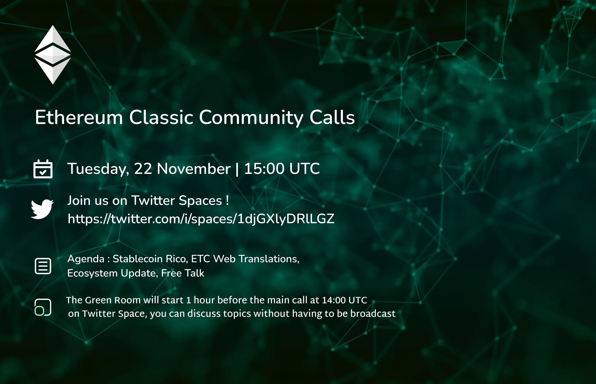
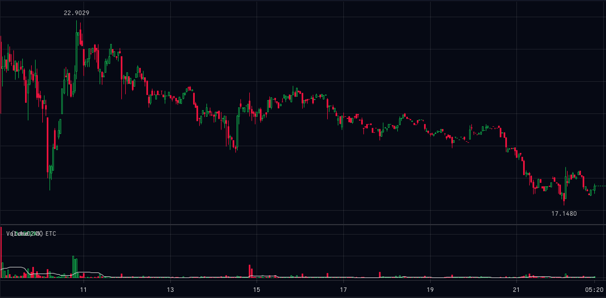
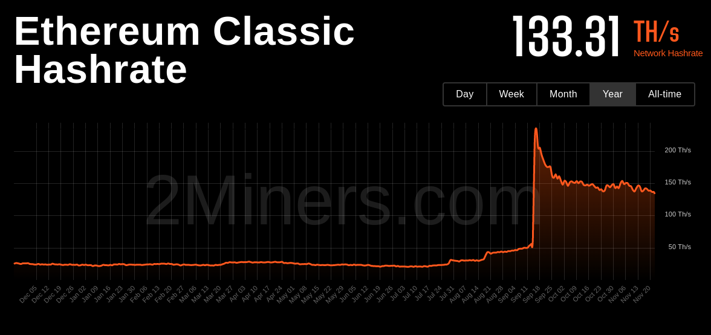

- [1500 UTC Main Twitter Spaces (Recorded)](https://twitter.com/i/spaces/1djGXlyDRlLGZ)
- [1400 UTC Green Room (Not Recorded)](https://twitter.com/i/spaces/1nAKErowZayGL)



A casual voice chat to discuss ideas for ETC. All are welcome.

**This week we are testing out Twitter Spaces!**

For those of us joining us on Twitter for the first time: this call has been held weekly on Tuesdays at 1500 UTC in the ETC community Discord server at ethereumclassic.org/discord. We're experimenting with Twitter Spaces.

**Join the Green Room 1 hour before we go live to chat offline**

This voice chat is an open discussion so please feel free to jump in any time. Please use the raise hand emoji if you want to speak and we will grant you access, twitter spaces limits this to 10. Please be reminded this is live streaming on YouTube, so if you are on the mic please follow Twitter's rules. As this is our first time on Twitter, please let's try to keep things respectful.

You can also post questions and comments on Discord in #community-call-notes, on Twitter, or on YouTube we'll try respond to your messages.

You can find the agenda in a reply to this space, which contains links to everything we talk about.
 
## Agenda

Vitals, Ecosystem, Twitter Spaces, FTX Fallout & DCG, Coop Infrastructure Grants, Mastodon, MegaBridge, etc.

## Gratitude

Brolal, d_a

## Last Week in ETC

Overall, unsurprisingly bearish week due to wider ecosystem trends. Whole crypto market is down due to FTX scandal, which we will get into and how it relates to ETC later.

### Vitals

**Not financial Advice!**



- Where is volume highest, (ronin)?



### Ecosystem

- ethereumclassic.org now in Chinese https://ethereumclassic.org/zh/
  - https://github.com/ethereumclassic/ethereumclassic.github.io/issues/992 Below is the proposed schedule for launching new locales, one each week.
- ETC Cooperative 2022 Q3 Report https://etccooperative.org/posts/2022-11-17-q3-report-en 
  - Initiated Erigon development work, a Go-Ethereum fork that reduces bloat: Full synchronization on ETC took a few days, and used about 160 GB.
  - Gnosis Safe to ETC mainnet and Mordor testnet: Ethereum Classic Safe
  - Documentation: A website for “Risk Evaluation of 51-Percent Attacks on Ethereum Classic” has been created so the community can further trust the ETC blockchain. https://meowsbits.github.io/51-percent-docs/, showing ETC has 6x the more then the next ETHASH Mining
  - Ended September of 2022 with liquid assets, including cash plus $ETC, of over $5.5M USD.
  - Budgeted spending was $414K USD to the end of Q3 but actual spending was only $239K USD.
- Who is Bob Summerwill? https://www.youtube.com/watch?v=cbZ6mZKduD4

### Show and Tell

- Anything missed above, new apps, nfts, projects, comments from participants?

## Topics

### Twitter Spaces

- Twitter Spaces
  - Anyone want to say hello?
  - Anyone familiar with Twitter Spaces? Can you help in some way?
  - Just testing
  - Bare with us
  - No Video 
  - Moderation

### FTX Fallout Continues: Impact of DCG, Grayscale, ETCG. Metrics/Vitals?

- DCG exposure to Gemini
- May effect ETC price if DCG is forced to sell ETC
- FTX fiasco is still not over, and regulators are using this to punish crypto
- Reality is that they could have been leveraging pokemon cards, not really to do with crypto

### Ronin's question about infrastructure grants

What's going on with ETC Coop infrastructure $250k grants? It's been about a year without material progress on donated funds from Grayscale. Solution GitCoin and have the grants up within a week.

### Mastodon

- https://ethereumclassic.network domain as a Mastodon server. Names to be issued to contributors. Allows ETC community to link their twitter handles to a vanity masodon name. @username@ethereumclassic.network

> thinking about incentives for participation and the POAP stuff. We are thinking about NFTs, but what about a real life account that will populate all over mastodon.  
> 
> Potential reward for contributors: @username@ethereumclassic.network mastodon username accounts that you can bridge to any of your twitter accounts via:
> https://crossposter.masto.donte.com.br/
> 
> My understanding is setting up the server would be about $6/mo on costs for the service. Could be a good use for this domain if it incentivizes contributions. Chat about it, let me know if there is an appetite for it.
> 
> and the proof of contributions would be a way to earn these names. opposed to something like an ENS where you pay for the name.
> This would also allows us to have a historical record of accounts via the twitter linking, so if the users account is banned on twitter, they can relink their new twitter account to their vanity ethereum classic mastodon and keep posting (thinking of Donald here with his frequent twitter names). So @DonaldMcIntyre@ethereumclassic.network would maintain a feed of all his posts despite changing twitter names due to their ToS or whater, as an example. 
> Also perhaps we could brand/theme up the mastodon instance and give it an ETC feel for users.

### MegaBrdige Idea

- Building on the firehose idea mentioned previously
- One channel to rule them all
- Discord, Telegram, Matrix, Twitter, Mastodon, Github, etc.
- Moderation

## "LAN Party" Idea

- Pump nights

## Etcetera

- Web Updates, Automations, Auto-adding content, https://nvu.io/en/bots/discord-translator, Auto add Youtube, weekly top tweets
- Nomenclature: Profitability, Profits, Block Rewards, etc.
- Tweet Bank
- Rico

## Free Talk

## Sign Off

#ETCtweets reminder

See you next week, same time same place.

---

## Full Transcript

```webvtt
WEBVTT

NOTE no-names

1
00:00:58.260 --> 00:01:01.010
Community call number 32.

2
00:00:58.260 --> 00:01:04.130
today is the 22nd of November 2022.

3
00:01:04.140 --> 00:01:26.570
this week we are doing something a little bit different we're on Twitter spaces for the first time so if you are joining us for the first time on Twitter the serum classic Community call is a weekly voice chat that happens usually on the ethereum classic Discord server at ethereum classic.org Discord but this week and maybe from now on we're going to

4
00:01:23.220 --> 00:01:44.149
be testing Twitter spaces we usually have a thing called The Green Room one hour before each call which is a separate Twitter space that is not recorded but this call is an open discussion so please feel free to jump in at any time and you can request to speak via Twitter spaces

5
00:01:40.380 --> 00:02:01.910
and one either I or browlow the co-host will try and approve your request to speak you can also like raise your hand emoji if you want to speak in that way and we can grant you access this call is going to be streamed and is currently streaming on YouTube so if you're on the mic please follow twitters and YouTube's rules as

6
00:02:00.299 --> 00:02:21.110
this is our first time on Twitter please try to keep things respectful and please bear with us if there's any technical things as we get used to the platform on Twitter spaces you can also post questions and comments in the Discord on the community call notes channel on Twitter or on YouTube and

7
00:02:19.140 --> 00:02:39.350
we'll try and respond to these messages you can find an agenda of this call in a response to this space that I made on Twitter and that contains links to everything we're about to talk about so uh hello and welcome everyone and I hope this uh this new Twitter space thing works

8
00:02:39.360 --> 00:03:00.890
the agenda this week is uh as usual we have the vitals ecosystem updates we're going to be talking a bit more about Twitter spaces and open up discussion there the FTX Fallout and how this might affect DC G and Etc in turn uh talking about Co-op infrastructure grants Mastodon and some ideas about Bridging

9
00:02:59.280 --> 00:03:24.589
the different ethereum classic communities and of course there's always going to be the free talk section at the end so first of all thanks to Bro Lau the co-host for helping with streaming this on YouTube and D underscore a for the graphics and let's jump into it unsurprisingly

10
00:03:22.140 --> 00:03:43.190
bearish due to the wider ecosystem Trend largely due to the FDX Scandal which we will get into a little bit later but yeah ethereum classic went from 22 down to 17 this week and that follows basically the whole cryptocurrency Space in terms of hash rate uh it

11
00:03:41.700 --> 00:04:06.050
didn't really make that much of a difference I mean there's a slight drop down to 133 terahash but we're still in the kind of uh floating along stage um post merge so uh not looking too bad on the security front before

12
00:04:02.720 --> 00:04:26.870
I go ahead I just wanted to check if we have anyone that wants to become a speaker who is not a speaker this might take some time to get used to I apologize uh we got Etc Co-op inviting him to speak inviting a bunch of people to speak

13
00:04:21.780 --> 00:04:42.350
okay week is that the ethereum classic.org website is now in Chinese so you can visit

14
00:04:38.880 --> 00:04:59.629
ethereumclassic.org zh and that will take you to the Chinese version of the website which is currently just machine translated so essentially Google Translate and there is a banner at the top of every page uh encouraging Chinese speakers to contribute translations and

15
00:04:57.000 --> 00:05:18.590
if you are a speaker of any of those uh languages which are announced in the blog post that you'll see on the website then please come forward and help us with translations the uh the translations that we're looking to publish uh in the next few weeks

16
00:05:15.660 --> 00:05:37.969
are Korean Spanish Japanese Russian Vietnamese Arabic Turkish Hindi Thai Malay Croatian Greek Dutch French German Italian and potentially Cantonese and if you have any ideas about changing the order of that or additional languages that you might be able to help with please again uh look

17
00:05:35.039 --> 00:05:53.210
at the the link on the website to the translations progress schedule and volunteers issue on GitHub we would really appreciate you helping us out there have released their Q3 report of 2022.

18
00:05:53.220 --> 00:06:15.110
some of the highlights include notes on the Aragon development which is a a go ethereum Fork that reduces bloat and allows synchronization of ethereum classic much more quickly which is uh seemingly a no downside upgrade for the ethereum

19
00:06:12.539 --> 00:06:33.890
classic Network and I think this would make uh participation in a similar classic a lot easier on Lower End Hardware so I think that's a a really awesome thing to keep an eye on and hopefully that becomes a a good to go project from the co-op they

20
00:06:32.220 --> 00:06:52.730
also launched gnosis safe which we talked about last year and there is uh a new documentation website about evaluating 51 attacks on ethereum classic and that was created by now bits uh to show how Etc has basically six times more security

21
00:06:50.160 --> 00:07:12.469
than the next ethash mining algorithm which is I believe fpow Financial details as well if you're interested in that and you can find it on the ethereum classic Cooperative website also

22
00:07:09.900 --> 00:07:33.950
just before the call a video was posted by Etc Cobb called who is Bob summerwell which has some interesting history and uh a bit of backstory inter Bob's uh involvement in ethereum classic and ethereum so I I just listened to it for the call it's pretty interesting participation

23
00:07:31.380 --> 00:07:51.529
now again apologies for the uh sort of clunkiness of this I'm still trying to get used to the Twitter spaces thing but uh if anyone has any new apps nft projects or comments that they wanted to make before we move into the main topics of the chat now is the time and please raise

24
00:07:48.539 --> 00:08:11.749
your emoji hand or request to speak if you'd like to the floor's open for a minute at

25
00:08:08.699 --> 00:08:30.170
the moment so I will move on and hopefully uh we will get some participation topic and okay so it seems like someone I'm just reading the uh the discordant someone does want to uh request

26
00:08:27.900 --> 00:08:49.730
to speak still getting used to this apologies that are trying to speak but maybe are not logged in um for those of us coming from Discord that

27
00:08:47.399 --> 00:09:08.930
might have found this Twitter spaces thing to be new one of the downsides is that you need to use the application I think so it has to be on a mobile app in order to use it in order to speak that is you could listen without any participation on the web browser but in order to speak you

28
00:09:07.019 --> 00:09:27.530
need to download the app and use it that way so that was one of the limitations we found and uh perhaps should have communicated before this call but uh yeah I can see that someone is I hope uh Ronan wants to talk but is not able to because of that I think so uh we

29
00:09:25.560 --> 00:09:46.130
will move on and maybe he can download the app and log in that way and then join us later in the meantime let's talk about Twitter spaces and I guess that's one of the downsides is that uh the the app is kind of new and doesn't have a web browser version yet it

30
00:09:43.500 --> 00:10:04.009
also doesn't have video sharing so for the previous presentations we've been talking about and sharing on the Discord server we're gonna have to find a workaround for that uh if anyone wants to jump in and any

31
00:10:02.160 --> 00:10:22.250
way to solve that problem then please do and I'm seeing a lot of uh listeners but not many uh people that want to speak believe

32
00:10:19.380 --> 00:10:43.790
you have to go into the uh the app and uh version so turn into just a podcast of myself just

33
00:10:41.519 --> 00:11:03.590
testing please bear with us and uh yeah download the app if you want to speak so first topic other than Twitter spaces is the FTX Fallout that is ongoing and there have been some uh potential concerning uh developments in terms of dcg

34
00:11:00.300 --> 00:11:21.829
digital currency group I believe and their exposures to Gemini which appears to have had some contagion risk from the FTX uh Saga and obviously dcg is a large ethereum classic holder so it may be that serum classic is indirectly

35
00:11:19.380 --> 00:11:40.370
affected in a yet another way uh that is uh over and above the multi-chain uh liquidity exit that uh Ronin recommended last week so yeah

36
00:11:37.560 --> 00:11:59.750
Genesis oh Genesis right is it gemini or Genesis I'm not sure which one it is I thought it was Genesis okay and is uh Genesis the one that dcg has exposure to right uh no I know that uh I don't know if they have exposure to them but I know that Genesis uh lent two points some billion

37
00:11:57.180 --> 00:12:18.170
dollars to uh three Arrow capital and uh getting ripped on this and I don't think it's it's like anyway they're finished circle of it's pretty much what Sam said on on the when

38
00:12:15.959 --> 00:12:38.509
he testified he did exactly what he said what he said when he testified what was that pretty much you just take and recompound and just kind of like you know just re-leverage everything until

39
00:12:33.420 --> 00:12:55.129
you know they can catch on to it gonna say everything what he said but you know you just gotta he pretty much described a scam and that's what he did yeah it seems like the more this thing develops the more crazy stuff is being uncovered

40
00:12:52.920 --> 00:13:13.790
and it just gets worse and worse as time goes on it's pretty crazy thanks for joining us Bob we're having um uh discussion right now about FTX and the

41
00:13:11.339 --> 00:13:32.990
potential exposure that uh dcg has to that uh we're trying to figure out exactly uh what might be coming down the line for Etc I am not super worried about the network itself but obviously there might be price implications for that but uh it's

42
00:13:31.019 --> 00:13:52.129
probably one of the the largest events to happen since Mount gox and that would mean probably one of the largest like outside ethereum things to happen since uh ethereum classic was created so pretty pretty big deal I thought that the grayscale already had coinbase

43
00:13:49.800 --> 00:14:11.810
confirm their Holdings even though they don't like I can understand why they don't want to disclose the address like for privacy reasons and just maybe give it to the regular tours or whatever but I I can understand why they don't want to you know give them the address of the Holdings for public to see yeah

44
00:14:08.760 --> 00:14:29.750
I saw uh some pretty level-headed comments from Werner about that um and yeah depending on how the assets are secured then it could be a operational security problem if they I mean they're not like a typical exchange right they're just uh doing an ETF

45
00:14:28.620 --> 00:14:49.730
so or some kind of fund like that so um there may be operational concerns about doing a proof of funds in the typical way so it doesn't necessarily means too really just to the regular tours

46
00:14:46.740 --> 00:15:07.509
right just as long as they can see that okay the funds are there but then at this point of the game who can we really trust in terms of regulations yeah exactly I think the whole the whole thing was the whole trust me bro yeah sorry about that didn't mean to interrupt but yeah the whole trustee approaching is just it's

47
00:15:05.160 --> 00:15:27.530
not working anymore yeah I think the the lesson from this is actually it may have been the the false uh sense of security from Regulators that uh oh we're regulated don't worry that caused the whole problem and allowed people to Pine on a pylon and

48
00:15:23.579 --> 00:15:44.750
in absence of that people would have been defaulting to the uh don't trust verify uh which is ideally the first thing everyone should be doing so I guess uh in a lot of these Cycles there's a there's a whole bunch of people that like don't they

49
00:15:43.079 --> 00:16:03.290
didn't have exposure to the history so they weren't there when Mount Cox happened they weren't there when the Dow happened and uh they just thought oh hey it's uh it's regulated so there's no problem right but uh I guess this is the first time that this

50
00:15:59.820 --> 00:16:20.509
particular version of such a big problem has happened but uh hopefully people have learned a big lesson this time unfortunately a lot of people are probably going to be uh quite uh yes it's a sad event because at the end of the day it causes real life uh suffering

51
00:16:18.899 --> 00:16:41.389
so I hope that uh well there's nothing to have to happen you're right you know because if you think about it if it didn't happen that bubble would because all Sam did is created a bubble right and that bubble kept going and growing with these IOU Bitcoins and this

52
00:16:37.560 --> 00:16:59.030
uh you know re-leveraged uh loans and everything else so it had to be bursted so sooner or later so it's good that it's happening now other than when Bitcoin gets to a hundred thousand because then it would hurt is

53
00:16:56.040 --> 00:17:18.230
Rona yeah we got you all right gotcha gotcha yeah so um so just to add on to that um so I was reading a little bit into it uh the Bitcoin price on uh grayscale's um G BTC I think and you know that's selling or that's selling at a very low price

54
00:17:15.000 --> 00:17:37.850
and uh what I was thinking with this is we're seeing we're seeing a similar thing with etcg and so uh some people are speculating that um you know if uh I guess if the price starts to reach more to parity it's likely with the Bitcoin at least it's likely

55
00:17:34.919 --> 00:17:55.490
that uh that things will correct and then uh if it gets a stronger um gap on on those prices uh it's uh going in a bad Direction um I personally I I don't really know I've never really used uh the gbtc as an indicator

56
00:17:53.460 --> 00:18:14.810
like that um but I I guess essentially they're saying what you can do is you can open up a short on BTC and then you buy gbtc and the thought is is that um that that would bring price parity together you know back back to normal but I mean it's totally

57
00:18:12.240 --> 00:18:33.710
unhinged right now and I was just checking out uh etcg and that price is around five US dollars so you know where we're seeing on the free market it's uh 18 today so it's interesting to watch um uh

58
00:18:33.720 --> 00:18:56.029
uh it's insane what Genesis did it sounds like they they got hit with a billion dollars from Terra Luna and then they did 2.3 billion or something like that of ftt like within the last three uh three months so um it's absolutely insane that that's what's

59
00:18:53.340 --> 00:19:13.730
going on but uh yeah last time we had the Twitter spaces this is what I was talking about I had heard through my circles that market makers were pulling all their liquidity off and turning off and when market makers are leaving the market to protect themselves that's frightening

60
00:19:10.440 --> 00:19:31.669
so I think there's a lot of stuff going on on what they call dark pools so it's uh liquidity pools that you can't necessarily see this is you know on uh on centralized exchanges and OTC desks um

61
00:19:28.559 --> 00:19:49.370
not on on anything that the retail would see and in dark pools there's just a lot of activity and that's essentially what the blow up of Genesis trading is is that's dark pools um that are affected by the FTX thing and so um this is kind of what I was alerting

62
00:19:46.500 --> 00:20:10.490
you know weeks ago um when FTX started and I was saying listen like get your assets to your keys you don't know how deep this is going to go and it's I it may sound sound hyperbolic but it's like they took a bunch of funny money and they got their fingers in so many aspects

63
00:20:06.179 --> 00:20:27.770
of crypto and no one knew it right there's like four people that knew that they were doing this stuff and so there's gonna be problems like this all over because of the sheer size of the transactions that we're doing like like genesis is exposing this you know three billion

64
00:20:24.900 --> 00:20:44.990
dollars right there FTX had a had a um eight billion dollar hole after Connie and people for billions of dollars like genesis right so think about how big their hole probably really was before all of the alleged fraud I guess is what you should say to be legally

65
00:20:43.200 --> 00:21:04.370
correct um it's it's crazy and so I think for retail what what's nice about this is if you look at like the stock to flow models we're starting to break those and that's because this is such a big event this is creating an amazing buying opportunity for people that have never been

66
00:21:02.700 --> 00:21:22.850
in the space um but it's not like it's going to correct tomorrow so I think uh so I think anyone that's getting their money into the market you need to be very careful and understand that it's a very very Rocky Road to get back uh to normalcy and to build back confidence and

67
00:21:19.860 --> 00:21:40.850
all of that not to mention we just have the traditional Bitcoin having cycles that are going on right now so outside of all of this you have massive Bitcoin minor capitulation happening in addition you know at the same time and uh and so um

68
00:21:39.120 --> 00:21:59.570
anyways there's just so many things going on and it's all super bearish and uh it's kind of on the Bitcoin cycle so it's kind of what we expect this is the time of capitulation so please uh don't think that it's out of the ordinary in our Cycles um

69
00:21:56.220 --> 00:22:16.250
but the events themselves are very out of the ordinary we're seeing stuff that you know people didn't think that we'd be able to see you know this reminds me of Mount gox and like some of the very early history uh where crypto exchanges would be seized by the federal

70
00:22:14.220 --> 00:22:34.250
government and all sorts of crazy stuff so to all the new people in the industry welcome this is why they call crypto the wild wild west but um with f with these type of events you have volatility and volatility is opportunity to make money so just be wise with that um

71
00:22:32.760 --> 00:22:53.330
and uh appreciate that there is volatility so if you ever wanted an asset uh these are opening opportunities for you to buy it very very low uh prices so that's just my take on it yet

72
00:22:51.120 --> 00:23:12.230
and I think there's uh a good we could be in another like two-year at least thing uh because of all the The Fallout and who knows where it's gonna go but uh you know I think otherwise I think actually what's going to happen is because if you think about it all of these uh institutional investors

73
00:23:09.720 --> 00:23:32.930
they've been uh eyeing Bitcoin and everything else for so long and you know where there's fear there's always greed and I think theirs is going to get too greedy and eventually it's going to start you know trying to when it's go when it goes up I think it's going to happen really fast conspiracy

74
00:23:30.720 --> 00:23:51.230
to crash the price of crypto so that the elites can buy up honestly that's what I think I mean call me a conspiracy theorist but I think here's what happened they got the the dirty Bitcoin to dump you know and then create panic and everything else to

75
00:23:47.640 --> 00:24:09.590
short and get all this money and then just buy all the clean Bitcoin they can once the price is low enough but the thing is there's going to be so much greed we got you know BlackRock and everyone else all right just just drooling over Bitcoin and they just can't wait for the price to drop down low enough for them to start buying because that's what it is we're at a point

76
00:24:07.020 --> 00:24:29.390
where it's like you know this is when the institutional investors are really going to come in you know uh I I think we're at a stage where we're we're about to see the real flush of all of the vaporware products and networks that

77
00:24:26.580 --> 00:24:47.690
came out in this last cycle uh this is what we typically see is you know yeah prices get hammered down and everything but this is where um these centralized products the vaporware that really has no value it really disappears for the next cycle um

78
00:24:45.480 --> 00:25:06.169
and and so if you look at the top 50 coins from 2017 you know and any cycle before that um you'll see there's like there's like at during that bull cycle there's all these coins that come out and then in the bear cycle they all get washed and then

79
00:25:04.440 --> 00:25:24.890
the next cycle repeats and it's like what's the next things that takes off and um and so I think that's what's gonna happen and so so I think uh like Bitcoin and and you know some of the ones that have real intrinsic value I would say ethereum classic is in there um and

80
00:25:22.679 --> 00:25:42.769
I would say Monero you guys know I'm a Monero fan like that's in there those things yeah their price will get hit but they won't disappear right um and that's what we're seeing is we're seeing those prices hit but I think etc's at market cap 26 so I'd expect it actually

81
00:25:38.880 --> 00:25:51.110
to climb quite a bit um but like for instance here's one that's dropping like a rock and that's Solana Solana is now at 18.

82
00:25:47.100 --> 00:26:08.450
yeah I was just thinking that too like how Solana's still alive how is it yeah right well I think all the uh people have to get flushed out right and I think that they have um staking where like you you get locked up for like 30 days or something like that

83
00:26:06.419 --> 00:26:29.450
so people might be trapped in Solana right now and then trying to sell and might slowly sell over time but like that's a prime one that I expect that to be out of the top 100 market caps when this flush is finished you know that's definitely one that should die yeah

84
00:26:24.059 --> 00:26:46.070
I think all the chains that have a pre-mine where there's a handful of people that hold the vast majority of coins unlike Bitcoin unlike ethereum classic all those chains whose holders are going to be forced to liquidate because

85
00:26:43.919 --> 00:27:04.850
they need money um they are gonna see massive price drops because of that centralization of ownership yeah and that's that's exactly the issue right is it's it's the launch and it's the scam of doing a massive pre-mind controlling all of the supply giving a small

86
00:27:02.340 --> 00:27:22.370
circulating Supply that's exactly what Sam uh did with ftt right is they they issued to the public or to the VCS or any anyone a very small amount of ftt and it allowed them to pump the price up due to that low circulating Supply and then

87
00:27:20.880 --> 00:27:41.630
that allowed them to take their massive amount of pre-mine and just continue to dump it into the ground and uh or in this I'm sorry with ftt with their their case it was they took loans and put it up as collateral but other projects can't take loans out and use their token as collateral so they Dump It

88
00:27:39.240 --> 00:27:59.870
To The Ground uh and they try to do it in a discreet way they'll try to do OTC stuff like that where it doesn't just cause a red needle um they also um there's um what is it t t w a p I think is a way to slowly sell off and essentially it's a

89
00:27:57.600 --> 00:28:20.029
setting where you just uh say I want 11 million dollars with this token sell it over the next three months right click a button and and it just slowly it's an algo that just slowly sells off um so anyway so there's all these little you know ways that they can dump uh but exactly what you're saying in Astoria is they're

90
00:28:17.220 --> 00:28:40.250
heart pressed for cash their token's not worth much right now and they likely have a bunch of USD costs or uh Fiat costs development servers whatever it may be and they're centralized so they have all of the costs themselves right and so to keep things running like Solana and those they

91
00:28:37.080 --> 00:28:58.909
likely have a big a high burn rate um opposed to a network like ethereum classic that is decentralized and bulletproof and you know all of us can disappear and the network will still keep running due to other people around the world um so it's just and that's that the value of blockchain right blockchain is pretty

92
00:28:56.580 --> 00:29:21.169
useless unless you have the decentralized element that a global distribution that censorship resistance all the stuff that we preach about this is where it shows hey there's value that's what you're investing in that is the tech you're investing in uh

93
00:29:18.000 --> 00:29:38.690
because a lot of a lot of the selling and the Panic is because people don't can't differentiate the difference between the entities centralized entities that have trouble potentially like um dcg grayscale coinbase FTX Etc

94
00:29:37.080 --> 00:29:57.769
and the blockchains themselves people think that the blockchain is going bankrupt um so just for anybody who doesn't know the blockchain is one thing it's decentralized especially proof of work blockchains and they don't have assets and liabilities they only have accounts and balances and they're absolutely separated

95
00:29:54.840 --> 00:30:16.909
from the centralized entities that may go bankrupt or not who are managed by humans Etc that's one thing the other thing is that in the case of dcg dcg is a holding company that has several um subsidiaries and legally their

96
00:30:14.279 --> 00:30:34.850
subsidiary which is the broker dealer which is Genesis um that can go bankrupt if because they have typical broker dealer counterparty risk and if they were dealing with FDX and they have assets there they may they have

97
00:30:31.559 --> 00:30:52.250
may have lost assets there or just because of systemic risk you know because sometimes when one dealer in a network of dealers if one big dealer Falls then others can fall not because they were insolvent but just because they had acids in the other in the other dealer so

98
00:30:50.039 --> 00:31:12.230
that one can go bankrupt that doesn't mean that ECG is going to go bankrupt it's it it's very likely a limited liability company uh on the other side um dcg owns grayscale grayscale as a Investment Company or as a mutual fund company has

99
00:31:09.240 --> 00:31:29.269
to segregate funds client funds so it's highly unlikely that Bitcoin etc etc that is in their funds in the funds of grayscale are not segregated unless there is fraud which I think is very unlikely um

100
00:31:26.159 --> 00:31:46.909
so those funds are very likely secure because uh legally at least because they are segregated from dcg and any other company that dcg may own doesn't matter if other companies go bankrupt and in the case of um of coinbase which is the custodian coinbase

101
00:31:44.299 --> 00:32:04.549
also has a similar situation coinbase the holding company or the exchange company that company may go uh bankrupt but that doesn't mean that their unit the custody service which is a Trust Company uh will go bankrupt or that those assets are

102
00:32:02.220 --> 00:32:22.850
not segregated the the the the division of coinbase that is the custody service is very likely all segregated assets and isolated inside the blockchain and not legally tied to any asset or liabilities or risk they're just isolated in in accounts and it's not

103
00:32:21.299 --> 00:32:42.889
one account one address that you can go and check out uh they're because of their security system they must have thousands of addresses and the funds must be separated in thousands of addresses on on the Bitcoin blockchain but the important thing is that in the legal layer in meat space legally

104
00:32:38.880 --> 00:33:00.169
the funds of grayscale those isolated entities have to be segregated in terms of funds and they have the assets on coinbase and that unit of coinbase which is coin coinbase custody has to have their assets

105
00:32:56.700 --> 00:33:19.130
isolated as well so those that that segment of the market is not at risk the ones that are the ETFs and the the the the assets of the mutual funds the entities themselves Genesis the broker dealer dcg even as a holding company and coinbase

106
00:33:16.140 --> 00:33:36.409
as a holding company those they do have systemic risk they they do have assets and liabilities and they can go bankrupt but not the gbtc or edcg and those products and all of this the caveat is unless they committed fraud open

107
00:33:33.600 --> 00:33:54.289
fraud no in that case right now it's just stolen funds Etc but if everything is normal those funds should be segregated and safe Shuffle touch that Donald yeah just to just to clarify something that I said before I wanted to make sure I

108
00:33:52.320 --> 00:34:13.730
got this on record I I accidentally said Gemini at the start so I got confused with Genesis and Gemini so yeah um Bob was just uh making a comment in the Discord that I wanted to mention here so Gemini Genesis grayscale and dcg are all potentially in the mix it seems with Genesis having made a huge bad loan and

109
00:34:11.460 --> 00:34:34.190
then uncertainty within the dcg group as to how to resolve that situation allegedly uh Wednesday is when some resolution is needed sorry what was that brother problem

110
00:34:32.520 --> 00:34:53.510
is people aren't you know they're not buying the coin itself they're they're buying Perpetual swaps you know they're trying to Long Bitcoin along this coin along that coin they're not buying the coins themselves and we're drawing the coins from the exchanges they feel so comfortable keeping it on Exchange and I think

111
00:34:51.240 --> 00:35:12.050
you know this also is good that people understand that if it's not your keys it's not your coins so if you keep it on the exchange you don't have that coin and you don't you know you're not gonna get that coin if anything happens more than likely and if you do it's not going to be for years because I'm still waiting on my cryptopia uh uh coins that were

112
00:35:10.500 --> 00:35:31.190
stolen you know back from night 2019 and just now they're doing the the accepting the balance so it's very important but the reason why we got we got to this point and somebody said it before it's because everybody kept buying ious and leverage their trades and you know they're re-leveraging and this

113
00:35:29.099 --> 00:35:53.030
and that and instead of buying the real deal you know and that's how we got here if everybody was bought constantly was DCA in their Bitcoin and everything else and withdrawing it from the exchanges to huddle or whatever we would not be this deep um

114
00:35:49.619 --> 00:36:11.210
I think in uh in reality it could have been any asset that FTX were uh selling here it it just so happens to be crypto and it's not really uh anything to do with crypto itself it's more to do with the scam that use crypto as a means to entice people to use it could have been Pokemon cards or Beanie Babies

115
00:36:09.000 --> 00:36:29.930
exchange but it just so happened that crypto was in the firing line for this one is that it's all a one-directional movement and so it's not organic and that's putting stresses on any system in each centralized or decentralized um

116
00:36:27.780 --> 00:36:48.410
and so that's why what you're seeing as an example of the decentralized risk that's going on here is we have these great decentralized systems that do wrapping and all this stuff um but you're still seeing that because it's a One Direction of liquidity that uh is unexpected and unprecedented

117
00:36:48.420 --> 00:37:09.470
um and and really a bad actor trying to uh exploit certain ways to get their money out we're seeing the ren BTC so the wrapped BTC on the ren Network that's what the FTX hack which is you know who knows who I don't think anyone believes it's really a hack but the FTX drainer

118
00:37:09.480 --> 00:37:30.050
um is cashing out their eth for that ran BTC uh but because they're doing it at such volume you're seeing Crazy Prices you're seeing all this fluctuation going on um and it looks like um I'm reading that there's only like 3 000

119
00:37:27.240 --> 00:37:47.329
Bitcoin that they can even uh that they can even cash out to so they have they've essentially converted that those stolen funds to a bunch of ethereum but they know the censorship risk of ethereum so now they're trying any Avenue to get out of that censorship trap

120
00:37:47.339 --> 00:38:10.910
um and that's where they're trying to use D5 protocols because they are good protocols it's just they don't have the type of liquidity to pull off this type of heist right and this is they just are doing it with so much money so anyways there's a great account to follow uh oddly

121
00:38:06.660 --> 00:38:26.750
it's named Ergo like the uh chain that stole our Twitter account Ergo BTC and this guy AI has been tracking on-chain wallets and activity forever and uh so I highly recommend giving that a look uh to just see what's going on with

122
00:38:24.960 --> 00:38:46.250
these type of moves um he's been tracking hacks Forever on on chain and has really nice graphs and kind of walks you through uh things with threads um so it'll help novices that are kind of wondering why are these prices moving like crazy and what what's going on uh it's because uh they're hitting low liquidity

123
00:38:44.579 --> 00:39:05.089
pools and shaking things around uh the FTX stuff is also please remember that the prices you see on coin gecko or CMC they just come from a collection of liquidity pools and so when people like market makers pull their money off the table because they see

124
00:39:02.700 --> 00:39:23.270
huge systemic risk and they need to protect themselves by sitting it out on the sidelines that means there's less liquidity on those centralized exchanges so I'm guessing if we looked at the order books of these centralized exchanges it they would be a lot thinner so that means if you sell anything with any

125
00:39:20.820 --> 00:39:42.890
sort of volume you'll tank the price or you can also shoot up the price very quick if you buy stuff so just keep that in mind when you start seeing prices going wild especially on Lower cap coins that'll definitely happen as market makers pull their money off of the lower cap

126
00:39:40.079 --> 00:40:04.970
tables that have higher risk and uh and consolidate into only operating on the big liquidity pools like BTC to usdt right so that's just kind of some Logic on what's going on on the back side in the markets and liquidity r-a-r-a-g-r-r

127
00:40:02.599 --> 00:40:23.450
on the Discord um take a break relax preserve capital and wait for a market structure flip if one still wants to DCA dollar cost average Please be aware that 12.50 USD level can be lost so toe dip and wait for price to grind to the bottom

128
00:40:23.460 --> 00:40:43.670
obviously this is not Financial advice but uh you know the price of Etc could go anywhere but I think um that there's a couple points I wanted to make here one being that uh this is probably also going to be used as a an excuse to try and clamp down on regulations and we've already seen some uh

129
00:40:45.420 --> 00:41:06.170
think can you hear me bro uh uh so yeah uh regulations are probably gonna come at least in the US talking yeah brother I I hear astora I can hear you

130
00:41:03.300 --> 00:41:23.630
as well um so yeah regulations are on the horizon and that might uh affect the whole crypto space but

131
00:41:21.599 --> 00:41:42.650
what really matters are the fundamentals and it's something that Etc has always been uh pushing and regardless of what happens with the price those fundamentals are going to stay so it's like the market cannot appreciate them for some period of time until they're forced to and it seems like that

132
00:41:39.720 --> 00:42:00.530
time is coming so uh strap on because it's going to be an interesting ride yeah and that's a that's a great point on uh this is why a predictable monetary policy is so important and it's so great that we have the 5m20 uh policy because we

133
00:41:57.200 --> 00:42:18.589
know how much will be emitted on our Network and uh and we know when the selling pressure due to the emission amount decreasing will relieve and so um so that you know you can build you know thoughts on I guess I I think that that's

134
00:42:16.680 --> 00:42:38.890
kind of the basic Foundation of stock to flow on bitcoin uh we could probably build something for that for ethereum classic uh it would be more gradual due to how ours is set up um but yeah all of that stuff by having constants by not changing all the time by not having one central figure like vitalik

135
00:42:36.599 --> 00:42:58.130
that you know decides whatever monetary policy um and and their wild monetary policy right they go They're you know three percent inflation one time and then they're trying to be now they're trying to be deflationary um you can't withdraw any of your staked youth I mean there's all sorts of think about

136
00:42:56.099 --> 00:43:17.990
all those issues we don't have any of that stuff ours is slow and steady uh very predictable and that's what you want out of money that's that's what makes Bitcoin great and that's what makes Etc Great yeah it ties into that thing about uh you know you don't want to move fast and break things so something so important and

137
00:43:14.819 --> 00:43:36.290
like also following the protocol is such a massive benefit in situations like this because regardless of what pressure comes from outside nothing can change it and that is something so unique and so undervalued uh at least in this cycle but uh as mentioned I think that is about to change yeah

138
00:43:34.319 --> 00:43:54.410
I was uh I was speaking at some conferences about Etc uh recently and people were saying oh there's no innovation happening there there's no you know like all the Innovations happening in all these cool chains blah blah blah blah all this new stuff and it's like yeah that is great Innovation and if it's evm compatible it actually is

139
00:43:51.720 --> 00:44:12.829
innovation for our network but we are actually innovating here we're innovating in the decentralized the censorship resistant way that those type of things that are often forgotten uh but it's that resilience that's where our true Innovation is not many other networks are doing that as an example the

140
00:44:11.220 --> 00:44:31.609
way we're operating our Twitter accounts I haven't seen any other project doing that Twitter together those are the type of things that we try to solve um granted it comes with uh very public contentious problems where we have client maintainers running running out and

141
00:44:29.040 --> 00:44:49.730
trying to hijack the network or um or our Twitter account getting stolen we have all sorts and stuff like that but that always presents opportunities for us to decentralize further to build better to remove as Donald put it the meat space from the network and decouple that um and I think that that's our real Innovation

142
00:44:48.119 --> 00:45:08.569
and I think we're doing great on that um and I hope you know as we bring in more people into this network and we grow that that continues um and as as bigger money comes in I hope that they hold those uh principles and values like for instance bit Main and those

143
00:45:06.060 --> 00:45:29.329
I hope uh I hope we don't see try to see corporate capture anything like that because if you try to corporate capture Etc you actually are trying to devalue it and so um so I hope uh I hope we really keep those principles and keep innovating in that way especially as big money starts coming in so we don't fall into

144
00:45:25.560 --> 00:45:46.250
the Trap of uh the VC Ponzi schemes that we're seeing collapse Solana and all these other uh Networks Etc literally innovates every time they declare Etc did of

145
00:45:43.800 --> 00:46:03.890
death knocking on the door of Bitcoin and you could easily just replace that with Etc the number of times oh it's a dead train it's a dead chain but we ain't dead yeah just look at the uh Network ass right it says it all right yeah I mean that's that's been the greatest

146
00:46:01.859 --> 00:46:23.870
story of you know of this year for ETC has been you know I think we've all we always had the thesis that this is what would happen to Etc when East moved to proof of stake um and then the fact that that's a reality now that we have that security and we are the largest uh smart contract proof

147
00:46:21.359 --> 00:46:41.930
of work chain um it's just it's the positioning is amazing and now what what's great about that is bit Mains first coming in with these funds but I guarantee you a lot of these VCS and people will be trying to come in and we'll likely see a corporate capture attempt from someone I'm not saying

148
00:46:40.500 --> 00:47:03.650
Batman I don't know who it will be uh Batman hasn't signaled anything like that but uh we'll see something like happen on Solana where you see the VCS try to do a bunch of projects and uh do those pre-mines and dumping and so I think we should be cautious it'll be exciting to see a ton of money flooding in

149
00:47:00.060 --> 00:47:21.290
here but keep cautious um and uh and don't trust verify right the the classic phrase rise of the Phoenix continues then absolutely there will be corporate interests

150
00:47:18.660 --> 00:47:40.370
that try to take advantage um and capture the system but it has been uh methodically designed in a way and the philosophy and the the protocol itself are so resistant to that that uh maybe there'll be something like the the Bitcoin cash split but there'll always be

151
00:47:37.980 --> 00:47:59.690
something uh called ethereum classic that continues with the original Vision so whether they attempt to uh I mean one one potential scenario here is that in the same way that uh you have massive stable coin uh controllers of D5 that could basically say hey this version of the chain is the one

152
00:47:57.780 --> 00:48:19.550
that we're gonna migrate to and therefore you must use this client if you want to have all the D5 activity that's separate from the protocol and uh I think the protocol is sound and we will run into these kind of contentious debates in the future but that will be a a good problem to have because it means ethereum

153
00:48:17.640 --> 00:48:39.410
classic successful at that point and we can cross that bridge when we get there and I think having having the strong principles that have led us this far will allow us to go through those difficult times when they come think

154
00:48:37.920 --> 00:49:00.290
about it it's kind of like a virgin chain that's completely unmanipulated it's you know from the very beginning it's the original unmodified protocol of the original ethereum chain and there is not a single other chain out there that's like it there's other ethereum Forks so that would

155
00:48:57.000 --> 00:49:19.490
be a fork of a fork of a fork but there is no ethereum Classics or chains alike out there period so you know there's no there's a reason why we have the majority of the miners and their miners betting on two major chains which is Bitcoin

156
00:49:15.540 --> 00:49:38.930
if you look at uh there all-time high for their hash rate it's just through the roof and similarly ethereum classic I mean we're up there collective are pretty uh Savvy and they know

157
00:49:34.920 --> 00:49:55.010
they can tell which projects are potentially having future value and there's so many out there that have been in this game for such a long time they probably have extremely good detectors at this point and yeah as time goes on those projects will just

158
00:49:52.380 --> 00:50:13.370
cease to exist so we just keep on going yeah no and and Donald so it's my understanding that you're gonna start run into marketing campaigns and I think that um this type of content is probably really good uh be uh to to build kind of the to

159
00:50:10.940 --> 00:50:31.670
to uh to share the positioning and the uniqueness of ethereum classic in these type of environments with what's going on right now of you know ethereum classic compared to Solana right and and why why did Solana fail and why will ethereum classic not fail um

160
00:50:29.819 --> 00:50:50.390
I think that that type of uh messaging might be an opportunity uh to just bring the ethereum classic uh value prop to the industry and to new people and then put it in the context of the bad stuff that you're seeing going on right now you know this is happening because

161
00:50:48.720 --> 00:51:10.670
of all of these failures of these other networks and that's how ethereum classic is different so just a thought um as as you get into those marketing campaigns as you've taken on that role the idea is to write about why did Solana

162
00:51:07.440 --> 00:51:29.990
fail and and why did ATC did not fail then and then probably um some other things could be comparing uh the predictable monetary policies of ethereum classic to you know Bitcoin stock

163
00:51:26.940 --> 00:51:47.390
to flow and then uh and how that's very unique to other chains that are failing that don't have predictable monetary policies and and you can't financially plan around but yeah just just kind of the stuff that everyone's talking about we can you can uh we can use that as a base layer to show how ethereum

164
00:51:45.180 --> 00:52:05.450
classic is different and better and you really see that in a lot of uh Bitcoin messaging you know this is a this is a blockchain problem this isn't a Bitcoin problem right they always say that um Jack Ballers it just is great in his interviews of of doing it in about 30 seconds you can get a clip and then it's so

165
00:52:03.300 --> 00:52:25.910
easy for people to understand um so that's good inspiration yes I have I have the majority of the topics in the in the pipeline uh but I'm going to add this thing this idea that why did Solana fail and why did the ETC not fail I'm going to think about how to word

166
00:52:22.740 --> 00:52:44.569
it and um but the underneath is a comparison between proof of work and proof of stake no then likely some of the things you would hit would be a centralized VC uh centralized total out of the total Supply centralized total Supply very small

167
00:52:41.579 --> 00:53:02.809
circulating Supply so retail only has can you know can get 20 of the token right so you it's just all of this stuff that comes into um oh and then and then likely I'm guessing the emissions uh you know how do you even acquire Solana it's all those barrier to entries that create an unfair

168
00:53:00.660 --> 00:53:20.950
deck for the VCS and the people that started it and that's the stuff you don't see in ethereum classic right you can turn on you can turn on something and start mining ethereum classic and start accumulating it um and that's that's why we stayed with ethash and that's you know and proof of work and all of that along with many other things but the barrier to entry to participate

169
00:53:20.960 --> 00:53:42.170
good yeah PC like Bitcoin has no liability it's just it all really is as simple as that there's no liabilities because we don't trust we verify everything so there's no CEOs nobody's running the show there's no uh I mean we do have one team right now uh which is the only thing

170
00:53:40.319 --> 00:54:00.950
that's a bit concerning they only have one team but other than that protocol is roughly in a good spot so it's really just client maintenance but I agree with you that yeah it's it is it is scary that we're only down to to one team

171
00:53:58.800 --> 00:54:20.230
so hopefully that changes um oh another thing Donald uh to hit on would be um tradable the volume and liquidity and like the depth and uh and and how how many markets you know um and maybe integration in the entire greater ecosystem just some other points to some notes in there that I'm just thinking

172
00:54:17.280 --> 00:54:39.049
off the top of my head I wrote it down yeah credit two on the edge for the quote uh if your blockchain has a CEO it ain't gonna make it I think that ring is very true and puts it succinctly and just a couple of comments from Discord

173
00:54:35.940 --> 00:54:57.770
uh we have Bob uh mention a tweet saying that Genesis previously earned 2.36 billion to the bankrupt-free hours Capital so that's a pretty big black hole if it's all gone and then code 203 mentioned that uh market dominance uh climb during downtrend

174
00:54:54.839 --> 00:55:14.990
versus other chains is a good indicator for fundamentals been the gentleman that I was talking on the last call that we had and uh and yeah he was saying that we're gaining market dominance and Etc and that's exactly

175
00:55:12.420 --> 00:55:33.530
uh that's a good way to look at it of trying to figure out all of those other altcoins that are getting flushed out what you'll see is you'll see Solana because it was pumped by all those VCS and put in front of everyone's face in the crazy marketing well that's uh essentially a massive pump and dump and what we'll see is we'll see that Solana will

176
00:55:30.720 --> 00:55:52.730
completely lose off its dominance in the greater space and likely by next cycle that will be a completely obsolete chain that has you know it might still hang around but it'll be way low on the market cap um and uh and what you'll see is good products and good technology like etc for

177
00:55:50.160 --> 00:56:11.450
instance will slowly organically keep increasing um and uh and and also in these times what you see is Bitcoin increases its dominance and that's because people don't pump their altcoins that don't have a chance and that they were hoping to sell it to the greater fool right and then

178
00:56:09.300 --> 00:56:30.530
they run into Bitcoin and so that's what you see and so Bitcoin typically increases its dominance in these bearish Trends because everyone runs to that you'll also see people run to stable coins as well so you'll see dominance increase during that as well so uh good good patterns to look at and you can uh look

179
00:56:27.720 --> 00:56:48.589
at it over the previous uh bearing bull cycles uh to kind of get an idea and get your mind around that type of thinking yeah I'd like to go back to the analogy of the the house built on brogue versus sand and when times are happy and everything's good then yeah you can build a house quicker if it's on Sand and

180
00:56:46.559 --> 00:57:07.190
you don't do the foundations but uh when the storm comes you need to be built on Rock otherwise uh you won't exist anymore so ethereum classic has put a lot of effort into the groundwork and that is paying off now I think and uh the future's looking bright we're in a very good spot and

181
00:57:04.380 --> 00:57:26.150
and just uh so that like I I don't want to seem like I'm just totally on these centralized products that raise a bunch of money and then pump out you know they do pump out development um so there is learning experiences there that we can use by looking at them like for Solana for instance how did they

182
00:57:23.940 --> 00:57:44.270
manage to capture so many people and get them interested in their chain so there's marketing material that you can review from that you can see the order of operations that they built things um you can see where they integrated their uh their token and ran marketing campaigns

183
00:57:41.760 --> 00:58:03.530
to gain new users those are things that we can use to learn and better Etc uh while we have been working on the foundation as you say um we have a very strong Foundation we're at a point now with the network hash rate that now we're more about we're getting towards Outreach and building

184
00:58:01.380 --> 00:58:22.849
on top of it uh in this life cycle and that's a beautiful thing it's been seven years um but uh we can use these uh networks like Solana and these ones that are well essentially vaporize as learning examples and and and take those strategies that were successful and apply

185
00:58:20.099 --> 00:58:44.089
them to ethereum Classic to increase this network um and so I I think we shouldn't always just look at the negatives there are positives on every on these Cycles and uh and these centralized chains guess

186
00:58:41.700 --> 00:59:02.510
is that a lot of these techniques uh basically just funded by loads of VC money that can't really be replicated that easily like uh why would you buy a bunch of uh Bots or for a massive conferences all over the world in many different countries when there's no Central

187
00:58:59.880 --> 00:59:20.270
company that benefits from doing that directly um and really the only way for ETC to effectively market and it's a more of a long-term strategy is through Grassroots unless there was some some big pot of money there but maybe that kind of segues nicely into the the next topic on the

188
00:59:17.400 --> 00:59:39.890
agenda which uh Ronin did you want to bring up about the infrastructure Grant oh yeah I think I I had uh made a note is we're nearing the end of the year and uh Etc co-op had said that they were going to get their grants out this year by end of year so I was just curious what

189
00:59:36.480 --> 00:59:58.849
was going on with that 250k uh infrastructure I I know I had uh had at uh mentioned some items to Bob to see uh what they were doing but uh the thought was is you know get coins right there uh it's pretty easy to issue grants to start doing stuff um

190
00:59:56.099 --> 01:00:20.030
so I just I was curious we heard a couple months back that you know they were getting ready to to launch it and so so just curious on the update there one he's just listening but I I did hear at the end of the interviews that uh Bob did

191
01:00:15.960 --> 01:00:39.109
with Donald that he was hoping to uh get some grants out before the end of the year uh whether this is the uh grayscale funds or the uh bit main funds I'm not sure but uh it seems like uh that weight is gonna

192
01:00:35.880 --> 01:00:56.510
end soon so fingers crossed by the end of the year we'll have some some grants in the developer hands yes I recommend everybody to go and see the interview with Bob he talks about all the important projects that the ETC Cooperative is is conducting now for ethereum classic one of those just to clarify one of those projects

193
01:00:56.520 --> 01:01:17.329
is the grants program which is the donation by Ann Paul and it's 10 million dollars which have are in usdt on ethereum and one half are invested in ETC on the ethereum classic Network and they

194
01:01:14.280 --> 01:01:34.970
are in a safe wallet which is a multi-sig wallet which is this new app the ETC Co-op um launched in terms of information about the grand program itself uh like Bob said in the interview it's it's still being organized uh

195
01:01:31.760 --> 01:01:56.390
how the the decision process is going to be done and and people can can start applying but his goal is that in uh by the end of December it is here he would like to see the first few grants already going out relationship

196
01:01:53.520 --> 01:02:14.329
between bitmain and uh ample because I saw on the the Grant's website that I believe is work in progress that the multi-c is controlled by both parties so do you know if they have a relationship there bit main is a chip company they they produce A6 and and

197
01:02:14.339 --> 01:02:35.510
the machines that that I think is the largest producer in the world of mining machines for for blockchains and they have a subsidiary which is called and pull I don't know if it's 100 subsidiary or if it's an investment but it's uh the relationship between bitmain and and pull is that and Paul

198
01:02:32.760 --> 01:02:53.870
is a sort of subsidiary but I don't know the legal the legal setup but they are related companies okay so Donald uh is uh are have Etc Co-op and bitmen have they now co-mingled

199
01:02:50.160 --> 01:03:12.890
their funds are they is it now 10 million and 10 million uh 200 250 000 is that now the new it's all one big pool is that is that my understanding from your your statement earlier oh no no the um if

200
01:03:09.780 --> 01:03:31.849
if that that is something that Bob is in charge I am I only do the the editorial calendar and all that but um the the information that we spoke is that the ATC Corp has its own finances it has like we announced it has more than five million dollars in

201
01:03:28.220 --> 01:03:48.289
cash and that's gonna Finance the operations of the co-op for several years I think part of the of the spending is going to be in Grants but that that grant program is specific to the ETC cooperative and

202
01:03:44.940 --> 01:04:05.089
then this other Grant programs which is the 10 million dollars donated by andpool is a separate grants program you would have to ask Bob if he plans to to make this the almost the same decision making process to

203
01:04:03.059 --> 01:04:24.289
direct both funds but I don't think so that's my personal opinion my perfect my personal hunch but there are two separate projects and entities gotcha gotcha okay and then and uh and and that's what I was curious about because my understanding was that uh bit Mains

204
01:04:22.319 --> 01:04:44.150
10 million dollar fund might have some strings attached when you uh when you um seek funding from them and my I my thought was that the 250 000 from grayscale would not have strengths attached since it was a donation

205
01:04:41.940 --> 01:05:03.470
for Network infrastructure and all of that and so so that's that's what I was hoping to have some clarity on there uh what's going on because you know some people um might not be interested in seeking any building any products with any sort of strings attached um

206
01:04:59.099 --> 01:05:21.170
and then also uh the 250k like that makes a whole lot of sense to allocate that towards infrastructure and public goods that are necessary um versus building a for-profit um uh protocol right because uh Etc Co-op

207
01:05:18.000 --> 01:05:40.250
is not a for-profit company so and and those funds weren't donated in a way to be for-profit right profit seeking so so anyway so those those were kind of where my underlying thoughts were and and why I'm I just am kind of asking for some clarity is to understand the motive and intent behind the funds and if there's

208
01:05:37.500 --> 01:05:57.589
as an example a revenue share if you build with the funds right so essentially it's like a seeking VC funding if you did it in that way so if you watch the interview you're going to see that that Bob clarifies that the fund itself is not a VC fund it's purely a

209
01:05:55.319 --> 01:06:16.849
grants program it doesn't seek profit or anything it's a pure donation charitable donation in that sense uh and it's going to be managed by both Etc cooperative and and all uh and then the other program the one that is 250 I think but you have to confirm with Bob he didn't speak about that in the interview

210
01:06:14.819 --> 01:06:37.970
is a separate program and that's exclusive of the ETC Cooperative but uh the other one uh Bob says in the interview that it's not a VC that's something that he clarified with them it's not a VC and they are not seeking uh for-profit projects they're just they just want to fund the DAP player mainly and

211
01:06:34.440 --> 01:06:58.849
and promote uh more more developers to build on Etc watch I haven't seen it next

212
01:06:55.920 --> 01:07:16.190
topic which is uh there's two topics here that kind of related and that is uh growing the ETC community uh as a whole and trying to link up different groups together and there's various ways of potentially trying that one

213
01:07:14.700 --> 01:07:36.770
is through uh these poaps which are like rewards for contributing as well as something to do with uh launching a mastodon instance and linking that with po8 piece which uh you wanted to talk about Ronin yeah

214
01:07:34.380 --> 01:07:55.970
so I was uh this was actually a thought and this was just building off of um uh I can't remember how you say his name but uh W1 g0 uh um he had suggested uh he

215
01:07:52.920 --> 01:08:14.270
has suggested uh to link our Twitter together accounts to uh a mastodon account and he had created a mastodon account um and so I thought that was a good idea we had experimented uh with Mastodon back in about 2019 as a network when we were

216
01:08:10.680 --> 01:08:31.970
doing uh the website remodel back during that time and that was fun to experiment they didn't have a lot of users but with uh with all the stuff that's going on with Twitter uh Mastodon is starting to see record uh new sign ups and and they call it toots uh

217
01:08:28.620 --> 01:08:48.650
so they're starting to see new posts are hitting all-time high and so I started looking into it of how how it's structured and all of that um and I thought well we have the vanity name ethereum classic dot Network that we

218
01:08:46.440 --> 01:09:07.370
could use as a domain that right now is sitting idle um it looks like a mastodon server is uh not very expensive to host on the cloud um so we could essentially set up our own

219
01:09:03.060 --> 01:09:24.590
vanity Mastodon server and then you know we had also this is building on the proof of uh participation or I can't remember what the acronym stands for but someone had an idea about that was it Crow Bill maybe um and uh and saying okay well yes we can

220
01:09:22.080 --> 01:09:42.890
issue nfts for contributions and all of that but maybe we could give them something that's you know real intangible in the sense of uh something that you could use every day and that is to have a vanity Mastodon account and then that person can link it to any of their Twitter accounts over time and it can

221
01:09:40.799 --> 01:10:00.830
be kind of their steady Mastodon account um and and so how it would look on Mastodon is it would be at username at ethereumclassic.network and that would populate any posts on that account would populate to all of the other Federated servers

222
01:09:58.080 --> 01:10:18.169
in that way and so that's essentially kind of like the ethereum name service that you see on the blockchain in in the block explorers um we can do that for the Macedon Twitty uh tweeting experience so it was just a way to think

223
01:10:15.420 --> 01:10:37.070
of what can we give people and incentivize them to start contributing because we really need more hands on deck I mean it's been the same 10 people for the last you know whatever two years I would say um we have new people coming in the ecosystem

224
01:10:35.280 --> 01:10:58.130
and we are seeing new contributors so I don't want to discredit them but we're seeing we're seeing um like great uh graphic artists are coming in and tweets and all of that and so we're starting to see that uh but it'd be great to just keep building on that and and get it to where we're getting uh material amount of contributions

225
01:10:54.780 --> 01:11:15.649
from a lot new uh a lot of new faces uh as someone comes in if they're active and posting it's like well hey um we have a lot of easy tasks that don't necessarily take technical skill sets everyone says oh well I'm not a coder I'm not a developer most of the work

226
01:11:12.540 --> 01:11:37.189
is not that it's uh you know doing great work like what Donald does writing articles um spreading the message you know uh doing explainers um helping pump out just basic tweak content on a steady basis uh there's just so many things proofreading grammar uh

227
01:11:32.480 --> 01:11:52.790
you know and estora you know that uh you of anyone knows that uh there's tons of low-hanging fruit that any sort of lending hand will will help out and uh and you've been doing such big lifts uh so so as I as I just see your workload is

228
01:11:50.280 --> 01:12:11.149
humongous and it's about how do we incentivize other people to uh to start helping you out there one is that uh I think we mentioned on a previous call that it would be nice to just have a list of things for people to do and that is another

229
01:12:09.840 --> 01:12:30.110
one of the low hanging fruit itself that uh is again on the to-do list but really anyone uh in the community that's not a developer please step up and help out with that because it would have like a domino effect on helping people contribute so it's like a really low hanging and big juicy

230
01:12:27.900 --> 01:12:50.270
fruit that someone could just go out there and do I mean I could do it as well anyone could really do it but uh yeah there's there's other things that I would like to um work on uh one of the next things in the pipeline is a user interface for making it really easy to make contributions like submitting uh pull requests for tweets

231
01:12:47.580 --> 01:13:09.709
and also updating the website with new videos and apps without having to make a pull request themselves through the GitHub UI to make that easy but um yeah just if someone could write a list of things that might be helpful that is a huge benefit so uh yeah if you're listening please please help

232
01:13:18.719 --> 01:13:40.910
in the space you know we don't look at things the same way as you do so where where you come in you might say oh this wallet or this guide is really hard to follow oh I'm hitting a pain Point here like making notes of those in like the volunteer like hey can we clean up uh the instructions for how to use metamask with

233
01:13:38.159 --> 01:13:59.209
etc for instance or hey can we do this you'll run into all these friction points that some someone that's been in the space a little bit longer and has a little more exposure like has forgotten about those pain points you know I can't even go back and think about them uh just because it's just been too long since I went through that onboarding process

234
01:13:56.699 --> 01:14:17.870
so you're you're more in touch with a new user to the network than someone like me um and and so so that's where you can really add value and so so the hope is that we can kind of encourage those type of people because they'll have fresh eyes fresh ideas and they'll be able to see oh you know we do need some work here

235
01:14:15.900 --> 01:14:37.790
this this was really hard for me to to set up or to understand or or alternatively this was really good this is what I understood really well we should promote this we should we should try to get some tweets out about it and share this um so so so don't think that um just because you're new or uh or anything like

236
01:14:35.820 --> 01:14:57.290
that that uh that you can't contribute you actually add a ton of value because you come from that type of perspective of of uh seeing it with fresh eyes right and I genuinely believe that every individual is on the same level fundamentally and it's not really the individuals that matter it's the ideas that

237
01:14:55.739 --> 01:15:16.490
they have and the things that they do that contributes the the project that really matters so even if you're a complete Outsider and you haven't even posted a message or a tweet on Discord and you're just listening to this then there really is no barrier to entry in contributing to Etc and everyone is on the

238
01:15:13.679 --> 01:15:35.990
same flat uh level in terms of authority of the the protocol itself so um yeah please make sure you don't be dissuaded by the apparent sort of hierarchy in ETC because it's not it really doesn't exist it's more of just a sort of informal sort

239
01:15:32.580 --> 01:15:55.250
of you know people get to know each other and talk because they're comfortable but that doesn't mean you're not included in this so please feel free to contribute as we continually repeat yeah and and just to give you guys an example like me and astora we've never met

240
01:15:51.900 --> 01:16:14.510
we live other sides of the world um we both just showed up in the project I mean generally I was in a non before but we just started submitting uh PR's on GitHub we're not funded by anyone we're 100 volunteers and we just started doing that and we've been doing now you know

241
01:16:10.860 --> 01:16:32.030
we have uh a familiar relationship because we have worked in in that way together online on similar tasks but no one told us to do this no one there was no instruction we just started at I I personally just logged in and I said wow this website is 100 dated there is not even

242
01:16:29.940 --> 01:16:50.270
new stuff for over a year I'm just gonna start updating things while I learn about the network any new wallet anything I find I'm going to add it into these lists and do that and that's how I got involved and that's how I've been involved is is from that is I just said oh this network needs a lending hand and uh

243
01:16:48.300 --> 01:17:08.750
and so I just started helping out in that way and I think the store is the same way of he's very good at website coding and uh and he did a big remodel back in 2019 of that um and so so and then we worked together on building the content and all of that and uh and now you've seen a new one and I think the content's gotten better but if

244
01:17:07.380 --> 01:17:27.709
there was more Helping Hands just think about how great the content and the uh the material would look um to the outside Observer and so um so so I just take I hope that that's kind of a learning experience of you know we're just two guys around the world and uh

245
01:17:24.300 --> 01:17:45.050
and hopefully uh what we you know we hope that there will be plenty many other people bralo as well right he's helping do with these calls and everything that's all volunteer and uh and and um and we just happen to form Relationships by volunteering and helping the network hopefully there's funds

246
01:17:42.600 --> 01:18:03.350
to do stuff in the future but you can always start out and you know start it out just by lending a hand lots of simple tasks yeah and the great thing is because of this uh immersion sort of democracy as it's been dubbed before like you can just

247
01:18:01.199 --> 01:18:24.050
focus on what you enjoy and what you think gives value so no one tells you what to do you are your own boss and you just you know do what you're good at and think advice to the network and it's uh I think um for me at least the the payoff is knowing that I'm contributing to something that in the long run is going to

248
01:18:21.060 --> 01:18:41.209
benefit the world I think in a in a pretty important way so uh you get you get some uh some good sense of well-being by contributing one that's going to say uh like you're saying no one's telling you what

249
01:18:39.239 --> 01:19:00.290
to do so you're going to think the things whoever's listening to this you're going to think of things that none of us have thought of and and that's great please bring that to the table uh no one's here to to you know to try to uh censor you and your contributions so you know whatever you want to bring to the table as we saw with

250
01:18:57.480 --> 01:19:18.890
um who's the the ETC Network gentlemen Etc Network dot info uh the dashboard it's absolutely fabulous and you know no one talked to that guy all of a sudden he shows up has this great dashboard that has analytics and it's like he was interested in analytics product project and he put up an awesome grafana

251
01:19:16.920 --> 01:19:37.010
dashboard it's something I've I've wanted for years and to see someone do that it was just amazing so that was a great lift but that's a prime example of just someone showing up on the scene built a cool product that helps everyone and uh you know and and I think anyone that looks at it is super grateful for it

252
01:19:34.739 --> 01:20:00.050
so hope to see more of you uh join us and contribute who helped uh with the the dashboard there idea

253
01:19:57.900 --> 01:20:19.910
I had that I I like to occasionally bring up in these calls and that is um creating a mega Bridge which is basically a a matrix server so Matrix is a a messaging platform that one of its main benefits is that it has lots of Integrations

254
01:20:16.980 --> 01:20:39.590
so it can talk to telegram it can talk to Twitter Mastodon GitHub Etc and of course Discord and the idea is to create a mega channel that for each Discord server and each maybe hooking into the various different telegram channels as well uh just combine

255
01:20:36.960 --> 01:20:58.910
all the chatter so it's in one place and it's relayed between these currently disparate servers so it will be noisy and may not have perfect moderation but at least would be like a fire hose of all the information so if there's any like interesting stuff people can just look at it and they don't

256
01:20:56.880 --> 01:21:17.390
have to worry about oh there's something happening in the the EDC Army telegram that we're not uh seeing in the ETC Discord and there's some important tweets that are not getting relayed properly Etc so that is a thing that I think is fairly simple to set up but again

257
01:21:15.600 --> 01:21:38.930
um just wanted to put that out there in case anyone thinks this idea is good 20 minutes over the hour it's been a good

258
01:21:35.340 --> 01:21:55.490
uh first Twitter experience despite uh minor teething pain at the start in terms of getting people aware of the uh the use of well myself included the use of Twitter spaces and as usual I would like to open the floor up in case there's

259
01:21:53.760 --> 01:22:14.090
any people that wanted to say hi or bring up a topic that we haven't covered in this week's uh chat sign

260
01:22:12.120 --> 01:22:34.010
off and just wanted to remind everyone that if they wanted to submit tweets to the ethereum classic uh one of the two ethereum classic Community managed Twitter accounts they can do so using the hashtag Etc tweets and that will go straight to our Discord and we can moderate those and create pull

261
01:22:31.620 --> 01:22:53.090
requests on your behalf so they get added and we will also credit the original creator of those tweets as you may have seen um in the on the Twitter so I think uh because this has been a success on Twitter spaces we'll probably do the same thing next week so you can find

262
01:22:50.940 --> 01:23:00.350
us uh for the next Call Etc Community call number 33.

263
01:22:56.159 --> 01:23:13.880
uh same time same place next week and until then take care Stay classy and uh have a good one so thanks for joining us take care goodbye thank you goodbye
```
