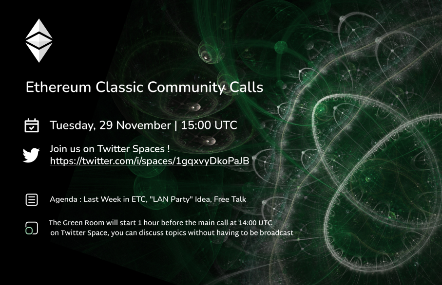
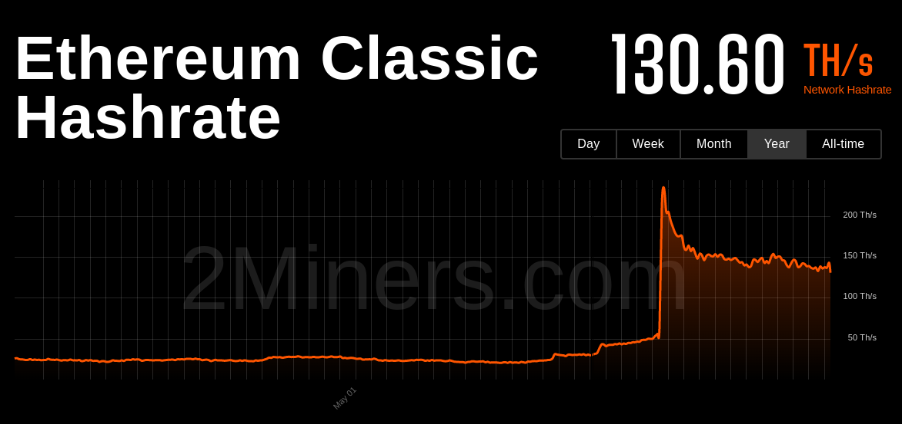
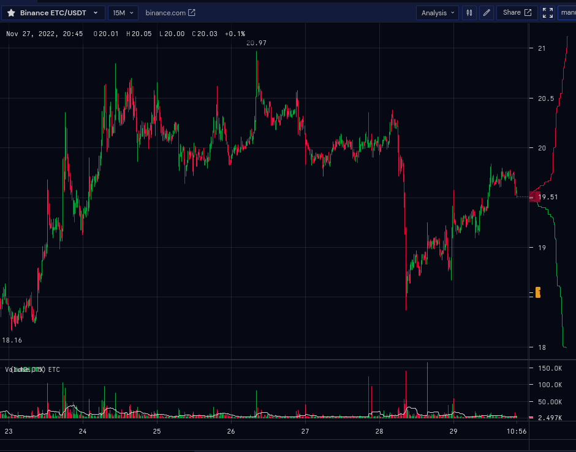
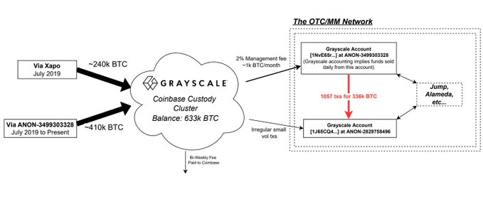
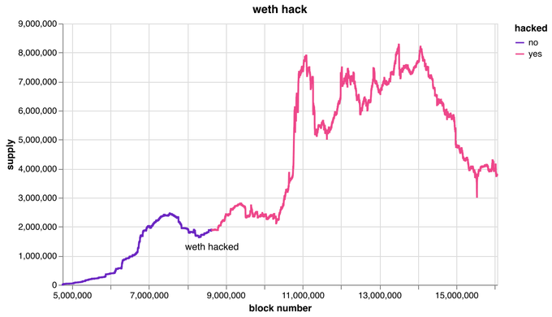

- Main Call (Recorded): https://twitter.com/i/spaces/1gqxvyDkoPaJB
- Green Room (Not Recorded): https://twitter.com/i/spaces/1djxXlDeqaVxZ



A casual voice chat to discuss ideas for ETC. All are welcome.

**Join the Green Room 30 mins before we go live to chat offline**

This voice chat is an open discussion so please feel free to jump in any time. 

For those who wish to speak, please make sure you're using a mobile version of the twitter app as it doesn't allow speakers on the web version.

Please request access to speak in app. Please be reminded this is live streaming on YouTube, so if you are on the mic please follow Twitter's rules. As this is our first time on Twitter, please let's try to keep things respectful.

You can also post questions and comments on Discord in #community-call-notes, on Twitter, or on YouTube we'll try respond to your messages.

You can find the agenda in a reply to this space, which contains links to everything we talk about.

## Housekeeping

- Shorten Green Room to 30 mins

## Agenda

LWIETC (Vitals and Ecosystem), BlockFi, Grayscale & Proof of Reserves, WETH "Hack", LAN Party Idea

## Gratitude

Brolal, d_a

## Last Week in ETC

### Vitals





### Ecosystem

Disclaimer

- New Blog Post https://ethereumclassic.org/blog/2022-11-29-the-difference-between-a-network-a-blockchain-and-a-cryptocurrency
- Website now in Korean
- https://twitter.com/ClassicRewards updates

### Show and Tell

- Anything missed above, new apps, nfts, projects, comments from participants?

## Topics

### FTX Contagion: BlockFi Bankrupt

https://twitter.com/BlockFi/status/1597253469374910466

### Grayscale Funds "Proven"

In this analysis we use additional on-chain forensics to CONFIRM the approximate 633k BTC balance held by G(BTC) at Coinbase Custody.
Which begs the question, why does Grayscale refuse to disclose their on-chain holdings?

https://twitter.com/ErgoBTC/status/1595504799016841216



Grayscale response https://twitter.com/Grayscale/status/1597297897116422145

Discussion: Importance of "Proof of Reserves"? 

### WETH "Hack"

https://twitter.com/bantg/status/1597030780924211200



Bloomberg article about the "Hack"

### "LAN Party" Idea

- Pump nights

## Etcetera

- Web Updates, Automations, Auto-adding content, https://nvu.io/en/bots/discord-translator, Auto add Youtube, weekly top tweets
- Nomenclature: Profitability, Profits, Block Rewards, etc.
- Tweet Bank
- Rico

## Free Talk

## Sign Off

#ETCtweets reminder

See you next week, same time same place.

---

## Full Transcript

```webvtt
WEBVTT

NOTE no-names

1
00:00:30.480 --> 00:00:33.290
Community call number 33.

2
00:00:30.480 --> 00:00:36.650
today is the 29th of November 2022.

3
00:00:36.660 --> 00:00:58.670
Etc Community calls is a casual voice chat to discuss ideas about ethereum classic everyone is welcome we are once again on the Twitter spaces platform as we were last week things went well last week and we got uh more engagement than usual so we're going to try again and continue I think for the foreseeable future on Twitter spaces you

4
00:00:56.460 --> 00:01:17.630
can as always join us in the green room before this show starts I think we're going to reduce the time of the Green Room to 30 minutes now so you can join us at 14 30 UTC every Tuesday on Twitter spaces as well to chat offline this is a voice chat that's open so feel free

5
00:01:15.600 --> 00:01:37.910
to jump in at any time if you are listening on Twitter spaces remember to if you do want to speak use the mobile app as the web version doesn't currently allow speakers uh from the web version so just make sure you're using a mobile app for that and if you do want to speak you can request access to speak in the app

6
00:01:33.720 --> 00:01:56.450
and one of the co-hosts will help you get access to speak on

7
00:01:54.960 --> 00:02:16.010
YouTube and we'll try to respond to your messages you can find the agenda in a reply to this space which I'll shortly post and that will contain links to everything we talk about talking about uh as usual the vitals in the ecosystem uh dates and the theme classic as

8
00:02:13.620 --> 00:02:33.770
well as some uh wider ecosystem topics including the the recent block five bankruptcy grayscales uh response and proof of work sorry proof of Reserves uh discussion about whether proof of reserves is actually that useful in this kind of situation and

9
00:02:30.780 --> 00:02:52.970
uh a little minor news topic I noticed about a wrapped ether quote-unquote hack uh thread that was posted on Twitter and also an idea that was brought up by a Community member about hosting some kind of LAN party or a trading uh party on on

10
00:02:50.040 --> 00:03:11.869
the Discord or Twitter spaces so before we kick off into the content as always thank you bro lau and D underscore a for helping with the call with the video live stream and the graphics from you guys so thanks for that all right so vitals last week ethereum classic uh

11
00:03:08.879 --> 00:03:30.890
hash rate remained pretty steady at 130 Tera hashes since the merger it's basically being hovered around this area and after the FTX um craziness of the last month um understandably the the prices gone down slightly has has the rest of the

12
00:03:28.260 --> 00:03:48.289
crypto market and the hash rate has gone down a little bit but not as much as you would have expected that in in that case price wise from last week has recovered from its low of about 17 uh we're back at twenty dollars where we were before the um mini scare of the the grayscale Holdings

13
00:03:48.299 --> 00:04:09.229
um potential black hole which as we'll talk about this week seems to be resolved so ethereum classic had a bit of a rally uh yesterday and today classic uh there's been a new blog post on the website by Donald McIntyre about the

14
00:04:07.260 --> 00:04:27.650
difference between a network a blockchain and a cryptocurrency so in in Donald's new series of posts we'll be going through some of the fundamental concepts that help outlines the value proposition ethereum classic and getting right down to Basics starting with the uh the fundamental building blocks so

15
00:04:25.919 --> 00:04:47.689
please check that out if you have time the website has now been launched in Korean so again that's been uh automatically translated via Google Translate into Korean and that is available uh as of yesterday so if you do speak Korean and would like to help correct some

16
00:04:44.460 --> 00:05:05.570
of these probably uh somewhat dodgy machine translated uh translations then please reach out in Discord or on GitHub and you can help us clean that up there's also been some uh updates to classical boards which is a a cool project that kind of went under my radar that

17
00:05:04.440 --> 00:05:26.210
you should probably check out at twitter.com classic Rewards and uh of course as with all these ecosystem updates for disclaimer they have not been audited or um as far as I I'm aware could be uh

18
00:05:22.440 --> 00:05:45.529
either great projects or always do you do your own research of course now before we go into the topics the of the deck shall we open the floor to anyone who wants to speak or bring a penny uh new ecosystem updates that they want to talk about so let's just see if there's any requests

19
00:05:41.960 --> 00:06:02.029
to become speakers I'm going to invite everyone in the chat to become a speaker now just in case they don't want to do that going

20
00:06:00.419 --> 00:06:22.670
to talk about is a kind of fusion of the all of the drama that's been happening in the last week which is the FTX contagion and there's a recent update oh hello hi did you want to speak hi Thor I'm Donald thank you for commenting that um there's a new post today on the ethereum classic.org website

21
00:06:19.440 --> 00:06:40.730
I just wanted to tell you the how that post it it is part of seven a series of seven and how was the Genesis is because I was going to write a blog post planning what is core get and

22
00:06:38.280 --> 00:06:59.930
what what it does and what are the differences with other evm client clients Etc and during that conversation with Isaac artists he explained to me many details that one should know previous to understanding

23
00:06:57.060 --> 00:07:17.409
what is forget or a blockchain client in general so it turned into a series of seven posts so uh there's gonna be I already wrote four they're gonna be published in the next few days and the last three are going to be explanation specifically of what is the core

24
00:07:15.120 --> 00:07:35.930
get client and then uh the hyperledger basil client and the one that is being implemented for EDC which is called arrogant so I wanted to to let you know that recent

25
00:07:34.259 --> 00:08:05.890
blog post has been translated into Chinese as well so that will be available as a resource to uh my friends in China yes all of our the blog posts that I'm going to produce are going to be uh translate into Chinese and post it in both languages reading

26
00:07:56.479 --> 00:08:18.290
those future posts the topic of the week which is the FTS contagion as mentioned blog fly which is uh

27
00:08:14.039 --> 00:08:35.690
one of Fairly important defy uh projects on ethereum mainnet appears to have I believe it's on ethereum mainnet appears to have gone bankrupt or filed for bankruptcy so another victim in the craziness that was the FDX Scandal um

28
00:08:31.139 --> 00:08:52.009
related to this uh is the mini scare that we had last week about grayscale which was a fairly significant uh player in the classic ecosystem they provide one of the major Etc

29
00:08:49.440 --> 00:09:11.810
that allowed retail to get exposure to Etc and there was a bit of worry last week that maybe they were not doing this thing called proof of reserves and the suspicion that maybe that was because they were not having those Reserves but in a post recently by Ergo BTC on Twitter

30
00:09:09.240 --> 00:09:31.190
not related to the uh the project that stole the film classic Twitter account um this guy basically did a blockchain analysis and found all of the claimed BTC uh that lined up with grayscales or

31
00:09:28.260 --> 00:09:50.509
previous attestation about having I believe it's around 600k BTC and they've managed to prove that that balance actually does exist so even though grayscale declined to do a proof of Reserves they were still able to thanks to blockchain technology

32
00:09:48.240 --> 00:10:11.810
show that those reserves did did in fact exist so um it does bring into the question of whether or not doing a proof of reserves is a useful thing and given that it seems to be becoming some kind of industry standard now whether it's something that should be expected going forward

33
00:10:06.899 --> 00:10:27.350
or is it merely a kind of useful but not really that useful demonstration because really all you can do is prove that certain coins have been owned at a certain point in time but that doesn't

34
00:10:25.440 --> 00:10:47.990
really tell you much about the actual off-chain ownership of those funds so it could be that yes you have a bunch of BTC but do you owe that BTC doesn't want for example and I can see the argument to both sides and I guess it does make sense to be able to sign a message saying that yes these

35
00:10:45.360 --> 00:11:05.690
funds are in at least we can claim they're in our control but do they actually uh prove much or is that proof really just a uh made up it's it's not a proof in itself it's it's just a claim to have a proof so uh yeah

36
00:11:03.779 --> 00:11:24.650
I thought we could uh discuss that potential uh debate there your own private keys and having your your Etc in your own account on the ETC blockchain

37
00:11:22.320 --> 00:11:46.009
directly with private keys that you control so yeah I agree that proof of proof of reserves is just um more information than in the traditional system backing system in banking system is a black box you don't know you just trust now

38
00:11:42.000 --> 00:12:02.210
say the brands like JPMorgan HSBC Bank of America and their buildings and their commercials and we had impression that they must be solid and must have reserves uh but in in in the blockchain industry you can actually track

39
00:11:58.920 --> 00:12:21.590
on the blockchain who holds what and if an institution has the reserve that they claim to have or in a mutual fund or something uh like that but it's only informational because the private keys are still held by somebody else so the fact that you see uh

40
00:12:18.140 --> 00:12:38.990
Etc in an account or Bitcoin in an account that belongs to someone else it's good informationally to know because it's better than that they have zero uh but they still control the private keys and they they still

41
00:12:36.300 --> 00:12:56.329
own those assets and have possession of those assets so it doesn't mean that you will ever get them back right there's no it's I I see the word proof in the proof of reserves as a bit of a sort of hand wavy not really proof type word that actually might give people

42
00:12:54.240 --> 00:13:15.110
a false sense of security when really it's just a centralized exchange that could at any point run off with the money or be compelled to do so by some Authority so it's not really proof of much um other than yeah okay as a data point as you mentioned and again there's multiple ways to kind of

43
00:13:12.480 --> 00:13:34.970
mess around with that proof sure you can sign a message to say yes at this point in time someone that we say that owns those keys has claimed that they are us but like it doesn't mean that they are uh in any secure situation or that they're actually owned in in a legal sense

44
00:13:31.200 --> 00:13:55.550
by that uh centralized entity so I can see um gray set grayscale's side of the argument on that and I can also see the people demanding having that quote unquote proof that's uh I don't think there's a definitive uh answer

45
00:13:47.399 --> 00:14:08.629
on this the chat and uh I believe they reached out in the Discord to mention that they had a project that they're

46
00:14:06.240 --> 00:14:27.590
working on so uh guarda did you want to talk about that project hi everyone I'm David I'm working guy at Garda and thanks istora did I pronounce it right yeah that's right yeah I'm glad I was pronounced guarded right as well you did you did well done so yeah thanks so much for um replying

47
00:14:24.839 --> 00:14:45.110
on Discord right away so yeah we have uh an uncustodial crypto wallet just a brief you know uh description we started back in 2017 and we are currently looking you know at different options and uh just you know ethereum classic

48
00:14:42.600 --> 00:15:03.650
would be definitely you know um one of those areas so I'm happy to be here and I will answer um any questions about you know Garda or just the non-custodial approach that we support sure so would you like to give our listeners a brief overview of the product

49
00:15:01.680 --> 00:15:23.509
offering I would love to yeah so what we have is not just the crypto wallet as I mentioned it's non-custodial it's available on mobile you can use the web version you can use the desktop version if you're using Chrome there's a Chrome extension Oprah

50
00:15:19.320 --> 00:15:42.410
I think now has one as well so we have the wallet functionality there's an exchange so we've been working with one of our partners for over five years now and you can also stake you can get crypto loans all you know in one spot so we

51
00:15:39.300 --> 00:15:59.449
also have our customer support so it's not just a bunch of bots I call it the human customer support so they're pretty good at what they do and we have the Guard Academy as well that's where we update you know where we publish information and update our community when

52
00:15:58.079 --> 00:16:18.949
it comes down to different Partnerships and whatnot so hopefully we can work together and provide more information and recently I started learning more about mining so that's another field that we're going to be you know looking into just providing people with

53
00:16:16.920 --> 00:16:38.629
more information that Garda is definitely again no Financial advice here but guard is definitely one of the platforms that people should consider using for the ethereum classic Network to have yet another wallet on top of it that uh seems

54
00:16:35.940 --> 00:16:57.050
to be uh pretty well polished and has a lot of features um so thank you for supporting classic of course yeah I also noticed that uh you are you recently started offering a prepaid plastic Visa card is that right we did yeah that is correct

55
00:16:54.660 --> 00:17:17.750
yes um it was about I think a month ago so now you can get different options so you can either sign up for the virtual card and start using it right away right after you get approved or you can order the actually you

56
00:17:14.640 --> 00:17:35.750
know the Web 2.0 card so the plastic card and it would be shipped to your house as long as you live in the United pardon me in the European Union it's not available in the United States just yet but we're looking to expand the the geography and add more assets to the the list

57
00:17:33.240 --> 00:17:55.610
of support at once so yeah it's pretty simple and it works I've used it before uh yeah and we are always open to different ideas so if there's you know someone listening to this Twitter space and they have ideas and how we can expand the functionality I'm here to to to

58
00:17:52.080 --> 00:18:13.430
address those ideas as well that's great so basically now uh any anyone in the European Union uh unfortunately my home country the UK is no longer in that list right now but uh they can uh they can uh use that Etc to pay

59
00:18:11.460 --> 00:18:35.390
for a coffee using a Visa debit card which is awesome so uh that's a massive feature upgrade for the ethereum classic Network I wasn't aware of any other providers that support Etc so that's great and uh hopefully uh listeners in the European Union might consider trying that out um

60
00:18:32.940 --> 00:18:54.409
not every European country is on that list but um as far as I remember it's around 25 countries but again I'm going to be expanding the functionality if everything goes well yeah very cool yeah and ethereum classic is supported and as I mentioned before happy to look at different options and if

61
00:18:52.260 --> 00:19:13.010
we can update the uh the ethereum classic page on our website we can do that learn our own campaigns and any educational content that we can produce you know uh we're yeah we're here to do that there

62
00:19:11.340 --> 00:19:32.870
any listeners here that would like to jump in and uh ask some questions people gather ideas you know yeah Let's uh so with

63
00:19:28.919 --> 00:19:50.450
the the main wallet uh so it's a supporting multiple platforms and within that also multiple cryptos cryptocurrencies in the same interface right and you can swap them around pretty easily it seems yeah yeah again we

64
00:19:46.740 --> 00:20:07.310
we have the exchange and uh you you can use um the crypto loans functionality as well I do have a question for you Mr if I may cool when it comes down to different Partnerships what's the uh what's the process you know um is

65
00:20:05.400 --> 00:20:28.130
there a standard approach that you guys use because I'm curious to learn more about that as well is there a team of people or it's completely you know a decentralized and not by it yeah it's uh so the closest uh I'd say structure um to another blockchain that you might be familiar with is Bitcoin where there isn't

66
00:20:25.140 --> 00:20:47.510
really a I mean there is a company called the Bitcoin Foundation but they are not uh authoritative in the same sense that the ethereum foundation is so ethereum classic has no official Authority in it uh there are various entities that have been around for a while probably the main one right now is ethereum

67
00:20:44.340 --> 00:21:06.230
classic uh Cooperative I'm not part of that organization and I'm basically just a individual contributor that's working for fun uh contributing to this um project so uh there aren't any kind of like official partnership projects but there are going

68
00:21:04.320 --> 00:21:24.890
to be Grant programs coming up I believe um that we've talked about in previous calls and I believe ethereum classic Cooperative is also involved in that so it in terms of getting any uh funding for Integrations and that kind of stuff then those fund processes have not been announced

69
00:21:23.160 --> 00:21:43.490
yet but they will be on the horizon very soon and I believe that Bob summer will a VTC Co-op mentioned that before the end of this year they're hoping to get the first grants out the door so uh hopefully um we'll see some movement on that in the next few weeks really that

70
00:21:40.440 --> 00:22:01.909
is good to know all right and um I I see it says ethereum classic Community call 33 so once you start hosting the Twitter spaces so the Twitter space has been going on since last week it's been called just last week okay yeah it's been it's been previously

71
00:21:59.340 --> 00:22:19.669
held on Discord and we wanted to Branch out into the new emerging Twitter space phenomena so we thought we'd give it a try last week and it worked pretty well so we're continuing now on Twitter spaces and probably we'll be doing for the foreseeable future so perfect where we are right now yeah all right

72
00:22:18.000 --> 00:22:38.029
good to be here I'm glad it's on Twitter now and yeah for other people listening um this new format is uh open and there's no real set agenda that we have a rough guideline of what we're going to talk about but if anyone that wants to bring their

73
00:22:36.179 --> 00:22:56.450
interesting new project forward then please do so just like uh guarda has today so um we hope to turn this into a conversation as opposed to just uh a set agenda each week so thank you quarter for to contributing this week my

74
00:22:53.039 --> 00:23:13.250
pleasure and uh brolal hi you're a co-host I believe right uh

75
00:23:08.400 --> 00:23:32.090
I'm fine uh yeah I usually um help with this course so I think me and Mr had this initiative like almost a year ago so it started doing this on uh on this card

76
00:23:27.120 --> 00:23:50.149
then a week ago we decided to try Twitter all right so what I'm doing to now I'm I'm helping with this course and also streaming we are also live on YouTube all

77
00:23:47.580 --> 00:24:09.470
right I'm sure more people will join I did share the um the announcement information it's could you uh let people know where to find uh gwada oh yeah um

78
00:24:06.539 --> 00:24:27.529
I can look I can't share any links on here can I no um garda.co M that would be the the website g-u-a-r-d-a.com so uh or you can find it in the the App Store so um Apple App Store or Google Play Market I think it's called

79
00:24:27.539 --> 00:24:49.669
cool cool I I actually did have a question about the staking feature could you explain a bit more about how that works and what the is that like a county apply risk involved obviously there's been a lot of uh staking related drama in the last year yeah so yeah so you could yeah I'm

80
00:24:47.340 --> 00:25:08.450
not a technical person I'm not gonna lie to you so um I'm not here to sell you um you know uh the service as I said no Financial advice I'm here to uh educate people if they want to be educated so when it comes down to staking um you have different options so if there isn't crypto asset that you want to

81
00:25:06.539 --> 00:25:27.110
stake or you want to explore different options you can always find the uh your Garda wallet so you go to the website or you download the app you create a wallet you get the uh you set up the password you download the backup file and then you create a specific crypto

82
00:25:25.140 --> 00:25:47.649
wallet and if staking is available then you can always look at different staking options so at times you'll see that Garda validator is in place so you can choose that option and then you can choose from many different other ones so uh you select the validator you look at the rate so the passive

83
00:25:44.460 --> 00:26:05.450
income so I think that's the apy percentage and if you're happy with that you um you can just start staking your assets and the story you mentioned the risks again um it's up to you I suggest you know to do your

84
00:26:02.580 --> 00:26:23.269
own research to talk to people that you trust but we guarantee that the platform is non-custodial so you just have to be careful with uh you know which crypto you decide to stake so that's how it works so you basically

85
00:26:20.159 --> 00:26:41.690
use your crypto that you own to generate some passive income and um I would say that there are some attractive options out there that are available on Garda yeah just looking at the uh the staking page it's uh it is only the proof of stake coins obviously

86
00:26:39.419 --> 00:26:59.630
that are stakeable so it's not like you are lending out your etc for example Bitcoin it's just you are staking on chain directly or potentially through a staking pool with the coins that are able to be staked so it's not like uh if you have Etc you can get a reward on that because it's not stakeable

87
00:26:58.200 --> 00:27:19.430
right mm-hmm I have a question are you familiar with the the platform called two miners by nutrients yeah well I'm I'm somewhat familiar with it

88
00:27:17.279 --> 00:27:37.310
I use it for screen showing the network cash rate of Etc but beyond that I'm not super familiar uh-huh yeah I just I noticed that um Garda is mentioned on some of the pages and we got traffic you know from there and I was just wondering if there was a way

89
00:27:35.039 --> 00:27:57.110
to connect with the mining community at all you know um ethereum classic is on there and the page is very popular I would say um so is there can I somehow you know connect with that group is there do you think there is a different like Discord server because I am

90
00:27:54.480 --> 00:28:16.070
not not a minor myself but I've been talking to people and they told me that it's still very popular of the most popular uh proof of work uh mining Google minable chains and that's why it's appearing uh on two minus quite a

91
00:28:13.980 --> 00:28:35.250
lot there is actually I believe uh Werner is in the house who is a veteran Miner very familiar with the community there so maybe one okay give you some advice yeah that would be amazing well um you're basically looking for pools if I understand this right so

92
00:28:35.260 --> 00:28:55.350
[Music] um um well you could try to contact the pools directed you can probably find contact details on all of them or you could also start by mentioning it on the mining Channel on on the ifm classic Discord there are several pool operators who

93
00:28:53.580 --> 00:29:16.070
are listening there [Music] look at the pools I mean the um there's a list of of ATC pools on uh mining pool stats if we call this what yes

94
00:29:12.440 --> 00:29:33.950
and you get a list of all of all the the pools ethereum classic uh it's being mined and then you can look look there for for contact details awesome thank you Werner thank you yeah I'll do that I'll start with the the

95
00:29:32.279 --> 00:29:53.330
Discord and go from there yeah to see what people have to say about the uh the mining so how would you how would you uh see Mining and quarter uh interfacing with each other what could be the potential uh

96
00:29:49.799 --> 00:30:09.950
crossover there do you see well I believe that people who are into mining you know they can consider using Garda as one of the reliable non-custodial services not here to name you

97
00:30:06.899 --> 00:30:27.350
know other companies but uh yeah I think if people realized that Garda is one of the better options out there I think that would be that would be good and if there is more we can do you know again we're open to different different ideas so um if they find

98
00:30:24.179 --> 00:30:46.610
that will definitely consider you know adding more or changing something so yeah again it's about just providing a reliable service service and then making sure that we are on top of you know the game right

99
00:30:44.179 --> 00:31:04.909
I guess one of the things that miners may be interested in in terms of services is a feature to automatically swap whatever currency is they're mining into some other cryptocurrency or a basket of cryptocurrencies rather than just holding that one thing so if they had

100
00:31:02.100 --> 00:31:24.909
a particular wallet address that was set up in uh guarda for example or any other system that can do this um to have it automatically then converted would probably be useful for some people I guess oh I see so automatically converting the assets right right

101
00:31:21.840 --> 00:31:44.029
yeah as as I guess there'll be incrementally getting mining uh rewards and then after a certain threshold let's say they earn uh one or two Etc over the course of a week if they have quite a small rig I guess then they might want to automatically convert that into keep some of it in ETC obviously uh maybe buy some

102
00:31:41.760 --> 00:32:02.450
Bitcoin with that and also get some stable coins oh makes sense yeah I didn't know that thank you store um if you since you have a selection of coins um and if we expand this then you might also

103
00:32:00.000 --> 00:32:22.669
end up having some coins uh that are notoriously volatile and also people mining these these currents tend to try to to move from something more stable because to avoid getting bitten by any large large price swings especially if it's

104
00:32:19.620 --> 00:32:42.769
minus who also need to pay the monthly Energy bill with those things then they need to take some precautions that if another FTX also happens that the they're not suddenly without without money when the when the bill arrives so the that's common that that people withdraw

105
00:32:39.299 --> 00:33:01.549
the the mining um returns fairly fairly frequently even up up to daily and liquidate them so something more stable thank you Verner yeah I hope that no FTX you know situation happens again but yeah

106
00:32:58.799 --> 00:33:18.889
we'll see to maintain custody will hopefully Shield people from that potential in a lot of cases so it's it's great that uh people are finally waking up to that and uh on a side topic I noticed that uh people

107
00:33:16.919 --> 00:33:37.810
seem to be purchasing a lot of Hardware wallets as well so that's a great thing but by the way does water support Hardware wallets right now uh you can certainly um I would say the term is link your yeah uh saying ledger to your Garda wallet certain assets are supported but uh again another um

108
00:33:36.179 --> 00:33:56.810
space that we're going to be exploring very soon just to see how we can make sure that people protect their assets the best way possible so yeah foreign um

109
00:33:56.820 --> 00:34:17.810
thank you for for introducing this and uh providing value to the ETC Network waiting for um people to ask the questions is Thor I have a question for you if I may of course so

110
00:34:15.359 --> 00:34:35.869
who are the guests usually so when you um hosted this uh not Twitter space but this event on Discord who would usually uh show up and tell you about you know their platform or their project well usually it's uh people that are hanging

111
00:34:33.839 --> 00:34:53.869
out in the Discord channel so right now there's a bit of sort of uh migration uh into Twitter spaces so I guess it's not as uh we are getting new faces but it's not the same group that was in there before on on Discord because I guess some people uh don't have

112
00:34:51.839 --> 00:35:13.190
Twitter right now so they're unfortunately unable to uh be speakers uh if they don't want to use Twitter which is reasonable um but eventually hopefully as we keep going on this it will gather more momentum and basically it's open to anyone that has any kind of project uh there's

113
00:35:10.440 --> 00:35:34.010
a few developers that have provided uh projects and interesting new apps on the film classic and basically anyone that wants to chat can and there's no there's no real filter of who can speak on this call so uh yeah

114
00:35:30.420 --> 00:35:52.069
it's open to everyone I'll make sure to support the the future announcements so more people can join and learn more about the ethereum classic you know ecosystem that

115
00:35:45.480 --> 00:36:08.270
was very much appreciated start working with ethereum classic or collaborating

116
00:36:04.200 --> 00:36:26.270
with the platform me personally I've been working uh publicly on theorem classic uh uh under the store named for about a year now I've been doing I'm doing other things behind the scenes before then but uh yeah

117
00:36:22.859 --> 00:36:44.329
uh probably over a years but um I think in 2019 I contributed to the main uh website and I've been working on that since then so um doing the call publicly for a year and uh the

118
00:36:42.839 --> 00:37:02.930
website for about three years I guess now oh we see community as a community manager I always you know ask the same question um how active would you say it is on

119
00:36:59.880 --> 00:37:19.910
Discord or any other uh social media platforms so there's a couple of points here and one is it's kind of difficult to measure because there is no like central point of contact for everyone Discord is probably the main Hubble

120
00:37:17.880 --> 00:37:39.349
activity but it's difficult to tell because there's many other places like I know there are some popular channels on telegram for example and I think there's some other language uh channels especially in Korea there's a lot of activity but as far as I know I don't think there's any like Central Point

121
00:37:36.720 --> 00:37:58.310
that we could use to measure where the most activity is happening um I would say in terms of activity obviously compared to a lot of the other chains that have shall we say artificial funding mechanisms that allow people to be essentially bribed into contributing through

122
00:37:55.800 --> 00:38:17.990
centralized um pools of money obviously a film classic doesn't have a centralized pool of money so there's less uh artificial contribution but what we do have is a dedicated Core group of contributors that are doing so naturally without any uh

123
00:38:15.240 --> 00:38:36.950
funding basically they just believe in the project and I think for that reason it has longer sustainability because for those other projects as we've seen once the money disappears and once that um fake traffic uh also goes then you're left with not much but ethereum Classic's

124
00:38:34.380 --> 00:38:56.530
been operating for I guess over seven years now and it's never really had any sort of funding and yet it's still going despite all the cycles and the bear markets so yes there may not be as much day-to-day activity but because it has a different fundamental approach and philosophy it has

125
00:38:52.920 --> 00:39:13.730
that longevity that allows people to maintain interest over long periods even without centralized funding so it's it's kind of a a difficult question to answer because of the different incentive structure that ethereum classic has compared to other

126
00:39:10.320 --> 00:39:30.349
chains mm-hmm yeah for sure it's uh it's less um active than uh some other newer and more uh technically sparkly shiny uh alternatives

127
00:39:32.220 --> 00:39:52.250
you're now on Twitter and I'm sure more people will be joining the uh the events and you host them um you said every other week or yes every Tuesday every Tuesday I

128
00:39:49.980 --> 00:40:10.550
see and another thing I noticed was the ethereum um classic I think uh Labs is that something completely separate best

129
00:40:08.579 --> 00:40:29.390
knowledge about the the history of Etc labs and what happened there and I believe just for the uh because of that history Etc lab still hosts one of the uh the main clients for ETC cool Geth I believe um but they yeah Donald if you wanted to explain

130
00:40:27.060 --> 00:40:37.130
this well um ethereum separated from ethereum classic in 2016.

131
00:40:33.420 --> 00:40:56.870
and uh until more or less the second half of 2017 there was a a group of core developers maintaining ethereum classic and then the the lead developer organized a company called ATC Dev and um then

132
00:40:53.160 --> 00:41:15.829
in in at the end also of 2017 Etc Labs came as a as another participant in the ecosystem they started an incubator Etc and by the end of uh 2018 uh they hired the core Developers and

133
00:41:11.579 --> 00:41:34.270
uh in 2019 they became the core the core development team for for ETC and that's why um the the node client is on a repo that that whose brand or name

134
00:41:29.220 --> 00:41:50.930
is ATC Labs but Etc Labs between 2020 and 2021 dissolved its operations and now the ATC cooperative is is the one maintaining the clients uh it's three Three core clients one of which

135
00:41:48.000 --> 00:42:14.450
is in the EDC Labs uh repo but that entity doesn't exist as such and now it's Etc Co-op that maintains it there

136
00:42:11.040 --> 00:42:33.230
is no Central team really it's just a bunch of Open Source contributors that believe in the vision and that's the thing that maintains contributions primarily and they come and go over time um but that's okay that's kind of the nature of the Beast asking

137
00:42:31.200 --> 00:42:55.310
all these questions you know about ethereum classic because I'm here to learn as well of course I think these are important um things to uh for the community as a whole to understand and there's no like I think that a

138
00:42:50.579 --> 00:43:12.109
lot of people don't really see the I guess the unique aspects of Etc and they see them as a negative like a common common complaint is that ethereum classic doesn't innovate enough and because of that it's a dead chain for example but uh as we talked about in the course before it's it's

139
00:43:09.480 --> 00:43:30.050
quite the opposite really and I was thinking this week because of the World Cup I just had a shower thought about how ethereum classic is a bit like the game of soccer whereby the rules don't change much at all in fact they haven't changed for like hundreds of years maybe a Tweaky or the with the offside rule or whatever

140
00:43:27.420 --> 00:43:49.010
but uh just having an ossified and fair protocol that everyone can agree to play with without any change much can yield a lot of interest and eventually snowball into like a massively interesting thing because then you have Innovation happening on higher levels so if

141
00:43:47.339 --> 00:44:10.670
the game of soccer change too much then it wouldn't really be able to pick up that momentum and other chains are in the business of rapidly innovating but I think when you have a winning formula then you don't really need to change it too much well

142
00:44:04.680 --> 00:44:26.569
said for guard dog wallet all right so I see your your domain is guarded.com that is correct yeah um

143
00:44:24.540 --> 00:44:48.829
and um how many users does your wallet have how how how is your Market positioning compared to other non-custodial wallets like like trust wallets metamask coinbase wallet Etc not

144
00:44:45.839 --> 00:45:07.190
able and not that we would want to track how many people you know actually uh use this service but I can tell you that um we're looking at around probably 200k active users uh but again since we have the web version

145
00:45:04.680 --> 00:45:25.550
available people can just create different wallets and you know store different assets so yeah I would say we're not as we're very traditional and we're reliable so yeah people

146
00:45:22.140 --> 00:45:45.710
are using the wallet but we are still developing our marketing strategy foreign some

147
00:45:42.480 --> 00:46:04.550
time been around but yeah again uh we're gonna be expanding just introducing new features but I like what the store has said so staying true to values you know using the traditional approach that's something we can relate to very good thank you thank

148
00:46:01.920 --> 00:46:24.470
you for your question I I'm sorry if you mentioned this before but uh did did you mention that there was a browser extension uh for Guida wallet another metamask or was it just a um a web wallet there is an extension uh it's available on Chrome okay

149
00:46:21.060 --> 00:46:43.130
yeah I can't see the link to that on your website uh we're probably still updating that but uh yeah I'll make sure that we add more information thank you histora yeah I was just updating the description the other day so perhaps we're updating uh the whole um extension but it's it's convenient

150
00:46:41.040 --> 00:47:02.089
you know in in case you don't want to download the app you know for example so and and does that have functionality similar to metamask where it will inject into the website so you can interact with applications because I mentioned this because um ethereum classic uh is kind of uh receiving

151
00:47:00.420 --> 00:47:23.750
second class support from metamask and it'd be great to have a well-supported browser extension that has similar functionality that we can recommend to users of ethereum classic instead of metamask because uh currently uh you have to do some manual configuration with no master to get it to work yet

152
00:47:22.020 --> 00:47:42.710
but that's an interesting point you know what we should definitely talk yeah I would love to to know more about you know how difficult it would be to integrate um you know something like that believe and one that would help um private options for for both quada and their

153
00:47:41.280 --> 00:48:02.990
own classic so it might be a good uh if any of you listening to the uh the space have any questions about Garda or web3 or ethereum

154
00:47:56.460 --> 00:48:20.089
classic please raise your hand for Verner Torah mentioned that you were quite the expert right well

155
00:48:16.200 --> 00:48:37.569
I work for an Asic minor uh manufacturer oh so you are the expert Okay cool so um I have a very simple question if I'm not a technical person right how difficult would it be for someone like me

156
00:48:34.619 --> 00:48:55.130
to start mining ethereum classic would it take me years to do that or you know I can just do the research talk to people like yourself and just start doing it yeah but you need basically two things you

157
00:48:51.960 --> 00:49:13.430
need a suitable Hardware um and then well if you buy an uh let's say an Asic Miner then it comes with a firmware that already does manages everything for you you just uh it's easy to see take your Miner then you choose a pool

158
00:49:09.780 --> 00:49:31.490
where you want to uh but with which you want to do the mining so the pool takes care of all of the uh the block generation and the integration of the of Oppo of transactions into these blocks and so on and just sends you basically a number

159
00:49:27.540 --> 00:49:51.370
to to work on and then your minor processes this and sends back results so you go to your mind and you tell it's my pool is over over there and in this uh in the spin this configuration you also specify to which wallet

160
00:49:46.859 --> 00:50:07.370
you want the the returns to go and

161
00:49:51.380 --> 00:50:12.109
with these things basically you said um

162
00:50:09.780 --> 00:50:29.930
the problem is that gpus tend to be less power efficient situation with high power prices almost everywhere profitable so that's what there's a due to the current circumstances there's a push towards um

163
00:50:29.940 --> 00:50:51.470
towards Asics is the easiest easiest way to to yeah okay so give it a first try you just need a GPU with enough memory can be Nvidia can be AMD and um

164
00:50:49.319 --> 00:51:09.349
you need to need to find some mining software um and I I'm not too familiar with GPU mining um but uh you can ask on the on the mining Channel and people will will know what to what to recommend and then

165
00:51:06.059 --> 00:51:26.210
you can set up for uh set this up um pick a pool um configure all this in your mining software and then um uh what you basically do is that you give you have a set of configuration strings which

166
00:51:24.000 --> 00:51:44.630
tell the the minings of it which pull to connect and then the mining software tells the pool to which wallet you want the the returns from your mining to be sent and this is the most common setup there's another version um where the the pool has has user accounts

167
00:51:44.640 --> 00:52:05.329
so in this case this is particularly popular in China where I think most of all of most of the pools have used this model but you set up an account and then you use um either they use the username you have to or

168
00:52:03.000 --> 00:52:25.010
some something that that will generates for you and to identify yourself to the to the pool and then the pool internally manages the the sending to the to the wallet so the wallet is not exposed when you connect to the pool for instead

169
00:52:20.700 --> 00:52:41.750
you use an identification that is between you and the pool but um most of most of the of the most of the pools use this uh the simpler paper you just tell the pool to which wallet you

170
00:52:38.760 --> 00:52:59.450
want to go and so this is this means that the wallet address is visible but uh you don't need to create an account at the pool is that you just just set up your mind and it works selecting

171
00:52:57.119 --> 00:53:17.750
a crypto wallet hopefully non-custodial that you want to use how do you how do you usually uh make a decision there what's the what are you know what is the criteria if I uh that really depends on your your individual

172
00:53:14.940 --> 00:53:36.349
circumstances um I mean many operations on the wallet side what I do is that that for that when we test uh mining with our machines uh set up wallets um

173
00:53:33.839 --> 00:53:53.990
to receive mining returns from there and take their shared inside the company so they're looking for something that is very easily shared not necessarily doing this secure but um it's a matter of convenience and of course

174
00:53:52.079 --> 00:54:14.030
something with the keys just in case and um so that would be my specific use case now for many many people it's different they stage they need a water wallet that may have some additional features or as compatible with certain Services I mean lots of things um uh

175
00:54:11.599 --> 00:54:32.990
have to have an interface with metamask and so then they might pick things based on this or if you if if your wallet is combined with some additional Financial Services like in your case you have this credit card or maybe some some exchange service or

176
00:54:30.119 --> 00:54:50.630
things like this or the staking so again this is these are things that people might want to consider thank you Verner yeah I hope that people in the audience will check out Garda and see if they like it hopefully they will I

177
00:54:48.960 --> 00:55:11.210
was considering um building a little uh desktop PC for experimenting with some VR projects but also potentially mining some provenance free etc for contract deployment and I was looking at the various um mining softwares

178
00:55:08.000 --> 00:55:28.970
available and it seems most of them have some kind of development fee that take like one percent of all the mining reward and I was kind of confused by that I I would have assumed that most of these uh products would be open source and that if they did introduce a fee like that they

179
00:55:26.040 --> 00:55:46.370
could just be forked away so is is what I'm saying accurate and why is it not the case that there isn't just like a really good open source mining tool that's free the situation on the GPU side but um there's

180
00:55:45.180 --> 00:56:05.750
definitely there are definitely those mining fees I mean that's essentially how they they finance the development and um I suppose there are cases where the mining software is open source but um they just have it in there and they hope that you don't remove it and of course

181
00:56:04.200 --> 00:56:24.650
then you have the words that are closed Source it's much harder to remove it but yes all the many uh manual if not all of the of the uh um state-of-the-art mining programs for that

182
00:56:20.579 --> 00:56:41.270
are intended for for mining on a PC with a GPU they tend to curve to cover those um those developer fees if you get an Asics instrument to my my knowledge non have any any feature like this

183
00:56:37.740 --> 00:56:58.670
so the that's that uh the cost of the of the software is included in the in the price of them of the the basic mining machine that a lot of these uh gpu-based mining tools will have some kind of magic algorithm

184
00:56:56.760 --> 00:57:20.809
that improves the mining efficiency and therefore they have the ability to keep it closed source and charge a fee for that and that would keep them competitive against other open source options I

185
00:57:17.339 --> 00:57:38.150
will hopefully be updating my uh mining rig construction Journey with the future calls and also syncing nodes and all that kind of stuff I'm hoping to go yeah goes

186
00:57:35.099 --> 00:57:55.250
but I'm still deciding uh I haven't really done any research about specific parts and stuff yet so that would be an ongoing uh adventure for me this story I'm going to be using uh the GPU to mine yeah that's right what

187
00:57:52.859 --> 00:58:14.089
happened to the um the GPU prices they went down or they were supposed to right the merge um and there's probably yeah like a massive flood of GPU Hardware uh Second Hand available so both

188
00:58:12.119 --> 00:58:36.470
new and secondhand gpus are probably cheaper but uh again I'm not super familiar with the the history of the price all right I see istora Gotham

189
00:58:34.020 --> 00:58:54.950
is in the house uh did you want to say something about it hey guys how are you guys doing Hi how are you good thanks here that's kind of interesting but uh yeah have you know someone from outside show up every once in a while I'm

190
00:58:52.859 --> 00:59:13.190
definitely from the outside but it's good to be here you know I'm learning a lot so and it's good to connect you know with people who are so passionate about you know just passionate about something you know it's rare these days really

191
00:59:11.040 --> 00:59:32.270
appreciate it um uh right now I don't have much to say I'm just writing something real quick and then I'll I'll come back in like two minutes and finish that off um but I just wanted to say that uh amidst all the stuff that's been happening uh you know in the last one month you know the

192
00:59:29.880 --> 00:59:49.970
FTX collapse I think I've seen all I've been looking into all the communities you know you know the Bitcoin and the ethereum and the one that just held together where nothing changed is ETC and and that's that I can say is very clear nothing has changed and everyone is still here we're all just pushing for the for the right future

193
00:59:47.819 --> 01:00:07.910
that we're all looking for so I want to thank you know everybody who's here who's listening taking the time you know to delve into it as even Garda wallet who just came out of the blue to come and you know take a look at what's going on you know so yeah I just I thought it was worth it to say we

194
01:00:04.559 --> 01:00:26.030
all appreciate each other for what we bring to the table main benefits I guess of this uh Twitter to get sorry that the Twitter spaces thing is that it enables this kind of uh random interaction that would not otherwise

195
01:00:23.700 --> 01:00:45.470
be possible on Discord so I guess as time goes forward we'll get more uh dropping gifts that we're able to contribute so if anyone is listening and in that position then yeah please do join us in a future call or this one was

196
01:00:44.040 --> 01:01:04.549
not here you know during the uh the last uh Community call what was your reaction as to where when it all went down um it's a it's sad for the whole Space especially for people that um have lost money

197
01:01:04.559 --> 01:01:25.430
um it's always a friend to see scams come to light and people lose money that way so I first of all um yeah realize that it's it's a it's a huge event and a lot of people have been hurt

198
01:01:21.960 --> 01:01:43.789
by that so it's uh it's bad from from the ETC side itself there wasn't much um direct impact I mean the price of the whole crypto Market went down a bit but that's not the first time it's happened so in in ethereum classic sort of tradition it's kind of like a Honey Badger Don't Care

199
01:01:40.799 --> 01:02:01.930
sort of approach to that particular event at the same time I think in the long run it's probably going to benefit chains like ethereum classic because of the commitment to decentralization and the philosophy and the underlying principles that prevent these kind of things from happening like

200
01:01:59.220 --> 01:02:20.750
if I mean FDX was fundamentally centralized thing that it could have been anything really it didn't have to be crypto that was the the vehicle that allowed it to happen it could have been any traditional Securities Exchange but it just so happened to be crypto and uh hopefully uh

201
01:02:17.000 --> 01:02:38.930
if there's any upside then people can learn the lesson of don't trust verify and that's always been ethereum Classics uh like fundamental vision from the very start so uh in the long run I think it's uh it's really

202
01:02:34.920 --> 01:02:56.630
gonna uh help the space grow in an anti-fragile way like all of the the negative things have happened in the past but obviously there's uh you know immediate pain that has to happen for that growth to occur but yeah ethereum classic is unmoved and if

203
01:02:54.900 --> 01:03:15.890
anything it just highlights the strong Foundation that's required to survive long-term in the space think I think it's great um it really goes to show you know how how

204
01:03:13.260 --> 01:03:34.010
tightly knit everyone here is we all follow the same fundamentals and that's going to help us over the long term to you know stick to it stick to a plan and stick to our Visions uh and everybody has their own Vision it's slightly different but they all work towards uh almost similarly a very similar common goal

205
01:03:34.020 --> 01:03:54.230
um and so I think the collapse of FTX and the all the uh companies after that came as a direct result or as a indirect result I think it's more I think it it is a very sad event for all the people that are involved and I'm my condolences go out to them um

206
01:03:52.619 --> 01:04:13.430
you know they did not withdraw their funds from the from uh centralized exchanges and that led to the demise of their uh so-called investment um but yeah it's always important to remember that we need to remove our stuff from exchanges and keep it in our own wallets um but every time something happens or at least I like to believe that there is always

207
01:04:12.240 --> 01:04:34.849
a lesson to be learned and something that we can take out take away from it and I and I think this this specific uh this collapse or this uh however you want to call it is going to be one of the main reasons especially in the coming years as to why people are going to Pivot to a more decentralized uh Financial

208
01:04:32.040 --> 01:04:52.490
system when it comes to crypto because as you can see every time there's a centralized player especially uh you know in crypto which is I mean FTX was supposedly regulated but the United States as you can as we can tell did a terrible job of regulating it and it all turned

209
01:04:50.339 --> 01:05:10.490
out to be one essentially a Ponzi scheme so it so it's going to be a Twist in the road for every single person that has a common Vision here um but just like every time uh you know every time something Falls it creates opportunity

210
01:05:07.859 --> 01:05:29.390
and opportunity is where where we are now um is that ethereum classic has had debates in the not too distant past about

211
01:05:26.819 --> 01:05:47.870
whether or not uh centralized group should have um basically a large role and I think that centralization um like let's say for example the the treasury proposal for those listening that are not aware of etc's

212
01:05:45.960 --> 01:06:07.670
recent past there was a treasury proposal pushed by ohk um lastly part of Charles hoskinson uh who was trying to get um a situation where seven percent of all the mining Awards would go to aohk for ETC minor rewards and luckily that was um

213
01:06:05.160 --> 01:06:26.450
projected by the community there was no consensus reached on that and therefore it would have caused a chain split uh and that um the risk of that happening was apparent and that was enough to have the proposal withdrawn but let's say in an alternative reality um

214
01:06:24.720 --> 01:06:45.049
that treasury proposal did go through that would mean that then ethereum classic would have this potential exposure risk to any of the entities that had uh in turn exposure to the FTX thing and it could have been the case that one of those entities like iohk also went down and

215
01:06:43.140 --> 01:07:03.650
if that was the case then it would have taken the whole uh ethereum classic project with it probably because when you overly rely on those Central organizations then there's no uh natural contribution incentivization mechanism it has to be a Level Playing Field in order to incentivize everyone to

216
01:07:00.780 --> 01:07:21.589
contribute otherwise like people are contributing and really some other entity is benefiting so it was really important to maintain neutrality of the protocol and I think that we didn't just dodge a bullet but dodged like the potential you know catastrophic event um

217
01:07:18.480 --> 01:07:40.010
had iohk been involved in FTX it wasn't the case this time but uh many projects were and it could have been the thing you know Trust centralized

218
01:07:36.920 --> 01:07:56.990
you know exchanges and trust their crypto of trust more than it is uh just uh easier or I guess you could say more is it marketing it's more it's just more convenient because

219
01:07:54.780 --> 01:08:16.610
you have to think about it this way the majority of people when they're when they're buying cryptocurrency uh the reason why is because they just want to get in on it they want to get in on on whatever hype is going on so they don't really care about you know okay let's get our money out of here so that we can keep it they just say oh wow I have crypto it's on an exchange but it's not

220
01:08:14.700 --> 01:08:35.570
a not a big deal so they're gonna just leave it there and you know if the price goes up then they might sell it or they might not um but the point is is that there it's easier for them to leave it on the exchange and I it really just is a lack of Education when it comes to this space it is you know even if even though you know

221
01:08:33.120 --> 01:08:54.829
the whole Space is only what 13 14 years old maximum there's still a very small number of of like relatively to the total amount of people who are interested in the space a small number a small percentage is actually educated as to how it all works and how to you know protect yourself uh against scams and against

222
01:08:52.920 --> 01:09:14.630
uh you know centralized exchanges collapsing and taking all of your money so it's just it's more of a question of convenience so it'd be easier it's going to be to bring funds to you know their own wallet and understanding how that whole because maybe for us we understand that how easy it is just to send your funds out from the exchange and into your wallet it's like

223
01:09:12.839 --> 01:09:35.450
a it's in your you know subconscious but for a new person the crypto it's just a whole you know it's a whole thing that they either don't want to deal with or that they just prefer not to deal with and just leave their friends for for 600 years we're being used to the

224
01:09:30.600 --> 01:09:52.669
Paradigm that Banks hold our wealth um and uh to go back to the Paradigm where you have your own wealth and you have to take care of it and have your own security procedures Etc it's a big it's a big change and a lot

225
01:09:50.160 --> 01:10:12.790
of people are scared I have at least one friend who lost funds at FTX and the only reason and the only reason why they had the money there was because they found it too risky to have their own private keys because they didn't know if they were going to lose them so a

226
01:10:10.140 --> 01:10:31.070
lot of people still use coinbase and binance that as their wallets uh because of that go ahead sorry yeah I'd also added that that a lot of the marketing that FTX was utilizing such

227
01:10:28.920 --> 01:10:49.430
as getting influencers like celebrities I work no names but we we all know that there was a lot of big names promoting this what turned out to be a scam and a lot of people still well because they were recently involved in crypto they didn't have the don't trust

228
01:10:47.159 --> 01:11:07.370
verify Mantra so we're like okay this this guy that I trust who's famous he must have done the due diligence for me so I'm going to defer my trust to this guy and unless there's like either education personally or I I don't really know a way to solve it other than just making it super easy like

229
01:11:04.800 --> 01:11:27.229
having custodial non-custodial wallets like guarda become more popular to prevent this kind of thing from happening Twitter and you look at some of the and opinions some people started criticizing the crypto space in general and

230
01:11:24.140 --> 01:11:45.050
I just think it's not fair you know after what happened to FTX it's like they start they started saying that oh there's a scam in general and I disagree with that I think it's just not right when you know you just look at the the whole space and for some reason you start you

231
01:11:42.360 --> 01:12:04.370
know encouraging other people not to use crypto exactly um but the me the way the media portrays it it really is the in it's it's like the whole Space is one giant scam um and the reason is because just the average person it's all the same thing right FTX you know FTX is a crypto

232
01:12:01.500 --> 01:12:23.390
you know company therefore it it is crypto and it's a big crypto exchange so there so it's like crypto bad essentially their message is crypto equals bad the funny thing is most networks even the proof of stake networks um not to mention the proof of work networks have been ever since their launch have been doing the same thing throughout

233
01:12:21.360 --> 01:12:41.689
the collapse throughout you know the last couple of years there has the the fundamental actual technology is doing its job so to for people to just think okay it's bad all of a sudden because somebody did something malicious is you know it's akin to you

234
01:12:38.940 --> 01:12:59.649
know thinking that the I I I'm sure you could come up with plenty of examples but it's just stupid all in all right yeah one one analogy that I've heard that's pretty accurate I think is um in the.com not

235
01:12:55.800 --> 01:13:17.750
the same but like one project like petscott.com not working out should not reflect the whole space and it turned out that the.com bubble was a bubble but it became a much bigger bubble so uh yeah even even small short term uh reputational damage across the whole Space

236
01:13:15.780 --> 01:13:38.510
people will forget it eventually and I don't think it's in any way a mortal wound to the space just a little blip has just occurred which is the first um emoji hand has been raised in the ethereum classic Community Court so I wanted

237
01:13:35.699 --> 01:13:57.410
to hand over to uh zeuspay.etc who wishes to speak it was really cool when you said uh that uh what a Monumental events occurred and that someone raised their hand that was really

238
01:13:54.239 --> 01:14:15.890
funny anyway congratulations um yeah you know thanks for being here um you know thank thanks for uh for for having the vision for for ethereum classic uh I think everyone is going to come around to it eventually uh unfortunately you know um it's

239
01:14:14.040 --> 01:14:35.090
rather sad what's happened to like millions of people regarding the FTX uh FTS Saga uh and unfortunately this one really affecting not just people like in America but literally people everywhere uh even people in Africa are affected so uh yeah it is it is a really bitter appeal

240
01:14:33.540 --> 01:14:53.750
to swallow for a lot of people you know I'm sure I'm sure everyone will come out of it one way or another uh we've seen this with uh with a.com bubble as well when it bursts but I mean these things have to happen before the real use cases would emerge like I mean look at Amazon now look at Facebook look at

241
01:14:51.420 --> 01:15:13.370
Instagram uh look at eBay and all that stuff you know like it won't happen if the original VC money did not go chasing uh the idea of of a decentralized I mean of like you know the the first Internet Protocol so uh in this time we we are witnessing the next iteration

242
01:15:10.560 --> 01:15:32.990
which I think is going to be more powerful more than the internet itself although it's going to be running on top of it but I think that the value generated by blockchain protocols is going to dwarf anything that we've seen over the past however many years in technology

243
01:15:29.820 --> 01:15:49.850
the only thing which I think is needed at the moment is like one of the other speakers said is education because a lot of people just like anything else like even internet banking so many people are scared of it until they get shown and then they press a few buttons

244
01:15:48.000 --> 01:16:08.510
and then they realize hey wait a minute this is not that scary it's not it's not that difficult you know so um it's it's great that uh the ETC Community is uh coming around I mean I I see that people in the ATC community understand the the value of decentralization

245
01:16:05.460 --> 01:16:27.770
uh yes I know the Temptation is there for making gains which is what unfortunately bans a lot of people I mean it bends it bends me as well I'm sure it's bent every single person on this chat as well where you know we we it's just human nature you know you put your money somewhere and then you you make some gains it's just normal

246
01:16:25.260 --> 01:16:47.330
human nature uh but eventually you you understand that uh you know the decentralization or or the fact that you actually own the asset and you can go to sleep wake up the next day and see that your ass is still there it's more valuable than whatever gains it is that you can make on the assets on sitting on someone

247
01:16:45.120 --> 01:17:07.910
else's exchange or someone else's wallet uh so yeah I just want to say uh well well done to you guys uh you know we'll be here I think our project our project is more about the pipeline you know the infrastructure because our background is infrastructure engineering so

248
01:17:02.880 --> 01:17:24.649
we want to push uh the ETC Network by building real the ground pipelines you know teaching teaching people how to use it teaching people the importance of it uh and I believe in the future I mean there's going to be so many bright brains that are going to come along and build protocols and applications that we can

249
01:17:22.679 --> 01:17:44.630
even imagine in this time you know so yeah let's just keep going I have one thing for Darius though and Darius Darius stands uh I don't know if if your name is Affiliated to uh to the show salvation have you seen it oh no that's like the second time someone like like realizes yeah no I just

250
01:17:42.659 --> 01:18:04.250
picked up his name uh from from that TV show but oh yeah quite a coincidence that because yeah salvation is a really good show uh if if no one is checked out but yeah I just I just you know just just for comedy just to

251
01:18:02.460 --> 01:18:23.030
raise that up but yeah thank you guys so much yeah you're right thank you thanks guys for for letting me speak and uh yeah everyone just carry on doing what you're doing you know eventually everyone is going to come around it's just like the internet everyone is going to come around to it exactly

252
01:18:21.000 --> 01:18:42.830
that's a good way to look at it absolutely um because when I first um when I first bought crypto a couple years back I just bought Bitcoin and at the time it was really just to get in into it and to just um you know to get part of the the funds that would you know maybe I could earn a little bit out of

253
01:18:40.380 --> 01:19:01.070
it but it was it wasn't until a couple months after that before I started looking okay what even is this asset that I bought and then I started realizing wait a second I just bought like some of the most uh life-changing technology um and I had no idea and I couldn't even I couldn't believe it and so I started looking into okay what are other people doing

254
01:18:59.940 --> 01:19:20.390
because there's plenty of other projects and then I saw this you know smart contracts on ethereum and ethereum classic come like what in the world this is yeah so the potential is there it yeah and you're 100 right about education um so what so I the other the a couple weeks ago I came on the call to see if anybody

255
01:19:17.280 --> 01:19:37.610
wanted a uh like a etc education thing uh not known too many people were interested but I then uh just that week I I ended up going to a hackathon and I and I did a little project there but I ended up meeting so many cool people and one of the people was a judge and his name was Antoine and he's been in uh he's

256
01:19:35.040 --> 01:19:57.050
been in crypto since 2011 so he's uh he's a true OG uh and so we just and we we got to talking and we decided to create uh so he right now he has a project uh on ethereum it's called Dan of cash and I talked to him I said look if you if you if you port devcash over to ethereum Classic if you move the infrastructure

257
01:19:54.659 --> 01:20:14.810
to ethereum Classic um then you know you'll have mindful support the full support of my firm uh and you know all the people that I have connections with uh and so essentially devcash the project that he was uh you know that he was working on uh what it does is it's uh it's sort of like a bounty

258
01:20:12.239 --> 01:20:33.709
program but for education so people so bounties can't go up on his platform and anybody who wants to learn they just click on the link and it gives them a full description of how everything works and then they have to complete a certain task and once they can complete the task they get a reward in Dev cash which is like the native currency

259
01:20:31.199 --> 01:20:53.209
for their project so I talked to him about that and he says absolute he said absolutely let's do it um so I'm just so just you know expect for some updates in the coming weeks about that we just need to build a better front end because right now he's just using uh an existing one from a different project um but what we're going to do with that is

260
01:20:51.060 --> 01:21:11.870
there's going to be about 50 just general crypto um you know stuff to learn about you know wallets uh and you know the history of crypto and then the other 50 is going to be uh specifically about ethereum classic so you know the history of ethereum classic uh you know why it exists um

261
01:21:09.239 --> 01:21:31.490
what it's useful for uh smart how smart contracts are going to you know be the uh the uprising of ethereum classic and why ethereum classic is better than uh ethereum in the sense that it's more safe and it's more decentralized and it is immutable since day one and we should be very proud of you know having our community

262
01:21:28.800 --> 01:21:50.390
continuing to push for an immutable ethereum classic and so far up until this day since 2015 we have been completely successful um so yeah just keep just keep an eye out I'll come on future calls to talk about that um so we'll have to see but I'm really excited to uh to get that going because we

263
01:21:48.239 --> 01:22:11.030
do need education as you said and we're going to make that happen yeah there he is awesome crypto executor somewhat of a crypto educator myself and yeah we should definitely talk I would love to look at the the platform that you mentioned sorry Astoria no no problem um I just wanted to say thanks

264
01:22:08.040 --> 01:22:28.970
for bringing that uh Dev cash uh project into the uh into the call and I believe that the guys behind that block block devs United uh one of the just looking at GitHub one of the members is uh uh product chain safe which are one of the teams that I've worked on ethereum classic in the past enough their

265
01:22:26.760 --> 01:22:48.770
friends on the project so seems like a good crossover hackathon and he was like a Bitcoin fundamentalist and you know he knew about ethereum classic he said he even owned some but he never really took the time to really look into it so I started telling about him about how eth is like centralized

266
01:22:46.739 --> 01:23:11.810
and how the US government could essentially take it over if they wanted to and he started saying okay well we should I should definitely you know look into into moving that to ethereum Classic so the future you know nobody knows what the future holds but I I'm very hopeful and I hope everyone else is too our

267
01:23:09.120 --> 01:23:29.990
hands we are in a unique position where the decisions we make can actually have like a massive impact on the future of humanity so uh yeah that's why we're here today um Zeus play uh you mentioned briefly uh you're working on a project is that Zeus pay.etc uh I think that you wanted to announce

268
01:23:28.080 --> 01:23:50.510
or talk more about could you explain what that is yeah yep yeah yeah thanks thanks for the opportunity yeah so um I think I have been in a few spaces uh just

269
01:23:47.040 --> 01:24:10.790
to give a brief overview of of what we're doing so uh with Zeus pay because we are mainly just infrastructure Engineers so we work on deploying service firewalls networks for businesses whether New or Old

270
01:24:06.960 --> 01:24:29.149
so we just leveraging that skill uh with our research in blockchain to just deploy the networks for uh for for the blockchain network so mainly ethereum classic is what we're focusing on and that's where we deploy that

271
01:24:25.380 --> 01:24:46.250
coin uh because we believe that uh just like Bitcoin no one can take it away from anyone uh and also uh we decided to list it on hibiswap which is uh the decentralized exchange so our plan

272
01:24:43.080 --> 01:25:04.790
is to First yes we're going to work on the deployments of of nodes and training of Engineers to be able to manage those nodes and update them back them up and replicate them somewhere else uh if if they need to but we also want

273
01:25:01.500 --> 01:25:22.250
to hit the ground with uh practical education and we're going to use uh Zeus to do that so because we have um visibility of the back end we can show students how everything works so the

274
01:25:19.140 --> 01:25:39.370
actions they perform like send and swap they'll be able to see how exactly it works in the back end so we're going to approach it in a workshop fashion where we would give for instance maybe 40 students some amount of Etc and then 40

275
01:25:35.940 --> 01:25:57.290
students some amount of zoos and then we will talk them through just swapping it amongst themselves and also swapping it in the decentralized exchange engine uh we we hope I mean at the moment we're still fleshing out everything uh we're still

276
01:25:54.420 --> 01:26:15.709
doing a lot of demos to uh institutions I think we're targeting a lot of the educational institution and the telecoms uh the the telecoms engineers because they they are more likely to First understand the technology and then um repackage it in a way that they'll be able

277
01:26:12.480 --> 01:26:34.250
to teach like students a bit more easily so uh those those are Target groups uh we will have lots of products that will be selling so we'll be selling Hardware products and we'll be selling services but the idea is that we'll get anyone who wants to get in to purchase it

278
01:26:32.159 --> 01:26:52.790
with digital currency so we're not going to touch anything yet we just we we want them to participate purely on a digital uh capacity so yeah in a nutshell uh that's that's what the Zeus project is about uh we we've developed a payment system as well so

279
01:26:50.040 --> 01:27:13.490
a point of sale uh device that businesses will be able to use to accept all Etc ecosystem coins so if anyone is building a project as long as you have a use case for it uh you you'll be able to configure your your coins on this machine for businesses to to to accept uh

280
01:27:09.199 --> 01:27:30.110
for products and services uh so yeah in a nutshell that's that's what the Zeus project is about wow that sounds awesome and uh it seems like you're doing everything the right way from going right to the education to um you know getting payments in crypto So yeah thank

281
01:27:27.840 --> 01:27:48.110
you thank you so much thank you I just wanted to um could you mention like uh the project website or where people can find out more about this uh so at the moment what we've done is we we want we want everyone to also be part of of the development process so yes

282
01:27:45.719 --> 01:28:05.990
at the moment we have a medium article out detailing the technology I think we have a piece there that shows people how to configure the ethereum classic Network and also be able to add ethereum classic ecosystem coins into uh the ethereum classic Network on their metamask

283
01:28:03.900 --> 01:28:26.209
so they have their assets with them uh and then and then from there we'll be able to just get people you know just just familiar with moving things around securing their keys I I know I know someone said that uh one of the hurdles is that people are a bit afraid of protecting

284
01:28:23.699 --> 01:28:44.090
their own private keys so yeah if we can develop Frameworks that makes it easy for people to be able to manage these things uh that that is where we we we're looking to go okay great and uh maybe after this call you can send me a DM for any links and I'll add them to the agenda so people can

285
01:28:42.840 --> 01:29:03.350
follow up um that'll be great that'll be great so we're going to be building we we've started uh tinkering with building the website uh but what we want to do is that we're building uh uh an application uh so uh that businesses will be able to accept to to buy products and services directly

286
01:29:01.020 --> 01:29:23.810
with crypto and we want to integrate that into the website so that when people come on there yes they'll get information about what the product is about but then if they want to purchase any of the services they can do that directly on the website as well with cryptocurrency being

287
01:29:20.820 --> 01:29:46.010
another uh random contribute to this call and uh it's nice to see some organic uh new projects sprouting thank you so much minutes

288
01:29:42.480 --> 01:30:03.350
into the call and usually uh we would wrap up around this time so unless there's any other speakers that wanted to jump in and uh we we typically at the end of each call have a free talk section that is rarely used but maybe now that we're on Twitter spaces there'll be more people in future calls

289
01:30:00.540 --> 01:30:20.990
or this one to uh to jump in so uh I'll leave the floor open if anyone wants to contribute anything um and if not we'll wrap up does anyone else want to go before me I do have something to talk about go on please okay uh yeah so I almost forgot

290
01:30:18.420 --> 01:30:40.850
my one of my clients came to ask me to join this space uh that's that's the whole reason I'm here um so uh first time I come on this call to talk about uh my clients project called classic Dao and essentially what they're trying to do and they hired my firm

291
01:30:37.800 --> 01:30:59.149
to make the whole uh Dow protocol they actually asked us to make a new protocol from scratch so we decided to add a bunch of new um uh new uh Innovations to this protocol um and one of the biggest is um we're going to be used so typically Dows these days um

292
01:30:57.480 --> 01:31:18.890
when when a proposal is submitted they use uh typically they're they're just to send funds to another address some of them use uh hashing functions such as kekak 256 to Hash the functions that they want to execute but there is a lot of limit rotations and it isn't essential

293
01:31:16.260 --> 01:31:37.129
it isn't exactly how solidity was designed to function uh and so what we're gonna what we're building um for for our client is this Dao um for classic Dao we're going to be allowing smart contracts called Eros proposals um

294
01:31:34.320 --> 01:31:54.950
to interact with the actual Dao itself and they will act as proposals so instead of having each proposal just be a submission to the Dow people can first go and create a proposal through it make by making another smart contract and then they could submit that smart contract

295
01:31:52.199 --> 01:32:12.530
address to the Dow the Dow will verify to make sure that it has all the the necessary requirements to be in Euros

296
01:31:59.159 --> 01:32:20.209
proposal by the Dao and it's also going to make it

297
01:32:17.880 --> 01:32:38.030
easier for projects to have payment plans or if they're doing say they're doing a public sale or a sale of their token and they want to have the Dow buy some of those tokens well now they can do it directly from the sale instead of having to set up a an intermediary uh you

298
01:32:34.800 --> 01:32:55.370
know either another contract but all in all it's it's quite complicated um and I I just wanted to come here not to spread the word about it really but I wanted to look for maybe you know four or five six people who are really interested in what D5 could be on Etc in the

299
01:32:51.900 --> 01:33:11.930
future and to come and to talk to me and so that I can teach them about what we're building and to essentially become ambassadors to the project uh in the sense that you know they understand what it is and they go around and and they don't they don't they don't have to talk about

300
01:33:09.900 --> 01:33:32.270
it but um they can mention it every once in a while because they understand uh what it is and right now that's the one thing that my client is lacking we have you know plenty of people who are here um you know following the project who have already bought tokens because they did a private sale back in the summer um but nobody nobody really super understands

301
01:33:29.639 --> 01:33:49.790
uh what's going on in terms of the actual protocol and I think it's important that we have some people who aren't developing it but also understand what we're doing so if you want to learn a little bit more about that before contacting me if you hit my uh my profile

302
01:33:46.860 --> 01:34:08.090
right now that you see on this call here on each on the spaces the first tweet um will be the link to my client's website uh classic Dao and there you can just learn about some very uh about the simple the goals uh who's working on this uh and then in the top uh in the top

303
01:34:06.480 --> 01:34:26.689
section of the website you can also go see the protocol paper which is a paper that me and my colleague wrote for this project um so you can and that that goes in depth about what we're trying to build and how the protocol is going to function uh in relation to other Dow protocols um and it's additional complexity which is

304
01:34:25.440 --> 01:34:46.430
going to allow for further scalability um so if anybody here is like very interested in seeing okay how can we how can ethereum classic move forward especially if you you notice that nothing very Innovative is happening right now if you want to see Innovation you want to learn about how to innovate and

305
01:34:43.380 --> 01:35:04.729
how we're innovating uh I I urge you to come and speak to me and I will I will go through each section of what we're doing uh and and show you exactly what we're doing because we just just want a couple people to understand what we're doing and hopefully that will allow it to spread out so that people you

306
01:35:01.739 --> 01:35:22.250
know can see how classic Dow could become a a very important part of the defy ecosystem for ethereum classic because the finally the the real goal for what my client is trying to do is to universalize Project funding in the sense that any

307
01:35:19.800 --> 01:35:41.689
project that is on ethereum classic that is trying to innovate or trying to do something new or even if they're just porting something over but need funding for whatever reason well they can come and submit a proposal to this and all of the people who are participating in the Dow are the people who have Dow tokens are able to vote to decide yes or no if they

308
01:35:39.719 --> 01:36:01.189
want to fund that project and if and if they fund it and if it works out then they can then the Dow will receive a portion of the proceeds which can be then which is then you know distributed by the value of the of the token itself but I should I definitely recommend if you don't want to talk to me about it you

309
01:35:59.280 --> 01:36:19.790
just want to learn a bit about it on the as I said on the website in the docs section at the top you can find a protocol paper uh and that's that that really gets the basics down it's like a 10 minute read or so but otherwise thanks everyone for coming today and I'm happy I got to speak a little bit and you just keep building and keep keep holding

310
01:36:17.520 --> 01:36:38.570
and and don't lose hope because we're going to see tough times in the in the coming future I can expect it um and maybe we won't but if we do you know don't lose hope and stick together for

311
01:36:36.360 --> 01:36:58.669
those listening on YouTube uh your Twitter handle and the website are and

312
01:36:55.219 --> 01:37:17.270
yeah and the the website for accuracy now yeah classic Dow dot one so uh yeah classic which is the same as ethereum classic so classic Dao Dao dot one o uh one dot o n e dot one all right perfect and

313
01:37:14.940 --> 01:37:35.030
yeah it sounds uh technology-wise sounds super interesting and I'll definitely check that out and I encourage the developers and those technologically inclined to do the same once again uh is there anyone else that wanted

314
01:37:31.920 --> 01:37:52.010
to say anything before we wrap up yeah I wanted to thank you histora for inviting me and I wanted to say thank you to everyone who joined us and it's nice meeting you all bro lalal Donald Darius will be in touch and Zeus pay

315
01:37:49.860 --> 01:38:10.310
of course thank you for raising your hand today I'm sure more people will follow your lead and I hope that we can work together and I can't wait to create more educational content for the crypto community and letting more people joined

316
01:38:07.860 --> 01:38:28.790
the ethereum classic space thank you so much joining and listening um and contributing it's uh it's been a pleasure to see Twitter spaces serving its role and getting lots of contributors

317
01:38:26.580 --> 01:38:47.930
together that previously hadn't really communicated so uh hopefully this continues and the trend snowballs So yeah thank you to everyone yeah and thank you Verner I definitely know more about mining now and if I have any questions I'm going to DM you if that's all

318
01:38:44.820 --> 01:39:06.890
right perfect item on the agenda about organizing some kind of LAN party uh within the Asian class community that maybe we can uh brainstorm on next week but uh that might

319
01:39:04.560 --> 01:39:25.729
be a fun thing to do maybe during the holiday period or on a regular basis but um for now I think this week uh we've got a lot of content that we've gone through and it's been a really good one so uh we will call it a day for now and I just want to remind people they can use the ETC tweets

320
01:39:23.280 --> 01:39:44.870
uh hashtag to suggest tweets for both the Twitter accounts it's been a little bit quiet uh on the update front um in terms of actually making those pull requests which is uh anyone can make them but uh I'll try next week I've been a bit busy this week um

321
01:39:42.120 --> 01:40:05.090
to do more of that and make sure all those suggested tweets get uh pull requests if they are uh if they're good all right so um yeah that's it uh thanks for everyone for coming and see you at the same time same place next week the Green Room which

322
01:40:01.920 --> 01:40:23.570
is an offline uh not recorded version of this uh chat will happen 30 minutes before 1400 hours sorry 14 30 UTC next Tuesday And the main call will be at 1500 hours UTC on Twitter spaces so look out for the announcement that will be coming next week all

323
01:40:21.840 --> 01:40:36.620
right so thanks for joining us and until next week Stay classy take care goodbye thank you thank you goodbye cheers guys bye
```
