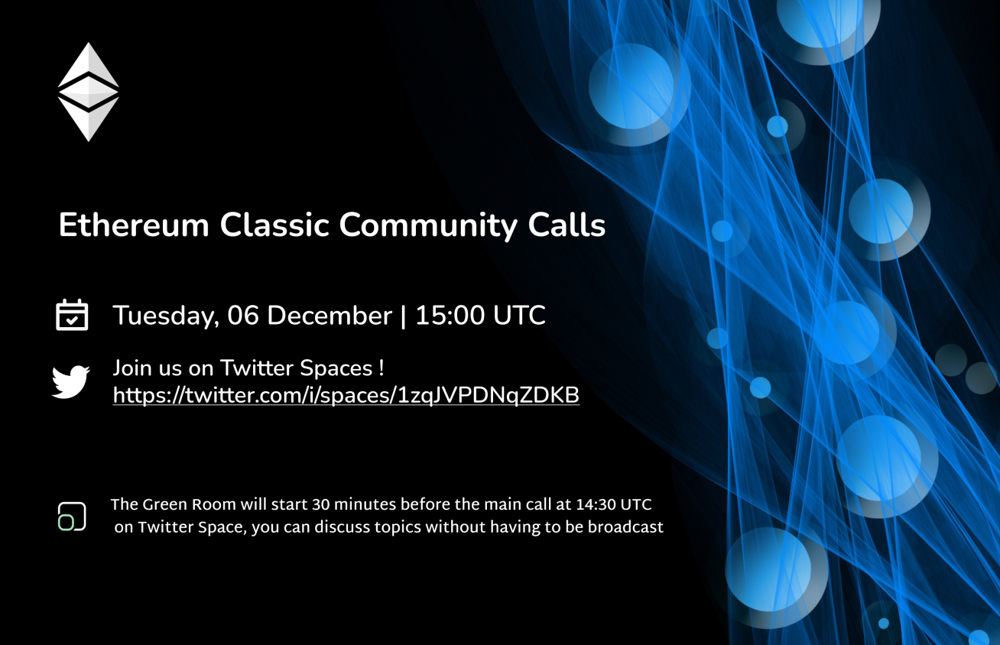
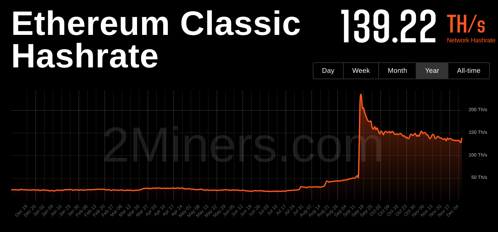

- 1500 UTC Main Call (Recorded): https://twitter.com/i/spaces/1zqJVPDNqZDKB
- 1430 UTC Green Room (Not Recorded): https://twitter.com/i/spaces/1OyKAVkOWmDGb



A casual voice chat to discuss ideas for ETC. All are welcome.

**Join the Green Room 60 to 30 mins before we go live to chat offline, from now on in the ethereumclassic.org/discord #community-calls channel**

This voice chat is an open discussion and anyone is free to join and chat. Please request access to speak in app, and make sure you're using a mobile version of the Twitter app as it doesn't allow speakers on the web version.

We are also live streamining the Space to YouTube, so if you are on the mic please follow Twitter and YouTube's rules.

You can also post questions and comments on Discord in #community-call-notes, on Twitter, or on YouTube we'll try respond to your messages.

You can find the agenda in a reply to this space, which contains links to everything we talk about.

## Housekeeping

- 1 year (1st call in this searies was November 30th 2021)
- Moving Green Room to Discord

## Agenda

Vitals, Ecosystem Updates, Coinbase Wallet, Danoz (?), GraphSense

## Gratitude

Brolal, d_a

## Last Week in ETC

### Vitals



ETC in Stablecoin Mode, 20 usd

https://reddit.com/r/CryptoCurrency/comments/z9z13q/all_vs_btc_which_cryptos_did_bestworst_against/

### Ecosystem

Disclaimer

- EGD Update https://twitter.com/EtcGrantsDao/status/1599548037285969921
- Wedergarten's Space https://twitter.com/SoteriaSC/status/1598696233484304385
- Spanish translations ready to go, awaiting approvals
- ETCCC Website
- Donald's post in EN and ZH https://ethereumclassic.org/blog/2022-12-06-ethereum-virtual-machine-blockchains-and-ethereum-classic


### Show and Tell

- Anything missed above, new apps, nfts, projects, comments from participants?

## Topics

### Coinbase Wallet Delisting

https://twitter.com/CoinbaseWallet/status/1597695219352621057

- BCH, ETC, XLM & XRP
- Custodial Wallet only, still on coinbase (for now)
- They claim low volume
- If you have ETC in coinbase wallet, do not worry, your seed phrase can get your etc in another wallet

- Why did they do it? Let's discuss!
- Volume seems like a made up excude
- Warning sign for the future?

### Danoz

### GraphSense

Open source tool to get pro tools into the hands of the masses  (everyone can spy on you now!)

https://graphsense.info/
https://github.com/graphsense
https://www.ikna.io/

- Mario helping to deploy a version
- Requires "Audit Node"
- ETC is "ultra compatible" (Genesis block)
- ETC has no public audit node, that will change!
- Erigon will help

https://tjayrush.medium.com/building-your-own-ethereum-archive-node-72c014affc09

> You’re welcome to read the following article, but it focuses on OpenEthereum which has reached its “end of life” and will be discontinued. Not to mention the fact that Erigon lessens the requirement of running an archive node from six (6) months of syncing and 12 TB of hard drive space to three (3) weeks of syncing and 2.5 TB of hard drive space. You read that right. Check it out.

> Update Jan 20, 2021: Since writing this article, we’ve come upon a project called TurboGeth (now called Erigon). It reduces the size of the hard drive needed for an archive node from 6TB to around 1.5TB. Significant difference. That’s the same amount of data and much lower cost.

## Etcetera

- Web Updates, Automations, Auto-adding content, https://nvu.io/en/bots/discord-translator, Auto add Youtube, weekly top tweets
- Nomenclature: Profitability, Profits, Block Rewards, etc.
- Tweet Bank
- Rico

## Free Talk

## Sign Off

#ETCtweets reminder

See you next week, same time same place.

---

## Full Transcript

```webvtt
WEBVTT

NOTE no-names

1
00:00:03.360 --> 00:00:38.030
conversation after the intro Classic

2
00:00:35.820 --> 00:00:42.170
Community call number 34 today is the 6th of December 2022.

3
00:00:42.180 --> 00:01:03.729
Etc Community calls is a casual voice chat to discuss ideas about ethereum classic and everyone is welcome we are usually doing a offline chat before this main chat uh in the The Green Room as it's known uh previously this was on Twitter spaces but we're going to be moving this to the Discord

4
00:01:01.620 --> 00:01:22.070
server which you can find at ethereumclassic.org Discord in the community cause Channel and future Green Room offline chats will be held there so please do join and you can find this call every week on a Tuesday at 1500 hours UTC so

5
00:01:19.979 --> 00:01:41.749
yeah this is a voice chat and it's an open discussion that anyone can join and jump in to chat at any point so please request us uh to speak in the Twitter spaces app and make sure you're using the mobile version of the Twitter app as it doesn't allow speakers in the web version we're also streaming on YouTube so if you're on the mic please follow the rules

6
00:01:39.540 --> 00:02:01.969
of both Twitter and YouTube you can post questions and comments on Discord in the community Court notes channel on Twitter or on YouTube and we'll try and respond to your messages you can find an agenda in a reply to this space which contains a link to everything we talk about today and I'll update that as well after the show so

7
00:01:59.040 --> 00:02:21.050
first of all a bit of housekeeping this is actually a one year anniversary of the first ethereum classic Community call that uh me and bro love have been hosting so a bit of a birthday celebration is an order I guess uh apart from this announcement we haven't planned

8
00:02:18.660 --> 00:02:40.190
anything but uh uh give ourselves a round of applause sorry go ahead happy birthday mate yeah well done to you as well so thank you and by the way I'm I'm still checking for speakers if you want to speak please request

9
00:02:36.360 --> 00:02:56.809
access and I can bump you up so this week we are going to be talking about the usual stuff Network my tools ecosystem updates and the news items of the day which is the the coinbase wallet de-listing of Etc and some other currencies kind of interesting uh excuse they

10
00:02:54.660 --> 00:03:14.750
put out there that will dive into in a sec we have a a guest speaker uh by the name of Thanos who's joined us in the chat and we're going to be talking about some uh I guess drama but uh it might be a bit spicy one this week and following that we'll

11
00:03:11.519 --> 00:03:32.750
talk about a project that had um that we research a little bit uh called graph sense and it looks like a very promising open source blockchain analytics platform that we could eventually get working with Etc to enable everyone to spy on each other instead of just instead

12
00:03:30.239 --> 00:03:45.110
of just corporates so with that let's quickly go into the vitals uh ethereum classic hash rate up a little bit this week it's previously at 130 terahash this week at 140.

13
00:03:41.819 --> 00:04:05.210
so the price has not moved much it's in stable coin mode at the moment at 20 US Dollars and hasn't changed since last week I did notice an interesting thread on Reddit uh which is just loading for me now and it's basically a list of all

14
00:04:01.799 --> 00:04:25.790
the altcoins versus Bitcoin um trading this time last year on the fourth first of December 2021 until first of December like last week and basically most of the the Bitcoins are down so like Ada f dot

15
00:04:21.620 --> 00:04:41.870
solves down a lot obviously uh they're all in negative percentage territory um but we have Etc up 55 it gets Bitcoin and we have those Up 77 it gets Bitcoin and XMR uh

16
00:04:38.580 --> 00:04:59.990
one one three percent so it seems like the market is whilst very you know on the whole volatile it seems like maybe over time uh the the wisdom of the crowd is settling so uh that's some good news even though the price

17
00:04:58.080 --> 00:05:22.490
hasn't really uh shown much interest a little data point for everyone there uh there's been a an interesting Twitter post from Etc grants Dao which I encourage everyone to follow on Twitter if they're interested in future funding proposal

18
00:05:18.000 --> 00:05:38.570
updates for ethereum classic uh Etc grants Dao has announced that they are scheduling a Twitter space with bit me next week they're meeting with Bob somwell to discuss about the EDG sorry

19
00:05:35.759 --> 00:05:57.050
EGD ethereum grandstara official website and the selection criteria of rotating members for that multi-sec which will be in charge of releasing funds for future ethereum classic projects funded by uh uh ample and bitmain and uh some updates about the Chinese WeChat

20
00:05:54.900 --> 00:06:19.310
Community which they've engaged so please follow Etc grants now uh on Twitter for future updates on the grants situation on ethereum classic uh another update from weedergarten who has announced that he is doing a weekly Twitter

21
00:06:13.080 --> 00:06:33.350
spaces on Thursday at 8pm EST so you can follow with a garden on Twitter and I believe the space is going to be about defy and uh helping the ethereum classic ecosystem grow in terms of defy apps so uh I'm

22
00:06:31.860 --> 00:06:53.629
not sure if he's in on the call today but maybe he can join us later to chat about that um the Spanish version of the ethernet classic website is ready to go we're just waiting for uh the final approval to get it merged and maybe it will be merged by the time you hear this so this then classic website will be available in Spanish machine translated and

23
00:06:51.419 --> 00:07:12.170
if you do speak Spanish you are welcome to help with fixing those uh potentially misleading machine translations this week talking about ethereum virtual machine blockchains and ethereum classic Donald

24
00:07:08.340 --> 00:07:30.290
are you uh in the chat believe it's available in both English and Chinese did you want to give us a quick uh overview of what you've been writing about this week yeah

25
00:07:26.460 --> 00:07:47.330
the the the the the post uh that was published today um is is the fourth of a series of seven posts that will end up explaining um the the

26
00:07:43.460 --> 00:08:05.270
clients the software clients and no clients that work on ethereum classic core core gets hyper Ledger Basu and Aragon and today's post was about it all started because when I when I had a meeting with with um

27
00:08:03.419 --> 00:08:24.230
Isaac artists he's the the core developer of core Geth the most popular node software uh I was just going to write one post about Corgi and the conversation in the conversation we started to talk about many different angles

28
00:08:21.560 --> 00:08:41.870
and parts and things that people should know before understanding a node client so that's why it ended up being a series of seven posts instead of one and one of the explanations that needed to be they almost done before before talking about

29
00:08:39.479 --> 00:08:59.990
forget is what is the virtual machine the ethereum virtual machine standard no what is the virtual machine what blockchain to use it uh the fact that ethereum classic is the first original virtual ethereum virtual machine at blockchain and stuff like that

30
00:08:57.839 --> 00:09:19.850
so so that's the the purpose of the post and you can go on and uh read it and and it has a video an accompanying video as well um at ethereumclassic.org you're

31
00:09:18.540 --> 00:09:39.889
talking about um the evm model as a standard and how basically as long as the chain uh supports this evm standard which I guess ethereum mainnet is sort of the the flag bearer of and pushing uh the

32
00:09:36.660 --> 00:09:59.470
main sort of Upstream branch of many other projects are also implementing the same uh stack and compatibility with evm including ethereum classic and that gives them a lot of benefits in terms of innovation and downstream uh value right yes the what

33
00:09:56.640 --> 00:10:16.910
happened is the the evm standard which is not only the virtual machine itself which is a software that is replicated in all the machines of a blockchain that supports smart contracts with evm standard uh also has other components like the gas

34
00:10:13.980 --> 00:10:35.269
system that designates um a unit cost per op code so that people can can pay for for the of execution of their smart contracts and miners can get a revenue for that uh it has a programming language which is solidity that

35
00:10:32.820 --> 00:10:53.509
is compatible with the op codes of the PBM um so so developers can build apps using that programming language it has State transition so the virtual machine can receive data process

36
00:10:49.200 --> 00:11:11.410
it execute the the program and create an output with a new state of accounts of smart contracts Etc and the whole network has a storage the ability to store now the code of the smart contracts to to power to power that

37
00:11:07.560 --> 00:11:27.590
this this generic and diamos abstract model of having a virtual machine plus the other components in one way or another all smart contracts blockchains have it even the ones that are not evm evm standard of

38
00:11:25.800 --> 00:11:46.190
all the blockchains that are smart content that that uh that have Smart contracts they all have a virtual machine some kind of gas system they support a specific or a group of languages or programming languages and have all the other

39
00:11:43.260 --> 00:12:04.449
components but the thing is that more or less like windows or Linux or or Mac OS the ebm standard has become the most popular one and therefore now has incredible Network effects um

40
00:12:02.160 --> 00:12:25.670
because it's like an operating system in the future uh the way we talk today about Windows or Mac OS or Linux that are the the predominant and dominant operating systems either for Enterprise server or for the PC or the Mac or

41
00:12:22.079 --> 00:12:42.769
for the group of Mac computers the ebm standard is going to be like an operating system like that it's going to have 50 60 70 market share in the world of the programmable blockchains and that is a natural occurrence because um

42
00:12:39.959 --> 00:13:01.250
both users and developers need to reduce their switching costs and and the cost of building for different systems and even the the blockchains that started were designed to not have the ethereum virtual machine specifically they're all adapting re-adapting

43
00:12:58.920 --> 00:13:18.949
their systems to actually have the AVM system because they have realized that that's the winning standard right and it's not just the developers being able to deploy to these evm chains more easily it's about the whole application infrastructure being able to communicate

44
00:13:16.980 --> 00:13:37.550
and interoperate with each other like if it's on evm then it makes it a lot easier to do cross-chain stuff for example and also um within the same chain obviously so you get multiple different Avenues of network effect by using evm and uh basically

45
00:13:35.040 --> 00:13:57.670
every chain that has an evm will benefit from every other chain that also uses ebm so in a way we're on the same side that is absolutely correct and it's very important to note that ethereum classic is actually the original evm blockchain because ethereum classic is the original ethereum it's the original main net and ethereum

46
00:13:55.019 --> 00:14:17.150
is actually the second blockchain when it Port from the main net when import from ethereum classic however like you said before the ethereum core developers have the lead in terms of um innovation in terms of op codes and design

47
00:14:14.459 --> 00:14:36.350
of the evm model and ethereum classic has followed everything is absolutely up to date uh so it's 100 compatible or nearly 100 compatible with with uh the evm um standard right and I believe in the in the future and

48
00:14:33.300 --> 00:14:54.889
this is probably on the roadmap of Etc as discussed in previous calls with uh Bob Somerville as well that uh there will probably be some kind of versioning of the evm that can be implemented Within uh any evm blockchain so you can have different types of execution environments

49
00:14:52.560 --> 00:15:14.030
and even if you wanted to add additional functionality you can do so in a way that doesn't break compatibility with your existing deployed contracts which will make things really uh it'll be a massive milestone in terms of upgradability of all these different Networks yes

50
00:15:12.000 --> 00:15:32.870
absolutely it happens a little bit with Linux that there's different flavors different colors of Linux but they're all Linux um and the evm standard is going to be a little bit like that where some chains are going to have a color others are going to have a different a different uh variation

51
00:15:30.720 --> 00:15:51.410
but they're all going to be practically compatible um why did you jump in on what you just said about like colors specifically like I I remember projects like counterparty I mean they still exist but these are like colored coins and things that exploit the op return field within you know

52
00:15:49.380 --> 00:16:11.870
Bitcoin forks and stuff and and these were quite unique for their time name Queen and things and I mean um their interoperability now is is non-existent because they're very much isolated they're essentially burnt Bitcoin and they will never be able to be used again but they're chains themselves represent a really early aspect

53
00:16:08.519 --> 00:16:29.569
of what was you know what is now and really simply known as nfts like back then this you know non-stoppable token concept was not very popular at all I can remember being in arguments with people and explaining it more like a bus ticket or a receipt and that wasn't

54
00:16:27.300 --> 00:16:48.110
really well received at all jpegs have landed quite hard I like things like ANS and nettc billboards and stuff like that and and he may have done a great job with their lens I really appreciate the unique aspect one per account but um this interoperability is really important and you know it's almost

55
00:16:45.839 --> 00:17:07.610
like a more ancient type of operating system when you look at name queen or or um you know counterparty and you go back to these sort of pretty ancient alphabetes now I find that's quite interesting that you mentioned it as a color because it's you know colored Queens is something that

56
00:17:04.860 --> 00:17:26.929
many still I like that sort of angle still I don't think it should be dead yes color colored coin was in a way and there were other projects like mastercoin they were trying to use Bitcoin and try to create nfts and and add some Pro programmability and designate

57
00:17:24.059 --> 00:17:45.110
some Bitcoins to represent cars and and external objects in the end ethereum was the final solution to all these uh more complex it was absolutely uh so now yeah so now it's it's very common yamos for humans to need a protocol

58
00:17:43.320 --> 00:18:07.909
and a standard to be able to coordinate and work together and I think that the evm the here virtual machine model for smart contract blockchains is the winning the winning standard and what I meant by colors in this case was that because ethereum classic for example is going to stay with proof of work and

59
00:18:03.000 --> 00:18:24.650
um and maybe some variations of the ebm standard are not compatible with the level of security and the philosophy of ethereum classic maybe some small details are not going to exist in ethereum classic and each blockchain is going to have its own version so that's that's what I meant

60
00:18:22.740 --> 00:18:44.870
by car it would be like different colors of the ebm system another thing that I wanted to to to note that I wrote here in the article is that within all the evm blockchains all our proof of stake except ethereum classic of the major ones

61
00:18:42.360 --> 00:19:02.990
and ethereum classic is therefore the most secure smart contracts blockchain in the world and it's the largest one as well that is that that is an incredible value proposition as well um as a concrete example in terms of the the

62
00:19:00.299 --> 00:19:23.690
colored nature of different evm implementations it might be that in the future ethereum has some proof of stake specific code and obviously ethereum classic would not need to implement that or pull that from the the Upstream Branch so uh having a way to do that in a way that doesn't

63
00:19:20.220 --> 00:19:40.669
uh cause the projects to have like a uh unmaintainability problem um having versioning in the evm would make it super easy to just pick and choose which type of like which version of the ebm contract deployers want to deploy

64
00:19:37.860 --> 00:19:58.669
to and uh yeah I I see that as being a massive win for every evm chain not just Etc but uh especially those that want to pick and choose which types of evm they want to use and which features they uh find valuable for their Network and

65
00:19:55.080 --> 00:20:16.669
an example of a variation that was not implemented in ethereum classic but was implemented in ethereum was um for example something that is included in in both is uh the ability to speed up the transactions by changing the

66
00:20:13.200 --> 00:20:34.450
gas fee that you paid uh in a transaction or canceling a transaction now those when they when they were implemented in ethereum they were implemented in in ethereum classic but then EIP the EIP I think is 1559 that um created

67
00:20:34.460 --> 00:20:54.830
bifurcated the the gas paid to miners into a base gas that goes to be burnt and then into a tip that is paid to the miners to pay a premium so that your transaction goes into the uh

68
00:20:51.419 --> 00:21:12.049
the block uh faster that was not implemented in ethereum classic because it would modify the monetary policy and ethereum classic has a fixed monetary policy to provide certainty to the world no um so that that's an example of how different

69
00:21:08.820 --> 00:21:30.590
systems can can um Implement different variations of the same standard the other ways like a counter to ethereum as well we've also got Kalisto with their cold staking and stuff and I see

70
00:21:28.679 --> 00:21:50.390
this you know it's got its own challenges and things but I do look to this as well as all sorts of Game Theory that's available you know it's not just ethereum it's not just the ethereum flavor or the ethereum color I mean binance smart chain decided to you know split a bunch of the consensus up in a random

71
00:21:46.679 --> 00:22:09.110
21 seat format and look at the the minimum required specs to run a node just a node it's it's become ridiculous like it's actually thousands of dollars and people are complaining about it and it's falling on deaf ears um I feel like this will be a versioning that will eventually just be forgotten about

72
00:22:06.659 --> 00:22:27.409
or perhaps you know just be memed or or it will need you know critical it does it needs critical work um when they're in near that state like I heavily Vibe with everything you've just said the certainty of the monetary Terry policies like so critical from my perspective I was an early proof of work minor

73
00:22:24.659 --> 00:22:46.490
who had the opportunity to go what I call vertical vertical is where you continue to invest or invest in yourself and you're set up and your position you just take your earnings and you go back and back and back and grow and I have grown I have you know I come from you know the space I come from places like BitTorrent

74
00:22:44.280 --> 00:23:04.909
and things of course so um for me I could see you know self-sustainability and stuff but ethereum itself feared me a lot the huge fud and I was you know shamed and you know criticized for this I could not go vertical mining ethereum because it was always

75
00:23:01.260 --> 00:23:22.070
the low mean East pause and I don't agree with that change plus this is the original chain as mentioned so with the new you know the history the immutability being here and that sound monetary policy that's being considered every

76
00:23:19.919 --> 00:23:42.230
time the upstream or the major Upstream it's actually being you know critically focused on to detail and to attention and then brought back to consensus I think that this is just the fairest model and people have the opportunity now we had Asics hit the network I'm not sure if it was late 2016 or

77
00:23:38.880 --> 00:23:59.510
early 2017 they certainly hit the network very fast it certainly made me question what was going on and then we had assets on the ethereum network and that certainly would have put a lot of GPU miners at a huge disadvantage you can go and buy these for dollar and the kilogram at the moment they're almost landfill there are plenty of places in the

78
00:23:58.440 --> 00:24:18.770
world and there's plenty of opportunity to create green energy perhaps you live in a cold environment I don't I'm currently in a heat wave here in Australia 75 relative humidity and nearly 40 degrees it's absolutely ridiculous mining right now is not an option but I think for North American and

79
00:24:16.440 --> 00:24:37.549
European people when it's cold instead of running appliances that just generate heat you could potentially get an older generation of Asic that's perhaps around 2000 watts and you could just aim to you know use that heat put it somewhere where you don't have to hear it whine and scream and yell and push

80
00:24:35.460 --> 00:24:56.690
that hot air and just bring it somewhere where you can enjoy it and this could be a form of you know an air conditioning system that earns for you and that warms you as well and you can might be able to have gas you might be able to just transact on a network I don't even really approach this from like

81
00:24:52.919 --> 00:25:13.190
a monetary aspect I I need that stability I need to be able to maintain a growth and I only see that in a few networks I see it in Bitcoin yes I'm a Bitcoin Maxi I love Bitcoin but I also love ethereum classic I love the fact that you could do yesterday what you intend

82
00:25:11.460 --> 00:25:32.330
to do tomorrow and you may be able to do it a little bit better and I really Vibe with your message then so thank you for all in Australia is 104 degrees in America because he he said Celsius thank you yeah

83
00:25:29.520 --> 00:25:49.669
yeah I do sometimes neglect the uh it's really hot really hot there it's been very hot and that relative humidity is something you can't go outside and work in when it gets you know to these to these you know 28 30 the wet bulb temperature and our evaporation doesn't work

84
00:25:47.460 --> 00:26:09.049
and we start to suffer you can collapse and just you know not be able to see and it's quite a critical situation so we encourage the young kids and stuff in the area to to seek shade and not to put themselves into you know sporting situations even like we encourage them with digital technology here so there are a lot of blockchain enthusiasts

85
00:26:07.140 --> 00:26:27.590
in the making we don't even really talk about these things that they have potential to do they're learning scratch which are like pre-built uh little I believe it's a JS little uh you know templates and they learn to stack them and make little games and stuff but uh digital technology and being you know in

86
00:26:24.900 --> 00:26:44.930
in centralized air-conditioned environments where we're not wasting huge amounts of electricity as well these types of um thoughts are what's going to help us move forward in the future if we need to heat this area we could potentially use an Asic instead of using a heater and that

87
00:26:43.740 --> 00:27:03.769
would be something that could end up benefiting a public school system on mass and this is something we could take to a government and say hey this is going to earn for you this is going to benefit you and this is going to benefit our blockchain and it's not going to change and that's what they need to know I don't look at the government as an enemy

88
00:27:01.559 --> 00:27:22.970
I don't look at tax agencies and things as an enemy I don't do things wrong on the blockchain I don't I don't think that what I do on the blockchain and trying to earn more gas and trying to earn more ability to transact I've seen what's happened on ethereum and stuff more and more and more and more and more gas you know one day's worth of mining wasn't even a transaction for what I was my lining with at one point and

89
00:27:20.580 --> 00:27:42.110
it became ridiculous it was like 10 days just to transact and it's like no no that's not all right that's not okay that's not healthy it's not sustainable changing the chain again to go to proof of stake in this sort of centralized environment I I don't want to speak my own personal opinions too much I think we

90
00:27:40.380 --> 00:28:01.190
can grab the gist of where I'm going with all these pre-built foundations and the Ico and things I've seen it all I was there but I didn't participate too much because my voice was always muted muted muted muted and immutable is very important sound policies are very important round tables are very important

91
00:27:58.679 --> 00:28:21.110
being invited to these you know events I consider them events you know I'm dressed in my North Queensland business um it's higher but it's um appropriate for the weather but as far as I'm concerned I'm dressed in my best and then looking everybody in the eye and really trying to engage with what's actually happening because I know it is happening

92
00:28:17.580 --> 00:28:40.610
here you can speak and you can be heard people will go to effort to try to bring your daps and and the things that you think should be here I've witnessed it myself so I I am I'm incredibly humbled to be invited here and excited to hear you speak and everybody speak because I know that

93
00:28:36.779 --> 00:28:58.730
this isn't just another chain I've died I deal with a lot of chains I like projects that know how to migrate around chains we can get to BSC for me like two Etc and three of their blocks this is 45 seconds or so and one on our side so this is less than a minute and back out as

94
00:28:56.279 --> 00:29:19.070
well so you can get to binance and out if you need to in a minute and I think this is Vital Information I think not everybody's capable of sharing it I uh those have these sorts of you know informations they're not stuff that I want to sell or anything like that is stuff that everybody needs to know and we need to be talking about them a lot um

95
00:29:15.900 --> 00:29:35.930
and yeah I just really enjoy that ethereum classic still maintains the immutability and the fact of the fact remains and the value of what it is and what it was and what it will be is just a moment in time and

96
00:29:33.419 --> 00:29:54.649
I think that this one has the time [&nbsp;__&nbsp;] up it has a huge time factor I think it's the generational one I say this often for things that are useful utilities and things this one does have it it may be a very blank and beautiful canvas that has a big scar through the middle uh that's just a mountain peak and

97
00:29:52.740 --> 00:30:13.730
a ridge and just you know more Mountains to climb and more Peaks to hit and my aths and you know other things and then the worst and the best and and to come and I do I have a lot of faith and confidence and hope for this Shane and I smoke Opium on this chain that might offend some that I mean that but I don't

98
00:30:10.679 --> 00:30:31.669
enjoy smoking opium in in zero-sum games and and greater four Theory games that's for sure I'm here for ethereum classic yeah excuse me to ref to Riff on that point I I saw an interesting uh YouTube video about the rise of Chick-fil-A which is like

99
00:30:29.039 --> 00:30:52.909
a us-based uh chicken Merchant I guess uh they uh they they never intended to like massively expand but instead they slowly grew year on year and never really uh took on debt and didn't do like a massive franchise push

100
00:30:48.960 --> 00:31:11.029
like uh KFC did and where we are today is that KFC is losing market share to um to this uh company that's been around for about the same period of time and just by having a different fundamental approach to their operations allowed them to survive long term without

101
00:31:08.220 --> 00:31:28.970
overextending without requiring like massive cash injections and just by having a solid foundation that you keep building upon and keep plodding along and you don't really need external support for that uh you just keep growing naturally and I think this can also be applied

102
00:31:25.860 --> 00:31:46.730
to blockchain projects and those other chains that have you know massive cash injections that's great as long as they translate into real world value and that means actual users are not just uh well fake traffic and uh a lot of fanfare

103
00:31:43.200 --> 00:32:04.430
and t-shirts with your logo on and no nothing against much but uh I'm sure what those doubles could be spent uh in different ways even after he sold most of KFC um

104
00:32:01.380 --> 00:32:24.049
Harlan Sanders or Colonel Sanders had to go back to most of the franchises and basically chastise the the owners and the franchise owners and the people that were operating and basically teach them what to do even though it was out of his hands he went back and he was so disappointed in what it had became because

105
00:32:21.059 --> 00:32:43.669
he had let go of essentially what was his IP and they had his face on it it still is an easy turn on now essentially unless they run it into the ground maybe this will be uh analogous to uh vitalik is the new Colonel Sanders eventually in the future he'll have to uh be

106
00:32:40.740 --> 00:33:02.149
be returning with a bit of uh advice for the remaining future capture of ethereum but just speculation there it's very it's very good I could catch ing I could I could all right so shall we move into our first topic actually before we do go into

107
00:33:00.539 --> 00:33:23.330
the topics I just wanted to open the floor in case there's anything we missed in the uh ecosystem update if there's anyone in the chat that wants to announce any projects that you've been working on uh now is the time and I'll look out for any emojis or people that want to contribute I'll just give me a couple of seconds

108
00:33:19.500 --> 00:33:41.450
here requesting to speak the news cycle this week been pretty uh another crazy one with all

109
00:33:39.299 --> 00:33:59.630
the FTX stuff but one of the smaller but interesting Etc related topics was that coinbase announced that uh after much consideration they decided to de-list four cryptocurrencies from their custodial wallet which is pretty interesting so bch which is a Bitcoin cash

110
00:33:58.440 --> 00:34:20.690
I believe Etc xlm and xrp so I believe that's stellar and ripple were delisted from the coinbase wallet so not the coinbase exchange but just the wallet so this is a custodial app I believe that you can download on mobile that people have been using to store

111
00:34:17.460 --> 00:34:38.089
those tokens previously and they mentioned that apparently because of low volume these coins need to be delisted now and that excuse doesn't really make much sense but we can talk about that in a second if you do have Etc and coinbase wallet you don't need to worry because the C phrase

112
00:34:36.480 --> 00:34:56.810
that you used to generate your wallet will be compatible with other wallets I believe so there's nothing to worry about in terms of losing access to Etc as long as you made that back up which you should have done um but yeah let's let's discuss this uh low volume excuse

113
00:34:53.879 --> 00:35:14.390
to de-list these four currencies which um are in the top 20 and certainly have higher volume than some of the other coins that did not get delisted so why might they be doing this and is there something strange afoot is there a warning sign for the future let's

114
00:35:09.540 --> 00:35:30.470
discuss the beginning of them just letting go of that wallet I just think that they realize that it's a bunch of technical debt that they don't need as you said it's a centralized wallet that nobody really

115
00:35:28.619 --> 00:35:49.010
needs nobody's I don't think anybody is really using it um I respect the the you know the shout out to make sure you're taking responsibility of it if you are using it definitely do that but I think they've used and they they've used the ethereum classic name and ripple the attention that

116
00:35:47.220 --> 00:36:09.290
Ripple's having at the moment with their lawsuit and stuff and it's just very convenient to them to say blah blah blah a bunch of names that are convenient and nice and sort of cloud Chasey uh bye bye and we'll quietly see them letting go of that wallet entirely um

117
00:36:06.599 --> 00:36:19.670
I think that mainly because they have a history here as well and they do have a duty of care to make sure that we would go first I think it's halfway or maybe you know 80 20.

118
00:36:16.859 --> 00:36:37.670
I don't want to be like you know Central identity bad I don't I don't just want to throw everybody under the bus because they're centralized like I have a wife and I have children and stuff or don't hate me um I'm not out here completely decentralized by myself um but I do think that there is some combination

119
00:36:35.579 --> 00:36:57.170
of their duty of care to inform a large community like ours that's been you know fractured with what happened with what is now the Ergo account or whatever happened with that and how they lost the verification I'm quite livid um that's something that I'm going to need to take up again but also uh yeah their duty of care and also a little bit of

120
00:36:55.380 --> 00:37:21.530
you know attaching our name to something that they're in going to end up doing so houses is sunsetting this technical debt that they've created for themselves trying to offer a solution to users um in terms of you know a version of self-custody that they envisioned at some time the

121
00:37:18.420 --> 00:37:38.990
technical debt thing because really there's not much maintenance required to uh it's actually more work to d-list than keep Etc on there basically I mean there might be some I mean just doing a wallet with basic transactions

122
00:37:35.940 --> 00:37:58.730
doesn't even need the the application to be updated as far as I understand as long as the the chain remains backwards compatible it will work um there might be security updates but nothing like major um well for sure I think this is an ethereum classic issue I think this is a coinbase

123
00:37:55.859 --> 00:38:16.910
issue I think they realize that having this strange semi-self but centralized custodial wallet of their own thing that nobody's using is the technical debt I think that because nobody and we've proven it we're a large community that should be using it if we were going to I think they've more

124
00:38:15.240 --> 00:38:36.650
reached out to like Ripple and stuff like no if Ripple isn't using it and nobody's using it then nobody's using it I think you know within the next 12 months they will just end up saying we're not doing this and and work out having something that's either centralized and custodial which is their you know platform itself or use metamask or

125
00:38:35.160 --> 00:38:58.270
trust or whatever they're going to tell people to use that's actually properly frustrated this which is that uh again putting on a tinfoil hat um maybe these are coins that are uh against their future vision and they don't want to be associated with

126
00:38:54.359 --> 00:39:15.829
uh Forks like EDC and well absolutely absolutely I mean Ripple's going through all this court case and stuff it could be a bad image for them considering they're the the main stock with the name Queen um that that is in itself their own territory they do they are very PRI like prideful

127
00:39:13.440 --> 00:39:34.430
and they should be of their um their licensing and status in New York which is incredibly you know that's a Holy Grail as far as I'm concerned we can do Liechtenstein or we can go to um you know all sorts of Caribbean islands or funny places off the coast of wherever um but you know there's even Sovereign countries

128
00:39:31.619 --> 00:39:53.870
or little um you know what are they micronations and things that people could actually use it even you know their own level of legitimate but um yeah I can I could say that absolutely I don't think it deserves some some tin foil I think it could be their image is very important to them because it is important to them and I could say that you

129
00:39:51.060 --> 00:40:14.510
know having issues in a bunch of you know legal cases and just ethereum classic and its history and stuff I don't see it the enemy in in this one I could say Ripple being an issue I do think there's a little bit of cloud chasing there I think they've dropped us in there because we're famous I just saw a tweet comment from composed down.f

130
00:40:10.500 --> 00:40:32.930
uh asking does etc still not have a HD wallet issue with CB that represents true technical debt uh unfortunately I'm not I've never used uh coinbase wallet so I'm not sure about that but if it is a problem I I can't really see why it would be because they're one-to-one

131
00:40:29.520 --> 00:40:50.930
compatible with ethereum so I if it is true technical debt uh it would probably take about a minute to fix probably just by changing the HD path yeah I can't really see why that would be a big problem with uh ethereum and ethereum classic difference

132
00:40:47.820 --> 00:41:09.589
implementations and it's there's someone who loves to speculate outside of prices I I see this as a huge window into their server rack and stuff and it's just a huge uh Rat King of of wires and cables people tripping over and fires in the corner and people bringing you know water to electrical

133
00:41:07.740 --> 00:41:29.450
fires and and they're bringing you know the the powder um extinguishers to other things it shouldn't be and they're just messing everything up like it is such a simple thing to get to get it you know supported and to make us want to use it but we don't want to use it to begin with I I feel like you know we don't need to make the message or anything like

134
00:41:27.540 --> 00:41:49.910
that it's quite clear internally that you know we didn't really want to use their kind of freakish wallet that doesn't really serve much for the purpose so that's why I think that they're just gonna Sunset it and let their own thing go and they've kind of just dropped us there with ripple and stuff because again it's kind of just a Fame thing like we're hot news and it's kind

135
00:41:46.980 --> 00:42:09.950
of spicy and oh like it's halfway between keeping us down on and then pulling us like using us as you know when somebody's drowning don't approach them from the front approaching from behind so they can't use you to push you down and stuff like I think it's a little bit like that I I don't call any centralized entity capable of more than they

136
00:42:06.359 --> 00:42:27.890
display man coinbase uh position here and I think first of all to be fair I I don't think any of us should hold this move against them they're perfectly uh free and should be free to do what they

137
00:42:26.280 --> 00:42:46.370
want with their own application there are some potential long-term uh benefits to removing Etc one being that they don't have to deal with customers customer support of people sending EGT to the wrong wallet and buying the wrong version of Etc they don't

138
00:42:44.099 --> 00:43:06.230
have to maintain uh our BC endpoints for ETC anymore so there are some benefits but uh having having steel amount I I should still refer to that I guess our own stated objective of making crypto accessible to everyone and I

139
00:43:03.720 --> 00:43:24.109
don't really see how this move uh goes towards that goal but uh I'll leave it at that and if there's anyone else in the chat that wanted to speak up yeah buddy yeah the coinbase wallet thing like I don't think anybody really cares because nobody I don't to this day I haven't met one person who actually uses coinbase while

140
00:43:21.960 --> 00:43:43.190
they like release coinbase while it's so late in the game to where metamask already was dominating everything in fact Apple has removed or is removed I don't know if they're already have removed or removing but they're removing coinbase wallet from their App Store so nobody uses it up and they've like disabled parts of it and

141
00:43:41.579 --> 00:44:01.790
stuff and they need to like reapply and you know how that application takes a week or 10 days 21 days or you don't know nobody yeah just join-based wallet period and that's why that's one of the main reasons why apple is removing it from their store because nobody cares about a coinbase wallet it's just to see the coinbase has tried so

142
00:44:00.180 --> 00:44:22.309
many different things and they they failed at it just like that their nft platform that they have released nobody uses that nft platform you know so just because they're removing Etc it's really nothing they remove an xrp and all these other uh coins you know it makes no sense for them to do any of that all it is they're trying to make someone oh save some money

143
00:44:20.160 --> 00:44:42.530
probably shutting down some nodes and whatever every little bit that they can scrape up that's what they're doing but nobody really uses coinbase wallet and you know they're already getting removed from App Stores so them removing Etc is nothing because if you think about it uh the wallers that are dominating the game right now was

144
00:44:38.579 --> 00:44:59.329
it rainbow wallet we have uh what's the the the the trust wallet yeah the curve yeah we got motor mask there's so many freaking wallets out there it's like it's a drop in the bucket it means nothing so I don't even understand why people even so like even talking about it

145
00:44:56.579 --> 00:45:20.990
it makes no sense yeah I only bring it up because it made uh the the largest news this week right uh the largest news because nobody even it's like it was almost like an advertisement in fact they probably got more just from you know hearing about oh clothing

146
00:45:15.900 --> 00:45:36.829
base has a wallet you know um related to to coinbase so what happened is they didn't just uh stop

147
00:45:33.480 --> 00:45:54.010
supporting Etc they've also stopped supporting Bitcoin cash so what you have is two is two grayscale projects that that are now unsupported so if

148
00:45:49.740 --> 00:46:11.950
we were to speculate here I think there are some tensions between grayscale and uh and koi base due to maybe the Genesis Trading firm

149
00:46:06.740 --> 00:46:29.809
so I think that there are a lot of tensions between big players in in cryptos and these explanations that the chain is not the views or doesn't have that much attraction it doesn't Stand By Me

150
00:46:26.460 --> 00:46:50.450
because they have supported this uh this change since the beginning I think and also the good point Fork so just having a sudden move like that after uh coinbase

151
00:46:46.859 --> 00:47:08.690
wallet for ETC specifically and that's why they were like well we're running these nodes we're hosting all of this we're paying money for this we might as well remove it uh Bitcoin cash I mean I don't even know why anyone's still running Bitcoin cash knows uh that should have been going I don't you know out

152
00:47:05.160 --> 00:47:26.210
of existence period yeah you need you need to look at the big picture yourself absolutely I agree with you bro well absolutely I say this decentralized entity place here I I see the bigger picture in the sense that grayscale I believe that uh coinbase is in custody or

153
00:47:24.300 --> 00:47:44.630
something of their their assets and this could be a really interesting play where they suddenly cut off grayscale from that total ETF and that's it yeah they they had a wallet right if I create a

154
00:47:42.720 --> 00:48:04.069
wallet for ethereum classic in fact there has been many people that have created wallets to run on ethereum classic enough if I created that wallet and nobody uses my wallet nobody uses my application what's the point of me hosting nodes and paying out of pocket that's what they did they did nothing more than that I don't understand any

155
00:48:01.520 --> 00:48:22.550
more than that that's all they really did nobody uses their software because it's like useless it's even it's less than a fart in a win let's just say that well

156
00:48:20.099 --> 00:48:41.329
I mean to minimize it like this means you don't see a bigger picture at all like if you don't see that a coinbase is in custody of grayscale's assets the grayscale is beholden to coinbase what does that have to do with the wallet well if I was able to finish my sentences

157
00:48:39.780 --> 00:49:01.430
instead of being cut off Midway we'd get there if they use ethereum classic because ethereum classic is now the largest proof of work Network as well as the alternative being bch to bitcoin and then we see grayscale in this picture as well and we start to use

158
00:48:58.800 --> 00:49:21.710
Ripple and their case with whatever's happening over in America oh that's a lot of attention from that so we've collected all the biggest alternatives to everything we've put them into one new cycle that people like yourself don't seem to care about that you

159
00:49:14.940 --> 00:49:35.750
can please it occasionally it's quite cheap to transact it's pretty annoying to get conks on it takes a minute but it still works still got to give it a go if you want to give Etc a go you should give bch

160
00:49:33.660 --> 00:49:54.470
a go and see what a mature is to there are smart changes pretty cool and it was reasonably secure too so it's not like what the biggest you know what's being fed it's also what you could see in it if you don't see you know grayscale and coinbase sort of beefing it out maybe then you should definitely keep

161
00:49:51.119 --> 00:50:11.270
an eye on it lau's point is pretty uh you might be onto something there and I hadn't thought about that and there is like the whole what is it a coin desk I believe is owned by uh the

162
00:50:08.520 --> 00:50:30.349
uh digital currency group and there has been a lot of like [&nbsp;__&nbsp;] flinging sorry and wasn't coindesk and everything wasn't that related to bitecoin are we aware of the bytecoin scam and and lift and blowing the lid off of the bike coin scam

163
00:50:26.940 --> 00:50:47.630
except for Monero wasn't this a a bike Queen a project like these this goes quite deep I can give you this stuff I'll give it to you out of the conversation and and you can have a read over it because it's really really interesting it really does go this deep like it did yeah the coinbase and then grayscale situation really is interesting

164
00:50:46.140 --> 00:51:08.690
and then bit main is somebody we can cooperate with their Asics have been around for a very long time and they're helpful to us like this is a really good opportunity to be real can I just jump in uh I see we have an emoji hand raised from Daisy and uh I'd like to allow everyone to speak so Daisy you

165
00:51:04.800 --> 00:51:28.670
want to take the floor can

166
00:51:25.920 --> 00:51:47.230
you tell me how can I get support and what are your project rules tell me in simple terms but ethereumclassic.org is where you can find all the information about ethereal classic

167
00:51:43.740 --> 00:52:05.750
uh you can join us on Discord at ethereumclassic.org Discord and you can probably find uh all the links that you're after there uh in terms of uh staying on this particular topic maybe we can uh jump in again at a later point but

168
00:52:02.640 --> 00:52:25.250
just to continue not derailing this um why don't you uh jump in after we finish the topic of coinbase and we can talk about more on your questions Daisy right okay uh so

169
00:52:21.720 --> 00:52:42.230
yeah on the uh topic I guess this is evolved uh into uh the all-encompassing FTX thing as well because this is what triggered all this uh I guess underlying stuff to come to the surface in a lot of cases

170
00:52:38.460 --> 00:53:00.049
and I guess that FTX was the uh the breaking point that has caused all these big players to realize that there is um now the pie is shrinking and the knives come out and only the the ones that Survive by potentially damaging each

171
00:52:57.480 --> 00:53:18.410
other's reputations either by news organizations or by de-listing others currencies maybe this is all how it plays into the big picture as Brolin was alluding to and again this is all just conspiracy speculation so uh who knows what's really going on but it

172
00:53:16.619 --> 00:53:36.770
would be nice to be a flying on the wall of some of those high-level conversations coinbase D listing before we move into the

173
00:53:34.680 --> 00:53:56.049
next topic I can see that Darius has joined us so maybe it might now be time to uh to go over the uh the spicy area is it um thanks for joining us things fingers good to see you here for the first time um

174
00:53:58.920 --> 00:54:21.650
you're the one making all the spicy stuff the good stuff yeah so first can you can I can I just uh preface this this section with a potential drama warning uh and I just I just wanted to give our listeners a bit of background that uh I believe yesterday in the Discord there was a user

175
00:54:18.300 --> 00:54:41.210
called uh daros uh now known as King's finger king fingers down King's fingers down sorry um on the on the Twitter spaces uh was posting messages in the Discord about um basically some potential uh unethical Behavior going on in some of the projects

176
00:54:38.220 --> 00:54:59.569
on a film classic and basically the Discord Community as far as I'm aware is kind of disconnected from the rest of the nft ecosystem in ethereum classic and a lot of these projects are just kind of having their own sort of siled communities so maybe King's

177
00:54:57.480 --> 00:55:18.950
fingers you could take the opportunity to just give us a high level sort of overview of what what's going on in the nft verse on ethereum classic and then also just introduce us as neutrally as possible to to the the issues you wanted to raise yeah

178
00:55:16.380 --> 00:55:38.089
yeah definitely and I I do I appreciate the opportunity to speak I spoke with Darius yesterday or the day before it's kind of blurry when you do you know 1am chats and stuff in in your time zone and it's different for others it's already yesterday for you guys I live in the future so when I say yesterday it might be an extra day or two

179
00:55:35.460 --> 00:55:55.609
but we've spoken on the phone I would prefer not to do private conversations and to do open conversations um I've been paying attention I've been paying attention to ethereum Classic for a very long time um but I don't feel the reason like the need

180
00:55:51.960 --> 00:56:13.490
to say since when I mean I can you know just by listening I think you can understand where I come from in terms of History I I've sided with this here but I didn't feel like I could contribute to what was actually you know the truth of the fact that code is law um

181
00:56:10.980 --> 00:56:31.910
I can't contribute a lot of code and I don't claim to I do focus on the a peer space a lot again I I asked earlier if anybody's aware of things like bite Queen and and you know this is not a recommendation this is actually you know so I guess a call against it don't don't look

182
00:56:29.339 --> 00:56:51.170
too deeply into it um but it's definitely interesting when you look into this peer space and and you see some of the things that have happened um I'd like to clarify that you know I didn't make any allegations or anything I grabbed a comment that was made on the 24th

183
00:56:48.300 --> 00:57:09.890
of August in my time zone which would be a week after a project called classic Shiba classic launched there's a lot of these uh classic flavored and classic colored you know it seems to be a theme that everything has to have Classic on it and and be classic like I understand a lot of the classic projects that

184
00:57:07.740 --> 00:57:29.030
have existed over time and and some of the reputation they've had like I was involved through 2017 of mining zcl Z classic and I mean that was a bit of a travesty what happened over there and and um some information you know regarding that is even available from my perspective and opinion and then the things

185
00:57:26.880 --> 00:57:47.089
that I saw there it's kind of irrelevant to this topic right now but it is a part of the history and things that I've witnessed again viewing things from the peer space as someone who's quite you know invested in the uh the decentralized and trustless aspect and and

186
00:57:44.940 --> 00:58:06.049
you know the propositions that people offer I I judge them and you know approach them as you know of their value offering and the sort of gain that they offer rather than looking at the chart or anything like that I look deeply into things like the pre-announcement um articles and things and these you know

187
00:58:03.960 --> 00:58:25.609
I I would like a Bitcoin talk Forum or something like that announcement where most of the OG Community would look for things like this I think that's just you know a nice thing to do I think isolating things to medium is why a lot of these projects that intend to succeed properly don't because they don't launch in the right way um but yeah just

188
00:58:23.000 --> 00:58:43.990
to keep things on topic could you give us like a a brief sort of picture of what the ethereum classic nft slash uh elc20 uh Universe looks like right now it looks pretty shady it doesn't look great okay

189
00:58:44.000 --> 00:59:05.329
to be honest it looks like it's you know a small group of centralized entities that have pushed a lot of copy paste stuff from other chains with a lot of low effort um with a lot of low intention it just seems

190
00:59:03.240 --> 00:59:24.829
like if it's gonna work it's gonna work it seems like it's built on some greater Falls going to come in later and buy it for more it seems like people are using you know larger amounts of funds that rake people on decentralized exchanges that have very little liquidity and stuff it looks like is this

191
00:59:22.380 --> 00:59:44.089
is that uh specific to ethereum Classic though because I'm pretty sure a lot of this goes on on uh ethereumener and other uh platforms it does but these platforms have like really I I would say they're inflated they're tbls and stuff are obviously inflated they're filled with memes they'll be scams if it were jokes

192
00:59:41.700 --> 00:59:55.670
but you look at things like defy llama and you see there's you know there was eight hundred thousand on in September tvl on ethereum classic it's now under 300 000.

193
00:59:51.900 --> 01:00:13.130
it's starting to look quite Bleak when there are people using thirty thousand dollars worth of ethereum classic to rake thirty dollars on someone so somebody buys one of these meme tokens expecting that somebody's gonna buy it off them for more later and this is just greater

194
01:00:11.280 --> 01:00:31.670
full Theory and a zero-sum game and nothing more and then thirty thousand dollars just use this to sell on top of that so the price moves straight under and that person can't leave on the price they bought into immediately I've got screen shots of these behavior and behavior that these other projects have to bring into Etc and

195
01:00:29.520 --> 01:00:51.109
things and I don't make any claims of Darius so I just asked for confirmation because he attached his name or so Terry his name to an audit that a lot of the ogs had decided to say this may not be what it's being claimed to be I asked for confirmation on a particular statement he made on a sentence

196
01:00:49.440 --> 01:01:09.470
and I asked if these were the addresses that he could confirm belong to sketch it became an open accusation that I'm a con man and a Broadstone let's let's back up for a second um there's some context that I think some of our listeners might not be aware of

197
01:01:06.839 --> 01:01:27.109
here and I don't know what who's get who is sketch and uh what now as Darius has his hands up why don't we hand over to him to uh give his side of stuff yeah yeah uh well before I begin uh thanks for having me again on this uh call this week

198
01:01:27.119 --> 01:01:48.349
um so yeah that's a very good question so let me just talk a little bit about the the history when I first met uh King's finger or Danish here and the first impressions that I had and then move on forward to to uh the situation that he's that you're talking about um so I first uh there is a telegram group

199
01:01:46.859 --> 01:02:07.309
called Etc billboard for uh Etc billboard project uh and I met Dana's there uh he seemed very enthusiastic about that I don't know if he's behind it I can't remember um no no I'm not that's a completely unrelated project to me I just like the YouTube

200
01:02:02.940 --> 01:02:23.630
video yeah can we uh let's uh there's a bit more structured so if Darius could just be allowed to finish his uh piece he's about to give his perspective about how he met me and I've just said that I've replied to a statement he's made for more clarification

201
01:02:21.240 --> 01:02:42.349
he's about to give his opinion of me in public again and being given that flaw while I've not given my opinion of I've only ever asked for clarification you will totally have your ability to respond uh I just want to make sure that this conversation can be uh balanced that's good I would just like

202
01:02:40.740 --> 01:03:00.770
to clarify that he's a about to give an opinion of me at this point and I've only said that what I have done is asked him for clarification on what his actions were I'm sorry I I wasn't going to give any opinions um okay let me get back to that um

203
01:02:56.940 --> 01:03:17.030
right so yeah so I met you on uh on the ETC billboard uh thing and I proceeded to ask around to see okay well what because I hadn't seen you before to see you know what what uh people had spoken about you uh and then I and I found out you were behind some uh some so

204
01:03:14.640 --> 01:03:34.670
I was I'm in the the telegrams telegram groups for Ace uh for Sheba and so I was just trying to see okay what do people know about you um and there were a lot of people accusing you of creating a token that was draining liquidity and I didn't I wasn't 100 sure that what you were doing malicious

205
01:03:32.220 --> 01:03:54.170
was malicious or not um so I I just but I just wanted to keep an open mind because a lot of people were saying that they were malicious things that you were doing but I'm not going to accuse you of anything because your project does seem to have some you know some reasonable uh you know utility and uh and I and I applaud you for that because a lot of projects don't have utility

206
01:03:51.599 --> 01:04:12.829
uh and I wanted to also agree with you that a lot of the projects on Etc nft projects erc20 projects are all a zero-sum game uh nft projects are even worse than a zero-sum game because uh when people buy those nfts they all of the money goes directly to the person who created it and that's a that's a serious

207
01:04:11.220 --> 01:04:32.089
problem because all those funds just probably go into that person buying a car or something and the people who are left are people just holding monkey images and um and I've been pretty clear since day one that I'm not in favor of having uh projects like that but you know people continue wanting that and people

208
01:04:29.040 --> 01:04:49.250
came come to me to set up smart contracts and websites for things like that and I agree that working against my own morals uh does you know is is does is a bad look but you know we all need to uh you know you know feed the family sometimes so I I really would just like to

209
01:04:46.980 --> 01:05:07.370
jump in on you here because I don't want you to justify yourself at this point I'm quite confident that you're very intelligent and and that you're worthy of exploring this space in your own right I I'm not trying to drag you over the coals and I do intend to be a peer to you and that does mean friend and

210
01:05:04.740 --> 01:05:26.270
that in some terms means mentor and that also means that you'll be able to teach me a lot of things that I'm incapable of doing I really don't want you to justify yourself for anything here when I approached you in the open Discord I did that because I wouldn't have been able to do that in these closed communities that you're aware of that kick people when remove people for asking

211
01:05:24.299 --> 01:05:45.109
any question at all in these zero-sum games I approached you and I asked you if these were the addresses that you had looked at to see if you know their contents and their balances and things and then I also shared what had happened with the Sheba classic community in some reference I don't intend

212
01:05:42.240 --> 01:06:04.430
to attach that to you directly I do think that potentially you've been used in a larger scale thing I don't really want to talk about that now because I don't really attach that directly to you I think again crypto sketch and these people that are involved in these nft zero-sum games where

213
01:06:00.480 --> 01:06:21.109
they get 100 of the claimed split to buy back and all of these little schemes that they've got going on that most people aren't aware of you and I are aware that this is going to a single multisig this isn't going to a buyback you're somebody who can help me here improving

214
01:06:17.960 --> 01:06:38.270
what can happen and it is very unfortunate what has happened in the situation but what I want to make clear is when we met in ETC billboard telegram I'm not directly involved with that project I just sort of saw it when I've been looking through what's on Etc and I thought

215
01:06:36.359 --> 01:06:57.230
that one has a lot of potential it has you know the rent revenue and stuff like that which I can just inject back into a project if I wanted to it could be one of these silly dog triangle-headed meme tokens or something you know I bought it myself and I burned my whole bag and that's okay I'm all good with that I didn't take anything I didn't

216
01:06:55.260 --> 01:07:15.470
train liquidity I didn't sell during that time except for some LP and you'll understand LP you'll understand impermanent loss you understand these DJ and silly plays and stuff but I didn't make a play on that Market at all they drove it to a one and a half million dollar market cap they got dumped on by people that came in from other chains because

217
01:07:14.160 --> 01:07:35.750
that's what I'm trying to do is bring the liquidity in are you no analyzer feel most of these people won't know this name or anything like that he and I did some LP together and at this point I had to deal with his rap BTC and my kngi liquidity and I did do this anybody can go and ask him if I held a steady hand and the steady ship and got him

218
01:07:33.780 --> 01:07:54.829
back to where he started with and that's what I said I'd do and that's what we did and that's all that happened I didn't walk out any better or any worse I have like apparently egg on my face but I do stand on what happened and I know that Darius can help me with this I do think that some things have happened that we are all sort of aware of

219
01:07:52.920 --> 01:08:13.670
that there are unscrupulous characters in this space that that will go to use things like Audits and and have them you know used as some sort of you know referral or thumbs up as you know this guy said we're great and this is Matt Damon and Matt Damon said buy it like

220
01:08:10.079 --> 01:08:30.769
they all do it so I'm not blaming you I just ask you for your opinion because you said that you saw sketch and he had sold and he sold and he's playing and he's just involved and stuff so yeah I just like Clarity on that that I actually shared with you guys launched it

221
01:08:30.779 --> 01:08:51.349
okay yeah thank you no I I want I agree with you uh that these some of these projects may have Shady stuff that we don't know uh going on behind them and um you know Cuba classic to me is a project that I audited they're smart actually I never called it an audit I did a Security review on their smart contract

222
01:08:49.080 --> 01:09:10.789
uh and but other than that directly for Sheba classic I never really kept track of what was going on the price or the community uh you know I I look at their telegram every once in a while but I have I have no you know direct connections uh with with the team so um you know I wouldn't worry about that uh

223
01:09:07.500 --> 01:09:27.890
too much but uh I can all I can always look at you know seeing who is the holders of these projects and this is public on chain so as you said uh but I don't know you know the addresses that you showed me I can't I don't know if they're they're uh sketches um but I did want to did want to mention that

224
01:09:25.859 --> 01:09:46.070
uh you know you said you want to you know be peers and and work together and I agree you know you seem like a pretty smart guy and I it's it's awesome that you come to ethereum Classic we don't get a lot of new people here um but you know I would like to be able to do

225
01:09:43.199 --> 01:10:04.729
that but I can't trust someone at least for a while if they're if they've just gone on Twitter and began posting uh and digging deep finding my my full name and going to find things that that I did on a Discord server uh you know two years ago when I was 14 years old and

226
01:10:00.860 --> 01:10:21.950
so if you could I'm not going to ask you to stop because it's it's your Twitter you know you do whatever you want but if you do want to cooperate and want to continue an actual you know positive path forward uh it's just important that you know we get along and you know if you have SP and

227
01:10:20.100 --> 01:10:42.110
as I mentioned and I was talking with a lot of a bunch of people yesterday in uh in one of the in a Twitter chat and I S and they and they started talking about what the things you were saying on your Twitter page and I said look I'm here all the time you can contact me at any time if you have questions you can always come to me and I will answer them with them with honesty

228
01:10:39.900 --> 01:11:00.130
and with the best to my ability that I can do and my my firm secretary smart contracts has been transparent since day one and we've been you know honest with every person that's come forward um so if you have any specific questions uh Thanos or King's finger um

229
01:11:00.140 --> 01:11:21.950
questions like I wonder what you're even doing in the space to be honest like you were two years ago saying that you were 11 years old to troll people in a game and then you went and tried to like claim that the needed review and then you lied to that Forum as well like get off the internet and stay out of these chains

230
01:11:19.440 --> 01:11:40.490
for a while that that would be my advice it's uh helpful to finish please like and then you can have the floor because it's quite late for me I've sat here for hours waiting for this days can we just hold off on the personal

231
01:11:38.640 --> 01:11:58.729
stuff if that's possible just to keep things absolutely but absolutely but he he leaks like a guy hose and I can't help that if you look for his name you're going to find it everywhere and you're going to find that he's a liar and you're going to find that he tried to lie about his lies and now he's telling me how I need to treat him when I'm

232
01:11:56.880 --> 01:12:20.689
probably like nearly three times his age probably like I've probably got kids that can match him in age like I don't appreciate being told how to operate by a child so I'm just going to believe it correct

233
01:12:17.280 --> 01:12:38.090
answer I mean do I get an opportunity to actually finish a sentence ever or am I gonna have to keep going over the stuff from the start because it's exhausting and I'd like to build it's a bear market and I'd love to build I can see this guy spamming his thumbs I can see these people spamming down I don't

234
01:12:36.300 --> 01:12:56.709
really mind I've been asked to speak if you'd like to hear me speak I will otherwise I will just continue doing what I'm doing busting these scams while you guys are absolutely nothing bro I'm trying to hear about Etc I'm not trying to hear about an argument this is kind of stupid absolutely I didn't even want to have this conversation I came to the green about

235
01:12:55.260 --> 01:13:15.770
it stop [&nbsp;__&nbsp;] picking on one person but you're unaware about it bro just get off the [&nbsp;__&nbsp;] community because things are getting a little bit crazy

236
01:13:11.820 --> 01:13:32.810
here and I'd like to return to somewhat civilized discussion before everyone starts screaming at each other and I'm gonna I'm new everyone in a second but I'd like first to hear from uh Darius and we can try and wrap this up and

237
01:13:29.640 --> 01:13:55.189
I'm going to allow like just a quick comment and then one more quick comment and then we're going to move on and we're going to move into the next topic after that so uh please do not uh take too long and please do not do any personal uh attacks or insults please

238
01:13:57.360 --> 01:14:17.810
enforcing Law and Order or whatever you want to call it a story I appreciate it um yes look uh look I'm Gonna Keep it clear and concise uh I I'm here okay I'm honest if you have questions you can always come and ask me and I don't appreciate somebody that you know is going to come on a community call and try

239
01:14:15.000 --> 01:14:35.990
to personally attack me and and say things about me that frankly I don't believe are true and if people have evidence of that being a lie you can always come to me I will I will answer your question as best as I can and if I have made a mistake I will admit if I've made a mistake and I have made mistakes in

240
01:14:33.300 --> 01:14:54.890
the past and I know that I have so if there is something specific that you want more details on I'm always available you can always come and talk to me on Discord or on Twitter um and you know like if you're gonna come on a ethereum classic Community call and start bashing you know a 16 year old that's just trying

241
01:14:52.380 --> 01:15:12.950
to build stuff on Etc uh and and you know I I made projects for uh you know for people erc7 721s erc20s and similar projects um but I'm working on classic Dao which is um you know a project with with the go with three very prominent goals to fuel Innovation

242
01:15:10.800 --> 01:15:32.570
on ethereum classic to universalize Project funding and to set the standard for Innovation on ethereum classic and and for Dows as well so uh you know to tell me that I'm not actually trying to do anything positive uh is a big fat lie and uh and I don't appreciate

243
01:15:30.420 --> 01:15:50.990
if somebody says that because it's simply not true but yeah go ahead uh next person's turn uh and I'd love to move on to the next topic because we got a lot of stuff on the way all right I'm gonna allow King's fingers uh just a minute to respond to that and then we have a tricky Mick with his hand up so after

244
01:15:49.199 --> 01:16:10.850
that we'll get to tricky make and then move on all right that very clear and concise Darius so on the 24th of August you did claim that you had finished with your review of Sheba classic at least the the smart contract

245
01:16:07.739 --> 01:16:27.950
and both istora and xenos had said to you this is probably a bit weird you should clarify things I have come and asked you for clarification and instead you've turned around and said your colleagues have called me a con man Etc openly in

246
01:16:25.860 --> 01:16:46.610
the Discord that you're in that you're always in ETC that you've just clarified on I've only asked you for clarification on some things as you've said you've made tokens for some projects and stuff I would just like to know some more questions the things that I found are strange I will absolutely stop with you know looking into you because

247
01:16:44.280 --> 01:17:07.189
I don't see the value in it I'll continue looking at adults that I know are adults like crypto sketch and things because again I don't think this is something that you completely meant to realize I don't think you realize what happened here all right I've had to uh remove King's fingers as a speaker as he was going back to the the personal insults again so

248
01:17:04.080 --> 01:17:27.229
hopefully next time uh we can keep it non-personal um so as I mentioned tricky Mick wants to speak and then uh we can move to brolo we

249
01:17:24.480 --> 01:17:45.229
can't it's very muffly could you try fixing that uh can you hear me any better at all or is it just bad uh we can just about make it up all right well um most uh some of the guys out here already know me uh uh King's finger it looks like he just oh

250
01:17:43.620 --> 01:18:04.370
there he is he's I thought he left for a second anyways he included probably doesn't know me but uh I'm the creator of Etc frog B um I contacted Darius after uh people had told me he was a person that could possibly help me out and I just want to say that this person has been

251
01:18:01.440 --> 01:18:22.729
more professional to me I'm 33 years old and he's been more professional than 99 of the people I've dealt with in cryptocurrency including I'm sorry King finger but this is just the opinion I've seen from you on Twitter and everything but he's been much more professional than most of the people including team finger and cryptocurrency

252
01:18:20.760 --> 01:18:42.890
and there's no reason to attack somebody for an age difference when they're capable of doing incredible things like this gentleman is doing you know he helped me go from just being a regular old truck driver to creating an NFC collection that minds cryptocurrency and sends the payments back every month and if that's not doing something positive

253
01:18:40.500 --> 01:19:01.850
I don't know what it is so that's all I really have to say everyone's got a question I will gladly answer it to brolo um

254
01:18:56.640 --> 01:19:18.050
I just want to say that the I got I got a really bad experience from the ETC nft Community uh just because I was trying to to inform people what nfts are

255
01:19:15.179 --> 01:19:35.209
and how they work and what they do and what's their status this was back in the time when a picture with The Rock was uh was selling for uh six

256
01:19:30.860 --> 01:19:52.790
hundred thousand dollars on ether right so I was trying to make people understand what they buy and what's the use case for it so I got kicked out of most nft

257
01:19:48.620 --> 01:20:10.669
projects Discord channels and I also got bashed on Twitter for speaking about nfts so I have um I have no problem uh if you guys wanna wash your clothes in public like just

258
01:20:07.380 --> 01:20:31.790
come on Discord if you have [&nbsp;__&nbsp;] about each other just post it show the facts we are about uh transparency and uh we don't want we scam projects will always happen for any blockchain

259
01:20:27.300 --> 01:20:49.790
but if we can identify bad projects that are not good for for the ecosystems I think we should call them out and uh inform

260
01:20:41.880 --> 01:21:02.950
people as best as you as we can think that's a good way to wrap up this particular segment the the spice zone is hopefully going to be over now

261
01:21:00.840 --> 01:21:24.890
and I wouldn't hopefully we can uh just go back to a DC focused thing um without any personal attacks so uh related to the um and I'm going to allow King's fingers to talk again uh because uh again openness and uh

262
01:21:20.640 --> 01:21:41.270
transparency here but please uh again let's keep on topic and don't uh attack each other so uh you've not been added a speaker uh I wanted

263
01:21:34.380 --> 01:21:56.990
to talk about uh do you want to top search a public forum and what you read I agree simple this is simple DD this is simple due diligence and stuff I'm

264
01:21:54.060 --> 01:22:14.149
not trying to dox anybody okay we're gonna we're gonna move to the next topic now if that's right well I mean you've muted me in the middle of multiple you know sentences I'm more than happy to move on I'm happy to go to bed I'm not stressed or anything again I I'm with bro Lal on this I'd like to call out some things that are strange again Darius

265
01:22:11.760 --> 01:22:34.669
mentioned some nft projects so don't do their podcasts and splits you would like to mute me again go ahead that'll just change my opinion of you people are openly sharing their opinion of me they don't know me good night everybody okay good night him

266
01:22:33.000 --> 01:22:55.010
that time I believe he just left on his own accord but uh I think we can move on to the next topic and that is uh graph sense so graph sense is uh this kind of ties in with what we've been talking about in terms of trying to find um uh basically graph

267
01:22:52.260 --> 01:23:12.410
sense is a a blockchain analysis tool and it allows the linking up of transactions between various different wallets to be easily visualized and most of these tools are behind big paywalls and are only available to certain government agencies even

268
01:23:09.480 --> 01:23:30.169
or big companies that are in the business of tracking people's data on chain but graphsense is an open source tool that is made available to the public that will allow everyone to spy on each other now so that's great news and I I'm not saying that uh ironically I

269
01:23:28.020 --> 01:23:49.729
really mean it because it levels the playing field and allows um I I believe the information largely should be available to everyone if it's already public then just aggregating that data surely is beneficial so uh in in kind of response to this drama yesterday uh it

270
01:23:47.640 --> 01:24:10.310
would have been nice for him to talk about it but uh King's fingers was hoping that there'd be some kind of tool available to help with this auditing process of on-chain transactions and I did a bit of research and found this project called graphsense and uh resident uh deployer

271
01:24:05.300 --> 01:24:25.790
Mario who is the author of Etc Network dot info which has a bunch of great dashboards that you can look at um volunteered to try and deploy this thing and he we've been working a bit behind the scenes and we are getting there the

272
01:24:23.820 --> 01:24:45.830
the current stumbling block is that it requires a full uh ethereum uh archive node uh some some refer it to as an audit node because it's not just an archive node it's also a node that provides traces of transactions in the past

273
01:24:42.900 --> 01:25:03.830
but basically you require huge amounts of Hardware at least for ethereum you need like a 12 terabyte hard drive to to get the full chain at least with Geth but uh on ethereum classic the chain state is smaller so it should be easier to do and with

274
01:25:00.780 --> 01:25:23.050
Aragon which is hopefully gonna cut down the pipeline the the requirements will be significantly lower maybe in the region of like 10x less so hopefully in the next couple of weeks uh Mario will be able to deploy this graph sense instance if we can do that we can also

275
01:25:20.760 --> 01:25:43.870
make a public uh archive node available which it will be great for doing other things as well in terms of blockchain analysis and signing uh evm storage proofs for example that might help with cross-train stuff so that again is going to be one of my projects

276
01:25:39.000 --> 01:26:01.250
going forward to build a a full archive node on Etc and also with the tracing involved and then on top of that there's graphs and stuff so if you're interested in analytics definitely have a look at this graphsense.info okay and

277
01:25:58.199 --> 01:26:20.570
uh yeah with with all this uh drama in the call we we've reached the 90 minute Mark uh which is typically the point where we say well if anyone wants to bring anything to the table Now's the Time if you're a speaker feel free free talk settings question about

278
01:26:18.120 --> 01:26:39.110
the graph sense thing so so what is exactly the like in as short as possible what are the benefits of this this system is it for an analytics for Bridges or is it for both so think of it like a a blockchain Explorer but with a a graph exploration of

279
01:26:36.960 --> 01:26:57.050
every single transaction that's ever happened on ethereum classic so you'll be able to see the provenance of all the transactions have been made either through contracts or just sending ether and allows you to easily analyze let's say there's a hack for example you've probably seen like bubble graphs and various

280
01:26:54.900 --> 01:27:18.350
different graphs of where the funds end up but there's no publicly available service that does that for ETC right now so this is an open source way to do that and ideally it'll be open to the public okay that sounds awesome that would be great for developers especially yep

281
01:27:14.159 --> 01:27:34.490
and uh hopefully we'll uh be coming down the pipeline um maybe we can get uh Mario on the call next week to to chat about the trials and tribulations of uh Docker Cassandra various different uh Python scripts that have

282
01:27:31.980 --> 01:27:53.390
to be uh managed to get this thing up and running and of course syncing a full archive node which I guess on ethereum mainnet I read an article explained that it takes about six months to sync with Geth from xero so hopefully we can do it a little bit quicker

283
01:27:51.360 --> 01:28:11.750
than that otherwise maybe in 2020 four we'll be able to finally get this thing launched smaller in terms of blockchain size just based off of the number of transactions so it probably wouldn't take as long but still quite quite a long time uh yeah keep

284
01:28:10.260 --> 01:28:33.830
us updated on that that's actually really interesting I'm gonna have to look into that thing so this is all very new actually it's only like last week they announced this uh I guess paid service which is

285
01:28:29.219 --> 01:28:50.750
on igna.io that's ikna dot IO which you can check out if you like um and basically they're offering a free service with a thousand requests or the first like um non-free is 499 Euros per month for access

286
01:28:47.159 --> 01:29:08.570
to 10 000 requests so uh it's a it's a pretty expensive service but if we could make one available uh in some limited way to the general public that'd be awesome so I saw mix is a speaker and I muted himself

287
01:29:06.360 --> 01:29:27.770
did you want to jump in mix yeah right hey afternoon evening good morning for whoever it is um my I may have joined a little bit later heard some I wanted to get a little clarification on what we were discussing a second ago because it kind of got lost in the argument there um is or has something been identified and I know some names were thrown out obviously

288
01:29:25.980 --> 01:29:46.850
some some prominent people in the community right is there a problem yet or is this something that needs to be found out still uh so I think what uh King's fingers or Thanos was claiming was that for certain projects uh on ethereum classic specifically Sheba classic and other similar

289
01:29:44.639 --> 01:30:06.290
projects uh that they go much deeper and that they have systems implemented to drain funds from from the uh from you know the pricing I I think this is more about uh you know somebody owning uh these tokens and then seeing the price Falls such so dramatically and you

290
01:30:04.020 --> 01:30:24.890
know without any recovery um and and I I have no idea I can't confirm whether or not that there's anything that we don't know about um but yeah definitely you know there are definitely top holders that may or should should or should not be top holders because they just were able to buy at such a low price um

291
01:30:23.400 --> 01:30:46.490
and that's a that's a real concern because the way liquidity pools uh function especially for decentralized exchanges uh is that it doesn't really um discriminate if you if you have an asset uh you know it doesn't matter whose asset or how much asset you have you can always trade it for the same uh you

292
01:30:43.080 --> 01:31:04.729
know the same Etc in the back so so you really have to be careful when um when you know you have people with large uh bags of a project that you know where they have they could really pull a lot of the liquidity just by selling uh and especially if those projects are as you said

293
01:31:02.159 --> 01:31:23.390
zero-sum games or you know sort of uh you know nobody's uh get actually is that every loss uh is someone else's gain and everyone's gain is someone else's loss um so I think he's just trying to point out that there may be more to what the eyes can see and I'm not just I don't disagree

294
01:31:21.239 --> 01:31:43.010
uh there may or may not be I just we I have no idea thank you for that yeah it's um you know when you hear certain names in the community right obviously some of these people are definitely more again more prominent members of the community and that would be a very impactful thing right yeah uh absolutely do you have any other questions I did want to talk about another

295
01:31:41.159 --> 01:32:01.250
space while we're in this space uh so I'm good thank you okay uh yeah no so everyone here uh uh thanks for coming uh you know I'd love to see people in the ETC uh calls every week it just it just goes to show that you know bear Market not bear Market uh or you know whatever's

296
01:31:59.639 --> 01:32:20.629
happening on UTC we're always we're always here talking to each other um I wanted to say that um in two days or on no sorry on Thursday um I'm hosting with my firm uh in uh Twitter space uh just like this one but more specifically about uh defy discussion

297
01:32:18.120 --> 01:32:39.050
so talking about actual building uh protocols on top of ethereum classic uh so you know really throwing away you know what we have here we have a lot of uh today we had a lot of drama uh but you know we also have a lot of you know actual protocol level stuff uh but this this is specifically going to be

298
01:32:36.780 --> 01:32:56.870
about defy and so the main talking points are going to be um you know should should we uh continue promoting monkey images as nfts on UTC or is it time to you know grow up from our from our adolescence age here and you know start building real projects uh what

299
01:32:54.960 --> 01:33:17.030
should be the communities uh you know for the D5 communities priority going forward so what what should we focus on uh in terms of you know building what do we need to build so that we can continue building and right now I would say the number one problem with building stuff on Etc is we just don't have the kind of developers that

300
01:33:14.340 --> 01:33:35.810
we need and I'm really grateful with Etc grant Grand style who just pulled up here um they're doing a 10 million dollar grant program which is very exciting and I'm very excited to see you know what comes out of that because that's going to drive people to come here and the only

301
01:33:34.080 --> 01:33:55.250
thing I want Etc grants Dow to be careful with is developers that are going to be here only for the money and as soon as they've run out of that grant funding uh you know we you're going to end up with problems where they're just going to leave but you know focusing on the people who are going to be here and if they you know a lot of I know a bunch of developers

302
01:33:53.400 --> 01:34:15.709
on Etc but also different chains that they love the chain they love you know the the fundamentals and so they're going to build whether or not they're being paid and I think that's a very important focus and so back to the talking points for the other space what counts as Innovation and what doesn't so you know our is is making erc20

303
01:34:13.260 --> 01:34:33.649
token that has staking for example would does that count as Innovation or does that count as utility uh and then the final topic is going to be what does it take to become an Etc leader what you know what does it take what do you need to do uh for that so that people can view you as someone who's you know pushing

304
01:34:31.620 --> 01:34:54.290
forward in the space and you know rally around you uh to to build you know a very proper and very solid ecosystem and now that we're in a bear Market there's no better time to build things that are going to last a long time because if you can build something in in the bear market then you can go through

305
01:34:51.420 --> 01:35:12.410
a bull market and go back into a bear market and you'll be perfectly fine but a lot of projects that we know of that are built during the bull market you know Solana for example or that get pop during the bull market well when everything goes to zero and things start to not look so good then the whole thing kind

306
01:35:10.620 --> 01:35:32.330
of collapses so it's all about creating a strong Foundation um it's like it's like you know if you're going to build a house on Sand you know if the if the water starts coming it's going to crumble but if you build it on solid concrete you're gonna have no problems ETC

307
01:35:30.480 --> 01:35:57.530
grants requested to become a speaker uh did you want to take the floor do you see grounds though right

308
01:35:56.580 --> 01:36:17.570
now um but I will uh I just want to relay something from the community calls channel on Discord from uh I believe uh King's Fingers um uh he says how hot how hot is Google search stuff about searching Google and then I stora

309
01:36:15.600 --> 01:36:38.270
thanks for bringing me in for the drama that me to meet under your own courts definition rude AF to mute someone you call a guest half an ambush if it wasn't amateur out in hit two good night you missed your chain analysis discussion well first of all I I'm merely trying to maintain

310
01:36:34.760 --> 01:36:56.750
some kind of coherent uh structure for this uh cool and it's it's not an easy job I guess uh this is the first time it's been um super uh drama focused so I will try in future to improve if you have any suggestions let me

311
01:36:53.699 --> 01:37:16.430
know but uh the one thing that I will try and maintain is that we keep it respectful and uh I did mention to not uh do personal attacks and that was something that uh I thought that you were doing again after that so that's why I muted you so nothing personal um I hope you can join a future call um

312
01:37:13.199 --> 01:37:34.430
but yeah just having those things in place I'll make sure I mention that before next time um but uh yeah it was at one point I had to mute everyone because it was getting so uh crazy and I don't really want that to happen again if possible so sometimes we have to uh mute

313
01:37:32.100 --> 01:37:52.430
people so that's all I say on that yeah I mean I hope I didn't uh you know in The Passion of the moment I hope I didn't make any attacks or say anything that was uh you know too uh I don't know how you would call it to uh a tacky or I don't know whatever you say whatever you're saying is not what we want to hear

314
01:37:52.440 --> 01:38:12.709
um but yeah as I said before you know uh keeping it clear and concise especially in in these calls uh and if you're gonna if you're going if even if you you know I wouldn't say it's it's not okay I would say it's bad to attack someone and not expect to reply but if you have you know questions about the person or uh you

315
01:38:11.400 --> 01:38:33.410
know if you're wondering about certain things instead of going into it with a very aggressive tone where you know you're you're trying to power play them and trying to speak over them uh it's better to just come in you know ask your question and see what the reply is and then move on from there um but you know and but I I think you know criticism

316
01:38:30.960 --> 01:38:54.590
is always you know important in every role um and that's how you learn uh the problem is trying to figure out what criticism uh is is stuff is criticism you should listen to and from what from what I've heard from this day knows guy uh a lot of the criticism seems to be a tax

317
01:38:50.820 --> 01:39:12.410
to attack me for I don't know why I first he definitely found some beef with me I'm not entirely certain why um but uh you know I I I read all these accusations uh and some of the things he say I do have are are true um

318
01:39:10.199 --> 01:39:31.430
and but many of them are just simply things that are there for the purpose of attacking that don't that either don't make sense or make sense but aren't true so but as I said before if you have questions you can always come and ask me and the last thing I wanted to say uh was that uh you know cooperation especially in hard times like this where people

319
01:39:29.699 --> 01:39:51.770
are going to get angry at each other uh is very important uh and you know we need to learn to get along uh regardless of what's going on um so you know don't be afraid if you see something sketchy point it out ask questions but don't go and attack the person because that simply makes you look

320
01:39:49.320 --> 01:40:10.370
bad uh and it makes you lose credibility um so you know you got your credibility is maybe one of the the only things that you you have especially in a in a in an anonymous space like we have in ETC um so you have to you have to be careful with what you say and you have to be careful with you know how you would how how

321
01:40:08.159 --> 01:40:29.450
you question people and the tone of your voice when you do that um so yeah future conversations we'll try and avoid uh any kind of drama uh that might be Brewing at least um uh it's

322
01:40:27.719 --> 01:40:49.550
it's a tough one um it's really uh unpleasant to to have uh people throwing insults at each other and I'd rather that not happen maybe in other Twitter spaces but yeah I try and keep this a little bit uh more civilized possible um but

323
01:40:46.500 --> 01:41:07.250
yeah so uh Etc grants are you able to speak or yes um can you hear me sorry my internet okay um yeah I just want to say hi I'm from UTC Grand style and uh we are in our organization

324
01:41:04.679 --> 01:41:26.750
a Dao um that give free grants to Etc so we are strong uh Etc supporter and um just want to say hi to everybody and we will have a Twitter space on December 7th to discuss like two months after the March like the dilemmas changes and latest development

325
01:41:23.040 --> 01:41:43.490
plan of Etc yeah so if you want to join us come okay that's great and what time is the space it's tomorrow okay great uh I'll try and make that one so

326
01:41:41.100 --> 01:42:02.450
thank you for uh thank you for the well this is the first time having Etc grants down on the call so yeah first of all thanks for you and the team for supplying this massive opportunity for ETC uh it it has massive potential and I hope uh I hope it works out yeah

327
01:42:00.239 --> 01:42:20.750
I'm sure it will yeah definitely looking for more like collaborations opportunities in the future and yeah it's my first time to be in the community called it's pretty exciting it's usually not this uh intense to be honest in fact it's it's occasionally a little bit uh Bland but this time it's been

328
01:42:18.239 --> 01:42:38.570
completely opposite so I'm glad you joined us on a an interesting one thank you okay and uh is there is a URL that people can go to or to follow just your Twitter account is there any other yeah our account will post the latest information

329
01:42:35.460 --> 01:42:57.830
on there okay perfect thank you for announcing that sure opportunity for anyone to make a comment before we wrap this uh this week's interesting

330
01:42:53.040 --> 01:43:14.629
episode a store you're you're really doing everyone a favor by having these every single week it's it's pure volunteer I don't think you're getting paid for this so that's that's passion working for you I bet it well

331
01:43:11.179 --> 01:43:32.870
when it's this enjoyable I I can't not do it can I all right so uh thanks to everyone for contributing uh regardless of your point of view um I'm glad that uh we're all contributing to the space in some way or another

332
01:43:28.139 --> 01:43:49.250
and yeah uh it's all any activity is good activity as far as I'm concerned well let me rephrase that uh in the same way that um you know as long as it's generating interest I think it's a good thing and it

333
01:43:45.719 --> 01:44:07.669
might be not always uh obvious and creating drama is not necessarily healthy for interpersonal relationships inside the space but what it does do is uh Drive interest overall and engagement so I mean drama's good in a way I mean Let's uh let's

334
01:44:04.739 --> 01:44:23.900
take it uh with the Silver Lining that it actually has but uh let's try and keep things a little bit more civil next time uh speaking of next time see you next week Tuesday 1500 hours UTC for the next call take care bye
```
