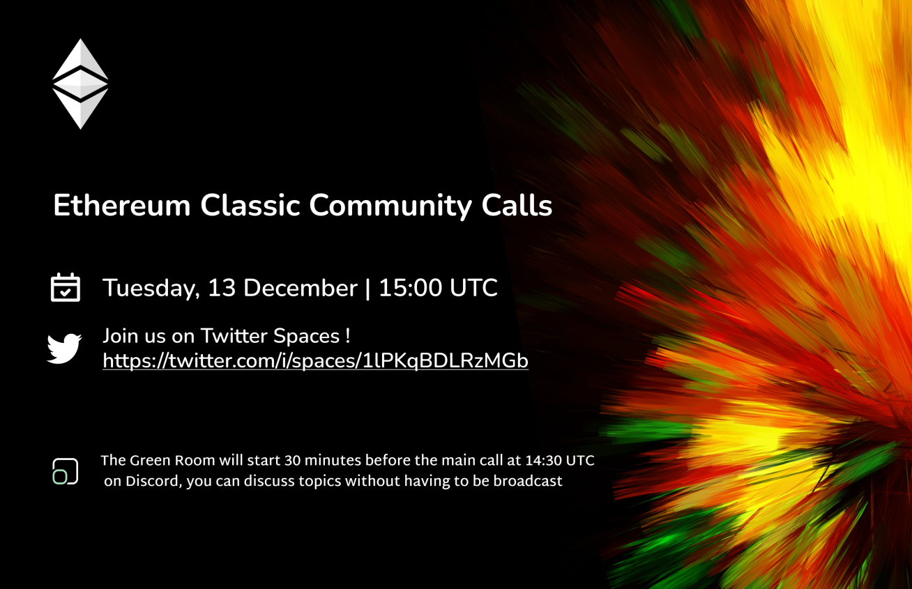

A casual voice chat to discuss ideas for ETC. All are welcome.

**Join the Green Room 30 mins before we go live to chat offline, from now on in the ethereumclassic.org/discord #community-calls channel**

This voice chat is an open discussion and anyone is free to join and chat. Please request access to speak in app, and make sure you're using a mobile version of the Twitter app as it doesn't allow speakers on the web version.

We are also live streamining the Space to YouTube, so if you are on the mic please follow Twitter and YouTube's rules.

You can also post questions and comments on Discord in #community-call-notes, on Twitter, or on YouTube we'll try respond to your messages.

You can find the agenda in a reply to this space, which contains links to everything we talk about.

## Agenda

News / Ecosystem Updates, Guest COmpsoeDAO, Nakamoto Consensus, MEV + PoW, Migrating to ETC, Memes, Merit Brige idea 

## Gratitude

Brolal, d_a

### News / Ecosystem

- Updates on GraphSense from Maio, may take a few months to sync
- EthereumClassic.org in japanese 
- Discord Upgrades

- The Permissionless Paradox in Ethereum Classic https://ethereumclassic.org/blog/2022-12-08-the-permissionless-paradox-in-ethereum-classic
- Ethereum Virtual Machine Blockchains and Ethereum Classic https://ethereumclassic.org/blog/2022-12-06-ethereum-virtual-machine-blockchains-and-ethereum-classic
- The Three Pillars of Ethereum Classic https://ethereumclassic.org/blog/2022-12-07-the-three-pillars-of-ethereum-classic
- Ethereum Classic (ETC) Proud of Clinging on to Fundamental Nakamoto Consensus https://thecurrencyanalytics.com/altcoins/ethereum-classic-etc-proud-of-clinging-on-to-fundamental-nakamoto-consensus-41934.php

### Cross Spaces Promo

- ETC Radio https://twitter.com/etcbayc/status/1600542969551110151
- ETC DeFi Space https://twitter.com/SoteriaSC/status/1601017015933673473 

### Show and Tell

- Anything missed above, new apps, nfts, projects, comments from participants?

## Topics

### Guest ComposeDAO

#### Nakamoto Consensus vs PoW

#### MEV

#### Uniform Distribution Mining

#### Migrating to ETC

- HENS
- Hardhat

#### Memes

- Memetics
- ComposeDAO runing a course?

### Merit Badge

**Ronin**

"Merit Badge" system to encourage participation or reward it. A good use of the NFT communities development in 2022 to a public good project that encourages engagements and allows people to build a collection of collectables to show they're helping with ETC.

- Airdrop Contribution ERC-20 tokens to specific contributors
- Tokens can be redeemed for Merit Badge style NFTs

inspiration: Chia Network's 2021 "CH21" Token Airdrop for first year miners. 2022 Chia NFT Redemption.

2021 CAT Token Airdrop: https://www.chia.net/2021/12/21/happy-holidays-from-chia/

2022 NFT Claim using the 2021 CH21 Token: https://www.chia.net/2022/12/08/the-holiday-nfts-are-here/

- Goal, increases on-chain transactions and usage.
- provides fun assets that show people are volunteering and when (some OG credit)
- gets users familar with tinckering and managing ERC-20's/NFTs on ETC
- teaches users how to manage their assets in an ETC address. Self-custody.

Would be fun to do these around:

- Mainnet Launch Anniversaries
- Hardfork DAO anniversaries
- Post-Merge Anniversaries
- Holidays

Could retro airdrop people(on-chain addresses) that were active in 2016, 2017, 2018, 2019, 2020, 2021, 2022. With Year based merits

Could add a historical element to this and have collections that honor the deep thinkers that brought us specific tech that ETC uses. Example is "Nick Szabo" and his Smart Contract article. So these airdropped tokens could be redeemed for something like that.

Airdrop/Redeemable to anyone that mined a block in previous years. "Security" badge or something. There are a lot of ways do to this and themes, but maybe start with a simple proof-of-concept. Make it a simple open-source site hosted in a community organized repo.

**TheCrowbill**

Excellent idea! I have been studying and updating the POAP contracts (https://github.com/TheCrowbill-testorg/poap-contracts) for deployment on ETC. This looks like a use case that would be ideal to build around. Thank you, @ronin.

I had planned to deploy updated contracts on Mordor last week, but some dependency issues cropped up which has delayed things. Anyone wanting to help out with this project is welcome. Any help at all would be much appreciated. In addition to requiring some new coding for the contracts, there will be need for graphics, style and design elements, project coordinators and maintainers, and probably much more.

If the updated contracts work and are something the community can use and wants, I will happily transfer ownership of the repo to the ETC community.

## Free Talk

## Sign Off

#ETCtweets reminder

See you next week, same time same place.

## Topic Backlog

- Web Updates, Automations, Auto-adding content, https://nvu.io/en/bots/discord-translator, Auto add Youtube, weekly top tweets
- Nomenclature: Profitability, Profits, Block Rewards, etc.
- Tweet Bank
- Rico

---

## Full Transcript

```webvtt
WEBVTT

NOTE no-names

1
00:00:33.360 --> 00:00:54.830
is Tuesday the 13th of December calls is a casual voice chat to discuss ideas about ethereum classic all are welcome you can join us in the Green Room on the ethereum classic Discord server at ethereumclassic.org Discord in the community calls channel 30 min one hour before

2
00:00:52.379 --> 00:01:12.410
the call from now on to chat offline we are now streaming on YouTube and obviously on Twitter spaces so if you'd like to become a speaker please do so in the app version of Twitter and we can bump you to the top so you can speak this is an open discussion so feel free to

3
00:01:10.680 --> 00:01:30.830
join in at any time and uh just make sure you're following the Twitter and YouTube guidelines so let's also try and keep it uh civil and respectful to everyone on the call you can also post questions or comments in the Discord Community call nerds Channel or on Twitter we'll try and get your

4
00:01:29.700 --> 00:01:51.950
messages you can find the agenda to this call in a reply to this space and it contains all the links we talk about on the episode this week we will be talking about the usual ecosystem updates we have hopefully guest composed now to talk about Nakamoto consensus Mev and proof of

5
00:01:49.140 --> 00:02:11.270
work migrating to Etc from other evm chains means and also hopefully an idea brought by Ronin about Merit bridge and poaps to incentivize contributions to ethereum Classic first of all I'd like to say thank you to Bro lau and the underscore a for helping you out with the video and graphics

6
00:02:11.280 --> 00:02:32.210
so to start off we have uh just a bit of housekeeping some updates if you've been listening to previous calls about a project called graphsense which Mario was working on and currently he is syncing a full note which is taking a rather long time it might be a month or two months before that is ready so we just

7
00:02:30.480 --> 00:02:52.009
have to wait for that uh full archive note to sync athenopclassic.org has been launched in Japanese so if you speak Japanese you can now view all the content machine translated into Japanese and if you have uh the ability to upgrade some of those translations

8
00:02:49.019 --> 00:03:09.589
you can also contribute if you check out the ethereumclassic.org GitHub repository and there's a process there to help contribute translations potential Discord upgrades so if you are familiar

9
00:03:06.180 --> 00:03:27.890
with Discord I would like to to make some suggestions about improving the ethereum classic Discord server on Discord then please let us know in general and we can invite you to a working group to try in there organize things better over there and maybe

10
00:03:25.800 --> 00:03:48.229
add some Integrations maybe change the roles around and add some channels or reorganize that in some way be a speaker please do raise your hand and hopefully you will be joined by uh

11
00:03:41.940 --> 00:04:08.869
some contributors this week the chat that wants to uh say hello of

12
00:04:07.019 --> 00:04:29.090
other spaces in the ethereum classic uh Universe one is ETC radio by uh I believe cork 3000 who is doing a show uh you can find the link in that description in the reply to this tweet again and there's also one by wiedergarten

13
00:04:26.160 --> 00:04:47.810
on Thursdays called etcd5 which you can join and we chat about D5 last week on Thursday at uh oh eight hundred sorry uh APM Eastern Standard Time I believe so uh that was quite an interesting discussion we

14
00:04:44.940 --> 00:05:08.030
talked about the state of Etc defy and where things should be going in the future and where things are now and stable coins and uh that's quite an interesting discussion if

15
00:05:02.400 --> 00:05:22.610
you're interested to

16
00:05:10.560 --> 00:05:32.629
become speakers here house I believe Donald that just invited you to become speaker I'm

17
00:05:29.220 --> 00:05:50.270
just about to get into the new posts that have been uh created by Donald this week on the etherealclassic.org website three new posts which are extremely uh interesting and hopefully we can chat about that hey Donald hi store how are you I'm

18
00:05:48.660 --> 00:06:09.710
doing very well thank you how are you very well sorry I was late did you mention something in particular no no you're just on time um we got the uh we're in the ecosystem updates and I just wanted to mention the three new posts that you made this week on

19
00:06:06.960 --> 00:06:27.370
the throne class built website so we have uh the permissionless Paradox ethereum virtual machine blockchains and ethereum classic and the three pillars of ethereum classic yeah um yeah did you want to summarize these real quick and we can uh jump into some questions

20
00:06:24.720 --> 00:06:45.409
yeah well I know I I did a summary of of the one that was posted today can I start with that one sure the the thing that we have in the community

21
00:06:43.380 --> 00:07:05.770
that the ethereum classic is bitcoin's philosophy and ethereum's Technology and um the summary of that of that post is that um the the original invention of Satoshi Nakamoto is

22
00:07:01.919 --> 00:07:22.490
not really the concept of sound money or digital gold that was that was bitco before and um it wasn't a peer-to-peer Network um where people can share information and

23
00:07:19.740 --> 00:07:40.969
have full replication of the data because that already existed before with Napster uh and um and those other things the most important or the key invention of Satoshi Nakamoto was to use proof of work to

24
00:07:38.940 --> 00:08:00.650
accomplish uh consensus on the same exact state of the of the data every 10 minutes or every x amount of time the

25
00:07:57.840 --> 00:08:19.730
information approved that of the has the proof of work produces every block is what keeps the network in exactly the same state without the need of any Central party directing everybody um and

26
00:08:14.660 --> 00:08:35.690
not only that but also provides um the ability of any participant anywhere in the world and even if they are outside of the world they can be in in the moon or in Mars or some other planet to

27
00:08:32.219 --> 00:08:59.590
join and leave the network and join again without asking for permission without any censorship possible um is is another of the features of proof of work because of the information it provides that this is the correct chain and

28
00:08:54.920 --> 00:09:17.449
then uh but Bitcoin is just um Ledger simple Ledger with accounts and balances and people can send new transactions to move the to move balances or coins from one account to the other that's that's a very simple setup and

29
00:09:13.560 --> 00:09:36.170
then and it is simple on purpose and the Bitcoin Community has kept it that simple on purpose and it will likely stay that simple uh because it also has some technical barriers to be more complex so

30
00:09:33.180 --> 00:09:53.810
Bitcoin is an extremely important invention and at the same time a very simple dmos application um but The Cypher punks what they wanted was to create smart contracts and the smart contracts are basically robots

31
00:09:50.899 --> 00:10:10.910
on the internet that would automatically being owned or controlled by any third party like a government or Corporation Etc that can all be captured and create the

32
00:10:09.240 --> 00:10:29.690
world that we live today not with surveillance and lack of privacy ah and censorship and permissionness and things like that no um and vitalik buterin then in 2013 he thought of a way of doing that which was changing

33
00:10:27.839 --> 00:10:49.850
a few things of Bitcoin for example adding State adding a rich virtual machine that would be copied or replicated in all the notes on in in the network inside the the client software and to put a price or a gas system or a unit

34
00:10:47.459 --> 00:11:08.350
system to each operation code of the evm so that people would have to pay whenever they want to execute these um smart contracts and to to have the code be entered using um um special

35
00:11:10.560 --> 00:11:31.910
solidity and when when people send these programs which are the smart contracts themselves they will be replicated everywhere um in the network in every single machine making them decentralized programs so all that were the incredible Innovations by by vitalik and he added and he accomplished the goal of cyberpunks

36
00:11:30.320 --> 00:11:50.930
which was to add programmability so that is ethereum and um that's what what created this much richer and complex more complex but richer and versatile blockchain where not only you have

37
00:11:48.839 --> 00:12:10.550
accounts and balances and digital gold but also uh you have the ability of programming it and the ethereum classic is the best of both worlds ethereum classic is preserves the proof of work consensus mechanism which is the invention of Satoshi

38
00:12:07.920 --> 00:12:28.850
Nakamoto and the major invention of the whole industry and adds the functionality of ethereum classic so many people in the industry say that Bitcoin is like a pocket calculator uh

39
00:12:26.000 --> 00:12:48.650
and ethereum or ethereum classic because it's proof of work is a computer so it's much much more useful than a pocket uh calculator uh so so that's the essence of the of that um philosophy or that saying and

40
00:12:45.240 --> 00:13:05.329
what I add is that it is very important to note that all the other smart contract blockchains major Smart Control blockchains are proof of stake even ethereum has moved to proof of stake and that is a centralized system is already

41
00:13:02.760 --> 00:13:23.629
proven because the theorem is 75 or 73 censored um and capturable but ethereum classic is unique because it's the only smart contract blockchain that is proof of work has a fixed monetary policy and has smart

42
00:13:20.760 --> 00:13:43.430
contracts and this makes it have the best of Bitcoin and the best of of ethereum and the importance of this is that you can write uh applications software programs taps that

43
00:13:39.480 --> 00:13:59.930
can be hosted inside the highly secure hosted and executed inside the highly secure environment of the proof of work system blockchain of ethereum classic it's like it's like imagine having the

44
00:13:57.480 --> 00:14:19.370
security of Bitcoin and inside Bitcoin having the programs decentralized and executable so the adapts would be inside that highly secure um environment one of that is not possible in Bitcoin but it's possible in ethereum classic um and that is extremely important because

45
00:14:16.860 --> 00:14:37.490
what you use is it to have the applications hosted in um AWS or cloud services or in the corporate servers of JPMorgan or in in in in some data center that belongs to a government

46
00:14:37.500 --> 00:14:58.210
or or a telecommunications company um what use is it to do that to program the money as in Bitcoin or Litecoin when the dats themselves can be captured in ethereum classic that is solved the the dab

47
00:14:54.720 --> 00:15:17.509
is inside the highly secure decentralized Unstoppable censorship resistance and impossible to capture environment of the proof of work uh blockchain so that's the summary of the one that was

48
00:15:12.779 --> 00:15:33.769
published today this morning couple of points there another way that I've heard um the difference between Bitcoin and ethereum described at least before proof of work uh sorry proof of stake was implemented on ethereum mainnet is that bitcoin's

49
00:15:31.920 --> 00:15:52.490
a bit like a spreadsheet and ethereum's like a spreadsheet with macros that are programmable so it's uh like a calculator versus a computer um but uh another way of describing that and uh yeah totally agree with you about the importance of permissionlessness and I think

50
00:15:50.579 --> 00:16:11.449
this is something that I mean obviously the leaders of ethereum uh ethereum Foundation didn't really pick up on themselves is that uh yeah permissionlessness is kind of the whole point of blockchains and if you don't if you don't have that then

51
00:16:07.500 --> 00:16:28.129
you may as well use as you say AWS yeah brother did you want to jump in here so um I I just want to say related to this

52
00:16:24.420 --> 00:16:45.889
is that um I think Donald was right when you know he was saying in the past that uh the evm it's the smart contract for a standard can you please uh close your mind

53
00:16:42.660 --> 00:17:06.049
for a bit sorry about that I think Donald was right about the evm standard because uh recently I've heard that another blockchain um file coin is also Implement implementing

54
00:17:00.860 --> 00:17:28.189
uh evm with the solidity so basically they are they're moving in the same path just and this only shows uh how how strong the standard is ethereum

55
00:17:24.439 --> 00:17:46.970
the blockchain is one thing and ethereum or the ethereum virtual machines uh technology or model is another thing and it is a standard it's something I had been writing since um 2019 and

56
00:17:43.380 --> 00:18:04.850
today it's totally clear because even the the other blockchains that have tried to create a new standard with different op codes with different virtual machine with different with a distinct um uh programming language they

57
00:18:00.600 --> 00:18:22.490
all have to now do ad technology to to add the evm standard into their blockchains for example cardano has a sidechain now that is compatible with evm and Polo cadot has one of its side change that the name is um Power chain that

58
00:18:19.520 --> 00:18:41.390
is compatible because now they they acknowledge that everybody is all the developers all the users and all the ecosystems are all building and using ebm compatible things um so so yeah it's like an operating system it's like Windows or Mac you have to

59
00:18:39.000 --> 00:19:01.310
or Linux you have to write for one of those three but if you if you want to invent a new operating system it's going to be very difficult for anybody to to adopt it um then I when I uh estora the the other the three articles of last week was one about this where we just spoke DVM standard and

60
00:18:58.740 --> 00:19:20.270
then the other one were the other two were the three pillars of ethereum classic and the permissionless Paradox the the three pillars of ethereum classic do you want me to talk about those two articles uh sure yeah and I had some more questions about the uh permissionless Paradox

61
00:19:18.720 --> 00:19:38.810
but why don't you go ahead with the three pillars first okay the three pillars is because I love when I go to the home of ethereum classic and there is an image the ethereum classic.org and there's an image

62
00:19:35.400 --> 00:19:56.150
uh that has three pillars like Roman Gothic columns and then on top like a marble marble platform and on top of it the the three pillars support this marble platform and on top of it there is a symbol

63
00:19:52.380 --> 00:20:14.090
of a Justice scale um inside code no so this this the symbolism is that the the three pillars one is proof of work the three pillars of ethereum classic now the other one is the fixed monetary policy and

64
00:20:10.380 --> 00:20:32.270
the other one is that it's it's programmable now it supports um smart contracts and those three failures are what enable the truth that code is law because if you think about it when you have programmability like I explained earlier and then when you have a

65
00:20:29.700 --> 00:20:51.110
fixed monetary policy that turns your the money inside the blockchain into digital gold and all of that is secured by proof of work then when we say code is law meaning that when you send the transaction it's going to

66
00:20:48.539 --> 00:21:09.470
be mutable or when you when you when you build a Dap inside ethereum classic it's going to be unstoppable it is true it's not it's not that we are just a marketing gimmick or saying something that is a hope it's a it is a true uh

67
00:21:06.380 --> 00:21:27.049
it is a true saying that code is law because inside the blockchain once you have the DAP and you read the code that is exactly what is it is going to do so it's more or less like a physical law it's

68
00:21:23.640 --> 00:21:43.789
extremely difficult to tamper with it and to change it or or to modify it in a way that is not going to do that um that's the meaning now that code is law inside the blockchain more or less like a physical law not not uh

69
00:21:40.820 --> 00:22:02.510
legal systems like in the mid space in mid space we're going to still be having disputes and uh resolving everything with judges Etc even if it's inside the blockchain uh there might be there may be disputes between between humans of what belongs to

70
00:21:59.880 --> 00:22:23.149
who and how things should work and that is going to continue to be resolved legally in mid space now in in the social layer in the real world but inside the blockchain code is really long because of these three pillars because that are going to always work the same way forever so

71
00:22:19.200 --> 00:22:41.630
that was that was the yeah I think that the uh the word law has obviously a few different interpretations there and I think you're right that uh really it's about it's almost like the rules of the game and as long as those rules are maintained

72
00:22:37.919 --> 00:22:58.789
then you can have actual rule of law as opposed to what exists outside the blockchain which is uh of an era of rule of law where there are laws but they're obviously manipulated all the time and the whole promise of blockchain and ethereum classic is that you can have

73
00:22:56.580 --> 00:23:17.270
a version of law that is not governed by some kind of uh opaque process but by code itself and that's the whole point of it and that's what unlocks this whole amazing potential future that uh we're on the Press myself I think that what you're saying is very important

74
00:23:14.700 --> 00:23:36.110
actually when I when I give the course to corporations uh what is the blockchain and what is bitcoin and what is ah what is um ethereum um and we go to talk about property on the

75
00:23:32.520 --> 00:23:53.810
blockchain property Registries and um and how many things in the future are going to be and contracts inside the blockchain and uh and other things inside the blockchain I do this distinction that you mentioned which is the law outside between

76
00:23:51.000 --> 00:24:12.649
humans is one thing the law inside the blockchain is another it means it means this dry an objective set of rules inside the blockchain but because both are going to have to be coordinated and combined in the future meaning

77
00:24:09.799 --> 00:24:31.549
for example that for example a vehicle registry that is typically in a county in a state or or at the state level which is basically a computer somewhere in a government office that has the names of peoples and which cars belong to

78
00:24:29.760 --> 00:24:50.750
them which vehicles belong to them because they have a serial number of the motor and the tag tag and the title number and all that that is going to be transferred to the blockchain and when that that is transferred to the blockchain it's going to reduce the amount of error on fraud in

79
00:24:48.419 --> 00:25:09.710
those kinds of property registries that the law is going to be significantly simplified it doesn't mean that the law is going to be eliminated but it's very likely that the number of disputes and and the time that it takes to clarify who owns what in

80
00:25:08.039 --> 00:25:29.870
meat space that is something that happens every day and the same thing with contracts you know for example Elon Musk tried to buy Twitter and then he wanted to back out and then they had to go to months through months of a trial in in Delaware and then in the end a judge had to interpret

81
00:25:27.840 --> 00:25:48.649
the contract and he said okay Elon you have to buy Twitter but all this process is going to be much faster when that same contract is on the blockchain because it's going to be objective and executable and undeniable and clear uh

82
00:25:45.740 --> 00:26:07.610
so so it's going it's going to be a very interesting Dynamic to see how the mid space in the social layer law adapts to the law inside of the blockchain yeah absolutely it's um there's a combination there of like uh reducing

83
00:26:04.760 --> 00:26:25.610
corruption by making it so that every transaction that happens is regulated right it's not it's not regulating after the fact and punishing people after the fact it's making sure that only transactions that are valid can get through and that totally changes the dynamic of how legal systems can and should

84
00:26:23.820 --> 00:26:43.850
operate in the future because then you're guaranteed that every transaction that actually happens is a good well it's it follows what the system that is set up expects to happen and therefore you have actual rule of law as opposed to what we have now and

85
00:26:42.360 --> 00:27:03.110
I think that's really going to make the whole book better and I don't I don't see this as being like uh against any existing legal system in fact I see it as an upgrade to the existing legal systems it's not antagonistic it's it's really it's really like a win-win I believe I

86
00:27:00.419 --> 00:27:22.190
totally agree I totally agree the more I have analyzed this and the more I spoke with others about this uh the more I believe what you just said I mean the the blockchain is going to be a very important source of information evidence and what things really were when there are

87
00:27:20.220 --> 00:27:42.289
disputes because you can go to the blockchain and check uh what the code said um I would uh I would add um that FTX right now is a prime example of that of how blockchain is actually extremely useful for meet space law uh because

88
00:27:39.299 --> 00:28:01.730
all most of alameda's transactions and such they'll all be on the blockchain very easy to reconcile uh the big black hole is obviously um their centralized bookkeeping uh you know which is what how Enron folded right

89
00:27:58.679 --> 00:28:18.710
is by cooking their books um and so that's going to be the big question mark in there but they connected to the Swift payment system and then they Connect into the blockchain payment system so it's really easy to track the inflows and outflows and then you don't know what happened in the

90
00:28:16.260 --> 00:28:39.590
corrupt organization and all of the fraud exactly but you can really paint a pretty clear picture by the inflows and outflows um and so I think that that's how blockchain will be helping uh solve one of that you know it'll go down as one of the larger fraud cases uh in the world yeah

91
00:28:36.059 --> 00:28:57.549
so just an example and that'll help and that helps uh multi-jurisdictions right so it's not just the US that's going to be looking at this this is going to be all around the world I totally agree I totally agree with that and that is a prediction that was in the blockchain industry um

92
00:28:55.260 --> 00:29:17.930
that uh the SEC regulators and law enforcement should actually support blockchain technology because of how transparent it is and easy to track and audit it is because of what you say yeah and I think I think for a privacy rights

93
00:29:13.799 --> 00:29:36.590
uh act activists uh it's you know it's frightening um but you know when you look at illicit transactions and such uh it's often cited you see it all the time uh due to the early uh uh fud marketing by the government back on Bitcoin in the early days

94
00:29:33.600 --> 00:29:54.769
was oh only drug transactions and illicit transactions happen on this um what we're seeing is that yes in fact that did happen uh with Silk Road and such but it's on a public Ledger and they're still today going back and busting people from Silk Road because now

95
00:29:53.039 --> 00:30:13.909
they're Bitcoin that they're holding this worth you know Millions if not billions of dollars sometimes um and you saw that with uh who's the crocodile uh of Wall Street lady whoever razakhan or whatever uh like those guys the people that stole from bitfinex you know they were never gonna get away with it

96
00:30:11.399 --> 00:30:32.810
six years later or whatever it is um now they're in jail and uh you know with cash you wouldn't be able to do that and so there's already a tool for privacy it's called Cash and it's phenomenal um Bitcoin or Bitcoin and blockchain have an entirely different value prop to the

97
00:30:31.200 --> 00:30:51.230
legal system to the financial markets uh and I think Donald you're on point with the pro programmable element of it um really uh enhances the money that um that we'll be able to use in the future yeah

98
00:30:51.240 --> 00:31:12.289
and the the example that you did with Silk Road important thing also the example of salesforth and many other cases and the other one of bitfinex that they eventually found the the crooks is that you never need to to to

99
00:31:09.179 --> 00:31:30.470
to reverse transactions inside the blockchain or have back doors or for changing confiscating money inside the blockchain and stuff like that like they do in the in the banking system and what they did what they did with the Dow four because if you go in Meet space and you do

100
00:31:28.620 --> 00:31:49.130
your investigation with the aid of the blockchain you can actually catch the crooks and there's many cases of it of recovered funds in in Bitcoin for example uh because a lot of people say oh because Bitcoin is immutable and then grow to use it and we're never going to recover our property no no when you

101
00:31:47.760 --> 00:32:08.330
go and you do the proper investigation and you go through the proper channels legally there's many cases that prove that you can actually recover the money uh and this goes back to the concept that istora said that the law it made space in Social layer between people

102
00:32:05.880 --> 00:32:27.350
is is not going to disappear it's going to be even better because Dow um exploit uh the guy that executed that I mean they found out it was his lightning network node right that had that

103
00:32:23.640 --> 00:32:44.149
doxed himself uh to the IP address that he used or or what was it a wallet that was tracked to him or something like that but anyways they you know it's like the digital uh breadcrumbs that you leave on the internet um it's almost impossible to uh get away with

104
00:32:42.059 --> 00:33:03.889
uh those type of financial crimes it just has to be worth it right it has to be worth enough money to do the investigation um that's that's what we really see is that uh people get away with all the crime right now is because it's just like they don't steal enough um and it's unfortunate um

105
00:33:01.980 --> 00:33:22.430
but hopefully that the space gets cleaned up over time uh but I think that I think we're gonna see a lot more cases where blockchain you know there's uh a ton of crime and stuff that gets solved on blockchain and that's actually um to benefit because in a cash system uh

106
00:33:19.860 --> 00:33:40.430
that stuff never gets caught it doesn't even you know there's no way to catch people like that right I think the the only people that have something to be afraid about with the blockchain revolution are the people that are benefiting from the corruption of the existing system because if we have

107
00:33:38.820 --> 00:33:59.690
a Level Playing Field that's based on Cody's law then the only people that lose out are those that can exploit the existing state of not having a Level Playing Field um brother do you want to jump in here and uh Donald could you just meet your mic while you're not talking because we're getting a bit of feedback on that thank you yeah

108
00:33:57.000 --> 00:34:17.829
yeah I just wanted to make a request to Donald to mute while he's not speaking for a better audio quality that's it okay yeah we got it thank you uh I would say um there is gonna be and this is like why I thought uh tornado cash

109
00:34:15.240 --> 00:34:35.930
was such a great uh protocol was there is a need to have private transactions and a legitimate reason for that is let's say a company a and Company B are working on a merger and there's some sort of payment that's due

110
00:34:33.540 --> 00:34:53.570
or something like that um you have a doxed wallet address uh on chain and Company a sends money to Company B all of a sudden Bots or insider trading knowledge uh is acquired very quickly right um

111
00:34:50.339 --> 00:35:11.210
and people can front run that deal on stock prices uh and make make trades and execute via that so um that's one area where I do see blockchain kind of falling short of uh there needs to be private transactions um

112
00:35:08.160 --> 00:35:30.109
we are seeing the start of really that privacy wave start to really go in with tornado cash uh there's some other ones um that have some traction uh but it's just not there yet and uh and for big businesses that that have meaning of you know

113
00:35:26.640 --> 00:35:46.970
public stock uh I really see um those type of deals uh need to be in private and then they do that announcement right for a fair uh a fair um stock market totally I think that privacy uh is something that everyone should

114
00:35:44.579 --> 00:36:05.210
be able to use if they want to and also if they don't want to use it then they should be able to enter contract that are public it's uh definitely not only for criminals I believe as you've mentioned there's obviously business use cases and even for individuals like I think people should be allowed to uh decide what is public

115
00:36:05.220 --> 00:36:27.290
um what is not in terms of their financial transactions and that isn't to you know uh to say that you can you can still have privacy and code is law at the same time they're completely compatible and it's just a case of making sure the rules of the game are in place beforehand so that everyone

116
00:36:24.720 --> 00:36:44.829
knows uh what those rules are and can voluntarily engage with those rules as opposed to being forced to use a specific set of rules they get to choose which rules that they want to use so what could be better than giving people

117
00:36:38.400 --> 00:36:59.150
the choice about the permissionless Paradox uh article that you posted yeah let's do it okay

118
00:36:55.619 --> 00:37:21.349
so uh from what I read I guess the the general concept is in order to protect permissionlessness you need to have some level of permissioned uh social layer is that generally correct it

119
00:37:19.140 --> 00:37:40.010
I guess this is uh analogous to the whole um the inclusivity Paradox right whereby in order to prevent in order to be inclusive you kind of have to prevent certain Bad actors from being part of the conversation right yeah yeah

120
00:37:36.480 --> 00:37:58.130
the the first time I I heard this Paradox was um in an article that he wrote he wrote something that in a in an open Society would

121
00:37:55.079 --> 00:38:18.170
you tolerate people who are closed something like that was the the thing and and then apparently he got it from a philosopher Carl popper that he wrote something like that that this thing of openness and

122
00:38:14.520 --> 00:38:36.829
if if openness admits closeness no because if you have to be open you should admit any debate including debate of anti-openess so um evidently I I had the the idea from from

123
00:38:33.780 --> 00:38:56.450
the comment of nasin taleb he was talking about other things politics I think and I said this is this is what happens in in blockchains um the the systems themselves the blockchain the operating Network has to be extremely pure in

124
00:38:52.560 --> 00:39:13.430
its principle of um openness and permissionlessness and censorship resistance which is which are I guess features of openness and also um they have to be open source and things

125
00:39:11.339 --> 00:39:32.810
like that so that they are auditable and the code can be reviewed by others ah so so that's that that principle and that uh strong demos ideal of of censorship of permissionlessness specifically

126
00:39:28.520 --> 00:39:50.089
in in blockchains if you think that's permissionlessness is is absolute no and the security hole is that someone can come and say okay this is permissionless therefore I can do whatever I want without permission and

127
00:39:47.880 --> 00:40:10.010
therefore I want this change and this change destroys permissionlessness which is what happens with democracies and things like that no democracies normally permit the Communist Party to exist and and be part of Congress if if they're if their representatives

128
00:40:07.500 --> 00:40:29.089
are voted Etc it's more or less the same thing I personally think that in in democracies and republics communism should be banned um and and it's the same concept that I said here and you have the social layer that

129
00:40:27.240 --> 00:40:48.470
is where the security hole is because if for some reason a bad actor eventually convinces all the node operators and all the miners and all the Developers and the community who are us no the people who are constantly debating about ethereum classic

130
00:40:45.780 --> 00:41:09.170
and promoting it and volunteering our work etc donating money and things like that we're all convinced that we have to install for example change from proof of work to proof of stake we would be destroying the network and permissionless would permit that would let

131
00:41:05.160 --> 00:41:27.410
that happen so what I why what I uh what I say in that article is that it shouldn't be like that what what has to be permissionless is the operating Network and because the security holes are in the social layer the social layer has to memorize the principles understand them exactly

132
00:41:25.079 --> 00:41:45.589
how they are and the history of the blockchain and be extremely jealous and a zealot and aggressive when rejecting any bad idea or anything that would undermine permissionlessness and that includes censoring people not admitting

133
00:41:42.599 --> 00:42:03.310
people in the ecip process uh uh censoring people in the Discord server and uh and um being rejecting them when they come with bad ideas and stuff like that and all that seems

134
00:42:01.320 --> 00:42:21.890
and I would say it is anti-democratic no and anti-permissions uh but I think that that is how we have to divide things and the reason why I had the idea of writing this is because I had recently read on the Discord server some people saying hey you're censoring me about moderators you're censoring

135
00:42:20.700 --> 00:42:40.730
me this should be permissionless ethereum classic the the goal is to be permissionless why are you censoring me and that that's a complete they're confusing they're confusing the network and the social layer it's two different things the network has to be absolutely permissionless and the social layer has to

136
00:42:38.160 --> 00:42:58.309
be permissioned right yeah I think there are some good points there and things to unpack um definitely the there is a huge difference between the social layer and the protocol itself and in order to maintain protocol neutrality and permissionless

137
00:42:56.460 --> 00:43:19.970
you need to have some organization in the social layer in order to uh maintainer right uh just as a funny example I believe last week's call was a little bit uh interesting I I was forced at one point to mute everyone and then mute uh one contributor in particular and

138
00:43:15.359 --> 00:43:37.069
then uh they later explained that uh oh hey you muted me therefore ethereum classic is no longer immutable right so exactly that's exactly so that that's not exactly yeah we also see that in uh in uh the Discord

139
00:43:35.160 --> 00:43:55.730
is you see you know someone comes in and spams or whatever and it's very rare that someone gets booted by brolo or uh or another mod but when they do it's oh ethereum classicus and censorship resistance right right and you're like you're like that that is not at

140
00:43:53.160 --> 00:44:14.089
all what that that uh messaging is about right right right hey guys code two or three all right guys I hope you are well um just you are you guys talking about last week's situation with drama and stuff um I missed it sorry guys um but I listened to recording because I wanted

141
00:44:12.480 --> 00:44:32.630
to hear like what's going on in EDC um I just missed the session last week but if I can just add on to um add on to whatever the last week with the muting and stuff I will say this um listening or hearing it live it's different to listening

142
00:44:30.540 --> 00:44:53.210
to it back and what I can say is that I'll actually I don't know who the who the guy was I know he's from Australia or whatever but um okay for instance like let's let's say the ideas of valid arguments or even invalid arguments it doesn't really matter because

143
00:44:50.280 --> 00:45:11.690
the premises of it is who was what I'm not sure what his name was but who is this kid that he was referring to to get the the young one he's a year 16 year old developer that was behind most

144
00:45:07.740 --> 00:45:29.390
of those nft scam projects and he was essentially someone uh he was essentially someone that had tracked the nft projects and found out the wallet balances and uh and just realized that they did a pre-mind I think many of the older souls in here had

145
00:45:25.800 --> 00:45:45.890
alerted to that very long ago um and so I think that that was generally what that whole thing last week was about okay but but what I want to say on that on that matter um is that okay the guy is why

146
00:45:43.200 --> 00:45:50.390
in terms of what I heard and in terms of basic mathematics it sounds like he's 16.

147
00:45:47.760 --> 00:45:50.390
it sounds like it's 15 16.

148
00:45:50.400 --> 00:46:11.690
but I will say this art of listening to all of that drama I'm actually on the kids side and it's because just considering where he's at right now good day with what you can do in terms of development it is I'm turning

149
00:46:07.619 --> 00:46:28.609
30 on the 23rd of December if I could rewind 15 years I wish I had the ability that he had and if you can either use this will also be but it's actually a bit of an encouragement man you're gonna screw up along the way because

150
00:46:25.560 --> 00:46:46.790
we're still learning but the place at which he is learning and the age at which he has already possessing all of this knowledge it's incredible and in fact I would say that perhaps we should be learning from someone like that perhaps we should be learning from somebody that that's that dedicated regardless

151
00:46:44.339 --> 00:47:06.109
of his mistake so just just as a side note on the drama of last week I'm actually in the corner of a kid because I wish that maybe in the future when I have children that my kids would be just as into technology which is unfortunately going to be the way forward

152
00:47:02.400 --> 00:47:23.089
one day so if my kids are interested in emerging Technologies one day I would do nothing other than support them so just to put that argument to rest okay I think that that kid is doing what he can and I think he's doing it to the base of his abilities and I hope to God he does use it

153
00:47:21.420 --> 00:47:42.290
for good in the future one day and build our community that's what we want yeah I'd like to add to that and and uh and just um uh dirty rusky uh had dropped a note uh in the Discord a little while back back when uh he was kind of getting the

154
00:47:39.420 --> 00:47:59.930
original Flack of like hey you're producing these uh these nft projects that uh really don't have value and are gonna hurt a lot of people but like that is him learning development right uh and he's getting contracted to do that by other people but what rusky had said during

155
00:47:57.780 --> 00:48:18.950
that time was a beautiful thing about that is how young he is and that is essentially the younger generation taking ethereum classic which is a public good network not controlled by any of us right and he is building on it and what we'll see is he's kind of like the start of a younger generation and we'll

156
00:48:16.440 --> 00:48:37.970
see many more come in as we're we'll be older Souls we'll be dust you know we're gonna be uh immaterial to the greater thing we will fall off our voices will be uh very quieted as a bunch of people get excited about this network as it takes off and they'll all be

157
00:48:33.599 --> 00:48:37.970
16 17 18 20.

158
00:48:33.599 --> 00:48:54.290
absolutely and you know I think the verse in the recording I was actually thinking about my own students and I was thinking you know what this is actually that kid that that is criticizing that he's sweating at that he is judging basically oh

159
00:48:51.780 --> 00:49:12.230
okay if if he's founded on his own beliefs it may also be it let's be tolerant also but if if that is his ability that's exactly what I want my students to strive to be so I don't see any problem there perhaps maybe just guide it and that's it I don't see any criminality

160
00:49:09.480 --> 00:49:30.950
I don't see anything I see somebody that is simply dedicated to coding and that is fantastic and that's I think it's it comes down to again what we said three weeks ago is that we'll win Monday or not one day but soon we are growing older but our priorities start to change we start to develop families

161
00:49:28.319 --> 00:49:48.530
we started on bigger businesses etc etc etc and there's a very high chance that is that younger generation that will reap the fruits of what we are doing today and what we have been doing for this last year so big UPS to him and I support him whether he is falling down or whether he's

162
00:49:46.440 --> 00:50:09.050
getting up okay I haven't met the guy but I can clearly see by the work that he does and I actually joined this Discord because I just want to see because I myself I'm setting here trying to develop websites and things but I wish that I had that type of ability 15 years ago so big Upstream man I have to really take my eyes of him so I'm just gonna

163
00:50:06.359 --> 00:50:26.990
put that little cookie to this and then just on what um if I may just switch topics a little bit on my funnel said about this um there's been I don't know how it wasn't like following because I was trying to make notes also at the same time but I was what I was thinking about these you know um

164
00:50:23.880 --> 00:50:45.170
we've been facing so much and Clarity in the crypto industry lately um all stemming from all the events that happened this year and it calms down again to regulation so what I'm going to ask you is if we look

165
00:50:40.740 --> 00:51:02.450
at medium classic as it is now just from a basic we don't even need to understand uh the security is low but we will get to that but just from just from looking at ethereum Classic and the way the way it's

166
00:50:59.339 --> 00:51:20.030
designed if you were to put it into two baskets can we say either it's a security or can we say it's a commodity and in the next thing so that's question one the next thing is a couple of weeks ago we were speaking about uh the new marketing

167
00:51:17.160 --> 00:51:38.690
team that we have ready for ethereum classic I just wanted to know when would the first push of um advertising or marketing win that first push be I know we've I believe Donald mentioned it a couple couple of times or a couple of weeks ago that was employed

168
00:51:35.760 --> 00:51:56.930
a new team in that area I just wanted to know when the first big push will be to start hitting recognition and then also outside of the ideas the only the ideas that we have been discussing in terms of ethereum classic over the last few weeks I want to know is

169
00:51:54.420 --> 00:52:15.829
there any thing that is currently being done on ethereum classic that we are looking forward to in terms of development outside of ideas is there any practical work on the network being done that we can look forward to that we can say okay cool in the next few months this is what we've been working on and this

170
00:52:12.599 --> 00:52:34.549
is our next upgrade Etc so on that question is what can we see or is there any fundamental work being done on ethereum classic right now as we speak and if so what over the next six months look like in terms of the development we should be having development right now and then just um the last thing I just wanted

171
00:52:32.040 --> 00:52:53.829
to mention uh briefly was a couple of weeks ago or when I started I posted an idea here or a basic website we can just bring Community together or just have some analytics and I'll show that in the Discord I just wanted to let you guys know also that um on the Black Friday special I bought the

172
00:52:50.579 --> 00:53:12.770
domain it's called Etc 0x dot live I've put it in the Discord but I just simplify the website a little bit and it's now hosted on that domain if you do find it useful so um yeah that's that's me I just wanted to give you take on on some of that especially just

173
00:53:09.960 --> 00:53:31.970
to three phase that's the marketing team push when and how can we expect the first big Leap Forward um and then the second one or the first one was obviously what can we deem it as we just can we see it as a security or commodity right now and then thirdly um

174
00:53:28.980 --> 00:53:50.390
what what work is currently being done example and by work I'm talking about if the phone call was to go off now what are we doing afterwards on ethereum that we have already been doing it if I can interpret it so okay can I uh

175
00:53:47.099 --> 00:54:07.190
just just to uh keep the discussion uh in a bit of uh organization I I have made a note of those uh three topics and I do want to address them so thanks for bringing them but I just wanted to wrap up on the uh permissionless Paradox thing we were talking about uh and then we

176
00:54:04.740 --> 00:54:25.190
can move on after that that's right um so I just wanted to make a comment on what Donald was talking about earlier about uh censorship within the community and I think uh yeah obviously in any Community there's going to be censorship there's always going to be certain things that are

177
00:54:23.700 --> 00:54:45.109
deemed either like the Boateng or not allowed or just you know we no one wants to be part of the community if it has certain things in it and I think you need to have certain levels of moderation and a different areas different safe spaces if you like different

178
00:54:43.020 --> 00:55:04.250
silos where people can join different communities that they feel comfortable in and that's perfectly fine we have two different discords with different levels of moderation and not everything goes in either of them so that's not against the principle of permissionlessness of the network itself and

179
00:55:01.500 --> 00:55:21.890
I think that in terms of uh preventing certain ecips from getting through that is also you know if if something like goes completely against the very nature of the project then obviously that is going to be the case and really it's not actually

180
00:55:19.500 --> 00:55:40.910
preventing anyone from doing anything we're not saying we don't believe other projects shouldn't exist we don't think that well at least I can only speak to myself but I think it's good that other blockchain projects exist even if they don't follow the exact same philosophies that they're on classic and anyone is free to Fork ethereum classic and do their own version

181
00:55:38.579 --> 00:55:59.450
of it in fact in that sense it's still permissionless on the social layer even it's just that the this version of the community has certain principles and will follow them and people can Splinter off and do what they want um we're not saying or at least I'm not saying we should prevent that it's just that uh the thing that I want to work on has

182
00:55:58.140 --> 00:56:19.190
certain shared values with other community members so it's not like Banning other Visions it's just I only want to work on this particular vision and other Visions are available so uh I think if um if if that permissionless in the macro sense is maintained

183
00:56:17.579 --> 00:56:39.770
then we can still have our own like smaller communities that have certain rules about them and that's completely compatible with each other yeah go ahead running yeah so just to uh add to that so it's not so esoteric um an

184
00:56:35.700 --> 00:56:56.210
example of those uh those social layers was um uh uh for uh the sha3 debate was uh people like myself believe that what was happening was the hardware used for

185
00:56:53.339 --> 00:57:13.609
that shot three change would have centralized all of the supply chain of the equipment to one company epic blockchain and what I had seen was they did that on Sia coin and now see a coin uh is stuck with epic blockchain as their

186
00:57:10.140 --> 00:57:32.750
chip manufacturer and epic blockchain has abandoned see a coin so that's was the Prime risk that I really saw of like shoot all of our inflation all of our admission will be captured by epic blockchain supply chain if we did that change now really what kind of pushed

187
00:57:29.940 --> 00:57:51.890
that to get withdrawn was when I you know we had a call I think it was uh core devs 22 and it just was listen you guys are welcome to fork and go on to that centralized supply chain this chain is going to continue over here that is permissionless and you can make that change but you're making a change that violates

188
00:57:49.260 --> 00:58:12.230
the principles of ethereum classic of being open open and decentralize and permissionless that change would have made it so epic blockchain was a king maker in uh our mining ecosystem and uh and so that was that's just uh to bring it from esoteric to

189
00:58:08.160 --> 00:58:29.750
a real uh social issue that we had to face just last year or just this year it was still this year um and and that was about a two-year thing uh so that's one example another one was so press didn't agree with he was a client maintainer for multi-gath um

190
00:58:27.240 --> 00:58:48.890
and he didn't agree with a protocol upgrade so what he decided to do was to deprecate uh ethereum classic in one of its main clients and um during that what happened was Etc Labs

191
00:58:43.680 --> 00:59:04.849
uh at the time uh was active and they forked uh multi-gath into what is now today core gath um and so and that's our primary client on the network and so that forking was okay if you want if you don't agree with the

192
00:59:02.760 --> 00:59:24.230
consensus upgrade on the network then you can deprecate the main client that everyone uses uh he also worked and coordinated with uh gonosis I believe who got the contract but it was the parity open parody um and got them to deprecate as well and that's right before we saw the 351 percent

193
00:59:21.960 --> 00:59:29.750
attacks not many people tie those together but it has a lot to do um with why we experienced that in 2020.

194
00:59:29.760 --> 00:59:52.309
um and then that was his Grand exit out of our ecosystem and then um and and then we picked up and moved on we took damage from the 351 percent attacks in a row and uh and we figured out how to survive uh on corgath and so that was that's a prime example of the social

195
00:59:49.020 --> 01:00:10.190
resilience of this network of it was you know consensus says that this upgrade is okay it's compatible with the principles that this network stands for you as the client maintainer don't agree with it but it's not your say and you're welcome to leave and deprecate us and do whatever and this network will continue to

196
01:00:07.440 --> 01:00:27.530
go on that's a social attack and we survived that and ethereum classic will experience numerous social attacks just as Bitcoin does and it's just because ethereum classic is valuable and so people try to socially attack it uh

197
01:00:23.640 --> 01:00:45.109
due to that and um and you won't be able to predict it either that's that's the thing is you can start to see the early signs of it but uh but you just don't know if someone's gonna try to execute that and uh and we've seen that with uh the multi-gath one 10 98 the treasury was

198
01:00:42.720 --> 01:01:03.530
a social attack uh trying to uh get the 20 minor tax and then uh and uh 10 49 was uh a social attack to try to uh capture the missions so just examples uh to bring that in yeah it kind of highlights how the the fundamental

199
01:00:59.579 --> 01:01:19.670
nature of the ecosystem that we're all acting within is voluntary right it's it's all about we want to work on a specific version and no one can force us and that's the beauty of the system and whether it's it manifests in

200
01:01:16.740 --> 01:01:38.870
ostracism of certain Bad actors or just people you know ignoring or deciding not to engage with certain uh points of view that's perfectly acceptable and that is what maintains that permissionless uh overall so uh yeah I think that ties back in yeah and I'd like to just add and

201
01:01:35.700 --> 01:01:57.890
then uh to those actors um an element of permissionlessness is they're always welcome to come back and interact with the the Active network right like none of us can stop store press from adding support for ethereum classic in a client and then starting to uh

202
01:01:54.540 --> 01:02:15.829
promote that uh Bob summerwall was involved in those two other um ecips and look he's still active today right he lost those consensus debates but at the end of the day it's permissionless he's more than welcome to work on this network no one can prevent him from working on this network even though he was on the wrong side of that debate

203
01:02:15.839 --> 01:02:36.170
um and we all just move on right and so uh so that's another beautiful thing is that you can't essentially get canceled for having a bad idea or a bad opinion uh you know there may be uh some Bruce Egos and salty feelings for a little while but at the end of the day um you know if you're adding value to the

204
01:02:34.740 --> 01:02:55.430
network that's all anyone really cares about happened in the past uh people can move on and as like you said as long as it's providing value then like the network doesn't really care who who

205
01:02:53.640 --> 01:03:14.510
provides it doesn't matter I mean even I I would be even open to uh people like Charles hoskinson even I mean uh I can't who might be the worst potential person to work with ethereum classic I can't imagine but uh I would still as long as they're providing value that's all that matters who is uh Darcy whoever uh

206
01:03:11.280 --> 01:03:34.910
captured the uh the GitHub repo Darcy whatever that guy um you know yeah yeah you could you can never you can't keep them out you know know what I mean what I mean in my article is actually to to ban those people from the network once once they have

207
01:03:30.720 --> 01:03:51.650
proven repeatedly and then such such uh bad offenses they have to be banned permanently from from the social layer in my opinion they should never be able to propose an ecip or

208
01:03:47.760 --> 01:04:07.970
anything iohk or Charles hoskinson or the person who hijacked the GitHub they have to go be gone forever that's what I meant in my article but I went to before um uh talking more about this I wanted to clarify

209
01:04:04.980 --> 01:04:28.130
also something ah yes the the um the one up one base thought okay or beta base uh yeah way of looking at this is that nature because people think that the law of the Jungle or Freedom happens in democracy here here in America and in Europe

210
01:04:24.900 --> 01:04:45.849
people say oh be are starting to hate the concept of freedom and liberty um because they think that freedom and liberty is the law of the Jungle they associate uh freedom and liberty with the law of the Jungle and in the jungle uh anything is permitted and and that's horrible

211
01:04:43.079 --> 01:05:05.030
and and that's not not true freedom is an artificially created thing that doesn't exist in nature in nature you're not free in nature you are uh absolutely uh vulnerable to be killed to

212
01:05:00.780 --> 01:05:23.510
be eaten uh to be destroyed by any other animal or even of your own species there's no law there's no there's no rules there's no ethics it's just the The Brute Force the law of the jungle uh free freedom and liberty as we have invented

213
01:05:20.400 --> 01:05:40.849
it artificially humans is is a set of rules it's an environment with a set of rules where many things are prohibited and not permitted for example it's not permitted to use brute force to kill somebody else and it's not permitted to use brute force to take away

214
01:05:38.819 --> 01:06:00.130
or destroy the property of somebody else um so and it's not permitted to destroy the freedom of somebody else uh so freedom and liberty are artificial things created by sets of rules that have evolved over thousands of years

215
01:05:58.500 --> 01:06:19.549
and the same thing permissionlessness inside the blockchain this level of decentralization for missionlessness that we humans through such Satoshi Nakamoto for example and all the core developers of all the blockchains that are truly decentralized have created is something

216
01:06:17.280 --> 01:06:37.690
that is totally new in the existence of humanity history and maybe the universe which is to create an environment where truly not the the law of the Jungle and not the laws of brute force and not the laws of

217
01:06:34.260 --> 01:06:55.190
Elites and and Central governments but true Freedom exists decentralization and you can send transactions and and build adapt and use them uh with this level of of permissionlessness and if you

218
01:06:53.099 --> 01:07:14.990
think about it even that environment is highly regulated and full of rules impossible to break you cannot send any kind of transaction it has to be written in a certain way it has to be uh follow a certain standard and start a pro certain protocol when if you want to build adapt you have to build

219
01:07:12.839 --> 01:07:32.990
it in solidity and you have to use the rules of that uh programming language and when you send it it has to be correctly compiled in a certain specific way if not it's rejected so even inside the permissionless environment of the blockchain they're extremely strict rules

220
01:07:31.200 --> 01:07:52.849
that don't exist in nature naturally um and so freedom is an artificially created thing and it also exists in mid space now in political systems we have the Constitution

221
01:07:49.799 --> 01:08:11.809
and you cannot kill people you cannot violate property and things like that so that that is something that I wanted to also clarify that the basis of this of of creating a free space and for that space to exist there the other the the the social

222
01:08:09.180 --> 01:08:31.010
layer has to be less free uh is because um freedom is actually not whatever you want to do from with those points and I agree largely

223
01:08:31.020 --> 01:08:52.070
I would only add the caveat that there is no official anything in ETC and because of that there is no official Community Silo there's no top-down decision making that says okay this person's banned and can no longer contribute to the project even the ecip process itself is not really an official process

224
01:08:48.900 --> 01:09:10.490
it's just a consensus that has come to be the only known way to upgrade the protocol but there's no reason that in the future there could be a different version of the seip process or some kind of schism within the community that uh has competing versions of the

225
01:09:07.380 --> 01:09:28.490
rules that govern the communities so it could be that eventually in the future there's some you know multiple silos of communities and right now I'm very happy with the current Community we've got and I'm currently pretty happy with the the rules in place that prevent Bad actors from uh taking over those communities and

226
01:09:26.100 --> 01:09:46.910
that includes Banning certain people and meeting people on calls occasionally all I'm saying here is that the protocol itself from the point of view the protocol and the way it's upgraded there is no Blacklist of who can contribute and I think that's a good thing because it means that that process itself the process

227
01:09:45.120 --> 01:10:05.450
of blacklisting cannot be captured so I think it's just a it would be a bad situation if there was like one one group of people that get to the side okay no Charles hoskinson can no longer contribute because that means that

228
01:10:03.420 --> 01:10:23.990
that process itself could be captured and then used to say oh now Donald cannot contribute anymore and I think that's a bad situation yeah and and I would say um like iohk for if they decide to ever propose something new they'll have to get

229
01:10:20.940 --> 01:10:42.410
Social buy-in and there's uh you know it's a public track record of kind of what they've done it's in the repo so you know that social buy-in is where you know it's like people are obviously going to look at any other next proposals if they ever propose one uh with a side eye right of saying what are these

230
01:10:40.140 --> 01:11:00.530
people up to what's their you know what's their angle here um but to your other point of people saying band Donald iohk literally tried to ban Donald if you remember that and uh and so um so it's been interesting to see and uh I think there's enough core people

231
01:10:58.679 --> 01:11:19.250
that uh believe in the ethos of the network and understand the properties and everything and that comes back to the founding documents and a lot of the work on the community website is there to instill those original visions and uh and um

232
01:11:15.360 --> 01:11:37.430
pass down uh the that resilient property in the social layer to the next Generations and I think we see that with older people and now we're seeing younger people come in and they read those documents and they understand oh you know this is what this is about and so I think that that's very powerful and I

233
01:11:34.560 --> 01:11:55.310
think uh kudos to you on uh the work on the community website because I think that's really a big uh Beacon uh for the newer people joining into the network uh to align with the social resistance that has been working and that's going to be important when people

234
01:11:52.440 --> 01:12:13.189
like us all fall away and someone else has to be there as social resistance uh to uh a bad actor we

235
01:12:09.900 --> 01:12:31.610
move into the next topic suggested by uh code 203 ahead bro yeah I just wanted to add that um uh

236
01:12:27.739 --> 01:12:49.970
in the future maybe when uh when the network will grow you'll have a lot more uh persons involved a lot of more companies and social

237
01:12:45.600 --> 01:13:06.110
uh youth have in politics where different groups try to to accumulate the power in the social air

238
01:13:00.360 --> 01:13:23.270
by opening I don't know all sorts of stuff like uh making uh promotions trying to to get as many people as they can and then uh impose their views on the easy

239
01:13:20.040 --> 01:13:41.149
process so I think this is one of the main problems for the foreseenable future but Till There we have a long way uh for an example of kind of where ethereum

240
01:13:39.300 --> 01:14:01.669
classic will be in the next couple years um and we saw exactly that for a lot uh on bitcoin you saw the New York agreement um we saw bit pay we've seen a lot of like businesses uh try to put in that influence and uh and socially attack uh Bitcoin

241
01:13:58.620 --> 01:14:22.130
and I mean you even saw Roger beer and Bitcoin cash uh you saw Craig Wright and what's amazing is that they all failed you know in the long run the network uh essentially went the right way in my opinion and um and so I think that you'll see that here uh I think it's

242
01:14:18.360 --> 01:14:38.750
we are short on uh on human capital on that but uh I think the hope is that as this network gains traction due to its positioning that will have that resilience and I think you'll see uh I mean Twitter is an extremely powerful space for uh crypto and so I think you'll

243
01:14:36.300 --> 01:14:56.689
see it when an actor comes in and tries to do that uh that there will be social resistance on that uh at least Twitter um and then probably the discord's another uh social layer uh social uh channels but it's definitely that's definitely what we'll experience I'm with you 100 just

244
01:14:53.940 --> 01:15:17.870
by observing Bitcoin and how that all went down yeah we we also had the net the internet neutrality if you remember where a big content companies were pushing um

245
01:15:12.179 --> 01:15:34.790
via lobbyists trying to push uh laws to to filter basically uh what content should be available to the public so uh that was a very hard approach uh

246
01:15:30.719 --> 01:15:53.390
we had that in uh I think six years ago only or seven years ago so that was May that was a major disrupt to to the way we we see things and what do we think about the freedom on the internet so this may also

247
01:15:50.340 --> 01:16:12.310
come to to the blockchain as you said in the case of Bitcoin and we most definitely definitely will see this uh um being charged like exploited like a vector attack because

248
01:16:07.500 --> 01:16:28.370
the social layer is not really uh that strong as the protocols are and uh people people will just pay money to to attack different projects and uh strip

249
01:16:24.960 --> 01:16:48.530
them down and maybe capture it and do whatever they want so I think this is this is where we have to keep our eyes open for um or potential malicious I don't know organizations um

250
01:16:46.440 --> 01:17:07.490
and I think that uh with the experience of the last um treasury debate I think um we've we're pretty close to a similar situation that as um as Bitcoin was with the pcash part folk and I think that ethereum classic is in a unique

251
01:17:05.520 --> 01:17:27.050
position on that front because we have such clear kind of guiding set of principles that fended off that because it was very clear that a hard Fork whatever sorry a chain split would have occurred and the threat of a chain split is what keeps everyone on the same page and aligned and even though I said before yeah I'm open

252
01:17:25.020 --> 01:17:46.070
to whoever who wants to contribute it's not like I'm open to Charles Kingson coming in and doing his own ecip to implement uh whatever proof of stake that he wants that's I mean he can do that he's perfectly able to if he wants to but that doesn't mean anyone's going to follow it and if it

253
01:17:44.699 --> 01:18:07.430
splits the network I think that's perfectly fine and that's the way that um the strength of the protocol can be resilient to any kind of attack because the chain split will happen and the winning chain the one that follows the principles will continue regardless so I don't really see that as a long-term threat as

254
01:18:04.679 --> 01:18:27.130
long as we stick to the the principles that we all understand and agree on I agree I agree there because uh if we look at the past three years like it sees the the only blockchain

255
01:18:23.940 --> 01:18:44.630
that went to saw them fire right so I'm sure now it's like very resilient uh comparing to other blockchains who are now just to open their eyes to to the facts that we are seeing around with FTX

256
01:18:42.540 --> 01:19:04.189
and Regulators coming in so yeah I think we are we are in a good position and uh seems that we have the maturity now to to just stay calm and wait

257
01:18:59.280 --> 01:19:22.010
for for the future to unveil ethereum classic came from from hard fork and some may say that we can look towards Bitcoin for the future but maybe Bitcoin should have looked to the Past at ethereum because uh as far as I remember

258
01:19:18.540 --> 01:19:40.970
the the ethereum classic creation was before Bitcoin Bitcoin cash so um we can definitely say that we are or this this project has been uh trailblazing on the the uh maintaining the

259
01:19:37.280 --> 01:20:00.590
Integrity of the network front in spite of like massive social attacks and yeah uh even if ninety percent so-called of the network decides so-called to uh switch to a new protocol that doesn't align with the vision then they're perfectly free to do that and ethereum

260
01:19:57.120 --> 01:20:20.149
classic continues regardless I think the the one of the problems with determining these these rules and what to exclude and what not to include and to be exclusive or not is that the underlying subject is complex

261
01:20:17.040 --> 01:20:37.790
like a democracy or Nation or or a blockchain but if if the underlying subject was was as simple as saying this system is about being green and that's it just a simple Rune rule to be green anybody

262
01:20:34.080 --> 01:20:55.729
who comes and who is red and proposes red or blue or yellow or orange would be immediately rejected because it would be so easy to to distinguish so what I what I what I mean by the permissionless Paradox

263
01:20:52.560 --> 01:21:14.630
is that when people come proposing blue red orange or yellow they have to be rejected immediately but that's a fair point yeah I'd just like to add that um you know people often cite like oh there's no innovation on ethereum classic uh there is innovation

264
01:21:11.400 --> 01:21:32.270
on other EVMS on technology uh like a lot of programming dapps that those type of protocols on ethereum classic on the L1 The Innovation is that resistance that decentralization you don't see that in other EVMS and that is the

265
01:21:29.520 --> 01:21:51.169
big uh thing that I think in marketing that we need to uh Market is that it's slower it's not as sexy but that is the big innovation that's happening here and as you were saying uh we had the hard Fork before ethereum or sorry before um Bitcoin had the Bitcoin cash

266
01:21:49.260 --> 01:22:11.030
hard Fork right so we went through that first um and so that that is the social layer Innovation that's happening here uh that's that resilience uh and that's why ethereum classic is a little honey badger um you know that all is true and that's Innovation that's meaningful Innovation even

267
01:22:07.739 --> 01:22:31.430
though people may not recognize it as much and it may not be as sexy because you can't really like use it with Etc right with that with the actual asset uh but we really need to get that messaging out there because not many uh projects in the entire

268
01:22:25.320 --> 01:22:45.590
space are innovating in that way play to our strengths in the marketing and uh there's not many other chains that do what we do so yeah uh I think uh this kind of leads into the next uh one

269
01:22:43.860 --> 01:23:07.689
of the next topics about what the marketing team should be focusing on and uh yeah hopefully we can relay some of this to the uh the ETC Co-op marketing guys once they uh get their next um initiative on the ground um

270
01:23:03.179 --> 01:23:23.810
yes marketing is very important exciting week um talking about now is exactly why I'm asking the question as to where are we standing

271
01:23:21.300 --> 01:23:42.350
now in terms of what is equilibrium classic per se is it a security or is it a commodity because there seems to be sort of like the Hot Topic going around not really going around but it's worth asking especially because one there it is through the SPF today that's just

272
01:23:40.260 --> 01:24:01.490
something I found out today um but outside of all of that there's just a whole lot of clarity that needs to be done across the board it doesn't matter what group that we are talking about what's happening you're talking about a deep look at what you are investing into it needs to be done now as we already know

273
01:23:59.100 --> 01:24:28.970
what we are both on but we need to still start asking questions and I actually feel sorry for for the new guy but I don't really feel sorry for them but I'm more sympathetic with him uh if they were to come in the market now and have to figure all of this

274
01:24:14.219 --> 01:24:35.209
up with all of this in this indecision going

275
01:24:32.880 --> 01:24:53.390
on in the market and the lack of clarity in the market this is the reason I'm asking you what can we Define ethereum classic guys now is it a security or is it a commodity another Statistics in-depth discussion and Analysis but from a visual perspective

276
01:24:51.659 --> 01:25:13.790
okay I see it and this is just me speaking um I could be super wrong I could be right but just let me flow on this one okay when I look at Bitcoin pay instance there's no one person in charge there's no one person that makes the decision

277
01:25:09.840 --> 01:25:32.030
right this group consensus and so well no it's not frequency if you have to mine it right there's no change fundamentally there's no influence that can come along it's not privately held by one individual or by a group of people that can't basically control directional right and it's just been

278
01:25:29.760 --> 01:25:50.930
given to the world and and there's no interference it just goes on and this is why it's so resilient but this is the same fundamentals on which ethereum classic or ethereum at the time possible obviously split you become helium plastic become energy is original and then you have the makeshift or version of

279
01:25:48.840 --> 01:26:09.590
ethereum Now understand this part and this is why I'm asking this question and just looking back on and down in this year yes ethereum went over to proof

280
01:26:05.580 --> 01:26:26.270
of State okay fine no problem you you do you now the next question comes in how much ethereum has been staked when will they get it back and just by looking at it without really even

281
01:26:24.060 --> 01:26:44.330
understanding Security's law just by looking at it we already see a CEO we thought which is um okay it's basically in charge of ethereum but then doesn't that make it make it a uh a security if Bitcoin is a commodity and it can't be

282
01:26:42.840 --> 01:27:04.010
touched like gold right that means and and I'm just going on a limb and saying this but if there's one person one Central person that is in charge of a crypto now just compare quickly to bitcoin and ethereum classic there's no one real person in charge but now

283
01:27:01.800 --> 01:27:23.570
let's make it ethereum because you now have to work safe and clearly there is like a I'm I'm Gonna Be Kind when I say listen I'm just gonna stay with the Badoo case but I'm clearly it looks like there's someone in charge okay his name starts with a V I'm not gonna get into that okay

284
01:27:20.100 --> 01:27:40.250
but then doesn't that make this entire ethereum and yes there is a lot of projects that have been built on ethereum which is now proof of state but it doesn't that make it a security and if it is a security just by looking at

285
01:27:37.260 --> 01:27:58.010
it is it not an unregistered security which is illegal in the United States security is illegal in the United States so what I'm saying here is is this something that we have to keep in the back of our minds moving forward because

286
01:27:55.440 --> 01:28:16.010
if the ACC says okay well regardless of your scale regardless of your size by low it was not unregistered security that oh sorry for my language here but that sounds like a big show because if

287
01:28:13.080 --> 01:28:37.970
then the ACC says no but you are deemed illegal that's all it takes for the whole thing to be shut down so I'm so I'm sitting here actually I've been thinking about this over the last few days in which category to be as a helium Classic Bowl yeah

288
01:28:33.900 --> 01:28:56.209
uh there's definitely um a different category of and obviously I don't think anyone here is a an expert on U.S Securities Law or anything like that uh but definitely it would seem that ethereum moving to proof of stakes changes

289
01:28:51.739 --> 01:29:13.310
its legal nature to some extent yes I think I think that um for both pragmatic and actual like reality reasons I'm not sure it's in our best interest to

290
01:29:10.500 --> 01:29:32.810
suggest that other chains are securities unless they're very clearly Securities and I think that in general blockchain technology is should really be having its own legal definition that's not fitting into the traditional security versus commodity Paradigm really there needs to be a new legal uh description

291
01:29:30.360 --> 01:29:50.930
of these assets um in the future because I guess the the how we test is the traditional thing to use to pass a security and um I I saw a tweet recently about um Taylor

292
01:29:46.739 --> 01:30:07.189
Swift tickets being uh an example that doesn't pass the Howie test which is that people are buying these tickets and expecting return on them because they could resell them and in that sense it's a security so I think these laws are a little bit intentionally vague and can

293
01:30:03.060 --> 01:30:25.010
therefore be applied selectively uh as a means to prevent Innovation from happening and I'm not sure that's the best uh it's not in our interest in terms of innovators uh I think as I mentioned in the long run it's probably best to have a new category uh whether

294
01:30:22.139 --> 01:30:42.169
that yep sorry I'll just give you an example of one Liverpool Foundation company with a token but a token yes it's Innovative but we all know that the purpose of the token is not to be publicly listed in

295
01:30:39.300 --> 01:31:01.430
terms of high organized as a company get your value from it okay with Bitcoin there is no company with ethereum there is no we have ethereum classic there is no company so this is like the question that I'm asking there are some cryptos out there on exchanges that are you can you might as well say there's a company behind

296
01:30:59.219 --> 01:31:22.490
it when you have someone defending the price it's pretty clear that it's a big company behind behind the scene and this is just what I'm fearing moving into the ethereum because yes just by Aesthetics alone did someone in charge the same way a company is set up does that

297
01:31:19.080 --> 01:31:40.970
make sense so it's just like it's a bit of a slope so just I don't know but on ethereum classic from what I can see now and I I do trust is Never Gonna Change but it looks like just from my perspective that we are we

298
01:31:37.139 --> 01:31:59.030
are similar to bitcoin yes but but if we follow that same principle or we just stick to the design on that code is law where there's no Central person in charge then technically just by looking at it we would be deemed as a commodity because it's immovable it's unmanipulated it's like gold you can't you

299
01:31:56.820 --> 01:32:17.090
can't you can't how can I say manipulate gold can you that's just a naturally occurring thing and that makes the difference between a security versus a commodity and really my the legality just comes into okay yes is this really a topic in the crypto industry

300
01:32:14.639 --> 01:32:34.669
that is being overlooked or under in fact but these events that are coming up or everything that has kind of played out this year is leading up to this question look at all the events that I've led up lit up until now most of

301
01:32:31.679 --> 01:32:52.070
it comes down to regulation basically because if there was some sort of Regulation they would not be able to get away with the things that they are getting away with the the multiplying of tokens the increase of tokens man when you look at our system we can't just suddenly Supply cut

302
01:32:48.780 --> 01:33:08.810
you understand same at Bitcoin so it's a it's I know it's a lengthy topic but it is definitely something that maybe we should be looking at in some clarity on so we can at least say okay our project it is built on the correct principles not

303
01:33:05.460 --> 01:33:26.149
only in terms of how we want to move forward as a blockchain as a layer one but also all we compliant shoot the arise when we are going to be crying out regulation we have already had one situation now or two situations this

304
01:33:22.739 --> 01:33:42.830
year Luna and ESPN that really it says it has gone it's so much public attention that they will be eventually a push to some regulation but we just need to already be kind of on the right side of Institute that make sense or at least give

305
01:33:40.440 --> 01:34:02.990
some clarity to the people that would use our blockchain that if we if we were to go into a deep fundamental basis or we have to be challenged by the law does his baby would fall in and he wouldn't really experience any problem and should we get to that answer maybe we can actually put it on our website just

306
01:33:58.739 --> 01:34:19.790
to give our users some um Clarity and also to give them comfort as to what they want to hold on and what uh how that how the project should be um design should they build on ethereum classic I know I've been kind of vague because I'm

307
01:34:17.219 --> 01:34:39.229
struggling to vocalize like the big words in terms of legalities Etc um but I hope you guys just understand my point yeah I'll just say uh one thing and then I'll let Darius jump in here I think that um to use the I think it's a bit of a trap to try and use to use

308
01:34:36.780 --> 01:34:59.629
the legal terminology that exists before blockchain to try and Define these things that we're currently playing with because they really are nothing like what was before that and to try and sort of align a project with those inherently Incorrect

309
01:34:54.980 --> 01:35:15.290
and unaligned definitions I think is only gonna Wing clip the projects that try to do that because uh I mean really the definition of security is so vague that it could be applied to any blockchain project you could make an argument to say

310
01:35:12.840 --> 01:35:33.410
that bitcoin's a security because uh Satoshi mined a bunch of coins with the expectation of getting getting a profit from that you could say it's not a security because it has no leaders really I think to play that game is to lose it so I think we should just avoid doing that that's my personal opinion um

311
01:35:31.380 --> 01:35:52.310
and I will just say that I think legal games like that are probably best left to lawyers as opposed to blockchain developers who should be focusing on technology only and not trying to uh you know fall into any legal category that let's be honest could

312
01:35:50.280 --> 01:36:11.450
change at any time because they can just decide one day okay we don't care anymore uh this whole debate is Moot and it's it seems like a losing strategy so just just as a response because that's

313
01:36:08.820 --> 01:36:29.870
actually one of the main clashes that that I see uh ethereum classic but not but also every blockchain project uh you know coming running into in the future is if the United States government were to look into cryptocurrencies uh and start to try to crack down on you know trying to find out

314
01:36:27.540 --> 01:36:49.430
if it's a security or not um because right now if if any of the cryptocurrencies are classified as securities because of how uh Securities uh function um they're expected to be you know uh centralized um

315
01:36:45.780 --> 01:37:06.050
you know asset that people can own uh that is registered by a central person but cryptocurrencies don't work that way we are all decentralized blockchains and I do not believe there's a way to um to register uh an asset like this because

316
01:37:03.719 --> 01:37:26.209
you need someone or a single entity to represent it um and so I'm I just I don't know what the government will say when they look into and try to see if these are securities and what they what their opinion will be um uh it it's hard to tell if they're going to

317
01:37:23.340 --> 01:37:43.790
look into making a new category uh like just for for like an edge case where uh they'll gather information on their own uh and then make a decision from there uh or because it this could be an Avenue for the United States to crack down and literally call certain cryptocurrencies

318
01:37:41.159 --> 01:38:03.530
illegal uh and and not be allowed to be used uh because they don't fit in the existing legal framework and we just have to hope that uh that they look at it from a more broad perspective without trying to fit everything into a standard mold for what we've seen over the last hundred years even though things are extremely different

319
01:38:00.300 --> 01:38:20.450
nowadays you've explained the spot on this is my concern because yes we are getting we're all ending up at that same question and I'm just I'm kind of uh in the indecisive as to what the US would actually

320
01:38:18.239 --> 01:38:40.010
Define it as like um some some of our people are not in the U.S I myself am not in the US but they they definition of what securities are and should they go down is that because habitable effect on everybody else so it's just it's really a question that's maybe just worth thinking about it

321
01:38:37.800 --> 01:39:00.050
doesn't need to be honest with us it's definitely talk about just different opportunity but that is you you've actually nailed the question quite spot on thanks so just as a as a community what can we do to defend ourselves in a case like this should we hire lawyers what what can

322
01:38:56.820 --> 01:39:17.990
we do the only thing the only Edge case where I could see it be possible to get like literal representative legal advice for the blockchain where if there was some kind of uh you know built-in governance system or you know right on top government system that everybody agrees

323
01:39:14.400 --> 01:39:36.290
upon where you know uh lawyers are funded through that but that's that's really an edge case and it is difficult to get legal representation for a decentralized network because this has never happened before um so we the only thing we can do is hope that that the US government takes a role

324
01:39:34.080 --> 01:39:54.350
and and instead of you know just shutting shutting it all down they take the time to review but the the US government is very scared because well I I don't know if they're scared but one thing that they don't want is is that their current system is is um it

325
01:39:51.179 --> 01:40:12.350
gets overrun they want that the US dollar system that the banking system and that all the systems that they have in place are the systems that they continue to use because that's what they have control over and so if for one reason or another people used a system that isn't in their control they would not

326
01:40:09.840 --> 01:40:30.490
be in favor for that and any Avenue that they have to stop that from happening should be a concern to us because um we we may be impacted by that even though it's impossible for them to eradicate any cryptocurrency well that is

327
01:40:27.719 --> 01:40:48.169
difficult to say first proof of stake and certain chains that are much more centralized but chains like ethereum classic and Bitcoin nodes are run around the world and the United States can't really remove it from existence they can only stop people from using it within the

328
01:40:43.920 --> 01:41:05.149
United States but I don't know yeah I think this goes back to what we were talking about near the start of this call about how code is Law and the idea of blockchains in general and not antagonistic to the state really in fact the states that embrace

329
01:41:02.760 --> 01:41:23.870
them will be the ones that survive long run and I don't think that everyone in any government every person in that uh organization has the belief that the world will never change surely a lot of people in those organizations

330
01:41:21.480 --> 01:41:42.709
recognize that things do change and if you try to prevent things from changing then you'll just be left behind right I think the the way that blockchain ecosystem as a whole can deal with this problem is just by making it inevitable making the change inevitable and

331
01:41:40.139 --> 01:42:01.790
meaning whether they want to be on the train or not is up to them really and it's like okay some guy comes along and invents this thing called fire and you can throw water on it if you like but people already know how to make it now so you better

332
01:41:58.560 --> 01:42:19.430
figure out how to embrace it or you'll be left out in the cold basically and I think it's not really a matter of okay we need to hire lawyers to deal with it we just need to build and we just need to demonstrate that this technology is going to be the future and once that's the case then there's no lawyers needed because they will

333
01:42:18.000 --> 01:42:39.290
adopt it out of their own self-interest yeah that's very very think cryptocurrencies it's really easy to tell that the people who are there uh who

334
01:42:35.520 --> 01:42:56.149
may be regulating cryptocurrency uh in the future may or may not be very well educated about how it all works and definitely have seen a few who have a lot of power over Financial systems United States who have not taken the time to fully understand and have to be explained

335
01:42:53.219 --> 01:43:13.910
what it is and so as I said in my in the D5 call last week education is is where I think every blockchain is lacking uh education in every sense in the in the the way that the blockchain works what the blockchain can do how to prevent being scammed on blockchain that's

336
01:43:11.340 --> 01:43:31.430
very important because there's way too much fraud these days because people simply don't understand anything and they just go into whatever whatever somebody else tells them to do and they blindly trust them and everyone's losing their money which paints a hugely bad picture on a lot of of of projects even if

337
01:43:29.040 --> 01:43:51.950
projects are legit they will get backlash because other so many other projects aren't and so this it's really a learning curve but it all starts in the education and making it as easy as possible for the average person and also the United States government or every other government to fully understand exactly

338
01:43:47.960 --> 01:44:07.970
how a system works uh why it exists and you know what power people have over it um it's so yeah well we'll just have to see this in terms of of you know legal compliance there's nothing that we can do as a community

339
01:44:05.280 --> 01:44:26.330
that that we can have you know uh uh like a full-on representative because there's no single person that's uh in control here uh but the best the the most important thing is keeping everything as transparent as possible because that just goes to show how uh how it important it is to us that things are

340
01:44:24.600 --> 01:44:44.629
transparent um and you know I think and as you guys were talking earlier about how um you know the differences between ethereum and ethereum classic and how uh even if ethereum stayed on the principles uh you know it would have been the same kind of case but I disagree I think that um

341
01:44:42.600 --> 01:45:03.410
I think that because we have ethereum and we have ethereum classic it it you kind of have that contrast and as I tweeted earlier today truth always prevails um and so I think that as time goes on cracks within ethereum and the things that may have they may have been doing to

342
01:45:01.860 --> 01:45:23.870
hide some of the centralization aspects and the uh being unable to withdraw their tokens from proof of stake for example um things like that are going to start becoming more mainstream as people lose confidence and it will go to show uh how can continuing to follow fundamental values and things that um that

343
01:45:21.540 --> 01:45:42.290
are that are truth and truthfulness especially in a network where decentralization uh is the is what we're striving for uh if we begin to lie about certain things the people who trust the network to do things for them and the community of the network to do things for them well if if you lie one time you know

344
01:45:40.860 --> 01:46:02.870
you never know if people are going to continue to lie so it's very important that at least in this very specific scenario that we if we get asked things by uh people from outside the community or if the US government uh you know wants someone to go and speak on behalf of ethereum classic at one of the hearings that that person is in touch

345
01:46:00.540 --> 01:46:22.370
with the community and is also doing their absolute best to say as much true things and without twisting anything whatsoever like uh Sam Beckman freed for example one

346
01:46:20.280 --> 01:46:40.970
one there's there's this thing that when something happens and that uh is spelled as a threat to ethereum Classic then to go to these

347
01:46:37.880 --> 01:46:59.689
forums like this Twitter space and Discord and say what can we do to solve this the the first thing is is that there's no we because ethereum classic is decentralized and and if it's truly decentralized if that is true then there's

348
01:46:56.820 --> 01:47:18.709
no we that's why years ago I used to uh argue against using terms like the community and we and things like that as if we were some club or Foundation or corporation that we exist and we manage things and therefore we can be sued by the

349
01:47:16.500 --> 01:47:36.649
US government and we can be prohibited by the Chinese government and things like that that doesn't exist you just have to let the government scream to the air saying Etc is prohibited because it's a security it doesn't matter Etc is gonna still

350
01:47:32.940 --> 01:47:53.870
be there developers are gonna are gonna still be able to send and and build apps on it and people are gonna still have their money there and nobody can do anything about it there's nothing we we doesn't exist and there's nothing to do other than see how the government tries

351
01:47:50.880 --> 01:48:12.050
to prohibit Bitcoin as well and ethereum classic and see how they fail because it's already solved we we already did what we had to do which is to create a decentralized system there's nothing else to do think

352
01:48:09.960 --> 01:48:31.609
you put extremely well Donald I think uh yeah it's like the protocol exists and good luck having a protocol be subpoenaed or whatever it is I don't know what they do in the US but uh it's just a piece of technology and at this stage the cat's out of the bag so either

353
01:48:28.860 --> 01:48:49.550
use it or don't and there's not much else can be done it's been a longer than usual Community call uh so I think now might be a time to begin to wrap things up unless there's any further comments or questions

354
01:48:47.520 --> 01:49:10.310
from the guys on the call uh would you like to say anything otherwise we can uh close for this week you say uh it's nice to catch up with you guys again and uh thank you guys for answering my question and just with Donald uh Donald you

355
01:49:06.980 --> 01:49:34.010
are making way too long with a tick tock video you want to see it and you want to see it live before next week we always can't speak louder we

356
01:49:25.380 --> 01:49:46.129
are waiting for you to talk video ethereum classic hits a thousand dollars then you can do a dancing Tick Tock video

357
01:49:48.239 --> 01:50:13.930
bucks and we should have one of those um there's Tick Tock videos that flip over to all the users and it can be all of the devs or Just Dance because it is uh deserved by this okay I'm gonna hold you to that though but uh all right um okay any final comments and then we can

358
01:50:08.219 --> 01:50:29.570
uh we can say hello again next week everyone for contributing it's been a very uh interesting discussion this week and I really appreciate having the opportunity to talk philosophy and uh go into that the nitty-gritty of why we're here

359
01:50:27.540 --> 01:50:44.480
so thank you for everyone for contributing and we will see you next week same time same place on Twitter spaces at 1500 hours UTC for ethereum classic Community call number 36 until then Stay classy take care goodbye
```
