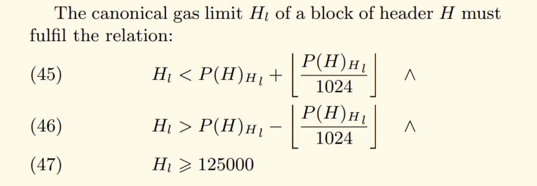

Let's talk about Block Gas Limits on Tuesday 19th March 2024 at 1200 UTC.

The voice chat is an open discussion and anyone is free to join and contribute.

Join the call in [ETC Discord](https://ethereumclassic.org/discord)'s #community-calls channel.

The call will be recorded and uploaded to YouTube.

This will be quite technical, so do feel free to jump in at any time to ask questions or request clarification.

---

This call was prompted due to discussion on Discord about what to do about the Block Gas Limit.

The Block Gas Limit is the maximum amount of gas that can be used in a block. As such, it also limits the largest transaction size per block. This includes contract deployments, but complex contract deployments can be split into multiple transactions. 

The debate was triggered by the recent (last year) 1m gas limit that was inexplicably(?) voted on by miners, which caused isuses for devs deploying contracts. This was corrected back to 8m after coordination with miners.

Miners are able to vote on a target block gas limit. Over time it adjusts. There's no upper limit, lower limit is 125,000.



Block Gas Limit is notorioulsy tricky to get right, a small limit means fewer/less complex transactions can be made, and too big means that chain bloat can be a problem (which centralizes things).

### The Debate

Four participants have put some views forward in Discord and may be joining the call, which have their own positions. Donald, Ronin, istora, Cody.

In their own words explain their position, if not I will attempt to explain. 

#### Doland's position

1. To fix gas limit between 8 MM and 15 MM.
1. That miners or no one should not have discretion to change it.
1. That following what ETH does may be risky because they don't care about "Code Is Law" but they do everything by "Social Consensus"
1. It is more important to fix the block size and make it very difficult to change again so that blocks remain small.
1. Developers should adpat to the gas limit, not the other way around. What ETH does is very irresponsible.

#### Ronin's position (from Discord)

Observed: 8M gas limit is a drastic restriction for the 2024 application development standards. Currently most development teams are operating around a 30M gas limit. Therefore the 8M gas limit is restricting the smart contracts that can be deployed to Ethereum Classic. Leaving it at a disadvantage to other EVM networks like ETH Foundation, which is the EVM ETC aims to maintain protocol parity with to remain state-of-the-art.

Protocol Parity logic states that we are trying to provide a similar development environment with ETH Foundation for dapp development. In the application environment, we have minimal differences. Notable are EIP-1559 that was excluded due to its impact on the fixed monetary supply (ECIP-1017). However, we have a voluntary difference of 8M gas limit (ETC) vs 30M gas limit (ETH). This restricts the size of smart contracts that can be deployed on the network. The current EVM application ecosystem is developing around a 30M gas limit. If the goal is for applications on ETH to easily migrate to ETC due to protocol parity. It's logical for the gas limit to be the same. Difference effects: contract size, reoccurring calls, & deployment scripts. more?

How to adjust: Current method is social consensus, then alerting the mining ecosystem. Change does not require a hard fork, is merely social. Likely needs to be documented/justified in the ECIP process. Once changed, should take ~2 days for gas limit to rise from 8M to 30M.

Rationale: this allows the application layer to grow and support more complex contracts like advanced lending/borrowing protocols. Allows 2024 state-of-the-art applications to be deployed to ETC. This should help to produce a lucrative fee market for miners to earn more than the chain emissions. Also this should allow ETC to easily gain intellectual/human capital in the bare application space. Enables chain agnostic EVM development with the largest application layer EVM community. A big upside. 

#### Istora's position

Both Donand and Ronin's positions have merit.

I appreciate having a low gas limit: used to support in theory a 1m gas limit, which I realize is not practical.

At the same time it would be beneficial if devlopers can publish their contracts with ease, and if there are valuable contract systems being used that use 15m + gas, this limits ETC's usefulness if devs have to workaround this limitation and re-write ETH contracts. It may also limit future L2 tech if proof publishing is limited.

However, increasing _every_ block's gas limit to allow for the occasional mega-complex transactions seems to be suboptimal, as it encourages bloat, and most blocks will be unintentionally full of small TXs.

Generally I reckon if it ain't broken then don't fix it, so right now I currently support the current state of affairs, but would be open to encouraging miners to vote on gas limit.

The gas voting mechanism is a pretty good solution (agree, not perfect) because it avoids hard forks to change the limit and thus reduces chain split potential. We don't know future hardware advancements or transaction types. Having a way for miners to adjust without forking provides value. Miners control the limit if it's fixed anyway (through hard forking). Donald, let's discuss, esp. Code is Law.

I also welcome disucssion on my Native Gas Token idea (could allow us to *lower* the limit), which I think satisfies both Ronin and Donald's concerns.

#### Cody's position

"i have a rough draft of my elastic gas limit idea"

### Clearning Things Up

Let's step through the logic of the debate and ensure we're all on the same page.

***Point A** PRO or AGAINST Setting a High Gas Limit*

Which can be achieved independently in a number of ways;

***Point B** PRO or AGAINST Changing the Gas Voting Mechanism*

Such as:

- Encourage Miners to change the limit (against changing the mechanism)

OR 

- Fix the gas limit in the protocol layer (removing the voting mechanism)
- Implement an "alternative option" (discussed below)

#### Point A: AGAINST Increase

See the Bitcoin "Blocksize" debate. Effectively the same, but with some nuance for ETC. Essentially, the greater the block gas limit, the greater the hardware requirements to participate, the fewer participants, the more centralized the network becomes.

Arguing to absurdity - suppose there was a 100,000m block size with full blocks. In this case, nobody would be able to sync on commercial hardware as the hardware requirements to do so would be huge.

#### Point A: PRO Increase

Bitcoin and ETC have different reqruirements in this regard.

Deploying and executing complex smart contracts. See Ronin's explanation above.

Another thing to consider that may reduce transaction fees, but if there are full blocks, the effect will be marginal and high fees are a feature of popular networks. *ED Istora: IMO, lower fees should not be an argument in this debate.*

#### Point B: AGAINST Mechanism Change

- Requires a Hard Fork
- Other than a Fixed limit, adds complexity

#### Point B: PRO Mechanism Change

- May be possible to find a solution with better tradeoffs than simple solutions
- Potentially upgrades functionality and value of network without requiring 

### Alternative Options

#### Increasing gas limit over time, like the emission curve

A fixed (linear) increase in the upper/lower block gas limit to try to cater to increased hardware availability in the future to increase scalability marginally.

- This could be fully fixed similar to Donald's proposal
- Or it could increase the upper/lower bounds that could be voted on by miners

Pros: Simple
Cons: Arbitrary, and assumes that hardware capabilities will increase (what if there's a Chip War that stalls development, or a dark age)

#### Dynamic Gas Limit (Cody)

TODO

#### Native Gas Token (Istora)

- A token that can be auctioned off
- No more than 10% of each block's gas (?). Fees go to miners.
- The auctioned is "used" but does not contain much data, so doesn't contribute to bloat, reduces the chain growth for that block.
- 1 token = 1 gas credit
- Once minted, this token disappears after N blocks (so it is not hoarded indefinitely).
- The token can be accumulated by developer and then burned in exchange for extra gas when they make a complex transaction (even more than 30M!).
- The result is that net chain growth is the same (or less), while still allowing developers to make complex transactions / deployments.
- Combine this with fixed block limit, makes Ronin and Donald both satisfied.
- Comes at the cost complexity and economic considerations; significant protocol change.
- Token logic implemented in smart contract layer.

### Things we can do

Simulate various scenarios for future gas limits and usage and hardware requirements (can probably find in ETH land)

Continue the disucssion

---

**Post chat notes**

ronin

I cited curvance.com as an example of a newer 2024 set of contracts that is struggling to get under 30M gas limit on ETH mainnet gas limits. I think large contracts like this are not the norm, but may become the norm in 2024 and onward.

I also cited LayerZero bridge as an example of an infrastructure integration that is concerned about 8M gas limit. This may not be due to their specific contract sizes, but their deployment scripts/reoccurring multicalls for data form 30M assumption to 8M gas of data. So think of the added engineering costs to rewrite a custom ETC deployment script/adjust 30M reoccurring transactions from 30M logic to 8M logic. This is a more common friction I am seeing, opposed to large contracts.

---

## Addendum

This post will bring readers up to speed on the current Gas Limit discussion happening in Ethereum Classic community.

On 2024-03-19 a call involving ETC contributors and core developers was recorded.

https://www.youtube.com/watch?v=8poOPwNCCeg

Notes for that call were also prepared.

https://github.com/ethereumclassic/community-calls/blob/main/20240319_038.md#ronins-position-from-discord

A [summary](#Transcription-Summary) of the call and [raw transcript](#raw-transcript) is available near the end of this document.

In short, the main debate could be summarized as: **Bloat vs Utility**.

Bloat - a major concern for maintaining long term decentralization. Large blocks will over time increase physical requirements for syncing thus reducing the number of nodes that can sync. See blocksize wars and call notes.

Utility - for developers, the ability to make higher gas transactions makes it easier to deploy to ETC. While not a major problem currently, a low gas limit could present friction for developer adoption. If left completely unaddressed, it may cause ETC to become unsuitable for some Smart Contract developments in future. While gas limits are in most cases workaroundable, this may require additional developer time to "port" things to ETC, which makes deployment less likely with budget constraints. This in itself creates friction to developers and avoid ETC as they'd need to spend time to check whether or not their contracts are compatible.

The "traditional" mechanism to resolve this conflict is allowing miners to raise or lower the block gas limit, which crudely trades off Bloat for Utility or vice-versa. Originally this system was designed to increase the limit for the purpose of allowing more transactions (lowering fees), but it has been proposed to use it to enable high gas transactions.

This mechanism was likely not designed as a solution for low bloat with occasional high value transactions. It was proposed that alternative options may exist that solve both Bloat and Utility concerns by allowing limited high gas transactions while maintaining low chain growth.

No recommendation for immediate action was made during the call, but it was agreed that the topic deserves further research and discussion.

### Next Considerations

Following the call, some additional questions arise that must be researched to tie up loose ends before consensus is reached. Participants are encouraged to consider the following questions as the discussion continues.

#### How necessary is allowing high gas transactions?

Existing real world high gas (30M) transactions are rare. As such, there is presently not much pressure to increase the limit and it is not a huge limiting factor as almost all contracts deployable on ETH are currently also deployable on ETC.

However, in the future, ETH's 30M limit is likely to encourage developers to target higher gas contracts, so we can expect this to be a limiting factor for deploying contracts to ETC in the future.

Furthermore, enabling high gas transactions may be an opportunity (a la Thanos) for ETC to provide a quantitative advantage to developers over Ethereum; allowing very high gas (30M+, eg 100M) transactions could be a Unique Selling Point for ETC.

Allowing very high gas transactions would allow for otherwise undeployable complex (or poorly optimized) contracts to be deployed, and allows large L2 blob proofs to be committed to the chain. This could make ETC the only option for some applications.

So, how pressing is it to actually take action to change the limit?

Should we take a "wait and see" approach, or be proactive?

#### What hardware do we want to target?

Should ETC target increasingly capable hardware as time goes on?

What are the minimal hardware specs we should target today and going forward, assuming worst case bloat scenario?

Assumptions about future hardware is difficult and we cannot guarantee that it will always be easier to sync, it may in fact get harder in the case of societal disruption.

#### What will be the long term effect of various gas limits?

We can deterministically model various different gas limits to determine long term best and worst case scenarios for the chain and hardware requirements in the future. This research would enable better decision making about bloat concerns.

#### Does having large transactions introduce other problems?

Bloat is the main issue we want to avoid to improve long term decentralization, but let's make sure we don't introduce other issues if we accept large transactions of 30m+

What are the constraints in terms of computation of large transactions? Can nodes still manage occasional 30m, 100m or even 999m blocks and still keep in sync on the hardware we want to target?

#### How to signal to miners?

If there's consensus to change the gas limit via miner vote, how should we formalize signalling to miners?

It's difficult for miners, who may not be tuned into the community, to judge whether social signals are real or astroturfed.

In the case of emergencies, such as raising from 1M to 8M, an ECIP might be too slow, but not *so* slow, and it helps miners understand. Perhaps we should use it in future.

Is ECIP a suitable process for signalling?

Does this give ECIP editors too much control?

Could we develop some other signalling process?

#### What happens to > Gas Limit txs in the mempool?

Chris mentioned on the call that perhaps TX v2 would allow larger than gas limit transactions do be mined.

*Istora: I do not believe this is the case as such blocks would be invalid. However, whether or not such transactions remain in the mempool might make integration of a solution easier. I guess they are just rejected, but client code could be updated to allow them and only mine them when they are able to (such as a `N%100` block).*

#### Does Danksharding change anything?

Given darksharding seems to be part of the Ethereum future, is there anything we need to consider before implementing a gas limit change, or perhaps advantages that can be taken if we do make a change.

https://www.galaxy.com/insights/research/protodanksharding-what-it-is-and-how-it-works/

### Potential Paths Forward

To help understand the idea space, some potential options are laid out below for participants to consider. *Istora provides a brief opinion on each option.*

#### Do Nothing

Simple. Easy. Default option.

If there's no need to change or fix the limit, then why go to the trouble?

However, we miss out on potential advantages and don't address concerns raised during this discussion.

In any case, we can probably do nothing (even for a few years if needed), and take our time to draw the best conclusion.

#### Socially signal to have miners increase the limit to ~15m

The seemingly most agreed upon 'quick fix', but is it really necessary?

Especially for ETC, the current voting mechanism does have draw backs as how miners are signaled creates a centralization issue.

If we maintain the voting mechanism, we should probably figure out a process for formalizing this signalling after reaching consensus, otherwise we risk creating new power structures and controversy about decision making.

How do they know who to listen to, does ETC coop get to decide, do astroturfed twitter bots?

#### Socially signal to have miners increase the limit to ~30m

Similar to above, but more dangerous, as flagged by core devs on the call.

Difficult to find consensus due to bloat concerns.

#### Fix the Block Gas Limit to something like ~15m

A good solution to reduce power of miners to change the gas limit.

Should address concerns raised by core devs on the call.

Requires a hard fork

#### Fix the Block Gas Limit Delta

Similar to above, but set a fixed and linearly increasing block gas limit over time to target improved future hardware.

Requires a hard fork

#### Wiggle Room

To prevent miners from reducing the limit too low (e.g. 1M), limits could be set for a minimum and maximum block size target for miners.

Has the advantage of being able to be implemented without a hard fork by having hard or soft limits within the clients without a protocol change.

Generally agreed upon as a reasonable middle ground, but doesn't really address the Utility problem or future large transactions.

Does not address the social signal issues raised above.

What should the window be - 4m to 40m ?

#### One Large Block every N Blocks

Voting mechanism removal not withstanding, a simple fix to enable large transactions would be to allow one block every N blocks to be 10x the base block size.

If the gas limit is 10M, then every 100 blocks, a 100M gas block could be allowed for larger transactions. Assuming that large transactions remain in the mempool, they'd just need to wait (and provide a large gas fee), to be included.

Simple, but seems kind of janky?

Does this mess with block explorers?

Requires a hard fork

#### Long Blocks

Proposed by phyro, we could increase the block time to 60 seconds per block and increase the gas limit per block accordingly, allowing for larger TXs to get through without changing bloat.

Would need to adjust block reward to keep monetary policy accordingly.

Would change a number of assumptions in the rest of the ecosystem wrt confirmation times.

Simple.

Main downside is user experience when interacting with ETC; transaction confrimations would take 2+ minutes instead of 30 seconds.

Requires a hard fork

#### Native Gas Token

Inspired by the notorious https://github.com/projectchicago/gastoken, which was the cause of much bloat on ETC, the protocol could implement a *native* gas token that does not waste gas but allows it to be 'mined' and credited for use in later blocks.

Bloat remains the same but the token could be minted by developers who wish to make large transactions.

- A token that can be auctioned off
- No more than 10% of each block's gas (?). Fees go to miners.
- The auctioned gas is "used" but does not contain much data, so doesn't contribute to bloat, reduces the chain growth for that block.
- 1 token = 1 gas credit
- Once minted, this token dissolves after N blocks (so it is not hoarded indefinitely).
- The token can be accumulated by developer and then burned in exchange for extra gas when they make a complex transaction (even more than 30M!).
- The result is that net chain growth is the same (or less), while still allowing developers to make complex transactions / deployments.
- Combine this with fixed block limit, makes Ronin and Donald both satisfied.
- Comes at the cost complexity and economic considerations; significant protocol change.
- Token logic implemented in smart contract layer.

Because of it's complexity and poor Developer Experience, I think we could do better if we wanted to achieve high gas transactions.

Requires a hard fork

#### Cody's "Elastic Block Gas" Proposal

Requires a hard fork

**AI Summary**

Cody proposes the implementation of an "elastic gas limit" for Ethereum Classic, aimed at optimizing block gas limits based on network utilization. This concept involves adjusting the block gas limit dynamically, guided by an exponential moving average (EMA) of past blockchain usage. The proposal suggests that if a block's gas usage deviates significantly from the EMA, the block reward should be reduced exponentially to encourage miners to adhere to the optimal gas limit. The idea is to create a self-regulating system where miners are incentivized to produce blocks with gas usage that aligns with the community-defined optimal utilization, ensuring stability and preventing node bloat due to arbitrarily large gas limits.

Isaac raises a concern regarding the potential contradiction in the system, particularly about offsetting low transaction fees with block rewards while also penalizing miners for producing empty or low-value blocks. He questions the objectivity of measuring block emptiness and the implications of relying on transaction availability as a metric, hinting at the complexity and potential challenges in enforcing such a system without unintended consequences.

Ronin likes the elastic block limit proposal, highlighting its potential to maintain a relevant and stable L1 fee market across different market conditions. He notes that the mechanism could prevent fee spikes during high congestion and adjust blockchain size in response to varying network activity, ensuring that miners remain incentivized. Ronin also appreciates the transparency and logic of the proposed system, drawing parallels to the dynamic difficulty adjustment for block times. He suggests that this approach could make the blockchain more efficient and responsive to actual usage, eliminating arbitrary gas limits and better accommodating special data needs, such as L2 rollups and complex contract deployments, thereby enhancing overall network scalability and stability.

**Full discussion on Discord**

https://discord.com/channels/223674353001168906/223675625334898688

**DontPanicBurns _—_ 19/03/2024 21:46**
My unfinished notes on elastic block gas: [https://gist.github.com/realcodywburns/01a2af8fb4dd8a5bc51089af2036c2a4](https://gist.github.com/realcodywburns/01a2af8fb4dd8a5bc51089af2036c2a4 "https://gist.github.com/realcodywburns/01a2af8fb4dd8a5bc51089af2036c2a4") Im still consolidating into a readable format, these are the punchlines

**isaac _—_ 19/03/2024 23:50**

is there a game contradiction between offsetting/subsidizing low tx fees with block rewards, and deterring empty blocks? we can only judge (potentially faked) block emptiness using tx availability, which isn't objective

`if a miner produces empty or low value blocks, they will forfit their block rewards ... The current block reward should be viewed as offsetting  the fee market`

**DontPanicBurns — 20/03/2024 00:25**
our block reward reduction was somewhat arbitrarily picked. is a nice round number, it doesn't relate to any onchain metrics.  I see it as offsetting the fee market because i think that miners operate on a slim margin and they compete based on how cheaply their cost of electricity is. If this is true, a reduction in block reward equates to a reduction in thier income and network security. In the future when there is no block reward, transaction fees will need to provide at least the same level of income as the current block reward to ensure the same level of security.
empty blocks and blocks that have significantly less transactions than average are a nuisance.  empty blocks are marginally easier to mine since they require no tx verification, so a miner can use a fake time stamp and start solving as soon as they have a valid block. These are both transient problems that go away as the network gains adoption. on average, all blocks should use an average amount of gas in a health network. I dont think we can guess a magic number and i do not think having completely full blocks are desirable if we want actual usage. miners should strive to add as many transactions as possible, if it isnt possible they would get a slight penalty.
so i think that the average block gas used should roughly equal the current block reward to ensure the equal level of security
i mean tbh its a limit so its more of a safety measure to prevent spam. currently blocks are not near the limit so it is only relevant because sometimes contracts want to deploy big contracts.  it isn't as if setting the limit at 100m would require blocks to use that much.  the hazard is in that the limit is randomly set by miners rather than tied to something

**ronin — 21/03/2024 00:06**
I really like the logic in this document Cody. I see so many benefits to the elastic block logic. L1 Fee market immediately becomes relevant and STAYS relevant. Also prevents the huge fee spikes we see on ETH when the network becomes too expensive to use due to congestion events and the fixed gas limit. In bear markets when the network is processing less, the fees will remain reasonable by the block size increasing. In bull cycles when usage is up, the fees will remain reasonable by the block size increasing. This helps accurately price the blockchain space through the life of the network, rather than the current arbitrary limits in place. It also codes in miner fee incentive logic, thus removing the for miners to coordinate to make the fee market relevant for them.

Coding this logic makes it very transparent on how the gas limit will adjust. And it is a very similar approach to the logic around a dynamic difficulty to maintain 14 sec block times and variable hashrate.

Common daily data: Elastic blockchain space for calldata to keep bloat under control and relevant to actual common daily usage. This would make the L1 fee market lucrative always for the miner ecosystem. Makes it so the fee market becomes effective once implemented and our security budget is not only the ETC coin emission. This also helps with the imminent L1 scaling issues as the elastic block space will grow with higher demand and prevent the huge long term fee spikes on L1 as witnessed on ETH due to their hard capped upper limit. Also removes the arbitrary subjectivity of the gas limit as highlighted on the call by Donald.

special data: special designations for scaling data like L2 blobs and functionality data like large complex contracts for L1 deployment. The L2 blobs in the Dencun upgrade being a model for how to handle specialty data that may be restricted by the elastic gas limit, but is very favorable to the L1 EVM because it adds utility/functionality/scalability.

So where in our difficulty logic, the constant is that we want a soft-peg to around 14 second block times. Here we want a gas limit that adjusted to a reasonable fee market price (demand). Does that make sense?

Then if we look at how Dencun is handling L2 data differently in these BLOBs, we now have an avenue to address the transactions that are less common day L1 transactions and more dynamic, like a rollup scaling transaction, a complex contract deployment, or a reoccurring infrastructure transactions like a public good price feed (just an example) that maintains stability in the Dapp enivronment and tethers on-chain logic to off-chain logic.

#### Elastic Gas Usage

Requires a hard fork

Perhaps we can come up with another optimal solution that combines Cody's dynamic block size with the ability to have large transactions. Further research into such a system would be required. Watch this space.

**Istora — 20/03/2024 20:36**
@DontPanicBurns your system seems to be targetting average block limit, but could we instead target overall gas usage?
might be misunderstanding your notes, but if we could enable otherwise empty blocks to allow for 5x block limit transactions, it's same same, right?
so the block limit is replaced by your EMA, but a rolling gas allowance instead of block limit
this is to address ronin and other dev concerns, enabling huge TXs and providing massive value as a complex tx and L2 blob repository, but still keeping bloat algorithmically controlled

**(reply) DontPanicBurns — 21/03/2024 07:16**
yes actual gas usage makes the most sense. it will make it costly to game the system


### Other Research Links

https://www.cryptoeq.io/articles/ethereum-gas-increase
https://www.coindesk.com/markets/2018/01/18/blockchain-bloat-how-ethereum-is-tackling-storage-issues/


### Transcription Summary

**Donald**

- The main problem is bloat
- There's no perfect block size, but it's important for it to remain small
- Miners being able to change the block size is risky
- The gas limit should be fixed between 8M and 15M
- Take away the power from miners to change the gas limit - no group should have arbitrary power to change this
- The protocol fixing of gas limit makes it impossible to change the limit without a hard fork

**Istora**

- Strongly agree with the above points with regards to bloat - maintaining low chain growth is a high priority.
- Raised the issue that a fixed block limit in bitcoin caused a chain split (BCH), whereas the ETC miner voting mechanism avoids such outcomes.

**Donald**

- It's important not to think in the traditional "visa" mindset where "more transactions is good". Instead, focus on the core cypherpunk values of decentralization.
- Big block chains, like POS is broken; it's centralized at scale.

**Istora**

- One more problem with increasing the limit is that the protocol is not ossified and it creates capture. Politically, it opens the door to future increases due to precedent. A chain split will divide the community and centralize decision making to cliques that made that decision to fork.

**Diego**

- The comparison between BTC and ETC isn't totally fair
- In ETC, gas is used for computation, which is more complex than BTC UTXOs
- In the past, the ability for miners to reduce the block size has been useful as a means of protection, such as exploits or misprised opcodes, that were exploited to create full blocks very cheaply. Miners were able to temporarily reduce the limit while a fix was implemented.
- This proces is far faster than coordinating a new release via hard fork (weeks vs hours).
- We can increase the gas limit to around 15M, should't be a problem technically.
- Not a good idea to change the miner voting mechanism.
- We are still in the development stage, but eventually we want to ossify the protocol so developers do not need to make changes, so the miner voting mechanism allows the limit to change without developers updating the protocol, which is an advantage.

**Istora**

- Agree that current mechanism is good
- We don't know future transaction types or vulnerabilities that may require higher or lower limits
- The current mechanism allows us to mediate that process without causing a hard fork and potential chain split

**Istora (reading Ronin's notes)**

- Reads https://github.com/ethereumclassic/community-calls/blob/main/20240319_038.md#ronins-position-from-discord

*Ronin joins the call*

**Ronin**

- Don't have the solution, but looking at the gas limit as a problem from the perspective of an "on the ground" developer, and talking to other developer teams
- Maintaining EVM interoperability is the main concern
- Developers will target 30M as the default, which is industry norm
- Lower limit creates friction
- Get ETC up to date to 2024 standards if we want 2024 applications
- Fixing the gas limit is a much more complex conversation
- The current approach of allowing miners to change the limit to whatever they want is "kicking the can" long term
- Not just contract deployments, but also complex transactions

**Istora**

- Agree with both Ronin and Donald's concerns.
- Requiring developers to rewrite code to deploy is a massive loss for the utility of ETC.
- Limits L2 technology if large proofs can't be published.
- Increasing the block gas limit is a very blunt solution.
- A better solution would be to keep the overall gas usage low/limit, but still allow for high gas transactions - separate these concerns to address both concerns.
- Proposes "gas credit" or "native gas token" system where gas can be purchased and redeemed at a later block to allow for a more complex contract.
- In this system, bloat does not increase, but large transactions can be made.
- This is a complex solution (both protocol and end-user), not ideal. *ed: I now think a more elegant solution riffing on Code's Elastic Block Limit is possible, see below*

**Ronin**

- Agree that we don't necessarily want the 30M gas limit on all transactions all the time. It's unnecessary for most blocks to have a high limit.
- Just having one big block (e.g. at the start of each month) would allow complex transactions to be performed, which would give devs the opportunity to deploy.
- We simply don't want to have devs to put in custom engineering time and cost associated to deploy contracts.
- Developer teams are immediately hesitant to think about ETC when they hear "8M gas limit", substantially lower then 30M, as they'll need to check all their code before thinking about deploying.
- This creates friction, even if devs don't need to change their code at all.
- "Anything on ETH can be deployed to ETC" is a lie because of the 8M gas limit.

**Istora**

- There's a potential opportunity for ETC to get an edge of Ethereum Mainnet by allowing higher than ETH Gas Limit transactions.
- If there's a higher TX limit, you'll have projects that aren't optimised and can't deploy to ETH will deploy to ETC instead.

**Chris**

- Not against changing the gas limit, but requires research
- Requested more details about the contracts that can't be deployed
- On ETH, the main reason they increased the limit was for TX throughput (lower TX fees), not just for individual large transations
- Do not like the fixed gas limit idea, it creates new problems
- Open to a "wiggle room" option, where a fixed window eg 8M to 20M that miners can vote on
- Agrees with bloat concerns being a priority
- You may be able to currently do a transaction that is higher than the gas limit with TX v2 - if this is true, then miners might be able to change accept it

**Diego**

- Ethereum Mainnet has https://eips.ethereum.org/EIPS/eip-1559 enabled
- Therefore the "target" limit on ETH is half-full blocks, so, in practice 15M. 30M is the upper limit, but 1559 tries balance throughput and bloat.
- We are researching whether 1559 is compatible with ETC. 1559 burns the base fee, so would need to be modified to work with ETC's fixed monetary policy.

**Ronin**

- Rollups / L2 Settlement is important
- Proto Danksharding should be considered
- Let's not rush into a solution

**Istora**

- Agree we shouldn't rush, this is just a first step of exploring options
- Looking forward to Cody's proposal (see below)
- We have time to find a solution that has the best tradeoffs available.
- A simple increase in block size doesn't seem to address both concerns.

**Ronin**

- Arbitrary limits and fixing things with a hard rule will create future problems and set a bad precedent
- Dynamic approach is better when possible
- Acknowledges the importance of reducing bloat, and likes istora's idea of having large txs with low bloat

**Donald**

- Reiterate bloat concern, physical restrictions
- Also, we need to limit humans making subjective decisions about block size

**Istroa, interrupting**

- Disagrees that the current mechanism is more subjective
- Miners voting with their hash rate is just as subjective as the current longest chain rule

**Donald**

- There's a group of humans deciding the limit, but yes they do it within the constraints of the protocol
- Agrees with diego that it may be useful to allow miners to change the limit
- Agree with ronin that we don't know the perfect blocks size or future optimal requirements; we have these uncertenties
- Also agree with ronin that reducing friction for developers and interop is important
- Maybe fixing the gas limit may bring new problems, but perhaps "wiggle room" is better
- Do not have a strong opinion yet

**Ronin**

- Yes, it's good we're all open minded
- We don't want humans to be able to arbitrarily change the limit
- It's not a good model for the long term for miners to be able to change the limit

**Istora**

- Requiring miners to hard fork to change the gas limit does create a barrier but doesn't create a fundamental change in terms of balance of power
- If miners wanted to coordinate, they could just tweak the gas limit and mine that chain - it's still fundamentally within their control
- The current mechanism just allows them to come to an agreement on what the gas limit should be without risking a chain split

**Donald**

- There's no equivalence of changing the gas limit (like they did last year)
- One mining pool with 30% of the hash rate can change limit down to 1M
- The threat of a split dissuades miners from changing the limit

**Chris**

- When the miner was able to change the limit (to 1M), they had more than 30% of the hashrate
- One option can set a "soft floor" minimum in the client, which will warn miners if they change to a crazy limit, this does not need a consensus change
- The 1M change was probably just because they didn't know what would happen

**Istora**

- My theory is that there was some mining software update that was misconfigured default that set the limit to 1M, and miners blindingly ran this without intentionally changing the limit

**Chris**

- Indeed

*Ronin and chris discuss current gas limit defaults on clients and testnet*

**Istora**

- What caused the 1M change is tangental to the main discussion
- I'll compile notes on this call

**Donald**

- To clarfiy, the current 8M limit is just the default, the miners could change to 30M in a few days if they wanted to
- If devs really wanted 30M tx, they could appeal to miners on social media and have them raise the limit

**Ronin**

- Most old contracts don't hit the limit, but some of the new ones do

**Chris**

- Most new contracts developed today will be dealing with L2, but ETC doesn't have L2 yet
- Developers should signal to ETC that they want to make use of it before we raise it

**Donald**

- It would be great if we could have small blocks most of the time but allow developers to occasionally make big transactions. It would be great if the protocol could allow this. Istora mentioned this.
- I don't think it's possible right now.

**Istora**

- Yeah, it would require a Hard Fork
- The simplest thing would be, for example, to have 1 big block every 100 blocks or so
- It would be better to have a more dynamic system where you only get the big block when it's needed
- Both require a hard fork

**Everyone**

- Great to have the call, thanks for joining
- This is a great way forward for the protocol

---

## Full Transcript

```webvtt
WEBVTT

NOTE no-names

1
00:00:09.480 --> 00:00:31.950
call today is the 19th of March 2024 today we're going to be talking about the ethereum classic block gas limit uh we're currently in the ETC Discord Channel but this will be uploaded to YouTube it'll be quite a technical conversation so do feel free to jump in at

2
00:00:29.439 --> 00:00:49.869
any time and ask questions or request clarification or make any comment this call was prompted due to discussion on Discord about what to do about the block gas limit on ethereum classic the block gas limit is the maximum amount of gas that can be used in a block as such it also limits the largest

3
00:00:47.440 --> 00:01:08.990
transaction size per block this includes contract deployments but contracts but complex contract deployments can also be split into multiple transactions the debate the debate was triggered by the recent last year 1 million gas limit that was inexplicably voted on by miners which caused issues for

4
00:01:06.280 --> 00:01:27.910
devs deploying contracts this was eventually corrected back to 8 million after coordination with target block gas limit over time it adjusts there's no upper limit and the lower limit is 125,000

5
00:01:25.320 --> 00:01:49.469
block gas limit is notoriously tricky to get right as a small limit means that fewer and less complex contracts cont transactions can be made and too big means that chain blow can be a problem which in turn causes Discord

6
00:01:47.320 --> 00:02:08.430
four participants who have put some views forward and hopefully will be joining the call and uh expressing their positions this includes Donald McIntyre who's joining us today Ronin who will hopefully join us myself and Cody Burns who also mentioned he might be able to join

7
00:02:06.240 --> 00:02:30.309
in their own worlds they can explain their position and if not I'll try to do so on their behalf so first would you like to take the stand on to explain your proposal for I believe fixing the gas for

8
00:02:25.519 --> 00:02:48.630
the introduction um as a president the gas limit debate it's important to note that in Bitcoin in in between 2015 and 2017 there was a very

9
00:02:42.840 --> 00:03:03.949
very serious um debate and and they call it the war the block size War um that was precisely about this it it was it was about the size of each block Bitcoin

10
00:03:01.040 --> 00:03:21.390
historically started I think with no set size then they discovered a bug at some some point in the history of of Bitcoin and Satoshi Nakamoto decided to

11
00:03:16.840 --> 00:03:39.630
um give each block a specific size of one megabyte and at the time I think his explanation was to prevent spam um and let's see what happens in the future and we're going to solve whatever happens in

12
00:03:34.599 --> 00:03:55.869
um by by by 2015 2017 Bitcoin was much more popular everywhere in the world people were using it and people started to say okay if we keep the small block of one megabyte it only fits

13
00:03:52.680 --> 00:04:13.470
uh x amount of transactions I think it was like 250,000 transactions uh per block um we we're going to not going to be able to compete with visa for example that that uh they process billions of transactions

14
00:04:09.560 --> 00:04:30.270
per hour or per day we're going to we we're only going to uh process 20 sorry 250,000 per day um it was it was around 2,000 per block something like that um

15
00:04:26.479 --> 00:04:46.590
but there was a group of of of so so they were saying we we need to increase the block size to 10ab 20 megabytes 30 megabytes and like that time passes by but there was a a group of maximalists who said no this this the increase

16
00:04:44.840 --> 00:05:05.469
in the block size basically makes the blockchain bigger the database bigger and in Time new people who will want to will want to run noes uh are going to find it impossible to download Lo the software and then synchronize with the network because it's going to be

17
00:05:03.440 --> 00:05:26.469
so big in terms of gigabytes of information or terabytes of information in the future that um to be impossible for new people to join from especially from places with low bandwidth all bandwidths in other parts of the world and in the end

18
00:05:23.000 --> 00:05:43.510
the the Bitcoin is going to centralize into a few big nodes in the in the developed world where there's high band internet bandwidth and they have they have powerful Computing resources compute all the new blocks and also

19
00:05:40.400 --> 00:06:01.390
to to create new notes and things like that uh and we're going to go back to the centralized model of banking and all that the same this same Theory applies in eum classic ethereum classic if if the blocks of ethereum classic which are every 13 seconds rather than every

20
00:06:00.360 --> 00:06:20.830
10 minute um get bigger and bigger and bigger uh than um the problem of bloating bloating is this problem of the size of the of the blocks and that impacts the size of the the database itself

21
00:06:18.240 --> 00:06:40.270
which is going to make it practically impossible in the future for people to synchronize a new node and it's going to reduce number of nodes in the network it's going to reduce also the the coverage in regions and things like that because of bandwidth because of local computing power and things like that

22
00:06:36.880 --> 00:06:59.670
so the the the however in in in ethereum ethereum and Etc were one network at the beginning I I am doing this like basic introduction Cas there's listeners who who don't know the background so ethereum and ethereum classic were the same

23
00:06:55.680 --> 00:07:16.749
blockchain in in the beginning and and for some decision umal at the time they said okay we don't know what is the the the perfect block size and that applies also with bco really there's no there's no perfect block

24
00:07:13.240 --> 00:07:34.430
sizei Nakamoto just said one megabyte then it was modified with something called segwit that now it supports two two megabytes per block there was after that war in 2017 there was a modific ification of the of the block

25
00:07:31.080 --> 00:07:52.309
size um that increased it from 1 Megabyte capacity to 2 megabyte Capac it's it's a it's a technical thing it remain the the important information is that it remained small and the small blockers won that war so that's

26
00:07:49.560 --> 00:08:10.670
a good precedent in in Bitcoin and it's a conservative way of managing the blockchain but in in the case of ethereum for some rationale at the time when it was design between 2013 and 2014 they decided that there was was not going to be a fixed or set size like in Bitcoin

27
00:08:07.840 --> 00:08:29.510
and that miners would decide the block size depending on the demand of block space the volume of transactions that had to be handled the volume of new smart contracts or executions and that um so the model of of Etc remained like that

28
00:08:25.639 --> 00:08:48.310
um when when Etc and ethereum split in 2016 so now Etc is an independent chain then ethereum move to proof of stake um so they have a whole new set of problems there and it's a centralized system so so that that doesn't concern Etc

29
00:08:44.080 --> 00:09:04.790
anymore for the purposes of this of this topic but Etc remained with this model where the miners basically decide the block size and the block size is decided by determining a gas limit no every time someone sends a transaction to

30
00:09:03.120 --> 00:09:23.949
to ethereum Classic they have to put a gas limit it's measured by gas and each each transaction can have a different level of complexity and and you and more or less each each transaction has a gas size and then you pay for that gas and there's

31
00:09:21.839 --> 00:09:42.750
a gas price um so when you said now um here classic is set to 8 million gas and that determines the block size uh in in bytes um it's more or less because um a transaction

32
00:09:41.040 --> 00:10:02.190
that is the same amount of gas can have different bites than another one because it the transactions are more complex that this is why the the gas system was created cre a common uh a common uh quantity variable uh that would be e easy to quantify these things so

33
00:09:59.880 --> 00:10:22.030
the gas limit at 8 million determines a block a block size which is which has an average block size and if the block size is increased from 8 million now now it's not said 8 million it's 8 million is the default and it's where it's where it's hovering unless the miners decide to

34
00:10:19.240 --> 00:10:41.550
change uh the miners can decide to change it for example arbitrarily in November of last year there were miners that decided to reduce it to 1 million instead of increasing the block size they reduced it nobody knows why that happened and some people were having problems sending transactions and smart contracts

35
00:10:38.480 --> 00:10:59.030
so we did a lot of noise on on social media and they we turn it back to 8 million which is which is where ethereum and Etc had been floating for a long time um and and and it remains now in ETC

36
00:10:56.000 --> 00:11:17.190
like that as long as Etc doesn't have all the blocks uh filled with transactions and new smart contract deployments like that so the problem the main problem is bloating uh of that's the way I see it um

37
00:11:13.519 --> 00:11:36.350
and the second problem is that the miners can can change arbitrarily according to their uh business model and their biases the block size and I think that this is uh risky because in in etherium they they consistently increased

38
00:11:33.079 --> 00:11:54.870
the block size um from where it was the the 8 million increased it to to 10 million then to 12 million by the time they were migrating to to uh proof of stake they changed it to 15 million and the ethereum blockchain is extremely bloated

39
00:11:52.440 --> 00:12:13.110
so I think that it's it's important for two reasons to fix the gas limit and and take away at at a certain level say 8 million I I would I would I would consider range between 8 million and 15 million

40
00:12:10.200 --> 00:12:31.310
15 million gas limit per per block in order to control the size of the blockchain in the future and to control bloating and also take away from miners I think that no one should have uh this this arbitrary decision uh to to change

41
00:12:29.279 --> 00:12:50.990
the the block size whenever they want the block size is something that is fundamental in a blockchain it determines future centralization or decentralization of the system it determines whether people can participate in other parts of the world in the blockchain or not and therefore it

42
00:12:47.320 --> 00:13:07.389
it it uh it um permin permissionless and sensorship resistance uh so I think uh the best uh path would be to fix to set the block size at a certain gas by protocol nobody can

43
00:13:04.760 --> 00:13:27.670
change it except if there's a hard Fork uh in the future which is how Bitcoin is configured and I would use Bitcoin as the example blockchain because Bitcoin uh I think we can that it's the most successful blockchain and and it's the biggest one and it's the original one and it's most secure and the

44
00:13:24.600 --> 00:13:45.350
most aligned with um atc's philosophy of code is law you're saying and actually agree with basically all of it I think um one notable point is that the blocksize debate

45
00:13:42.440 --> 00:14:04.030
in Bitcoin world ended up causing a chain split and the big blockers went away on bitcoin cash if I remember the the it it was very interesting because the great majority of people

46
00:14:01.880 --> 00:14:22.710
because the great majority of people in this industry don't understand things things they don't areation and permissionless distances are very difficult philosophical and principles to understand mentally uh even today I observe that more

47
00:14:21.480 --> 00:14:43.389
than 90% of these things they only so people focus only on technical things and easy to understand commercially and business-wise topics like saying oh Visa many transactions

48
00:14:40.240 --> 00:15:02.990
coin two little transactions oh we have to Mo be like Visa that that kind of thinking exactly opposite of how you should think um and um um the so the great majority of people were yeah yeah let's increase coinbase zapo

49
00:14:59.639 --> 00:15:20.949
at the time all the all the Business Leaders at the time in 2017 of bitco yeah yeah let's increase Barry silbert even Barry silbert and and they did a meeting in New York and they got 80% of the miners and the exchanges all the economic notes and and the block explorers and all the leaders and they all

50
00:15:19.120 --> 00:15:41.350
signed documents saying we all agreed to increase the block size and there were very few core developers of Cipher punks who really understood the thing that they they they did the excruciating work of explaining each one one by one doing meetings and everything why they were wrong slowly

51
00:15:37.959 --> 00:15:59.990
uh they turned the tide and the majority in the end said it's a bad idea to increase the block size so a minority did split uh that they they were like a hard almost stiff necked uh uh stubborn minority who decided to to break

52
00:15:57.800 --> 00:16:18.829
off Bitcoin and create the Big Blocks and that's Bitcoin cash this is why I say that Bitcoin cash it's flawed doomed by Design Bitcoin cash I think they have a block size that is bigger than 32 megabytes per per and and Bitcoin SV as well and they're

53
00:16:15.600 --> 00:16:37.749
totally bloated and uh they're broken they're broken by Design they cannot scale uh without being centralized it's more or less like proof of stake proof of stake it's it's centralized at scale and big block proof of work blockchains are also centralized at scale but they did break away and they

54
00:16:35.120 --> 00:16:55.350
were a minority at the time yeah that's right and I think a a point that is not made enough during that debate is that the one of the main disadvantages of changing the block size once is that you open the door to doing it again and again in the future which is

55
00:16:53.399 --> 00:17:14.630
exactly what happened with Bitcoin cash right once you start making changes like this the protocol is no longer aifi and it is under the control of some social group that have decided to change it and once they've done it once they've kind of captured that chain and can do it again in the future if they want so having

56
00:17:13.160 --> 00:17:36.190
a commitment to rific on a political level makes it more difficult to change things in the future which is really what the goal should be to avoid something else to this discussion and maybe

57
00:17:32.480 --> 00:17:55.789
the comparation between uh Bitcoin and etherium in this case is not fair enough um and I think that because uh the block size in Bitcoin only represents uh like uh size and in in ethereum it also represents computation

58
00:17:52.320 --> 00:18:12.990
and that's a a main differ because uh in in many cases the the this ability uh to reduce the block size through a a mechanism from from the miners to to vote to to reduce the size of block has been useful and and a protection

59
00:18:09.960 --> 00:18:30.590
for the network uh there there were some cases and it could and we may have the same situation in the in the future when uh some vulnerability has been discovered on the protocol or the or or the implementations of the of the

60
00:18:27.120 --> 00:18:47.470
op codes or or something that where uh for for like like uh pennies uh people could attack the network like creating big uh full um blocks which are really really hard to process for the whole network so in

61
00:18:45.320 --> 00:19:09.029
those cases the protection was to ask the miners to reduce the the block size and that was a like like a temporary solution up until the developers were able to fix the thing and to release new new versions and and that process is way faster than coordinating a new release

62
00:19:05.200 --> 00:19:26.710
asking everybody to upgrade and make us uh to develop the the solutions and testing and all of that could take weeks uh while changing the the gas limit for for miners could take like a few hours at tops so I think that's that's

63
00:19:23.360 --> 00:19:44.230
one point for me to to keep the current um the current mechanism um I think we can increase the the the the current default gas limit I don't think that will be a huge problem if we don't go mad with with a number I think some

64
00:19:41.120 --> 00:20:01.710
number as as Donald said between eight and 15 million may be reasonable we should run some testing on how that will affect the network but I think we could be okay with that uh but changing the overall mechanism I think it's a it's it's not a great idea also there is also

65
00:19:59.720 --> 00:20:20.470
some other point that it might be important that I think it's important that the the protocol or the network survives the developers so there will be some point where the de I mean we are now in like in the developers age but there will be some point where the protocol and the the whole network will be

66
00:20:17.080 --> 00:20:37.430
aifi and nobody will need us and that will be like the the like like the heaven for for the network when there will be no developers involved on this so at that time we cannot ask anybody to change these kind of things in in in attack situations or maybe in in a high demand

67
00:20:35.679 --> 00:20:56.630
situations or many other situations so I think that's also important that which can be managed outside the the the protocol itself should be managed outside from the the protocol itself um so well that those were my my two points that we're thinking about all this

68
00:20:54.080 --> 00:21:15.549
yeah these are points I also agree with I generally think the gas voting mechanism is a pretty good solution although maybe not perfect because it avoids the hardfork problem to change the limit and reduces the chain split potential in future like uh we don't know future Hardware advancements

69
00:21:13.400 --> 00:21:35.669
or transaction types or potential vulnerabilities that might need the limit to change and having this voting mechanism provides this uh in a kind of elegant way to to manage that limit um whilst maintaining protocol alific if it needs to

70
00:21:32.720 --> 00:21:59.430
change in the future given that they could change it anyway at any point by Harding this just means they have a a way to mediate that process without causing a chain not

71
00:21:55.440 --> 00:22:16.549
here I will put forward his uh position and just read out what he posted on Discord to provide a counter balance to uh the the current debate so Ronan observes that the 8 million gas limit is a drastic restriction for the 2024

72
00:22:13.760 --> 00:22:35.830
application development standard currently most development teams are operating at around a 30 million gas limit therefore the 8 million gas limit is restricting the smart contracts that can be deployed to ethereum Classic leaving it as a disadvantage to other evm networks like s Foundation which is the evm ETC aims to maintain protocol parity

73
00:22:33.080 --> 00:22:54.789
with to remain state of the art protocol par logic states that we are trying to provide a similar development environment with the F foundation for debt development in the application environment we have Min minimal differences notable are EIP 15 F9 that was excluded due to its impact on the fixed monetary Supply however we have a voluntary

74
00:22:52.919 --> 00:23:13.710
difference of 8 million gas limit versus a 30 million gas limit on E this restricts the the smart contracts that can be deployed to the network current evm application ecosystem is developing around 30 million gas limit if the goal is for applications on E to easily migrate to Etc due to protocol parity it's logical for the glass limit to

75
00:23:12.360 --> 00:23:32.390
be the same different effects contract size reoccurring calls deployment scripts and more oh hey Ronin you just appeared as as reading your position I'll finish it off and then maybe you can uh add some as

76
00:23:29.799 --> 00:23:51.230
I just wrap up here so how to adjust current method is social consensus then alerting the mining ecosystem change does not require a hard Fork it's merely social likely needs to be documented SL justified in the ecip process once changed should take about two days for gas limit to raise from 8 million to 30 million

77
00:23:48.559 --> 00:24:09.710
rationale this allows the application layer to grow and support more complex contracts like Advanced lending borrowing protocols allows 2024 state-ofthe-art application to be deployed to Etc this should help produce a lucrative free fee market for Miners and earn more than the chain emissions also

78
00:24:08.240 --> 00:24:28.470
this should allow Etc to gain intellectual human capital in the bare application space enables chain agnostic evm development with the largest application layer evm Community a big uh I thought this started in 30 minutes so

79
00:24:26.760 --> 00:24:48.149
I must have been off have you guys been on for since six or for about 20 minutes yeah we started at uh 1200 UTC oh I see I see sorry uh daylight savings stuff um anyway so so uh so I guess

80
00:24:44.840 --> 00:25:05.549
uh listen I don't have the solution here I uh my real interest in this is that I'm seeing this as an observed um issue when I talk to the application layer uh space so dap developers

81
00:25:02.840 --> 00:25:23.909
and such and uh and big integration Partners uh or like uh infrastructure Partners like um price Oracle feeds uh bridging um a lot of this uh stuff when you're connecting EVMS and and talking about

82
00:25:20.440 --> 00:25:42.350
uh an interoperable evm ecosystem um it's it's a pain point because no other network is that low on gas um and so that's really the the concern there and so the default that most

83
00:25:38.159 --> 00:26:01.669
Builders accept uh right now is the 30 million gas limit on eth Main net um but other chains have higher gas limits and and all sorts of stuff um but really my interest is more on the friction that's created from this um

84
00:25:56.880 --> 00:26:20.950
I ALS Al understand uh the concept uh that um this could create blockchain blow uh you know are we always going to uh follow eth mainnet uh every time they adjust the gas those type of uh questions um my specific uh perspective right

85
00:26:16.720 --> 00:26:37.990
now is just trying to get uh ethereum classic the evm up to date to 2024 um so it can capitalize on it's hash rate and Security in the application space so um so that's really where

86
00:26:34.840 --> 00:26:56.789
I'm coming from outside of um any sort of thing of like hey I want to set a a hard rule of that we always do this or or um or we need to fix the gas limit or anything like that I think those are much more complex uh conversations because

87
00:26:54.120 --> 00:27:15.389
I think we would all agree that um the current current method of just the miners really decide whatever they want uh um is kind of kicking the can of of the gas limit in the long term um but just in the short term and specifically uh

88
00:27:12.799 --> 00:27:36.470
where ethereum classic is today where the DAP ecosystem is today um the 30 million gas limit is the industry norm and best practices and not every contract hits that um but what we're seeing is that um as you get into more sophisticated or or

89
00:27:32.120 --> 00:27:55.710
just more evolved um protocols when you move from the V1 protocols into the V3 version protocols the contracts get bigger and that's where we run into issues so if we're trying to set up the composable DAP Eco uh uh infrastructure for

90
00:27:50.320 --> 00:28:12.110
um a robust um uh dap environment to thrive on classic uh we need to think about that of okay if we want 2024 protocols on classic um we likely need to at least consider uh matching the eth gas

91
00:28:09.880 --> 00:28:32.350
limit because that's what most people are developing to um I don't I I just to clarify I'm not saying we should always follow eth it's just specifically because we are trying to catch up to eth and trying to gain those uh those dap developers and all of that and um and a lot

92
00:28:28.200 --> 00:28:49.669
of Protocols are uh set up in a way that they function like it's a three a 30 million gas limit and that's not just contract deployment it's also reoccurring calls like um for instance a multi-chain call right so so you have you can you can adjust uh the size of that

93
00:28:48.120 --> 00:29:09.470
so that's something that's probably less uh burdensome but also um deployment scripts right uh you'd have to rewrite all the deployment scripts and so it's just it's just those type of things that I think uh are important to have on the radar um as we have this conversation

94
00:29:06.600 --> 00:29:27.310
yeah thanks for that and I totally uh appreciate both your and Donald's position here I think they have a lot of Merit like obviously previously I used to support super low gas limit for the reasons that Donald mentioned before at the same time you are right and

95
00:29:24.399 --> 00:29:46.509
as a contract developer I definitely see the Y usefulness of being able to like migrate code easily and not having to rewrite stuff just to use with Etc feel like that would be a massive loss in terms of utility for the network and it also May limit future L2 technology if

96
00:29:43.399 --> 00:30:04.230
large proofs can't be published to Etc my main problem however is that increasing the block gas limit seems like a very blunt force means to solve the problem cuz really we just want to be able to enable some transactions that are

97
00:30:02.000 --> 00:30:23.750
really big to go through without bloating the chain and I think there might be a potential for us to come up with a solution that allows us to have big transactions whilst also not increasing bloat and that would mean somehow having transactions that go uh having some kind of gas credit for example

98
00:30:20.880 --> 00:30:41.029
that allow them to either mine some kind of token in the future sorry mind like a native gas token for example that can be used in transactions or some kind of dynamic mechanism that allows future gas to be used in a current block so that bloke doesn't

99
00:30:38.480 --> 00:31:03.870
increase but complex contract cont complex transactions and contracts can be used and that is like a big complicated change I know but I think it's the only solution that satisfies both um developer adoption concerns and the

100
00:30:55.559 --> 00:31:18.629
uh loo concerns that over a great point of uh you know where we don't want the 30 million gas limit for all transactions all the time right it's it's

101
00:31:14.320 --> 00:31:34.830
regarding specific type of uh contracts that you're trying to put online it's not uh oh every block should be 30 million guests um if that's plausible in some sort of way uh that'd be great um even if it was like oh at the I mean the way it's adjusted right now

102
00:31:33.279 --> 00:31:54.430
is so manual in the sense that miners just s adjust the fee even if it was oh at the beginning of the month two days you get uh you get to deploy a 30 million uh gas limit contract so that anyone that had the big stuff they know every 12 times a year they have an opportunity to deploy it to main that um something

103
00:31:52.519 --> 00:32:12.909
like that I know that that's that's not uh feasible but I'm just trying to hide highlight that uh I do agree with you that um you know for most blocks you will not need a 30 million gas limit right it it it's it's unnecessary it's really for very specific

104
00:32:09.840 --> 00:32:30.269
protocols to get online uh that will help improve the fun or increase the functionality and utility of the evm for

105
00:32:27.679 --> 00:32:49.070
for specific actions that are deployment of certain is we're seeing uh you know very early contracts like a uniswap V2 let's just use that as an example very light contract

106
00:32:46.840 --> 00:33:08.870
doesn't have complex logic or anything like that so that one uh pretty easy to deploy on this network um we did Unis swap V3 um that was gener fine in terms of deployment um in some of the operation we had to adjust it because it uh its logic was built around the 30 million

107
00:33:06.720 --> 00:33:28.310
gas limit but at the end of the day that ended up not being too big of a lift or anything uh we had that resolved you know you know once we identified it fairly quickly um but as you get into some more complex uh lending and borrowing protocols and the evolution in that type of space

108
00:33:25.440 --> 00:33:46.269
we're starting to see people struggle to get into the 30 million gas limit uh because they have complex contracts so um a prime example that I identified was while at eth Denver was um uh a company called curat

109
00:33:42.919 --> 00:34:03.830
they're launching right now and they're struggling to get under the 30 million so that's just an example of how the application layer is evolving to start hitting the limits of a 30 million uh G limit contract and uh anyways it's it's

110
00:34:01.519 --> 00:34:23.349
just I think the the Highlight the difference here is um are we trying to if are we are we trying to have friction where the application layer space everyone including if we want to do uh price Oracle integration bridging integration every single element um if we

111
00:34:21.320 --> 00:34:41.349
want them all to look at Classic and go okay we all we have to do custom engineering time to add anything into that Network so we're going to put it on the back burner because it's going to cost us way more than any other n evm to deploy and then when we get around to it uh

112
00:34:38.320 --> 00:35:01.430
we'll add support for ETC um so that's kind of the Dilemma that happens when we have this low gas limit um and that's the problem that's the friction so do we want the friction there uh or do we want to resolve that and uh if we resolve it is it a dynamic way of what a stor

113
00:34:57.760 --> 00:35:19.270
is talking about or is it simply um asking the miners to raise the limit um is there social consensus for that those are those are kind of all the things but right now um in integration talks when I mention hey the gas limits only 8 million every single team goes oo is I'm gonna

114
00:35:17.640 --> 00:35:38.550
now I'm gonna have to adjust our deployment script now I have to look at every single contract and see what is hitting over that eight uh eight million limit it's not like it's 20 million right it's 8 million so that's substantially lower than 30 million um so so you run into it all over the place and

115
00:35:35.960 --> 00:35:56.950
then you know you wonder oh why isn't Etc um integrated in all of this dap ecosystem and and and that's the friction right there engineering time is expensive so um so that's really the case for it of of thinking about the logic of we're maintaining protocol parity

116
00:35:53.280 --> 00:36:13.430
with eth main net so that the DAP ecosystem can easily Thrive between the two yet we're restricting voluntarily deployment and we're making it all custom compared to making it similar we we always say oh all the code you

117
00:36:11.599 --> 00:36:33.430
don't have to adjust it at all that is 100% not true based on the gas limit and I actually see a big opportunity of enabling developers to deploy contracts that they can't on ethereum mainnet to ethereum Classic because of this potential even though it might be super expensive

118
00:36:30.240 --> 00:36:50.710
to call that transaction to deploy but if there's no upper or a much higher individual TX limit but uh overall no increase in bloat then it seems

119
00:36:44.960 --> 00:37:06.349
like it's a that um are waiting for Earth to increase the gas limit or can't deploy and

120
00:36:57.079 --> 00:37:17.950
need to optimize deploying to Etc in the dynamic sense of of where smart contracts have a different a different limit versus transactions

121
00:37:15.240 --> 00:37:39.589
I I would say like any any transaction if people are willing to pay a massive amount of gas at some uh some higher price than they normally would then as long as it's not increasing bloat overall it seems like a win to enable that even if it's larger than the block

122
00:37:33.000 --> 00:37:54.030
gas the gas limit here but uh for doing that I

123
00:37:51.920 --> 00:38:13.870
would like to do some research and it seems that uh you might know up front uh on my questions like uh Ronin if I'm correct uh you mentioned a contact uh that you found at Denver at Denver which was called Curve something I wasn't able to

124
00:38:10.920 --> 00:38:33.630
hear it correctly so I would like to find out uh actual use cases actual contracts that cannot be deployed uh because of uh the requirement of having a lot of gas uh the reason for that that is that

125
00:38:29.000 --> 00:38:49.470
uh I was in belief that uh by changing that limit it had on ethereum specifically to 30 million it was for two reasons one for handling more transactions and two for handling

126
00:38:46.359 --> 00:39:07.910
uh transactions with a bigger size with regards layer to transactions and blob transactions and all of that uh so not for just an individual deploy transaction so I don't think this is a limitation

127
00:39:04.800 --> 00:39:25.630
but I would like to to find if it is and work on that next to that uh on the having a fixed gas limit on the protocol I think I don't like this idea uh

128
00:39:22.119 --> 00:39:45.190
one thing that uh could be discussed is to have minimum and maximum cap defined uh so as miners cannot go crazy and set it 1 million yeah that's that makes sense but make this fixed in the protocol

129
00:39:40.560 --> 00:40:03.190
uh creates new new new problems uh with regards some things and last of it um having 30 million or 20 uh uh

130
00:39:59.319 --> 00:40:24.109
changes some Dynamics as well like centralization if we have blow of SE transactions that come into the network and not as isor mentioned of having u a requirement of bigger price to pay bigger

131
00:40:19.000 --> 00:40:41.630
price uh for uh huge transactions then uh the CH the size will be bloated and this would mean that uh the ciz we will have more calization because we will not be able to have a lot of users running full nodes

132
00:40:38.359 --> 00:41:00.309
so at the end you have less full nodes and you have more centralization then uh of course the we we have to manage the the blo in size and see what to do with that and uh we are not sure about how

133
00:40:57.880 --> 00:41:20.390
the gas price will be changed with regard to the markets not that it is an issue right now on ITC but in in general idea so first I would like to see uh contracts that have the requirement to do

134
00:41:14.720 --> 00:41:34.950
that and uh the last thing uh not I said that the previous was the last thing but uh I'm not sure if you are able already to do a transaction with more gas gas than the limit

135
00:41:32.359 --> 00:41:55.630
I think you might be able to do that with transaction version two and in if this is possible then the miner the miners will be able to see in the their transaction pools that okay how someone has this requirement and if I change my gas

136
00:41:52.000 --> 00:42:13.589
limit a bit up then I will pick up that block and win so at the end it's a win-win situation but I have to research that because it has been a long time that I tried to send a bigger transaction to the uh

137
00:42:11.520 --> 00:42:32.230
regarding the comparation about the 30 million that ethereum has and the 8 million that we have is that uh ethereum has the 1559 enabl so they have an incentive uh on the on the grass price to

138
00:42:25.800 --> 00:42:46.630
uh to make blocks uh half full so when when the block starts like getting really full the gas price the base fee as they call uh starts increasing almost exponentially in some some way of exponential

139
00:42:42.599 --> 00:43:03.630
growth so that makes that um people will try to keep the the prices pretty lower um and trying to reach not full logs so that's something that that allows them to play with the 30 million

140
00:43:00.319 --> 00:43:21.910
uh gas limit blocks so that's something that they have we don't uh including some sort of 1559 on EDC it's something that uh we were talking about we are try we are researching um if that will fit Etc well I mean the idea will be

141
00:43:19.559 --> 00:43:39.870
to do the same mechanisms without the the burning Fe that the 1559 has in in E and ethereum but um that's also something worth to mention I think uh it's it's not as simple as as just Rising

142
00:43:33.559 --> 00:43:56.030
it to to 30 million without that 1559 at one point and I believe there was something unique to ethereum that made it not really compatible with Etc

143
00:43:51.920 --> 00:44:13.069
am I remembering that I mean or the the main problem that we will have for integrated indc is that they will burn the the base fee so as we have a fixed monetary policy we can do that

144
00:44:09.760 --> 00:44:30.030
but uh for the other feature that's see the the other transactions where it's mandated to to pay at least the base fee defined by the network I suspect that we can include that but it's something that under research

145
00:44:32.839 --> 00:44:53.670
had s sorry there's a bit of lag on this one um they they would still fundamentally have the same issues in terms of overall bloat they're just kind of incentivizing the averaging out of transaction fees really is that right

146
00:44:48.680 --> 00:45:11.430
yes mechanism that we don't have right now just this Inc incentive to to keep the the blocks at the half I

147
00:45:09.760 --> 00:45:30.829
didn't even think about this but uh in terms of the rollups uh when we start getting into a scaling debate of how this gas limit plays into that um I I technically don't uh don't know much about um the settlement and how the rollup settles settles down on L1 and uh and

148
00:45:28.520 --> 00:45:51.309
its size and everything like that I know um in the recent uh update on eth Main net um they're putting in scaffold te for Proto dank sharding and things like that and then there was some stuff about uh L1 or L L2 settlement on L1 so um that's definitely something to add into

149
00:45:48.200 --> 00:46:09.349
the mix of this uh and just so just so I'm clear um to you guys I don't have the answer for this I'm glad we're talking about the security concerns and everything I think it's really important that we have a very detailed conversation about this before any action happens because um as you can see there's

150
00:46:07.200 --> 00:46:27.670
there's a lot of ramifications when you uh mess around with the explor exploration into the topic and uh as it's been brought up on Discord it's just nice to have some

151
00:46:23.920 --> 00:46:45.750
uh focused conversation on it and there's still lots of ideas of what could be done um looking forward to hear about Cody's Dynamic block idea um maybe it's similar to what I've been talking about but I think um ideally we can find a solution

152
00:46:43.720 --> 00:47:06.470
that is finding the best tradeoffs available um um it feels like just a simple increase of block size whilst simple isn't really getting to uh a situation that satisfies everyone

153
00:47:02.800 --> 00:47:25.030
um definitely on Donald's side having a having no bloat I think is a really important thing or as minimal as possible um but at the same time yeah having having that uh adoption from developers is also essential so really trying to find a solution that can solve both

154
00:47:22.200 --> 00:47:43.349
of those I think with enough thought could be something we can achieve uh place as Chris was saying earlier of I'm not really uh into arbitrary limits uh

155
00:47:40.359 --> 00:48:00.910
just fixing things just because we're gonna we just decide right now um I think the concern with that is you don't know what things will look like in the future um and having a hard rule like that is only going to to create a contentious environment

156
00:47:58.559 --> 00:48:20.190
when it becomes uh a problem for the network um you know someone will come back and say oh well those people on that call set that random arbitrary number of oh I think 15 million is the max we should ever do um we

157
00:48:17.920 --> 00:48:38.349
have no proof that 15 million is great for the life of this network at all so I think I think hard rules like that uh probably aren't great I I think an approach uh of a Dynam Dynamic approach where you uh maybe treat smart contract deployment that uh a little bit different

158
00:48:35.960 --> 00:48:57.710
than just everyday transaction makes a lot of sense um because uh as as you were mentioning uh you know that uh that doesn't contribute to blockchain bloat um and then and bring in some of uh the concerns with uh uh centralization due to such a big blockchain

159
00:48:55.799 --> 00:49:17.109
and people can't run uh a full Noe and everything so um so anyways I just I don't think that just a hard rule of oh let's just fix it to any arbitrary number makes a lot of sense I think with 1 million gas limit which was already attempted to do uh that would make no sense today so that's a prime example

160
00:49:14.559 --> 00:49:39.069
of how a hard rule today probably won't make sense in five years from now um and then and then this network has a long life ahead of it and so any of these hard rules uh likely will be obsolete in five years a decade from

161
00:49:31.680 --> 00:49:51.990
now definitely in 20 that's that's the Restriction the physical restriction that

162
00:49:47.520 --> 00:50:08.910
that um that we are facing no the physical restriction of of bloat because it creates ation future um yeah the second one the secondary one is whether we have group of

163
00:50:05.640 --> 00:50:26.430
humans objectively saying okay now block up now block down now block up like that I think that's we have to eliminate subjectivity um protocol I understand and I agree with everybody sorry can I jump in Donald because

164
00:50:23.520 --> 00:50:46.349
I feel like in a way because it's minors that are voting with their hash rate it's only as subjective as the actual consensus mechanism itself so I don't I don't see where the extra subjectivity is coming humans

165
00:50:44.160 --> 00:51:05.150
deciding the block size um time to time um but yes they have to do it within the rules of the protocol and um and they the uh I think it's what Diego said that that

166
00:51:02.400 --> 00:51:22.670
when whenever there's a problem it's useful to be able to manipulate manually the block size solve the problem while we go while we solve the the bug or whatever it is to then opgrade in the future it's a good shortterm

167
00:51:19.160 --> 00:51:40.910
way of um solving problem so I I I understand that I also appreciate that Ronin Ronin said we don't know what is the perfect block size that that's true like I said before in Bitcoin they don't know what is the perfect block size

168
00:51:38.440 --> 00:52:01.829
so that that's something that we may never know we don't know what what bandwidths and Computing capacity are going to be in different parts of the world and what's what are the optimals to make the workor as decentralized as possible so we have these uncertainties

169
00:51:58.200 --> 00:52:21.430
um and I I also understand that we need need to adapt to the evm standard and to normal Market practices because if everybody's deploying Mark contracts at demand higher gas limit

170
00:52:16.960 --> 00:52:40.829
get get left out of the market and that is also not a good situation to be in so this is is the this is the general problem I I understand that maybe fixing the the gas block to a number like 8 million or 12 million or 15 million or 20

171
00:52:35.880 --> 00:52:56.950
or 30 um may bring new problems so maybe put a I I think somebody mentioned a minimum now the minimum is 125k a minimum of four maximum of 20 and that

172
00:52:54.520 --> 00:53:16.230
the miners can uh wiggle within that range I'm open to studying those things I don't have a closed opinion or anything like that the situation think

173
00:53:14.359 --> 00:53:36.750
we we're all pretty open-minded here um in in the sense of I think we're we're starting to look at all of the issues around this gas uh gas limit and um and and I think that's a good point to bring up Donald of in the long run we definitely do not want uh uh humans to just

174
00:53:34.160 --> 00:53:54.390
be arbitrarily adjusting things for the network um especially with you know um a as the network continues to grow um you don't want that centralized body there that's exactly what we're trying to get away from it's clear that uh the current

175
00:53:49.400 --> 00:54:11.430
um setup with the gas uh is is really uh just temporary right um I don't think anyone wants oh the miners can just arbitrarily change uh the gas to whatever they want uh I don't think that that's that's a great model for the long term but um uh great point on the uh

176
00:54:09.240 --> 00:54:32.150
on the social element there of trying to remove uh the human the humans uh input in the long putting the additional sort of barrier to

177
00:54:28.599 --> 00:54:50.349
miners of having them need to do a hard Fork to change the gas price sorry the g the block gas limit I don't see it as being a fundamental like preventative measure if the if the miners wanted to coordinate socially and say hey we're going to change

178
00:54:47.640 --> 00:55:08.510
the gas limit to this new limit all they have to do is tweak one variable and start mining that chain so fundamentally it's still in their control and I see the voting mechanism more as a way to allow them to come to an agreement on what the gas

179
00:55:06.799 --> 00:55:31.589
limit should be without risking a chain split so I I mean I can see the point of making it more difficult but I don't really see how it fundamentally changes the situation that currently don't

180
00:55:27.240 --> 00:55:48.069
want to turn this into a debate because again we are in a good point right now studying this I think what what Chris said uh that we need to do the research and and be very smart about whatever what we decide in the future about

181
00:55:45.520 --> 00:56:07.789
the gas the gas limit but U regarding the you just said isor there's no equivalence between having a guy like guys changing the gas limit very easily like they changed it last November from 8 million to 1 million rest

182
00:56:05.000 --> 00:56:28.789
couldn't uh deploy contract they were wrting here that's extremely easy to do even by one mining pool that has 30% of the mining pool share very easy for them just to guide the the block size up or down

183
00:56:24.440 --> 00:56:45.430
versus doing a hard fork and and coordinating is not exactly the this is why proof of work blockchains are so and not only that people can split anyway from arrary hard Forks that that special interest groups want to say so

184
00:56:43.559 --> 00:57:08.630
there there's no equivalence uh saying miners have the power anyway so this means that in Bitcoin you can you can change the mon AR policy whenever you want that's also true it's extremely difficult um there's no equivalence between

185
00:57:03.520 --> 00:57:25.589
one or the other point sorry go ahead Chris yeah I the time that it happened to that Miner was able to manipulate the gas limit

186
00:57:22.520 --> 00:57:42.950
1 million he had more than 30% of the G rate I think but uh yeah it's true it can happen for this reason I think we can set a minimum cap or requirement not in consensus but I mean

187
00:57:39.960 --> 00:58:00.230
in in the clients so if somebody wants to modify uh that value in the code itself and do it then it will work it's not a contentious rule but uh yeah in CL we

188
00:57:56.680 --> 00:58:21.470
can have some even warnings or not allow having this cap below 4 million 6 million I don't know but we can set that I mean uh probably the reason that uh they have done that was because they didn't knew

189
00:58:16.440 --> 00:58:36.710
what will probably some misconfigured default like some tutorial or some software update that was pushed by one of these po softwares that just automatically set 1 million

190
00:58:34.720 --> 00:58:58.029
and no one really thought about it no one intentionally did it they just used the defaults of this update core gu uh the default is 30 million correct or or is is the default set to 8 million

191
00:58:54.720 --> 00:59:16.789
uh for Etc uh on the next release it will be uh 8 million the pl has already merged uh but in this m at this moment it's 30 million yes and this came uh during merging the Upstream changes while back

192
00:59:12.920 --> 00:59:33.029
yeah I also noticed on uh in in can you guys do a PR where uh you guys update um the Mordor uh Network so that it also matches um main net because the m one is 30 million as well and with that one there's such little hash rate that's

193
00:59:30.200 --> 00:59:50.470
actually securing Mordor that um you know I if if I turn off my minor for instance uh it goes up to 30 million so um so it creates an environment where we have a test net that has the eth main net gas limit and then uh we have a main net that has our own gas limit so that that'd

194
00:59:48.920 --> 01:00:10.710
be good to just have consistency between those two networks and have the um the actual limit enforced as the default I will share uh a link in community calls right now it's about PR 620 620 and it says 8 million gas for both

195
01:00:08.599 --> 01:00:28.829
classing and M and this has been merged into Master two weeks ago oh awesome okay thank you so much for doing that uh it's definitely something I I've noticed over on uh on the Mordor Network while deploying sorry for missing out uh while merging that this

196
01:00:26.480 --> 01:00:46.670
was coming in the 30 million I we're at 8 mil and it seems like mostly it's the mining po config that controls that

197
01:00:44.559 --> 01:01:07.309
so I guess it was something on their end that they just didn't think about so I'm not sure yeah anyway it it's uh a debate that's kind of tangental towards the main topic about what we can do um

198
01:01:03.079 --> 01:01:24.630
so for the next stages of this uh discussion I guess we can maybe I can try and put together a list of all the potential outcomes uh all the suggestions that have been made in this call and try and figure out the uh the benefits

199
01:01:22.480 --> 01:01:43.789
and drawbacks of each one and maybe compile the arguments that have been uh set forth and then we can think about what makes the most sense going anyone knows a codra

200
01:01:39.680 --> 01:02:01.430
that is needs uh more gas during deployment please let us did oh sorry go ahead clarify regarding that current 8 million

201
01:01:58.079 --> 01:02:22.230
limit is is is really it's not set by us or the protocol or anything like that just just the miners are are following the defaults it could be increased to 30 million couple of days very easily by them so um that that's a a mar a free market thing that is happening right now it's

202
01:02:17.839 --> 01:02:39.109
not it's not Etc that is restricted or that the miners that just uh have it there if if if there's developers wanting to deploy something that they need a 30 million gas limit maybe they could on social media um F2 pool

203
01:02:37.599 --> 01:02:59.390
and the other mining pools to increase that uh while I have ran into contracts that are hitting that 30 million limit it's usually stuff that's being developed now you know in 2024 2023 so a lot

204
01:02:56.599 --> 01:03:16.870
of the older contracts uh are not hitting those limits some of their operations need to get adjusted but that's immaterial stuff uh this conversation was uh really uh formed by me just thinking about how people developing today and uh and how they're developing

205
01:03:15.119 --> 01:03:35.269
around that 30 million so it's not like it's a complete blocker for us to get some of the infrastructure online it is a little bit uh more expensive because it's different engineering time for integration uh last thing go on

206
01:03:32.440 --> 01:03:56.069
no it's another another last topic that I want to say but if you have a comment about this yeah with regards to this uh I would think that uh for this new type of contracts that are being worked now we have to do with blob transactions and Layer Two So currently we

207
01:03:52.359 --> 01:04:14.670
don't have uh on our ecosystem don't have a layer to uh that is that will use such features so uh at the moment I don't see this as an

208
01:04:08.960 --> 01:04:29.269
issue and uh I'm not sure with not about the the full technology and what we support for this we have to be in parity and then allow the developers to come in and build on that but about the gas

209
01:04:25.039 --> 01:04:49.430
limit I don't think that we have to to already fulfill uh the 30 million so as they feel that okay yeah Etc is a good Network to go but first they have to to display that yeah we start building on it so let's start the discussion

210
01:04:45.039 --> 01:05:07.630
on uh increasing that limit uh because we want to make use of it uh but this is just my two cents and I'm open to dis some that yeah I just thought of another conversation I'm uh I'm in in works with layer zero which is a pretty material bridge

211
01:05:04.680 --> 01:05:25.430
and uh and the 8 million gas limit came up there as well um so uh just just another example of of a contract or a a team that uh has cited issues with the 8 million MH I was going to say is that if if the 30

212
01:05:23.480 --> 01:05:44.990
million is really needed every now and then it would be great if we have a small block fa and that's that's the network usually operates and then someone says okay I need one big block for this they pay an exorbitant fee it would be great if the protocol could allow

213
01:05:42.520 --> 01:06:03.069
that we don't have to exclude these people they have to pay for like you said this outside the outside of a limit that would be another thing to study I think isor mentioned that and was one of his suggestions

214
01:06:03.079 --> 01:06:24.029
yeah that would be good I I don't think it's possible but what I studied about the protocol that you have the gas limit the next block can be only as big as cannot

215
01:06:20.480 --> 01:06:41.390
only pay just come and pay a big fee and you have a 50 megabyte block no I don't think so I don't think that is allowed yet in thisbe allow the miners have to change their values it takes one to two days for these

216
01:06:38.319 --> 01:06:59.710
two to change on the network and then they can submit the transaction with this uh go into Mordor there's there's it's pretty low hash rate there so

217
01:06:57.960 --> 01:07:18.589
if you turn on some hash rate you'll be able to play with adjusting the gas limit to see kind of how the network reacts and everything and it's as Donald mentioned of of its a it's a scale and it it would take around two days you know to climb up because it just keeps building on uh what was the previous gas limit okay we can only raise it a certain

218
01:07:16.279 --> 01:07:36.349
number so if you produce more blocks then you can raise it uh and and I think that's a stor point of um how hash rate is really determined mining the consensus on that yeah and the proposal to allow certain either like a oneoff block I mean

219
01:07:34.079 --> 01:07:55.829
the simplest thing would be to have like every 100 blocks you have a huge block um that would not cause all blocks to be huge um that would be the most simple implementation but I guess it would be better to have more of a dynamic system where you only get the big block when it's

220
01:07:52.960 --> 01:08:14.190
needed and that would require uh I mean both those things would require a hard fork for sure because it doesn't adhere to the scaling strategy that's currently in organizing this it's amazing that we have

221
01:08:12.279 --> 01:08:32.789
this debate yeah thanks for the great combo guys uh it's nice nice to see us start thinking about uh where we're going with Classic on the protocol level hopefully aifi but there's just minor tweaks that are still still need to be worked out

222
01:08:29.560 --> 01:08:51.829
yep we're getting closer and unless there's any final comments that one of you made we can wrap this up I'll leave the floor for being here and for starting that yeah it's a great way forward for the protocol

223
01:08:48.480 --> 01:09:11.749
awesome so I hope we can have another conversation in the not too distant future I'll try and put together some uh notes on this meeting and condense some potential path forward so I'd like to once again say thank you everyone for joining and

224
01:09:07.480 --> 01:09:19.000
Stay classy see you soon bye-bye see you soon byebye thank you guys
```
